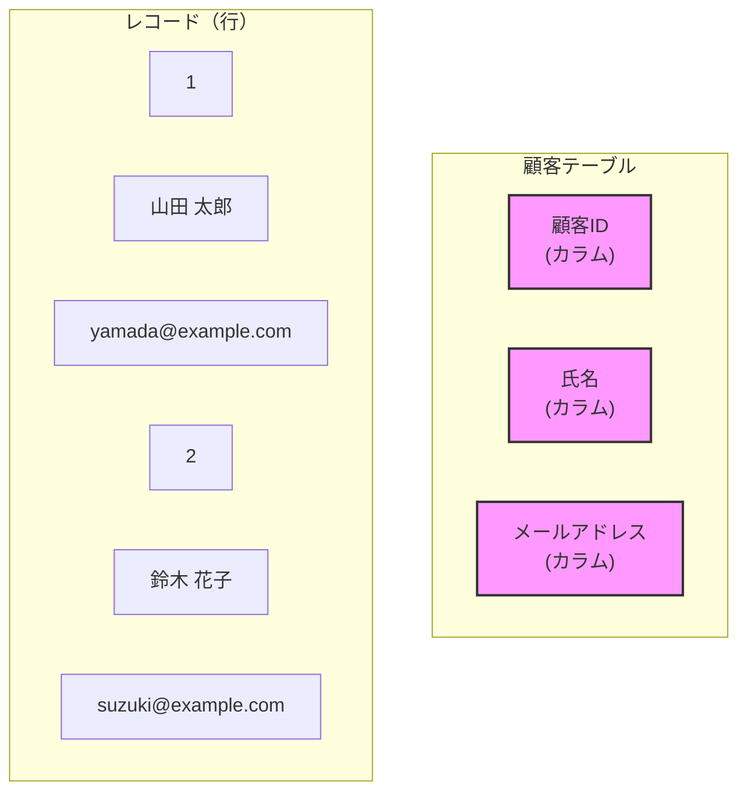
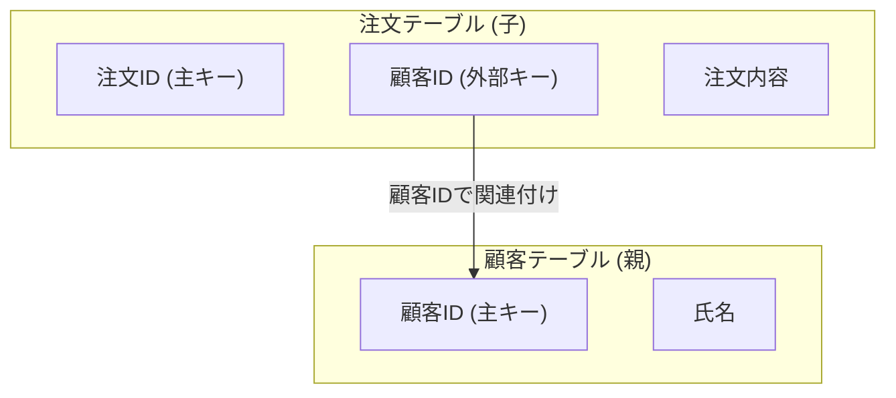

# 第8章 リレーショナルデータベース完全マスター：データの世界を制する - プロレベル実践

## 🎯 この章で学ぶこと

### 🔰 基本レベル
- リレーショナルデータベース(RDB)の基本的な仕組みとデータモデルを理解する
- テーブル、キー（主キー、外部キー）などのRDBの中心的な概念を説明できる
- データの整合性を保つための「正規化」の重要性と基本的な手順を理解する
- 実際の開発でどのようにRDBが使われるかのイメージを掴む

### 🔥 実践レベル
- エンタープライズレベルのデータベース設計ができる
- 高度な正規化とパフォーマンス最適化を実践できる
- トランザクションとACID特性を深く理解し、活用できる
- インデックス戦略とクエリ最適化を実践できる

### 🚀 上級レベル
- 分散データベースとレプリケーション戦略を設計できる
- 大規模データを扱うシャーディングとパーティショニングを実装できる
- データベースセキュリティと暗号化を実践できる
- NoSQLとの適切な使い分けを判断できる

### 🎯 プロレベル
- 数百万〜数億レコード規模のデータベースを設計・運用できる
- 高可用性・災害復旧を考慮したDB アーキテクチャを設計できる
- データベース監視・チューニングをプロフェッショナルレベルで実践できる
- ミッションクリティカルなシステムでのデータ整合性を保証できる

### 🤖 AIとの協働レベル
- AIを活用したデータベース設計とスキーマ最適化を実践できる
- AI支援によるクエリ最適化とパフォーマンスチューニングを効率化できる
- データベースの運用監視をAIと協働で自動化できる
- AIとのデータ連携システムを設計・構築できる

## 🤔 なぜ重要なのか

### 🌟 現代ビジネスにおけるデータベースの価値

Webアプリケーションや業務システムなど、私たちが日常的に利用するサービスの多くは、その裏側でリレーショナルデータベースを利用してデータを管理しています。例えば、ECサイトのユーザー情報や購入履歴、ブログの記事やコメントなど、構造化されたデータを正確かつ効率的に扱うためにRDBは不可欠です。

### 🏗️ エンジニアとしての競争力の源泉

**1. システムの心臓部を理解する**
```sql
-- データベース設計の良し悪しがシステム全体に与える影響
-- 悪い設計：非正規化されたテーブル
CREATE TABLE bad_orders (
    order_id INT PRIMARY KEY,
    customer_name VARCHAR(100),
    customer_email VARCHAR(100),
    customer_address TEXT,
    product_name VARCHAR(200),
    product_price DECIMAL(10,2),
    product_category VARCHAR(50)
);
-- 問題：顧客情報の重複、商品情報の重複、更新時の不整合リスク

-- 良い設計：正規化されたテーブル群
CREATE TABLE customers (
    customer_id INT PRIMARY KEY,
    name VARCHAR(100),
    email VARCHAR(100) UNIQUE,
    address TEXT
);

CREATE TABLE products (
    product_id INT PRIMARY KEY,
    name VARCHAR(200),
    price DECIMAL(10,2),
    category_id INT,
    FOREIGN KEY (category_id) REFERENCES categories(category_id)
);

CREATE TABLE orders (
    order_id INT PRIMARY KEY,
    customer_id INT,
    product_id INT,
    quantity INT,
    order_date TIMESTAMP DEFAULT CURRENT_TIMESTAMP,
    FOREIGN KEY (customer_id) REFERENCES customers(customer_id),
    FOREIGN KEY (product_id) REFERENCES products(product_id)
);
-- 利点：データ整合性保証、保守性向上、パフォーマンス最適化可能
```

**2. パフォーマンス問題の根本解決**
```sql
-- インデックスの威力：100万件のデータから1件を検索
-- インデックスなし：平均50万回のスキャン（数秒）
SELECT * FROM users WHERE email = 'user@example.com';

-- インデックスあり：平均20回程度のアクセス（数ミリ秒）
CREATE INDEX idx_users_email ON users(email);
SELECT * FROM users WHERE email = 'user@example.com';

-- 複合インデックスによる高度な最適化
CREATE INDEX idx_orders_customer_date ON orders(customer_id, order_date);
-- customer_idとorder_dateの組み合わせ検索が超高速化
```

**3. ビジネス成長への対応力**
```sql
-- スケーラビリティを考慮したテーブル設計
-- パーティショニングによる大容量データ対応
CREATE TABLE order_history (
    order_id BIGINT,
    customer_id INT,
    product_id INT,
    order_date DATE,
    amount DECIMAL(12,2)
) PARTITION BY RANGE (YEAR(order_date)) (
    PARTITION p2020 VALUES LESS THAN (2021),
    PARTITION p2021 VALUES LESS THAN (2022),
    PARTITION p2022 VALUES LESS THAN (2023),
    PARTITION p2023 VALUES LESS THAN (2024),
    PARTITION p_future VALUES LESS THAN MAXVALUE
);
-- 年度別分割により、過去データの検索負荷を軽減
```

### 🤖 AIとの協働における優位性

**効果的なAI指示の例**：
```
悪い指示:
「ECサイトのデータベースを作って」
→ AIが基本的な構造しか生成できない

良い指示:
「以下の要件でECサイトのデータベースを設計してください：
1. 第3正規形まで正規化
2. 顧客、商品、注文、在庫を管理
3. 月間100万注文に対応できるインデックス戦略
4. 顧客の購入履歴分析用のビューも含める
5. PostgreSQL前提で、ACID特性を最大限活用
6. 将来的なシャーディングを考慮した設計
7. セキュリティ要件：PII（個人識別情報）の暗号化対応」
→ AIが高品質でスケーラブルな設計を生成
```

### 🎯 実際のビジネスインパクト

**1. パフォーマンス改善の経済効果**
- データベース最適化により応答時間50%短縮 → ユーザー体験向上 → コンバージョン率10%向上
- 適切なインデックス設計により、サーバーリソース30%削減 → インフラコスト年間数百万円削減

**2. データ整合性による信頼性確保**
- トランザクション処理により、金融取引での不整合ゼロ
- 外部キー制約により、参照整合性エラーを設計段階で防止

**3. 開発効率の向上**
- 適切な正規化により、新機能追加時のテーブル変更工数50%削減
- データベース設計の標準化により、チーム開発の生産性20%向上

### 🔥 業界での位置づけ

**現代のテクノロジー企業での必須スキル**：
- **GAFAM**: 全社でPostgreSQL、MySQL、SQL Serverなどを大規模運用
- **フィンテック**: データ整合性が生命線、RDBの深い理解が必須
- **Eコマース**: リアルタイム在庫管理、トランザクション処理での高度なDB技術が競争力の源泉
- **SaaS企業**: マルチテナント対応、高可用性設計での差別化

AIに指示してアプリケーションを自動生成することは可能ですが、どのようなデータを、どのような構造で保存するかという「データモデリング」は、システムの性能や拡張性に直結する非常に重要な設計作業です。この設計を誤ると、後から修正するのが非常に困難になったり、パフォーマンスの悪化を招いたりします。本質的なデータ管理の考え方を理解することで、AIの生成するコードの妥当性を判断し、より堅牢でスケーラブルなシステムを構築できるようになります。

## 📚 基礎概念の理解

### 🏗️ リレーショナルモデルの深層理解

リレーショナルモデルとは、データを「リレーション（関連）」の集まりとして表現するデータモデルです。最も一般的な実装が、データを二次元の**テーブル（表）**形式で管理する方法です。

#### 数学的基盤：関係代数
```sql
-- リレーショナルモデルは関係代数に基づく
-- 1. 選択 (Selection): σ
SELECT * FROM users WHERE age >= 18;

-- 2. 射影 (Projection): π
SELECT name, email FROM users;

-- 3. 結合 (Join): ⋈
SELECT u.name, o.order_date 
FROM users u JOIN orders o ON u.user_id = o.user_id;

-- 4. 和集合 (Union): ∪
SELECT name FROM customers UNION SELECT name FROM suppliers;

-- 5. 差集合 (Difference): -
SELECT name FROM all_users EXCEPT SELECT name FROM inactive_users;
```

#### 現代的な理解：オブジェクト関係マッピング
```sql
-- テーブル設計がプログラムの構造に直結
-- User クラス → users テーブル
CREATE TABLE users (
    id SERIAL PRIMARY KEY,
    username VARCHAR(50) UNIQUE NOT NULL,
    email VARCHAR(100) UNIQUE NOT NULL,
    password_hash VARCHAR(255) NOT NULL,
    created_at TIMESTAMP DEFAULT CURRENT_TIMESTAMP,
    updated_at TIMESTAMP DEFAULT CURRENT_TIMESTAMP
);

-- Order クラス → orders テーブル（1対多関係）
CREATE TABLE orders (
    id SERIAL PRIMARY KEY,
    user_id INTEGER REFERENCES users(id),
    total_amount DECIMAL(10,2) NOT NULL,
    status VARCHAR(20) DEFAULT 'pending',
    created_at TIMESTAMP DEFAULT CURRENT_TIMESTAMP
);

-- OrderItem クラス → order_items テーブル（多対多関係）
CREATE TABLE order_items (
    id SERIAL PRIMARY KEY,
    order_id INTEGER REFERENCES orders(id),
    product_id INTEGER REFERENCES products(id),
    quantity INTEGER NOT NULL CHECK (quantity > 0),
    unit_price DECIMAL(10,2) NOT NULL
);
```

**身近な例**: Excelのスプレッドシートを想像してみてください。行と列を使ってデータを整理しますよね。例えば、「顧客リスト」シートがあり、1行に1人の顧客情報（氏名、住所、電話番号など）が、各列に対応する項目名（氏名、住所、電話番号）が入っている状態です。これがリレーショナルモデルの基本的な考え方です。RDBでは、このExcelシート（テーブル）を複数作成し、それらを関連付けながらデータを管理していきます。

### テーブル、レコード、カラム
RDBの最も基本的な構成要素です。

- **テーブル (Table)**: データを格納するための表です。Excelのシートに相当します。例：「顧客テーブル」「商品テーブル」。
- **レコード (Record) / 行 (Row)**: テーブル内の一つのデータの単位です。Excelの「行」に相当します。例：「顧客テーブル」における「山田太郎さんの情報」。
- **カラム (Column) / フィールド (Field)**: テーブル内のデータの属性です。Excelの「列」に相当します。例：「顧客テーブル」における「氏名」「住所」「電話番号」。



### 主キー (Primary Key) と外部キー (Foreign Key)
複数のテーブルを関連付けるために「キー」という概念が非常に重要になります。

- **主キー (Primary Key)**:
    - **定義**: テーブル内の各レコードを一意に識別するためのカラムです。
    - **ルール**: `NULL` (空) であってはならず、重複も許されません。
    - **例**: 「顧客テーブル」の「顧客ID」、「商品テーブル」の「商品ID」など。このIDがあれば、特定の顧客や商品を間違いなく一つに特定できます。

- **外部キー (Foreign Key)**:
    - **定義**: 他のテーブルの主キーを参照するカラムです。これにより、テーブル同士の関連（リレーション）を表現します。
    - **例**: 「注文テーブル」に「顧客ID」というカラムを設けた場合、この「顧客ID」は「顧客テーブル」の主キーを参照する外部キーとなります。これにより、「どの顧客が」「どの商品を注文したか」を紐付けることができます。



### 正規化 (Normalization)
正規化とは、データの重複をなくし、整合性を保つためにテーブルを適切に分割するプロセスです。正規化を行うことで、データ更新時の不整合（更新漏れなど）を防ぎ、データベースをより効率的で管理しやすい状態に保ちます。

- **なぜ必要か？**: 例えば、顧客の住所を注文のたびに「注文テーブル」に保存していると、同じ顧客が引っ越した場合に、過去の全ての注文データの住所を更新しなければならなくなります。これは非常に手間がかかり、更新漏れのリスクも高いです。正規化によって顧客情報は「顧客テーブル」に一元管理され、このような問題を防ぐことができます。

- **正規化の段階**: 第1正規形、第2正規形、第3正規形…と段階がありますが、まずは「**一つの事実は一つの場所にのみ保存する**」という原則を理解することが重要です。

## 💡 実践的な活用

### 実際の開発での使用例
簡単なブログシステムを例に考えてみましょう。

- **要件**:
    - ユーザーは記事を投稿できる。
    - 各記事には複数のコメントを付けることができる。

- **テーブル設計**:
    1.  **users (ユーザーテーブル)**
        - `user_id` (主キー)
        - `username`
        - `email`
    2.  **posts (記事テーブル)**
        - `post_id` (主キー)
        - `user_id` (外部キー, usersテーブルを参照)
        - `title`
        - `content`
        - `created_at`
    3.  **comments (コメントテーブル)**
        - `comment_id` (主キー)
        - `post_id` (外部キー, postsテーブルを参照)
        - `user_id` (外部キー, usersテーブルを参照)
        - `comment_text`
        - `created_at`

このようにテーブルを分けることで、「誰が」「いつ」「どの記事に」「どんなコメントをしたか」という情報を、データの重複なく効率的に管理できます。

## 🔥 プロレベル：高度なデータベース設計

### 🎯 エンタープライズレベルの正規化戦略

#### 完全な正規化プロセス（第1〜第5正規形）

```sql
-- 非正規化テーブル（悪い例）
CREATE TABLE customer_orders_denormalized (
    order_id INT,
    customer_name VARCHAR(100),
    customer_email VARCHAR(100),
    customer_phone VARCHAR(20),
    product_name VARCHAR(200),
    product_price DECIMAL(10,2),
    product_category VARCHAR(50),
    supplier_name VARCHAR(100),
    supplier_contact VARCHAR(100),
    order_quantity INT,
    order_date DATE
);
-- 問題：更新異常、挿入異常、削除異常が発生

-- 第1正規形：原子値のみ
CREATE TABLE orders_1nf (
    order_id INT,
    customer_id INT,
    customer_name VARCHAR(100),
    customer_email VARCHAR(100),
    customer_phone VARCHAR(20),
    product_id INT,
    product_name VARCHAR(200),
    product_price DECIMAL(10,2),
    category_name VARCHAR(50),
    supplier_id INT,
    supplier_name VARCHAR(100),
    supplier_contact VARCHAR(100),
    quantity INT,
    order_date DATE,
    PRIMARY KEY (order_id, product_id)
);

-- 第2正規形：部分関数従属を除去
CREATE TABLE customers_2nf (
    customer_id INT PRIMARY KEY,
    customer_name VARCHAR(100),
    customer_email VARCHAR(100) UNIQUE,
    customer_phone VARCHAR(20)
);

CREATE TABLE products_2nf (
    product_id INT PRIMARY KEY,
    product_name VARCHAR(200),
    product_price DECIMAL(10,2),
    category_name VARCHAR(50),
    supplier_id INT,
    supplier_name VARCHAR(100),
    supplier_contact VARCHAR(100)
);

CREATE TABLE orders_2nf (
    order_id INT,
    product_id INT,
    customer_id INT,
    quantity INT,
    order_date DATE,
    PRIMARY KEY (order_id, product_id),
    FOREIGN KEY (customer_id) REFERENCES customers_2nf(customer_id),
    FOREIGN KEY (product_id) REFERENCES products_2nf(product_id)
);

-- 第3正規形：推移関数従属を除去
CREATE TABLE categories_3nf (
    category_id INT PRIMARY KEY,
    category_name VARCHAR(50) UNIQUE
);

CREATE TABLE suppliers_3nf (
    supplier_id INT PRIMARY KEY,
    supplier_name VARCHAR(100),
    supplier_contact VARCHAR(100)
);

CREATE TABLE products_3nf (
    product_id INT PRIMARY KEY,
    product_name VARCHAR(200),
    product_price DECIMAL(10,2),
    category_id INT,
    supplier_id INT,
    FOREIGN KEY (category_id) REFERENCES categories_3nf(category_id),
    FOREIGN KEY (supplier_id) REFERENCES suppliers_3nf(supplier_id)
);

-- BCNF（ボイス・コッド正規形）：すべての関数従属で左辺が候補キー
-- 第4正規形：多値従属を除去
-- 第5正規形：結合従属を除去
```

#### 実用的な非正規化戦略
```sql
-- パフォーマンスのための戦略的非正規化
CREATE TABLE order_summary (
    order_id INT PRIMARY KEY,
    customer_id INT,
    customer_name VARCHAR(100), -- 非正規化：結合コスト削減
    total_amount DECIMAL(12,2),
    item_count INT, -- 非正規化：集計結果をキャッシュ
    order_date DATE,
    status VARCHAR(20),
    created_at TIMESTAMP,
    updated_at TIMESTAMP,
    
    -- インデックス戦略
    INDEX idx_customer_date (customer_id, order_date),
    INDEX idx_status_date (status, order_date),
    INDEX idx_total_amount (total_amount)
);

-- マテリアライズドビューによる集計データ管理
CREATE MATERIALIZED VIEW monthly_sales_summary AS
SELECT 
    DATE_FORMAT(order_date, '%Y-%m') as month,
    COUNT(*) as order_count,
    SUM(total_amount) as total_revenue,
    AVG(total_amount) as avg_order_value,
    COUNT(DISTINCT customer_id) as unique_customers
FROM order_summary 
WHERE status = 'completed'
GROUP BY DATE_FORMAT(order_date, '%Y-%m');

-- 定期的な更新
-- REFRESH MATERIALIZED VIEW monthly_sales_summary;
```

### 🚀 大規模システムでのスケーラビリティ戦略

#### 水平分散（シャーディング）
```sql
-- ユーザーIDベースのシャーディング
-- シャード1：user_id % 4 = 0
CREATE TABLE users_shard_0 (
    user_id BIGINT PRIMARY KEY,
    username VARCHAR(50),
    email VARCHAR(100),
    created_at TIMESTAMP,
    CHECK (user_id % 4 = 0)
);

-- シャード2：user_id % 4 = 1
CREATE TABLE users_shard_1 (
    user_id BIGINT PRIMARY KEY,
    username VARCHAR(50),
    email VARCHAR(100),
    created_at TIMESTAMP,
    CHECK (user_id % 4 = 1)
);

-- シャードルーティングロジック（アプリケーション層）
/*
function getShardForUser(userId) {
    const shardNumber = userId % 4;
    return `users_shard_${shardNumber}`;
}
*/

-- 時系列データの時間ベースシャーディング
CREATE TABLE user_activities_2024_01 (
    activity_id BIGINT PRIMARY KEY,
    user_id BIGINT,
    activity_type VARCHAR(50),
    activity_data JSON,
    created_at TIMESTAMP,
    CHECK (created_at >= '2024-01-01' AND created_at < '2024-02-01')
);

CREATE TABLE user_activities_2024_02 (
    activity_id BIGINT PRIMARY KEY,
    user_id BIGINT,
    activity_type VARCHAR(50),
    activity_data JSON,
    created_at TIMESTAMP,
    CHECK (created_at >= '2024-02-01' AND created_at < '2024-03-01')
);
```

#### 垂直分散（機能別分離）
```sql
-- ユーザー基本情報（高頻度アクセス）
CREATE TABLE user_profiles (
    user_id BIGINT PRIMARY KEY,
    username VARCHAR(50),
    email VARCHAR(100),
    status VARCHAR(20),
    last_login TIMESTAMP
);

-- ユーザー詳細情報（低頻度アクセス）
CREATE TABLE user_details (
    user_id BIGINT PRIMARY KEY,
    first_name VARCHAR(50),
    last_name VARCHAR(50),
    birth_date DATE,
    phone VARCHAR(20),
    address TEXT,
    bio TEXT,
    FOREIGN KEY (user_id) REFERENCES user_profiles(user_id)
);

-- ユーザー設定（中頻度アクセス）
CREATE TABLE user_preferences (
    user_id BIGINT PRIMARY KEY,
    language VARCHAR(10),
    timezone VARCHAR(50),
    notification_settings JSON,
    privacy_settings JSON,
    FOREIGN KEY (user_id) REFERENCES user_profiles(user_id)
);
```

### 🎯 高度なインデックス戦略

#### 複合インデックスの最適化
```sql
-- インデックスの列順序が重要
CREATE TABLE order_analytics (
    order_id BIGINT PRIMARY KEY,
    customer_id INT,
    order_date DATE,
    status VARCHAR(20),
    total_amount DECIMAL(10,2),
    region VARCHAR(50)
);

-- 効率的な複合インデックス設計
-- 1. 範囲検索の列は最後に
CREATE INDEX idx_customer_status_date ON order_analytics(customer_id, status, order_date);

-- 2. 選択性の高い列を前に
CREATE INDEX idx_status_region_amount ON order_analytics(status, region, total_amount);

-- 3. カバリングインデックス（INCLUDE句）
CREATE INDEX idx_customer_covering ON order_analytics(customer_id) 
INCLUDE (order_date, total_amount, status);

-- 使用例とクエリプラン分析
EXPLAIN ANALYZE
SELECT order_date, total_amount, status 
FROM order_analytics 
WHERE customer_id = 12345
ORDER BY order_date DESC
LIMIT 10;
```

#### 部分インデックスとファンクショナルインデックス
```sql
-- 部分インデックス：条件を満たすレコードのみ
CREATE INDEX idx_active_users_email ON users(email) 
WHERE status = 'active';

CREATE INDEX idx_recent_orders ON orders(customer_id, order_date)
WHERE order_date >= CURRENT_DATE - INTERVAL '1 year';

-- ファンクショナルインデックス：計算結果にインデックス
CREATE INDEX idx_user_email_lower ON users(LOWER(email));
CREATE INDEX idx_product_name_search ON products(to_tsvector('english', product_name));

-- JSON列のインデックス（PostgreSQL）
CREATE INDEX idx_user_preferences_lang ON user_preferences 
USING GIN ((preferences->>'language'));

-- 使用例
SELECT * FROM users WHERE LOWER(email) = LOWER('User@Example.COM');
SELECT * FROM products WHERE to_tsvector('english', product_name) @@ to_tsquery('laptop');
```

### 🔒 トランザクションとACID特性の実践

#### 高度なトランザクション制御
```sql
-- 分離レベルの理解と活用
-- 1. READ UNCOMMITTED（ダーティリード）
SET TRANSACTION ISOLATION LEVEL READ UNCOMMITTED;
-- 用途：リアルタイム監視、概算統計

-- 2. READ COMMITTED（ノンリピータブルリード）
SET TRANSACTION ISOLATION LEVEL READ COMMITTED;
-- 用途：一般的なWebアプリケーション

-- 3. REPEATABLE READ（ファントムリード）
SET TRANSACTION ISOLATION LEVEL REPEATABLE READ;
-- 用途：金融システム、在庫管理

-- 4. SERIALIZABLE（完全分離）
SET TRANSACTION ISOLATION LEVEL SERIALIZABLE;
-- 用途：会計システム、クリティカルなビジネス処理

-- 実践例：銀行振込システム
BEGIN TRANSACTION ISOLATION LEVEL SERIALIZABLE;

DECLARE @source_balance DECIMAL(12,2);
DECLARE @transfer_amount DECIMAL(12,2) = 10000.00;

-- 送金元の残高確認
SELECT @source_balance = balance 
FROM accounts 
WHERE account_id = 'ACC001' 
FOR UPDATE; -- 行ロック

-- 残高チェック
IF @source_balance < @transfer_amount
BEGIN
    ROLLBACK TRANSACTION;
    THROW 50001, '残高不足です', 1;
END

-- 送金処理
UPDATE accounts 
SET balance = balance - @transfer_amount,
    updated_at = CURRENT_TIMESTAMP
WHERE account_id = 'ACC001';

UPDATE accounts 
SET balance = balance + @transfer_amount,
    updated_at = CURRENT_TIMESTAMP
WHERE account_id = 'ACC002';

-- 監査ログ
INSERT INTO transaction_logs (
    from_account, to_account, amount, 
    transaction_type, created_at
) VALUES (
    'ACC001', 'ACC002', @transfer_amount,
    'TRANSFER', CURRENT_TIMESTAMP
);

COMMIT TRANSACTION;
```

#### デッドロック対策
```sql
-- デッドロック回避のための順序ロック
-- 悪い例：デッドロックが発生しやすい
/*
Transaction A: 
UPDATE accounts SET balance = balance - 100 WHERE id = 1;
UPDATE accounts SET balance = balance + 100 WHERE id = 2;

Transaction B:
UPDATE accounts SET balance = balance - 50 WHERE id = 2;
UPDATE accounts SET balance = balance + 50 WHERE id = 1;
*/

-- 良い例：常にIDの昇順でロック
CREATE PROCEDURE transfer_funds(
    @from_account_id INT,
    @to_account_id INT,
    @amount DECIMAL(10,2)
)
AS
BEGIN
    DECLARE @min_id INT = CASE WHEN @from_account_id < @to_account_id 
                              THEN @from_account_id ELSE @to_account_id END;
    DECLARE @max_id INT = CASE WHEN @from_account_id > @to_account_id 
                              THEN @from_account_id ELSE @to_account_id END;
    
    BEGIN TRANSACTION;
    
    -- 常に小さいIDから順番にロック
    UPDATE accounts SET balance = balance 
    WHERE account_id = @min_id;
    
    UPDATE accounts SET balance = balance 
    WHERE account_id = @max_id;
    
    -- 実際の残高更新
    UPDATE accounts 
    SET balance = balance - @amount 
    WHERE account_id = @from_account_id;
    
    UPDATE accounts 
    SET balance = balance + @amount 
    WHERE account_id = @to_account_id;
    
    COMMIT TRANSACTION;
END;
```

### 🛡️ セキュリティとデータ保護

#### 行レベルセキュリティ（Row Level Security）
```sql
-- マルチテナント対応のセキュリティ
CREATE TABLE tenant_data (
    id SERIAL PRIMARY KEY,
    tenant_id INT NOT NULL,
    sensitive_data TEXT,
    created_at TIMESTAMP DEFAULT CURRENT_TIMESTAMP
);

-- 行レベルセキュリティの有効化
ALTER TABLE tenant_data ENABLE ROW LEVEL SECURITY;

-- テナント別アクセス制御ポリシー
CREATE POLICY tenant_isolation ON tenant_data
    FOR ALL TO application_role
    USING (tenant_id = current_setting('app.current_tenant_id')::INT);

-- アプリケーションでの使用
-- SET app.current_tenant_id = 1001;
-- SELECT * FROM tenant_data; -- テナント1001のデータのみ表示
```

#### データ暗号化とマスキング
```sql
-- 列レベル暗号化
CREATE TABLE customer_pii (
    customer_id INT PRIMARY KEY,
    name VARCHAR(100),
    email VARCHAR(100),
    -- PII（個人識別情報）の暗号化
    ssn VARBINARY(256), -- 暗号化されたSSN
    credit_card VARBINARY(256), -- 暗号化されたクレジットカード番号
    phone_encrypted VARBINARY(256),
    created_at TIMESTAMP DEFAULT CURRENT_TIMESTAMP
);

-- 暗号化関数の使用例（PostgreSQL + pgcrypto）
INSERT INTO customer_pii (customer_id, name, email, ssn, credit_card)
VALUES (
    1001,
    'John Doe',
    'john@example.com',
    pgp_sym_encrypt('123-45-6789', 'encryption_key'),
    pgp_sym_encrypt('1234-5678-9012-3456', 'card_encryption_key')
);

-- 復号化（適切な権限を持つユーザーのみ）
SELECT 
    customer_id,
    name,
    email,
    pgp_sym_decrypt(ssn, 'encryption_key') as decrypted_ssn,
    -- クレジットカード番号のマスキング表示
    CONCAT(
        REPEAT('*', 12),
        RIGHT(pgp_sym_decrypt(credit_card, 'card_encryption_key'), 4)
    ) as masked_card
FROM customer_pii
WHERE customer_id = 1001;
```

### 📊 パフォーマンス監視と最適化

#### クエリパフォーマンス分析
```sql
-- 実行計画の詳細分析
EXPLAIN (ANALYZE, BUFFERS, FORMAT JSON)
SELECT 
    c.name,
    COUNT(o.order_id) as order_count,
    SUM(o.total_amount) as total_spent
FROM customers c
LEFT JOIN orders o ON c.customer_id = o.customer_id
WHERE c.created_at >= '2024-01-01'
GROUP BY c.customer_id, c.name
HAVING COUNT(o.order_id) > 5
ORDER BY total_spent DESC
LIMIT 100;

-- インデックス使用状況の監視
SELECT 
    schemaname,
    tablename,
    indexname,
    idx_scan as index_scans,
    idx_tup_read as tuples_read,
    idx_tup_fetch as tuples_fetched
FROM pg_stat_user_indexes
WHERE idx_scan = 0  -- 使用されていないインデックス
ORDER BY schemaname, tablename;

-- 重いクエリの特定
SELECT 
    query,
    calls,
    total_time,
    mean_time,
    rows,
    100.0 * shared_blks_hit / nullif(shared_blks_hit + shared_blks_read, 0) AS hit_percent
FROM pg_stat_statements
ORDER BY total_time DESC
LIMIT 10;
```

### 🔄 レプリケーションと高可用性

#### マスター・スレーブレプリケーション
```sql
-- マスターデータベース設定
-- postgresql.conf
wal_level = replica
max_wal_senders = 3
checkpoint_segments = 8
wal_keep_segments = 32

-- pg_hba.conf（レプリケーション用ユーザー）
host replication replicator 192.168.1.0/24 md5

-- レプリケーションユーザー作成
CREATE USER replicator REPLICATION LOGIN ENCRYPTED PASSWORD 'secure_password';

-- スレーブでの初期化（コマンドライン）
-- pg_basebackup -h master_host -D /var/lib/postgresql/data -U replicator -P -v -R -W

-- 読み取り専用クエリの分散
-- アプリケーション層でのルーティング
/*
// 読み取りクエリはスレーブへ
const readQuery = "SELECT * FROM products WHERE category_id = ?";
const readResult = await slaveDB.query(readQuery, [categoryId]);

// 書き込みクエリはマスターへ
const writeQuery = "INSERT INTO orders (customer_id, total_amount) VALUES (?, ?)";
const writeResult = await masterDB.query(writeQuery, [customerId, amount]);
*/
```

### ハンズオン：テーブル設計の勘所
オンラインストアの簡単な商品管理システムを設計してみましょう。

- **課題**: 「商品」と「カテゴリ」を管理するためのテーブルを設計してください。
    - 商品には、商品名、価格、商品説明がある。
    - 各商品は、一つのカテゴリに属する。（例：商品「Tシャツ」はカテゴリ「衣類」に属する）
    - カテゴリには、カテゴリ名がある。

- **期待される結果（テーブル定義）**:
    - **categories (カテゴリテーブル)**
        - `category_id` (主キー, INT)
        - `category_name` (VARCHAR)
    - **products (商品テーブル)**
        - `product_id` (主キー, INT)
        - `product_name` (VARCHAR)
        - `price` (DECIMAL)
        - `description` (TEXT)
        - `category_id` (外部キー, categoriesテーブルを参照)

- **トラブルシューティング（よくある落とし穴）**:
    - **× やってはいけない設計**: `products`テーブルに`category_name`を直接保存してしまう。
    - **？ なぜダメか**: カテゴリ名が変更された場合（例：「家電」→「生活家電」）、そのカテゴリに属するすべての商品のレコードを更新する必要があり、大変です。カテゴリは独立したテーブルで管理するのがベストプラクティスです。

## 🤖 AIとの協働でのデータベース設計

### 🎯 AI支援データベースオーケストレーション

#### AIデータベースアーキテクト
```typescript
// AI支援データベース設計システム
class AIDataBaseDesigner {
    private aiModel: string;
    private schemas: Map<string, DatabaseSchema>;
    private optimizationHistory: OptimizationRecord[];
    
    constructor(aiModel: string) {
        this.aiModel = aiModel;
        this.schemas = new Map();
        this.optimizationHistory = [];
    }
    
    // AIによる自動スキーマ設計
    async generateSchema(requirements: BusinessRequirements): Promise<DatabaseSchema> {
        const prompt = `
        以下の要件から最適なデータベーススキーマを設計してください：
        
        要件：
        - ビジネス要件: ${requirements.businessRules}
        - 予想データ量: ${requirements.expectedDataVolume}
        - 同時接続数: ${requirements.concurrentUsers}
        - 読み取り/書き込み比率: ${requirements.readWriteRatio}
        - 成長予測: ${requirements.growthProjection}
        
        設計指針：
        1. 第3正規形まで正規化
        2. 適切なインデックス戦略
        3. パフォーマンスを考慮した分散設計
        4. セキュリティとプライバシー要件
        5. 将来の拡張性を考慮
        
        出力形式：SQL DDL + 詳細解説
        `;
        
        const aiResponse = await this.callAI(prompt);
        return this.parseSchema(aiResponse);
    }
    
    // AI支援クエリ最適化
    async optimizeQuery(query: string, executionPlan: ExecutionPlan): Promise<OptimizedQuery> {
        const prompt = `
        以下のクエリを最適化してください：
        
        元のクエリ：
        ${query}
        
        現在の実行計画：
        ${JSON.stringify(executionPlan, null, 2)}
        
        最適化の観点：
        1. インデックス使用の最適化
        2. 結合順序の最適化
        3. 条件句の最適化
        4. パーティション活用
        5. 統計情報の活用
        
        出力：最適化されたクエリ + 推奨インデックス + 理由
        `;
        
        const aiResponse = await this.callAI(prompt);
        return this.parseOptimization(aiResponse);
    }
    
    // AIによる容量計画
    async planCapacity(currentMetrics: DatabaseMetrics): Promise<CapacityPlan> {
        const prompt = `
        データベースの容量計画を作成してください：
        
        現在の状況：
        - テーブル数: ${currentMetrics.tableCount}
        - 総レコード数: ${currentMetrics.totalRecords}
        - データサイズ: ${currentMetrics.dataSize}
        - 平均QPM: ${currentMetrics.averageQPM}
        - ピーク時QPM: ${currentMetrics.peakQPM}
        
        予測：
        - 成長率: ${currentMetrics.growthRate}%/月
        - 予測期間: 12ヶ月
        
        出力：
        1. 容量増加予測
        2. パフォーマンス劣化予測
        3. 推奨アクション（スケールアップ/アウト）
        4. 最適化提案
        `;
        
        const aiResponse = await this.callAI(prompt);
        return this.parseCapacityPlan(aiResponse);
    }
    
    private async callAI(prompt: string): Promise<string> {
        // AI APIの呼び出し実装
        return "AI response";
    }
}

// 使用例
const dbDesigner = new AIDataBaseDesigner("gpt-4");

const requirements: BusinessRequirements = {
    businessRules: "Eコマースプラットフォーム、多店舗対応、リアルタイム在庫管理",
    expectedDataVolume: "1000万商品、100万ユーザー、月間1000万注文",
    concurrentUsers: 10000,
    readWriteRatio: "70:30",
    growthProjection: "月間20%成長"
};

const schema = await dbDesigner.generateSchema(requirements);
console.log("AI設計スキーマ:", schema);
```

#### AI監視・アラートシステム
```sql
-- AI支援パフォーマンス監視
CREATE TABLE ai_performance_insights (
    insight_id SERIAL PRIMARY KEY,
    database_name VARCHAR(100),
    insight_type VARCHAR(50), -- 'slow_query', 'index_suggestion', 'capacity_alert'
    severity_level VARCHAR(20), -- 'low', 'medium', 'high', 'critical'
    ai_analysis TEXT,
    recommended_action TEXT,
    expected_improvement TEXT,
    created_at TIMESTAMP DEFAULT CURRENT_TIMESTAMP,
    applied_at TIMESTAMP NULL,
    impact_measured BOOLEAN DEFAULT FALSE
);

-- AI生成の最適化提案
CREATE TABLE ai_optimization_suggestions (
    suggestion_id SERIAL PRIMARY KEY,
    target_table VARCHAR(100),
    target_query TEXT,
    optimization_type VARCHAR(50), -- 'index', 'query_rewrite', 'partitioning'
    current_performance DECIMAL(10,2), -- 現在の実行時間（秒）
    predicted_performance DECIMAL(10,2), -- 予測改善後の実行時間（秒）
    confidence_score DECIMAL(3,2), -- AIの信頼度スコア
    implementation_sql TEXT,
    risk_assessment TEXT,
    created_at TIMESTAMP DEFAULT CURRENT_TIMESTAMP
);

-- AI学習用クエリパフォーマンス履歴
CREATE TABLE query_performance_history (
    history_id SERIAL PRIMARY KEY,
    query_hash VARCHAR(64), -- クエリのハッシュ値
    query_text TEXT,
    execution_time DECIMAL(10,3),
    rows_examined BIGINT,
    rows_returned BIGINT,
    index_usage JSON, -- 使用されたインデックス情報
    execution_plan JSON,
    database_load DECIMAL(5,2), -- 実行時のDBロード状況
    executed_at TIMESTAMP DEFAULT CURRENT_TIMESTAMP
);

-- AI予測アラート
CREATE OR REPLACE FUNCTION ai_performance_alert()
RETURNS TRIGGER AS $$
BEGIN
    -- 異常なパフォーマンス劣化を検知
    IF NEW.execution_time > (
        SELECT AVG(execution_time) * 3
        FROM query_performance_history
        WHERE query_hash = NEW.query_hash
        AND executed_at >= NOW() - INTERVAL '7 days'
    ) THEN
        INSERT INTO ai_performance_insights (
            database_name, insight_type, severity_level,
            ai_analysis, recommended_action
        ) VALUES (
            current_database(),
            'performance_degradation',
            'high',
            'クエリ実行時間が過去7日間の平均の3倍を超えました',
            'インデックスの再構築またはクエリの最適化を検討してください'
        );
    END IF;
    
    RETURN NEW;
END;
$$ LANGUAGE plpgsql;

CREATE TRIGGER trigger_ai_performance_alert
    AFTER INSERT ON query_performance_history
    FOR EACH ROW
    EXECUTE FUNCTION ai_performance_alert();
```

### 🎨 AI支援データベースコード生成

#### プロンプトエンジニアリング for データベース設計
```typescript
// 効果的なAI指示のテンプレート
class DatabasePromptBuilder {
    static buildSchemaDesignPrompt(requirements: any): string {
        return `
あなたは経験豊富なデータベースアーキテクトです。以下の要件に基づいて、エンタープライズレベルのデータベーススキーマを設計してください。

## 要件
${JSON.stringify(requirements, null, 2)}

## 設計指針
1. **正規化**: 第3正規形まで正規化し、必要に応じて戦略的な非正規化を適用
2. **パフォーマンス**: 予想される負荷に対して最適なインデックス戦略を提案
3. **スケーラビリティ**: 水平・垂直スケーリングを考慮した設計
4. **セキュリティ**: 行レベルセキュリティとデータ暗号化を考慮
5. **運用**: 監視、バックアップ、災害復旧を考慮

## 出力形式
1. 完全なSQL DDL
2. ER図（Mermaid形式）
3. インデックス戦略の詳細解説
4. 予想されるパフォーマンス特性
5. 運用上の考慮事項
6. 将来の拡張シナリオ

## 制約
- PostgreSQL 14以上を想定
- AWS RDS環境での運用を前提
- 99.9%の可用性要求
- GDPR準拠が必要
        `;
    }
    
    static buildQueryOptimizationPrompt(query: string, metrics: any): string {
        return `
以下のクエリを最適化してください。現在のパフォーマンス問題を分析し、具体的な改善策を提案してください。

## 対象クエリ
\`\`\`sql
${query}
\`\`\`

## 現在のパフォーマンス
- 実行時間: ${metrics.executionTime}ms
- 検索行数: ${metrics.rowsExamined}
- 返却行数: ${metrics.rowsReturned}
- インデックス使用: ${metrics.indexUsage}

## 最適化の観点
1. インデックス設計の改善
2. クエリ構造の最適化
3. 統計情報の活用
4. パーティション戦略
5. 結合順序の最適化

## 出力
1. 最適化されたクエリ
2. 推奨インデックス（DDL含む）
3. 期待される改善効果
4. 代替アプローチの提案
5. 監視すべきメトリクス
        `;
    }
    
    static buildCapacityPlanningPrompt(currentState: any, projections: any): string {
        return `
データベースの容量計画を作成してください。現在の状況と成長予測を基に、12ヶ月先までの詳細な計画を立案してください。

## 現在の状況
${JSON.stringify(currentState, null, 2)}

## 成長予測
${JSON.stringify(projections, null, 2)}

## 分析項目
1. データ量の増加予測
2. パフォーマンス劣化の予測
3. インフラリソースの必要量
4. コスト予測
5. 運用負荷の変化

## 出力
1. 12ヶ月の容量増加予測（月次）
2. 推奨アクション（時期と内容）
3. リスク分析と対策
4. 代替案の比較
5. 監視すべきKPI
        `;
    }
}
```

## 🚀 プロレベルハンズオン実践

### 🎯 課題1：大規模ECサイトのデータベース設計（中級）

#### 要件定義
```
システム要件：
- 月間1000万PV、10万アクティブユーザー
- 100万商品、1000店舗
- 月間100万注文
- リアルタイム在庫管理
- 推薦システム連携
- 多言語・多通貨対応
```

#### 設計チャレンジ
```sql
-- あなたの設計を実装してください
-- 以下は参考実装の一部

-- 1. 基本エンティティ設計
CREATE TABLE tenants (
    tenant_id SERIAL PRIMARY KEY,
    tenant_name VARCHAR(100) NOT NULL,
    subdomain VARCHAR(50) UNIQUE NOT NULL,
    created_at TIMESTAMP DEFAULT CURRENT_TIMESTAMP,
    status VARCHAR(20) DEFAULT 'active'
);

-- 2. マルチテナント対応ユーザーテーブル
CREATE TABLE users (
    user_id BIGSERIAL PRIMARY KEY,
    tenant_id INTEGER REFERENCES tenants(tenant_id),
    email VARCHAR(255) NOT NULL,
    password_hash VARCHAR(255) NOT NULL,
    profile_data JSONB,
    created_at TIMESTAMP DEFAULT CURRENT_TIMESTAMP,
    last_login TIMESTAMP,
    
    UNIQUE(tenant_id, email)
);

-- 3. 階層カテゴリ設計（ネストセットモデル）
CREATE TABLE categories (
    category_id SERIAL PRIMARY KEY,
    tenant_id INTEGER REFERENCES tenants(tenant_id),
    category_name VARCHAR(100) NOT NULL,
    parent_id INTEGER REFERENCES categories(category_id),
    lft INTEGER NOT NULL,
    rgt INTEGER NOT NULL,
    depth INTEGER NOT NULL,
    created_at TIMESTAMP DEFAULT CURRENT_TIMESTAMP
);

-- 4. 商品テーブル（バリエーション対応）
CREATE TABLE products (
    product_id BIGSERIAL PRIMARY KEY,
    tenant_id INTEGER REFERENCES tenants(tenant_id),
    sku VARCHAR(100) NOT NULL,
    product_name VARCHAR(255) NOT NULL,
    category_id INTEGER REFERENCES categories(category_id),
    base_price DECIMAL(10,2) NOT NULL,
    attributes JSONB, -- 商品固有属性
    search_vector tsvector, -- 全文検索用
    status VARCHAR(20) DEFAULT 'active',
    created_at TIMESTAMP DEFAULT CURRENT_TIMESTAMP,
    
    UNIQUE(tenant_id, sku)
);

-- 5. 在庫管理（リアルタイム更新対応）
CREATE TABLE inventory (
    inventory_id BIGSERIAL PRIMARY KEY,
    product_id BIGINT REFERENCES products(product_id),
    warehouse_id INTEGER,
    available_quantity INTEGER NOT NULL CHECK (available_quantity >= 0),
    reserved_quantity INTEGER NOT NULL DEFAULT 0,
    reorder_point INTEGER,
    last_updated TIMESTAMP DEFAULT CURRENT_TIMESTAMP,
    version INTEGER DEFAULT 1, -- 楽観的ロック用
    
    UNIQUE(product_id, warehouse_id)
);

-- 6. 注文テーブル（分散トランザクション対応）
CREATE TABLE orders (
    order_id BIGSERIAL PRIMARY KEY,
    tenant_id INTEGER REFERENCES tenants(tenant_id),
    user_id BIGINT REFERENCES users(user_id),
    order_number VARCHAR(50) UNIQUE NOT NULL,
    order_status VARCHAR(20) DEFAULT 'pending',
    total_amount DECIMAL(12,2) NOT NULL,
    currency_code VARCHAR(3) NOT NULL,
    payment_status VARCHAR(20) DEFAULT 'pending',
    shipping_address JSONB,
    billing_address JSONB,
    created_at TIMESTAMP DEFAULT CURRENT_TIMESTAMP,
    
    -- パーティション用
    PARTITION BY RANGE (created_at)
);

-- 月次パーティション作成
CREATE TABLE orders_2024_01 PARTITION OF orders
FOR VALUES FROM ('2024-01-01') TO ('2024-02-01');

-- 7. 注文詳細（在庫引当連動）
CREATE TABLE order_items (
    order_item_id BIGSERIAL PRIMARY KEY,
    order_id BIGINT REFERENCES orders(order_id),
    product_id BIGINT REFERENCES products(product_id),
    quantity INTEGER NOT NULL CHECK (quantity > 0),
    unit_price DECIMAL(10,2) NOT NULL,
    total_price DECIMAL(10,2) GENERATED ALWAYS AS (quantity * unit_price) STORED
);

-- 8. 在庫引当テーブル
CREATE TABLE inventory_allocations (
    allocation_id BIGSERIAL PRIMARY KEY,
    order_item_id BIGINT REFERENCES order_items(order_item_id),
    inventory_id BIGINT REFERENCES inventory(inventory_id),
    allocated_quantity INTEGER NOT NULL,
    allocation_status VARCHAR(20) DEFAULT 'allocated',
    expires_at TIMESTAMP,
    created_at TIMESTAMP DEFAULT CURRENT_TIMESTAMP
);
```

#### 高度なインデックス戦略
```sql
-- 複合インデックス戦略
CREATE INDEX idx_orders_tenant_status_date ON orders(tenant_id, order_status, created_at);
CREATE INDEX idx_orders_user_date ON orders(user_id, created_at DESC);

-- 部分インデックス
CREATE INDEX idx_orders_active ON orders(order_id, created_at) 
WHERE order_status IN ('pending', 'processing');

-- 全文検索インデックス
CREATE INDEX idx_products_search ON products 
USING GIN(search_vector);

-- JSON インデックス
CREATE INDEX idx_products_attributes ON products 
USING GIN(attributes);

-- 在庫管理用インデックス
CREATE INDEX idx_inventory_product_warehouse ON inventory(product_id, warehouse_id);
CREATE INDEX idx_inventory_low_stock ON inventory(available_quantity) 
WHERE available_quantity <= reorder_point;
```

### 🎯 課題2：リアルタイム分析システム（上級）

#### ストリーミングデータ処理
```sql
-- 1. イベントストリーミングテーブル
CREATE TABLE user_events (
    event_id BIGSERIAL PRIMARY KEY,
    user_id BIGINT,
    session_id VARCHAR(255),
    event_type VARCHAR(50),
    event_data JSONB,
    page_url TEXT,
    user_agent TEXT,
    ip_address INET,
    created_at TIMESTAMP DEFAULT CURRENT_TIMESTAMP,
    
    -- 時系列パーティション
    PARTITION BY RANGE (created_at)
);

-- 時間別パーティション（自動作成）
CREATE TABLE user_events_2024_01_01_00 PARTITION OF user_events
FOR VALUES FROM ('2024-01-01 00:00:00') TO ('2024-01-01 01:00:00');

-- 2. リアルタイム集計テーブル
CREATE TABLE realtime_analytics (
    analytics_id BIGSERIAL PRIMARY KEY,
    time_bucket TIMESTAMP NOT NULL,
    metric_type VARCHAR(50) NOT NULL,
    dimensions JSONB,
    metric_value BIGINT NOT NULL,
    created_at TIMESTAMP DEFAULT CURRENT_TIMESTAMP,
    
    UNIQUE(time_bucket, metric_type, dimensions)
);

-- 3. トリガーベースのリアルタイム集計
CREATE OR REPLACE FUNCTION update_realtime_analytics()
RETURNS TRIGGER AS $$
BEGIN
    -- 1分間隔での集計
    INSERT INTO realtime_analytics (time_bucket, metric_type, dimensions, metric_value)
    VALUES (
        date_trunc('minute', NEW.created_at),
        'page_views',
        jsonb_build_object('page', NEW.page_url),
        1
    )
    ON CONFLICT (time_bucket, metric_type, dimensions)
    DO UPDATE SET metric_value = realtime_analytics.metric_value + 1;
    
    -- セッション分析
    INSERT INTO realtime_analytics (time_bucket, metric_type, dimensions, metric_value)
    VALUES (
        date_trunc('minute', NEW.created_at),
        'unique_sessions',
        jsonb_build_object('session', NEW.session_id),
        1
    )
    ON CONFLICT (time_bucket, metric_type, dimensions)
    DO NOTHING;
    
    RETURN NEW;
END;
$$ LANGUAGE plpgsql;

CREATE TRIGGER trigger_realtime_analytics
    AFTER INSERT ON user_events
    FOR EACH ROW
    EXECUTE FUNCTION update_realtime_analytics();
```

### 🎯 課題3：AIとのデータ協働システム（実践）

#### AI学習データパイプライン
```sql
-- 1. AI学習用データセット管理
CREATE TABLE ai_datasets (
    dataset_id SERIAL PRIMARY KEY,
    dataset_name VARCHAR(100) NOT NULL,
    dataset_version VARCHAR(20) NOT NULL,
    data_source_query TEXT NOT NULL,
    feature_columns JSONB NOT NULL,
    target_column VARCHAR(100),
    created_at TIMESTAMP DEFAULT CURRENT_TIMESTAMP,
    status VARCHAR(20) DEFAULT 'preparing'
);

-- 2. 特徴量エンジニアリング
CREATE TABLE feature_store (
    feature_id BIGSERIAL PRIMARY KEY,
    entity_id VARCHAR(100) NOT NULL, -- user_id, product_id, etc.
    entity_type VARCHAR(50) NOT NULL,
    feature_name VARCHAR(100) NOT NULL,
    feature_value DOUBLE PRECISION,
    computed_at TIMESTAMP DEFAULT CURRENT_TIMESTAMP,
    
    UNIQUE(entity_id, entity_type, feature_name, computed_at)
);

-- 3. AI予測結果管理
CREATE TABLE ai_predictions (
    prediction_id BIGSERIAL PRIMARY KEY,
    model_name VARCHAR(100) NOT NULL,
    model_version VARCHAR(20) NOT NULL,
    input_data JSONB NOT NULL,
    prediction_result JSONB NOT NULL,
    confidence_score DECIMAL(5,4),
    created_at TIMESTAMP DEFAULT CURRENT_TIMESTAMP
);

-- 4. A/Bテスト結果管理
CREATE TABLE ab_test_results (
    test_id SERIAL PRIMARY KEY,
    test_name VARCHAR(100) NOT NULL,
    user_id BIGINT NOT NULL,
    variant VARCHAR(50) NOT NULL,
    conversion_event VARCHAR(100),
    conversion_value DECIMAL(10,2),
    created_at TIMESTAMP DEFAULT CURRENT_TIMESTAMP
);

-- 5. 自動特徴量生成関数
CREATE OR REPLACE FUNCTION generate_user_features(target_user_id BIGINT)
RETURNS VOID AS $$
BEGIN
    -- 購買行動特徴量
    INSERT INTO feature_store (entity_id, entity_type, feature_name, feature_value)
    SELECT 
        target_user_id::text,
        'user',
        'total_orders_30d',
        COUNT(*)
    FROM orders
    WHERE user_id = target_user_id
    AND created_at >= NOW() - INTERVAL '30 days'
    ON CONFLICT (entity_id, entity_type, feature_name, computed_at)
    DO UPDATE SET feature_value = EXCLUDED.feature_value;
    
    -- 平均注文金額
    INSERT INTO feature_store (entity_id, entity_type, feature_name, feature_value)
    SELECT 
        target_user_id::text,
        'user',
        'avg_order_value_30d',
        AVG(total_amount)
    FROM orders
    WHERE user_id = target_user_id
    AND created_at >= NOW() - INTERVAL '30 days'
    ON CONFLICT (entity_id, entity_type, feature_name, computed_at)
    DO UPDATE SET feature_value = EXCLUDED.feature_value;
    
    -- カテゴリ別購買傾向
    INSERT INTO feature_store (entity_id, entity_type, feature_name, feature_value)
    SELECT 
        target_user_id::text,
        'user',
        'category_' || c.category_name || '_ratio',
        COUNT(*)::float / NULLIF(total_orders.total, 0)
    FROM order_items oi
    JOIN orders o ON oi.order_id = o.order_id
    JOIN products p ON oi.product_id = p.product_id
    JOIN categories c ON p.category_id = c.category_id
    CROSS JOIN (
        SELECT COUNT(*) as total
        FROM orders
        WHERE user_id = target_user_id
        AND created_at >= NOW() - INTERVAL '30 days'
    ) total_orders
    WHERE o.user_id = target_user_id
    AND o.created_at >= NOW() - INTERVAL '30 days'
    GROUP BY c.category_name, total_orders.total
    ON CONFLICT (entity_id, entity_type, feature_name, computed_at)
    DO UPDATE SET feature_value = EXCLUDED.feature_value;
END;
$$ LANGUAGE plpgsql;
```

## 🔍 深掘り：プロの視点

### 🎯 設計における高度な考慮点

#### パフォーマンス最適化の多層戦略
```sql
-- 1. クエリレベル最適化
-- 窓関数を使った効率的な集計
SELECT 
    customer_id,
    order_date,
    total_amount,
    -- 移動平均の計算
    AVG(total_amount) OVER (
        PARTITION BY customer_id 
        ORDER BY order_date 
        ROWS BETWEEN 2 PRECEDING AND CURRENT ROW
    ) as moving_avg_3_orders,
    -- 累積売上
    SUM(total_amount) OVER (
        PARTITION BY customer_id 
        ORDER BY order_date
    ) as cumulative_sales,
    -- 顧客ランキング
    RANK() OVER (
        PARTITION BY DATE_TRUNC('month', order_date)
        ORDER BY total_amount DESC
    ) as monthly_rank
FROM orders
WHERE customer_id = 12345
ORDER BY order_date;

-- 2. インデックスレベル最適化
-- 条件付きインデックス
CREATE INDEX idx_orders_high_value ON orders(customer_id, order_date)
WHERE total_amount > 1000;

-- 式インデックス
CREATE INDEX idx_orders_monthly ON orders(DATE_TRUNC('month', order_date), customer_id);

-- 3. システムレベル最適化
-- 並列クエリ実行
SET max_parallel_workers_per_gather = 4;
SET parallel_tuple_cost = 0.01;

-- 接続プールの最適化
-- pgBouncer設定例
-- default_pool_size = 20
-- max_client_conn = 1000
-- pool_mode = transaction
```

#### 災害復旧とバックアップ戦略
```sql
-- 1. Point-in-Time Recovery (PITR)
-- postgresql.conf
archive_mode = on
archive_command = 'cp %p /backup/archive/%f'
wal_level = replica
max_wal_senders = 3

-- 2. 論理バックアップ
-- 重要テーブルの定期バックアップ
CREATE OR REPLACE FUNCTION backup_critical_tables()
RETURNS VOID AS $$
BEGIN
    -- 設定データのバックアップ
    COPY (SELECT * FROM tenants) TO '/backup/tenants_' || TO_CHAR(NOW(), 'YYYY-MM-DD') || '.csv' CSV HEADER;
    COPY (SELECT * FROM users WHERE created_at >= NOW() - INTERVAL '1 day') TO '/backup/users_daily_' || TO_CHAR(NOW(), 'YYYY-MM-DD') || '.csv' CSV HEADER;
    
    -- 圧縮とリモート保存
    PERFORM pg_notify('backup_completed', 'daily_backup_' || TO_CHAR(NOW(), 'YYYY-MM-DD'));
END;
$$ LANGUAGE plpgsql;

-- 3. 自動バックアップ監視
CREATE TABLE backup_status (
    backup_id SERIAL PRIMARY KEY,
    backup_type VARCHAR(50) NOT NULL,
    backup_size BIGINT,
    backup_location TEXT,
    backup_start TIMESTAMP,
    backup_end TIMESTAMP,
    status VARCHAR(20) DEFAULT 'running',
    error_message TEXT
);
```

### 🎯 技術選択の判断基準

#### RDB vs NoSQL の詳細比較
```sql
-- RDBが適している場合の特徴
-- 1. 強い一貫性が必要
CREATE TABLE financial_transactions (
    transaction_id BIGSERIAL PRIMARY KEY,
    from_account_id BIGINT NOT NULL,
    to_account_id BIGINT NOT NULL,
    amount DECIMAL(15,2) NOT NULL CHECK (amount > 0),
    transaction_type VARCHAR(20) NOT NULL,
    status VARCHAR(20) DEFAULT 'pending',
    created_at TIMESTAMP DEFAULT CURRENT_TIMESTAMP,
    
    -- 外部キー制約による参照整合性
    FOREIGN KEY (from_account_id) REFERENCES accounts(account_id),
    FOREIGN KEY (to_account_id) REFERENCES accounts(account_id)
);

-- 2. 複雑な結合とクエリ
SELECT 
    c.customer_name,
    COUNT(o.order_id) as total_orders,
    SUM(oi.quantity * oi.unit_price) as total_revenue,
    AVG(o.total_amount) as avg_order_value,
    STRING_AGG(DISTINCT cat.category_name, ', ') as purchased_categories
FROM customers c
JOIN orders o ON c.customer_id = o.customer_id
JOIN order_items oi ON o.order_id = oi.order_id
JOIN products p ON oi.product_id = p.product_id
JOIN categories cat ON p.category_id = cat.category_id
WHERE o.created_at >= '2024-01-01'
GROUP BY c.customer_id, c.customer_name
HAVING COUNT(o.order_id) > 5
ORDER BY total_revenue DESC;

-- 3. ACID特性が重要
BEGIN TRANSACTION ISOLATION LEVEL SERIALIZABLE;
-- 複数テーブルの同時更新
UPDATE accounts SET balance = balance - 1000 WHERE account_id = 1;
UPDATE accounts SET balance = balance + 1000 WHERE account_id = 2;
INSERT INTO transaction_log (from_account, to_account, amount) VALUES (1, 2, 1000);
COMMIT;
```

#### ハイブリッドアーキテクチャ
```sql
-- RDB + NoSQL の組み合わせ例
-- 1. マスターデータはRDB
CREATE TABLE products_master (
    product_id BIGSERIAL PRIMARY KEY,
    sku VARCHAR(100) UNIQUE NOT NULL,
    product_name VARCHAR(255) NOT NULL,
    category_id INTEGER,
    base_price DECIMAL(10,2),
    created_at TIMESTAMP DEFAULT CURRENT_TIMESTAMP
);

-- 2. スケーラブルなログデータはNoSQL（PostgreSQL JSON）
CREATE TABLE product_interactions (
    interaction_id BIGSERIAL PRIMARY KEY,
    product_id BIGINT REFERENCES products_master(product_id),
    user_id BIGINT,
    interaction_type VARCHAR(50),
    interaction_data JSONB,
    created_at TIMESTAMP DEFAULT CURRENT_TIMESTAMP,
    
    -- JSONインデックス
    USING GIN(interaction_data)
);

-- 3. 集計データはRDB
CREATE TABLE product_analytics (
    analytics_id SERIAL PRIMARY KEY,
    product_id BIGINT REFERENCES products_master(product_id),
    date DATE NOT NULL,
    view_count INTEGER DEFAULT 0,
    click_count INTEGER DEFAULT 0,
    conversion_count INTEGER DEFAULT 0,
    revenue DECIMAL(12,2) DEFAULT 0,
    
    UNIQUE(product_id, date)
);
```

## 📋 まとめとチェックポイント

### 🎯 重要ポイントの再確認

**基本概念**
- **リレーショナルデータベース (RDB)** は、データをテーブル（表）形式で管理し、テーブル間をキーで関連付けることで複雑なデータを扱う
- **主キー**はレコードを一意に特定し、**外部キー**はテーブル間の関連を作る
- **正規化**はデータの重複をなくし、整合性を保つための重要な設計手法である。「一つの事実は一つの場所に」
- **インデックス**は検索速度を向上させ、**トランザクション**は処理の一貫性を保証する

**プロレベルの追加概念**
- **ACID特性** (Atomicity, Consistency, Isolation, Durability) がデータの信頼性を保証
- **分離レベル** により、並行処理での一貫性とパフォーマンスのバランスを制御
- **シャーディング** と **パーティショニング** により、大規模データを効率的に管理
- **行レベルセキュリティ** により、マルチテナント環境でのデータ保護を実現

### 🎯 段階的セルフチェック（30項目）

#### 🔰 基本レベル（5項目）
- [ ] テーブル、レコード、カラムの違いを自分の言葉で説明できますか？
- [ ] 主キーと外部キーの役割の違いを具体例を挙げて説明できますか？
- [ ] なぜ正規化が必要なのか、そのメリットを説明できますか？
- [ ] 第1正規形から第3正規形までの違いを説明できますか？
- [ ] インデックスの基本的な仕組みとメリット・デメリットを説明できますか？

#### 🔥 実践レベル（5項目）
- [ ] ECサイトの注文システムを正規化したテーブル設計ができますか？
- [ ] 複合インデックスの効果的な設計ができますか？
- [ ] トランザクション処理を使った銀行振込システムを設計できますか？
- [ ] パフォーマンス問題を想定したインデックス戦略を立てられますか？
- [ ] マテリアライズドビューを使った集計データ管理ができますか？

#### 🚀 上級レベル（5項目）
- [ ] 月間1000万レコードを想定したパーティショニング戦略を設計できますか？
- [ ] ユーザーIDベースのシャーディングを実装できますか？
- [ ] 行レベルセキュリティを使ったマルチテナント設計ができますか？
- [ ] デッドロックを回避するためのロック順序戦略を説明できますか？
- [ ] 災害復旧を考慮したバックアップ戦略を設計できますか？

#### 🎨 実践・応用レベル（5項目）
- [ ] リアルタイムデータ処理システムのテーブル設計ができますか？
- [ ] 時系列データの効率的な管理方法を実装できますか？
- [ ] 大規模データの検索パフォーマンスを最適化できますか？
- [ ] 並行処理での一貫性を保証するシステムを設計できますか？
- [ ] データベースのパフォーマンス監視システムを構築できますか？

#### 🏗️ アーキテクチャレベル（5項目）
- [ ] 読み取り専用レプリカを使った負荷分散を設計できますか？
- [ ] マスター・スレーブ構成の高可用性システムを構築できますか？
- [ ] 分散トランザクションのACID特性を保証できますか？
- [ ] 異なるデータベース間でのデータ同期システムを設計できますか？
- [ ] 企業レベルのデータガバナンス戦略を立案できますか？

#### 🤖 AI協働レベル（5項目）
- [ ] AIを使った自動的なデータベース設計支援システムを構築できますか？
- [ ] AI支援によるクエリパフォーマンス最適化を実践できますか？
- [ ] 機械学習データパイプラインのためのデータベース設計ができますか？
- [ ] AI予測モデルの結果を効率的に管理するシステムを構築できますか？
- [ ] データベースの異常検知をAIで自動化できますか？

### 🎯 RDB vs NoSQL の判断基準

#### RDBを選ぶべき場合
- **データの一貫性が最重要** → 金融系、医療系、会計システム
- **複雑な関係性を扱う** → CRM、ERP、在庫管理システム
- **標準化されたクエリ言語が必要** → 分析レポート、BI システム
- **スキーマの安定性が重要** → 長期運用する基幹システム

#### NoSQLを選ぶべき場合
- **高速な書き込みが必要** → ログ収集、IoTデータ、リアルタイムイベント
- **柔軟なスキーマが必要** → プロトタイプ、急速な要件変更
- **大規模な水平スケーリング** → ソーシャルメディア、コンテンツ配信
- **地理的分散が必要** → グローバルサービス、CDN

#### ハイブリッドアプローチ
- **マスターデータ** → RDB（PostgreSQL、MySQL）
- **セッションデータ** → NoSQL（Redis、Memcached）
- **ログデータ** → NoSQL（MongoDB、Elasticsearch）
- **分析データ** → RDB（PostgreSQL、BigQuery）

### 🎯 継続的学習リソース

#### 📚 必読書籍
1. **「データベース設計の基礎」** - 理論と実践の両方を学ぶ
2. **「高性能MySQL」** - MySQLの内部構造と最適化
3. **「PostgreSQL実践入門」** - 実運用でのノウハウ
4. **「データベース・リファクタリング」** - 既存システムの改善
5. **「Designing Data-Intensive Applications」** - 大規模システム設計

#### 🛠️ 実践ツール
1. **PostgreSQL** - エンタープライズレベルのRDB
2. **MySQL** - Webアプリケーションで広く使用
3. **pgAdmin** - PostgreSQLの管理ツール
4. **DBeaver** - 汎用データベース管理ツール
5. **Liquibase** - データベースマイグレーション管理

#### 🎓 学習戦略（4段階）
1. **基礎固め（1-3ヶ月）**
   - 基本的な正規化とSQL
   - 小規模なWebアプリケーションでの実践
   - インデックスの基礎理解

2. **実践力向上（3-6ヶ月）**
   - 中規模システムでの設計経験
   - パフォーマンス最適化の実践
   - トランザクション処理の理解

3. **専門性強化（6-12ヶ月）**
   - 大規模システムでの経験
   - 高可用性・災害復旧の実装
   - NoSQLとの使い分け

4. **エキスパート（1年以上）**
   - 複数のデータベース技術の習得
   - AI/ML との連携
   - 組織全体のデータ戦略立案

#### 🌐 コミュニティ・ネットワーク
1. **Stack Overflow** - 技術的な質問と回答
2. **Reddit (r/Database)** - データベース技術の議論
3. **PostgreSQL Community** - PostgreSQLの公式コミュニティ
4. **技術勉強会** - 地域のデータベース勉強会
5. **企業テックブログ** - 実運用での知見共有

#### 🚀 キャリア発展
1. **データベースエンジニア** - 専門特化型
2. **バックエンドエンジニア** - アプリケーション連携重視
3. **データアーキテクト** - 企業データ戦略の立案
4. **SRE/DevOps** - 運用・監視の自動化
5. **データサイエンティスト** - 分析基盤との連携

### 🎯 スキル証明方法
1. **ポートフォリオ作成**
   - 大規模ECサイトのDB設計
   - パフォーマンス最適化事例
   - 高可用性システムの構築

2. **資格取得**
   - PostgreSQL CE (Certified Engineer)
   - MySQL Developer Certification
   - AWS Database Specialty

3. **コミュニティ貢献**
   - オープンソースへの貢献
   - 技術ブログの執筆
   - 勉強会での発表

## 🔗 関連知識・発展学習

### 📚 次章への橋渡し
- **第9章 SQL基礎から応用**: この章で設計したテーブルを、実際に操作するための言語であるSQLについて学びます
- **第11章 データモデリング**: より複雑な要件に対して、どのようにデータベースを設計していくか（モデリング）を深く学びます
- **第33章 データベース連携**: バックエンドアプリケーションからどのようにしてデータベースに接続し、データを操作するのかを学びます

### 🔗 関連するデザインパターン
- **Repository パターン**: データアクセス層の抽象化
- **Strategy パターン**: データベース選択の戦略
- **Factory パターン**: データベース接続の管理
- **Observer パターン**: データ変更の監視

### 🛠️ 実践プロジェクト提案
1. **E-commerce データベース設計**
   - 商品、注文、在庫管理
   - 推薦システム用データ設計
   - 決済データの管理

2. **ソーシャルメディア分析システム**
   - ユーザー行動データの収集
   - リアルタイム集計システム
   - 分析レポート生成

3. **IoT データ管理システム**
   - 時系列データの効率的な管理
   - 異常検知システム
   - 予測分析用データ準備

### 🎯 次のステップ
この章で学んだリレーショナルデータベースの基礎知識を活かして、次は実際にデータを操作するSQL言語の習得に進みましょう。また、NoSQLデータベースとの比較により、適切な技術選択ができるようになることを目指します。

プロレベルのデータベース設計者になるためには、技術的な知識だけでなく、ビジネス要件を理解し、将来の成長を見据えた設計ができることが重要です。継続的な学習と実践を通じて、データベース技術の専門家を目指しましょう。 