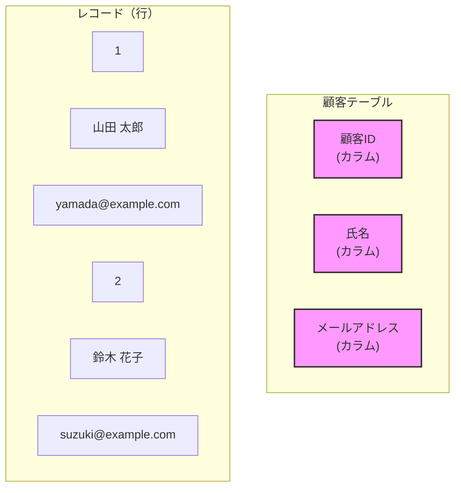
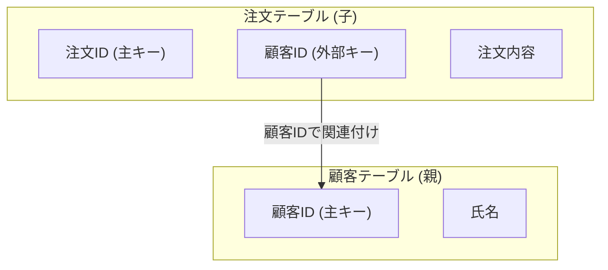

# 3.1 リレーショナルデータベース

## 🎯 この章で学ぶこと
- リレーショナルデータベース(RDB)の基本的な仕組みとデータモデルを理解する。
- テーブル、キー（主キー、外部キー）などのRDBの中心的な概念を説明できるようになる。
- データの整合性を保つための「正規化」の重要性と基本的な手順を理解する。
- 実際の開発でどのようにRDBが使われるかのイメージを掴む。
- RDBと他のデータベース（NoSQL）との違いを理解し、適切な技術選択ができるようになる。

## 🤔 なぜ重要なのか
Webアプリケーションや業務システムなど、私たちが日常的に利用するサービスの多くは、その裏側でリレーショナルデータベースを利用してデータを管理しています。例えば、ECサイトのユーザー情報や購入履歴、ブログの記事やコメントなど、構造化されたデータを正確かつ効率的に扱うためにRDBは不可欠です。

AIに指示してアプリケーションを自動生成することは可能ですが、どのようなデータを、どのような構造で保存するかという「データモデリング」は、システムの性能や拡張性に直結する非常に重要な設計作業です。この設計を誤ると、後から修正するのが非常に困難になったり、パフォーマンスの悪化を招いたりします。本質的なデータ管理の考え方を理解することで、AIの生成するコードの妥当性を判断し、より堅牢でスケーラブルなシステムを構築できるようになります。

## 📚 基礎概念の理解

### リレーショナルモデルとは
リレーショナルモデルとは、データを「リレーション（関連）」の集まりとして表現するデータモデルです。最も一般的な実装が、データを二次元の**テーブル（表）**形式で管理する方法です。

- **身近な例**: Excelのスプレッドシートを想像してみてください。行と列を使ってデータを整理しますよね。例えば、「顧客リスト」シートがあり、1行に1人の顧客情報（氏名、住所、電話番号など）が、各列に対応する項目名（氏名、住所、電話番号）が入っている状態です。これがリレーショナルモデルの基本的な考え方です。RDBでは、このExcelシート（テーブル）を複数作成し、それらを関連付けながらデータを管理していきます。

### テーブル、レコード、カラム
RDBの最も基本的な構成要素です。

- **テーブル (Table)**: データを格納するための表です。Excelのシートに相当します。例：「顧客テーブル」「商品テーブル」。
- **レコード (Record) / 行 (Row)**: テーブル内の一つのデータの単位です。Excelの「行」に相当します。例：「顧客テーブル」における「山田太郎さんの情報」。
- **カラム (Column) / フィールド (Field)**: テーブル内のデータの属性です。Excelの「列」に相当します。例：「顧客テーブル」における「氏名」「住所」「電話番号」。

### 主キー (Primary Key) と外部キー (Foreign Key)
複数のテーブルを関連付けるために「キー」という概念が非常に重要になります。

- **主キー (Primary Key)**:
    - **定義**: テーブル内の各レコードを一意に識別するためのカラムです。
    - **ルール**: `NULL` (空) であってはならず、重複も許されません。
    - **例**: 「顧客テーブル」の「顧客ID」、「商品テーブル」の「商品ID」など。このIDがあれば、特定の顧客や商品を間違いなく一つに特定できます。

- **外部キー (Foreign Key)**:
    - **定義**: 他のテーブルの主キーを参照するカラムです。これにより、テーブル同士の関連（リレーション）を表現します。
    - **例**: 「注文テーブル」に「顧客ID」というカラムを設けた場合、この「顧客ID」は「顧客テーブル」の主キーを参照する外部キーとなります。これにより、「どの顧客が」「どの商品を注文したか」を紐付けることができます。

### 正規化 (Normalization)
正規化とは、データの重複をなくし、整合性を保つためにテーブルを適切に分割するプロセスです。正規化を行うことで、データ更新時の不整合（更新漏れなど）を防ぎ、データベースをより効率的で管理しやすい状態に保ちます。

- **なぜ必要か？**: 例えば、顧客の住所を注文のたびに「注文テーブル」に保存していると、同じ顧客が引っ越した場合に、過去の全ての注文データの住所を更新しなければならなくなります。これは非常に手間がかかり、更新漏れのリスクも高いです。正規化によって顧客情報は「顧客テーブル」に一元管理され、このような問題を防ぐことができます。

- **正規化の段階**: 第1正規形、第2正規形、第3正規形…と段階がありますが、まずは「**一つの事実は一つの場所にのみ保存する**」という原則を理解することが重要です。

## 💡 実践的な活用

### 実際の開発での使用例
簡単なブログシステムを例に考えてみましょう。

- **要件**:
    - ユーザーは記事を投稿できる。
    - 各記事には複数のコメントを付けることができる。

- **テーブル設計**:
    1.  **users (ユーザーテーブル)**
        - `user_id` (主キー)
        - `username`
        - `email`
    2.  **posts (記事テーブル)**
        - `post_id` (主キー)
        - `user_id` (外部キー, usersテーブルを参照)
        - `title`
        - `content`
        - `created_at`
    3.  **comments (コメントテーブル)**
        - `comment_id` (主キー)
        - `post_id` (外部キー, postsテーブルを参照)
        - `user_id` (外部キー, usersテーブルを参照)
        - `comment_text`
        - `created_at`

このようにテーブルを分けることで、「誰が」「いつ」「どの記事に」「どんなコメントをしたか」という情報を、データの重複なく効率的に管理できます。

### ハンズオン：テーブル設計の勘所
オンラインストアの簡単な商品管理システムを設計してみましょう。

- **課題**: 「商品」と「カテゴリ」を管理するためのテーブルを設計してください。
    - 商品には、商品名、価格、商品説明がある。
    - 各商品は、一つのカテゴリに属する。（例：商品「Tシャツ」はカテゴリ「衣類」に属する）
    - カテゴリには、カテゴリ名がある。

- **期待される結果（テーブル定義）**:
    - **categories (カテゴリテーブル)**
        - `category_id` (主キー, INT)
        - `category_name` (VARCHAR)
    - **products (商品テーブル)**
        - `product_id` (主キー, INT)
        - `product_name` (VARCHAR)
        - `price` (DECIMAL)
        - `description` (TEXT)
        - `category_id` (外部キー, categoriesテーブルを参照)

- **トラブルシューティング（よくある落とし穴）**:
    - **× やってはいけない設計**: `products`テーブルに`category_name`を直接保存してしまう。
    - **？ なぜダメか**: カテゴリ名が変更された場合（例：「家電」→「生活家電」）、そのカテゴリに属するすべての商品のレコードを更新する必要があり、大変です。カテゴリは独立したテーブルで管理するのがベストプラクティスです。

## 🔍 深掘り：プロの視点

### 設計における考慮点
- **インデックス (Index)**:
    - **概要**: テーブルの特定のカラムに対して作成される「索引」です。本の巻末にある索引と同じで、これがあることでデータの検索速度を劇的に向上させることができます。
    - **考慮点**: 主キーには自動的にインデックスが作成されますが、`WHERE`句で頻繁に検索条件として使われるカラム（例：`user_id`、`email`など）にもインデックスを作成することが推奨されます。ただし、インデックスを貼りすぎると、逆にデータ更新（INSERT, UPDATE, DELETE）のパフォーマンスが低下するため、バランスが重要です。

- **トランザクション (Transaction)**:
    - **概要**: 「すべて成功するか、すべて失敗するかのどちらか」という性質を持つ、一連の処理のまとまりです。これを**原子性 (Atomicity)** と呼びます。
    - **例**: 銀行の振込処理。「Aさんの口座から1万円引く」処理と「Bさんの口座に1万円足す」処理は、必ずセットで行われなければなりません。片方だけ成功してシステムがダウンすると、大問題になります。トランザクションはこの一連の処理を保証します。

### 技術選択の判断基準
- **いつRDBを使うべきか**:
    - データ構造が明確で、一貫性や信頼性が厳密に求められる場合。
    - 銀行システム、在庫管理、ECサイトの注文処理など、データの整合性がビジネスの根幹に関わるシステム。
    - 複雑な検索やデータの集計が必要な場合。

- **代替手段との比較 (RDB vs NoSQL)**:
    - **NoSQLデータベース**: 「Not Only SQL」の略。リレーショナルモデルではないデータ構造（キーバリュー、ドキュメント、グラフなど）を採用しています。
    - **使い分け**:
        - **RDB**: データの一貫性重視。スキーマ（構造）は固定的。
        - **NoSQL**: データの柔軟性とスケーラビリティ（特に分散環境）重視。スキーマは動的に変更可能。SNSのタイムライン、IoTのセンサーデータなど、大量の非構造化データを高速に読み書きする用途に向いています。

## 📋 まとめとチェックポイント
- **リレーショナルデータベース (RDB)** は、データをテーブル（表）形式で管理し、テーブル間をキーで関連付けることで複雑なデータを扱う。
- **主キー**はレコードを一意に特定し、**外部キー**はテーブル間の関連を作る。
- **正規化**はデータの重複をなくし、整合性を保つための重要な設計手法である。「一つの事実は一つの場所に」。
- **インデックス**は検索速度を向上させ、**トランザクション**は処理の一貫性を保証する。
- データの性質やシステム要件に応じて、RDBとNoSQLを適切に使い分ける必要がある。

**セルフチェック**
- [ ] テーブル、レコード、カラムの違いを自分の言葉で説明できますか？
- [ ] 主キーと外部キーの役割の違いを具体例を挙げて説明できますか？
- [ ] なぜ正規化が必要なのか、そのメリットを説明できますか？
- [ ] どんなときにRDBを選び、どんなときにNoSQLを検討すべきか判断できますか？

## 🔗 関連知識・発展学習
- **3.2 SQL基礎から応用**: この章で設計したテーブルを、実際に操作するための言語であるSQLについて学びます。
- **3.4 データモデリング**: より複雑な要件に対して、どのようにデータベースを設計していくか（モデリング）を深く学びます。
- **13.2 データベース連携**: バックエンドアプリケーションからどのようにしてデータベースに接続し、データを操作するのかを学びます。 