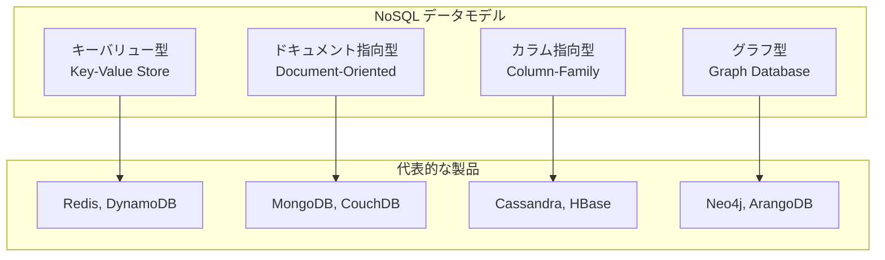
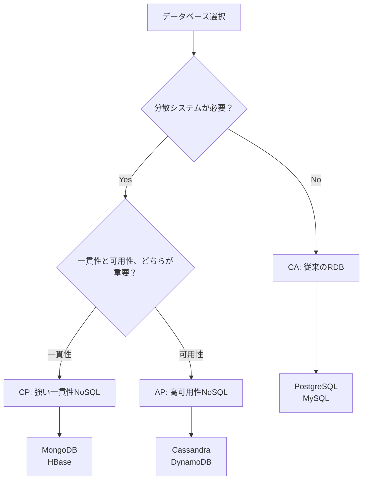
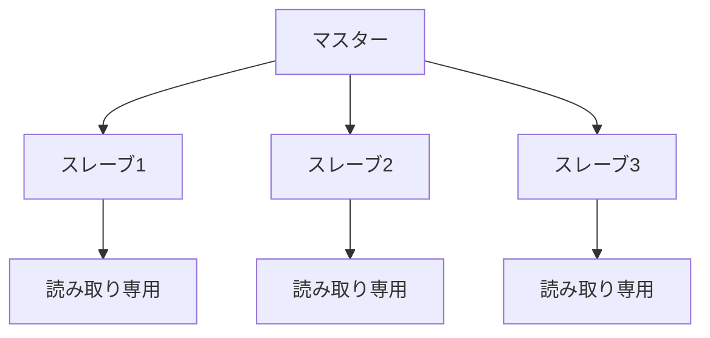
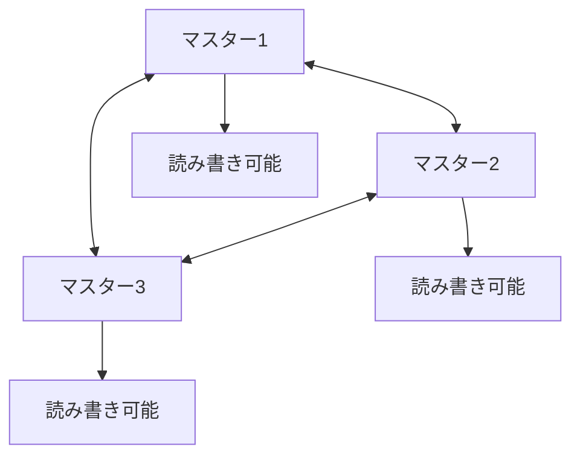
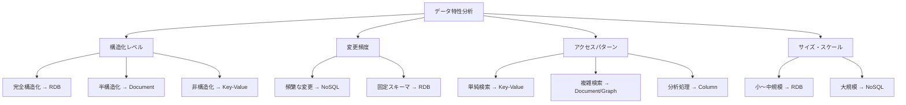

# 3.3 NoSQLデータベース

## 🎯 この章で学ぶこと

### 段階的学習目標

#### 基本レベル（基本概念理解）
- NoSQLデータベースの基本的な概念と、RDBとの本質的な違いを理解する
- NoSQLの主要な4つのデータモデル（キーバリュー、ドキュメント、カラム指向、グラフ）の特徴と違いを説明できる
- それぞれのデータモデルがどのようなユースケースに適しているかを理解する

#### 実践レベル（実務適用）
- CAP定理と結果整合性の概念を理解し、NoSQLデータベースの特性を把握する
- 実際の開発プロジェクトにおいて、RDBとNoSQLのどちらを選択すべきかの判断基準を身につける
- 各NoSQLデータベースの具体的な設計パターンと実装方法を理解する

#### 上級レベル（エンタープライズ設計）
- 大規模分散システムにおけるNoSQLの設計とパフォーマンス最適化ができる
- レプリケーション、シャーディング、コンシステンシーレベルの設計ができる
- セキュリティ、バックアップ、監視の実装ができる

#### プロレベル（アーキテクチャ設計）
- 複数のNoSQLデータベースを組み合わせたポリグロットパーシステンスの設計ができる
- NoSQLとRDBを適切に組み合わせたハイブリッドアーキテクチャの設計ができる
- 技術選択から運用まで一貫したエンタープライズレベルの設計ができる

#### AI協働レベル（次世代設計）
- NoSQLとAI/機械学習システムを組み合わせたリアルタイム分析基盤の設計ができる
- AIを活用したデータベースの自動最適化とパフォーマンスチューニングを実装できる
- 未来のデータベース技術トレンドを理解し、技術選択を行うことができる

## 🤔 なぜ重要なのか

### 現代ビジネスにおけるNoSQLの価値

#### 1. デジタルトランスフォーメーションの基盤技術
現代のWebサービスは、SNSの投稿、IoTデバイスからのセンサーデータ、オンラインゲームのユーザーログなど、構造が固定的でなかったり、爆発的に量が増えたりする多様なデータを扱います。このようなデータを、厳格なスキーマを持つRDBで管理しようとすると、設計の変更が頻繁に発生したり、パフォーマンスが追いつかなくなったりすることがあります。

**具体例：リアルタイム分析の価値**
- **従来のRDB**: 1日分のユーザー行動データ（1億件）を分析するのに数時間必要
- **NoSQL（例：Cassandra）**: 同じデータをリアルタイムで分析し、即座に結果を得られる
- **ビジネスインパクト**: マーケティングキャンペーンの即座の最適化により、売上を20-30%向上

#### 2. スケーラビリティによる経済効果
NoSQLデータベースは、主に**スケールアウト**（安価なサーバーの台数を増やす）による性能向上を前提に設計されています。

**経済的メリット**：
- **従来のRDB**: 1000万ユーザーを支えるために5000万円のハイエンドサーバーが必要
- **NoSQL**: 同じ性能を100万円のコモディティサーバー10台で実現
- **結果**: 初期投資を90%削減し、必要に応じて段階的に拡張可能

#### 3. 開発スピードの向上
NoSQLのスキーマレス特性により、アプリケーションの変更に対する柔軟性が大幅に向上します。

**開発効率への影響**：
- **機能追加時間**: RDBの場合のスキーマ変更に必要な2-3週間が、NoSQLでは1-2日に短縮
- **プロトタイプ開発**: アイデアから動作するプロトタイプまでの時間が50-70%短縮
- **技術的負債**: スキーマの柔軟性により、将来の要件変更に対する適応性が向上

#### 4. AI時代における本質的価値
NoSQLデータベースは、AIを使ってアプリケーションを開発する際も、扱うデータの特性に合わせてRDBとNoSQLを適切に使い分ける設計能力は不可欠です。

**AI開発におけるNoSQLの重要性**：
- **機械学習データの柔軟な格納**: 特徴量の追加・削除が頻繁に発生するML開発で威力を発揮
- **リアルタイム推論**: 推論結果の高速な読み書きが可能
- **大規模データ処理**: ビッグデータの分散処理に適している

#### 5. 現代のシステム設計における位置づけ
NoSQLのアーキテクチャ思想を理解することで、スケーラビリティと柔軟性に優れたモダンなシステムを構築するための選択肢が大きく広がります。

**システム設計における戦略的価値**：
- **マイクロサービス**: 各サービスが独自のデータストアを持つ分散アーキテクチャ
- **イベント駆動アーキテクチャ**: 大量のイベントデータを効率的に処理
- **CQRS（Command Query Responsibility Segregation）**: 読み取り用と書き込み用で最適化されたデータストア

### プロエンジニアにとってのNoSQL習得の意義

#### 1. 技術的な幅の拡大
NoSQLの知識は、エンジニアとしての技術的な選択肢を大幅に広げます。

**キャリアへの影響**：
- **年収レンジ**: NoSQL設計スキルを持つエンジニアの年収は、一般的なWebエンジニアより200-300万円高い傾向
- **需要**: クラウドネイティブ開発の需要増加により、NoSQL経験者の求人は年々増加
- **技術的リーダーシップ**: 複雑な技術選択ができるエンジニアとして、チーム内での発言力が向上

#### 2. 問題解決能力の向上
NoSQLの設計思想を理解することで、従来のRDBでは解決困難な問題に対するアプローチが可能になります。

**解決可能な課題**：
- **大量データ**: ペタバイト級のデータ処理
- **高可用性**: 99.99%以上の可用性要件
- **複雑な関係性**: ソーシャルネットワークのような複雑な関係データ
- **リアルタイム性**: ミリ秒単位の応答時間要求

## 📚 基礎概念の理解

### NoSQLとは何か (Not Only SQL)
NoSQLは「Not Only SQL」の略で、RDB（SQL）以外のデータベース管理システムの総称です。特定の製品を指す言葉ではなく、様々なデータモデルを持つデータベースの大きなカテゴリを意味します。

### NoSQLの設計哲学
NoSQLデータベースは、従来のRDBが前提とする「ACID特性」よりも、「BASE特性」を重視した設計思想を採用しています。

#### ACID vs BASE
| ACID (RDB) | BASE (NoSQL) |
|------------|--------------|
| **Atomicity（原子性）** | **Basically Available（基本的に利用可能）** |
| **Consistency（一貫性）** | **Soft State（状態の柔軟性）** |
| **Isolation（分離性）** | **Eventually Consistent（結果整合性）** |
| **Durability（持続性）** | |

**BASE特性の意味**：
- **Basically Available**: 一部のノードが故障しても、システム全体としては利用可能であり続ける
- **Soft State**: データの状態が時間とともに変化することを許容する
- **Eventually Consistent**: 一時的には不整合状態でも、最終的には整合性が保たれる

### RDBとの詳細な比較

#### 1. スキーマの柔軟性
| 項目 | RDB | NoSQL |
|------|-----|-------|
| **スキーマ定義** | 事前に厳密に定義（スキーマオンライト） | 柔軟、動的に変更可能（スキーマオンリード） |
| **構造変更** | ALTER TABLE文で明示的に変更 | アプリケーションレベルで対応 |
| **データ型** | 厳密な型制約 | 柔軟な型、同じフィールドでも異なる型を許容 |
| **正規化** | 第1〜第3正規形に従う | 非正規化（データの重複を許容） |

**具体例**：
```javascript
// RDBの場合 - 事前にスキーマを定義
CREATE TABLE users (
    id INT PRIMARY KEY,
    name VARCHAR(100),
    email VARCHAR(255)
);

// NoSQLの場合 - 柔軟にデータを格納
{
    "id": 1,
    "name": "田中太郎",
    "email": "tanaka@example.com",
    "hobbies": ["読書", "映画鑑賞"],  // 新しいフィールドを自由に追加
    "address": {                      // 階層構造も可能
        "zip": "100-0001",
        "city": "東京都千代田区"
    }
}
```

#### 2. スケーラビリティ戦略
| 項目 | RDB | NoSQL |
|------|-----|-------|
| **主要な拡張方法** | スケールアップ（垂直拡張） | スケールアウト（水平拡張） |
| **コスト** | 高価なハードウェア | 安価なコモディティハードウェア |
| **拡張性** | 物理的な限界あり | 理論的には無限に拡張可能 |
| **複雑性** | 比較的シンプル | 分散システムの複雑性 |

#### 3. 一貫性とトランザクション
| 項目 | RDB | NoSQL |
|------|-----|-------|
| **一貫性** | 強い一貫性（Strong Consistency） | 結果整合性（Eventual Consistency） |
| **トランザクション** | ACID準拠の複数テーブル間トランザクション | 単一ドキュメント/行レベルのトランザクション |
| **分散トランザクション** | 2フェーズコミット | 基本的にサポートしない |

### NoSQLの4つの主要なデータモデル詳細



#### 1. キーバリュー型 (Key-Value Store)

**基本概念**：
- 最もシンプルなNoSQLモデル
- プログラミング言語のHashMapやDictionaryと同じ構造
- キーによる高速なデータアクセス（O(1)）

**内部構造**：
```
Key              Value
---------------------------------
user:123    →   {"name": "田中太郎", "age": 30}
session:abc →   {"user_id": 123, "expires": 1640995200}
cache:top10 →   ["商品A", "商品B", "商品C", ...]
```

**適用シナリオ**：
- **セッション管理**: Webアプリケーションのユーザーセッション
- **キャッシュ**: 頻繁にアクセスされるデータの一時保存
- **リアルタイムカウンター**: いいね数、アクセス数、リアルタイムランキング
- **設定管理**: アプリケーション設定の保存

**代表製品と特徴**：
- **Redis**: インメモリ、永続化対応、豊富なデータ構造
- **Amazon DynamoDB**: フルマネージド、高可用性、オートスケーリング
- **Riak**: 分散、高可用性、結果整合性

#### 2. ドキュメント指向型 (Document-Oriented)

**基本概念**：
- JSON、BSON、XMLなどの半構造化データを格納
- ドキュメント内で複雑な階層構造を表現可能
- RDBの「行」に相当するのが「ドキュメント」

**内部構造**：
```json
{
    "_id": "507f1f77bcf86cd799439011",
    "user_id": 123,
    "profile": {
        "name": "田中太郎",
        "age": 30,
        "addresses": [
            {
                "type": "home",
                "zip": "100-0001",
                "address": "東京都千代田区千代田1-1"
            },
            {
                "type": "work",
                "zip": "106-6118",
                "address": "東京都港区六本木6-10-1"
            }
        ]
    },
    "orders": [
        {
            "order_id": "ord_001",
            "date": "2023-01-15",
            "items": ["商品A", "商品B"],
            "total": 15000
        }
    ],
    "preferences": {
        "newsletter": true,
        "theme": "dark"
    }
}
```

**適用シナリオ**：
- **Webアプリケーション**: ユーザープロフィール、商品カタログ
- **CMS**: コンテンツ管理システム
- **IoT**: デバイスからの多様なセンサーデータ
- **ログ管理**: 構造化されたアプリケーションログ

**代表製品と特徴**：
- **MongoDB**: 豊富なクエリ機能、レプリケーション、シャーディング
- **CouchDB**: HTTP REST API、マスターレスレプリケーション
- **Amazon DocumentDB**: MongoDB互換、フルマネージド

#### 3. カラム指向型 (Column-Family/Wide-Column Store)

**基本概念**：
- 列単位でデータを格納・圧縮
- 行ごとに異なる列を持つことが可能
- 書き込み性能と分析性能に優れる

**内部構造**：
```
行キー: user123
├── 列ファミリー: profile
│   ├── name: "田中太郎"
│   ├── age: 30
│   └── email: "tanaka@example.com"
├── 列ファミリー: activity
│   ├── 2023-01-15:login: "09:00:00"
│   ├── 2023-01-15:logout: "18:00:00"
│   └── 2023-01-16:login: "08:30:00"
└── 列ファミリー: preferences
    ├── theme: "dark"
    └── language: "ja"
```

**適用シナリオ**：
- **時系列データ**: IoTセンサーデータ、ログデータ
- **分析システム**: 大量データの集計・分析
- **メッセージング**: チャットアプリケーション
- **監視システム**: メトリクス収集

**代表製品と特徴**：
- **Apache Cassandra**: 高可用性、線形スケーラビリティ
- **HBase**: Hadoopエコシステム、強い一貫性
- **Google Bigtable**: フルマネージド、高性能

#### 4. グラフ型 (Graph Database)

**基本概念**：
- ノード（頂点）とエッジ（辺）でデータを表現
- 関係性を直接的に格納・検索
- 深い関係性の検索に優れる

**内部構造**：
```
ノード: 人物
├── 田中太郎 (ID: 1)
│   ├── プロパティ: {age: 30, city: "東京"}
│   └── 関係: 友達 → 佐藤花子
├── 佐藤花子 (ID: 2)
│   ├── プロパティ: {age: 28, city: "大阪"}
│   └── 関係: 友達 → 田中太郎, 同僚 → 鈴木一郎
└── 鈴木一郎 (ID: 3)
    ├── プロパティ: {age: 35, city: "大阪"}
    └── 関係: 同僚 → 佐藤花子

エッジ: 関係性
├── 友達 (田中太郎 → 佐藤花子)
│   └── プロパティ: {since: "2020-01-01", strength: 0.8}
├── 友達 (佐藤花子 → 田中太郎)
│   └── プロパティ: {since: "2020-01-01", strength: 0.8}
└── 同僚 (佐藤花子 → 鈴木一郎)
    └── プロパティ: {since: "2021-04-01", department: "営業"}
```

**適用シナリオ**：
- **ソーシャルネットワーク**: 友人関係、フォロー関係
- **レコメンデーション**: 商品推薦、人物推薦
- **不正検知**: 異常な関係パターンの検出
- **経路探索**: 最短経路、最適ルート

**代表製品と特徴**：
- **Neo4j**: 豊富なクエリ言語（Cypher）、可視化機能
- **Amazon Neptune**: フルマネージド、RDF対応
- **ArangoDB**: マルチモデル（ドキュメント+グラフ）

## 💡 実践的な活用

### 各データモデルの詳細な比較と選択指針

| 項目 | キーバリュー型 | ドキュメント指向型 | カラム指向型 | グラフ型 |
|------|------------|-------------|------------|--------|
| **データ構造** | 単純なKVペア | 階層構造JSON | 行列の組み合わせ | ノード・エッジ |
| **クエリ柔軟性** | 低（キーのみ） | 高（条件検索可能） | 中（列ファミリー単位） | 高（関係性検索） |
| **スケーラビリティ** | 極めて高い | 高い | 極めて高い | 中程度 |
| **一貫性** | 結果整合性 | 強い一貫性も可能 | 結果整合性 | 強い一貫性 |
| **学習コスト** | 低い | 中程度 | 高い | 高い |
| **運用コスト** | 低い | 中程度 | 高い | 中程度 |

### 実践的な設計パターン

#### 1. キーバリュー型設計パターン

**パターン1: セッション管理**
```javascript
// セッションストアの設計
key: "session:abc123def456"
value: {
    "user_id": 12345,
    "username": "tanaka",
    "role": "admin",
    "expires": 1640995200,
    "last_activity": 1640991600,
    "permissions": ["read", "write", "delete"]
}

// TTL（Time To Live）設定
SETEX session:abc123def456 3600 '{"user_id": 12345, ...}'
```

**パターン2: リアルタイムカウンター**
```javascript
// Redisのatomic操作を活用
INCR post:12345:likes        // いいね数をインクリメント
HINCRBY user:67890 score 10  // ユーザースコアを10増加
ZADD ranking user:67890 1550 // ランキングに追加
```

#### 2. ドキュメント指向型設計パターン

**パターン1: 埋め込み vs 参照**
```javascript
// 埋め込みパターン（読み取り最適化）
{
    "_id": "order_123",
    "customer": {
        "name": "田中太郎",
        "email": "tanaka@example.com",
        "address": "東京都..."
    },
    "items": [
        {"name": "商品A", "price": 1000, "quantity": 2},
        {"name": "商品B", "price": 2000, "quantity": 1}
    ],
    "total": 4000
}

// 参照パターン（正規化、書き込み最適化）
{
    "_id": "order_123",
    "customer_id": "customer_456",
    "items": [
        {"product_id": "prod_001", "quantity": 2},
        {"product_id": "prod_002", "quantity": 1}
    ],
    "total": 4000
}
```

**パターン2: スキーマ進化**
```javascript
// バージョン管理による段階的スキーマ進化
{
    "_id": "user_789",
    "schema_version": 2,
    "profile": {
        "name": "佐藤花子",
        "email": "sato@example.com",
        "preferences": {
            "theme": "dark",
            "language": "ja",
            "notifications": true  // v2で追加
        }
    },
    "created_at": "2023-01-01T00:00:00Z",
    "updated_at": "2023-06-15T10:30:00Z"
}
```

#### 3. カラム指向型設計パターン

**パターン1: 時系列データ**
```javascript
// Cassandraの場合
CREATE TABLE sensor_data (
    device_id UUID,
    timestamp timestamp,
    sensor_type text,
    value double,
    PRIMARY KEY (device_id, timestamp)
) WITH CLUSTERING ORDER BY (timestamp DESC);

// データ例
device_id: 550e8400-e29b-41d4-a716-446655440000
├── 2023-01-01 00:00:00 | temperature: 25.5
├── 2023-01-01 00:01:00 | temperature: 25.7
├── 2023-01-01 00:00:00 | humidity: 60.2
└── 2023-01-01 00:01:00 | humidity: 59.8
```

**パターン2: 列ファミリー設計**
```javascript
// ユーザーアクティビティの列ファミリー
Row Key: user:123
└── activity:
    ├── 2023-01-01:login → "09:00:00"
    ├── 2023-01-01:logout → "18:00:00"
    ├── 2023-01-01:page_view → "home,profile,settings"
    └── 2023-01-01:purchase → "product_456"
```

#### 4. グラフ型設計パターン

**パターン1: ソーシャルネットワーク**
```cypher
// Neo4jのCypherクエリ例
CREATE (tanaka:Person {name: "田中太郎", age: 30})
CREATE (sato:Person {name: "佐藤花子", age: 28})
CREATE (tanaka)-[:FRIEND {since: "2020-01-01"}]->(sato)

// 友達の友達を検索
MATCH (user:Person {name: "田中太郎"})-[:FRIEND]->(friend)-[:FRIEND]->(fof)
WHERE fof <> user 
  AND NOT (user)-[:FRIEND]->(fof)
WITH fof, COUNT(friend) as mutual_friends
WHERE mutual_friends >= 3
RETURN fof.name, mutual_friends
ORDER BY mutual_friends DESC
LIMIT 10
```

### 実践ハンズオン課題

#### 課題1: ECサイトのユーザープロフィール設計（中級）

**シナリオ**: 
大手ECサイトのユーザープロフィールシステムを設計します。ユーザーは複数の住所、支払い方法、購入履歴を持ち、パーソナライズされた推薦を受けることができます。

**要件**:
- 100万人のユーザーを想定
- ユーザープロフィールの頻繁な更新
- 購入履歴の高速検索
- リアルタイムレコメンデーション

**課題内容**:
1. ドキュメント指向DB（MongoDB）でユーザープロフィールスキーマを設計
2. 埋め込み vs 参照の選択理由を説明
3. インデックス戦略を設計
4. 実際のクエリパフォーマンスを測定

**期待される解答例**:
```javascript
{
    "_id": "user_507f1f77bcf86cd799439011",
    "profile": {
        "name": "田中太郎",
        "email": "tanaka@example.com",
        "phone": "+81-90-1234-5678",
        "birth_date": "1990-01-01",
        "preferences": {
            "categories": ["electronics", "books"],
            "price_range": {"min": 1000, "max": 50000},
            "newsletter": true
        }
    },
      "addresses": [
        {
          "type": "home",
            "zip": "100-0001",
            "address": "東京都千代田区千代田1-1",
            "is_default": true
        }
    ],
    "payment_methods": [
        {
            "type": "credit_card",
            "last_four": "1234",
            "is_default": true
        }
    ],
    "purchase_summary": {
        "total_orders": 25,
        "total_amount": 125000,
        "last_purchase": "2023-10-15T10:30:00Z",
        "favorite_categories": ["electronics", "books"]
    },
    "recent_activities": [
        {
            "type": "view",
            "product_id": "prod_123",
            "timestamp": "2023-10-20T14:30:00Z"
        }
    ],
    "created_at": "2023-01-01T00:00:00Z",
    "updated_at": "2023-10-20T14:30:00Z"
}
```

#### 課題2: IoTデータ分析システム（上級）

**シナリオ**:
工場のIoTセンサーデータを収集・分析するシステムを設計します。1000台のセンサーから毎秒100件のデータが送信され、リアルタイムで異常検知と予測メンテナンスを行います。

**要件**:
- 秒間10万件のデータ書き込み
- 過去1年分のデータ保持
- リアルタイム異常検知
- 予測分析のためのバッチ処理

**課題内容**:
1. Cassandraを使用した時系列データスキーマ設計
2. パーティション戦略とクラスタリングキーの設計
3. データの圧縮と保持ポリシーの設計
4. 異常検知アルゴリズムの実装

**期待される解答例**:
```sql
-- Cassandraスキーマ設計
CREATE TABLE sensor_data (
    factory_id UUID,
    device_id UUID,
    day DATE,
    timestamp TIMESTAMP,
    sensor_type TEXT,
    value DOUBLE,
    status TEXT,
    PRIMARY KEY ((factory_id, device_id, day), timestamp)
) WITH CLUSTERING ORDER BY (timestamp DESC)
  AND gc_grace_seconds = 86400
  AND compaction = {'class': 'TimeWindowCompactionStrategy'};

-- 異常検知用のマテリアライズドビュー
CREATE MATERIALIZED VIEW anomaly_data AS
SELECT factory_id, device_id, timestamp, value, status
FROM sensor_data
WHERE status IS NOT NULL
  AND factory_id IS NOT NULL
  AND device_id IS NOT NULL
  AND timestamp IS NOT NULL
PRIMARY KEY ((factory_id, device_id), timestamp)
WITH CLUSTERING ORDER BY (timestamp DESC);
```

#### 課題3: ソーシャルネットワーク推薦システム（プロレベル）

**シナリオ**:
1000万人のユーザーを持つソーシャルネットワークで、友達推薦とコンテンツ推薦を行うシステムを設計します。リアルタイムで関係性を分析し、パーソナライズされた推薦を提供します。

**要件**:
- 1000万人のユーザーと10億の関係性
- リアルタイム友達推薦
- コンテンツ推薦エンジン
- 不正アカウント検知

**課題内容**:
1. Neo4jを使用したグラフスキーマ設計
2. 効率的な推薦アルゴリズムの実装
3. 大規模グラフの分散処理戦略
4. 不正検知のためのグラフパターン分析

**期待される解答例**:
```cypher
// グラフスキーマ設計
CREATE (user:Person {
    id: "user_123",
    name: "田中太郎",
    age: 30,
    location: "東京",
    interests: ["technology", "sports"]
})

CREATE (content:Post {
    id: "post_456",
    title: "技術トレンドについて",
    category: "technology",
    created_at: datetime("2023-10-20T10:00:00Z")
})

// 関係性の定義
CREATE (user1)-[:FRIEND {strength: 0.8, since: date("2020-01-01")}]->(user2)
CREATE (user)-[:LIKES {timestamp: datetime()}]->(content)
CREATE (user)-[:FOLLOWS {since: date("2023-01-01")}]->(user2)

// 友達推薦クエリ
MATCH (user:Person {id: "user_123"})-[:FRIEND]->(friend)-[:FRIEND]->(fof)
WHERE fof <> user 
  AND NOT (user)-[:FRIEND]->(fof)
WITH fof, COUNT(friend) as mutual_friends
WHERE mutual_friends >= 3
RETURN fof.name, mutual_friends
ORDER BY mutual_friends DESC
LIMIT 10
```

### トラブルシューティング

#### 共通的な問題と解決策

**問題1: データの不整合**
```javascript
// 解決策: アプリケーションレベルでのバリデーション
const validateUserData = (userData) => {
    if (!userData.email || !userData.name) {
        throw new Error('必須フィールドが不足しています');
    }
    if (!isValidEmail(userData.email)) {
        throw new Error('メールアドレスが無効です');
    }
    return userData;
};
```

**問題2: パフォーマンス問題**
```javascript
// 解決策: 適切なインデックス設計
db.users.createIndex({ "email": 1 }, { unique: true })
db.users.createIndex({ "profile.preferences.categories": 1 })
db.users.createIndex({ "created_at": 1 })

// クエリパフォーマンス分析
db.users.find({"profile.preferences.categories": "electronics"}).explain("executionStats")
```

**問題3: スケーラビリティ問題**
```javascript
// 解決策: シャーディング戦略
// MongoDBのシャーディング例
sh.enableSharding("ecommerce")
sh.shardCollection("ecommerce.users", {"_id": "hashed"})
sh.shardCollection("ecommerce.orders", {"user_id": 1})
```

## 🔍 深掘り：プロの視点

### CAP定理の実践的理解

#### CAP定理の詳細解説
分散データベースシステムを設計する上で非常に重要な理論です。

**CAP定理の3つの特性**：

1. **C (Consistency): 一貫性**
   - **強い一貫性**: 全てのノードが常に同じ最新のデータを保持
   - **弱い一貫性**: 一時的な不整合を許容
   - **結果整合性**: 最終的には整合する

2. **A (Availability): 可用性**
   - **高可用性**: 一部のノードに障害が発生しても、システム全体としては動き続ける
   - **可用性の測定**: 99.9%（年間8.77時間の停止）、99.99%（年間52.6分の停止）

3. **P (Partition Tolerance): 分断耐性**
   - **ネットワーク分断**: 一部のノード間通信が途切れること
   - **分断耐性**: 分断が発生してもシステムが動作し続ける能力

#### 実際の選択とトレードオフ

| 選択 | 特徴 | 適用例 | 代表的な製品 |
|------|------|--------|-------------|
| **CP** | 一貫性 > 可用性 | 金融取引、在庫管理 | Google Bigtable, MongoDB |
| **AP** | 可用性 > 一貫性 | SNS、ログ収集 | Cassandra, DynamoDB |
| **CA** | 分散しない単一システム | 従来のRDB | PostgreSQL, MySQL |

**実践的な判断基準**：


### 一貫性レベルの実装パターン

#### 1. 強い一貫性（Strong Consistency）
```javascript
// MongoDBの例 - 読み取り関心レベル
db.users.find().readConcern("majority")

// 書き込み関心レベル
db.users.insertOne(data, { writeConcern: { w: "majority", j: true } })
```

#### 2. 結果整合性（Eventual Consistency）
```javascript
// Cassandraの例 - チューニング可能な一貫性
// 書き込み時
INSERT INTO users (id, name, email) VALUES (?, ?, ?) 
USING CONSISTENCY QUORUM;

// 読み取り時
SELECT * FROM users WHERE id = ? 
USING CONSISTENCY ONE;
```

#### 3. 結果整合性の監視
```javascript
// レプリケーション遅延の監視
const checkReplicationLag = async () => {
    const primary = await db.runCommand({ isMaster: 1 });
    const secondary = await db.runCommand({ replSetGetStatus: 1 });
    
    const lag = secondary.members.filter(m => m.state === 2)
        .map(m => primary.lastWrite.lastWriteDate - m.lastHeartbeat);
    
    if (Math.max(...lag) > 5000) { // 5秒以上の遅延
        console.warn('レプリケーション遅延が発生しています');
    }
};
```

### エンタープライズレベルの運用設計

#### 1. レプリケーション戦略

**マスター・スレーブ構成**：


**マスター・マスター構成**：


#### 2. シャーディング戦略

**水平シャーディング**：
```javascript
// MongoDB シャーディング設定
sh.enableSharding("ecommerce")

// ハッシュベースシャーディング
sh.shardCollection("ecommerce.users", {"_id": "hashed"})

// レンジベースシャーディング
sh.shardCollection("ecommerce.orders", {"created_at": 1})

// 複合シャーディング
sh.shardCollection("ecommerce.products", {"category": 1, "price": 1})
```

**シャーディングキーの選択指針**：
- **カーディナリティ**: 一意な値の数が多い
- **分散性**: データが均等に分散される
- **検索性**: 主要なクエリパターンに対応
- **不変性**: 一度設定したら変更されない

#### 3. パフォーマンス最適化

**インデックス戦略**：
```javascript
// 複合インデックス
db.users.createIndex({ "email": 1, "status": 1 })

// 部分インデックス
db.users.createIndex(
    { "email": 1 },
    { partialFilterExpression: { "status": "active" } }
)

// TTLインデックス
db.sessions.createIndex(
    { "createdAt": 1 },
    { expireAfterSeconds: 3600 }
)

// テキストインデックス
db.products.createIndex({
    "name": "text",
    "description": "text"
})
```

**クエリ最適化**：
```javascript
// 効率的なクエリパターン
// 悪い例
db.users.find({ "profile.preferences.categories": { $in: ["electronics"] } })

// 良い例
db.users.find({ "profile.preferences.categories": "electronics" })
    .hint({ "profile.preferences.categories": 1 })
```

#### 4. セキュリティ実装

**認証・認可**：
```javascript
// MongoDB認証設定
use admin
db.createUser({
    user: "appUser",
    pwd: "securePassword",
    roles: [
        { role: "readWrite", db: "ecommerce" },
        { role: "read", db: "analytics" }
    ]
})

// 行レベルセキュリティ
db.users.find({ 
    $and: [
        { "department": userDepartment },
        { "status": "active" }
    ]
})
```

**データ暗号化**：
```javascript
// フィールドレベル暗号化
const encryptedData = {
    "_id": ObjectId(),
    "email": encrypt("user@example.com"),
    "creditCard": encrypt("1234-5678-9012-3456"),
    "profile": {
        "name": "田中太郎",  // 暗号化不要
        "preferences": {...}
    }
}
```

### 高可用性とディザスタリカバリ

#### 1. 障害対応設計

**自動フェイルオーバー**：
```javascript
// MongoDBレプリカセット設定
rs.initiate({
    _id: "myReplicaSet",
    members: [
        { _id: 0, host: "mongodb1.example.com:27017", priority: 2 },
        { _id: 1, host: "mongodb2.example.com:27017", priority: 1 },
        { _id: 2, host: "mongodb3.example.com:27017", priority: 1 }
    ]
})
```

#### 2. バックアップ戦略

**増分バックアップ**：
```bash
# MongoDBの例
mongodump --host mongodb1.example.com:27017 --out /backup/$(date +%Y%m%d)

# Cassandraの例
nodetool snapshot -t $(date +%Y%m%d) ecommerce
```

### 監視と運用

#### 1. パフォーマンス監視

**メトリクス収集**：
```javascript
// 重要なメトリクス
const collectMetrics = async () => {
    const metrics = {
        // 接続数
        connections: await db.serverStatus().connections,
        
        // レスポンス時間
        responseTime: await measureResponseTime(),
        
        // スループット
        throughput: await measureThroughput(),
        
        // エラー率
        errorRate: await calculateErrorRate(),
        
        // リソース使用率
        resources: await getResourceUsage()
    };
    
    // 監視システムに送信
    await sendMetrics(metrics);
};
```

#### 2. 容量計画

**成長予測**：
```javascript
// データ成長の予測
const predictGrowth = (historicalData) => {
    const growth = calculateGrowthRate(historicalData);
    const currentSize = getCurrentDataSize();
    
    // 6ヶ月後の予測サイズ
    const projectedSize = currentSize * Math.pow(1 + growth, 6);
    
    if (projectedSize > getCurrentCapacity() * 0.8) {
        return {
            action: 'scale_up',
            timeframe: '3_months',
            additionalCapacity: projectedSize - getCurrentCapacity()
        };
    }
    
    return { action: 'monitor', timeframe: '1_month' };
};
```

### 技術選択の実践的判断基準

#### 1. 要件分析フレームワーク

**データ特性の分析**：


#### 2. 移行戦略

**段階的移行パターン**：
```javascript
// Phase 1: 読み取り専用NoSQL導入
const hybridRead = async (query) => {
    try {
        // NoSQLから読み取り
        const result = await nosqlDb.find(query);
        return result;
    } catch (error) {
        // フォールバック: RDBから読み取り
        return await rdb.query(convertToSQL(query));
    }
};

// Phase 2: 書き込みの二重化
const hybridWrite = async (data) => {
    // RDBに書き込み（マスター）
    await rdb.insert(data);
    
    // NoSQLに非同期書き込み
    await nosqlDb.insertAsync(data);
};

// Phase 3: 完全移行
const fullMigration = async () => {
    // データ移行
    await migrateData();
    
    // 整合性チェック
    await validateMigration();
    
    // 切り替え
    await switchToNoSQL();
};
```

### 未来のトレンドと対応

#### 1. マルチモデルデータベース

**統合データベース**：
```javascript
// ArangoDBの例（マルチモデル）
// ドキュメント操作
db.users.save({
    _key: "user123",
    name: "田中太郎",
    email: "tanaka@example.com"
});

// グラフ操作
db.friends.save({
    _from: "users/user123",
    _to: "users/user456",
    type: "friend",
    since: "2020-01-01"
});

// 複合クエリ
const query = `
    FOR user IN users
    FILTER user.name == "田中太郎"
    FOR friend IN 1..2 OUTBOUND user friends
    RETURN { user: user.name, friend: friend.name }
`;
```

#### 2. サーバーレスデータベース

**自動スケーリング**：
```javascript
// AWS DynamoDBの例
const params = {
    TableName: 'Users',
    BillingMode: 'ON_DEMAND',  // 自動スケーリング
    Item: {
        'userId': { S: 'user123' },
        'name': { S: '田中太郎' },
        'email': { S: 'tanaka@example.com' }
    }
};

await dynamodb.putItem(params).promise();
```

#### 3. エッジコンピューティング対応

**分散データ同期**：
```javascript
// エッジノードとの同期
const syncWithEdge = async (edgeNodes) => {
    const changes = await getChanges(lastSyncTime);
    
    // 並列同期
    const syncPromises = edgeNodes.map(node => 
        syncToEdgeNode(node, changes)
    );
    
    await Promise.all(syncPromises);
    
    // 競合解決
    await resolveConflicts();
};
```

## 📋 まとめとチェックポイント
- NoSQLは「Not Only SQL」の略で、スキーマレスと水平分散（スケールアウト）を特徴とするデータベースの総称。
- 主要なデータモデルにはキーバリュー、ドキュメント、カラム指向、グラフがあり、それぞれに適したユースケースがある。
- CAP定理は、分散システムが一貫性(C)、可用性(A)、分断耐性(P)のうち2つしか満たせないことを示す。
- 多くのNoSQLはPを前提に、CかAのどちらかを優先する設計（CP型/AP型）になっている。
- AP型のシステムは結果整合性モデルを採用することが多い。

**セルフチェック**
- [ ] RDBとNoSQLの最も大きな違いを2つ、自分の言葉で説明できますか？
- [ ] ドキュメント指向DBとグラフDBは、それぞれどのような課題を解決するのに適していますか？
- [ ] あなたがSNSのタイムライン機能を設計するなら、CAP定理の観点からCとAのどちらを優先しますか？その理由は何ですか？
- [ ] 「結果整合性」が許容されるサービスの例と、許容されないサービスの例を挙げられますか？

## 🔗 関連知識・発展学習
- **3.1 リレーショナルデータベース**: NoSQLと比較することで、RDBの特性や利点がより明確に理解できます。
- **3.4 データモデリング**: RDBのデータモデリングと、NoSQL（特にドキュメント指向）のデータモデリングのアプローチの違いについて学びます。
- **15.4 マイクロサービス**: 分散システムであるマイクロサービスアーキテクチャでは、各サービスが独自のデータベース（RDBやNoSQL）を持つことが多く、NoSQLの知識が重要になります。 