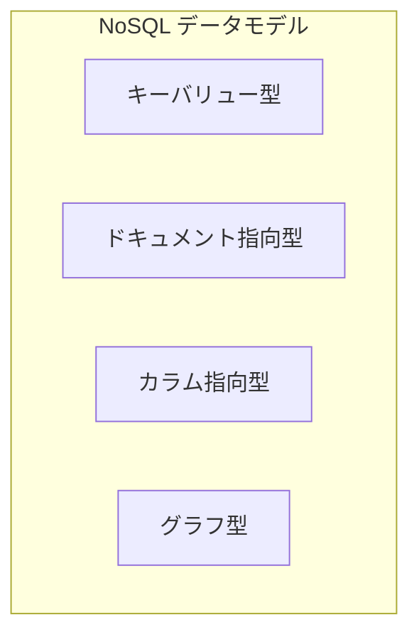

# 3.3 NoSQLデータベース

## 🎯 この章で学ぶこと
- NoSQLデータベースの基本的な概念と、RDBとの本質的な違いを理解する。
- NoSQLの主要な4つのデータモデル（キーバリュー、ドキュメント、カラム指向、グラフ）の特徴と違いを説明できる。
- それぞれのデータモデルがどのようなユースケースに適しているかを理解する。
- CAP定理と結果整合性の概念を理解し、NoSQLデータベースの特性を把握する。
- 実際の開発プロジェクトにおいて、RDBとNoSQLのどちらを選択すべきかの判断基準を身につける。

## 🤔 なぜ重要なのか
現代のWebサービスは、SNSの投稿、IoTデバイスからのセンサーデータ、オンラインゲームのユーザーログなど、構造が固定的でなかったり、爆発的に量が増えたりする多様なデータを扱います。このようなデータを、厳格なスキーマを持つRDBで管理しようとすると、設計の変更が頻繁に発生したり、パフォーマンスが追いつかなくなったりすることがあります。

NoSQLデータベースは、このような「非構造化データ」や「大規模データ」を柔軟かつ高速に扱うために生まれました。AIを使ってアプリケーションを開発する際も、扱うデータの特性に合わせてRDBとNoSQLを適切に使い分ける設計能力は不可欠です。NoSQLのアーキテクチャ思想を理解することで、スケーラビリティと柔軟性に優れたモダンなシステムを構築するための選択肢が大きく広がります。

## 📚 基礎概念の理解

### NoSQLとは何か (Not Only SQL)
NoSQLは「Not Only SQL」の略で、RDB（SQL）以外のデータベース管理システムの総称です。特定の製品を指す言葉ではなく、様々なデータモデルを持つデータベースの大きなカテゴリを意味します。

### RDBとの違い
NoSQLの最も重要な特徴は、RDBの常識とは異なる点にあります。

- **スキーマレス (Schema-less)**:
    - **RDB**: テーブルを作成する際に、事前に厳密なスキーマ（構造）を定義する必要がある（スキーマオンライト）。
    - **NoSQL**: スキーマを事前に定義する必要がなく、データ書き込み時に柔軟な構造のデータを保存できる（スキーマオンリード）。
    - **例**: ユーザープロフィールに新しい項目「趣味」を追加したい場合、RDBでは`ALTER TABLE`でカラムを追加する必要がありますが、NoSQL（特にドキュメント指向型）では新しい項目を持つデータをそのまま追加できます。

- **スケーラビリティ (Scalability)**:
    - **RDB**: 主に**スケールアップ**（サーバー自体の性能を上げる）で性能を向上させる。高価になりがち。
    - **NoSQL**: 主に**スケールアウト**（安価なサーバーの台数を増やすことで性能を向上させる、水平分散）を前提に設計されている。大規模なデータを扱うのに適している。

### NoSQLの4つの主要なデータモデル
NoSQLには様々な種類がありますが、主に以下の4つのデータモデルに分類されます。



1.  **キーバリュー型 (Key-Value Store)**
    - **構造**: 単純な「キー」と「バリュー」のペアでデータを格納する、辞書やハッシュマップのような最もシンプルなモデル。
    - **例**: `user:123` というキーに、ユーザー情報全体の文字列やJSONをバリューとして保存する。
    - **得意なこと**: 特定のキーに対する高速な読み書き。
    - **身近な例**: セッション管理、キャッシュ。

2.  **ドキュメント指向型 (Document-Oriented)**
    - **構造**: JSONやXMLのような半構造化された「ドキュメント」単位でデータを格納する。ドキュメントは自己記述的で、複雑な階層構造を持つことができる。
    - **例**: 一人のユーザー情報を、名前・住所・注文履歴などすべて含んだ一つのJSONドキュメントとして保存する。
    - **得意なこと**: Webアプリケーションのデータ（ユーザー情報、商品カタログなど）の格納。柔軟なデータ構造が求められる場合に強い。

3.  **カラム指向型 (Column-Oriented / Wide-Column Store)**
    - **構造**: 行ではなく列（カラム）を基準にデータを格納する。行ごとに異なる数のカラムを持つことができる。
    - **例**: `(行キー, 列キー, 値)` のタプルでデータを管理する。`user123`の`name`は`John`、`age`は`30`といった形式。
    - **得意なこと**: 大量の書き込み処理、時系列データ（ログ、IoTデータ）の分析など、特定の列だけをまとめて読み出すような処理。

4.  **グラフ型 (Graph)**
    - **構造**: データ間の「関係性」を直接的に表現するモデル。ノード（点）、エッジ（線）、プロパティ（属性）で構成される。
    - **例**: 人物（ノード）と、その間の「友達である」という関係（エッジ）を表現する。
    - **得意なこと**: SNSの友人関係、経路検索、レコメンデーションなど、データ間の繋がりが重要なドメイン。

## 💡 実践的な活用

### 各データモデルの代表的な製品とユースケース

| データモデル | 代表的な製品 | 主なユースケース |
| :--- | :--- | :--- |
| **キーバリュー型** | Redis, Amazon DynamoDB (基本機能) | キャッシュ、セッションストア、リアルタイムランキング |
| **ドキュメント指向型** | MongoDB, Couchbase, Firestore | Web/モバイルアプリのバックエンド、コンテンツ管理、ユーザープロファイル |
| **カラム指向型** | Apache Cassandra, Google Bigtable | IoTのセンサーデータ、ログ分析、メッセージングアプリ |
| **グラフ型** | Neo4j, Amazon Neptune | SNSのソーシャルグラフ、不正検知、レコメンデーションエンジン |

### ハンズオン：JSONドキュメントでユーザープロフィールを設計する
ドキュメント指向データベース（MongoDBなど）でユーザープロフィールを管理するシナリオを考えてみましょう。

- **課題**: 以下の情報を含むユーザープロフィールのJSONドキュメントを設計してください。
    - ユーザーID、ユーザー名、メールアドレス
    - 複数の住所（例：「自宅」「勤務先」）を持つことができ、それぞれに郵便番号と住所詳細が含まれる。
    - 複数の「スキル」を持つ（例：`["Python", "JavaScript", "SQL"]`）

- **期待される結果（JSONドキュメントの例）**:
    ```json
    {
      "user_id": "u12345",
      "username": "Sato Yumi",
      "email": "yumi.sato@example.com",
      "addresses": [
        {
          "type": "home",
          "zip_code": "100-0001",
          "address": "東京都千代田区千代田1-1"
        },
        {
          "type": "work",
          "zip_code": "106-6118",
          "address": "東京都港区六本木6-10-1"
        }
      ],
      "skills": ["Python", "JavaScript", "SQL"],
      "last_login": "2023-10-27T10:00:00Z"
    }
    ```
- **RDBとの比較**:
    - もしこれをRDBでやろうとすると、`users`テーブル、`addresses`テーブル、`skills`テーブル、そして中間テーブル`user_skills`のように、複数のテーブルに分割してJOINする必要があります。NoSQLでは関連するデータを一つのドキュメントにまとめることで、データの取得がシンプルかつ高速になる場合があります。

## 🔍 深掘り：プロの視点

### CAP定理
分散データベースシステムを設計する上で非常に重要な理論です。

- **C (Consistency): 一貫性**
    - 全てのノードが常に同じ最新のデータを保持していること。どこにアクセスしても同じデータが返ってくる。
- **A (Availability): 可用性**
    - 一部のノードに障害が発生しても、システム全体としては動き続け、必ず応答を返すこと。
- **P (Partition Tolerance): 分断耐性**
    - ネットワークの分断（一部のノード間通信が途切れること）が発生しても、システムが動作し続ける能力。

**定理**: 分散システムは、C, A, P のうち、**同時に2つまでしか満たすことができない**。
ネットワーク分断は現実的に避けられないため、NoSQLデータベースはPを前提とし、CとAのどちらを優先するかで分類されます。

- **CP型**: 一貫性を優先（可用性を犠牲に）。データが古くなるくらいなら、エラーを返す。(例: Google Bigtable)
- **AP型**: 可用性を優先（一貫性を犠牲に）。古いデータでもいいから、とにかく応答を返す。(例: Cassandra, DynamoDB)

### 結果整合性 (Eventual Consistency)
AP型のデータベースが採用する一貫性モデルです。「**最終的には**データは一致する（eventually consistent）」という考え方です。データ書き込み後、すぐには全ノードに反映されないかもしれないが、時間が経てばいずれは全てのノードでデータが一致する状態になります。SNSで「いいね！」を押しても、すぐには全員の画面に反映されないことがあるのは、この結果整合性によるものです。

### NoSQLデータベースの選定基準
- **データの構造**: データ構造が頻繁に変わるか？階層構造を持つか？
- **スケーラビリティ要件**: どれくらいのデータ量、秒間リクエスト数を捌く必要があるか？
- **一貫性要件**: データの厳密な一貫性が必須か（金融取引など）、それとも結果整合性で許容できるか（SNSの投稿など）？
- **クエリのパターン**: どのような検索が主になるか？キーによる単純な検索か、複雑な関係性の検索か？

これらの問いに答えることで、プロジェクトに最適なNoSQLデータベース、あるいはRDBを選択する道筋が見えてきます。

## 📋 まとめとチェックポイント
- NoSQLは「Not Only SQL」の略で、スキーマレスと水平分散（スケールアウト）を特徴とするデータベースの総称。
- 主要なデータモデルにはキーバリュー、ドキュメント、カラム指向、グラフがあり、それぞれに適したユースケースがある。
- CAP定理は、分散システムが一貫性(C)、可用性(A)、分断耐性(P)のうち2つしか満たせないことを示す。
- 多くのNoSQLはPを前提に、CかAのどちらかを優先する設計（CP型/AP型）になっている。
- AP型のシステムは結果整合性モデルを採用することが多い。

**セルフチェック**
- [ ] RDBとNoSQLの最も大きな違いを2つ、自分の言葉で説明できますか？
- [ ] ドキュメント指向DBとグラフDBは、それぞれどのような課題を解決するのに適していますか？
- [ ] あなたがSNSのタイムライン機能を設計するなら、CAP定理の観点からCとAのどちらを優先しますか？その理由は何ですか？
- [ ] 「結果整合性」が許容されるサービスの例と、許容されないサービスの例を挙げられますか？

## 🔗 関連知識・発展学習
- **3.1 リレーショナルデータベース**: NoSQLと比較することで、RDBの特性や利点がより明確に理解できます。
- **3.4 データモデリング**: RDBのデータモデリングと、NoSQL（特にドキュメント指向）のデータモデリングのアプローチの違いについて学びます。
- **15.4 マイクロサービス**: 分散システムであるマイクロサービスアーキテクチャでは、各サービスが独自のデータベース（RDBやNoSQL）を持つことが多く、NoSQLの知識が重要になります。 