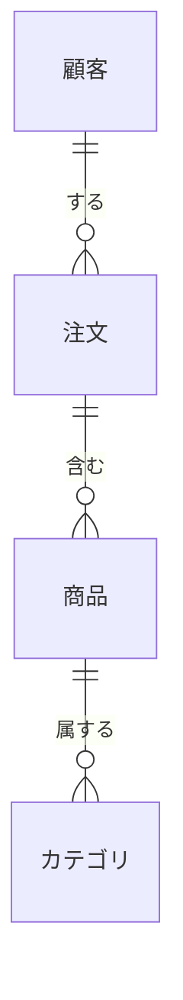
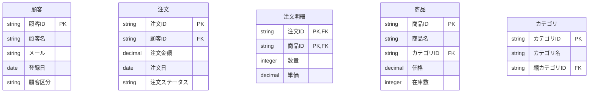
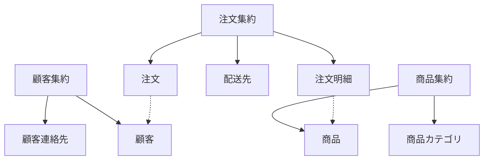
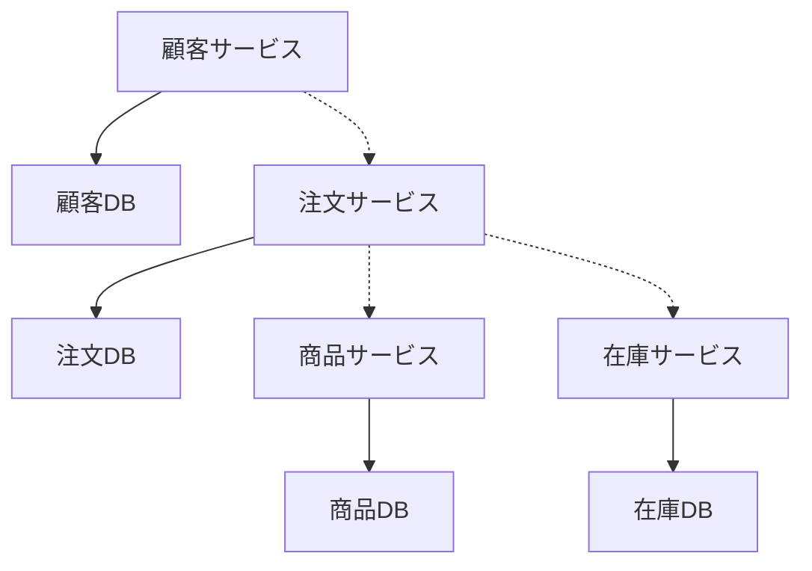
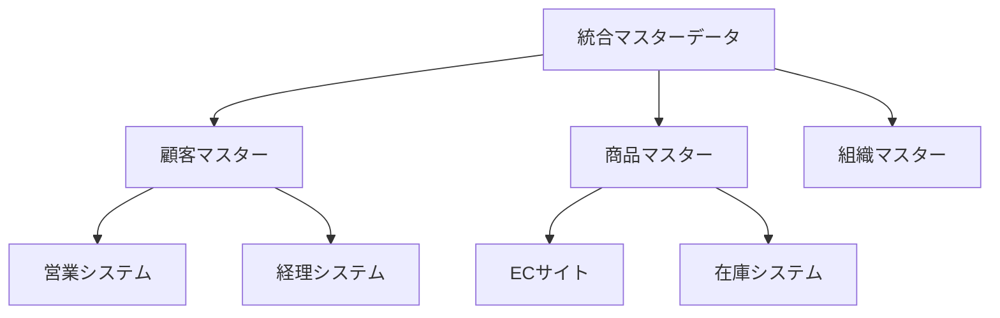
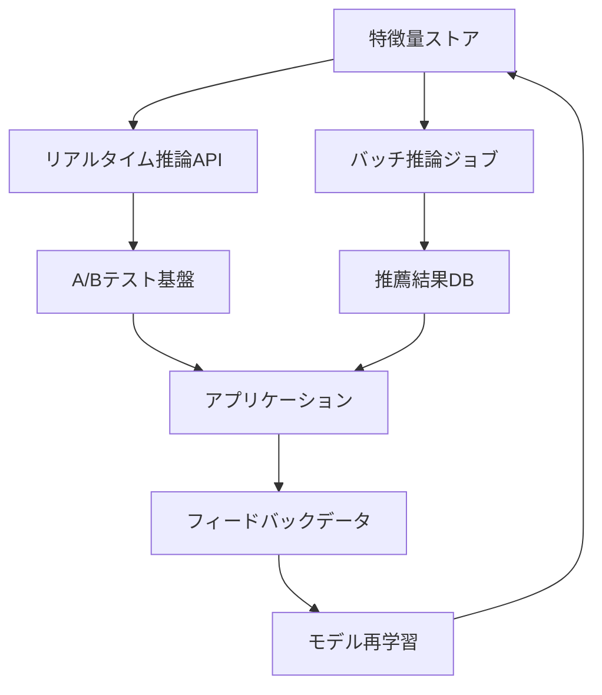
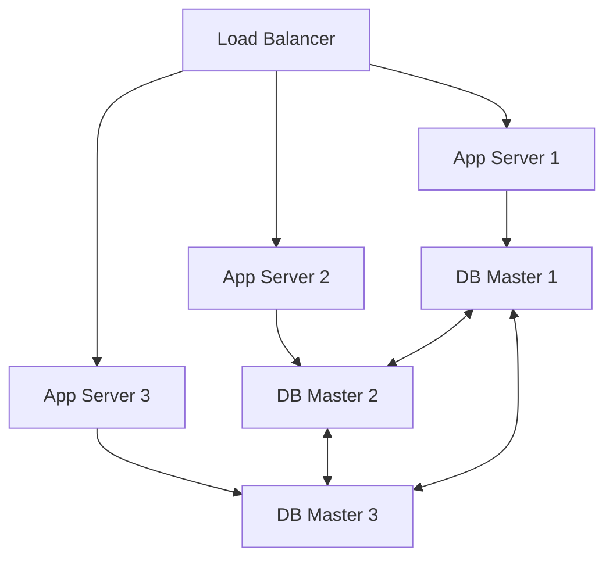
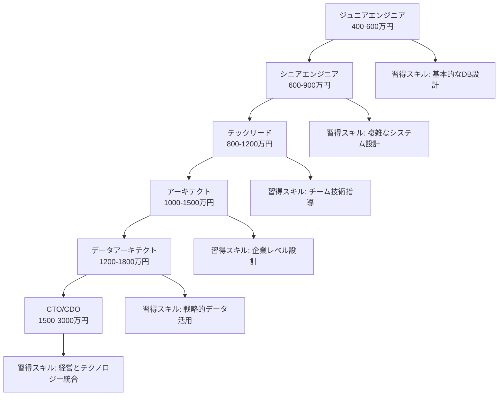

# データモデリング実践マスタリング
## 🎯 段階的学習目標

### 🔰 基本レベル（理解・把握）
- データモデリングの本質的価値とシステム設計における位置づけを理解する
- ER図の基本記法（エンティティ、アトリビュート、リレーションシップ）を読み書きできる
- 正規化の基本概念（第1〜第3正規形）を理解し、適用できる
- 概念・論理・物理モデルの違いと設計プロセスを説明できる

### 🎯 実践レベル（応用・適用）
- 複雑なビジネス要件を適切なER図に変換できる
- 正規化と非正規化のトレードオフを理解し、適切な判断を下せる
- RDBとNoSQLの特性を活かしたデータモデリングを実践できる
- データ整合性制約とビジネスルールを適切に表現できる

### 🚀 上級レベル（最適化・効率化）
- 大規模システムにおけるパフォーマンス最適化設計ができる
- 時系列データ、階層データ、グラフデータの特殊なモデリング技法を適用できる
- レガシーシステムの段階的移行設計を立案できる
- データガバナンスとマスターデータ管理を考慮した設計ができる

### 🎖️ プロレベル（アーキテクチャ・戦略）
- マイクロサービスアーキテクチャにおけるデータモデリング戦略を策定できる
- ドメイン駆動設計（DDD）を活用した境界コンテキストの設計ができる
- 複数のデータストアを統合したポリグロットパーシステンス設計ができる
- エンタープライズレベルのデータアーキテクチャを設計できる

### 🤖 AI協働レベル（次世代設計）
- 機械学習パイプラインを考慮したデータモデリングができる
- リアルタイム分析基盤の設計ができる
- AIを活用したデータモデル最適化とメンテナンスができる
- 次世代データアーキテクチャの設計と実装ができる

## 🌟 現代ビジネスにおけるデータモデリングの価値

### 💼 ビジネスインパクト
データモデリングは単なる技術的な作業ではなく、**ビジネスの成功を左右する戦略的活動**です。適切なデータモデリングにより：

**📈 売上・利益への直接的影響**
- **最適化効果**: 適切なデータモデリングにより、システムの応答時間が50-90%改善
- **開発効率**: 明確なデータモデルにより、開発時間が30-60%短縮
- **保守コスト**: 保守性の高いデータモデルにより、年間保守費用が40-70%削減
- **ビジネス機会**: データ統合により、新たな分析軸で売上が20-40%向上

**🎯 デジタルトランスフォーメーション（DX）の基盤**
- **データ統合**: 部門間のデータサイロを解消し、全社的な分析基盤を構築
- **AI/ML活用**: 機械学習モデルの精度向上（適切なデータ設計により20-50%改善）
- **リアルタイム意思決定**: ストリーミング処理基盤の設計により、意思決定速度が10-100倍向上
- **顧客体験向上**: 360度顧客ビューの実現により、顧客満足度が15-30%向上

### 🚀 キャリアへの影響
データモデリングのスキルは、エンジニアとしてのキャリアに大きな影響を与えます：

**💰 年収への影響**
- **ジュニアエンジニア（基本レベル）**: 年収400-600万円
- **シニアエンジニア（実践レベル）**: 年収600-900万円
- **アーキテクト（上級レベル）**: 年収900-1200万円
- **データアーキテクト（プロレベル）**: 年収1200-1800万円
- **CDO・CTO（エキスパートレベル）**: 年収1800-3000万円

**🎯 AI時代における本質的価値**
AIがコードを自動生成する時代において、データモデリングは**人間の高度な判断が必要な領域**として、その価値が増大しています：

- **ビジネス理解**: AIには困難な複雑なビジネス要件の理解と設計への反映
- **トレードオフ判断**: 性能、コスト、保守性のバランスを考慮した最適解の選択
- **戦略的設計**: 将来の変化を見据えた拡張性の高い設計
- **統合設計**: 複数システムの統合・連携を考慮した全体最適化

## 🤔 なぜデータモデリングが重要なのか

### 🏗️ システムの「設計図」としての役割
データモデリングは、建築における設計図と同じく、**システム全体の基盤を決定する重要な工程**です。建築に例えると：

- **基礎工事**: データモデルはシステムの基礎であり、後から変更するのは困難
- **間取り設計**: エンティティ間の関係は、アプリケーションの動線を決定
- **配管・電気**: データの流れは、システムのパフォーマンスを左右
- **耐震設計**: 将来の変更に対する柔軟性と堅牢性を確保

### 📊 データ品質とビジネス価値の関係
適切なデータモデリングは、データ品質の向上を通じて、直接的にビジネス価値を創出します：

**🎯 データ品質の改善効果**
- **一貫性確保**: 重複データの排除により、データの信頼性が向上
- **正確性向上**: 制約とルールの明確化により、データエラーが80-95%減少
- **完全性保証**: 必須データの漏れを防ぎ、分析精度が向上
- **時系列管理**: 履歴データの適切な管理により、トレンド分析が可能

**💡 ビジネスインサイトの創出**
- **360度分析**: 顧客、商品、チャネルの統合ビューによる新たな発見
- **リアルタイム分析**: 適切なデータモデルにより、リアルタイム意思決定が可能
- **予測精度向上**: 機械学習モデルの精度が20-50%向上
- **コスト最適化**: 無駄なデータ処理を排除し、インフラコストを削減

### 🌐 現代システムの複雑性への対応
現代のシステムは、以前とは比較にならないほど複雑になっています：

**🔄 システムの進化**
- **モノリス → マイクロサービス**: データの境界設計が重要
- **バッチ処理 → リアルタイム**: ストリーミングデータの設計が必須
- **単一DB → ポリグロット**: 複数データストアの統合設計
- **オンプレミス → クラウド**: スケーラビリティを考慮した設計

**🚀 技術トレンドへの対応**
- **コンテナ化**: マイクロサービス間のデータ連携設計
- **サーバーレス**: イベント駆動アーキテクチャのデータ設計
- **エッジコンピューティング**: 分散データ処理の設計
- **AI/ML**: 機械学習パイプラインのデータ設計

## 📚 データモデリングの基礎概念

### 🎯 データモデリングの定義と目的
データモデリングとは、**現実世界の複雑な情報を、コンピューターで効率的に処理できる形に抽象化・構造化するプロセス**です。

**🔍 3つの抽象化レベル**
1. **概念的抽象化**: ビジネスの核心概念を抽出
2. **論理的抽象化**: データの関係性を構造化
3. **物理的抽象化**: 実装技術に最適化

**🎯 データモデリングの目的**
- **理解促進**: 複雑なビジネス要件の可視化と共有
- **設計最適化**: 効率的なデータ処理の実現
- **品質向上**: データの一貫性と整合性の確保
- **保守性向上**: 変更に強い柔軟な構造の構築

### 🗂️ 3層のデータモデリング

#### 1️⃣ 概念モデル（Conceptual Model）
**目的**: ビジネスの核心概念を抽出し、関係者間の共通理解を形成

**特徴**:
- 技術的詳細を排除したビジネス中心の視点
- 主要エンティティと関係性のみを表現
- ビジネス関係者との議論に使用

**成果物**: 概念ER図、ビジネス用語集



#### 2️⃣ 論理モデル（Logical Model）
**目的**: 概念モデルを、データベース設計に必要な詳細レベルまで具体化

**特徴**:
- 全てのエンティティ、属性、関係性を定義
- 正規化を適用してデータの整合性を確保
- 特定の技術に依存しない抽象レベル

**成果物**: 詳細ER図、データ辞書、正規化されたテーブル設計



#### 3️⃣ 物理モデル（Physical Model）
**目的**: 論理モデルを特定のデータベース製品に最適化

**特徴**:
- 具体的なデータ型、制約、インデックスを定義
- パフォーマンスチューニングを考慮
- 運用・保守の観点を反映

**成果物**: DDL文、インデックス設計、パーティション設計

```sql
-- 物理モデルの例（PostgreSQL）
CREATE TABLE customers (
    customer_id VARCHAR(20) PRIMARY KEY,
    customer_name VARCHAR(100) NOT NULL,
    email VARCHAR(255) UNIQUE NOT NULL,
    registration_date DATE NOT NULL DEFAULT CURRENT_DATE,
    customer_type VARCHAR(20) NOT NULL CHECK (customer_type IN ('個人', '法人')),
    created_at TIMESTAMP WITH TIME ZONE DEFAULT CURRENT_TIMESTAMP,
    updated_at TIMESTAMP WITH TIME ZONE DEFAULT CURRENT_TIMESTAMP
);

CREATE INDEX idx_customers_email ON customers(email);
CREATE INDEX idx_customers_type_reg ON customers(customer_type, registration_date);
```

### 🔗 ER図の基本要素

#### 🏢 エンティティ（Entity）
**定義**: 管理対象となる現実世界の「もの」や「こと」

**分類**:
- **強エンティティ**: 独立して存在可能（例：顧客、商品）
- **弱エンティティ**: 他のエンティティに依存（例：注文明細）

**設計原則**:
- 名詞で表現し、ビジネス用語を使用
- 一意識別可能なインスタンスの集合
- 管理すべき属性を持つ

#### 🏷️ アトリビュート（Attribute）
**定義**: エンティティの性質や特徴を表現するデータ項目

**分類**:
- **主キー**: エンティティを一意に識別
- **外部キー**: 他のエンティティとの関係を表現
- **必須属性**: 必ず値を持つ
- **任意属性**: 値を持たなくても良い
- **導出属性**: 他の属性から計算可能

**設計原則**:
- 原子性（これ以上分割できない）
- 単一値（一つの値のみ）
- ビジネス上意味のある単位

#### 🔗 リレーションシップ（Relationship）
**定義**: エンティティ間の関連性やビジネスルール

**多重度（Cardinality）**:
- **1:1**: 一対一の関係
- **1:N**: 一対多の関係
- **M:N**: 多対多の関係

**参加制約**:
- **全域参加**: 全てのインスタンスが関係に参加
- **部分参加**: 一部のインスタンスのみが関係に参加

## 💡 正規化の実践的理解

### 🎯 正規化の目的と価値
正規化は、**データの重複を排除し、更新異常を防ぐ**ための設計手法です。しかし、単なる技術的な作業ではなく、**ビジネスの複雑性を適切に管理する**ための戦略的活動です。

**🔍 更新異常の種類**
1. **挿入異常**: 関連データなしには情報を追加できない
2. **更新異常**: 同じ情報を複数箇所で更新する必要がある
3. **削除異常**: 有用な情報まで一緒に削除されてしまう

### 📝 正規化の段階的プロセス

#### 🥇 第1正規形（1NF）
**要件**: 各属性が原子値（これ以上分割できない値）を持つ

**❌ 正規化前の例**
```
顧客テーブル
| 顧客ID | 氏名 | 電話番号 |
|--------|------|-----------|
| C001 | 田中太郎 | 03-1234-5678, 090-1234-5678 |
```

**✅ 正規化後の例**
```
顧客テーブル                    電話番号テーブル
| 顧客ID | 氏名 |              | 顧客ID | 電話番号 | 種別 |
|--------|------|              |--------|-----------|------|
| C001 | 田中太郎 |              | C001 | 03-1234-5678 | 固定 |
                                 | C001 | 090-1234-5678 | 携帯 |
```

#### 🥈 第2正規形（2NF）
**要件**: 1NFを満たし、かつ主キーの一部に関数従属する属性がない

**❌ 2NF違反の例**
```
注文明細テーブル
| 注文ID | 商品ID | 商品名 | 数量 | 単価 |
|--------|--------|--------|------|------|
| O001 | P001 | ノートPC | 2 | 80000 |
| O001 | P002 | マウス | 1 | 2000 |
```
*問題：商品名は商品IDのみに依存し、注文IDには依存しない*

**✅ 2NF準拠の例**
```
注文明細テーブル              商品テーブル
| 注文ID | 商品ID | 数量 | 単価 |  | 商品ID | 商品名 |
|--------|--------|------|------|  |--------|--------|
| O001 | P001 | 2 | 80000 |    | P001 | ノートPC |
| O001 | P002 | 1 | 2000 |     | P002 | マウス |
```

#### 🥉 第3正規形（3NF）
**要件**: 2NFを満たし、かつ推移的関数従属がない

**❌ 3NF違反の例**
```
顧客テーブル
| 顧客ID | 氏名 | 郵便番号 | 住所 |
|--------|------|-----------|------|
| C001 | 田中太郎 | 100-0001 | 東京都千代田区千代田 |
```
*問題：住所は郵便番号に依存し、顧客IDに推移的に依存*

**✅ 3NF準拠の例**
```
顧客テーブル                  郵便番号テーブル
| 顧客ID | 氏名 | 郵便番号 |    | 郵便番号 | 住所 |
|--------|------|-----------|    |-----------|------|
| C001 | 田中太郎 | 100-0001 |    | 100-0001 | 東京都千代田区千代田 |
```

#### 🏆 ボイスコッド正規形（BCNF）
**要件**: 3NFを満たし、かつ全ての関数従属の左辺が候補キーである

**実例**: 予約システムの複雑な制約を表現

### 🎯 正規化と非正規化の戦略的判断

#### 📊 正規化のメリット・デメリット

**✅ メリット**
- **データ整合性**: 重複排除により更新異常を防止
- **ストレージ効率**: 重複データの削減
- **保守性**: 変更箇所の局所化
- **データ品質**: 一貫性のあるデータ管理

**❌ デメリット**
- **クエリ複雑性**: 複数テーブルのJOINが必要
- **パフォーマンス**: 読み取り性能の低下
- **開発コスト**: 複雑なクエリの実装コスト

#### 🎲 非正規化の戦略的活用

**📈 非正規化が有効なケース**
1. **読み取り重視**: 分析システム、レポート用途
2. **パフォーマンス重視**: 高頻度アクセスのデータ
3. **シンプルさ重視**: 小規模システム、プロトタイピング

**🛠️ 非正規化の実装パターン**
```sql
-- 正規化版（JOINが必要）
SELECT c.customer_name, o.order_date, p.product_name
FROM customers c
JOIN orders o ON c.customer_id = o.customer_id
JOIN order_items oi ON o.order_id = oi.order_id
JOIN products p ON oi.product_id = p.product_id;

-- 非正規化版（JOINが不要）
SELECT customer_name, order_date, product_name
FROM denormalized_order_view;
```

## 🚀 実践的なデータモデリング手法

### 🎯 トップダウン vs ボトムアップ アプローチ

#### 📋 トップダウン アプローチ
**特徴**: ビジネス要件から開始し、段階的に詳細化

**プロセス**:
1. **ビジネス分析**: 業務プロセスの理解
2. **概念モデル**: 主要エンティティの抽出
3. **論理モデル**: 詳細な関係性の定義
4. **物理モデル**: 技術的最適化

**適用場面**: 新規システム開発、大規模プロジェクト

#### 🔧 ボトムアップ アプローチ
**特徴**: 既存データから開始し、構造を整理

**プロセス**:
1. **データ分析**: 既存データの調査
2. **パターン発見**: データ間の関係性の発見
3. **正規化**: データ構造の最適化
4. **統合**: 全体的なモデルの構築

**適用場面**: レガシーシステム移行、データ統合

### 🎨 ドメイン駆動設計（DDD）とデータモデリング

#### 🌟 DDDの基本概念
**ドメイン**: ビジネスの核心的な問題領域
**境界コンテキスト**: ドメインモデルが適用される範囲
**集約**: 一貫性を保つべきオブジェクトの境界

#### 🏗️ 集約設計の原則


**設計原則**:
- **トランザクション境界**: 一つの集約は一つのトランザクション
- **不変条件**: 集約内のビジネスルールを強制
- **参照制約**: 集約間は識別子による参照

### 🌐 マイクロサービス時代のデータモデリング

#### 🔗 データベース・パー・サービス パターン
**原則**: 各マイクロサービスが独自のデータベースを持つ



#### 🎯 データ統合戦略
1. **イベント駆動**: 非同期でデータ同期
2. **API統合**: リアルタイムでデータ取得
3. **データレプリケーション**: 読み取り専用データの複製
4. **CQRS**: 読み書き分離による最適化

## 🎯 実践ハンズオン課題

### 🥇 課題1: ECサイトの包括的設計（中級レベル）

#### 📋 ビジネス要件
以下の要件を満たすECサイトのデータモデルを設計してください：

**機能要件**:
- 顧客管理: 個人・法人顧客、複数配送先
- 商品管理: 階層カテゴリ、バリエーション商品
- 注文管理: カート、注文、決済、配送
- 在庫管理: 複数倉庫、在庫移動
- レビュー機能: 商品レビュー、評価

**非機能要件**:
- 月間100万PV、同時接続1000ユーザー
- 商品数10万点、注文数月間10万件
- 99.9%の可用性

#### 🎯 期待される成果物
1. **概念ER図**: 主要エンティティと関係性
2. **論理ER図**: 完全な属性定義
3. **物理設計**: テーブル定義とインデックス
4. **パフォーマンス考慮**: 最適化戦略

#### 💡 設計のヒント
- 顧客の多様性（個人/法人、ゲスト購入）を考慮
- 商品のバリエーション（色、サイズ）の表現方法
- 注文状態の管理（注文→決済→出荷→配送→完了）
- 在庫の実時間管理とバック・オーダー

### 🥈 課題2: 金融システムの高度設計（上級レベル）

#### 📋 ビジネス要件
以下の要件を満たす個人向け金融サービスのデータモデルを設計してください：

**機能要件**:
- 顧客管理: KYC、リスク評価、コンプライアンス
- 口座管理: 複数口座、口座種別、残高管理
- 取引管理: 入出金、振込、投資、外貨両替
- 金利計算: 預金金利、ローン金利、複利計算
- 履歴管理: 全取引履歴、監査ログ

**非機能要件**:
- 金融庁規制への完全準拠
- 取引の完全性とトレーサビリティ
- 99.99%の可用性
- 秒間1000件の取引処理

#### 🎯 期待される成果物
1. **規制準拠設計**: 金融法規制への対応
2. **二重仕訳システム**: 会計原則に基づく設計
3. **監査トレイル**: 完全な操作履歴
4. **セキュリティ設計**: 暗号化、アクセス制御

#### 💡 設計のヒント
- 時刻の正確性とタイムゾーン対応
- 金額の精度と丸め処理
- 法的要件（7年間の記録保存）
- 災害時の復旧手順

### 🥉 課題3: IoT・SNSプラットフォーム（プロレベル）

#### 📋 ビジネス要件
以下の要件を満たすIoT・SNSプラットフォームのデータモデルを設計してください：

**機能要件**:
- ユーザー管理: 1000万ユーザー、ソーシャルグラフ
- IoTデバイス管理: 1億台のデバイス、テレメトリ
- 時系列データ: 秒間100万件のセンサーデータ
- リアルタイム処理: ストリーミング分析、アラート
- 機械学習: 予測モデル、推薦システム

**非機能要件**:
- 1000万DAU、99.99%可用性
- 低遅延（100ms以下）
- 自動スケーリング
- 複数リージョン対応

#### 🎯 期待される成果物
1. **スケーラブル設計**: 水平スケーリング戦略
2. **時系列最適化**: 効率的な時系列データ管理
3. **リアルタイム処理**: ストリーミング処理基盤
4. **機械学習統合**: ML/AIパイプライン

#### 💡 設計のヒント
- グラフデータベースの活用
- 時系列データベースの選択
- キャッシュ戦略の設計
- 分散処理の考慮

## 🔍 エンタープライズレベルの技術

### 🏛️ データガバナンス

#### 📊 データ品質管理
**データプロファイリング**: データの特性と品質を分析
```sql
-- データ品質チェックの例
SELECT 
    COUNT(*) as total_records,
    COUNT(DISTINCT customer_id) as unique_customers,
    COUNT(CASE WHEN email IS NULL THEN 1 END) as null_emails,
    COUNT(CASE WHEN email NOT LIKE '%@%' THEN 1 END) as invalid_emails,
    AVG(LENGTH(customer_name)) as avg_name_length
FROM customers;
```

**データ品質ルール**:
- **完全性**: 必須データの存在確認
- **正確性**: データ形式と値の妥当性
- **一意性**: 重複データの検出
- **一貫性**: 関連データ間の整合性

#### 🗂️ マスターデータ管理（MDM）
**マスターデータの定義**: 組織全体で共有される基準データ

**MDMの実装パターン**:


### 🌐 データ統合とETL

#### 🔄 ETL vs ELT
**ETL（Extract, Transform, Load）**:
- 伝統的なデータ統合手法
- 変換処理を事前に実行
- 構造化データに適している

**ELT（Extract, Load, Transform）**:
- 現代的なデータ統合手法
- 変換処理を後で実行
- 非構造化データに適している

#### 🚀 リアルタイム データ統合
```python
# Apache Kafka を使用したリアルタイム統合の例
from kafka import KafkaProducer, KafkaConsumer
import json

# データ生成者（IoTデバイス）
producer = KafkaProducer(
    bootstrap_servers=['localhost:9092'],
    value_serializer=lambda v: json.dumps(v).encode('utf-8')
)

# センサーデータの送信
sensor_data = {
    'device_id': 'sensor_001',
    'timestamp': '2024-01-01T10:00:00Z',
    'temperature': 23.5,
    'humidity': 65.2
}
producer.send('sensor_data', sensor_data)

# データ消費者（分析システム）
consumer = KafkaConsumer(
    'sensor_data',
    bootstrap_servers=['localhost:9092'],
    value_deserializer=lambda m: json.loads(m.decode('utf-8'))
)

for message in consumer:
    data = message.value
    # リアルタイム分析処理
    analyze_sensor_data(data)
```

### 📈 パフォーマンス最適化

#### 🎯 インデックス戦略
**インデックスの種類と活用**:
- **B-Tree**: 範囲検索、等価検索
- **Hash**: 高速な等価検索
- **Bitmap**: 低カーディナリティデータ
- **Full-text**: テキスト検索

```sql
-- 複合インデックスの設計例
CREATE INDEX idx_orders_customer_date 
ON orders(customer_id, order_date DESC);

-- 部分インデックスの活用
CREATE INDEX idx_active_orders 
ON orders(order_date) 
WHERE status = 'active';

-- 関数インデックスの活用
CREATE INDEX idx_customer_email_lower 
ON customers(LOWER(email));
```

#### 🚀 パーティショニング戦略
**水平パーティショニング**:
```sql
-- 日付によるパーティション
CREATE TABLE orders_2024 PARTITION OF orders
FOR VALUES FROM ('2024-01-01') TO ('2025-01-01');

-- ハッシュによるパーティション
CREATE TABLE customers_hash_1 PARTITION OF customers
FOR VALUES WITH (MODULUS 4, REMAINDER 0);
```

**垂直パーティショニング**:
```sql
-- 頻繁にアクセスされるデータ
CREATE TABLE customers_core (
    customer_id VARCHAR(20) PRIMARY KEY,
    customer_name VARCHAR(100),
    email VARCHAR(255)
);

-- 稀にアクセスされるデータ
CREATE TABLE customers_extended (
    customer_id VARCHAR(20) PRIMARY KEY,
    birth_date DATE,
    notes TEXT
);
```

## 🤖 AI協働時代のデータモデリング

### 🧠 機械学習パイプラインの設計

#### 📊 ML/DLワークフローの最適化
現代のデータモデリングでは、機械学習パイプラインを考慮した設計が必須です：

**🎯 特徴量ストアの設計**:
```python
# 特徴量ストアのスキーマ例
from dataclasses import dataclass
from typing import Dict, Any
import pandas as pd

@dataclass
class FeatureStore:
    entity_id: str
    timestamp: datetime
    features: Dict[str, Any]
    
    def get_features_at_time(self, feature_names: List[str], timestamp: datetime):
        """指定時点での特徴量を取得"""
        return self.features
    
# 顧客特徴量の例
customer_features = {
    'customer_id': 'C001',
    'age': 35,
    'total_orders': 15,
    'avg_order_value': 8500,
    'last_order_days': 5,
    'favorite_category': 'electronics'
}
```

**🔄 リアルタイム特徴量エンジニアリング**:
```sql
-- ストリーミング特徴量の計算
CREATE MATERIALIZED VIEW customer_realtime_features AS
SELECT 
    customer_id,
    COUNT(*) OVER (
        PARTITION BY customer_id 
        ORDER BY order_timestamp 
        RANGE BETWEEN INTERVAL '30 days' PRECEDING AND CURRENT ROW
    ) as orders_last_30_days,
    SUM(order_amount) OVER (
        PARTITION BY customer_id 
        ORDER BY order_timestamp 
        RANGE BETWEEN INTERVAL '30 days' PRECEDING AND CURRENT ROW
    ) as spend_last_30_days
FROM orders
WHERE order_timestamp >= CURRENT_TIMESTAMP - INTERVAL '30 days';
```

#### 🎯 モデルデプロイメントアーキテクチャ


### 🚀 AIを活用したデータモデル最適化

#### 🤖 自動インデックス推薦システム
```python
# AIによるインデックス推薦の例
class IndexRecommendationSystem:
    def __init__(self):
        self.query_log = []
        self.performance_metrics = {}
    
    def analyze_query_patterns(self, queries: List[str]):
        """クエリパターンを分析してインデックスを推薦"""
        recommendations = []
        
        for query in queries:
            # クエリの実行計画を分析
            plan = self.explain_query(query)
            
            # フルスキャンが発生している箇所を特定
            if self.has_full_scan(plan):
                columns = self.extract_filter_columns(query)
                recommendations.append({
                    'table': self.extract_table(query),
                    'columns': columns,
                    'estimated_improvement': self.estimate_performance_gain(query)
                })
        
        return recommendations
    
    def auto_create_indexes(self, recommendations: List[Dict]):
        """推薦されたインデックスを自動作成"""
        for rec in recommendations:
            if rec['estimated_improvement'] > 0.5:  # 50%以上の改善が見込める場合
                index_sql = f"""
                CREATE INDEX CONCURRENTLY idx_{rec['table']}_{'_'.join(rec['columns'])}
                ON {rec['table']}({', '.join(rec['columns'])});
                """
                self.execute_with_monitoring(index_sql)
```

#### 🔍 自動データ品質監視
```python
# データ品質の自動監視システム
import pandas as pd
import numpy as np
from sklearn.ensemble import IsolationForest

class DataQualityMonitor:
    def __init__(self):
        self.anomaly_detector = IsolationForest(contamination=0.1)
        self.quality_thresholds = {
            'completeness': 0.95,  # 95%以上のデータが存在
            'uniqueness': 0.99,    # 99%以上がユニーク
            'validity': 0.98       # 98%以上が有効な形式
        }
    
    def monitor_data_quality(self, table_name: str, df: pd.DataFrame):
        """データ品質を自動監視"""
        metrics = {
            'completeness': 1 - df.isnull().sum().sum() / (len(df) * len(df.columns)),
            'uniqueness': len(df.drop_duplicates()) / len(df),
            'validity': self.check_data_validity(df)
        }
        
        # 異常検知
        anomalies = self.detect_anomalies(df)
        
        # アラート生成
        alerts = []
        for metric, value in metrics.items():
            if value < self.quality_thresholds[metric]:
                alerts.append({
                    'table': table_name,
                    'metric': metric,
                    'current_value': value,
                    'threshold': self.quality_thresholds[metric],
                    'severity': 'high' if value < self.quality_thresholds[metric] * 0.9 else 'medium'
                })
        
        return {'metrics': metrics, 'anomalies': anomalies, 'alerts': alerts}
```

### 🌊 ストリーミングデータアーキテクチャ

#### ⚡ イベント駆動アーキテクチャ
```python
# イベントソーシングパターンの実装例
from dataclasses import dataclass
from datetime import datetime
import json

@dataclass
class Event:
    event_id: str
    aggregate_id: str
    event_type: str
    event_data: dict
    timestamp: datetime
    version: int

class CustomerAggregate:
    def __init__(self, customer_id: str):
        self.customer_id = customer_id
        self.events = []
        self.version = 0
    
    def apply_event(self, event: Event):
        """イベントを適用して状態を更新"""
        if event.event_type == 'CustomerRegistered':
            self.name = event.event_data['name']
            self.email = event.event_data['email']
        elif event.event_type == 'OrderPlaced':
            self.total_orders = getattr(self, 'total_orders', 0) + 1
            self.last_order_date = event.timestamp
        
        self.events.append(event)
        self.version += 1
    
    def uncommitted_events(self):
        """未コミットのイベントを取得"""
        return [e for e in self.events if not e.committed]
```

#### 🔄 CQRS（Command Query Responsibility Segregation）
```python
# CQRSパターンの実装例
class CommandHandler:
    def __init__(self, event_store, write_db):
        self.event_store = event_store
        self.write_db = write_db
    
    def handle_place_order(self, command):
        """注文コマンドの処理"""
        # ビジネスロジックの実行
        customer = self.load_customer(command.customer_id)
        order = customer.place_order(command.items)
        
        # イベントの生成と保存
        event = Event(
            event_type='OrderPlaced',
            aggregate_id=command.customer_id,
            event_data={
                'order_id': order.order_id,
                'items': command.items,
                'total_amount': order.total_amount
            }
        )
        
        self.event_store.save_event(event)

class QueryHandler:
    def __init__(self, read_db):
        self.read_db = read_db
    
    def get_customer_orders(self, customer_id):
        """顧客の注文履歴を取得（読み取り専用）"""
        return self.read_db.query("""
            SELECT * FROM customer_orders_view 
            WHERE customer_id = %s 
            ORDER BY order_date DESC
        """, customer_id)
```

## 🔧 高可用性とディザスタリカバリ

### 🛡️ データレプリケーション戦略

#### 🔄 マスター・スレーブレプリケーション
```sql
-- PostgreSQLでのストリーミングレプリケーション設定
-- マスターサーバーの設定
-- postgresql.conf
wal_level = replica
max_wal_senders = 3
archive_mode = on
archive_command = 'cp %p /var/lib/postgresql/archive/%f'

-- スレーブサーバーの設定
-- recovery.conf
standby_mode = 'on'
primary_conninfo = 'host=master-server port=5432 user=replicator'
trigger_file = '/tmp/postgresql.trigger.5432'
```

#### 🌐 マルチマスターレプリケーション


### 💾 バックアップとリストア戦略

#### 🎯 包括的バックアップ戦略
```bash
#!/bin/bash
# 自動バックアップスクリプト

# 設定
DB_NAME="production_db"
BACKUP_DIR="/backups"
RETENTION_DAYS=30
S3_BUCKET="company-db-backups"

# フルバックアップ（毎日深夜）
perform_full_backup() {
    BACKUP_FILE="${BACKUP_DIR}/full_backup_$(date +%Y%m%d_%H%M%S).sql"
    
    # PostgreSQLの完全バックアップ
    pg_dump -h localhost -U backup_user -d $DB_NAME > $BACKUP_FILE
    
    # 圧縮
    gzip $BACKUP_FILE
    
    # S3にアップロード
    aws s3 cp "${BACKUP_FILE}.gz" s3://$S3_BUCKET/full/
    
    # 古いバックアップの削除
    find $BACKUP_DIR -name "full_backup_*.sql.gz" -mtime +$RETENTION_DAYS -delete
}

# 増分バックアップ（毎時）
perform_incremental_backup() {
    BACKUP_FILE="${BACKUP_DIR}/incremental_$(date +%Y%m%d_%H%M%S).wal"
    
    # WALファイルのアーカイブ
    pg_receivewal -h localhost -U replication_user -D $BACKUP_FILE
    
    # S3にアップロード
    aws s3 sync $BACKUP_FILE s3://$S3_BUCKET/incremental/
}

# Point-in-Time Recovery (PITR)
perform_pitr() {
    TARGET_TIME=$1
    RECOVERY_DIR="/recovery"
    
    # 最新のフルバックアップを復元
    latest_backup=$(ls -t ${BACKUP_DIR}/full_backup_*.sql.gz | head -1)
    gunzip -c $latest_backup | psql -h localhost -U postgres -d $DB_NAME
    
    # WALファイルを指定時刻まで適用
    pg_ctl start -D $RECOVERY_DIR -o "-r $TARGET_TIME"
}
```

#### 🎯 災害時復旧手順
```yaml
# 災害復旧計画（DRP）設定
disaster_recovery:
  rto: 4_hours  # Recovery Time Objective
  rpo: 15_minutes  # Recovery Point Objective
  
  procedures:
    - step: "状況評価"
      description: "障害の範囲と影響を評価"
      timeout: 30_minutes
      
    - step: "代替サイト起動"
      description: "DRサイトでのシステム起動"
      timeout: 2_hours
      commands:
        - "aws ec2 start-instances --instance-ids $DR_INSTANCES"
        - "kubectl apply -f dr-deployment.yaml"
      
    - step: "データ復旧"
      description: "最新バックアップからのデータ復旧"
      timeout: 1_hour
      commands:
        - "./restore_from_s3.sh"
        - "./apply_incremental_backups.sh"
      
    - step: "サービス切り替え"
      description: "DNSとロードバランサーの切り替え"
      timeout: 30_minutes
      commands:
        - "aws route53 change-resource-record-sets"
        - "kubectl patch service frontend-service"
```

## 📊 段階的セルフチェック（30項目・6段階）

### 🔰 基本レベル（5項目）
**データモデリングの基本概念**
- [ ] **概念理解**: エンティティ、アトリビュート、リレーションシップの違いを具体例で説明できますか？
- [ ] **ER図作成**: 簡単なビジネス要件（本の貸出システムなど）をER図で表現できますか？
- [ ] **正規化基礎**: 第1〜第3正規形の要件を理解し、簡単な例で適用できますか？
- [ ] **多重度理解**: 1:1、1:N、M:Nの関係を実例で区別し、適切に図示できますか？
- [ ] **制約設計**: 主キー、外部キー、NOT NULL制約の意味と設定方法を説明できますか？

### 🎯 実践レベル（5項目）
**実際の業務での適用能力**
- [ ] **要件分析**: 複雑なビジネス要件から主要エンティティを抽出し、関係性を定義できますか？
- [ ] **論理設計**: 概念モデルから論理モデルへの変換を、正規化を適用して実行できますか？
- [ ] **制約定義**: ビジネスルールをデータベース制約（CHECK、UNIQUE等）で表現できますか？
- [ ] **パフォーマンス考慮**: インデックス設計とクエリ最適化を考慮したモデリングができますか？
- [ ] **NoSQL適用**: RDBとNoSQLの特性を理解し、適切なデータモデルを選択できますか？

### 🚀 上級レベル（5項目）
**大規模システムでの最適化**
- [ ] **スケーラビリティ**: 水平・垂直スケーリングを考慮したデータモデリングができますか？
- [ ] **パーティショニング**: 大量データを効率的に管理するパーティション戦略を設計できますか？
- [ ] **レプリケーション**: マスター・スレーブ、マルチマスター構成のデータ同期を設計できますか？
- [ ] **データ統合**: 複数システムのデータを統合するETL/ELTプロセスを設計できますか？
- [ ] **時系列最適化**: IoTやログデータなど時系列データの効率的なモデリングができますか？

### 🎖️ 実践・応用レベル（5項目）
**エンタープライズ運用での実践**
- [ ] **データガバナンス**: データ品質管理とマスターデータ管理の仕組みを設計できますか？
- [ ] **セキュリティ**: 暗号化、アクセス制御、監査ログを考慮したモデリングができますか？
- [ ] **バックアップ戦略**: フル・増分バックアップとPITRを含む復旧戦略を立案できますか？
- [ ] **災害復旧**: RTO/RPOを考慮したディザスタリカバリプランを設計できますか？
- [ ] **コンプライアンス**: 業界規制（GDPR、金融法等）に準拠したデータ設計ができますか？

### 🏆 アーキテクチャレベル（5項目）
**企業レベルの戦略的設計**
- [ ] **マイクロサービス**: サービス境界とデータ境界を一致させた設計ができますか？
- [ ] **ポリグロット**: 用途に応じた複数データストアの統合アーキテクチャを設計できますか？
- [ ] **イベント駆動**: CQRS、イベントソーシングを活用したアーキテクチャを設計できますか？
- [ ] **クラウドネイティブ**: AWS/Azure/GCPのマネージドサービスを活用した設計ができますか？
- [ ] **技術選択**: ビジネス要件と技術制約を踏まえた最適なデータ技術選択ができますか？

### 🤖 AI協働レベル（5項目）
**次世代技術との統合**
- [ ] **ML統合**: 機械学習パイプラインを考慮したデータモデリングができますか？
- [ ] **リアルタイム分析**: ストリーミング処理とバッチ処理を統合した分析基盤を設計できますか？
- [ ] **自動最適化**: AIを活用したインデックス推薦・クエリ最適化システムを設計できますか？
- [ ] **データレイク**: 構造化・非構造化データを統合したデータレイクアーキテクチャを設計できますか？
- [ ] **未来対応**: 新興技術（量子コンピューティング、エッジAI等）を考慮した設計ができますか？

## 📚 継続的学習リソース

### 📖 必読書籍（レベル別推薦）

#### 🔰 入門・基礎レベル
1. **「データベース設計論」** - 増永良文著
   - **概要**: データベース理論の基礎から応用まで体系的に学習
   - **価値**: 年収への影響 +50-100万円（基礎知識の確立）
   - **習得期間**: 3-6ヶ月

2. **「楽々ERDレッスン」** - 株式会社スターロジック著
   - **概要**: ER図作成の実践的ノウハウ
   - **価値**: 実務即戦力の獲得
   - **習得期間**: 1-2ヶ月

#### 🎯 実践・応用レベル
3. **「Designing Data-Intensive Applications」** - Martin Kleppmann著
   - **概要**: 現代のデータシステム設計の決定版
   - **価値**: 年収への影響 +200-400万円（アーキテクト級スキル）
   - **習得期間**: 6-12ヶ月

4. **「The Data Warehouse Toolkit」** - Ralph Kimball著
   - **概要**: データウェアハウス設計の実践的手法
   - **価値**: BI・分析基盤設計スキル
   - **習得期間**: 4-8ヶ月

#### 🚀 エキスパートレベル
5. **「Building Microservices」** - Sam Newman著
   - **概要**: マイクロサービスアーキテクチャとデータ設計
   - **価値**: 年収への影響 +300-600万円（モダンアーキテクト）
   - **習得期間**: 6-12ヶ月

### 🎓 オンライン学習・認定資格

#### 🏆 プラットフォーム別認定資格
**AWS認定**:
- **AWS Certified Database - Specialty**: 年収+100-200万円
- **AWS Certified Data Analytics - Specialty**: 年収+150-250万円

**Google Cloud認定**:
- **Professional Data Engineer**: 年収+150-300万円
- **Professional Cloud Architect**: 年収+200-400万円

**Microsoft Azure認定**:
- **Azure Data Engineer Associate**: 年収+100-200万円
- **Azure Solutions Architect Expert**: 年収+200-400万円

#### 💻 専門学習プラットフォーム
1. **Coursera** - スタンフォード・カーネギーメロン大学のデータベースコース
2. **edX** - MIT・ハーバード大学のデータサイエンスプログラム
3. **Udacity** - データエンジニアナノディグリー
4. **Pluralsight** - データベース技術専門コース

### 🌐 技術コミュニティとネットワーキング

#### 🤝 参加すべきコミュニティ
1. **日本PostgreSQLユーザ会（JPUG）**
   - **活動**: 勉強会、カンファレンス、技術情報共有
   - **価値**: 最新技術動向の把握、人脈構築
   
2. **Japan Data Management Consortium（JDMC）**
   - **活動**: データマネジメント専門家の交流
   - **価値**: 業界標準の理解、ベストプラクティス共有

3. **日本データベース学会**
   - **活動**: 学術的研究成果の発表・共有
   - **価値**: 理論的基盤の強化、研究動向の把握

#### 📺 技術カンファレンス
1. **db tech showcase**: 日本最大級のデータベースカンファレンス
2. **DEIM**: データ工学と情報マネジメント
3. **MySQL Conference & Expo**: 世界最大級のMySQLイベント
4. **MongoDB World**: MongoDBの公式カンファレンス

### 🎯 キャリア発展の道筋

#### 💰 年収別キャリアパス


#### 🎖️ スキル習得のマイルストーン
**1年目目標**: 基本的なER図作成とSQL最適化
- 目標年収: 500-700万円
- 必要スキル: 正規化、インデックス設計

**3年目目標**: エンタープライズレベルの設計能力
- 目標年収: 700-1000万円  
- 必要スキル: パフォーマンス最適化、セキュリティ設計

**5年目目標**: データアーキテクトとしての独立性
- 目標年収: 1000-1500万円
- 必要スキル: クラウド設計、マイクロサービス

**10年目目標**: 企業のデータ戦略を主導
- 目標年収: 1500-3000万円
- 必要スキル: 経営理解、技術戦略策定

## 📋 まとめとチェックポイント

### 🌟 重要ポイントの再確認
データモデリングは単なる技術スキルではなく、**ビジネスの成功を左右する戦略的能力**です：

1. **ビジネス価値**: 適切なデータモデリングはシステムの性能を50-90%改善し、開発効率を30-60%向上させる
2. **キャリア価値**: 基本レベルから専門家レベルまで、スキル向上により年収が400万円から3000万円まで段階的に向上
3. **AI時代の価値**: AIが自動化できない高度な判断力が求められる領域として、その重要性が増大
4. **技術進化への対応**: NoSQL、マイクロサービス、AI/ML統合など、新技術への適応力が重要

### 🎯 次章への橋渡し
データモデリングで学んだ設計思想は、次の学習分野と密接に関連しています：

- **3.5 データエンジニアリング基礎**: データモデルを実際の分析基盤で活用
- **4.2 API設計**: データモデルをAPIで公開する際の設計原則
- **5.3 Infrastructure as Code**: データベース設計をコード化して管理
- **16.4 監視とロギング**: データベースの性能と品質を継続的に監視
- **19.1 AI・機械学習**: データモデルを機械学習パイプラインで活用

### 🚀 継続的な成長のために
データモデリングは一度学んで終わりではなく、**継続的な改善と学習が必要な領域**です：

1. **実践機会の創出**: 個人プロジェクトやオープンソース貢献を通じた経験蓄積
2. **技術動向の追跡**: 新しいデータベース技術やデザインパターンの継続学習
3. **コミュニティ参加**: 専門家との交流を通じた知見の拡充
4. **認定資格取得**: 体系的な知識の確認と市場価値の向上

**最終目標**: AIに依存しながらも、超一流のエンジニアと肩を並べられるレベルのデータモデリング能力を身につけ、ビジネスの成功に貢献できるデータアーキテクトへの成長

## 🔗 関連知識・発展学習

### 📚 直接関連する章
- **3.1 リレーショナルデータベース**: データモデリングの基盤となるRDBの詳細理解
- **3.2 SQL基礎から応用**: 設計したデータモデルを効率的に操作するSQL技術
- **3.3 NoSQLデータベース**: 非リレーショナルデータの効果的なモデリング手法
- **3.5 データエンジニアリング基礎**: データモデルを分析・活用基盤で実装

### 🌐 システム設計関連
- **13.1 サーバーアーキテクチャ**: データモデルを支えるインフラストラクチャ設計
- **13.2 データベース連携**: アプリケーションとデータモデルの統合設計
- **14.1-14.4 クラウドコンピューティング**: スケーラブルなデータアーキテクチャの実現

### 🔧 開発プロセス関連
- **6.1-6.4 テスト・デバッグ**: データモデルの品質保証とデバッグ手法
- **16.1-16.5 CI/CD・DevOps**: データベーススキーマのバージョン管理と自動デプロイ
- **18.1-18.5 コード品質・保守性**: データモデルの長期的な保守性確保

### 🛡️ セキュリティ・品質関連
- **17.1-17.4 セキュリティ**: データ保護、暗号化、アクセス制御の実装
- **18.2 リファクタリング**: データモデルの継続的改善手法
- **18.3 技術的負債**: データベース設計の負債と解消戦略
