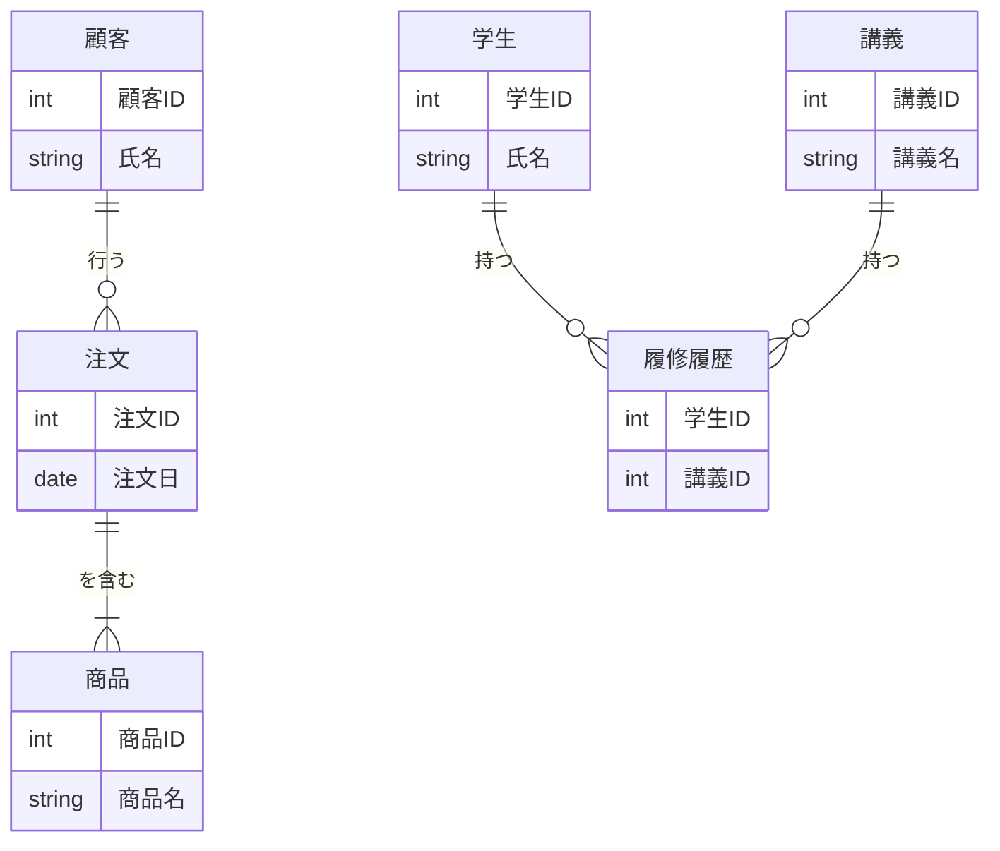

# 3.4 データモデリング

## 🎯 この章で学ぶこと
- データモデリングの目的と、システム開発におけるその重要性を理解する。
- ER図（エンティティ関係図）の基本的な記法を読み書きできるようになる。
- エンティティ、アトリビュート、リレーションシップ、カーディナリティといった中心概念を説明できる。
- 正規化と非正規化のトレードオフを理解し、状況に応じて適切な判断ができるようになる。
- RDBとNoSQLにおけるデータモデリングのアプローチの違いを理解する。

## 🤔 なぜ重要なのか
これまで、RDBやNoSQLというデータの「入れ物」について学んできました。データモデリングは、その入れ物に「何を」「どのような構造で」入れるかを設計する、いわば**システムの設計図**を作る工程です。家の建築に例えるなら、データベースが建材（木、コンクリートなど）で、データモデリングが間取りや構造を考える設計図に相当します。

この設計図の品質が、システムのパフォーマンス、拡張性、保守性を大きく左右します。AIにコーディングを任せることはできても、「どのようなデータを管理すべきか」「データ同士はどう関連しているか」というビジネスの根幹に関わる要求を理解し、それを最適なデータ構造に落とし込む作業は、高度な思考を要するエンジニアの重要な責務です。優れたデータモデルは、無駄のない効率的な処理を可能にし、将来の仕様変更にも柔軟に対応できる堅牢なシステム基盤を築きます。

## 📚 基礎概念の理解

### データモデリングとは何か
データモデリングとは、現実世界の情報を収集・分析し、データベースで管理しやすいように、その構造を抽象化・整理して表現するプロセスです。目的は、データの意味、関係性、制約を明確にし、関係者全員が共通の認識を持てるようにすることです。

### ER図（エンティティ関係図）の基本
ER図 (Entity-Relationship Diagram) は、データモデルを視覚的に表現するための最も一般的なツールです。システムのデータがどのように構成され、互いにどう関連しているかを図で示します。

### エンティティ、アトリビュート、リレーションシップ
ER図は主に3つの要素で構成されます。

- **エンティティ (Entity)**:
    - 管理すべきデータのまとまりで、実世界に存在する「モノ」や「コト」。通常は四角形で表現される。
    - 例: 「学生」「講義」「商品」「注文」
- **アトリビュート (Attribute)**:
    - エンティティが持つ個々の属性や性質。エンティティの中に記述される。
    - 例: 「学生」エンティティの「学籍番号」「氏名」「学部」
- **リレーションシップ (Relationship)**:
    - エンティティ間の関連性。エンティティ間を結ぶ線で表現される。
    - 例: 「学生」は「講義」を**履修する**。「顧客」が「商品」を**注文する**。

### カーディナリティ（多重度）
リレーションシップが、いくつのエンティティと関連付くかを示す数。線の端の記号で表現されます。

- **1対1 (One-to-One)**: エンティティAの1インスタンスが、エンティティBの1インスタンスとだけ関連付く。（例：`夫`と`妻`）
- **1対多 (One-to-Many)**: エンティティAの1インスタンスが、エンティティBの複数インスタンスと関連付く。（例：1人の`顧客`が複数の`注文`をする）
- **多対多 (Many-to-Many)**: エンティティAの複数インスタンスが、エンティティBの複数インスタンスと関連付く。（例：1人の`学生`が複数の`講義`を履修し、1つの`講義`は複数の`学生`によって履修される）


*注: 多対多のリレーションシップは、RDBで実装する際には「履修履歴」のような中間テーブル（連関エンティティ）に分解されます。*

## 💡 実践的な活用

### データモデリングの3つのレベル
データモデリングは、通常3つの段階を経て詳細化されます。

1.  **概念モデル**:
    - ビジネスの要求を大まかに捉え、主要なエンティティとその関係性を洗い出す段階。技術的な詳細は含まず、ビジネス関係者との認識合わせに使う。
2.  **論理モデル**:
    - 概念モデルを、特定のデータベース製品に依存しない形で、より詳細に設計する段階。全エンティティのアトリビュート、主キー、外部キーなどを定義する。正規化はこの段階で行われる。
3.  **物理モデル**:
    - 論理モデルを、特定のデータベース製品（例: MySQL, PostgreSQL）の仕様に合わせて変換する段階。カラムの具体的なデータ型、インデックス、制約などを決定する。

### 正規化と非正規化のトレードオフ
- **正規化 (Normalization)**:
    - **目的**: データの重複を排除し、データの一貫性と整合性を高める。
    - **メリット**: データ更新時の異常を防ぎ、ストレージ効率が良い。
    - **デメリット**: データを取得する際に複数のテーブルをJOINする必要があり、読み取り性能が低下することがある。
- **非正規化 (Denormalization)**:
    - **目的**: データの読み取り性能を向上させるために、あえて正規化されたモデルを崩し、データの重複を許容すること。
    - **メリット**: JOINの回数が減り、データの取得が高速になる。
    - **デメリット**: データ更新時に複数の場所を修正する必要があり、データ不整合のリスクが高まる。ストレージ使用量も増える。

**判断基準**: 「書き込み」の整合性を重視するか、「読み取り」の速度を重視するか、というシステムの要件によってトレードオフを考慮し、バランスの良い設計を目指します。

### ハンズオン：簡単なEコマースサイトのデータモデリング
- **課題**: 以下の要件を満たすEコマースサイトの「論理データモデル」をER図で表現してください。
    - 顧客は商品を注文する。
    - 1人の顧客は複数回注文できる。
    - 1回の注文には、複数の商品が含まれる可能性がある。
    - 1つの商品は、複数の注文に含まれる可能性がある。
- **期待される結果（ER図）**:
    ```mermaid
    erDiagram
        顧客 {
            int 顧客ID PK
            string 氏名
            string メールアドレス
        }
        注文 {
            int 注文ID PK
            int 顧客ID FK
            datetime 注文日時
        }
        商品 {
            int 商品ID PK
            string 商品名
            decimal 価格
        }
        注文明細 {
            int 注文ID FK
            int 商品ID FK
            int 数量
        }

        顧客 ||--|{ 注文 : "行う"
        注文 }o--o{ 注文明細 : "構成される"
        商品 }o--o{ 注文明細 : "含まれる"
    ```
    - **ポイント**: `注文`と`商品`の「多対多」の関係性を解決するために、`注文明細`という中間エンティティ（連関エンティティ）を導入しています。これが正規化の基本的なアプローチです。

## 🔍 深掘り：プロの視点

### NoSQLにおけるデータモデリング
NoSQL、特にドキュメント指向DBのモデリングはRDBとは発想が異なります。JOINの概念がないため、**クエリ（どういう形でデータを取得したいか）を先に考える**ことが重要です。

- **埋め込み (Embedding)**:
    - 関連するデータを、親ドキュメント内にネストしたオブジェクトとして「埋め込む」方法。
    - **例**: ブログの「記事」ドキュメント内に、「コメント」の配列を埋め込む。
    - **利点**: 1回のクエリで関連データを全て取得でき、高速。
    - **欠点**: 埋め込んだデータが頻繁に更新されたり、量が無制限に増える場合（例：人気記事のコメント）には向かない。
- **参照 (Referencing)**:
    - RDBの外部キーのように、別のコレクション（テーブルに相当）のIDを「参照」として持つ方法。
    - **例**: 「記事」ドキュメントに、「コメント」ドキュメントのIDの配列を持つ。
    - **利点**: データの重複がなく、正規化された状態を保てる。
    - **欠点**: 関連データを取得するために、アプリケーション側で複数回のクエリ（JOINのような処理）が必要になる。

### ドメイン駆動設計（DDD）とデータモデリング
ドメイン駆動設計は、ビジネスの関心事（ドメイン）を中心にソフトウェアを設計する手法です。DDDにおける「集約（Aggregate）」という単位は、データモデリング、特にNoSQLのドキュメント設計と非常に相性が良いです。集約とは、一貫性を保つべきエンティティのまとまりであり、これが一つのトランザクション境界となります。この「集約」をそのまま一つのドキュメントとしてモデリングするアプローチがよく取られます。

### 変化に強いデータモデルの設計原則
- **関心の分離**: 一つのエンティティには、一つの関心事だけを持たせる。
- **疎結合**: エンティティ間の依存関係を可能な限り低く保つ。
- **拡張性**: 将来的な属性の追加やリレーションの変更が容易な構造を意識する。
- **ビジネスの言語を反映**: エンティティ名やアトリビュート名に、ビジネスで使われる言葉（ユビキタス言語）を使うことで、開発者とビジネス担当者の認識のズレを防ぐ。

## 📋 まとめとチェックポイント
- データモデリングは、システムの性能や保守性を決定づける重要な設計工程である。
- ER図は、エンティティ、アトリビュート、リレーションシップを使ってデータ構造を視覚化するツール。
- カーディナリティ（1対1, 1対多, 多対多）はエンティティ間の量的関係を示す。
- 正規化はデータ整合性を高め、非正規化は読み取り性能を高める。両者はトレードオフの関係にある。
- NoSQLのモデリングでは、クエリパターンを考慮し、「埋め込み」と「参照」を使い分けることが重要。

**セルフチェック**
- [ ] エンティティとアトリビュートの違いを、具体例を挙げて説明できますか？
- [ ] 「1対多」と「多対多」のリレーションシップの違いと、RDBでそれぞれをどう実装するか説明できますか？
- [ ] なぜ非正規化を行うことがあるのですか？そのメリットとデメリットは何ですか？
- [ ] ブログの「タグ機能」を設計する場合、RDBとドキュメントDBでそれぞれどのようにモデリングしますか？

## 🔗 関連知識・発展学習
- **3.1, 3.2, 3.3**: これまで学んだRDB、SQL、NoSQLの知識は、データモデリングの物理設計を行う上で不可欠です。
- **2.4 デザインパターン**: ソフトウェアの設計パターンと考え方は、データモデリングの思想にも通じる部分が多くあります。
- **21.2 要件定義と仕様書**: データモデリングは、要件定義で明らかになったビジネスルールや管理すべき情報を基に行われます。 