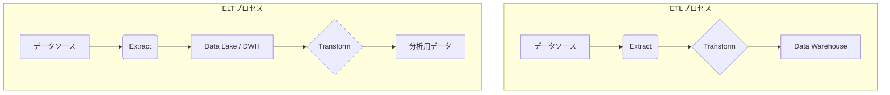

# 第5章 データエンジニアリング基礎

## 🎯 この章で学ぶこと
- データエンジニアリングがなぜ現代のソフトウェア開発、特にAI開発において不可欠であるかを理解する。
- 「データパイプライン」の概念と、その主要な3ステップ（ETL/ELT）を説明できる。
- バッチ処理とストリーム処理の違いと、それぞれの適切な使い分けを判断できるようになる。
- データレイク、データウェアハウス（DWH）、データマートの役割の違いと関係性を説明できる。
- データ品質の重要性と、それを担保するための基本的なアプローチを理解する。

## 🤔 なぜ重要なのか
あなたはAIモデルを開発する優秀なAIエンジニアだとします。しかし、手元にあるデータは形式がバラバラで、ノイズが多く、しかも毎日手動で集計しなければなりません。これでは、AIモデルの性能を改善するどころか、データの準備だけで一日が終わってしまいます。

このように、**AIやデータ分析の価値は、その源泉となるデータの質とアクセス性に大きく依存します。** データエンジニアリングは、この「データ」をいつでも使える状態に整備し、安定的に供給するための、いわば**兵站（へいたん）**の役割を担う分野です。信頼性の高いデータを効率的に収集、保存、加工、提供する仕組み（データパイプライン）を構築することで、データサイエンティストやAIエンジニアは本来の価値創出活動に集中できます。

「ゴミを入力すれば、ゴミしか出てこない（Garbage In, Garbage Out）」という言葉の通り、質の低いデータからは優れたAIモデルは生まれません。データエンジニアリングは、その「ゴミ」を「宝」に変えるための、現代開発における生命線なのです。

## 📚 基礎概念の理解

### データパイプライン：データの流れを自動化する仕組み
データパイプラインとは、ある場所から別の場所へデータを移動させ、その過程で処理・変換を行う一連のプロセスのことです。これにより、手作業で行っていたデータの移動や加工を自動化し、信頼性と効率性を高めます。このパイプラインは、多くの場合**ETL**または**ELT**というプロセスで構成されます。

- **ETL (Extract, Transform, Load)**
    1.  **Extract（抽出）**: 様々なデータソース（例：アプリケーションのDB、ログファイル、外部API）からデータを引き出す。
    2.  **Transform（変換）**: データを使いやすい形式に加工・変換する。例えば、日付のフォーマットを統一したり、不要な情報を取り除いたり、複数のデータを結合したりする。
    3.  **Load（格納）**: 変換済みのデータを、最終的な保存先であるデータウェアハウス（DWH）などに格納する。

- **ELT (Extract, Load, Transform)**
    1.  **Extract（抽出）**: データソースからデータを抽出する。
    2.  **Load（格納）**: データを**未加工のまま**、データレイクやDWHに一度格納する。
    3.  **Transform（変換）**: DWHなどの強力な計算リソースを使って、格納されたデータを変換・加工する。

クラウドDWHの性能向上により、近年はELTのアプローチが主流になりつつあります。生データを先にロードしておくことで、後から様々な目的に応じて柔軟にデータを加工できるという利点があります。

### バッチ処理 vs. ストリーム処理
データパイプラインでデータをどう処理するかには、大きく2つの方法があります。

1.  **バッチ処理 (Batch Processing)**
    -   **概念**: データを一定期間（例：1時間、1日）溜め込み、まとめて一括で処理する方式。
    -   **例え**: 1日の売上データを集計して、夜間にレポートを作成する。
    -   **特徴**: 大量のデータを効率的に処理できる。リアルタイム性は低い。
    -   **適した用途**: 定期的なレポート作成、大規模なデータ分析、機械学習モデルの定期的な学習。

2.  **ストリーム処理 (Stream Processing)**
    -   **概念**: データが発生したそばから、ほぼリアルタイムに次々と処理していく方式。
    -   **例え**: 不正利用検知システムが、クレジットカードの利用履歴を即座に分析する。
    -   **特徴**: リアルタイム性が高い。個々のデータに対する即時アクションが可能。
    -   **適した用途**: 不正検知、リアルタイムのモニタリングダッシュボード、IoTデバイスからのセンサーデータ分析。

どちらか一方が優れているわけではなく、目的によって使い分けることが重要です。

### データの保管場所：レイク、DWH、マート
データの保管場所には、その目的や状態に応じていくつかの種類があります。

-   **データレイク (Data Lake)**
    -   **概念**: 加工・未加工を問わず、あらゆる形式のデータをそのままの形で保存する巨大なリポジトリ。
    -   **例え**: 様々な種類の食材（野菜、肉、魚）を、調理前のまま放り込んでおく巨大な冷蔵庫。
    -   **目的**: とりあえずデータを失わないように全て保存し、将来の未知の分析に備える。ELTプロセスの「L」の格納先としてよく使われる。

-   **データウェアハウス (Data Warehouse, DWH)**
    -   **概念**: 分析しやすいように、構造化・整理されたデータを格納するデータベース。
    -   **例え**: レシピ（分析目的）に合わせて、カット済みの野菜や下処理済みの肉など、調理しやすい状態の食材が整理された棚。
    -   **目的**: BIツールでの可視化や定型的なレポーティングなど、特定の分析目的のために最適化されたデータを提供する。

-   **データマート (Data Mart)**
    -   **概念**: DWHの中から、さらに特定の部署や目的に特化したデータだけを切り出して格納した、より小規模なデータベース。
    -   **例え**: 「カレーを作る」という目的のために、必要な具材だけを集めた調理キット。
    -   **目的**: 営業部向けの売上分析、マーケティング部向けの顧客分析など、利用者を限定して迅速なデータアクセスを提供する。

これらの関係は、**データレイク → DWH → データマート** の順にデータが流れ、より加工・整理されていくイメージです。

## 💡 実践的な活用

### ハンズオン：簡単なETLパイプラインを考える
架空のECサイトを例に、ETLパイプラインの設計を考えてみましょう。

**要件**: 「どの商品がどの年代のユーザーによく購入されているか」を分析したい。

1.  **Extract（抽出）**
    -   **どこから？**:
        -   アプリケーションのDB（MySQL）から `orders`（注文）テーブルと`users`（ユーザー）テーブルを取得。
        -   Webサーバーのアクセスログから、どの商品ページが閲覧されたかのログを取得。
    -   **何を？**:
        -   `orders`テーブル: `order_id`, `user_id`, `product_id`, `order_date`
        -   `users`テーブル: `user_id`, `birth_date`
        -   アクセスログ: `timestamp`, `url`, `user_id`

2.  **Transform（変換）**
    -   `users`テーブルの `birth_date` から **年代**（20代, 30代など）を計算する。
    -   `orders`テーブルと、年代を計算した`users`テーブルを `user_id` で**結合**する。
    -   アクセスログの `url` から **`product_id`** を抽出する。
    -   （必要であれば）データのクレンジング（欠損値の処理など）を行う。

3.  **Load（格納）**
    -   最終的に整形されたデータ（例：`order_id`, `product_id`, `user_generation`, `order_date`）を、分析用のDWH（例：BigQuery, Redshift）の `sales_analysis` テーブルに格納する。

このパイプラインを定期的に（例：毎日深夜に）実行することで、分析担当者はいつでも最新のデータで分析を開始できます。実際の開発では、AirflowやDagsterといったワークフロー管理ツールを使い、これらの処理を自動実行させます。

### データ品質管理の重要性
パイプラインを構築しても、流れてくるデータ自体の品質が低いと意味がありません。データ品質を担保するための基本的な観点には以下のようなものがあります。

-   **正確性 (Accuracy)**: データが現実世界の事実と一致しているか。（例：ユーザーの年齢がマイナスになっていないか）
-   **完全性 (Completeness)**: 必要なデータが欠けていないか。（例：必須であるはずの住所が空欄になっていないか）
-   **一貫性 (Consistency)**: 異なるシステム間でデータが矛盾していないか。（例：顧客DBと請求DBで同じ顧客の氏名が異なっていないか）
-   **適時性 (Timeliness)**: データが必要なタイミングで利用可能か。（例：リアルタイム不正検知のはずが、データが1時間遅れで届く）
-   **一意性 (Uniqueness)**: 重複したデータが存在しないか。（例：同じユーザーが複数回登録されている）

これらの品質を監視し、問題があればアラートを出すような仕組み（データ品質モニタリング）をパイプラインに組み込むことが、信頼性の高いデータ基盤には不可欠です。

## 🔍 深掘り：プロの視点

### データガバナンスとデータカタログ
データが大規模かつ多様になると、「どこに、どんなデータが、どんな意味で存在するのか」が分からなくなる「データのサイロ化」という問題が発生します。これに対処するのが**データガバナンス**です。

-   **データガバナンス (Data Governance)**: データ資産を組織的に管理するためのルール、プロセス、役割、標準の集合体です。誰がデータにアクセスでき、誰が責任を持つのかなどを定義します。
-   **データカタログ (Data Catalog)**: データガバナンスを支援するツールで、組織内のデータを検索・発見可能にします。各データが「どこにあり（場所）、何を含み（メタデータ）、誰が使っているか（利用状況）」をまとめた、いわば**データの辞書**です。

データエンジニアは、単にパイプラインを作るだけでなく、データカタログを整備・拡充し、データ利用者がセルフサービスで安全にデータを活用できる環境を整える役割も担います。

### サーバーレス技術の活用
かつてデータパイプラインの構築・運用には、常にサーバーの管理が伴いました。しかし、近年ではAWS LambdaやGoogle Cloud Functionsといった**サーバーレス**技術を活用することで、インフラ管理の手間を大幅に削減できます。

-   **利点**:
    -   **スケーラビリティ**: 処理量に応じて自動でスケールするため、アクセスの増減に強い。
    -   **コスト効率**: コードが実行されている時間だけ課金されるため、コストを最適化しやすい。
    -   **運用負荷の軽減**: サーバーのプロビジョニングやパッチ適用などが不要になる。

例えば、「S3（オブジェクトストレージ）に新しいファイルが置かれたら、それをトリガーにLambdaを起動してETL処理を行い、結果をDWHに書き込む」といったパイプラインは、サーバーレスで非常に効率的に構築できます。

## 📋 まとめとチェックポイント
- データエンジニアリングは、質の高いデータを安定的に供給し、AIやデータ分析の土台を支える重要な役割を担う。
- データパイプラインはデータの抽出・変換・格納（ETL/ELT）を自動化する仕組みである。
- 処理方式には、溜めてから処理する「バッチ処理」と、即座に処理する「ストリーム処理」がある。
- データは、生データを置く「データレイク」、分析用に整理された「DWH」、目的に特化した「データマート」と、段階的に保管される。
- パイプラインを流れるデータの品質（正確性、完全性など）を担保する仕組みが不可欠である。

**セルフチェック**
- [ ] ETLとELTの違いを、データ変換（Transform）がどのタイミングで行われるかに着目して説明できますか？
- [ ] 「昨日の全店舗の売上集計」と「Webサイトのリアルタイム不正アクセス検知」、それぞれに適しているのはバッチ処理とストリーム処理のどちらですか？
- [ ] あなたが会社のデータ基盤をゼロから作るとしたら、データレイクとデータウェアハウスをそれぞれどのような目的で導入しますか？
- [ ] なぜ、ただデータパイプラインを作るだけでなく、データ品質の監視が重要になるのでしょうか？

## 🔗 関連知識・発展学習
- **リレーショナルデータベース (`0131_Relational_Database.md`)**: ETL/ELTの主要な「抽出元」となるデータソースです。
- **NoSQLデータベース (`0133_NoSQL_Database.md`)**: 多様なデータ構造を扱うデータレイクの概念と親和性があります。
- **クラウドコンピューティング (`051_Cloud_Computing`)**: 現代のデータエンジニアリングは、AWS, GCP, Azureといったクラウドプラットフォーム上で構築されるのが一般的です。
- **MLOps (`0535_MLOps.md`)**: データパイプラインは、MLモデルの学習データを供給する、MLOpsの重要な構成要素です。 