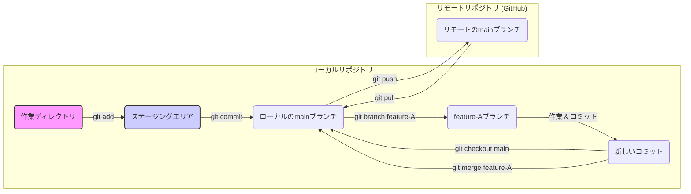

# 第1章 Gitの基本概念と操作

## 🎯 この章で学ぶこと
- バージョン管理システム（VCS）がなぜ必要不可欠なのかを、具体的な開発シナリオを交えて説明できる。
- Gitの基本的な仕組みである「リポジトリ」「コミット」「ブランチ」「マージ」の4つのコア概念を自分の言葉で説明できる。
- `git add`, `git commit`, `git push`, `git pull` といった、日々の開発で最もよく使うコマンドを正しく使い分けられる。
- 変更履歴を追跡し、過去の任意のバージョンに戻すことができるようになる。
- ローカルリポジトリとリモートリポジトリの役割の違いと、それらを連携させる方法を理解する。

## 🤔 なぜ重要なのか
あなたは友人と2人でゲームを開発しています。ある日、あなたが書いたコードが原因でゲームが動かなくなってしまいました。しかし、どこをどう直せば元に戻るのか分かりません。さらに悪いことに、友人が昨日追加した新機能のコードも、あなたが行った変更と混ざってしまい、どれが誰の変更なのか判別不能に...。

このような「変更の混沌」から開発者を救うのが、**バージョン管理システム (Version Control System, VCS)** であり、その中でもデファクトスタンダード（事実上の標準）となっているのが **Git** です。

Gitは、ファイルの変更履歴を「スナップショット」として記録し、いつでも好きな時点の状態に戻したり、複数の開発者による変更を安全に統合したりすることができます。AIにコード生成を任せる現代においても、生成されたコードを管理し、チームで共有し、問題があれば即座に元に戻すという作業は、依然として人間が行うべき本質的なタスクです。Gitを使いこなすことは、プロのエンジニアとしての最低限の責務であり、チーム開発に参加するための「パスポート」と言えるでしょう。

## 📚 基礎概念の理解

### Gitの4つのコア概念
Gitを理解する上で最も重要なのが、以下の4つの概念です。

1.  **リポジトリ (Repository)**
    -   **概念**: ファイルやディレクトリの状態、そしてそれらの変更履歴を保存する「場所」。` .git `という隠しディレクトリがその本体です。
    -   **種類**:
        -   **ローカルリポジトリ**: あなた自身のPC上に存在するリポジトリ。作業はここで行います。
        -   **リモートリポジトリ**: GitHubなどのサーバー上に存在し、チームで共有するためのリポジトリ。
    -   **例え**: ゲームのセーブデータ置き場。セーブポイント（コミット）ごとにゲームの状態が保存されている。

2.  **コミット (Commit)**
    -   **概念**: ファイルの変更をリポジトリに記録する「操作」であり、その記録自体のこと。各コミットは、その時点でのプロジェクト全体の「スナップショット」です。
    -   **特徴**:
        -   誰が、いつ、どのような変更を行ったかのメッセージを付与できる。
        -   `e4a9c8f`のような一意のID（ハッシュ）を持ち、履歴の中から特定のコミットを正確に識別できる。
    -   **例え**: セーブポイントを作成する行為。セーブ時には「主人公が新しい剣を手に入れた」といったメモを残せる。

3.  **ブランチ (Branch)**
    -   **概念**: 履歴の流れを分岐させ、他のブランチに影響を与えることなく独立して作業を進めるための仕組み。
    -   **主なブランチ**:
        -   `main` (または `master`): 本流となる、常に安定しているべきブランチ。
        -   `feature`ブランチ: 新機能開発など、特定の作業のために作成する一時的なブランチ。
    -   **例え**: ゲームのシナリオ分岐。本編（main）に影響を与えずに、新しいサブクエスト（featureブランチ）の開発を進めることができる。

4.  **マージ (Merge)**
    -   **概念**: 分岐したブランチの変更内容を、別のブランチ（通常は`main`）に統合する操作。
    -   **例え**: 開発が完了したサブクエストを、ゲームの本編に組み込むこと。

これらの概念の関係性を、以下の図でイメージしてください。



### Gitの基本的なワークフロー
日々の開発は、主に以下の流れで行われます。

1.  **変更のステージング (`git add`)**: コミットしたいファイルの変更を、「ステージングエリア」と呼ばれるカゴに入れる。これにより、どの変更をコミットに含めるかを選択できます。
2.  **変更のコミット (`git commit`)**: ステージングエリアに入っている変更を、意味のある単位でローカルリポジトリに記録する。
3.  **リモートへのプッシュ (`git push`)**: ローカルリポジトリのコミット履歴を、リモートリポジトリにアップロードして共有する。
4.  **リモートからのプル (`git pull`)**: リモートリポジトリの最新の変更を、ローカルリポジトリにダウンロードして統合する。チームで作業する際は、作業開始前に必ず行うべき操作です。

## 💡 実践的な活用

### ハンズオン：Gitコマンドを使ってみよう
ここでは、ターミナル（コマンドラインツール）上で基本的なGitコマンドを実行する流れをシミュレーションします。

**前提**: Gitがインストールされており、GitHubアカウントを持っていること。

1.  **リポジトリの作成と初期化**
    ```bash
    # 1. 作業用のディレクトリを作成し、移動する
    mkdir my-git-project
    cd my-git-project

    # 2. このディレクトリをGitリポジトリとして初期化する
    # これにより、`.git`ディレクトリが作成される
    git init
    ```

2.  **最初のコミット**
    ```bash
    # 1. README.mdというファイルを作成し、内容を書き込む
    echo "# My First Project" > README.md

    # 2. 変更をステージングエリアに追加する
    git add README.md

    # 3. 変更をコミットする (-mオプションでコミットメッセージを指定)
    git commit -m "Initial commit: Add README.md"
    ```

3.  **リモートリポジトリとの連携**
    -   まず、GitHub上で `my-git-project` という名前の新しいリポジトリを作成します（この手順はWebサイト上で行います）。
    -   作成後、表示される指示に従ってリモートリポジトリを登録します。
    ```bash
    # 1. リモートリポジトリのURLを 'origin' という名前で登録する
    git remote add origin https://github.com/YOUR_USERNAME/my-git-project.git

    # 2. ローカルのmainブランチの内容を、リモートのoriginにプッシュする
    # -u オプションは、今後のpush/pullのデフォルト先として設定する
    git push -u origin main
    ```

4.  **ブランチを作成して作業する**
    ```bash
    # 1. 'add-feature'という名前の新しいブランチを作成し、そのブランチに切り替える
    git checkout -b add-feature

    # 2. 新しいファイルを作成してコミットする
    echo "This is a new feature." > feature.txt
    git add feature.txt
    git commit -m "feat: Add new feature file"

    # 3. mainブランチに戻る
    git checkout main

    # 4. featureブランチの変更をmainブランチにマージする
    git merge add-feature

    # 5. マージした結果をリモートにプッシュする
    git push
    ```

### よくあるミスと対処法：`git status`と`git log`
-   **`git status`**: 現在のリポジトリの状態（どのファイルが変更されたか、ステージングされているかなど）を確認できる、**最も重要なコマンド**の一つ。何か操作に迷ったら、まず`git status`を実行する癖をつけましょう。
-   **`git log`**: これまでのコミット履歴を一覧表示します。`--oneline`オプションをつけると、1行で簡潔に表示されて便利です。コミットIDを確認して、過去の状態に戻したい場合などに使います。

## 🔍 深掘り：プロの視点

### コミットは「意味のある単位」で
初心者がやりがちなのが、一日の作業の最後に全ての変更をまとめて一つのコミットにしてしまうことです。これは避けるべきです。

-   **良いコミット**:
    -   一つの関心事（例：「ログイン機能を追加」「バグAを修正」）に絞られている。
    -   後から履歴を見た人が、何のための変更か一目で理解できる。
-   **悪いコミット**:
    -   「作業の進捗」といった曖昧なメッセージ。
    -   複数の無関係な変更（バグ修正と新機能開発など）が混在している。

コミットを意味のある単位に保つことで、コードレビューがしやすくなったり、問題が発生した際に原因となった変更を特定しやすくなったり（`git bisect`）するメリットがあります。

### コンフリクト（競合）の解決
チーム開発では、複数の開発者が同じファイルの同じ箇所を同時に変更してしまうことがあります。この状態でマージしようとすると、Gitはどちらの変更を優先すべきか判断できず、**コンフリクト（競合）**が発生します。

コンフリクトが発生すると、対象のファイルに以下のような特殊なマーカーが書き込まれます。

```
<<<<<<< HEAD
// あなたの変更内容
=======
// マージしようとしたブランチの変更内容
>>>>>>> feature-branch-name
```

このマーカーを手動で編集し、どちらの変更を残すか（あるいは両方を組み合わせるか）を決定し、マーカーを削除した上で再度コミッすることで、コンフリクトを解決できます。コンフリクトの解決は最初は戸惑うかもしれませんが、チーム開発では避けては通れない道です。

## 📋 まとめとチェックポイント
- Gitは、ファイルの変更履歴を管理し、チームでの協業を円滑にするためのバージョン管理システム。
- 「リポジトリ」「コミット」「ブランチ」「マージ」がGitの4大コア概念。
- 日々の作業は `add` → `commit` → `push` / `pull` の流れが基本。
- `git status` は現在の状態を知るための羅針盤、 `git log` は過去の履歴を知るための航海日誌。
- コミットは「一つの関心事」ごとに、意味のある単位で作成することが重要。

**セルフチェック**
- [ ] あなたのPC上で行う作業と、GitHub上でチームと共有する作業は、それぞれどのリポジトリで行いますか？
- [ ] 新しい機能の開発を始める際、なぜ `main` ブランチから直接作業するのではなく、新しいブランチを作成するべきなのですか？
- [ ] `git add` と `git commit` の役割の違いを説明できますか？ なぜ2つのステップに分かれているのでしょうか？
- [ ] チームメンバーがリモートリポジトリを更新した可能性がある場合、あなたがコーディングを始める前にまず実行すべきコマンドは何ですか？

## 🔗 関連知識・発展学習
- **GitHubの活用方法 (`0212_GitHub_Utilization.md`)**: リモートリポジトリのホスティングだけでなく、プルリクエストやIssueといったチーム開発を加速させる機能について学びます。
- **ブランチ戦略 (`0213_Branch_Strategy.md`)**: Git-flowなど、チームで効率的に開発を進めるためのブランチ運用のベストプラクティスについて学びます。
- **コードレビューとコラボレーション (`0214_Code_Review_Collaboration.md`)**: GitとGitHubを使ったコードレビューの文化と、その実践方法について深掘りします。 