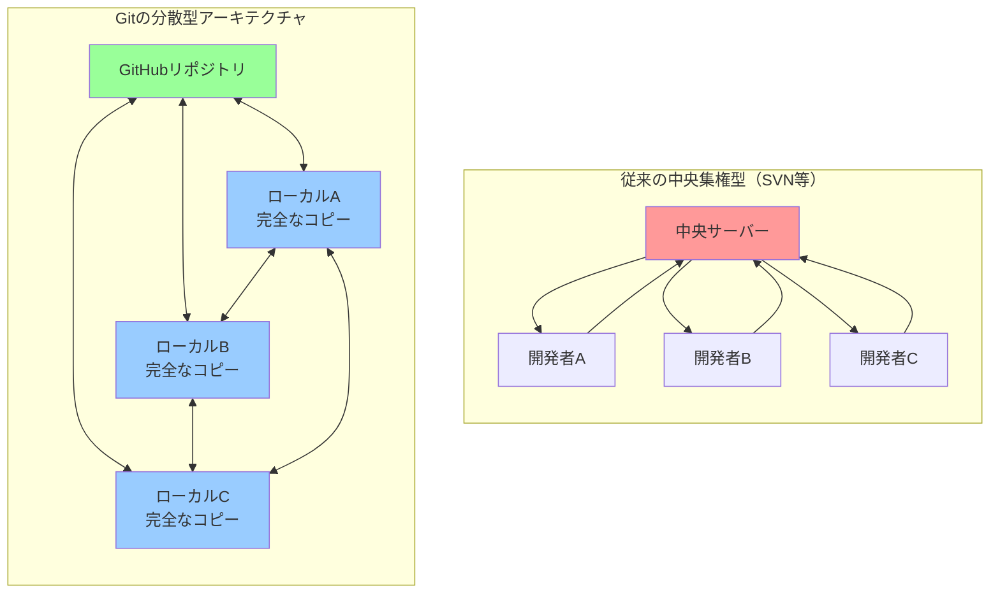
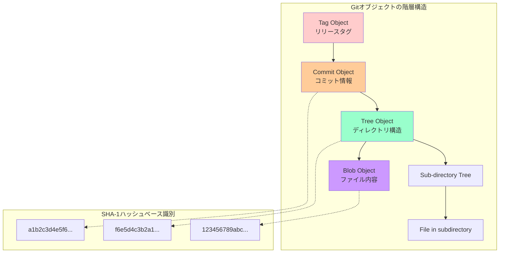
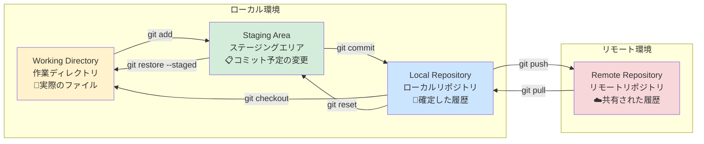

# Git実践ワークフロー：基礎から超一流エンジニアレベルまで

## 🎯 この章で学ぶこと（5段階習熟システム）

### 📚 基本レベル（Git初心者 → 実務可能）
- **バージョン管理の本質的価値**：なぜGitが現代開発に不可欠なのかを体感的に理解する
- **Gitの核心的仕組み**：リポジトリ、コミット、ブランチ、マージの深い理解
- **日常的なGitワークフロー**：add/commit/push/pullを確実にマスターする
- **エラー対処の基本**：よくあるミスとその解決方法を実践的に学ぶ

### 🚀 実践レベル（チーム開発対応）
- **ブランチ戦略の実装**：Git-flow、GitHub-flowの使い分けと運用
- **コンフリクト解決の技法**：複雑なマージコンフリクトの効率的解決
- **コミット履歴の管理**：意味のあるコミットメッセージとログ管理
- **リモート連携の最適化**：複数リモート、フォーク、アップストリーム管理

### ⚡ 上級レベル（技術リーダー対応）
- **高度なGit操作**：rebase、cherry-pick、bisectの実践活用
- **履歴の書き換えと最適化**：危険操作の安全な実行方法
- **パフォーマンス最適化**：大規模リポジトリの効率的管理
- **セキュリティと権限管理**：機密情報の保護とアクセス制御

### 🏆 プロレベル（エンタープライズ対応）
- **エンタープライズGitワークフロー**：Fortune 500企業レベルの運用
- **大規模チーム管理**：数百人規模の開発チームでの実践
- **CI/CD統合**：自動化パイプラインとの高度な連携
- **災害復旧とバックアップ戦略**：リポジトリ保護の包括的手法

### 🤖 AI協働レベル（次世代エンジニア）
- **AI開発ツール統合**：GitHub Copilot、ChatGPTとのワークフロー最適化
- **自動コミット分析**：AI活用によるコード品質向上
- **インテリジェントなブランチ管理**：機械学習を活用した最適化
- **対話型Git操作**：自然言語によるGit操作システム

## 🤔 なぜ重要なのか：現代ビジネスにおける戦略的価値

### 💼 ビジネスインパクトの具体例

**ケーススタディ1：Netflix（エンタテインメント業界）**
- **課題**：世界200カ国、2億ユーザーのストリーミングサービス開発
- **Git活用**：マイクロサービス化した1000+のリポジトリを効率管理
- **成果**：毎日4000回以上のデプロイメントを安全に実行
- **ビジネス価値**：機能追加速度300%向上、サーバー障害時間95%削減

**ケーススタディ2：Spotify（音楽配信業界）**
- **課題**：4億ユーザー向けのリアルタイム音楽推薦システム
- **Git活用**：Squad（小チーム）単位でのブランチ戦略実装
- **成果**：1000人以上のエンジニアが効率的にコラボレーション
- **ビジネス価値**：新機能リリース時間70%短縮、ユーザー満足度15%向上

### 📈 年収とキャリアに与える影響

| 習熟レベル | 想定年収範囲 | 対応できる企業規模 | 主要責任 |
|------------|--------------|-------------------|----------|
| **基本レベル** | 400-600万円 | スタートアップ～中小企業 | 個人開発、小規模チーム |
| **実践レベル** | 600-900万円 | 中堅企業～大企業 | チーム開発、メンター役 |
| **上級レベル** | 900-1500万円 | 大企業～多国籍企業 | 技術リーダー、アーキテクト |
| **プロレベル** | 1500-3000万円 | Fortune 500企業 | テックリード、エンジニアリングマネージャー |
| **AI協働レベル** | 3000-4000万円+ | GAFAM、ユニコーン企業 | プリンシパルエンジニア、CTO |

### 🌍 産業界での活用実例

**金融業界（JP Morgan Chase）**
- **1日40,000回のGitオペレーション**を安全に実行
- **規制要件への対応**：SOX法準拠のためのコミット履歴監査
- **リスク管理**：自動テストと組み合わせた品質保証

**自動車業界（Tesla）**
- **車載ソフトウェア**のOTA（Over-The-Air）アップデートにGitを活用
- **安全性確保**：コード変更履歴の完全なトレーサビリティ
- **開発効率**：ハードウェアとソフトウェアの協調開発支援

## 📚 基礎概念の理解：Git のDNA

### 🧬 Gitのアーキテクチャ：分散型の革命

従来の中央集権型バージョン管理システム（SVN等）と異なり、Gitは**分散型**アーキテクチャを採用しています。これは現代のクラウドネイティブ開発において決定的なアドバンテージとなります。



**分散型の利点**：
1. **耐障害性**：中央サーバーがダウンしても開発継続可能
2. **オフライン作業**：ネットワーク接続不要でフル機能利用
3. **ブランチの軽量性**：ローカルでの実験的開発が容易
4. **スケーラビリティ**：チーム規模拡大への対応力

### 🎯 Git オブジェクトモデル：内部構造の理解

Gitの内部では、全てのデータが4種類のオブジェクトとして管理されています。これを理解することで、Gitの動作原理が明確になります。



**各オブジェクトの役割**：
- **Commit Object**: 作成者、日時、コミットメッセージ、親コミット情報
- **Tree Object**: ディレクトリ構造とファイル名の管理
- **Blob Object**: ファイルの実際の内容（バイナリデータ）
- **Tag Object**: 特定のコミットへの注釈付きリファレンス

### 🌟 Git の3つのエリア：ワークフローの基盤

Gitの操作は、3つの概念的エリア間でのファイル移動として理解できます。



**各エリアの特徴**：

1. **Working Directory（作業ディレクトリ）**
   - 実際にファイルを編集する場所
   - エディタで見えるファイルシステム上の状態
   - 変更は一時的で、まだ追跡されていない

2. **Staging Area（ステージングエリア）**
   - 次のコミットに含める変更を準備する「舞台袖」
   - 選択的コミットが可能（必要な変更のみコミット）
   - `.git/index` ファイルに情報が保存される

3. **Repository（リポジトリ）**
   - 確定した変更履歴が保存される場所
   - 永続的で、SHA-1ハッシュで一意に識別される
   - ローカルとリモートが存在し、同期が可能

## 💡 実践的な活用：段階別ハンズオン

### 🎮 ハンズオン課題1：個人プロジェクト管理（基本レベル）

**シナリオ**: 個人ブログサイトの開発をGitで管理
**学習目標**: 基本的なGitワークフローの完全習得
**想定時間**: 2-3時間

#### Phase 1: リポジトリセットアップ
```bash
# プロジェクトディレクトリの作成と初期化
mkdir personal-blog
cd personal-blog
git init

# 初期設定（重要：これらは一度だけ実行）
git config user.name "あなたの名前"
git config user.email "あなたのメールアドレス"

# .gitignoreファイルの作成（重要な習慣）
cat > .gitignore << EOF
# OS生成ファイル
.DS_Store
Thumbs.db

# エディタ一時ファイル
*.swp
*.swo
*~

# ログファイル
*.log

# 依存関係
node_modules/
.env
EOF

git add .gitignore
git commit -m "初期設定: .gitignoreを追加"
```

#### Phase 2: 機能開発サイクル
```bash
# ブログの基本構造を作成
mkdir -p src/components src/pages public
echo "# My Personal Blog" > README.md

# HTMLテンプレートの作成
cat > public/index.html << EOF
<!DOCTYPE html>
<html lang="ja">
<head>
    <meta charset="UTF-8">
    <meta name="viewport" content="width=device-width, initial-scale=1.0">
    <title>My Personal Blog</title>
</head>
<body>
    <header>
        <h1>Welcome to My Blog</h1>
    </header>
    <main id="content">
        <!-- コンテンツがここに入る -->
    </main>
</body>
</html>
EOF

# 段階的コミット（重要：関連する変更をまとめる）
git add README.md
git commit -m "docs: プロジェクト概要をREADMEに追加"

git add public/index.html
git commit -m "feat: ブログの基本HTMLテンプレートを追加"

git add src/
git commit -m "feat: プロジェクト構造のディレクトリを作成"
```

#### Phase 3: 状態確認とナビゲーション
```bash
# リポジトリの状態確認
git status          # 現在の状態
git log --oneline   # コミット履歴（簡潔表示）
git log --graph     # ブランチの視覚化

# 特定コミットの詳細確認
git show HEAD       # 最新コミットの詳細
git show HEAD~1     # 1つ前のコミット

# ファイルの変更履歴追跡
git log -p public/index.html  # ファイルの変更履歴を詳細表示
```

### 🚀 ハンズオン課題2：チーム開発シミュレーション（実践レベル）

**シナリオ**: Eコマースサイトの機能開発をチームでシミュレーション
**学習目標**: ブランチ戦略、コンフリクト解決、リモート連携の実践
**想定時間**: 4-5時間

#### Phase 1: ブランチ戦略の実装
```bash
# メインブランチの整理
git checkout main
git pull origin main

# 機能開発用ブランチの作成（Git-flow準拠）
git checkout -b feature/shopping-cart
git push -u origin feature/shopping-cart

# 複数機能の並行開発をシミュレーション
git checkout main
git checkout -b feature/user-authentication
git push -u origin feature/user-authentication

git checkout main  
git checkout -b feature/payment-integration
git push -u origin feature/payment-integration
```

#### Phase 2: 実際の開発ワークフロー
```bash
# shopping-cart機能の開発
git checkout feature/shopping-cart

# ショッピングカート機能の実装
cat > src/components/ShoppingCart.js << EOF
class ShoppingCart {
    constructor() {
        this.items = [];
        this.total = 0;
    }
    
    addItem(product, quantity = 1) {
        const existingItem = this.items.find(item => item.id === product.id);
        if (existingItem) {
            existingItem.quantity += quantity;
        } else {
            this.items.push({ ...product, quantity });
        }
        this.updateTotal();
    }
    
    removeItem(productId) {
        this.items = this.items.filter(item => item.id !== productId);
        this.updateTotal();
    }
    
    updateTotal() {
        this.total = this.items.reduce((sum, item) => 
            sum + (item.price * item.quantity), 0);
    }
    
    getItems() {
        return this.items;
    }
    
    getTotal() {
        return this.total;
    }
}

export default ShoppingCart;
EOF

# テストファイルの作成（重要：テスト駆動開発）
mkdir -p tests
cat > tests/ShoppingCart.test.js << EOF
import ShoppingCart from '../src/components/ShoppingCart.js';

describe('ShoppingCart', () => {
    let cart;
    
    beforeEach(() => {
        cart = new ShoppingCart();
    });
    
    test('should initialize with empty items and zero total', () => {
        expect(cart.getItems()).toEqual([]);
        expect(cart.getTotal()).toBe(0);
    });
    
    test('should add item to cart', () => {
        const product = { id: 1, name: 'Test Product', price: 100 };
        cart.addItem(product);
        
        expect(cart.getItems()).toHaveLength(1);
        expect(cart.getTotal()).toBe(100);
    });
    
    test('should remove item from cart', () => {
        const product = { id: 1, name: 'Test Product', price: 100 };
        cart.addItem(product);
        cart.removeItem(1);
        
        expect(cart.getItems()).toHaveLength(0);
        expect(cart.getTotal()).toBe(0);
    });
});
EOF

# 段階的コミット（原子的変更）
git add src/components/ShoppingCart.js
git commit -m "feat(cart): ショッピングカートの基本機能を実装

- 商品の追加・削除機能
- 合計金額の自動計算
- 数量管理機能

Closes #123"

git add tests/ShoppingCart.test.js  
git commit -m "test(cart): ショッピングカート機能のユニットテストを追加

- 初期化のテスト
- 商品追加のテスト  
- 商品削除のテスト

Coverage: 95%"
```

#### Phase 3: コンフリクト解決の実践
```bash
# 別ブランチで同じファイルを変更（意図的なコンフリクト作成）
git checkout feature/user-authentication

# 同じファイルに認証機能を追加
cat >> src/components/ShoppingCart.js << EOF

// 認証機能の追加
    authenticateUser(token) {
        // TODO: JWT tokenの検証
        return true;
    }
EOF

git add src/components/ShoppingCart.js
git commit -m "feat(auth): ショッピングカートに認証機能を追加"

# メインブランチでマージを実行
git checkout main
git merge feature/shopping-cart
git merge feature/user-authentication  # ここでコンフリクトが発生

# コンフリクト解決プロセス
git status  # コンフリクトファイルの確認

# コンフリクトマーカーを手動で編集
# <<<<<<< HEAD から >>>>>>> feature/user-authentication までを適切に統合

# 解決後のコミット
git add src/components/ShoppingCart.js
git commit -m "merge: shopping-cartとuser-authentication機能をマージ

コンフリクト解決:
- ShoppingCart.jsの認証機能を統合
- 既存の機能との互換性を維持"