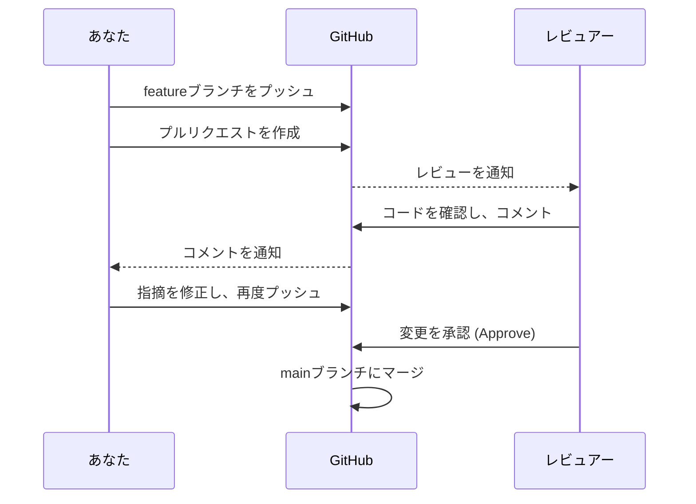

# 第2章 GitHubの活用方法：単なるコード置き場からの脱却

## 🎯 この章で学ぶこと
- GitHubが単なるリモートリポジトリではなく、開発を加速させる「プラットフォーム」であることを理解する。
- プルリクエスト（Pull Request, PR）を作成し、コードレビューを依頼する一連の流れを実践できる。
- Issue（イシュー）を使って、タスク管理やバグ報告、機能要望を行う方法を習得する。
- GitHub Actionsを使い、プッシュやプルリクエストをトリガーとした基本的なCI（継続的インテグレーション）を構築できる。
- GitHubが提供する他の重要な機能（Projects, Wiki, Releasesなど）の概要と目的を説明できる。

## 🤔 なぜ重要なのか
前の章で、あなたはGitを使いこなし、ローカルでの変更履歴をリモートリポジトリに保存できるようになりました。しかし、実際の開発は一人で完結することは稀です。チームで協力し、お互いのコードをレビューし、タスクの進捗を共有し、品質を保ちながら開発を進める必要があります。

ここで登場するのが**GitHub**です。GitHubは、Gitのリモートリポジトリ機能を提供するだけではありません。**プルリクエスト**によるコードレビュー文化、**Issue**によるタスク管理、**GitHub Actions**によるテストやデプロイの自動化など、チーム開発を円滑に進めるための強力な機能を数多く提供しています。

AIがコードを生成してくれる時代だからこそ、そのコードの品質を担保し、チームの合意を形成するプロセスがより重要になります。GitHubを「ソースコードの置き場所」としてしか使っていないエンジニアと、「開発ハブ」として使いこなしているエンジニアとでは、生産性に天と地ほどの差が生まれます。GitHubを使いこなすことは、現代のチーム開発における必須スキルなのです。

## 📚 基礎概念の理解

### プルリクエスト (Pull Request): 変更を提案し、議論する場
プルリクエスト（PR、またはマージリクエストとも呼ばれる）は、GitHubにおけるコラボレーションの中核機能です。

-   **概念**: 自分が作成したブランチ（例：`feature-A`）の変更内容を、別のブランチ（例：`main`）に取り込んでもらうように「お願い」する機能です。
-   **目的**:
    1.  **コードレビュー**: 変更内容をチームメンバーにレビューしてもらい、品質を高める。
    2.  **議論の場**: なぜこの変更が必要なのか、より良い実装はないかなどを、コードを基に議論する。
    3.  **CIの実行**: プルリクエストが作成されたことをトリガーに、自動テストなどを実行する。
-   **流れ**:
    1.  ローカルで`feature`ブランチを作成し、変更をコミットする。
    2.  `feature`ブランチをリモートリポジトリ（GitHub）にプッシュする。
    3.  GitHubのWebサイト上で、`feature`ブランチから`main`ブランチへのプルリクエストを作成する。
    4.  チームメンバーがコードをレビューし、コメントや修正依頼を行う。
    5.  議論と修正が完了したら、プルリクエストが承認（Approve）され、`main`ブランチにマージされる。



### Issue: プロジェクトのタスク管理ハブ
Issueは、プロジェクトに関するあらゆる「課題」を管理するためのチケットです。

-   **用途**:
    -   **バグ報告**: 「特定の条件下でアプリがクラッシュする」といったバグの詳細を記録。
    -   **機能要望**: 「こんな機能が欲しい」といった新しいアイデアを提案。
    -   **タスク管理**: 「〇〇を実装する」「ドキュメントを整備する」といった具体的な作業を管理。
-   **特徴**:
    -   担当者（Assignee）を割り当てられる。
    -   ラベル（`bug`, `feature`, `documentation`など）を付けて分類できる。
    -   プルリクエストと連携させることができる（例：「このプルリクエストはIssue #10を解決します」）。

Issueを適切に使うことで、プロジェクトの現状や、誰が何をやっているのかが明確になり、タスクの抜け漏れを防ぎます。

### GitHub Actions: テストとデプロイの自動化
GitHub Actionsは、リポジトリでのイベント（例：プッシュ、プルリクエストの作成）をトリガーとして、あらかじめ定義したワークフロー（一連のコマンド）を自動で実行してくれるCI/CD（継続的インテグレーション/継続的デリバリー）の仕組みです。

-   **概念**: `.github/workflows/` ディレクトリにYAML形式の設定ファイルを置くことで、好きな処理を自動化できる。
-   **例**:
    -   プルリクエストが作成されたら、自動でコードをビルドし、テストを実行する。
    -   `main`ブランチにマージされたら、自動でWebサイトを本番環境にデプロイする。
    -   毎週月曜日の朝9時に、定期的なタスクを実行する。

GitHub Actionsを活用することで、これまで手作業で行っていた定型的な作業を自動化し、ヒューマンエラーを減らし、開発者はより創造的な作業に集中できます。

## 💡 実践的な活用

### ハンズオン：プルリクエストを作成してみよう

1.  **準備**:
    -   前の章で作成した `my-git-project` リポジトリを使います。
    -   GitHub上で、自分自身以外にコラボレーターを一人招待しておくと、より実践的な体験ができます（いなくても可）。

2.  **ローカルでの作業**
    ```bash
    # 1. 新しい機能のためのブランチを作成
    git checkout -b update-readme

    # 2. README.mdファイルを編集
    echo "Add a new line for Pull Request practice." >> README.md

    # 3. 変更をコミット
    git add README.md
    git commit -m "docs: Update README for PR practice"

    # 4. ブランチをGitHubにプッシュ
    git push origin update-readme
    ```

3.  **GitHub上での作業**
    -   ブラウザでGitHubのリポジトリページを開くと、「`update-readme` had recent pushes」という通知が表示されているはずです。
    -   **[Compare & pull request]** ボタンをクリックします。
    -   プルリクエストのタイトルと説明を記述します。説明には、なぜこの変更が必要なのか、どのような変更を加えたのかを分かりやすく書きましょう。
    -   レビュアー（Reviewers）や担当者（Assignees）を指定します（チーム開発の場合）。
    -   **[Create pull request]** ボタンをクリックして作成完了です。

これで、あなたの変更提案がチームに共有され、レビュープロセスが始まります。

### Issueとプルリクエストの連携
Issueでタスクを管理し、それに対応するプルリクエストを作成するのが一般的なワークフローです。

1.  GitHubで「ユーザー登録機能の実装」という**Issueを作成**します（例：Issue #5）。
2.  ローカルで、このIssueに対応するブランチを作成します（例：`feature/5-user-registration`）。ブランチ名にIssue番号を含めると分かりやすいです。
3.  実装が完了し、プルリクエストを作成する際に、説明欄に `close #5` や `fix #5` のように記述します。
4.  このプルリクエストが`main`ブランチにマージされると、**自動的にIssue #5もクローズされます**。

この連携により、どのコード変更がどの課題を解決したのかが明確に紐づき、プロジェクトの追跡性が格段に向上します。

## 🔍 深掘り：プロの視点

### "完璧な"プルリクエストの書き方
良いプルリクエストは、レビューの質とスピードを向上させ、チームの生産性を高めます。

-   **明確なタイトル**: 「何を」したのかが簡潔に分かるように。（例：「feat: ユーザーアイコンのアップロード機能を追加」）
-   **WHY（なぜ）から書く**: 「何を」したかだけでなく、「なぜ」この変更が必要だったのか、背景や解決したい課題を最初に説明する。
-   **変更点の要約**: コードを見なくても全体像が把握できるように、変更点の概要を箇条書きなどでまとめる。
-   **セルフレビュー**: 作成者自身が、レビュアーの視点で自分のコードを見直し、不要なコメントやデバッグコードが残っていないかなどを確認する。
-   **小さなプルリクエストを心がける**: 巨大なプルリクエストはレビューの負担が大きく、見逃しも増えます。機能は意味のある最小単位に分割してプルリクエストを作成しましょう。

### GitHub Flow：シンプルで強力なブランチ戦略
GitHubが提唱する、プルリクエストを中心とした非常にシンプルなワークフローです。

1.  `main`ブランチは常にデプロイ可能な状態に保つ。
2.  新しい作業を始める際は、`main`から説明的な名前のブランチを作成する。
3.  ローカルでコミットし、定期的にリモートの同名ブランチにプッシュする。
4.  フィードバックや助けが必要なとき、またはマージの準備ができたときにプルリクエストを作成する。
5.  他の開発者がレビューし、承認されたら`main`にマージする。
6.  `main`にマージされたら、すぐにデプロイする。

このフローは、多くのWebアプリケーション開発において、CI/CDと非常に相性が良く、迅速な開発サイクルを実現します。

## 📋 まとめとチェックポイント
- GitHubは、プルリクエスト、Issue、Actionsといった機能を通じて、チーム開発を強力にサポートするプラットフォームである。
- プルリクエストは、コードレビューとコミュニケーションの中核となる機能。
- Issueは、プロジェクトのタスクやバグを管理するためのチケットシステム。
- GitHub Actionsは、テストやデプロイなどの定型作業を自動化するCI/CDツール。
- Issueとプルリクエストを連携させることで、変更の意図が明確になり、追跡性が向上する。

**セルフチェック**
- [ ] あなたの変更を`main`ブランチにマージしてほしいとき、どのような手順を踏みますか？
- [ ] プロジェクトで発見したバグをチームに報告したい場合、どの機能を使うのが最も適切ですか？
- [ ] プルリクエストの説明欄には、どのような情報を書くべきですか？
- [ ] 「プルリクエストが作られたら、自動でテストを実行する」という仕組みを実現するには、どの機能を使いますか？

## 🔗 関連知識・発展学習
- **ブランチ戦略 (`0213_Branch_Strategy.md`)**: GitHub Flow以外にも、Git-flowなど、プロジェクトの特性に合わせた様々なブランチ運用モデルについて学びます。
- **コードレビューとコラボレーション (`0214_Code_Review_Collaboration.md`)**: 効果的なコードレビューの文化、作法、そしてレビュアー/被レビュー者双方の心構えについて深掘りします。
- **継続的インテグレーション (`0531_Continuous_Integration.md`)**: GitHub Actionsを使ったCIの概念と、そのベストプラクティスについて詳しく学びます。 