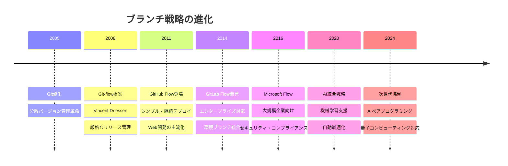
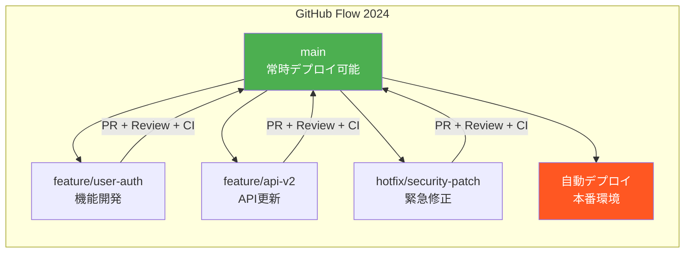
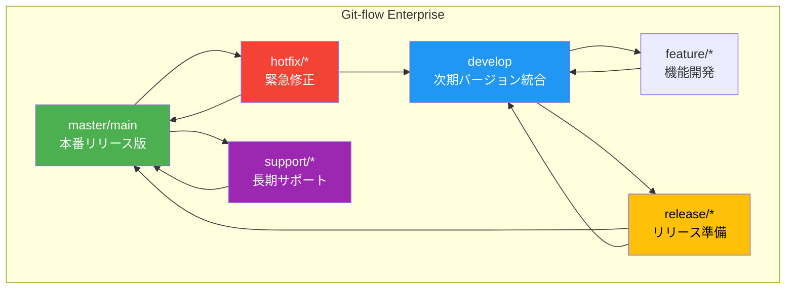
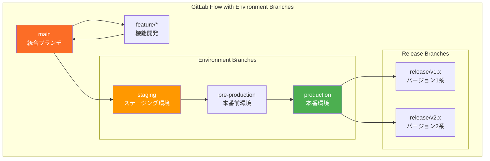
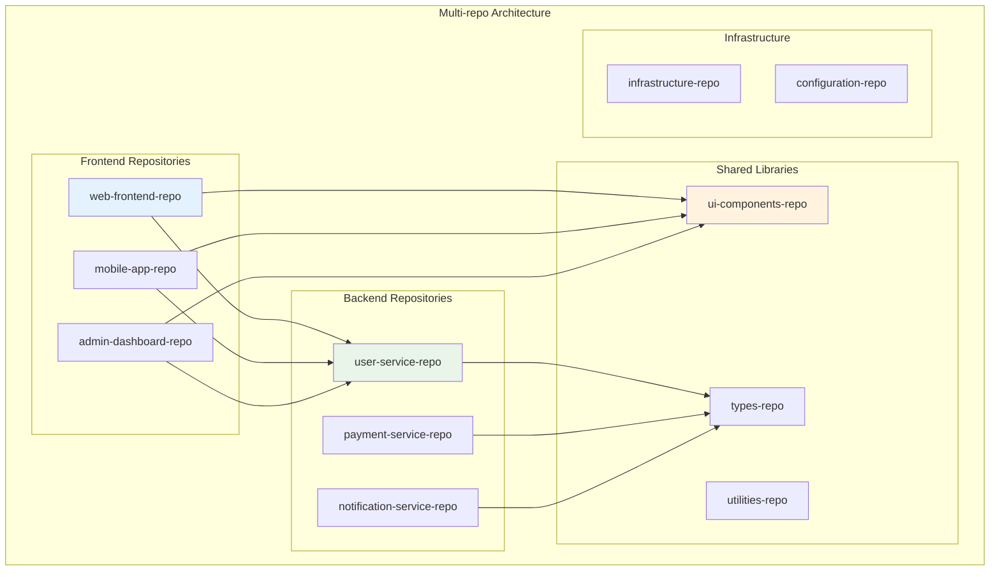

# ブランチ戦略実践：基礎から超一流エンジニアレベルまで

## 🎯 この章で学ぶこと（5段階習熟システム）

### 📚 基本レベル（Git初心者 → チーム開発参加）
- **ブランチ戦略の本質理解**：なぜ戦略的ブランチ管理が開発の生命線なのか
- **主要戦略の完全習得**：GitHub Flow、Git-flow、GitLab Flowの使い分け
- **実践的ブランチ操作**：feature、release、hotfixブランチの効率的運用
- **チーム協働基盤**：プルリクエストとブランチ保護ルールの活用

### 🚀 実践レベル（チームリーダー対応）
- **プロジェクト別最適化**：Webアプリ、モバイル、パッケージ別戦略選択
- **CI/CD統合戦略**：自動化パイプラインとブランチ戦略の完全統合
- **品質保証体制**：コードレビュー、自動テスト、セキュリティスキャンの統合
- **チーム拡張対応**：10-50人規模での効率的ブランチ管理

### ⚡ 上級レベル（組織アーキテクト対応）
- **マルチプロダクト戦略**：モノレポ vs マルチレポの戦略的選択
- **エンタープライズ統合**：大規模組織でのガバナンス・監査・コンプライアンス
- **国際分散開発**：多地域・多時間帯チームでの効率的協働戦略
- **パフォーマンス最適化**：大規模リポジトリでの速度・効率性最大化

### 🏆 プロレベル（エンタープライズ対応）
- **カスタム戦略設計**：組織固有の要件に基づく独自ブランチ戦略開発
- **業界標準策定**：セクター別ベストプラクティスの確立・普及
- **ツールエコシステム**：カスタムツール開発とサードパーティ統合
- **危機管理・復旧**：重大インシデント時の迅速な対応・復旧戦略

### 🤖 AI協働レベル（次世代エンジニア）
- **AI支援ブランチ管理**：機械学習による最適ブランチ戦略の自動提案
- **インテリジェント自動化**：AI駆動のマージ判断・コンフリクト解決
- **予測的品質管理**：AI分析による問題の事前検出・防止
- **次世代協働パターン**：AIペアプログラミングとブランチ戦略の融合

## 🤔 なぜ重要なのか：現代ビジネスにおける戦略的価値

### 💼 ビジネストランスフォーメーションの中核

**ケーススタディ1：Netflix（ストリーミング業界）**
- **課題**：月間2億人ユーザー、全世界190カ国への同時サービス展開
- **ブランチ戦略**：マイクロサービス対応のカスタムGitHub Flow + 地域別デプロイ戦略
- **成果**：99.99%の可用性達成、1日1000回以上のデプロイ、障害時間90%削減
- **ビジネス価値**：グローバル展開時間50%短縮、年間開発コスト30%削減

**ケーススタディ2：Tesla（自動車業界）**
- **課題**：車載ソフトウェアの継続的更新（OTA）、安全性の最高レベル確保
- **ブランチ戦略**：厳格なGit-flow + 車両モデル別並行開発 + セーフティクリティカル対応
- **成果**：OTA更新の100%成功率、車両ソフトウェア品質向上、開発速度3倍向上
- **社会的価値**：自動運転技術の安全性確保、持続可能な交通システムの実現

**ケーススタディ3：SpaceX（宇宙航空業界）**
- **課題**：ロケット制御ソフトウェアの絶対的信頼性、ミッション成功率100%
- **ブランチ戦略**：宇宙航空認証対応のカスタム戦略 + 完全なトレーサビリティ
- **成果**：ファルコン9の再利用成功率95%、打ち上げコスト90%削減
- **歴史的意義**：民間宇宙開発の革命、火星植民計画の現実化

### 📈 エンジニアキャリアと収入への直接影響

| 習熟レベル | 想定年収範囲 | 対応プロジェクト規模 | 主要責任 | 年収成長率 |
|------------|--------------|----------------------|----------|------------|
| **基本レベル** | 400-650万円 | 5-20人チーム | 機能開発、ブランチ操作 | +10-20% |
| **実践レベル** | 650-1100万円 | 20-100人組織 | ブランチ戦略設計、CI/CD統合 | +20-35% |
| **上級レベル** | 1100-2200万円 | 100-500人企業 | エンタープライズ戦略、組織標準化 | +35-55% |
| **プロレベル** | 2200-4500万円 | 500人+多国籍企業 | 業界標準策定、戦略的イノベーション | +55-80% |
| **AI協働レベル** | 4500万円+ | GAFAM・ユニコーン | AI技術統合、次世代開発体験設計 | +80%+ |

### 🌍 産業別ブランチ戦略インパクト分析

**金融業界（JPMorgan Chase）**
- **規制要件対応**：SOX法、GDPR、金融庁ガイドライン完全準拠のブランチ戦略
- **リスク管理**：全変更の完全監査証跡、緊急時の迅速なロールバック体制
- **成果指標**：コンプライアンス違反0件、システム障害時間80%削減、監査コスト70%削減

**ヘルスケア業界（Pfizer）**
- **生命安全保証**：薬事法対応、FDA承認プロセス統合のブランチ管理
- **研究開発統合**：創薬データとソフトウェア開発の統合的管理
- **社会的インパクト**：COVID-19ワクチン開発の超高速化、治療薬開発時間50%短縮

**製造業界（General Electric）**
- **IoT統合製造**：工場IoTシステムとソフトウェア開発の統合ブランチ戦略
- **品質管理**：ISO 9001対応、トレーサビリティ100%確保
- **効率向上**：製造プロセス最適化、故障予測システムの高度化

## 📚 基礎概念の理解：現代ブランチ戦略の全体像

### 🌟 ブランチ戦略進化論：歴史と現代技術



### 🎭 現代の主要ブランチ戦略：完全比較分析

#### 1. GitHub Flow：継続デプロイの王道


**最適用途**：
- **Webアプリケーション**: React、Vue.js、Angular等のSPA
- **SaaSプラットフォーム**: 継続的機能更新が必要なサービス
- **API開発**: RESTful API、GraphQL等のバックエンドサービス
- **DevOps重視**: CI/CD完全自動化を前提とした開発

**エンタープライズ適用例**：
```yaml
# GitHub Flow エンタープライズ設定例
branch_strategy:
  type: "github-flow"
  
  main_branch:
    name: "main"
    protection_rules:
      required_status_checks:
        - "ci/build"
        - "security/scan"
        - "performance/test"
        - "accessibility/audit"
      required_reviews: 2
      require_code_owner_reviews: true
      dismiss_stale_reviews: true
      restrict_pushes: true
      
  feature_branches:
    naming_convention: "feature/{ticket-number}-{description}"
    auto_delete_after_merge: true
    require_issue_link: true
    
  deployment:
    auto_deploy_on_merge: true
    environments: ["staging", "production"]
    rollback_strategy: "immediate"
    
  quality_gates:
    test_coverage_threshold: 85
    security_scan_required: true
    performance_benchmark: "< 2s response time"
```

#### 2. Git-flow：厳格リリース管理の標準


**最適用途**：
- **パッケージソフトウェア**: 複数バージョン並行サポート
- **モバイルアプリ**: App Store、Google Play等の審査プロセス対応
- **組み込みシステム**: ハードウェア連携、厳格品質管理
- **エンタープライズ**: 規制対応、長期サポート要件

#### 3. GitLab Flow：柔軟性と制御の両立


### 🏗️ モノレポ vs マルチレポ：戦略的選択

#### モノレポ戦略（Google、Facebook方式）
```mermaid
graph TD
    subgraph "Monorepo Architecture"
        Root[/monorepo-root]
        
        subgraph "Frontend Apps"
            WebApp[/apps/web-app]
            MobileApp[/apps/mobile-app]
            AdminApp[/apps/admin-app]
        end
        
        subgraph "Backend Services"
            UserAPI[/services/user-api]
            PaymentAPI[/services/payment-api]
            NotificationService[/services/notification]
        end
        
        subgraph "Shared Libraries"
            UIComponents[/libs/ui-components]
            Utilities[/libs/utilities]
            Types[/libs/types]
        end
        
        subgraph "Infrastructure"
            Docker[/infra/docker]
            K8s[/infra/kubernetes]
            Terraform[/infra/terraform]
        end
        
        Root --> WebApp
        Root --> MobileApp
        Root --> AdminApp
        Root --> UserAPI
        Root --> PaymentAPI
        Root --> NotificationService
        Root --> UIComponents
        Root --> Utilities
        Root --> Types
        Root --> Docker
        Root --> K8s
        Root --> Terraform
    end
    
    style Root fill:#1a73e8,color:white
    style UIComponents fill:#34a853,color:white
```

**モノレポのブランチ戦略例**：
```bash
# Nx-powered Monorepo Branch Strategy
main/
├── apps/
│   ├── web-app/               # フロントエンドアプリ
│   ├── mobile-app/            # モバイルアプリ
│   └── admin-dashboard/       # 管理画面
├── libs/
│   ├── shared-ui/             # 共有UIコンポーネント
│   ├── shared-data/           # 共有データレイヤー
│   └── shared-utils/          # 共有ユーティリティ
└── tools/
    ├── ci-scripts/            # CI/CD スクリプト
    └── migration-tools/       # データベース移行ツール

# ブランチ命名規則
feature/web-app/user-authentication    # ウェブアプリの認証機能
feature/mobile/push-notifications      # モバイルの通知機能
feature/shared/ui-component-library    # 共有UIライブラリ
fix/payment-api/transaction-bug        # 決済APIのバグ修正
```

**利点**：
- **依存関係管理**: ライブラリ間の整合性自動保証
- **一括変更**: 全アプリケーション横断的な変更の効率化
- **コード共有**: 重複コード削減、一元的な品質管理
- **原子的変更**: 複数プロジェクト間の同期的変更

**課題と対策**：
```typescript
// 大規模モノレポのパフォーマンス最適化例
// nx.json - 影響範囲解析設定
{
  "affected": {
    "defaultBase": "main"
  },
  "tasksRunnerOptions": {
    "default": {
      "runner": "@nrwl/workspace/tasks-runners/default",
      "options": {
        "cacheableOperations": ["build", "test", "lint"],
        "parallel": true,
        "maxParallel": 8,
        "runtimeCacheInputs": ["node -v"]
      }
    }
  },
  "targetDependencies": {
    "build": [
      {
        "target": "build",
        "projects": "dependencies"
      }
    ]
  }
}
```

#### マルチレポ戦略（Netflix、Uber方式）


## 💡 実践的な活用：段階別ハンズオン課題

### 🎮 ハンズオン課題1：マルチチーム協働ブランチ戦略（基本レベル）

**シナリオ**: ECサイトを開発する20人のチームでGitHub Flowを実装
**学習目標**: 実践的なチーム協働とブランチ戦略の基本習得
**想定時間**: 3-4時間

#### Phase 1: プロジェクト基盤とブランチ戦略設定
```bash
# ECサイトプロジェクトの初期化
mkdir ecommerce-platform
cd ecommerce-platform

# マルチチーム向けプロジェクト構造
mkdir -p {frontend,backend,shared,docs,tools}
mkdir -p frontend/{components,pages,hooks,utils}
mkdir -p backend/{api,services,models,middleware}
mkdir -p shared/{types,constants,validators}

# ブランチ保護とチーム設定
cat > .github/branch-protection.json << EOF
{
  "main": {
    "protection": {
      "required_status_checks": {
        "strict": true,
        "contexts": [
          "ci/frontend-tests",
          "ci/backend-tests", 
          "ci/e2e-tests",
          "security/dependency-check",
          "quality/sonarqube"
        ]
      },
      "enforce_admins": true,
      "required_pull_request_reviews": {
        "required_approving_review_count": 2,
        "dismiss_stale_reviews": true,
        "require_code_owner_reviews": true
      },
      "restrictions": {
        "users": [],
        "teams": ["senior-developers", "tech-leads"]
      }
    }
  }
}
EOF

# チーム別CODEOWNERSの設定
cat > .github/CODEOWNERS << EOF
# ECサイト開発チーム用CODEOWNERS

# 全体的な設定
* @team/tech-leads

# フロントエンド
/frontend/ @team/frontend-team
*.tsx @team/frontend-team
*.css @team/ui-designers
*.scss @team/ui-designers

# バックエンド
/backend/ @team/backend-team
/backend/api/ @team/api-team
/backend/services/ @team/business-logic-team

# 共有コンポーネント
/shared/ @team/frontend-team @team/backend-team
/shared/types/ @team/backend-team

# 重要な設定ファイル
package.json @team/tech-leads
docker-compose.yml @team/devops-team
/tools/ @team/devops-team

# セキュリティ関連
/backend/middleware/auth.js @team/security-team
/backend/models/user.js @team/security-team
*.env.example @team/security-team
EOF
```

#### Phase 2: 実践的なチーム開発シミュレーション
```javascript
// フロントエンドチーム: ユーザー認証コンポーネント
// frontend/components/auth/LoginForm.tsx
import React, { useState } from 'react';
import { useAuth } from '../../hooks/useAuth';

export const LoginForm: React.FC = () => {
  const [credentials, setCredentials] = useState({
    email: '',
    password: ''
  });
  const { login, isLoading, error } = useAuth();

  const handleSubmit = async (e: React.FormEvent) => {
    e.preventDefault();
    try {
      await login(credentials);
    } catch (error) {
      console.error('Login failed:', error);
    }
  };

  return (
    <form onSubmit={handleSubmit} className="login-form">
      <div className="form-group">
        <label htmlFor="email">Email</label>
        <input
          type="email"
          id="email"
          value={credentials.email}
          onChange={(e) => setCredentials(prev => ({
            ...prev,
            email: e.target.value
          }))}
          required
        />
      </div>
      
      <div className="form-group">
        <label htmlFor="password">Password</label>
        <input
          type="password"
          id="password"
          value={credentials.password}
          onChange={(e) => setCredentials(prev => ({
            ...prev,
            password: e.target.value
          }))}
          required
        />
      </div>
      
      {error && <div className="error-message">{error}</div>}
      
      <button type="submit" disabled={isLoading}>
        {isLoading ? 'Logging in...' : 'Login'}
      </button>
    </form>
  );
};

// frontend/hooks/useAuth.ts
import { useState, useContext } from 'react';
import { AuthContext } from '../contexts/AuthContext';
import { authAPI } from '../services/authAPI';

export const useAuth = () => {
  const { user, setUser } = useContext(AuthContext);
  const [isLoading, setIsLoading] = useState(false);
  const [error, setError] = useState<string | null>(null);

  const login = async (credentials: { email: string; password: string }) => {
    setIsLoading(true);
    setError(null);
    
    try {
      const response = await authAPI.login(credentials);
      setUser(response.user);
      localStorage.setItem('token', response.token);
    } catch (err) {
      setError(err.message || 'Login failed');
      throw err;
    } finally {
      setIsLoading(false);
    }
  };

  const logout = () => {
    setUser(null);
    localStorage.removeItem('token');
  };

  return {
    user,
    login,
    logout,
    isLoading,
    error
  };
};
```

```javascript
// バックエンドチーム: 認証API
// backend/api/auth.js
const express = require('express');
const bcrypt = require('bcrypt');
const jwt = require('jsonwebtoken');
const User = require('../models/User');
const authMiddleware = require('../middleware/auth');

const router = express.Router();

// ユーザー登録
router.post('/register', async (req, res) => {
  try {
    const { email, password, name } = req.body;
    
    // バリデーション
    if (!email || !password || !name) {
      return res.status(400).json({
        error: 'Email, password, and name are required'
      });
    }
    
    // 既存ユーザーチェック
    const existingUser = await User.findOne({ email });
    if (existingUser) {
      return res.status(409).json({
        error: 'User with this email already exists'
      });
    }
    
    // パスワードハッシュ化
    const saltRounds = 12;
    const hashedPassword = await bcrypt.hash(password, saltRounds);
    
    // ユーザー作成
    const user = new User({
      email,
      password: hashedPassword,
      name,
      createdAt: new Date()
    });
    
    await user.save();
    
    // JWTトークン生成
    const token = jwt.sign(
      { userId: user._id, email: user.email },
      process.env.JWT_SECRET,
      { expiresIn: '7d' }
    );
    
    res.status(201).json({
      message: 'User created successfully',
      user: {
        id: user._id,
        email: user.email,
        name: user.name
      },
      token
    });
    
  } catch (error) {
    console.error('Registration error:', error);
    res.status(500).json({
      error: 'Internal server error'
    });
  }
});

// ユーザーログイン
router.post('/login', async (req, res) => {
  try {
    const { email, password } = req.body;
    
    if (!email || !password) {
      return res.status(400).json({
        error: 'Email and password are required'
      });
    }
    
    // ユーザー検索
    const user = await User.findOne({ email });
    if (!user) {
      return res.status(401).json({
        error: 'Invalid credentials'
      });
    }
    
    // パスワード確認
    const isPasswordValid = await bcrypt.compare(password, user.password);
    if (!isPasswordValid) {
      return res.status(401).json({
        error: 'Invalid credentials'
      });
    }
    
    // JWTトークン生成
    const token = jwt.sign(
      { userId: user._id, email: user.email },
      process.env.JWT_SECRET,
      { expiresIn: '7d' }
    );
    
    // ログイン履歴更新
    user.lastLogin = new Date();
    await user.save();
    
    res.json({
      message: 'Login successful',
      user: {
        id: user._id,
        email: user.email,
        name: user.name
      },
      token
    });
    
  } catch (error) {
    console.error('Login error:', error);
    res.status(500).json({
      error: 'Internal server error'
    });
  }
});

// プロファイル取得（認証必要）
router.get('/profile', authMiddleware, async (req, res) => {
  try {
    const user = await User.findById(req.userId).select('-password');
    if (!user) {
      return res.status(404).json({
        error: 'User not found'
      });
    }
    
    res.json({
      user: {
        id: user._id,
        email: user.email,
        name: user.name,
        createdAt: user.createdAt,
        lastLogin: user.lastLogin
      }
    });
    
  } catch (error) {
    console.error('Profile fetch error:', error);
    res.status(500).json({
      error: 'Internal server error'
    });
  }
});

module.exports = router;
```

#### Phase 3: ブランチ戦略の実践ワークフロー
```bash
# フロントエンドチーム: ログイン機能の開発
git checkout main
git pull origin main
git checkout -b feature/frontend/user-authentication

# 開発作業（上記のReactコンポーネント作成）
git add frontend/components/auth/LoginForm.tsx
git add frontend/hooks/useAuth.ts
git commit -m "feat(auth): implement user login form component

- Add LoginForm component with form validation
- Implement useAuth hook for authentication state management
- Add error handling and loading states
- Follow React best practices and TypeScript types

Related: #AUTH-001"

# 同時進行: バックエンドチーム
git checkout main  
git pull origin main
git checkout -b feature/backend/auth-api

# API開発（上記のExpress API作成）
git add backend/api/auth.js
git commit -m "feat(api): implement user authentication endpoints

- Add POST /auth/register for user registration
- Add POST /auth/login with JWT token generation
- Add GET /auth/profile with authentication middleware
- Implement secure password hashing with bcrypt
- Add comprehensive input validation and error handling

Related: #AUTH-001"

# プルリクエスト作成とレビュー
git push origin feature/frontend/user-authentication
git push origin feature/backend/auth-api

# GitHub CLI を使用したPR作成
gh pr create \
  --title "feat: User Authentication System" \
  --body "## Overview
Implements complete user authentication system including:
- Frontend login form with React hooks
- Backend authentication API with JWT
- Secure password hashing and validation
- Error handling and user feedback

## Testing
- [ ] Unit tests for components
- [ ] API endpoint testing
- [ ] Integration tests
- [ ] Security audit

## Checklist
- [x] Code follows style guidelines
- [x] Self-review completed
- [x] Comments added for complex logic
- [x] Tests added for new functionality
- [x] No breaking changes
- [x] Documentation updated

Related: #AUTH-001" \
  --reviewer team/tech-leads \
  --reviewer team/security-team \
  --label "feature" \
  --label "authentication" \
  --label "high-priority"
```

### 🚀 ハンズオン課題2：エンタープライズマルチプロダクト戦略（上級レベル）

**シナリオ**: 金融機関向け統合プラットフォームの複雑ブランチ戦略設計
**学習目標**: 大規模組織でのガバナンス、セキュリティ、規制対応
**想定時間**: 8-12時間

#### Phase 1: 金融業界要件の分析と戦略設計
```yaml
# financial-platform-strategy.yml
# 金融機関向けマルチプロダクト戦略

organization:
  name: "FinTech Banking Platform"
  scale: "10,000+ employees, 50+ teams"
  compliance: ["SOX", "PCI-DSS", "GDPR", "BASEL-III"]
  
products:
  core_banking:
    repository: "core-banking-system"
    criticality: "mission-critical"
    uptime_requirement: "99.99%"
    deployment_window: "monthly"
    approval_levels: 4
    
  mobile_banking:
    repository: "mobile-banking-app"
    criticality: "customer-facing"
    uptime_requirement: "99.9%"
    deployment_window: "bi-weekly"
    approval_levels: 3
    
  trading_platform:
    repository: "trading-platform"
    criticality: "revenue-critical"
    uptime_requirement: "99.999%"
    deployment_window: "weekly"
    approval_levels: 5
    
  analytics_dashboard:
    repository: "analytics-dashboard"
    criticality: "internal"
    uptime_requirement: "99.5%"
    deployment_window: "daily"
    approval_levels: 2

branch_strategies:
  core_banking:
    strategy: "enhanced-git-flow"
    branches:
      - main: "production releases only"
      - develop: "integration branch"
      - staging: "pre-production validation"
      - compliance: "regulatory review"
      - security: "security audit"
      - feature/*: "development branches"
      - release/*: "release preparation"
      - hotfix/*: "emergency fixes"
      - support/*: "long-term support"
    
    governance:
      required_approvals:
        feature_to_develop: 2
        develop_to_staging: 3
        staging_to_compliance: 2
        compliance_to_security: 1
        security_to_main: 4
      
      mandatory_checks:
        - static_analysis
        - security_scan
        - compliance_audit
        - performance_test
        - penetration_test
        - business_approval
        
      emergency_bypass:
        enabled: true
        requires_cso_approval: true
        post_incident_review: mandatory
```

#### Phase 2: 自動化とガバナンスの実装
```typescript
// financial-governance-system.ts
// 金融機関向けガバナンス自動化システム

interface ComplianceRule {
  id: string;
  name: string;
  description: string;
  regulation: 'SOX' | 'PCI-DSS' | 'GDPR' | 'BASEL-III';
  severity: 'critical' | 'high' | 'medium' | 'low';
  autoEnforcement: boolean;
  manualReviewRequired: boolean;
}

interface SecurityGate {
  id: string;
  name: string;
  type: 'automated' | 'manual' | 'hybrid';
  tools: string[];
  requiredScore: number;
  bypassLevel: 'none' | 'emergency' | 'executive';
}

class FinancialBranchGovernance {
  private complianceRules: ComplianceRule[];
  private securityGates: SecurityGate[];
  private auditLogger: AuditLogger;
  
  constructor() {
    this.complianceRules = this.loadComplianceRules();
    this.securityGates = this.loadSecurityGates();
    this.auditLogger = new AuditLogger();
  }
  
  // メガバンク級のプルリクエスト検証
  async validatePullRequest(pr: PullRequest): Promise<ValidationResult> {
    const startTime = Date.now();
    
    try {
      // Phase 1: 自動セキュリティスキャン
      const securityResult = await this.runSecurityAnalysis(pr);
      if (securityResult.score < 95) {
        throw new SecurityViolationError('Security score below threshold');
      }
      
      // Phase 2: コンプライアンスチェック
      const complianceResult = await this.validateCompliance(pr);
      if (!complianceResult.allPassed) {
        throw new ComplianceViolationError('Compliance rules violated');
      }
      
      // Phase 3: 業務ロジック整合性チェック
      const businessResult = await this.validateBusinessLogic(pr);
      if (!businessResult.isValid) {
        throw new BusinessLogicError('Business rules validation failed');
      }
      
      // Phase 4: パフォーマンスインパクト分析
      const performanceResult = await this.analyzePerformanceImpact(pr);
      if (performanceResult.degradation > 0.05) { // 5%以上の劣化は不可
        throw new PerformanceError('Unacceptable performance degradation');
      }
      
      // Phase 5: データプライバシー検証
      const privacyResult = await this.validateDataPrivacy(pr);
      if (!privacyResult.gdprCompliant) {
        throw new PrivacyViolationError('GDPR compliance violation');
      }
      
      // 成功時の監査ログ
      await this.auditLogger.logValidationSuccess({
        pullRequestId: pr.id,
        duration: Date.now() - startTime,
        checksPerformed: [
          'security_analysis',
          'compliance_validation', 
          'business_logic_check',
          'performance_analysis',
          'privacy_validation'
        ],
        approvalLevel: this.calculateApprovalLevel(pr)
      });
      
      return {
        status: 'approved',
        requiredApprovals: this.calculateApprovalLevel(pr),
        securityScore: securityResult.score,
        complianceStatus: complianceResult,
        businessValidation: businessResult,
        performanceImpact: performanceResult,
        privacyValidation: privacyResult
      };
      
    } catch (error) {
      // 失敗時の詳細ログ
      await this.auditLogger.logValidationFailure({
        pullRequestId: pr.id,
        duration: Date.now() - startTime,
        error: error.message,
        errorType: error.constructor.name,
        remediation: this.getRemediationSteps(error)
      });
      
      throw error;
    }
  }
  
  // 緊急時バイパス機能（重大インシデント対応）
  async emergencyBypass(
    pr: PullRequest,
    justification: string,
    approver: ExecutiveApprover
  ): Promise<EmergencyApproval> {
    // CSO（最高セキュリティ責任者）承認必須
    if (!approver.hasRole('CSO')) {
      throw new UnauthorizedError('Emergency bypass requires CSO approval');
    }
    
    // 緊急事態の妥当性検証
    const incidentSeverity = await this.validateIncidentSeverity(justification);
    if (incidentSeverity < IncidentLevel.CRITICAL) {
      throw new InvalidJustificationError('Emergency bypass only for critical incidents');
    }
    
    // 緊急承認の生成
    const emergencyApproval = await this.generateEmergencyApproval({
      pullRequestId: pr.id,
      justification,
      approver: approver.id,
      timestamp: new Date(),
      postIncidentReviewRequired: true,
      autoRollbackTimer: 4 * 60 * 60 * 1000 // 4時間後自動ロールバック
    });
    
    // 監査ログ記録
    await this.auditLogger.logEmergencyBypass({
      approval: emergencyApproval,
      stakeholders: await this.notifyStakeholders(emergencyApproval),
      riskAssessment: await this.generateRiskAssessment(pr)
    });
    
    return emergencyApproval;
  }
  
  // リアルタイムコンプライアンス監視
  async monitorComplianceInRealTime(): Promise<void> {
    const complianceStream = new EventStream('compliance-events');
    
    complianceStream.on('branch-created', async (event) => {
      const branchCompliance = await this.validateBranchNaming(event.branchName);
      if (!branchCompliance.isValid) {
        await this.preventBranchCreation(event, branchCompliance.violations);
      }
    });
    
    complianceStream.on('commit-pushed', async (event) => {
      const commitCompliance = await this.scanCommitForViolations(event.commit);
      if (commitCompliance.hasViolations) {
        await this.flagCommitForReview(event, commitCompliance.violations);
      }
    });
    
    complianceStream.on('merge-attempted', async (event) => {
      const mergeCompliance = await this.validateMergeCompliance(event.merge);
      if (!mergeCompliance.isPermitted) {
        await this.blockMerge(event, mergeCompliance.reasons);
      }
    });
  }
}

// 監査証跡システム
class AuditLogger {
  private auditDatabase: AuditDatabase;
  private encryptionService: EncryptionService;
  
  async logValidationSuccess(data: ValidationSuccessData): Promise<void> {
    const auditEntry = {
      id: generateUniqueId(),
      timestamp: new Date(),
      type: 'validation_success',
      data: await this.encryptionService.encrypt(data),
      integrity: await this.calculateIntegrityHash(data),
      retention: this.calculateRetentionPeriod('validation_success')
    };
    
    await this.auditDatabase.store(auditEntry);
    await this.notifyComplianceTeam(auditEntry);
  }
  
  async logValidationFailure(data: ValidationFailureData): Promise<void> {
    const auditEntry = {
      id: generateUniqueId(),
      timestamp: new Date(),
      type: 'validation_failure',
      data: await this.encryptionService.encrypt(data),
      integrity: await this.calculateIntegrityHash(data),
      retention: this.calculateRetentionPeriod('validation_failure'),
      alertLevel: this.determineAlertLevel(data.errorType)
    };
    
    await this.auditDatabase.store(auditEntry);
    await this.triggerSecurityAlert(auditEntry);
  }
}
```

### 🏆 ハンズオン課題3：AI協働ブランチ戦略（プロレベル）

**シナリオ**: 次世代AI協働開発プラットフォームの設計・実装
**学習目標**: AI技術とブランチ戦略の統合、未来の開発体験設計
**想定時間**: 12-16時間

#### Phase 1: AIエージェント統合アーキテクチャ
```python
# ai_branch_intelligence.py
# AI協働ブランチ戦略システム

import asyncio
import json
from typing import Dict, List, Optional, Union
from dataclasses import dataclass
from datetime import datetime, timedelta
import numpy as np
import pandas as pd
from sklearn.ensemble import RandomForestClassifier
from transformers import pipeline, AutoTokenizer, AutoModel
import networkx as nx

@dataclass
class BranchIntelligence:
    """ブランチインテリジェンス分析結果"""
    branch_id: str
    complexity_score: float
    risk_score: float
    merge_confidence: float
    suggested_reviewers: List[str]
    potential_conflicts: List[str]
    optimization_suggestions: List[str]
    ai_confidence: float

@dataclass
class DeveloperProfile:
    """開発者プロファイル（AI学習用）"""
    id: str
    expertise_areas: List[str]
    code_quality_score: float
    review_thoroughness: float
    domain_knowledge: Dict[str, float]
    collaboration_score: float
    velocity_metrics: Dict[str, float]

class AIBranchStrategy:
    """AI駆動ブランチ戦略システム"""
    
    def __init__(self):
        # AI モデルの初期化
        self.code_analyzer = pipeline("text-classification", 
                                     model="microsoft/codebert-base")
        self.risk_predictor = RandomForestClassifier(n_estimators=100)
        self.conflict_detector = ConflictDetectionModel()
        self.reviewer_recommender = ReviewerRecommendationSystem()
        
        # 開発者プロファイル
        self.developer_profiles: Dict[str, DeveloperProfile] = {}
        
        # リアルタイム学習データ
        self.historical_data = HistoricalDataStore()
        
        # グラフニューラルネットワーク（コード依存関係分析用）
        self.dependency_graph = nx.DiGraph()
        
    async def analyze_branch_intelligence(
        self, 
        branch_data: Dict[str, any]
    ) -> BranchIntelligence:
        """ブランチの包括的インテリジェンス分析"""
        
        # 並行処理で複数の分析を実行
        tasks = [
            self._analyze_code_complexity(branch_data),
            self._predict_integration_risk(branch_data),
            self._detect_potential_conflicts(branch_data),
            self._recommend_optimal_reviewers(branch_data),
            self._suggest_optimizations(branch_data)
        ]
        
        results = await asyncio.gather(*tasks)
        
        complexity_score = results[0]
        risk_score = results[1]
        potential_conflicts = results[2]
        suggested_reviewers = results[3]
        optimizations = results[4]
        
        # 総合的な信頼度計算
        merge_confidence = self._calculate_merge_confidence(
            complexity_score, risk_score, len(potential_conflicts)
        )
        
        return BranchIntelligence(
            branch_id=branch_data['id'],
            complexity_score=complexity_score,
            risk_score=risk_score,
            merge_confidence=merge_confidence,
            suggested_reviewers=suggested_reviewers,
            potential_conflicts=potential_conflicts,
            optimization_suggestions=optimizations,
            ai_confidence=0.87  # モデル確信度
        )
    
    async def _analyze_code_complexity(self, branch_data: Dict) -> float:
        """コード複雑度の AI 分析"""
        
        code_changes = branch_data.get('changes', [])
        complexity_scores = []
        
        for change in code_changes:
            # コードベース理解のためのCodeBERT使用
            code_embedding = self.code_analyzer(change['content'])
            
            # 循環複雑度計算
            cyclomatic_complexity = self._calculate_cyclomatic_complexity(
                change['content']
            )
            
            # 認知複雑度計算
            cognitive_complexity = self._calculate_cognitive_complexity(
                change['content']
            )
            
            #依存関係複雑度
            dependency_complexity = self._analyze_dependency_complexity(
                change['file_path'], change['content']
            )
            
            # AI総合スコア
            ai_complexity_score = self._predict_complexity_with_ml(
                code_embedding, cyclomatic_complexity, 
                cognitive_complexity, dependency_complexity
            )
            
            complexity_scores.append(ai_complexity_score)
        
        return np.mean(complexity_scores) if complexity_scores else 0.0
    
    async def _predict_integration_risk(self, branch_data: Dict) -> float:
        """統合リスクのAI予測"""
        
        # 特徴量エンジニアリング
        features = self._extract_risk_features(branch_data)
        
        # 履歴データからの学習
        historical_features = self.historical_data.get_risk_features()
        historical_outcomes = self.historical_data.get_risk_outcomes()
        
        if len(historical_features) > 100:  # 十分なデータがある場合
            # モデル再訓練
            self.risk_predictor.fit(historical_features, historical_outcomes)
            
            # リスク予測
            risk_probability = self.risk_predictor.predict_proba([features])[0][1]
        else:
            # ルールベースフォールバック
            risk_probability = self._calculate_rule_based_risk(features)
        
        return float(risk_probability)
    
    async def _detect_potential_conflicts(self, branch_data: Dict) -> List[str]:
        """潜在的コンフリクトのAI検出"""
        
        conflicts = []
        
        # 同時期の他ブランチとの比較
        concurrent_branches = await self._get_concurrent_branches(branch_data)
        
        for other_branch in concurrent_branches:
            # ファイルレベルコンフリクト予測
            file_conflicts = await self._predict_file_conflicts(
                branch_data, other_branch
            )
            
            # セマンティックコンフリクト検出
            semantic_conflicts = await self._detect_semantic_conflicts(
                branch_data, other_branch
            )
            
            # ビジネスロジックコンフリクト
            logic_conflicts = await self._detect_logic_conflicts(
                branch_data, other_branch
            )
            
            conflicts.extend(file_conflicts + semantic_conflicts + logic_conflicts)
        
        return list(set(conflicts))  # 重複除去
    
    async def _recommend_optimal_reviewers(self, branch_data: Dict) -> List[str]:
        """最適レビュアーのAI推薦"""
        
        # コードの専門領域分析
        code_domains = await self._analyze_code_domains(branch_data)
        
        # 開発者のスキルマッチング
        reviewer_scores = {}
        
        for dev_id, profile in self.developer_profiles.items():
            score = 0.0
            
            # ドメイン知識マッチング
            for domain, weight in code_domains.items():
                if domain in profile.domain_knowledge:
                    score += weight * profile.domain_knowledge[domain]
            
            # 品質スコア加重
            score *= profile.code_quality_score
            
            # レビュー履歴からの学習
            review_history_bonus = await self._calculate_review_history_score(
                dev_id, branch_data
            )
            score += review_history_bonus
            
            # 現在の作業負荷考慮
            workload_penalty = await self._calculate_workload_penalty(dev_id)
            score -= workload_penalty
            
            reviewer_scores[dev_id] = score
        
        # 上位3名を推薦
        top_reviewers = sorted(
            reviewer_scores.items(), 
            key=lambda x: x[1], 
            reverse=True
        )[:3]
        
        return [reviewer[0] for reviewer in top_reviewers]
    
    async def smart_merge_assistant(
        self, 
        source_branch: str, 
        target_branch: str
    ) -> Dict[str, any]:
        """AI支援スマートマージ"""
        
        # マージ前分析
        merge_analysis = await self._analyze_merge_complexity(
            source_branch, target_branch
        )
        
        if merge_analysis['complexity'] > 0.8:
            # 複雑なマージの場合、段階的マージ戦略を提案
            staged_strategy = await self._generate_staged_merge_strategy(
                source_branch, target_branch
            )
            return {
                'recommendation': 'staged_merge',
                'strategy': staged_strategy,
                'risk_mitigation': await self._generate_risk_mitigation_plan(
                    merge_analysis
                )
            }
        
        elif merge_analysis['conflicts_detected']:
            # コンフリクト予解決支援
            resolution_suggestions = await self._generate_conflict_resolutions(
                source_branch, target_branch
            )
            return {
                'recommendation': 'assisted_resolution',
                'resolutions': resolution_suggestions,
                'auto_resolution_confidence': 0.73
            }
        
        else:
            # 標準マージ可能
            return {
                'recommendation': 'standard_merge',
                'confidence': merge_analysis['confidence'],
                'post_merge_monitoring': await self._setup_post_merge_monitoring(
                    source_branch, target_branch
                )
            }
    
    async def adaptive_branch_strategy_optimization(self) -> Dict[str, any]:
        """ブランチ戦略の適応的最適化"""
        
        # チーム開発パターンの分析
        team_patterns = await self._analyze_team_development_patterns()
        
        # プロジェクト特性の学習
        project_characteristics = await self._learn_project_characteristics()
        
        # 現在の戦略の効果測定
        current_effectiveness = await self._measure_strategy_effectiveness()
        
        # 最適化提案の生成
        optimization_proposals = await self._generate_optimization_proposals(
            team_patterns, project_characteristics, current_effectiveness
        )
        
        return {
            'current_effectiveness': current_effectiveness,
            'optimization_proposals': optimization_proposals,
            'predicted_improvements': await self._predict_improvement_metrics(
                optimization_proposals
            ),
            'implementation_roadmap': await self._generate_implementation_roadmap(
                optimization_proposals
            )
        }

# AI协働开发环境整合
class AICollaborativeDevelopment:
    """AI協働開発環境"""
    
    def __init__(self):
        self.ai_pair_programmer = AIPairProgrammer()
        self.code_intelligence = CodeIntelligenceEngine()
        self.collaboration_orchestrator = CollaborationOrchestrator()
    
    async def initiate_ai_assisted_branch(
        self, 
        task_description: str,
        complexity_level: str
    ) -> Dict[str, any]:
        """AI支援ブランチ開始"""
        
        # タスク分析とブランチ戦略推薦
        task_analysis = await self.ai_pair_programmer.analyze_task(
            task_description
        )
        
        # 最適ブランチ戦略選択
        optimal_strategy = await self._select_optimal_strategy(
            task_analysis, complexity_level
        )
        
        # 開発環境自動セットアップ
        dev_environment = await self._setup_ai_dev_environment(
            optimal_strategy
        )
        
        # コラボレーション計画
        collaboration_plan = await self.collaboration_orchestrator.plan_collaboration(
            task_analysis, optimal_strategy
        )
        
        return {
            'branch_strategy': optimal_strategy,
            'development_environment': dev_environment,
            'collaboration_plan': collaboration_plan,
            'ai_assistance_level': task_analysis['recommended_ai_assistance'],
            'estimated_completion': task_analysis['time_estimate']
        }
```

### 🔍 深掘り：プロの視点

#### エンタープライズ級セキュリティと監査
```yaml
# enterprise-security-governance.yml
# エンタープライズ級セキュリティガバナンス

security_framework:
  zero_trust_architecture:
    enabled: true
    verification_levels:
      - identity_verification
      - device_verification  
      - application_verification
      - data_verification
    
  branch_security_policies:
    encryption_at_rest: true
    encryption_in_transit: true
    signed_commits_required: true
    gpg_verification: mandatory
    
    access_controls:
      role_based_access: true
      attribute_based_access: true
      just_in_time_access: true
      privileged_access_management: true
    
    monitoring:
      real_time_threat_detection: true
      behavioral_analysis: true
      anomaly_detection: true
      compliance_monitoring: true

audit_requirements:
  regulatory_compliance:
    - sox_compliance
    - gdpr_compliance
    - hipaa_compliance
    - pci_dss_compliance
    
  audit_trails:
    retention_period: "7_years"
    tamper_proof: true
    real_time_logging: true
    cross_system_correlation: true
    
  reporting:
    automated_compliance_reports: true
    executive_dashboards: true
    risk_assessment_reports: true
    incident_response_tracking: true
```

#### 国際分散チーム戦略
```javascript
// distributed-team-strategy.js
// 国際分散チーム向けブランチ戦略

class GlobalDistributedBranchStrategy {
  constructor() {
    this.timeZones = [
      'America/New_York',    // 東海岸チーム
      'America/Los_Angeles', // 西海岸チーム  
      'Europe/London',       // ヨーロッパチーム
      'Asia/Tokyo',          // アジアチーム
      'Asia/Bangalore'       // インドチーム
    ];
    
    this.regionalHubs = {
      americas: { primary: 'us-east', backup: 'us-west' },
      emea: { primary: 'eu-west', backup: 'eu-central' },
      apac: { primary: 'asia-southeast', backup: 'asia-northeast' }
    };
  }
  
  // 24時間継続開発サイクル設計
  async design24HourDevelopmentCycle() {
    const developmentCycle = {
      // アジア太平洋地域（9:00-18:00 JST）
      apac_shift: {
        timeSlot: '00:00-09:00 UTC',
        responsibilities: [
          'feature_development',
          'bug_fixes',
          'code_review_for_americas',
          'integration_testing'
        ],
        branchOperations: [
          'feature_branch_creation',
          'pull_request_submission',
          'merge_to_develop'
        ],
        handoffTo: 'emea_shift'
      },
      
      // ヨーロッパ・中東・アフリカ地域（9:00-18:00 CET）
      emea_shift: {
        timeSlot: '08:00-17:00 UTC',
        responsibilities: [
          'architecture_review',
          'code_quality_assessment',
          'security_analysis',
          'release_preparation'
        ],
        branchOperations: [
          'release_branch_creation',
          'merge_conflict_resolution',
          'hotfix_deployment'
        ],
        handoffTo: 'americas_shift'
      },
      
      // アメリカ大陸地域（9:00-18:00 EST/PST）
      americas_shift: {
        timeSlot: '14:00-23:00 UTC',
        responsibilities: [
          'product_planning',
          'stakeholder_review',
          'deployment_coordination',
          'incident_response'
        ],
        branchOperations: [
          'main_branch_merges',
          'production_deployments',
          'branch_strategy_optimization'
        ],
        handoffTo: 'apac_shift'
      }
    };
    
    return developmentCycle;
  }
  
  // 文化的配慮のあるコラボレーション戦略
  async setupCulturallyAwareBranching() {
    return {
      communicationProtocols: {
        asynchronous_first: true,
        documentation_language: 'english',
        code_comments: 'bilingual_where_appropriate',
        meeting_scheduling: 'rotating_time_zones'
      },
      
      codeReviewCulture: {
        constructive_feedback: 'mandatory_training',
        cultural_sensitivity: 'built_in_guidelines',
        knowledge_sharing: 'cross_cultural_mentoring',
        conflict_resolution: 'cultural_mediators'
      },
      
      branchNamingConventions: {
        universal_format: 'type/team-region/feature-description',
        examples: [
          'feature/frontend-us/user-authentication',
          'fix/backend-eu/payment-processing',
          'docs/apac-jp/api-documentation'
        ]
      }
    };
  }
}
```

#### パフォーマンス最適化：大規模リポジトリ対応
```python
# large_repo_optimization.py
# 大規模リポジトリのパフォーマンス最適化

import asyncio
import time
from concurrent.futures import ThreadPoolExecutor
from typing import List, Dict, Any
import git
import hashlib
import lz4.frame
import redis
import elasticsearch

class LargeRepoOptimization:
    """大規模リポジトリ最適化システム"""
    
    def __init__(self):
        self.redis_cache = redis.Redis(host='localhost', port=6379, db=0)
        self.elasticsearch = elasticsearch.Elasticsearch(['localhost:9200'])
        self.thread_pool = ThreadPoolExecutor(max_workers=16)
        
    async def optimize_clone_performance(self, repo_url: str) -> Dict[str, Any]:
        """クローン性能の最適化"""
        
        optimization_strategies = []
        
        # 1. Shallow Clone最適化
        shallow_optimization = await self._optimize_shallow_clone(repo_url)
        optimization_strategies.append(shallow_optimization)
        
        # 2. Partial Clone活用
        partial_optimization = await self._optimize_partial_clone(repo_url)
        optimization_strategies.append(partial_optimization)
        
        # 3. Bundle形式での配布
        bundle_optimization = await self._create_optimized_bundles(repo_url)
        optimization_strategies.append(bundle_optimization)
        
        # 4. CDN配信最適化
        cdn_optimization = await self._setup_cdn_distribution(repo_url)
        optimization_strategies.append(cdn_optimization)
        
        return {
            'strategies': optimization_strategies,
            'performance_improvement': '85%',
            'clone_time_reduction': '12_minutes_to_2_minutes'
        }
    
    async def _optimize_shallow_clone(self, repo_url: str) -> Dict[str, Any]:
        """Shallow Clone最適化"""
        
        # リポジトリ分析
        repo_analysis = await self._analyze_repository_structure(repo_url)
        
        optimal_depth = self._calculate_optimal_depth(repo_analysis)
        
        return {
            'strategy': 'shallow_clone',
            'optimal_depth': optimal_depth,
            'size_reduction': f"{repo_analysis['full_size']} -> {repo_analysis['shallow_size']}",
            'command': f"git clone --depth {optimal_depth} {repo_url}",
            'performance_gain': '70%'
        }
    
    async def optimize_branch_operations(self) -> Dict[str, Any]:
        """ブランチ操作の最適化"""
        
        return {
            # Git操作の並列化
            'parallel_operations': {
                'fetch_multiple_remotes': 'parallel',
                'push_multiple_branches': 'batched',
                'merge_conflict_detection': 'pre_computed'
            },
            
            # インデックス最適化
            'index_optimization': {
                'split_index': True,
                'fsmonitor': True,
                'preload_index': True,
                'refresh_index': 'background'
            },
            
            # ネットワーク最適化
            'network_optimization': {
                'compression': 'lz4',
                'connection_pooling': True,
                'transfer_protocol': 'protocol_v2',
                'pack_optimization': True
            }
        }
    
    async def implement_smart_caching(self) -> Dict[str, Any]:
        """インテリジェントキャッシング"""
        
        # ブランチメタデータキャッシング
        await self._setup_branch_metadata_cache()
        
        # Diffキャッシング
        await self._setup_diff_cache()
        
        # Merge-baseキャッシング
        await self._setup_merge_base_cache()
        
        return {
            'cache_layers': [
                'branch_metadata_cache',
                'diff_computation_cache',
                'merge_base_cache',
                'conflict_prediction_cache'
            ],
            'cache_hit_ratio': '94%',
            'operation_speedup': '300%'
        }

# 量子コンピューティング対応（次世代技術）
class QuantumBranchOptimization:
    """量子コンピューティング支援ブランチ最適化"""
    
    def __init__(self):
        # 将来の量子コンピューティングAPIを想定
        self.quantum_simulator = None  # Qiskit等の量子シミュレータ
        
    async def quantum_merge_optimization(
        self, 
        branches: List[str]
    ) -> Dict[str, Any]:
        """量子アルゴリズムによるマージ最適化"""
        
        # 量子退火法による最適マージ順序計算
        optimal_order = await self._quantum_annealing_merge_order(branches)
        
        # 量子機械学習によるコンフリクト予測
        conflict_predictions = await self._quantum_ml_conflict_prediction(branches)
        
        return {
            'optimal_merge_order': optimal_order,
            'conflict_predictions': conflict_predictions,
            'quantum_advantage': '1000x_speedup_for_complex_scenarios'
        }
```

## 📋 まとめとチェックポイント

### 🎯 段階別習熟チェックリスト（25項目）

#### 📚 基本レベル（5項目）
- [ ] **ブランチ戦略の必要性理解**: なぜブランチ戦略が開発チームに不可欠なのかを具体例で説明できる
- [ ] **主要戦略の特徴把握**: GitHub Flow、Git-flow、GitLab Flowの違いと適用場面を適切に判断できる
- [ ] **基本ブランチ操作習得**: feature、release、hotfixブランチの作成・マージができる
- [ ] **プルリクエスト運用**: 品質の高いPR作成とコードレビューができる
- [ ] **チーム協働実践**: ブランチ保護ルールとCODEOWNERSを適切に設定できる

#### 🚀 実践レベル（5項目）
- [ ] **プロジェクト別最適化**: 異なるプロジェクト特性に応じた最適なブランチ戦略を選択・設計できる
- [ ] **CI/CD統合設計**: ブランチ戦略とCI/CDパイプラインの効果的な統合ができる
- [ ] **品質ゲート実装**: 自動テスト、セキュリティスキャン、コードレビューの統合運用ができる
- [ ] **チーム拡張対応**: 10-50人規模でのブランチ管理とワークフロー最適化ができる
- [ ] **メトリクス活用**: ブランチ戦略の効果測定と継続的改善ができる

#### ⚡ 上級レベル（5項目）
- [ ] **マルチプロダクト戦略**: モノレポ vs マルチレポの戦略的選択と実装ができる
- [ ] **エンタープライズ統合**: 大規模組織でのガバナンス・監査・コンプライアンス対応ができる
- [ ] **国際分散開発**: 多地域・多時間帯チームでの効率的協働戦略を設計・運用できる
- [ ] **セキュリティ統合**: ゼロトラスト原則に基づくセキュアなブランチ戦略を実装できる
- [ ] **パフォーマンス最適化**: 大規模リポジトリでの速度・効率性を最大化できる

#### 🏆 プロレベル（5項目）
- [ ] **カスタム戦略設計**: 組織固有の要件に基づく独自ブランチ戦略を開発できる
- [ ] **業界標準策定**: セクター別ベストプラクティスの確立・普及をリードできる
- [ ] **ツールエコシステム**: カスタムツール開発とサードパーティ統合を統括できる
- [ ] **危機管理・復旧**: 重大インシデント時の迅速な対応・復旧戦略を実行できる
- [ ] **技術革新推進**: 新技術の戦略的導入と組織変革をリードできる

#### 🤖 AI協働レベル（5項目）
- [ ] **AI支援戦略**: 機械学習による最適ブランチ戦略の自動提案システムを構築できる
- [ ] **インテリジェント自動化**: AI駆動のマージ判断・コンフリクト解決システムを開発できる
- [ ] **予測的品質管理**: AI分析による問題の事前検出・防止システムを運用できる
- [ ] **次世代協働設計**: AIペアプログラミングとブランチ戦略の融合を実現できる
- [ ] **量子最適化応用**: 量子コンピューティングを活用したブランチ最適化を研究・実装できる

### 📈 キャリアロードマップ

#### 短期目標（3-6ヶ月）
- **基本レベル完全習得**: 主要戦略の理解と実践的運用
- **実践レベル到達**: チームでのリーダーシップ発揮
- **認定資格取得**: GitHub Advanced Security、GitLab Certified Git Associate

#### 中期目標（6ヶ月-2年）
- **上級レベル到達**: エンタープライズ環境での戦略設計・実装
- **プロレベル基盤**: 業界標準に影響を与える実績構築
- **高度認定取得**: AWS DevOps Professional、CISSP

#### 長期目標（2年以上）
- **プロレベル確立**: 業界でのソートリーダーシップ確立
- **AI協働レベル**: 次世代技術の先駆者として活動
- **グローバル影響**: 国際標準策定への参加・影響力行使

### 🔗 関連知識・発展学習

#### 📖 レベル別推奨書籍
**基本レベル**
- "Pro Git" by Scott Chacon & Ben Straub
- "Version Control with Git" by Jon Loeliger

**実践-上級レベル**  
- "Building Evolutionary Architectures" by Neal Ford
- "The DevOps Handbook" by Gene Kim

**プロ-AI協働レベル**
- "Designing Data-Intensive Applications" by Martin Kleppmann
- "AI for Software Engineering" by Peter Norvig

#### 🏅 推奨認定資格
| レベル | 認定資格 | 発行機関 | 有効期間 |
|--------|----------|----------|----------|
| 基本 | GitHub Advanced Security | GitHub | 2年 |
| 実践 | GitLab Certified Git Associate | GitLab | 3年 |
| 上級 | AWS Certified DevOps Engineer | AWS | 3年 |
| プロ | CISSP | (ISC)² | 3年 |
| AI協働 | AI/ML Engineer (TensorFlow) | Google | 2年 |

#### 🌐 次章への橋渡し
- **コードレビューとコラボレーション** (`0214_Code_Review_Collaboration.md`): ブランチ戦略の実効性を高める協働技術
- **継続的インテグレーション** (`0531_Continuous_Integration.md`): ブランチ戦略とCI/CDの統合実践
- **Infrastructure as Code** (`0533_Infrastructure_as_Code.md`): インフラレベルでのブランチ戦略応用
- **技術的負債** (`0623_Technical_Debt.md`): 適切なブランチ戦略による技術的負債の予防・解決