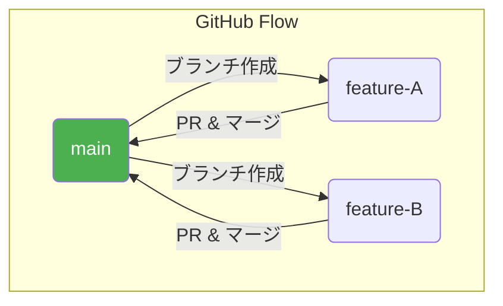
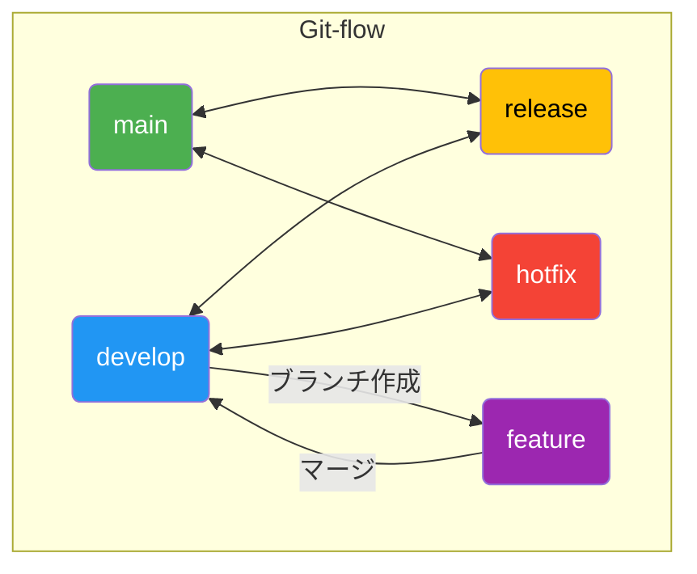

# 第3章 ブランチ戦略：カオスな開発現場を整理する技術

## 🎯 この章で学ぶこと
- なぜ個々人が自由にブランチを作成するだけでは、チーム開発で問題が起きるのかを理解する。
- 有名なブランチ戦略である「GitHub Flow」と「Git-flow」のそれぞれの特徴と目的を説明できる。
- プロジェクトの特性（Webアプリ、パッケージリリースなど）に応じて、適切なブランチ戦略を選択できるようになる。
- `main`, `develop`, `feature`, `release`, `hotfix`といった、各戦略で使われる主要なブランチの役割を説明できる。
- ブランチ戦略を導入することが、コードの品質と安定性をいかに向上させるかを理解する。

## 🤔 なぜ重要なのか
あなたのチームには10人の開発者がいます。全員が`main`ブランチから思い思いの名前（`fix-bug`, `my-feature`, `test`など）でブランチを作成し、作業が終わると次々に`main`ブランチにマージしています。ある日、リリースしたばかりの製品に緊急のバグが見つかりました。しかし、`main`ブランチには、まだ開発途中の機能や、不安定なコードが大量にマージされてしまっています。緊急修正だけを素早くリリースしたくても、どの変更を元に戻せば良いのか、誰も判断できません。

このような開発の混乱を防ぐために存在するのが**ブランチ戦略**です。ブランチ戦略とは、**「いつ、どのブランチから、どのような目的でブランチを作成し、最終的にどこにマージするのか」というルールや規約の集まり**です。

ルールを設けることで、開発者全員が同じ手順で作業を進めることができ、「安定版のコードは常にこのブランチにある」「新機能の開発はこのブランチから行う」といった共通認識が生まれます。これにより、開発プロセスが安定し、予測可能になります。特にAIが生成したコードを複数人でレビュー・統合していくような場面では、どの変更がどの段階にあるのかを明確にするブランチ戦略が、品質保証の生命線となります。

## 📚 基礎概念の理解

### ブランチ戦略の目的
ブランチ戦略は、主に以下の目的のために導入されます。

1.  **安定性の確保**: 本番環境で動いているコード（`main`ブランチ）を常に安定した状態に保つ。
2.  **並行開発の円滑化**: 複数の機能開発やバグ修正が、互いに影響を与えることなく同時に進められるようにする。
3.  **履歴の整理**: プロジェクトの変更履歴をクリーンに保ち、いつ、どのような変更が行われたかを後から追いやすくする。
4.  **リリースの効率化**: 特定のバージョンをリリースする際に、含めるべき機能や修正を明確にし、計画的なリリースを可能にする。

### 代表的なブランチ戦略
世の中には様々なブランチ戦略がありますが、ここでは最も有名で広く使われている2つの戦略、「GitHub Flow」と「Git-flow」を紹介します。

#### 1. GitHub Flow: シンプルイズベスト
GitHub社が実践していることで有名な、非常にシンプルな戦略です。

-   **ルール**:
    1.  `main`ブランチは常にデプロイ可能でなければならない。
    2.  新しい作業は、`main`ブランチから説明的な名前のブランチ（`feature`ブランチ）を作成して行う。
    3.  作業が完了したらプルリクエストを作成し、レビューを経て`main`ブランチにマージする。
    4.  `main`ブランチにマージされたら、即座にデプロイする。
-   **特徴**:
    -   ブランチの種類が少なく、ルールが単純明快。
    -   継続的インテグレーション(CI)と継続的デプロイメント(CD)を前提としており、Webアプリケーションなど、頻繁にデプロイを行うプロジェクトに最適。
-   **イメージ**:



#### 2. Git-flow: 厳格で計画的なリリース管理
複数のバージョンを同時にサポートする必要がある場合や、厳格なリリース計画が求められるソフトウェア（例：パッケージ製品、モバイルアプリ）でよく採用される、より複雑で多機能な戦略です。

-   **主要なブランチ**:
    -   `main` (または `master`): 本番リリースの履歴だけを記録する、最も安定したブランチ。このブランチへの直接のコミットは行いません。
    -   `develop`: 次期リリースのための開発の中心となるブランチ。`main`と並行して存在し、開発中の最新の状態が保たれます。
    -   `feature`: 新機能の開発を行うブランチ。常に`develop`から作成し、完了したら`develop`にマージします。
    -   `release`: 次期リリースの準備を行うためのブランチ。`develop`から作成し、リリース前の最終テストやバグ修正のみを行います。完了したら`main`と`develop`の両方にマージします。
    -   `hotfix`: 本番環境で発生した緊急のバグを修正するためのブランチ。`main`から直接作成し、修正が完了したら`main`と`develop`の両方にマージします。

-   **特徴**:
    -   役割の異なるブランチを使い分けることで、安定版と開発版を明確に分離できる。
    -   計画的なリリースサイクルを管理しやすい。
    -   ルールが複雑なため、チーム全員の理解と習熟が必要。

-   **イメージ**:


## 💡 実践的な活用

### どちらの戦略を選ぶべきか？
「常にGit-flowが優れている」というわけではありません。プロジェクトの性質によって最適な戦略は異なります。

| 観点 | GitHub Flowが適しているケース | Git-flowが適しているケース |
| :--- | :--- | :--- |
| **プロジェクトの種類** | Webアプリケーション、SaaSなど | パッケージソフトウェア、モバイルアプリ、ライブラリ |
| **デプロイ頻度** | 毎日、あるいはそれ以上（CI/CD） | 週に1回、月に1回など計画的 |
| **バージョニング** | バージョン管理が重要でないか、単純 | 複数のバージョンを並行してサポートする必要がある |
| **チームの習熟度** | Git初心者が多いチームでも導入しやすい | Gitに習熟したチーム向け |

**判断のヒント**: まずはシンプルな**GitHub Flow**から始めてみましょう。そして、開発が進む中で「リリース前の準備期間が欲しい」「古いバージョンのサポートが必要になった」といった課題が出てきたら、その時点で**Git-flow**への移行を検討するのが現実的なアプローチです。

### ハンズオン：Git-flowのブランチ操作を体験する
ここでは、Git-flowの主要なブランチ操作の流れをコマンドで見てみましょう。（Git-flowを補助するツールもありますが、ここでは基本操作を理解することに主眼を置きます）

**シナリオ**: 新機能開発とリリース準備

1.  **新機能の開発（`feature`ブランチ）**
    ```bash
    # developブランチからfeatureブランチを作成
    git checkout develop
    git checkout -b feature/new-login-system

    # ...ここで機能開発とコミットを行う...

    # 開発完了後、developブランチにマージ
    git checkout develop
    git merge --no-ff feature/new-login-system
    ```
    *`--no-ff` (no fast-forward) オプションは、マージしたという履歴を明確に残すために推奨されます。*

2.  **リリースの準備（`release`ブランチ）**
    ```bash
    # バージョン1.0.0のリリース準備を開始
    git checkout develop
    git checkout -b release/1.0.0

    # ...ここで最終テスト、ドキュメント更新、軽微なバグ修正を行う...

    # リリース準備完了後、mainとdevelopにマージ
    git checkout main
    git merge --no-ff release/1.0.0
    git tag -a 1.0.0 -m "Release version 1.0.0" # タグ付け

    git checkout develop
    git merge --no-ff release/1.0.0
    ```

## 🔍 深掘り：プロの視点

### プルリクエストとブランチ戦略
ブランチ戦略は、プルリクエスト（PR）と組み合わせることで真価を発揮します。
-   **GitHub Flow**: `feature`ブランチから`main`へのマージは、必ずPRを経由して行われます。
-   **Git-flow**: `feature`→`develop`、`release`→`develop`/`main`、`hotfix`→`develop`/`main`といった、**恒久的なブランチ（`main`, `develop`）へのマージは、全てPRを経由して行う**のがベストプラクティスです。

PRを必須とすることで、コードレビューの機会が確保され、マージ前に自動テスト（CI）を実行できるため、ブランチの品質を高く保つことができます。

### ブランチ保護ルール (Branch Protection Rule)
GitHubには、特定のブランチを誤った操作から保護するための「ブランチ保護ルール」という機能があります。
-   **設定例**:
    -   `main`ブランチへの直接のプッシュを禁止する。
    -   `main`ブランチへのマージには、1人以上の承認レビュー（Approve）を必須とする。
    -   `main`ブランチへのマージ前に、CIのテストが全て成功していることを必須とする。

ブランチ戦略を定めても、それが守られなければ意味がありません。ブランチ保護ルールは、**戦略を技術的に強制する**ための重要な仕組みです。特に、`main`や`develop`といった重要なブランチには必ず設定すべきです。

## 📋 まとめとチェックポイント
- ブランチ戦略は、チーム開発の混乱を防ぎ、コードの安定性と開発の並行性を高めるためのルールセットである。
- **GitHub Flow**はシンプルで、CI/CDを前提としたWebアプリなどに適している。
- **Git-flow**は厳格で、計画的なリリースが必要なパッケージ製品などに適している。
- プロジェクトの特性に合わせて適切な戦略を選ぶことが重要。迷ったらシンプルなGitHub Flowから始めるのが良い。
- プルリクエストやブランチ保護ルールと組み合わせることで、ブランチ戦略はより効果的になる。

**セルフチェック**
- [ ] あなたのチームが毎日新しい機能をリリースするWebサービスを開発している場合、GitHub FlowとGit-flowのどちらを提案しますか？その理由は何ですか？
- [ ] Git-flowにおいて、本番環境で動いているコードはどのブランチにありますか？また、次のバージョンのための開発はどのブランチを中心に行いますか？
- [ ] 本番環境で緊急のバグが見つかった場合、Git-flowではどのブランチから作業を開始すべきですか？
- [ ] なぜ`main`ブランチに直接pushすることを禁止するべきなのでしょうか？

## 🔗 関連知識・発展学習
- **コードレビューとコラボレーション (`0214_Code_Review_Collaboration.md`)**: ブランチ戦略とプルリクエストは、効果的なコードレビュー文化の土台となります。
- **継続的インテグレーション (`0531_Continuous_Integration.md`)**: ブランチ戦略、特にGitHub Flowは、CI/CDパイプラインと密接に関連しています。
- **技術的負債 (`0623_Technical_Debt.md`)**: 適切なブランチ戦略は、無秩序な開発による技術的負債の蓄積を防ぐ助けとなります。 