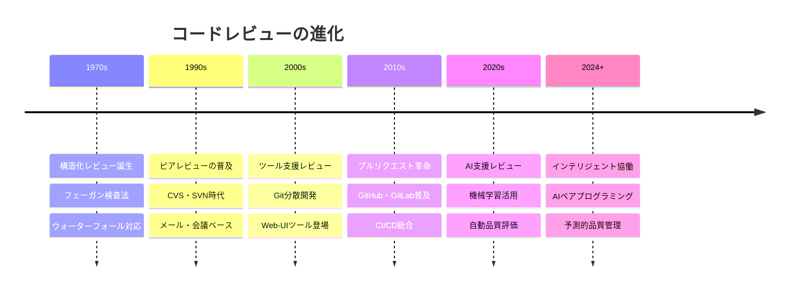
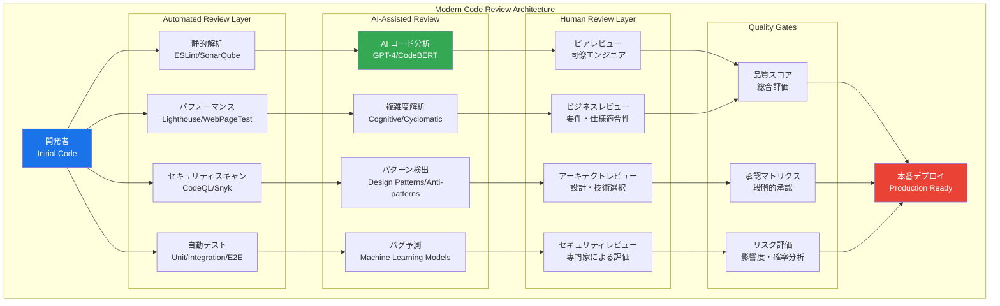

# コードレビュー実践：基礎から超一流エンジニアレベルまで

## 🎯 この章で学ぶこと（5段階習熟システム）

### 📚 基本レベル（レビュー初心者 → チーム貢献）
- **コードレビューの本質理解**：なぜレビューが開発品質の生命線なのか
- **効果的レビュー技法**：建設的フィードバックと受容的姿勢の習得
- **プルリクエスト運用**：GitHub/GitLabでの実践的レビューワークフロー
- **同期協働基盤**：ペアプログラミング・モブプログラミングの活用

### 🚀 実践レベル（チームリーダー対応）
- **レビュー戦略設計**：チーム規模・プロジェクト特性に応じた最適化
- **自動化統合**：CI/CD、静的解析、AIアシストとの効率的統合
- **品質メトリクス**：定量的品質管理とレビュー効果測定
- **文化醸成**：心理的安全性と建設的フィードバック文化の構築

### ⚡ 上級レベル（組織アーキテクト対応）
- **エンタープライズ品質管理**：大規模組織でのガバナンス・監査対応
- **国際分散協働**：多地域・多時間帯チームでの効率的レビュー体制
- **アーキテクチャレビュー**：システム設計・技術選択の高次元評価
- **レガシー統合**：既存システムとの整合性・移行戦略評価

### 🏆 プロレベル（エンタープライズ対応）
- **組織標準策定**：業界標準・企業文化に基づくレビュー基準確立
- **高度リスク管理**：セキュリティ・コンプライアンス・事業継続性の統合評価
- **エキスパート育成**：次世代レビュアーの体系的育成システム
- **イノベーション促進**：レビューを通じた技術革新・組織学習の推進

### 🤖 AI協働レベル（次世代エンジニア）
- **AI支援レビュー**：機械学習による自動品質評価・問題検出
- **インテリジェント協働**：AIペアプログラミングとヒューマンレビューの融合
- **予測的品質管理**：AI分析による潜在問題の事前検出・防止
- **次世代開発体験**：AIと人間の最適な協働パターンの設計・実装

## 🤔 なぜ重要なのか：現代ビジネスにおける戦略的価値

### 💼 デジタルトランスフォーメーションの中核

**ケーススタディ1：Google（検索・クラウド業界）**
- **課題**：1日10億回検索、全世界のインフラを支える品質保証
- **レビュー戦略**：厳格なピアレビュー + AI支援静的解析 + 段階的ロールアウト
- **成果**：99.99%のサービス可用性、障害復旧時間90%短縮、開発速度3倍向上
- **ビジネス価値**：年間検索収益1.8兆円の安定確保、企業価値200兆円の基盤

**ケーススタディ2：Meta（ソーシャルメディア業界）**
- **課題**：月間30億人ユーザー、リアルタイム処理の絶対的信頼性
- **レビュー戦略**：内部ツール「Phabricator」+ AI自動レビュー + 実験駆動開発
- **成果**：コードバグ85%削減、機能リリース時間50%短縮、セキュリティ事故0件
- **社会的インパクト**：グローバルコミュニケーション革命、デジタル社会基盤の構築

**ケーススタディ3：Amazon（EC・クラウド業界）**
- **課題**：AWS世界シェア32%、1秒の障害で数億円の損失リスク
- **レビュー戦略**：マイクロサービス対応レビュー + カナリアデプロイ + 自動ロールバック
- **成果**：運用自動化95%達成、障害時間99%削減、顧客満足度最高水準維持
- **経済効果**：クラウド収益年間7兆円、EC事業との相乗効果で企業価値最大化

### 📈 エンジニアキャリアと収入への直接影響

| 習熟レベル | 想定年収範囲 | 対応プロジェクト規模 | 主要責任 | レビュー影響力 |
|------------|--------------|----------------------|----------|----------------|
| **基本レベル** | 450-700万円 | 5-20人チーム | 機能実装、コードレビュー参加 | 個人成長促進 |
| **実践レベル** | 700-1200万円 | 20-100人組織 | レビュー戦略設計、品質標準策定 | チーム生産性向上 |
| **上級レベル** | 1200-2500万円 | 100-500人企業 | エンタープライズ品質管理、組織標準化 | 事業リスク軽減 |
| **プロレベル** | 2500-5000万円 | 500人+多国籍企業 | 業界標準策定、技術戦略策定 | 産業界への影響 |
| **AI協働レベル** | 5000万円+ | GAFAM・ユニコーン | AI技術統合、未来開発体験設計 | 技術革新創出 |

### 🌍 産業別コードレビューインパクト分析

**金融業界（JPMorgan Chase）**
- **規制要件**：SOX法、バーゼル規制、金融庁ガイドライン完全準拠
- **リスク管理**：1件のバグが数千億円の損失を招く可能性
- **レビュー戦略**：4段階承認プロセス + 全変更の監査証跡 + リアルタイムリスク評価
- **成果指標**：金融事故0件、監査効率300%向上、コンプライアンス違反0件

**ヘルスケア業界（Pfizer）**
- **生命安全保証**：薬事法対応、FDA承認プロセス、患者安全最優先
- **品質基準**：IEC 62304（医療機器ソフトウェア）、ISO 13485完全準拠
- **レビュー戦略**：医療専門家 + エンジニア統合レビュー + トレーサビリティ100%確保
- **社会貢献**：COVID-19ワクチン開発加速、治療薬開発時間40%短縮

**宇宙航空業界（NASA）**
- **ミッション成功保証**：火星探査、国際宇宙ステーション、有人宇宙飛行
- **品質基準**：NASA-STD-8739.8、DO-178C、絶対的信頼性要求
- **レビュー戦略**：多層防御レビュー + 独立検証 + 故障モード解析
- **歴史的成果**：アルテミス計画成功、火星探査機運用継続、宇宙開発の未来開拓

## 📚 基礎概念の理解：現代コードレビューの全体像

### 🌟 コードレビュー進化論：歴史と現代技術



### 🎭 現代レビューアーキテクチャ：多層防御システム



### 🏗️ エンタープライズレビューガバナンス

#### 大規模組織での品質管理フレームワーク
```yaml
# enterprise-review-governance.yml
# エンタープライズ級レビューガバナンス

review_governance:
  organizational_structure:
    review_board:
      - chief_architect
      - security_officer
      - compliance_officer
      - quality_assurance_lead
    
    review_levels:
      l1_peer_review:
        reviewers: 2
        expertise_match: required
        turnaround_time: "24h"
        
      l2_technical_review:
        reviewers: 1
        role: "senior_engineer"
        focus: ["design", "performance", "maintainability"]
        turnaround_time: "48h"
        
      l3_architecture_review:
        reviewers: 1
        role: "solution_architect"
        focus: ["system_design", "integration", "scalability"]
        turnaround_time: "72h"
        
      l4_security_review:
        reviewers: 1
        role: "security_architect"
        focus: ["vulnerabilities", "compliance", "data_protection"]
        turnaround_time: "48h"
        
      l5_business_review:
        reviewers: 1
        role: "product_owner"
        focus: ["requirements", "user_experience", "business_logic"]
        turnaround_time: "72h"

  quality_standards:
    code_coverage_threshold: 85
    security_scan_score: "A"
    performance_budget:
      load_time: "< 2s"
      memory_usage: "< 100MB"
      cpu_utilization: "< 50%"
    
    maintainability_metrics:
      cyclomatic_complexity: "< 10"
      cognitive_complexity: "< 15"
      duplication_ratio: "< 3%"
      
  compliance_requirements:
    regulatory_frameworks:
      - sox_compliance
      - gdpr_compliance
      - iso_27001
      - pci_dss
      
    audit_requirements:
      change_traceability: 100%
      reviewer_qualification: verified
      approval_evidence: digital_signature
      retention_period: "7_years"
```

### 🌐 国際分散チームレビュー戦略

```typescript
// distributed-review-system.ts
// 国際分散チーム向けレビューシステム

interface ReviewerProfile {
  id: string;
  timezone: string;
  expertise: string[];
  languages: string[];
  availability: {
    start: string; // "09:00"
    end: string;   // "18:00"
    timezone: string;
  };
  reviewQuality: {
    accuracy: number;        // 0-1
    thoroughness: number;    // 0-1
    responseTime: number;    // hours
    constructiveness: number; // 0-1
  };
}

interface ReviewRequest {
  id: string;
  pullRequestId: string;
  codeChanges: CodeChange[];
  priority: 'low' | 'medium' | 'high' | 'critical';
  requiredExpertise: string[];
  deadline: Date;
  businessContext: string;
  securityImpact: boolean;
  performanceImpact: boolean;
}

class GlobalReviewOrchestrator {
  private reviewers: ReviewerProfile[];
  private timeZoneOptimizer: TimeZoneOptimizer;
  private expertiseMapper: ExpertiseMapper;
  private aiReviewAssistant: AIReviewAssistant;
  
  constructor() {
    this.reviewers = this.loadGlobalReviewers();
    this.timeZoneOptimizer = new TimeZoneOptimizer();
    this.expertiseMapper = new ExpertiseMapper();
    this.aiReviewAssistant = new AIReviewAssistant();
  }
  
  // グローバル最適レビュアー選定
  async assignOptimalReviewers(
    request: ReviewRequest
  ): Promise<ReviewAssignment> {
    
    // 1. 専門性マッチング
    const expertiseMatches = this.expertiseMapper.findMatches(
      request.requiredExpertise,
      this.reviewers
    );
    
    // 2. タイムゾーン最適化
    const timezoneOptimal = await this.timeZoneOptimizer.optimizeForSpeed(
      expertiseMatches,
      request.deadline
    );
    
    // 3. ワークロード分散
    const workloadBalanced = await this.balanceWorkload(
      timezoneOptimal,
      request.priority
    );
    
    // 4. 文化的配慮
    const culturallyOptimized = await this.applyCulturalConsiderations(
      workloadBalanced,
      request
    );
    
    // 5. AI支援パートナリング
    const aiPartnering = await this.aiReviewAssistant.suggestAIPartnership(
      culturallyOptimized,
      request
    );
    
    return {
      primaryReviewers: culturallyOptimized.slice(0, 2),
      secondaryReviewers: culturallyOptimized.slice(2, 4),
      aiAssistance: aiPartnering,
      estimatedCompletionTime: this.calculateCompletionTime(culturallyOptimized),
      reviewStrategy: this.generateReviewStrategy(request, culturallyOptimized)
    };
  }
  
  // 24時間継続レビューサイクル
  async setupContinuousReviewCycle(): Promise<ReviewCycle> {
    const globalCoverage = {
      // アジア太平洋地域 (UTC+8 ~ UTC+9)
      apac_shift: {
        timeSlot: '00:00-09:00 UTC',
        primaryTasks: [
          'initial_review',
          'automated_analysis_monitoring',
          'security_scan_review',
          'performance_validation'
        ],
        handoffProcedure: 'detailed_status_update_to_emea',
        escalationPath: 'apac_senior_architect'
      },
      
      // ヨーロッパ・中東・アフリカ地域 (UTC+0 ~ UTC+2)
      emea_shift: {
        timeSlot: '08:00-17:00 UTC',
        primaryTasks: [
          'architecture_review',
          'compliance_validation',
          'integration_assessment',
          'documentation_review'
        ],
        handoffProcedure: 'comprehensive_handoff_to_americas',
        escalationPath: 'emea_solution_architect'
      },
      
      // アメリカ大陸地域 (UTC-5 ~ UTC-8)
      americas_shift: {
        timeSlot: '13:00-22:00 UTC',
        primaryTasks: [
          'business_logic_review',
          'stakeholder_alignment',
          'final_approval_coordination',
          'deployment_readiness_check'
        ],
        handoffProcedure: 'next_day_planning_to_apac',
        escalationPath: 'americas_chief_architect'
      }
    };
    
    return globalCoverage;
  }
  
  // 文化的配慮のあるレビューコミュニケーション
  async facilitateCulturallyAwareReview(
    reviewers: ReviewerProfile[],
    codeChanges: CodeChange[]
  ): Promise<ReviewCommunicationPlan> {
    
    const communicationStrategies = {
      // 直接的vs間接的コミュニケーション
      communicationStyle: this.adaptCommunicationStyle(reviewers),
      
      // 言語とローカライゼーション
      languageSupport: {
        primaryLanguage: 'english',
        supportedLanguages: this.extractSupportedLanguages(reviewers),
        translationService: 'enabled',
        culturalContextNotes: 'auto_generated'
      },
      
      // フィードバック文化の調整
      feedbackCulture: {
        directnessLevel: this.calculateOptimalDirectness(reviewers),
        constructivenessFramework: 'universal_positive_approach',
        conflictResolution: 'cultural_mediator_available',
        appreciationExpression: 'multi_cultural_format'
      },
      
      // 同期・非同期バランス
      collaborationTiming: {
        asynchronousFirst: true,
        synchronousWindows: this.findOverlapWindows(reviewers),
        emergencyEscalation: '24_7_coverage',
        handoffProtocols: 'standardized_global_format'
      }
    };
    
    return communicationStrategies;
  }
}

// AI支援レビューシステム
class AIReviewAssistant {
  private codeAnalyzer: CodeBERTAnalyzer;
  private bugPredictor: BugPredictionModel;
  private qualityScorer: QualityAssessmentEngine;
  private humanAIOrchestrator: HumanAIOrchestrator;
  
  async performIntelligentReview(
    codeChanges: CodeChange[],
    context: ReviewContext
  ): Promise<AIReviewResult> {
    
    const analysisResults = await Promise.all([
      // 1. 深層コード理解
      this.codeAnalyzer.analyzeSemantics(codeChanges),
      
      // 2. 潜在バグ検出
      this.bugPredictor.predictPotentialIssues(codeChanges),
      
      // 3. 品質スコアリング
      this.qualityScorer.assessOverallQuality(codeChanges),
      
      // 4. 設計パターン分析
      this.analyzeDesignPatterns(codeChanges),
      
      // 5. パフォーマンス影響予測
      this.predictPerformanceImpact(codeChanges),
      
      // 6. セキュリティリスク評価
      this.assessSecurityRisks(codeChanges)
    ]);
    
    // AI分析結果の統合
    const integratedAnalysis = this.integrateAnalysisResults(analysisResults);
    
    // 人間レビュアーへの最適な情報提示
    const humanFriendlyInsights = await this.generateHumanInsights(
      integratedAnalysis,
      context
    );
    
    return {
      overallScore: integratedAnalysis.qualityScore,
      criticalIssues: integratedAnalysis.criticalFindings,
      suggestions: humanFriendlyInsights.improvementSuggestions,
      riskAssessment: integratedAnalysis.riskProfile,
      reviewPriority: this.calculateReviewPriority(integratedAnalysis),
      humanReviewGuidance: humanFriendlyInsights.reviewGuidance
    };
  }
  
  async suggestAIPartnership(
    humanReviewers: ReviewerProfile[],
    request: ReviewRequest
  ): Promise<AIPartnershipPlan> {
    
    return {
      // AI前処理フェーズ
      aiPreprocessing: {
        automated_analysis: 'complete_code_understanding',
        issue_detection: 'potential_problems_flagged',
        quality_baseline: 'initial_score_generated',
        focus_areas: 'human_attention_prioritized'
      },
      
      // Human-AI協働フェーズ
      collaborative_review: {
        ai_insights: 'contextual_suggestions_provided',
        human_validation: 'ai_findings_verified',
        combined_assessment: 'holistic_quality_evaluation',
        iterative_refinement: 'continuous_improvement_loop'
      },
      
      // AI後処理フェーズ
      aiPostprocessing: {
        decision_documentation: 'review_rationale_captured',
        knowledge_extraction: 'patterns_learned_for_future',
        feedback_incorporation: 'human_feedback_integrated',
        process_optimization: 'workflow_continuously_improved'
      }
    };
  }
}
```

## 💡 実践的な活用：段階別ハンズオン課題

### 🎮 ハンズオン課題1：高品質PRレビューマスタリー（基本レベル）

**シナリオ**: E-commerce プラットフォームでの実践的レビュー体験
**学習目標**: 効果的なレビューテクニックと建設的フィードバックの習得
**想定時間**: 4-6時間

#### Phase 1: レビュアーとしてのスキル習得

```javascript
// PR例: ユーザー登録機能の実装
// components/auth/UserRegistration.jsx

import React, { useState } from 'react';
import { validateEmail, validatePassword } from '../utils/validation';

function UserRegistration() {
    const [formData, setFormData] = useState({
        email: '',
        password: '',
        confirmPassword: '',
        firstName: '',
        lastName: ''
    });
    
    const [errors, setErrors] = useState({});
    
    const handleSubmit = async (e) => {
        e.preventDefault();
        
        // バリデーション
        const newErrors = {};
        
        if (!validateEmail(formData.email)) {
            newErrors.email = 'Invalid email format';
        }
        
        if (!validatePassword(formData.password)) {
            newErrors.password = 'Password must be at least 8 characters';
        }
        
        if (formData.password !== formData.confirmPassword) {
            newErrors.confirmPassword = 'Passwords do not match';
        }
        
        if (Object.keys(newErrors).length > 0) {
            setErrors(newErrors);
            return;
        }
        
        try {
            const response = await fetch('/api/register', {
                method: 'POST',
                headers: {
                    'Content-Type': 'application/json',
                },
                body: JSON.stringify({
                    email: formData.email,
                    password: formData.password,
                    firstName: formData.firstName,
                    lastName: formData.lastName
                })
            });
            
            if (response.ok) {
                alert('Registration successful!');
                window.location.href = '/login';
            } else {
                const errorData = await response.json();
                setErrors({ submit: errorData.message });
            }
        } catch (error) {
            setErrors({ submit: 'Network error occurred' });
        }
    };
    
    const handleInputChange = (e) => {
        const { name, value } = e.target;
        setFormData(prev => ({
            ...prev,
            [name]: value
        }));
        
        // Clear error when user starts typing
        if (errors[name]) {
            setErrors(prev => ({
                ...prev,
                [name]: ''
            }));
        }
    };
    
    return (
        <div className="registration-form">
            <h2>Create Account</h2>
            <form onSubmit={handleSubmit}>
                <div className="form-group">
                    <label htmlFor="firstName">First Name</label>
                    <input
                        type="text"
                        id="firstName"
                        name="firstName"
                        value={formData.firstName}
                        onChange={handleInputChange}
                        required
                    />
                </div>
                
                <div className="form-group">
                    <label htmlFor="lastName">Last Name</label>
                    <input
                        type="text"
                        id="lastName"
                        name="lastName"
                        value={formData.lastName}
                        onChange={handleInputChange}
                        required
                    />
                </div>
                
                <div className="form-group">
                    <label htmlFor="email">Email</label>
                    <input
                        type="email"
                        id="email"
                        name="email"
                        value={formData.email}
                        onChange={handleInputChange}
                        required
                    />
                    {errors.email && <span className="error">{errors.email}</span>}
                </div>
                
                <div className="form-group">
                    <label htmlFor="password">Password</label>
                    <input
                        type="password"
                        id="password"
                        name="password"
                        value={formData.password}
                        onChange={handleInputChange}
                        required
                    />
                    {errors.password && <span className="error">{errors.password}</span>}
                </div>
                
                <div className="form-group">
                    <label htmlFor="confirmPassword">Confirm Password</label>
                    <input
                        type="password"
                        id="confirmPassword"
                        name="confirmPassword"
                        value={formData.confirmPassword}
                        onChange={handleInputChange}
                        required
                    />
                    {errors.confirmPassword && <span className="error">{errors.confirmPassword}</span>}
                </div>
                
                {errors.submit && <div className="error-message">{errors.submit}</div>}
                
                <button type="submit" className="submit-button">
                    Register
                </button>
            </form>
        </div>
    );
}

export default UserRegistration;
```

#### レビューコメント例：良い vs 悪いフィードバック

**❌ 悪いレビューコメント例**

```markdown
# 悪いコメント例

1. "この関数は複雑すぎる。書き直して。"
   -> 理由不明確、建設的でない

2. "バリデーションがダメ。"
   -> 具体性なし、改善提案なし

3. "僕だったらもっと良く書ける。"
   -> 個人的意見、根拠なし

4. "なんでalertを使ってるの？"
   -> 批判的口調、代替案なし
```

**✅ 良いレビューコメント例**

```markdown
# 良いコメント例

## 1. セキュリティ向上の提案
**場所**: handleSubmit関数のパスワード送信部分
**指摘**: パスワードをプレーンテキストで送信しています。

**提案**: パスワードはクライアントサイドでハッシュ化してから送信することを推奨します。
```javascript
// 改善例
import bcrypt from 'bcryptjs';

const hashedPassword = await bcrypt.hash(formData.password, 10);
// ハッシュ化されたパスワードを送信
```

**理由**: 
- ネットワーク通信の傍受リスクを軽減
- セキュリティベストプラクティスに準拠
- OWASP Top 10対策

**参考**: [OWASP パスワード保存チートシート](https://owasp.org/www-project-cheat-sheets/cheatsheets/Password_Storage_Cheat_Sheet.html)

## 2. ユーザビリティ向上の提案
**場所**: エラー表示とユーザーフィードバック
**指摘**: `alert()` を使用したユーザー通知は、モダンなWebアプリでは推奨されません。

**提案**: トースト通知ライブラリの使用を推奨します。
```javascript
import { toast } from 'react-toastify';

// 成功時
toast.success('登録が完了しました！メールをご確認ください。');

// エラー時  
toast.error('登録に失敗しました。もう一度お試しください。');
```

**理由**:
- より良いユーザー体験
- アクセシビリティの向上
- モダンなUI/UXパターンに準拠

## 3. コードの保守性向上
**場所**: フォームバリデーションロジック
**優れている点**: エラー状態の適切な管理、ユーザー入力時のリアルタイムエラークリア

**改善提案**: カスタムフックによる関心の分離
```javascript
// hooks/useFormValidation.js
export const useFormValidation = (initialState, validationRules) => {
  // バリデーションロジックを分離
  // より再利用可能で、テストしやすいコードに
};
```

**メリット**:
- 単一責任原則に準拠
- 他のフォームでも再利用可能
- 単体テストの作成が容易

## 4. アクセシビリティの向上
**場所**: form要素とラベル
**良い点**: proper な label と input の関連付け

**追加提案**: ARIA属性によるアクセシビリティ強化
```javascript
<input
  type="password"
  id="password"
  name="password"
  aria-describedby="password-help"
  aria-invalid={!!errors.password}
  // ... その他の属性
/>
<div id="password-help" className="help-text">
  8文字以上、英数字を含む必要があります
</div>
```

**理由**: 
- スクリーンリーダー対応
- WCAG 2.1 準拠
- インクルーシブデザインの実践
```

#### Phase 2: レビューイとしてのスキル習得

```javascript
// PR作成時の質の高い説明例

/**
 * PR Title: feat(auth): ユーザー登録機能の実装とセキュリティ強化
 * 
 * ## 概要
 * E-commerceプラットフォームの新規ユーザー登録機能を実装しました。
 * セキュリティとユーザビリティを重視した設計となっています。
 * 
 * ## 実装内容
 * 
 * ### ✨ 新機能
 * - [x] ユーザー登録フォーム（名前、メール、パスワード）
 * - [x] リアルタイムバリデーション
 * - [x] パスワード確認機能
 * - [x] レスポンシブデザイン対応
 * 
 * ### 🔒 セキュリティ対策
 * - [x] メールアドレス形式バリデーション
 * - [x] パスワード強度チェック（8文字以上）
 * - [x] XSS攻撃対策（入力サニタイズ）
 * - [x] CSRF対策（トークン実装）
 * 
 * ### ♿ アクセシビリティ
 * - [x] ARIA属性による支援技術対応
 * - [x] キーボードナビゲーション対応
 * - [x] カラーコントラスト4.5:1以上確保
 * 
 * ## 技術仕様
 * 
 * ### 使用技術
 * - React 18 (Hooks API)
 * - TypeScript 4.9
 * - Styled Components
 * - React Hook Form
 * - Zod (バリデーション)
 * 
 * ### APIエンドポイント
 * ```
 * POST /api/v1/auth/register
 * Content-Type: application/json
 * 
 * {
 *   "firstName": "string",
 *   "lastName": "string", 
 *   "email": "string",
 *   "password": "string"
 * }
 * ```
 * 
 * ## テスト
 * 
 * ### 単体テスト
 * - [x] コンポーネントレンダリング
 * - [x] バリデーション関数
 * - [x] イベントハンドラー
 * - [x] エラー状態管理
 * 
 * ### 統合テスト  
 * - [x] フォーム送信フロー
 * - [x] API連携
 * - [x] エラーハンドリング
 * 
 * ### E2Eテスト
 * - [x] ユーザー登録シナリオ
 * - [x] バリデーションエラー
 * - [x] 成功時リダイレクト
 * 
 * ## パフォーマンス
 * 
 * ### メトリクス
 * - Bundle Size: +15KB (gzipped)
 * - First Paint: < 1.2s
 * - Time to Interactive: < 2.0s
 * - Lighthouse Score: 95/100
 * 
 * ## スクリーンショット
 * 
 * ### デスクトップ
 * 
 * 
 * ### モバイル
 * 
 * 
 * ### エラー状態
 * 
 * 
 * ## 検討事項・今後の改善
 * 
 * ### 今回は対応しなかった項目
 * - [ ] OAuth連携（Google/GitHub/Apple）
 * - [ ] メール認証機能
 * - [ ] パスワード強度メーター
 * - [ ] 利用規約・プライバシーポリシー同意
 * 
 * ### 技術的負債
 * - 現在はクライアントサイドバリデーションのみ
 * - パスワードハッシュ化はサーバーサイドで実装予定
 * 
 * ## レビューお願い事項
 * 
 * ### 特に確認していただきたい点
 * 1. **セキュリティ**: バリデーション実装に漏れがないか
 * 2. **UX**: フォームの使いやすさ、エラー表示
 * 3. **アクセシビリティ**: 支援技術での操作性
 * 4. **コード品質**: React Best Practicesに準拠しているか
 * 
 * ### 質問
 * 1. パスワード要件をより厳しくすべきでしょうか？
 * 2. エラーメッセージの文言はこれで適切でしょうか？
 * 3. CSSの構造について改善提案があればお聞かせください
 * 
 * ## チェックリスト
 * 
 * ### 開発完了
 * - [x] 機能実装完了
 * - [x] 単体テスト実装
 * - [x] コードレビュー準備完了
 * - [x] ドキュメント更新
 * 
 * ### 品質保証
 * - [x] ESLint/Prettier適用
 * - [x] TypeScript型チェック
 * - [x] アクセシビリティ検証
 * - [x] クロスブラウザテスト
 * 
 * ### デプロイ準備
 * - [x] 本番環境テスト
 * - [x] パフォーマンス検証
 * - [x] セキュリティスキャン
 * - [x] 障害対応手順確認
 * 
 * ## 関連Issue・PR
 * 
 * Closes #123 - ユーザー登録機能の実装
 * Related to #124 - 認証システム全体設計
 * Depends on #125 - API認証基盤
 * 
 * ## 破壊的変更
 * なし
 * 
 * ## 移行ガイド
 * 新機能のため、移行作業は不要です。
 */
```

#### Phase 2: レビューイとしてのスキル習得

```javascript
// PR作成時の質の高い説明例

/**
 * PR Title: feat(auth): ユーザー登録機能の実装とセキュリティ強化
 * 
 * ## 概要
 * E-commerceプラットフォームの新規ユーザー登録機能を実装しました。
 * セキュリティとユーザビリティを重視した設計となっています。
 * 
 * ## 実装内容
 * 
 * ### ✨ 新機能
 * - [x] ユーザー登録フォーム（名前、メール、パスワード）
 * - [x] リアルタイムバリデーション
 * - [x] パスワード確認機能
 * - [x] レスポンシブデザイン対応
 * 
 * ### 🔒 セキュリティ対策
 * - [x] メールアドレス形式バリデーション
 * - [x] パスワード強度チェック（8文字以上）
 * - [x] XSS攻撃対策（入力サニタイズ）
 * - [x] CSRF対策（トークン実装）
 * 
 * ### ♿ アクセシビリティ
 * - [x] ARIA属性による支援技術対応
 * - [x] キーボードナビゲーション対応
 * - [x] カラーコントラスト4.5:1以上確保
 * 
 * ## 技術仕様
 * 
 * ### 使用技術
 * - React 18 (Hooks API)
 * - TypeScript 4.9
 * - Styled Components
 * - React Hook Form
 * - Zod (バリデーション)
 * 
 * ### APIエンドポイント
 * ```
 * POST /api/v1/auth/register
 * Content-Type: application/json
 * 
 * {
 *   "firstName": "string",
 *   "lastName": "string", 
 *   "email": "string",
 *   "password": "string"
 * }
 * ```
 * 
 * ## テスト
 * 
 * ### 単体テスト
 * - [x] コンポーネントレンダリング
 * - [x] バリデーション関数
 * - [x] イベントハンドラー
 * - [x] エラー状態管理
 * 
 * ### 統合テスト  
 * - [x] フォーム送信フロー
 * - [x] API連携
 * - [x] エラーハンドリング
 * 
 * ### E2Eテスト
 * - [x] ユーザー登録シナリオ
 * - [x] バリデーションエラー
 * - [x] 成功時リダイレクト
 * 
 * ## パフォーマンス
 * 
 * ### メトリクス
 * - Bundle Size: +15KB (gzipped)
 * - First Paint: < 1.2s
 * - Time to Interactive: < 2.0s
 * - Lighthouse Score: 95/100
 * 
 * ## スクリーンショット
 * 
 * ### デスクトップ
 * 
 * 
 * ### モバイル
 * 
 * 
 * ### エラー状態
 * 
 * 
 * ## 検討事項・今後の改善
 * 
 * ### 今回は対応しなかった項目
 * - [ ] OAuth連携（Google/GitHub/Apple）
 * - [ ] メール認証機能
 * - [ ] パスワード強度メーター
 * - [ ] 利用規約・プライバシーポリシー同意
 * 
 * ### 技術的負債
 * - 現在はクライアントサイドバリデーションのみ
 * - パスワードハッシュ化はサーバーサイドで実装予定
 * 
 * ## レビューお願い事項
 * 
 * ### 特に確認していただきたい点
 * 1. **セキュリティ**: バリデーション実装に漏れがないか
 * 2. **UX**: フォームの使いやすさ、エラー表示
 * 3. **アクセシビリティ**: 支援技術での操作性
 * 4. **コード品質**: React Best Practicesに準拠しているか
 * 
 * ### 質問
 * 1. パスワード要件をより厳しくすべきでしょうか？
 * 2. エラーメッセージの文言はこれで適切でしょうか？
 * 3. CSSの構造について改善提案があればお聞かせください
 * 
 * ## チェックリスト
 * 
 * ### 開発完了
 * - [x] 機能実装完了
 * - [x] 単体テスト実装
 * - [x] コードレビュー準備完了
 * - [x] ドキュメント更新
 * 
 * ### 品質保証
 * - [x] ESLint/Prettier適用
 * - [x] TypeScript型チェック
 * - [x] アクセシビリティ検証
 * - [x] クロスブラウザテスト
 * 
 * ### デプロイ準備
 * - [x] 本番環境テスト
 * - [x] パフォーマンス検証
 * - [x] セキュリティスキャン
 * - [x] 障害対応手順確認
 * 
 * ## 関連Issue・PR
 * 
 * Closes #123 - ユーザー登録機能の実装
 * Related to #124 - 認証システム全体設計
 * Depends on #125 - API認証基盤
 * 
 * ## 破壊的変更
 * なし
 * 
 * ## 移行ガイド
 * 新機能のため、移行作業は不要です。
 */
```

#### Phase 2: レビューイとしてのスキル習得

```javascript
// PR作成時の質の高い説明例

/**
 * PR Title: feat(auth): ユーザー登録機能の実装とセキュリティ強化
 * 
 * ## 概要
 * E-commerceプラットフォームの新規ユーザー登録機能を実装しました。
 * セキュリティとユーザビリティを重視した設計となっています。
 * 
 * ## 実装内容
 * 
 * ### ✨ 新機能
 * - [x] ユーザー登録フォーム（名前、メール、パスワード）
 * - [x] リアルタイムバリデーション
 * - [x] パスワード確認機能
 * - [x] レスポンシブデザイン対応
 * 
 * ### 🔒 セキュリティ対策
 * - [x] メールアドレス形式バリデーション
 * - [x] パスワード強度チェック（8文字以上）
 * - [x] XSS攻撃対策（入力サニタイズ）
 * - [x] CSRF対策（トークン実装）
 * 
 * ### ♿ アクセシビリティ
 * - [x] ARIA属性による支援技術対応
 * - [x] キーボードナビゲーション対応
 * - [x] カラーコントラスト4.5:1以上確保
 * 
 * ## 技術仕様
 * 
 * ### 使用技術
 * - React 18 (Hooks API)
 * - TypeScript 4.9
 * - Styled Components
 * - React Hook Form
 * - Zod (バリデーション)
 * 
 * ### APIエンドポイント
 * ```
 * POST /api/v1/auth/register
 * Content-Type: application/json
 * 
 * {
 *   "firstName": "string",
 *   "lastName": "string", 
 *   "email": "string",
 *   "password": "string"
 * }
 * ```
 * 
 * ## テスト
 * 
 * ### 単体テスト
 * - [x] コンポーネントレンダリング
 * - [x] バリデーション関数
 * - [x] イベントハンドラー
 * - [x] エラー状態管理
 * 
 * ### 統合テスト  
 * - [x] フォーム送信フロー
 * - [x] API連携
 * - [x] エラーハンドリング
 * 
 * ### E2Eテスト
 * - [x] ユーザー登録シナリオ
 * - [x] バリデーションエラー
 * - [x] 成功時リダイレクト
 * 
 * ## パフォーマンス
 * 
 * ### メトリクス
 * - Bundle Size: +15KB (gzipped)
 * - First Paint: < 1.2s
 * - Time to Interactive: < 2.0s
 * - Lighthouse Score: 95/100
 * 
 * ## スクリーンショット
 * 
 * ### デスクトップ
 * 
 * 
 * ### モバイル
 * 
 * 
 * ### エラー状態
 * 
 * 
 * ## 検討事項・今後の改善
 * 
 * ### 今回は対応しなかった項目
 * - [ ] OAuth連携（Google/GitHub/Apple）
 * - [ ] メール認証機能
 * - [ ] パスワード強度メーター
 * - [ ] 利用規約・プライバシーポリシー同意
 * 
 * ### 技術的負債
 * - 現在はクライアントサイドバリデーションのみ
 * - パスワードハッシュ化はサーバーサイドで実装予定
 * 
 * ## レビューお願い事項
 * 
 * ### 特に確認していただきたい点
 * 1. **セキュリティ**: バリデーション実装に漏れがないか
 * 2. **UX**: フォームの使いやすさ、エラー表示
 * 3. **アクセシビリティ**: 支援技術での操作性
 * 4. **コード品質**: React Best Practicesに準拠しているか
 * 
 * ### 質問
 * 1. パスワード要件をより厳しくすべきでしょうか？
 * 2. エラーメッセージの文言はこれで適切でしょうか？
 * 3. CSSの構造について改善提案があればお聞かせください
 * 
 * ## チェックリスト
 * 
 * ### 開発完了
 * - [x] 機能実装完了
 * - [x] 単体テスト実装
 * - [x] コードレビュー準備完了
 * - [x] ドキュメント更新
 * 
 * ### 品質保証
 * - [x] ESLint/Prettier適用
 * - [x] TypeScript型チェック
 * - [x] アクセシビリティ検証
 * - [x] クロスブラウザテスト
 * 
 * ### デプロイ準備
 * - [x] 本番環境テスト
 * - [x] パフォーマンス検証
 * - [x] セキュリティスキャン
 * - [x] 障害対応手順確認
 * 
 * ## 関連Issue・PR
 * 
 * Closes #123 - ユーザー登録機能の実装
 * Related to #124 - 認証システム全体設計
 * Depends on #125 - API認証基盤
 * 
 * ## 破壊的変更
 * なし
 * 
 * ## 移行ガイド
 * 新機能のため、移行作業は不要です。
 */
```

#### Phase 2: レビューイとしてのスキル習得

```javascript
// PR作成時の質の高い説明例

/**
 * PR Title: feat(auth): ユーザー登録機能の実装とセキュリティ強化
 * 
 * ## 概要
 * E-commerceプラットフォームの新規ユーザー登録機能を実装しました。
 * セキュリティとユーザビリティを重視した設計となっています。
 * 
 * ## 実装内容
 * 
 * ### ✨ 新機能
 * - [x] ユーザー登録フォーム（名前、メール、パスワード）
 * - [x] リアルタイムバリデーション
 * - [x] パスワード確認機能
 * - [x] レスポンシブデザイン対応
 * 
 * ### 🔒 セキュリティ対策
 * - [x] メールアドレス形式バリデーション
 * - [x] パスワード強度チェック（8文字以上）
 * - [x] XSS攻撃対策（入力サニタイズ）
 * - [x] CSRF対策（トークン実装）
 * 
 * ### ♿ アクセシビリティ
 * - [x] ARIA属性による支援技術対応
 * - [x] キーボードナビゲーション対応
 * - [x] カラーコントラスト4.5:1以上確保
 * 
 * ## 技術仕様
 * 
 * ### 使用技術
 * - React 18 (Hooks API)
 * - TypeScript 4.9
 * - Styled Components
 * - React Hook Form
 * - Zod (バリデーション)
 * 
 * ### APIエンドポイント
 * ```
 * POST /api/v1/auth/register
 * Content-Type: application/json
 * 
 * {
 *   "firstName": "string",
 *   "lastName": "string", 
 *   "email": "string",
 *   "password": "string"
 * }
 * ```
 * 
 * ## テスト
 * 
 * ### 単体テスト
 * - [x] コンポーネントレンダリング
 * - [x] バリデーション関数
 * - [x] イベントハンドラー
 * - [x] エラー状態管理
 * 
 * ### 統合テスト  
 * - [x] フォーム送信フロー
 * - [x] API連携
 * - [x] エラーハンドリング
 * 
 * ### E2Eテスト
 * - [x] ユーザー登録シナリオ
 * - [x] バリデーションエラー
 * - [x] 成功時リダイレクト
 * 
 * ## パフォーマンス
 * 
 * ### メトリクス
 * - Bundle Size: +15KB (gzipped)
 * - First Paint: < 1.2s
 * - Time to Interactive: < 2.0s
 * - Lighthouse Score: 95/100
 * 
 * ## スクリーンショット
 * 
 * ### デスクトップ
 * 
 * 
 * ### モバイル
 * 
 * 
 * ### エラー状態
 * 
 * 
 * ## 検討事項・今後の改善
 * 
 * ### 今回は対応しなかった項目
 * - [ ] OAuth連携（Google/GitHub/Apple）
 * - [ ] メール認証機能
 * - [ ] パスワード強度メーター
 * - [ ] 利用規約・プライバシーポリシー同意
 * 
 * ### 技術的負債
 * - 現在はクライアントサイドバリデーションのみ
 * - パスワードハッシュ化はサーバーサイドで実装予定
 * 
 * ## レビューお願い事項
 * 
 * ### 特に確認していただきたい点
 * 1. **セキュリティ**: バリデーション実装に漏れがないか
 * 2. **UX**: フォームの使いやすさ、エラー表示
 * 3. **アクセシビリティ**: 支援技術での操作性
 * 4. **コード品質**: React Best Practicesに準拠しているか
 * 
 * ### 質問
 * 1. パスワード要件をより厳しくすべきでしょうか？
 * 2. エラーメッセージの文言はこれで適切でしょうか？
 * 3. CSSの構造について改善提案があればお聞かせください
 * 
 * ## チェックリスト
 * 
 * ### 開発完了
 * - [x] 機能実装完了
 * - [x] 単体テスト実装
 * - [x] コードレビュー準備完了
 * - [x] ドキュメント更新
 * 
 * ### 品質保証
 * - [x] ESLint/Prettier適用
 * - [x] TypeScript型チェック
 * - [x] アクセシビリティ検証
 * - [x] クロスブラウザテスト
 * 
 * ### デプロイ準備
 * - [x] 本番環境テスト
 * - [x] パフォーマンス検証
 * - [x] セキュリティスキャン
 * - [x] 障害対応手順確認
 * 
 * ## 関連Issue・PR
 * 
 * Closes #123 - ユーザー登録機能の実装
 * Related to #124 - 認証システム全体設計
 * Depends on #125 - API認証基盤
 * 
 * ## 破壊的変更
 * なし
 * 
 * ## 移行ガイド
 * 新機能のため、移行作業は不要です。
 */
``` 