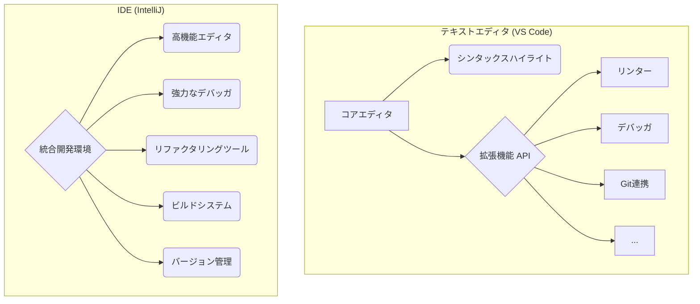

# 第1章 エディタとIDE：開発者のための万能ナイフ

## 🎯 この章で学ぶこと
- テキストエディタとIDE（統合開発環境）の基本的な違いと、それぞれの利点・欠点を説明できる。
- Visual Studio Code (VS Code) を例に、モダンなテキストエディタが持つ主要な機能（拡張機能、リンター、デバッガなど）を理解する。
- IDEが「統合」環境と呼ばれる理由を、コード補完、リファクタリング、ビルドツールの連携といった機能から説明できる。
- どのような状況で軽量なエディタが適し、どのような状況で高機能なIDEが適するのか、判断基準を持つことができる。
- AIコーディングアシスタント（例：GitHub Copilot）が、エディタやIDE上でどのように開発者の生産性を向上させるかを理解する。

## 🤔 なぜ重要なのか
プロの料理人が鋭い包丁を選ぶように、プロのソフトウェアエンジニアは自分に合った開発ツールを選びます。コードを書くための最も基本的なツールが、**テキストエディタ**と**IDE（Integrated Development Environment, 統合開発環境）**です。これらのツールは、単に文字を入力するだけでなく、コードの品質を高め、開発の効率を劇的に向上させるための様々な機能を提供します。

もしあなたがWindowsの「メモ帳」だけでプログラミングをしようとしたら、タイプミスに気づかず、文法エラーを探すのに何時間も費やし、関連するファイルを探し回ることになるでしょう。これは、ノコギリ一本で家を建てるようなものです。

モダンなエディタやIDEは、構文のハイライト、自動補完、エラーチェック、デバッグ、バージョン管理（Git）連携といった機能を備え、開発者を煩雑な作業から解放してくれます。特にAIアシスタントが統合された現代のツールは、もはや単なる「書く」道具ではなく、開発者の思考を加速させる「パートナー」と言えます。自分に合ったツールを選び、使いこなすことが、生産性の高いエンジニアになるための第一歩です。

## 📚 基礎概念の理解

### テキストエディタ：軽量・高速・カスタマイズ自在
テキストエディタは、その名の通りテキストファイルを編集するためのソフトウェアですが、プログラミングに特化した多くの機能を備えています。

-   **特徴**:
    -   **軽量で高速**: 起動や動作が非常に速い。
    -   **高い拡張性**: ユーザーが「拡張機能（プラグイン）」を追加することで、必要な機能を自由にカスタマイズできる。
    -   **特定言語に依存しない**: 基本的にはどんなプログラミング言語のファイルでも開いて編集できる。
-   **代表例**:
    -   **Visual Studio Code (VS Code)**: 現在、世界で最も人気のあるテキストエディタ。豊富な拡張機能と優れた基本性能で、多くの開発者に支持されている。
    -   **Sublime Text**: カスタマイズ性とパフォーマンスに定評がある。
    -   **Neovim/Vim**: キーボード中心の操作で、熟練すると非常に高速なコーディングが可能。

テキストエディタは、必要な機能を自分で選んで追加していく「DIY」的なアプローチです。最初はシンプルですが、育てていくことで自分だけの一番使いやすいツールになります。

### IDE (統合開発環境)：全部入りの強力な作業環境
IDEは、コード編集機能に加えて、プログラミングに必要な様々なツールを一つのパッケージに「統合」した、より重量級のソフトウェアです。

-   **特徴**:
    -   **全部入り (All-in-One)**: コードエディタ、コンパイラ（またはインタプリタ）、デバッガ、ビルドツールなどが最初から統合されている。
    -   **強力なコード解析と支援**: プロジェクト全体のコードを常に解析しており、高度なコード補完、定義ジャンプ、リファクタリング（コードの安全な整形）機能を提供する。
    -   **特定言語やフレームワークに特化**: 特定の開発（例：Java、iOSアプリ、ゲーム開発）に最適化されていることが多い。
-   **代表例**:
    -   **IntelliJ IDEA**: Java開発のデファクトスタンダード。強力なコード解析機能で有名。
    -   **Visual Studio**: .NETやC++を使ったWindowsアプリケーション開発の標準ツール。
    -   **Xcode**: iOS/macOSアプリ開発に必須のIDE。
    -   **PyCharm**: Python開発に特化したIDE。

IDEは、特定の料理（開発）のために最適化された、全ての調理器具が揃った「システムキッチン」に例えられます。

### エディタとIDE、主要機能の比較
| 機能 | モダンなテキストエディタ (VS Code) | IDE (IntelliJ, PyCharm) |
| :--- | :--- | :--- |
| **基本思想** | 軽量なコア + 拡張機能でカスタマイズ | 最初から全部入りの統合環境 |
| **起動速度** | 速い | やや遅い |
| **コード補完** | 高機能（拡張機能による） | 非常に強力（プロジェクト全体を静的解析） |
| **デバッグ機能** | あり（拡張機能で設定） | 標準で統合、グラフィカルで高機能 |
| **リファクタリング** | 基本的な機能あり | 非常に高度で安全な機能が豊富 |
| **ビルドツール連携** | 設定すれば可能 | 標準で緊密に統合 |
| **得意な領域** | Web開発、スクリプト言語、設定ファイル編集 | 大規模システム開発、静的型付け言語 |

## 💡 実践的な活用

### VS Codeの必須拡張機能と設定
VS Codeを強力な開発ツールにするために、最低限入れておくべき拡張機能のジャンルを紹介します。

1.  **言語サポート**: 自分が使うプログラミング言語のサポート。（例：`Python`, `Prettier - Code formatter`）
2.  **リンター (Linter)**: コードを静的に解析し、文法エラーや潜在的なバグ、コーディングスタイル違反を指摘してくれるツール。（例：`ESLint` for JavaScript）
3.  **Git連携**: エディタ上でGitの操作をより視覚的に行えるようにする。（例：`GitLens`）
4.  **AIコーディングアシスタント**: コードの自動補完や生成、チャットによる質問応答などを行う。（例：`GitHub Copilot`）

これらの拡張機能を導入することで、単純なタイプミスを防ぎ、コードの品質を一定に保ち、開発のリズムを崩すことなくコーディングに集中できます。

### IDEの真価：リファクタリング
IDEがテキストエディタに対して持つ大きな優位性の一つが、**安全なリファクタリング機能**です。リファクタリングとは、「外部から見た振る舞いを変えずに、内部の構造を改善すること」です。

例えば、ある関数の名前を変更したいと考えます。
-   **テキストエディタの場合**: プロジェクト全体から、その関数名が使われている箇所を「検索と置換」で探す必要があります。しかし、同じ名前の別の変数を誤って置換してしまったり、コメント内の文字列まで置換してしまったりする危険性があります。
-   **IDEの場合**: IDEはコードの構造を理解しているため、「名前の変更」リファクタリング機能を使えば、その関数が呼び出されている箇所だけを**安全かつ正確に**一括で変更してくれます。

この差は、変数名のリネーム、メソッドの抽出、クラスの移動など、プロジェクトが大規模になるほど顕著になり、開発者が安心してコードの改善に取り組める環境を提供します。

### AIアシスタントとの連携
GitHub CopilotのようなAIコーディングアシスタントは、エディタやIDEに統合されることで、その能力を最大限に発揮します。

-   **コード補完**: 数行のコメントやコードの書き始めから、文脈を読み取って残りのコードスニペット全体を提案してくれます。
-   **チャット機能**: 「この正規表現を書いて」「このコードをリファクタリングして」といった自然言語での指示に対して、コードを生成したり、質問に答えたりしてくれます。
-   **デバッグ支援**: エラーメッセージをAIに質問することで、原因の特定や解決策の提案を得られます。

AIアシスタントは、定型的なコードの記述や、知らないライブラリの使い方を調べる時間を大幅に削減し、開発者がより本質的な問題解決に集中することを可能にします。

## 🔍 深掘り：プロの視点

### "設定ファイル地獄"と"Dotfiles"
テキストエディタ、特にVS CodeやVimを自分好みにカスタマイズしていくと、`settings.json`のような設定ファイルがどんどん肥大化していきます。また、新しいPCに環境を移行する際に、一から設定をやり直すのは非常に面倒です。

この問題を解決するのが **`Dotfiles`** という文化です。
-   **概念**: `.`で始まる設定ファイル（例：`.vimrc`, `.zshrc`, `settings.json`）を、自分専用のGitリポジトリで管理する手法。
-   **利点**:
    -   GitHubに`dotfiles`リポジトリを置くことで、どのPCでも同じ開発環境を素早く再現できる。
    -   自分の設定の変更履歴を管理できる。
    -   他の開発者の`dotfiles`を参考に、新しい便利な設定を知ることができる。

熟練したエンジニアの多くは、長年かけて育て上げた自分だけの`dotfiles`を持っており、それが彼らの高い生産性の一因となっています。

### リモート開発機能
近年の開発では、自分のPC（ローカル）ではなく、クラウド上のサーバーやコンテナ内に開発環境を構築する「リモート開発」が主流になりつつあります。VS Codeの`Remote - SSH`や`Dev Containers`といった拡張機能は、このリモート開発を強力にサポートします。

-   **仕組み**: ローカルのVS Codeをクライアントとして使い、実際のファイルの編集やコマンドの実行はリモートサーバー上で行う。
-   **利点**:
    -   チーム全員で完全に同一の開発環境を共有できるため、「私の環境では動くのに」という問題を撲滅できる。
    -   高性能なリモートサーバーのリソースを使えるため、ローカルPCのスペックに依存しない。

これにより、ローカル環境を汚すことなく、プロジェクトごとに最適化されたクリーンな環境で開発を進めることができます。

## 📋 まとめとチェックポイント
- テキストエディタは軽量で拡張性が高く、IDEは全部入りで特定分野に強い。
- VS Codeは拡張機能によってIDEに匹敵する機能を持つことができる、非常にバランスの取れたエディタである。
- リンターやフォーマッター、AIアシスタントの活用は、現代の開発において生産性を高める上で必須。
- IDEの強力なリファクタリング機能は、大規模なプロジェクトのコード品質を安全に維持する上で大きな助けとなる。
- プロジェクトの性質や個人の好みに合わせてツールを選び、カスタマイズしていくことが重要。

**セルフチェック**
- [ ] あなたが新しいプログラミング言語を少し試してみたいと思ったとき、テキストエディタとIDEのどちらを選びますか？その理由は何ですか？
- [ ] 「リンター」がコード品質の向上にどのように貢献するのか説明できますか？
- [ ] あるクラスの名前をプロジェクト全体で変更したい場合、IDEを使うとどのようなメリットがありますか？
- [ ] 複数のPCで、あなたのお気に入りのエディタ設定を同期させるには、どのような方法が考えられますか？

## 🔗 関連知識・発展学習
- **仮想環境とコンテナ (`0222_Virtual_Environment_Container.md`)**: リモート開発やDev Containersの概念は、コンテナ技術（Dockerなど）の理解と密接に関連しています。
- **パッケージ管理 (`0223_Package_Management.md`)**: エディタやIDEは、各言語のパッケージマネージャーと連携して、プロジェクトの依存関係を管理する機能を提供します。
- **継続的インテグレーション (`0531_Continuous_Integration.md`)**: ローカルで使っているリンターやテストコマンドを、CIサーバー上で自動実行することで、チーム全体のコード品質を保証します。 