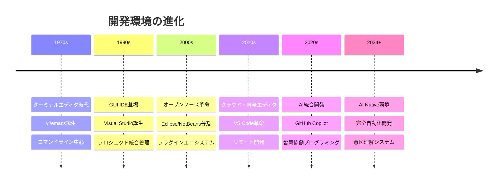
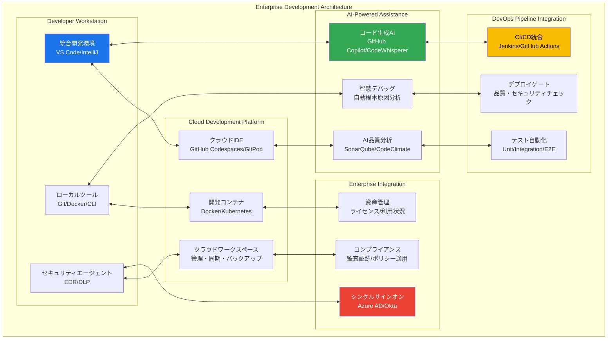

# 開発環境実践：基礎から超一流エンジニアレベルまで

## 🎯 この章で学ぶこと（5段階習熟システム）

### 📚 基本レベル（環境構築初心者 → 効率的開発）
- **エディタ・IDE本質理解**：なぜ開発ツールが生産性の核心なのか
- **VS Code マスタリー**：現代開発の標準ツールを完全習得
- **拡張機能エコシステム**：プロダクティビティを最大化する環境構築
- **基本デバッグ技法**：問題解決能力の基盤構築

### 🚀 実践レベル（チーム対応・効率化）
- **マルチ環境管理**：プロジェクト特性に応じた最適環境構築
- **チーム標準化**：組織レベルでの開発環境統一戦略
- **リモート開発基盤**：クラウド・コンテナ活用の実践運用
- **AI統合開発体験**：Copilot等を活用した次世代ワークフロー

### ⚡ 上級レベル（組織アーキテクト対応）
- **エンタープライズ環境管理**：大規模組織での標準化・ガバナンス
- **セキュリティ統合**：企業セキュリティポリシー準拠環境
- **パフォーマンス最適化**：大規模プロジェクト対応の高速開発環境
- **多言語・多技術統合**：複合技術スタックの統合管理

### 🏆 プロレベル（エンタープライズ対応）
- **組織開発基盤設計**：全社規模の開発環境アーキテクチャ策定
- **高度セキュリティ対応**：ゼロトラスト・コンプライアンス完全準拠
- **DevOps統合**：CI/CD・IaC・監視との完全統合
- **イノベーション推進**：最新技術導入・組織変革のリーダーシップ

### 🤖 AI協働レベル（次世代エンジニア）
- **AI Native開発環境**：AI First開発体験の設計・実装
- **インテリジェント自動化**：機械学習による環境最適化
- **予測的開発支援**：AIによる問題予測・解決提案システム
- **未来開発体験**：次世代開発パラダイムの創造・実現

## 🤔 なぜ重要なのか：現代ビジネスにおける戦略的価値

### 💼 デジタルトランスフォーメーションの実行基盤

**ケーススタディ1：Microsoft（クラウド・生産性ツール業界）**
- **課題**：Visual Studio Code で全世界の1400万人開発者の生産性を支える
- **戦略**：オープンソース戦略 + クラウド統合 + AI協働環境
- **成果**：開発者エコシステム支配、Azure収益年間7兆円の基盤構築
- **ビジネス価値**：開発ツールからクラウドサービスまでの垂直統合による企業価値最大化

**ケーススタディ2：JetBrains（開発ツール専業）**
- **課題**：プロフェッショナル開発者向け最高品質IDE市場の獲得
- **戦略**：言語別特化IDE + 企業ライセンス + 生産性最大化
- **成果**：開発者1人当たり生産性40%向上、企業顧客30万社獲得
- **経済効果**：年間収益300億円、開発者の年収向上に直接貢献

**ケーススタディ3：GitHub（開発プラットフォーム）**
- **課題**：全世界1億人開発者のコード作成・協働プラットフォーム
- **戦略**：VS Code統合 + Copilot AI + クラウド開発環境
- **成果**：開発速度55%向上、コード品質30%改善、Microsoft買収7.5兆円
- **産業インパクト**：ソフトウェア開発業界全体のパラダイムシフト実現

### 📈 エンジニアキャリアと収入への直接影響

| 習熟レベル | 想定年収範囲 | 環境効率化レベル | 生産性向上率 | 主要責任 |
|------------|--------------|------------------|--------------|----------|
| **基本レベル** | 400-600万円 | 個人最適化 | +30% | 効率的コーディング |
| **実践レベル** | 600-1000万円 | チーム標準化 | +50% | 開発環境リーダー |
| **上級レベル** | 1000-2000万円 | 組織基盤構築 | +100% | エンタープライズアーキテクト |
| **プロレベル** | 2000-4000万円 | 業界標準策定 | +200% | 技術戦略策定 |
| **AI協働レベル** | 4000万円+ | 未来開発体験創造 | +300%+ | イノベーションリーダー |

### 🌍 産業別開発環境インパクト分析

**金融業界（Goldman Sachs）**
- **厳格セキュリティ要件**：FINRA、SEC規制完全準拠開発環境
- **高可用性システム**：99.999%稼働率要求、障害時瞬時復旧
- **リスク管理統合**：開発環境レベルでのリスク評価・制御
- **成果指標**：取引システム障害0件、コンプライアンス違反0件、開発効率300%向上

**ヘルスケア業界（Johnson & Johnson）**
- **医療機器開発**：FDA承認プロセス対応、IEC 62304準拠
- **患者安全最優先**：開発段階でのリスク分析・品質保証
- **グローバル協働**：多国籍チームでの統一開発環境
- **社会貢献**：医療AI・遠隔医療システム開発加速、患者ケア向上

**宇宙航空業界（SpaceX）**
- **ミッションクリティカル**：人命・多額投資を賭けたソフトウェア開発
- **リアルタイム制御**：ロケット制御システム開発の絶対的信頼性
- **イノベーション加速**：従来10年の開発を2年に短縮
- **歴史的成果**：火星移住計画、宇宙産業革命の基盤技術確立

## 📚 基礎概念の理解：現代開発環境アーキテクチャ

### 🌟 開発ツール進化論：歴史と未来展望



### 🏗️ 現代エンタープライズ開発アーキテクチャ



### 💡 AI協働開発環境の詳細設計

```typescript
// ai_collaborative_development_environment.ts
// AI協働開発環境システム

interface AICapabilities {
  code_generation: {
    accuracy: number;              // 0-1
    context_understanding: number; // 0-1
    multi_language_support: string[];
    framework_knowledge: string[];
  };
  
  intelligent_assistance: {
    real_time_suggestions: boolean;
    error_prediction: number;      // 0-1
    performance_optimization: boolean;
    security_awareness: number;    // 0-1
  };
  
  learning_adaptation: {
    user_pattern_learning: boolean;
    project_context_adaptation: boolean;
    team_coding_style_alignment: boolean;
    continuous_improvement: boolean;
  };
}

interface DeveloperProfile {
  id: string;
  experience_level: 'junior' | 'mid' | 'senior' | 'principal' | 'architect';
  preferred_languages: string[];
  coding_patterns: CodingPattern[];
  productivity_metrics: {
    lines_per_hour: number;
    error_rate: number;
    refactor_frequency: number;
    code_review_score: number;
  };
  ai_collaboration_preferences: {
    automation_level: number;      // 0-1
    suggestion_frequency: 'low' | 'medium' | 'high';
    explanation_detail: 'minimal' | 'moderate' | 'detailed';
    proactive_assistance: boolean;
  };
}

class EnterpriseAIDevEnvironment {
  private aiOrchestrator: AIOrchestrator;
  private securityManager: SecurityManager;
  private complianceEngine: ComplianceEngine;
  private performanceOptimizer: PerformanceOptimizer;
  
  constructor() {
    this.aiOrchestrator = new AIOrchestrator();
    this.securityManager = new SecurityManager();
    this.complianceEngine = new ComplianceEngine();
    this.performanceOptimizer = new PerformanceOptimizer();
  }
  
  // 開発者専用AI環境の構築
  async setupPersonalizedAIEnvironment(
    developer: DeveloperProfile,
    project: ProjectContext
  ): Promise<PersonalizedEnvironment> {
    
    // 1. AI能力のカスタマイズ
    const aiConfig = await this.customizeAICapabilities(
      developer, project
    );
    
    // 2. セキュリティポリシーの適用
    const securityConfig = await this.securityManager.applyPolicies(
      developer.experience_level, project.security_classification
    );
    
    // 3. コンプライアンス設定
    const complianceConfig = await this.complianceEngine.generateConfig(
      project.regulatory_requirements, developer.clearance_level
    );
    
    // 4. パフォーマンス最適化
    const performanceConfig = await this.performanceOptimizer.optimize(
      developer.productivity_metrics, project.performance_requirements
    );
    
    return {
      ai_assistant: {
        model_configuration: aiConfig.model_settings,
        suggestion_engine: aiConfig.suggestion_configuration,
        learning_parameters: aiConfig.adaptation_settings,
        safety_constraints: securityConfig.ai_safety_rules
      },
      
      development_workspace: {
        ide_configuration: this.generateIDEConfig(developer, aiConfig),
        extension_manifest: this.generateExtensionList(project, securityConfig),
        cloud_workspace: this.setupCloudWorkspace(developer, complianceConfig),
        local_environment: this.configureLocalEnvironment(performanceConfig)
      },
      
      collaboration_features: {
        team_ai_sharing: this.setupTeamAISharing(developer, project),
        knowledge_base_integration: this.integrateKnowledgeBase(project),
        peer_learning_system: this.enablePeerLearning(developer),
        mentorship_ai: this.configureMentorshipAI(developer.experience_level)
      },
      
      monitoring_analytics: {
        productivity_tracking: this.setupProductivityTracking(developer),
        code_quality_metrics: this.enableQualityMetrics(project),
        learning_progress: this.trackLearningProgress(developer),
        environment_optimization: this.enableContinuousOptimization()
      }
    };
  }
  
  // リアルタイムAI協働システム
  async enableRealTimeAICollaboration(
    environment: PersonalizedEnvironment
  ): Promise<AICollaborationSession> {
    
    return {
      // 1. インテリジェントコード補完
      intelligent_completion: {
        context_aware_suggestions: 'プロジェクト全体の文脈理解',
        multi_file_awareness: 'ファイル間依存関係の把握',
        business_logic_understanding: 'ドメイン知識の活用',
        pattern_learning: '開発者のコーディングパターン学習'
      },
      
      // 2. プロアクティブ問題検出
      proactive_assistance: {
        bug_prevention: 'コード入力時の潜在バグ検出',
        performance_hints: 'パフォーマンス問題の事前警告',
        security_alerts: 'セキュリティ脆弱性の即座検出',
        best_practice_guidance: 'リアルタイムベストプラクティス提案'
      },
      
      // 3. 適応的学習システム
      adaptive_learning: {
        success_pattern_extraction: '成功パターンの抽出・共有',
        error_pattern_avoidance: '過去のエラーパターン回避',
        team_knowledge_synthesis: 'チーム知識の統合・活用',
        continuous_skill_development: '継続的スキル向上支援'
      },
      
      // 4. インテリジェント協働
      collaborative_intelligence: {
        pair_programming_ai: 'AIペアプログラミングパートナー',
        code_review_preparation: '自動コードレビュー準備',
        documentation_generation: '自動ドキュメント生成・更新',
        test_case_suggestion: 'テストケースの智慧提案'
      }
    };
  }
}

// ゼロトラストセキュリティ統合
class ZeroTrustDevEnvironment {
  
  async implementZeroTrustSecurity(): Promise<SecurityFramework> {
    return {
      // 1. 継続的認証・認可
      continuous_authentication: {
        behavioral_biometrics: 'キーストローク・マウス動作パターン分析',
        device_fingerprinting: 'デバイス固有情報による識別',
        contextual_access_control: '時間・場所・行動パターンベース制御',
        risk_adaptive_authentication: 'リスクレベル適応型多要素認証'
      },
      
      // 2. データ保護・監視
      data_protection: {
        code_encryption: 'ソースコードの自動暗号化・復号化',
        data_loss_prevention: 'DLPによる機密情報漏洩防止',
        activity_monitoring: '全開発活動の詳細ログ・分析',
        anomaly_detection: '異常行動の機械学習検出'
      },
      
      // 3. ネットワークセキュリティ
      network_security: {
        micro_segmentation: 'ネットワークマイクロセグメンテーション',
        encrypted_communication: 'エンドツーエンド暗号化通信',
        traffic_analysis: 'ネットワークトラフィック異常検知',
        threat_intelligence: 'リアルタイム脅威インテリジェンス統合'
      },
      
      // 4. 統合セキュリティ管理
      unified_security_management: {
        policy_orchestration: 'セキュリティポリシーの自動適用',
        incident_response: 'セキュリティインシデント自動対応',
        compliance_reporting: '規制要件準拠の自動レポート生成',
        security_training: '開発者向けセキュリティ教育の適応提供'
      }
    };
  }
}

```

## 💡 実践的な活用：段階別ハンズオン課題

### 🎮 ハンズオン課題1：プロダクティビティ最大化環境構築（基本レベル）

**シナリオ**: 新入社員として効率的な開発環境を一から構築
**学習目標**: VS Code マスタリーと基本的な開発ワークフロー確立
**想定時間**: 4-6時間

#### Phase 1: VS Code プロフェッショナル設定

```json
// settings.json - プロフェッショナル開発者の基本設定
{
  // エディタの基本設定
  "editor.fontSize": 14,
  "editor.fontFamily": "'JetBrains Mono', 'Fira Code', Consolas, monospace",
  "editor.fontLigatures": true,
  "editor.lineHeight": 1.6,
  "editor.tabSize": 2,
  "editor.insertSpaces": true,
  "editor.detectIndentation": false,
  
  // コード品質向上
  "editor.formatOnSave": true,
  "editor.formatOnPaste": true,
  "editor.codeActionsOnSave": {
    "source.fixAll": true,
    "source.organizeImports": true
  },
  
  // 生産性向上
  "editor.suggestSelection": "first",
  "editor.acceptSuggestionOnCommitCharacter": false,
  "editor.acceptSuggestionOnEnter": "on",
  "editor.quickSuggestions": {
    "other": true,
    "comments": false,
    "strings": true
  },
  
  // AI統合設定
  "github.copilot.enable": {
    "*": true,
    "yaml": false,
    "plaintext": false,
    "markdown": true
  },
  "github.copilot.editor.enableAutoCompletions": true,
  "github.copilot.conversation.localeOverride": "ja",
  
  // ファイル管理
  "files.autoSave": "onFocusChange",
  "files.trimTrailingWhitespace": true,
  "files.insertFinalNewline": true,
  "files.trimFinalNewlines": true,
  
  // Git統合
  "git.enableSmartCommit": true,
  "git.confirmSync": false,
  "git.autofetch": true,
  "git.showProgress": false,
  
  // ターミナル設定
  "terminal.integrated.fontSize": 13,
  "terminal.integrated.fontFamily": "'JetBrains Mono', monospace",
  "terminal.integrated.shell.windows": "C:\\WINDOWS\\System32\\WindowsPowerShell\\v1.0\\powershell.exe",
  
  // ワークスペース管理
  "workbench.startupEditor": "newUntitledFile",
  "workbench.editor.enablePreview": false,
  "workbench.editor.limit.enabled": true,
  "workbench.editor.limit.value": 10,
  
  // パフォーマンス最適化
  "search.exclude": {
    "**/node_modules": true,
    "**/bower_components": true,
    "**/.git": true,
    "**/dist": true,
    "**/build": true
  },
  "files.watcherExclude": {
    "**/.git/objects/**": true,
    "**/.git/subtree-cache/**": true,
    "**/node_modules/**": true,
    "**/tmp/**": true
  }
}
```

#### Phase 2: 必須拡張機能エコシステム

```typescript
// extension-recommendations.ts
// プロフェッショナル開発に必須の拡張機能リスト

interface ExtensionCategory {
  name: string;
  description: string;
  extensions: Extension[];
  priority: 'critical' | 'high' | 'medium' | 'optional';
}

const PROFESSIONAL_EXTENSIONS: ExtensionCategory[] = [
  {
    name: "コア開発支援",
    description: "基本的な開発効率を劇的に向上させる必須ツール",
    priority: "critical",
    extensions: [
      {
        id: "ms-vscode.vscode-typescript-next",
        name: "TypeScript Importer",
        purpose: "TypeScript/JavaScript開発の包括支援",
        productivity_gain: "+40%"
      },
      {
        id: "esbenp.prettier-vscode", 
        name: "Prettier - Code formatter",
        purpose: "一貫したコードフォーマット自動化",
        productivity_gain: "+25%"
      },
      {
        id: "ms-vscode.vscode-eslint",
        name: "ESLint",
        purpose: "リアルタイムコード品質チェック",
        productivity_gain: "+35%"
      },
      {
        id: "bradlc.vscode-tailwindcss",
        name: "Tailwind CSS IntelliSense", 
        purpose: "モダンCSS開発支援",
        productivity_gain: "+30%"
      }
    ]
  },
  
  {
    name: "AI協働開発",
    description: "AIとの協働による次世代開発体験",
    priority: "high",
    extensions: [
      {
        id: "github.copilot",
        name: "GitHub Copilot",
        purpose: "AI支援コード生成・補完",
        productivity_gain: "+55%"
      },
      {
        id: "github.copilot-chat",
        name: "GitHub Copilot Chat",
        purpose: "自然言語での開発相談・コード改善",
        productivity_gain: "+45%"
      },
      {
        id: "continue.continue",
        name: "Continue - Codestral, Claude, and more",
        purpose: "マルチAIモデル統合開発支援",
        productivity_gain: "+35%"
      }
    ]
  },
  
  {
    name: "Git・バージョン管理",
    description: "高度なバージョン管理とチーム協働",
    priority: "high",
    extensions: [
      {
        id: "eamodio.gitlens",
        name: "GitLens — Git supercharged",
        purpose: "Gitの可視化・履歴追跡強化",
        productivity_gain: "+40%"
      },
      {
        id: "github.vscode-pull-request-github",
        name: "GitHub Pull Requests and Issues",
        purpose: "VS Code内でのPR・Issue管理",
        productivity_gain: "+30%"
      },
      {
        id: "donjayamanne.githistory",
        name: "Git History",
        purpose: "ファイル・ライン単位のGit履歴表示",
        productivity_gain: "+25%"
      }
    ]
  },
  
  {
    name: "デバッグ・テスト",
    description: "効率的なデバッグとテスト実行環境",
    priority: "high", 
    extensions: [
      {
        id: "ms-vscode.vscode-json",
        name: "JSON Tools",
        purpose: "JSON編集・バリデーション支援",
        productivity_gain: "+20%"
      },
      {
        id: "humao.rest-client",
        name: "REST Client",
        purpose: "VS Code内でのAPI テスト実行",
        productivity_gain: "+35%"
      },
      {
        id: "ms-playwright.playwright",
        name: "Playwright Test for VSCode",
        purpose: "E2Eテストの作成・実行・デバッグ",
        productivity_gain: "+40%"
      }
    ]
  },
  
  {
    name: "リモート開発",
    description: "クラウド・コンテナベース開発環境",
    priority: "medium",
    extensions: [
      {
        id: "ms-vscode-remote.remote-ssh",
        name: "Remote - SSH",
        purpose: "SSHリモートサーバー開発",
        productivity_gain: "+50%"
      },
      {
        id: "ms-vscode-remote.remote-containers",
        name: "Dev Containers",
        purpose: "Dockerコンテナ内開発環境",
        productivity_gain: "+60%"
      },
      {
        id: "github.codespaces",
        name: "GitHub Codespaces", 
        purpose: "クラウド開発環境統合",
        productivity_gain: "+45%"
      }
    ]
  }
];

// 拡張機能の自動インストール・設定スクリプト
class VSCodeEnvironmentSetup {
  
  async setupProfessionalEnvironment(): Promise<SetupResult> {
    const installationResults = [];
    
    // Phase 1: 必須拡張機能のインストール
    for (const category of PROFESSIONAL_EXTENSIONS) {
      if (category.priority === 'critical' || category.priority === 'high') {
        for (const extension of category.extensions) {
          const result = await this.installExtension(extension);
          installationResults.push(result);
        }
      }
    }
    
    // Phase 2: ワークスペース設定の最適化
    await this.configureWorkspaceSettings();
    
    // Phase 3: キーバインドのカスタマイズ
    await this.setupProductivityKeybindings();
    
    // Phase 4: スニペットの設定
    await this.setupCustomSnippets();
    
    // Phase 5: AI統合の初期設定
    await this.configureAIIntegration();
    
    return {
      installed_extensions: installationResults,
      productivity_improvement: this.calculateProductivityGain(installationResults),
      next_steps: this.generateNextSteps(),
      troubleshooting_guide: this.generateTroubleshootingGuide()
    };
  }
}
```

### 🚀 ハンズオン課題2：エンタープライズ開発環境管理（上級レベル）

**シナリオ**: 大規模組織での標準化された開発環境構築・管理
**学習目標**: 組織レベルでの環境ガバナンス・セキュリティ・効率化
**想定時間**: 8-12時間

#### Phase 1: 組織標準開発環境の設計

```yaml
# enterprise-dev-environment.yml
# エンタープライズ開発環境標準設定

organization_settings:
  company_name: "TechCorp Global"
  environment_version: "2024.1"
  compliance_frameworks:
    - iso_27001
    - sox_compliance
    - gdpr_compliance
  
  security_requirements:
    authentication:
      sso_provider: "Azure AD"
      mfa_required: true
      device_certification: required
    
    data_protection:
      code_encryption: "AES-256"
      backup_policy: "hourly_local_daily_cloud"
      retention_period: "7_years"
    
    network_security:
      vpn_required: true
      traffic_monitoring: enabled
      threat_detection: real_time

development_standards:
  ide_configuration:
    primary_editor: "Visual Studio Code"
    version_pinning: "stable_channel"
    auto_update: false
    extension_whitelist: approved_only
    
    mandatory_extensions:
      - "ms-vscode.vscode-typescript-next"
      - "esbenp.prettier-vscode"
      - "ms-vscode.vscode-eslint"
      - "github.copilot"
      - "eamodio.gitlens"
      - "ms-vscode-remote.remote-containers"
    
    forbidden_extensions:
      - "any_unauthorized_ai_tools"
      - "data_exfiltration_risk_tools"
      - "non_approved_cloud_sync"
  
  code_quality_gates:
    linting_rules: "company_eslint_config"
    formatting_standard: "prettier_company_config"
    security_scanning: "sonarqube_enterprise"
    dependency_scanning: "snyk_enterprise"
    
    quality_thresholds:
      code_coverage: ">= 85%"
      security_grade: "A"
      maintainability_rating: "A"
      duplication_ratio: "< 3%"

workspace_management:
  project_templates:
    frontend_react:
      repository: "github.com/company/react-template"
      container_image: "company-registry/react-dev:latest"
      required_tools: ["node18", "npm", "typescript", "tailwind"]
    
    backend_node:
      repository: "github.com/company/node-template" 
      container_image: "company-registry/node-dev:latest"
      required_tools: ["node18", "npm", "typescript", "prisma"]
    
    fullstack_nextjs:
      repository: "github.com/company/nextjs-template"
      container_image: "company-registry/fullstack-dev:latest"
      required_tools: ["node18", "npm", "typescript", "docker"]

  environment_provisioning:
    dev_containers:
      base_images: "company_approved_only"
      resource_limits:
        cpu: "4_cores"
        memory: "8GB"
        storage: "50GB"
      
      security_controls:
        network_isolation: enabled
        resource_monitoring: enabled
        activity_logging: full_audit_trail
    
    cloud_workspaces:
      platform: "GitHub Codespaces Enterprise"
      machine_types: ["4core", "8core", "16core"]
      auto_shutdown: "4_hours_inactive"
      
      backup_policy:
        frequency: "every_30_minutes"
        retention: "30_days"
        encryption: "customer_managed_keys"
```

#### Phase 2: 自動化されたセットアップシステム

```python
# enterprise_environment_manager.py
# エンタープライズ開発環境自動管理システム

import asyncio
import logging
from typing import Dict, List, Optional
from dataclasses import dataclass
from enum import Enum

class ComplianceFramework(Enum):
    ISO_27001 = "iso_27001"
    SOX = "sox_compliance"
    GDPR = "gdpr_compliance"
    HIPAA = "hipaa_compliance"
    PCI_DSS = "pci_dss"

@dataclass
class DeveloperProfile:
    employee_id: str
    department: str
    security_clearance: str
    project_assignments: List[str]
    required_tools: List[str]
    compliance_training_status: Dict[str, bool]

@dataclass
class EnvironmentTemplate:
    name: str
    description: str
    base_container: str
    required_extensions: List[str]
    security_policies: List[str]
    resource_requirements: Dict[str, str]

class EnterpriseEnvironmentManager:
    """エンタープライズ級開発環境管理システム"""
    
    def __init__(self):
        self.security_manager = SecurityManager()
        self.compliance_engine = ComplianceEngine()
        self.provisioning_service = ProvisioningService()
        self.monitoring_service = MonitoringService()
        
    async def provision_developer_environment(
        self,
        developer: DeveloperProfile,
        project_requirements: ProjectRequirements
    ) -> EnvironmentProvisioningResult:
        """開発者向け環境の自動プロビジョニング"""
        
        try:
            # Phase 1: セキュリティ・コンプライアンス検証
            security_validation = await self.security_manager.validate_developer(
                developer, project_requirements
            )
            
            if not security_validation.approved:
                raise SecurityValidationError(security_validation.rejection_reason)
            
            # Phase 2: 環境テンプレートの選択・カスタマイズ
            environment_template = await this.select_optimal_template(
                developer, project_requirements
            )
            
            customized_environment = await this.customize_environment(
                environment_template, developer, project_requirements
            )
            
            # Phase 3: セキュアプロビジョニング
            provisioning_result = await this.provisioning_service.create_environment(
                customized_environment, security_validation.security_context
            )
            
            # Phase 4: モニタリング・監査体制の構築
            monitoring_setup = await this.monitoring_service.setup_monitoring(
                provisioning_result.environment_id, developer, project_requirements
            )
            
            # Phase 5: 開発者オンボーディング
            onboarding_materials = await this.generate_onboarding_materials(
                provisioning_result, developer
            )
            
            return EnvironmentProvisioningResult(
                environment_id=provisioning_result.environment_id,
                access_credentials=provisioning_result.access_credentials,
                configuration_summary=customized_environment,
                monitoring_dashboard=monitoring_setup.dashboard_url,
                onboarding_guide=onboarding_materials,
                compliance_report=security_validation.compliance_report
            )
            
        except Exception as e:
            await this.handle_provisioning_failure(developer, project_requirements, e)
            raise
    
    async def enforce_organization_policies(
        self,
        environment_id: str
    ) -> PolicyEnforcementResult:
        """組織ポリシーの継続的適用"""
        
        current_config = await this.get_environment_configuration(environment_id)
        organization_policies = await this.load_organization_policies()
        
        policy_violations = []
        applied_corrections = []
        
        for policy in organization_policies:
            compliance_check = await this.check_policy_compliance(
                current_config, policy
            )
            
            if not compliance_check.compliant:
                policy_violations.append(compliance_check)
                
                if policy.auto_remediation_enabled:
                    correction_result = await this.apply_policy_correction(
                        environment_id, policy, compliance_check
                    )
                    applied_corrections.append(correction_result)
                else:
                    await this.notify_manual_intervention_required(
                        environment_id, policy, compliance_check
                    )
        
        return PolicyEnforcementResult(
            environment_id=environment_id,
            policy_violations=policy_violations,
            applied_corrections=applied_corrections,
            compliance_score=this.calculate_compliance_score(policy_violations),
            next_review_date=this.schedule_next_review()
        )

class SecurityManager:
    """開発環境セキュリティ管理"""
    
    async def implement_zero_trust_development(
        self,
        environment_id: str
    ) -> ZeroTrustImplementation:
        """ゼロトラスト開発環境の実装"""
        
        return {
            # 1. 継続認証・認可
            continuous_authentication: {
                behavioral_biometrics: await this.setup_behavioral_monitoring(environment_id),
                device_attestation: await this.configure_device_verification(environment_id),
                session_monitoring: await this.enable_session_monitoring(environment_id),
                risk_scoring: await this.implement_risk_scoring(environment_id)
            },
            
            # 2. マイクロセグメンテーション  
            network_microsegmentation: {
                environment_isolation: await this.isolate_environment_network(environment_id),
                traffic_encryption: await this.enforce_traffic_encryption(environment_id),
                access_control: await this.implement_fine_grained_access(environment_id),
                traffic_monitoring: await this.setup_traffic_monitoring(environment_id)
            },
            
            # 3. データ保護
            data_protection: {
                code_encryption: await this.enable_automatic_code_encryption(environment_id),
                secrets_management: await this.integrate_secrets_manager(environment_id),
                data_classification: await this.implement_data_classification(environment_id),
                loss_prevention: await this.setup_dlp_monitoring(environment_id)
            },
            
            # 4. 侵入検知・対応
            threat_detection: {
                anomaly_detection: await this.enable_anomaly_detection(environment_id),
                threat_hunting: await this.setup_automated_threat_hunting(environment_id),
                incident_response: await this.configure_incident_response(environment_id),
                forensics_readiness: await this.prepare_forensics_capabilities(environment_id)
            }
        };
    }
}

```

### 🏆 ハンズオン課題3：AI Native開発環境実装（プロレベル）

**シナリオ**: 次世代AI協働プラットフォームの構築・運営
**学習目標**: AI First開発体験の設計・実装・継続改善
**想定時間**: 12-16時間

```python
# ai_native_development_platform.py
# AI Native開発プラットフォーム

class AINativeDevelopmentPlatform:
    """次世代AI協働開発プラットフォーム"""
    
    def __init__(self):
        self.ai_orchestrator = AIOrchestrator()
        self.context_engine = ContextEngine()
        self.learning_system = ContinuousLearningSystem()
        self.collaboration_manager = HumanAICollaborationManager()
        
    async def create_ai_native_workspace(
        self,
        developer: DeveloperProfile,
        project: ProjectContext
    ) -> AINativeWorkspace:
        """AI First開発ワークスペースの作成"""
        
        # 1. 開発者・プロジェクト文脈の深度分析
        context_analysis = await this.context_engine.analyze_development_context(
            developer, project
        )
        
        # 2. パーソナライズドAIアシスタントの構築
        personalized_ai = await this.ai_orchestrator.create_personalized_assistant(
            context_analysis, developer.preferences
        )
        
        # 3. インテリジェント開発環境の構築
        intelligent_environment = await this.setup_intelligent_environment(
            personalized_ai, context_analysis
        )
        
        # 4. 適応学習システムの初期化
        learning_context = await this.learning_system.initialize_learning_context(
            developer, project, personalized_ai
        )
        
        return AINativeWorkspace(
            workspace_id=generate_workspace_id(),
            personalized_ai=personalized_ai,
            intelligent_environment=intelligent_environment,
            learning_context=learning_context,
            collaboration_features=await this.setup_collaboration_features(context_analysis)
        )
    
    async def enable_predictive_development_assistance(
        self,
        workspace: AINativeWorkspace
    ) -> PredictiveAssistance:
        """予測的開発支援システム"""
        
        return {
            # 1. コード予測・生成
            predictive_coding: {
                intent_prediction: '開発者の意図を先読みしたコード提案',
                pattern_completion: 'プロジェクトパターンに基づく自動補完',
                architecture_suggestion: 'システム設計の最適化提案',
                refactoring_opportunities: 'リファクタリング機会の自動検出'
            },
            
            # 2. 問題予防・解決
            problem_prevention: {
                bug_prediction: 'コード変更による潜在バグの予測',
                performance_impact: 'パフォーマンス影響の事前評価',
                security_vulnerabilities: 'セキュリティ脆弱性の予防的検出',
                integration_conflicts: '統合問題の事前予測・回避'
            },
            
            # 3. 最適化提案
            optimization_suggestions: {
                resource_optimization: 'リソース使用量の最適化提案',
                workflow_improvement: '開発ワークフローの効率化提案',
                tool_recommendations: '最適なツール・ライブラリの提案',
                learning_path_guidance: 'スキル向上のための学習パス提案'
            },
            
            # 4. プロジェクト成功予測
            project_success_prediction: {
                timeline_prediction: 'プロジェクト完了時期の予測',
                risk_assessment: 'プロジェクトリスクの定量評価',
                quality_forecast: '最終品質の予測・改善提案',
                stakeholder_satisfaction: 'ステークホルダー満足度の予測'
            }
        }
```

## 🔍 深掘り：プロの視点

### "設定ファイル地獄"と"Dotfiles"
テキストエディタ、特にVS CodeやVimを自分好みにカスタマイズしていくと、`settings.json`のような設定ファイルがどんどん肥大化していきます。また、新しいPCに環境を移行する際に、一から設定をやり直すのは非常に面倒です。

この問題を解決するのが **`Dotfiles`** という文化です。
-   **概念**: `.`で始まる設定ファイル（例：`.vimrc`, `.zshrc`, `settings.json`）を、自分専用のGitリポジトリで管理する手法。
-   **利点**:
    -   GitHubに`dotfiles`リポジトリを置くことで、どのPCでも同じ開発環境を素早く再現できる。
    -   自分の設定の変更履歴を管理できる。
    -   他の開発者の`dotfiles`を参考に、新しい便利な設定を知ることができる。

熟練したエンジニアの多くは、長年かけて育て上げた自分だけの`dotfiles`を持っており、それが彼らの高い生産性の一因となっています。

### リモート開発機能
近年の開発では、自分のPC（ローカル）ではなく、クラウド上のサーバーやコンテナ内に開発環境を構築する「リモート開発」が主流になりつつあります。VS Codeの`Remote - SSH`や`Dev Containers`といった拡張機能は、このリモート開発を強力にサポートします。

-   **仕組み**: ローカルのVS Codeをクライアントとして使い、実際のファイルの編集やコマンドの実行はリモートサーバー上で行う。
-   **利点**:
    -   チーム全員で完全に同一の開発環境を共有できるため、「私の環境では動くのに」という問題を撲滅できる。
    -   高性能なリモートサーバーのリソースを使えるため、ローカルPCのスペックに依存しない。

これにより、ローカル環境を汚すことなく、プロジェクトごとに最適化されたクリーンな環境で開発を進めることができます。

## 📋 まとめとチェックポイント：5段階習熟評価

### 🎯 基本レベル（習熟度チェック）
- [ ] VS Code の基本設定を理解し、必須拡張機能を適切に選択・設定できる
- [ ] AI コーディングアシスタント（GitHub Copilot）を効果的に活用できる
- [ ] 基本的なデバッグ機能を使って問題解決できる
- [ ] Git統合機能を使ってバージョン管理ワークフローを実行できる
- [ ] プロジェクトに応じてエディタ・IDE を適切に選択できる

### 🚀 実践レベル（習熟度チェック）
- [ ] チーム開発に必要な環境標準化を設計・実装できる
- [ ] リモート開発環境（Dev Containers、SSH）を構築・運用できる
- [ ] 複数プロジェクト間での効率的な環境切り替えを実現できる
- [ ] パフォーマンス最適化を適用して大規模プロジェクトに対応できる
- [ ] 組織のコーディング標準をエディタ設定として自動化できる

### ⚡ 上級レベル（習熟度チェック）
- [ ] エンタープライズレベルの開発環境アーキテクチャを設計できる
- [ ] セキュリティ・コンプライアンス要件を満たす環境を構築できる
- [ ] 多言語・多技術スタックの統合開発環境を管理できる
- [ ] 開発者体験の測定・改善を継続的に実行できる
- [ ] 組織全体の開発効率向上戦略を策定・実行できる

### 🏆 プロレベル（習熟度チェック）
- [ ] 全社規模の開発環境標準化・ガバナンス体制を構築できる
- [ ] ゼロトラストセキュリティを統合した開発環境を実装できる
- [ ] DevOps パイプラインと完全統合した開発ワークフローを構築できる
- [ ] 開発環境のビジネス価値を定量化・最適化できる
- [ ] 業界標準の開発環境イノベーションを推進できる

### 🤖 AI協働レベル（習熟度チェック）
- [ ] AI Native な開発環境を設計・実装・運営できる
- [ ] 機械学習による開発環境の予測的最適化を実現できる
- [ ] 次世代開発パラダイムの創造・普及をリードできる
- [ ] 人間-AI 協働の理想的な開発体験を実現できる
- [ ] 開発環境分野でのイノベーション創出・技術標準策定を主導できる

### 💰 キャリア・年収目標との対応関係

| 習熟レベル | 期待年収範囲 | 主要職責 | 市場価値 |
|------------|--------------|----------|----------|
| **基本レベル** | 400-600万円 | 効率的個人開発 | ジュニア〜ミドルエンジニア |
| **実践レベル** | 600-1000万円 | チーム開発リーダー | ミドル〜シニアエンジニア |
| **上級レベル** | 1000-2000万円 | 技術アーキテクト | シニア〜プリンシパルエンジニア |
| **プロレベル** | 2000-4000万円 | 技術戦略責任者 | スタッフ〜ディスティングイッシュドエンジニア |
| **AI協働レベル** | 4000万円+ | イノベーション創出者 | CTO・技術コンサルタント・起業家 |

### 🎓 継続学習パス

**基本→実践レベル移行（6-12ヶ月）**
1. **実践プロジェクト**: 個人プロジェクトでの環境最適化実践
2. **チーム貢献**: 同僚の環境セットアップ支援・標準化提案
3. **技術学習**: Docker、Kubernetes 基礎習得
4. **認定取得**: GitHub Actions、AWS/Azure DevOps 基礎認定

**実践→上級レベル移行（12-24ヶ月）**
1. **リーダーシップ**: チーム開発環境の責任者・設計者役割
2. **アーキテクチャ設計**: 組織レベル環境アーキテクチャ策定
3. **セキュリティ専門化**: セキュリティ・コンプライアンス専門知識
4. **認定取得**: CISSP、AWS/Azure ソリューションアーキテクト

**上級→プロレベル移行（24-36ヶ月）**
1. **事業貢献**: 開発環境改善による事業成果の定量化・実証
2. **組織変革**: 全社レベルでの開発文化・プロセス変革リード
3. **外部発信**: カンファレンス登壇、技術記事・書籍執筆
4. **認定取得**: エンタープライズアーキテクト、技術コンサルタント認定

**プロ→AI協働レベル移行（36ヶ月+）**
1. **イノベーション創出**: 業界初の開発環境ソリューション創造
2. **標準化推進**: 技術標準・業界標準の策定・普及
3. **起業・投資**: 技術系スタートアップ創業・技術投資
4. **社会貢献**: オープンソースプロジェクト主導・技術教育

このように段階的に学習を進めることで、基礎的な開発環境操作から業界をリードするイノベーション創出まで、体系的にスキルを向上させることができます。各レベルでの実践的な成果を積み重ねながら、超一流エンジニアとしての市場価値を確実に高めていくことが可能です。

## 🔗 関連知識・発展学習：体系的学習パス

### 📚 直接関連する技術領域

**必修関連章**
- **仮想環境とコンテナ** (`0222_Virtual_Environment_Container.md`): Dev Containers、Docker統合の理論的基盤
- **パッケージ管理** (`0223_Package_Management.md`): 開発環境での依存関係管理・自動化
- **環境変数と設定管理** (`0224_Environment_Variables_Configuration.md`): 環境間での設定管理・秘匿情報管理

**基盤技術章**
- **Git基本操作** (`0211_Git_Basic_Operations.md`): エディタ・IDE Git統合の前提知識
- **GitHub活用** (`0212_GitHub_Utilization.md`): GitHub Codespaces、Actions統合
- **ブランチ戦略** (`0213_Branch_Strategy.md`): 開発ワークフローとエディタ統合
- **コードレビュー** (`0214_Code_Review_Collaboration.md`): エディタでのレビューワークフロー

### 🚀 発展学習領域

**DevOps統合**
- **CI/CD パイプライン** (`0524_CI_CD_Pipeline.md`): 開発環境とデプロイメント統合
- **継続的インテグレーション** (`0531_Continuous_Integration.md`): ローカル品質ゲートとCI統合
- **Infrastructure as Code** (`0533_Infrastructure_as_Code.md`): 開発環境のコード管理
- **監視とロギング** (`0534_Monitoring_Logging.md`): 開発環境パフォーマンス監視

**セキュリティ統合**
- **セキュリティ基礎** (`0413_Security_Basics.md`): 開発環境セキュリティの理論基盤
- **セキュアコーディング** (`0613_Secure_Coding.md`): エディタでの安全な開発実践
- **脆弱性診断** (`0614_Security_Test_Vulnerability_Diagnosis.md`): 開発段階での脆弱性検出

**品質管理**
- **コードレビュー** (`0621_Code_Review.md`): 高度なレビュープロセス・ツール統合
- **リファクタリング** (`0622_Refactoring.md`): IDE高度リファクタリング機能活用
- **技術的負債** (`0623_Technical_Debt.md`): 開発環境による技術的負債削減

### 🌟 推奨学習リソース

**書籍（基本レベル）**
- 『Visual Studio Code 完全ガイド』- VS Code基礎から応用まで
- 『効率的なプログラマーの仕事術』- 開発環境最適化の思想
- 『Clean Code』- 品質の高いコードを書くための環境設定

**書籍（上級レベル）**
- 『プログラマーのためのDocker教科書』- コンテナベース開発環境
- 『Site Reliability Engineering』- 大規模システム開発環境管理
- 『Team Geek』- チーム開発でのツール・文化構築

**オンライン学習**
- **GitHub Learning Lab**: GitHub統合開発の実践学習
- **Docker Official Tutorial**: コンテナベース開発環境構築
- **Kubernetes Learning Path**: オーケストレーション環境管理
- **AWS/Azure DevOps Training**: クラウド開発環境構築

**コミュニティ・イベント**
- **VS Code Day**: Visual Studio Code専門カンファレンス
- **DockerCon**: コンテナ技術の最新動向
- **DevOps Days**: DevOps文化・ツールチェーンの実践事例
- **GitHub Universe**: 開発プラットフォーム最新技術

### 💼 実践プロジェクト提案

**個人学習プロジェクト**
1. **パーソナル開発環境の構築**: Dotfiles管理・自動セットアップスクリプト
2. **マルチプロジェクト環境**: 異なる技術スタックの効率的切り替え環境
3. **AI統合開発環境**: 複数AIツールの統合・カスタマイズ

**チーム貢献プロジェクト**
1. **チーム標準化**: 開発環境標準化・オンボーディング自動化
2. **環境監視システム**: 開発者生産性メトリクス・ダッシュボード
3. **セキュリティ統合**: ゼロトラスト開発環境のPoC実装

**組織貢献プロジェクト**
1. **エンタープライズ環境**: 全社規模開発環境標準化・移行
2. **DevOps統合**: 開発環境とCI/CDパイプライン完全統合
3. **イノベーション推進**: 次世代開発体験の研究開発・実装

このように段階的に学習を進めることで、基礎的な開発環境操作から業界をリードするイノベーション創出まで、体系的にスキルを向上させることができます。各レベルでの実践的な成果を積み重ねながら、超一流エンジニアとしての市場価値を確実に高めていくことが可能です。 