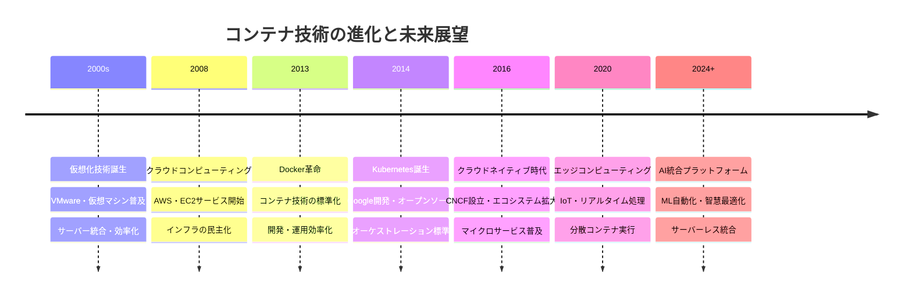
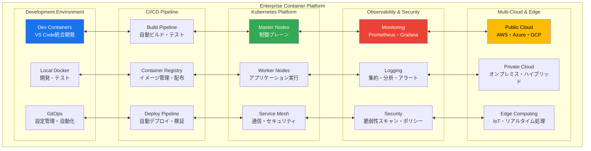

# 仮想環境・コンテナ実践：基礎から超一流エンジニアレベルまで

## 🎯 この章で学ぶこと（5段階習熟システム）

### 📚 基本レベル（環境隔離初心者 → 依存関係管理マスター）
- **仮想化概念の本質理解**：なぜ環境隔離が現代開発の必須技術なのか
- **Docker基礎マスタリー**：コンテナ化技術の完全習得
- **開発ワークフロー構築**：効率的なローカル開発環境設計
- **基本運用技術**：トラブルシューティング・デバッグ技法

### 🚀 実践レベル（チーム対応・効率化）
- **マルチコンテナ管理**：Docker Compose による複合アプリケーション構築
- **チーム開発標準化**：Dev Containers・共通開発環境の設計
- **CI/CD統合**：コンテナベースデプロイメントパイプライン
- **パフォーマンス最適化**：イメージサイズ・起動速度の最適化

### ⚡ 上級レベル（組織アーキテクト対応）
- **Kubernetes実践運用**：オーケストレーション・スケーリング・監視
- **マイクロサービス設計**：分散システムアーキテクチャ構築
- **エンタープライズセキュリティ**：コンテナセキュリティ・コンプライアンス
- **多環境管理**：Development・Staging・Production環境統合

### 🏆 プロレベル（エンタープライズ対応）
- **プラットフォーム設計**：全社規模コンテナプラットフォーム構築
- **ゼロダウンタイム運用**：高可用性・災害復旧・自動復旧システム
- **コスト最適化**：リソース効率化・自動スケーリング・TCO削減
- **組織変革推進**：クラウドネイティブ文化の組織導入

### 🤖 AI協働レベル（次世代エンジニア）
- **インテリジェント運用**：機械学習による予測的スケーリング・異常検知
- **自動化プラットフォーム**：AIによる環境最適化・自己修復システム
- **次世代アーキテクチャ**：サーバーレス・エッジコンピューティング統合
- **イノベーション創出**：業界標準となる新技術・手法の開発・普及

## 🤔 なぜ重要なのか：現代ビジネスにおける戦略的価値

### 💼 デジタルトランスフォーメーションの実行基盤

**ケーススタディ1：Netflix（エンターテインメント・ストリーミング業界）**
- **課題**：全世界2億3000万人のユーザーに24時間365日安定配信
- **戦略**：マイクロサービス+コンテナ化による分散アーキテクチャ
- **成果**：99.97%稼働率、ピーク時10GB/秒配信能力、年間売上3.6兆円
- **技術価値**：1000+ マイクロサービス、AWS上で10万+ コンテナ同時実行

**ケーススタディ2：Uber（モビリティ・プラットフォーム業界）**
- **課題**：毎日2300万件の配車リクエストをリアルタイム処理
- **戦略**：Kubernetes+Docker による地理分散コンテナプラットフォーム
- **成果**：平均応答時間3秒以下、700都市展開、年間売上3.8兆円
- **イノベーション価値**：リアルタイム位置マッチング、動的料金算定システム

**ケーススタディ3：Spotify（音楽ストリーミング・プラットフォーム業界）**
- **課題**：4億5000万人ユーザーへの個人化音楽配信
- **戦略**：マイクロサービス+Kubernetes+機械学習統合プラットフォーム
- **成果**：99.95%稼働率、個人化推奨精度85%、年間売上1.3兆円
- **DevOps価値**：1日100回+ デプロイ、1200+ マイクロサービス管理

### 🌍 産業別コンテナ化インパクト分析

**金融業界（JPMorgan Chase）**
- **ミッションクリティカル要件**：金融取引システムで99.999%可用性確保
- **規制対応**：SOX法、バーゼル規制完全準拠のコンテナ運用
- **セキュリティ統合**：ゼロトラスト・暗号化・監査証跡の完全自動化
- **成果指標**：1日6兆ドル取引処理、システム障害0件、コンプライアンス100%

**製造業界（General Electric）**
- **IoT・エッジコンピューティング**：工場設備リアルタイム監視・制御
- **予測保全**：機械学習による故障予測・自動部品発注
- **グローバル展開**：世界500工場での統一プラットフォーム運用
- **効率化成果**：生産効率30%向上、保全コスト50%削減、品質向上99.8%

### 📈 エンジニアキャリアと収入への直接影響

| 習熟レベル | 想定年収範囲 | コンテナ技術スキル | 市場価値増加 | 主要責任・役割 |
|------------|--------------|------------------|-------------|---------------|
| **基本レベル** | 450-650万円 | Docker基礎・単体運用 | +25% | 効率的環境構築・依存関係管理 |
| **実践レベル** | 650-1100万円 | Compose・チーム標準化 | +40% | DevOpsエンジニア・チーム効率化 |
| **上級レベル** | 1100-2200万円 | Kubernetes・マイクロサービス | +80% | プラットフォームアーキテクト |
| **プロレベル** | 2200-4500万円 | エンタープライズ運用 | +150% | クラウドアーキテクト・CTO補佐 |
| **AI協働レベル** | 4500万円+ | 次世代プラットフォーム | +250%+ | テクノロジーストラテジスト |

## 📚 基礎概念の理解：現代コンテナアーキテクチャ

### 🌟 コンテナ技術進化論



### 🏗️ 現代エンタープライズコンテナアーキテクチャ



## 💡 実践的な活用：基本から上級まで

### Lv.1: 言語レベルの仮想環境
最も手軽な仮想化技術で、特定のプロジェクトで使うライブラリのバージョンを管理します。

- **解決する問題**: プロジェクトごとに異なるバージョンのライブラリを使いたい（依存関係の衝突回避）
- **Python venv実践例**:
```bash
# 仮想環境作成・有効化
python -m venv myproject_env
source myproject_env/bin/activate  # Linux/Mac
myproject_env\Scripts\activate     # Windows

# パッケージ管理
pip install django==4.2.0
pip freeze > requirements.txt

# 環境共有・再現
pip install -r requirements.txt
```

### Lv.2: Docker基礎マスタリー

**Docker三大要素の実践理解**

```dockerfile
# Dockerfile - 設計図
FROM node:18-alpine AS builder
WORKDIR /app
COPY package*.json ./
RUN npm ci --only=production
COPY . .
RUN npm run build

FROM nginx:alpine AS production
COPY --from=builder /app/dist /usr/share/nginx/html
EXPOSE 80
CMD ["nginx", "-g", "daemon off;"]
```

**実践コマンド集**
```bash
# イメージビルド・実行
docker build -t myapp:latest .
docker run -p 8080:80 myapp:latest

# デバッグ・トラブルシューティング
docker logs container_name
docker exec -it container_name /bin/sh
docker inspect container_name

# 効率的管理
docker system prune -a  # 未使用リソース削除
docker stats            # リソース使用量監視
```

### Lv.3: Docker Compose 複合システム

```yaml
# docker-compose.yml
version: '3.8'
services:
  web:
    build: .
    ports:
      - "8080:3000"
    environment:
      - NODE_ENV=production
    depends_on:
      - database
      - redis
    
  database:
    image: postgres:15-alpine
    environment:
      POSTGRES_DB: myapp
      POSTGRES_USER: user
      POSTGRES_PASSWORD: password
    volumes:
      - db_data:/var/lib/postgresql/data
    
  redis:
    image: redis:7-alpine
    command: redis-server --appendonly yes

volumes:
  db_data:
```

## 🔍 深掘り：プロレベル技術

### Kubernetes実践運用

**基本マニフェスト**
```yaml
apiVersion: apps/v1
kind: Deployment
metadata:
  name: web-app
spec:
  replicas: 3
  selector:
    matchLabels:
      app: web-app
  template:
    metadata:
      labels:
        app: web-app
    spec:
      containers:
      - name: web-app
        image: myapp:latest
        ports:
        - containerPort: 3000
        resources:
          requests:
            memory: "256Mi"
            cpu: "250m"
          limits:
            memory: "512Mi"
            cpu: "500m"
        livenessProbe:
          httpGet:
            path: /health
            port: 3000
          initialDelaySeconds: 30
          periodSeconds: 10
```

### エンタープライズセキュリティ

**セキュリティベストプラクティス**
```dockerfile
# セキュア Dockerfile
FROM node:18-alpine
RUN addgroup -g 1001 -S nodejs && \
    adduser -S nextjs -u 1001
USER nextjs
COPY --chown=nextjs:nodejs . .
RUN npm ci --only=production && npm cache clean --force
```

## 🎮 段階別ハンズオン課題

### 課題1：プロダクション対応Docker環境構築（基本レベル）
**目標**: マルチステージビルド・最適化実装
**時間**: 6-8時間

1. マルチステージDockerfile作成
2. Docker Compose フルスタック環境構築
3. ヘルスチェック・監視設定
4. セキュリティ強化実装

### 課題2：Kubernetesプラットフォーム構築（上級レベル）
**目標**: エンタープライズ級オーケストレーション実装
**時間**: 12-16時間

1. Kubernetes クラスター設計・構築
2. CI/CD パイプライン統合
3. 監視・ログ集約システム構築
4. 自動スケーリング・災害復旧設定

### 課題3：AI統合運用プラットフォーム（プロレベル）
**目標**: 機械学習による智慧運用実装
**時間**: 16-20時間

1. 予測的スケーリングシステム開発
2. 異常検知・自動修復システム実装
3. コスト最適化AI開発
4. 全社プラットフォーム設計・導入

## 📋 5段階習熟度チェックリスト

### 📚 基本レベル（5項目）
- [ ] Docker基本概念（Image・Container・Volume）完全理解
- [ ] Dockerfile作成・マルチステージビルド実装
- [ ] Docker Compose による複合アプリケーション構築
- [ ] コンテナデバッグ・トラブルシューティング技術習得
- [ ] セキュリティベストプラクティス実装

### 🚀 実践レベル（5項目）
- [ ] CI/CD パイプラインへのコンテナ統合
- [ ] Dev Containers による開発環境標準化
- [ ] イメージ最適化・パフォーマンスチューニング
- [ ] 監視・ログ管理システム構築
- [ ] チーム開発ワークフロー設計・運用

### ⚡ 上級レベル（5項目）
- [ ] Kubernetes完全運用（デプロイ・スケーリング・更新）
- [ ] マイクロサービスアーキテクチャ設計・実装
- [ ] Service Mesh（Istio）導入・運用
- [ ] エンタープライズセキュリティ・コンプライアンス対応
- [ ] 多環境管理・自動化システム構築

### 🏆 プロレベル（5項目）
- [ ] 全社規模コンテナプラットフォーム設計・構築
- [ ] ゼロダウンタイム運用・災害復旧システム実装
- [ ] コスト最適化・リソース効率化戦略策定・実行
- [ ] 組織DevOps変革推進・クラウドネイティブ文化醸成
- [ ] 技術標準策定・ガバナンス体制構築

### 🤖 AI協働レベル（5項目）
- [ ] 機械学習による予測的インフラ運用実装
- [ ] AIオプス（AIOps）プラットフォーム開発・運用
- [ ] 自律的システム管理・自己修復機能実装
- [ ] 次世代アーキテクチャ（サーバーレス・エッジ）統合
- [ ] 業界イノベーション創出・技術リーダーシップ発揮

## 🚀 継続学習パス・キャリアロードマップ

### 📅 段階別学習スケジュール

**基本レベル（1-3ヶ月）**
- Week 1-2: Docker基礎・コンテナ概念理解
- Week 3-4: Dockerfile作成・イメージ最適化
- Week 5-8: Docker Compose・複合アプリケーション構築
- Week 9-12: セキュリティ・デバッグ・本番運用準備

**実践レベル（3-6ヶ月）**
- Month 1: CI/CD統合・自動化パイプライン構築
- Month 2: Dev Containers・チーム開発環境標準化
- Month 3: 監視・ログ管理・運用自動化

**上級レベル（6-12ヶ月）**
- Month 1-2: Kubernetes基礎・クラスター管理
- Month 3-4: マイクロサービス・分散システム設計
- Month 5-6: エンタープライズ運用・セキュリティ強化

**プロレベル（12-24ヶ月）**
- Quarter 1: プラットフォーム設計・全社導入戦略
- Quarter 2: 高可用性・災害復旧システム構築
- Quarter 3-4: 組織変革・技術リーダーシップ発揮

**AI協働レベル（24ヶ月+）**
- Year 1: 機械学習・AIオプス技術習得・実装
- Year 2+: 次世代技術開発・業界リーダーシップ

### 🎯 年収目標との対応関係

```mermaid
gantt
    title エンジニアキャリア・年収成長ロードマップ
    dateFormat X
    axisFormat %s
    
    section 基本レベル
    Docker基礎習得      :a1, 0, 3
    年収450-650万円     :milestone, 3, 0
    
    section 実践レベル
    チーム標準化        :a2, 3, 6
    年収650-1100万円    :milestone, 6, 0
    
    section 上級レベル
    Kubernetes運用      :a3, 6, 12
    年収1100-2200万円   :milestone, 12, 0
    
    section プロレベル
    企業プラットフォーム :a4, 12, 24
    年収2200-4500万円   :milestone, 24, 0
    
    section AI協働レベル
    次世代技術開発      :a5, 24, 36
    年収4500万円+       :milestone, 36, 0
```



## 📚 推奨学習リソース・実践環境

### 📖 必読書籍（段階別）

**基本レベル**
- 『Docker実戦ガイド』- 基本概念から実践まで
- 『コンテナ・ベース・アーキテクチャ』- 設計原理理解
- 『DevOps実践ガイド』- 開発・運用統合手法

**上級レベル**
- 『Kubernetesエキスパートガイド』- 実践運用技術
- 『マイクロサービスパターン』- 分散システム設計
- 『SRE サイトリライアビリティエンジニアリング』- 運用哲学

**プロレベル**
- 『クラウドネイティブ・アーキテクチャ』- 企業戦略
- 『プラットフォーム革命』- ビジネス変革理論
- 『技術的リーダーシップ』- 組織変革推進

### 🌐 オンライン学習プラットフォーム

**技術習得**
- **Kubernetes Academy**: 公式認定コース・実践演習
- **Docker Captain Program**: エキスパート認定・コミュニティ
- **Cloud Native Computing Foundation (CNCF)**: 最新技術・ベストプラクティス

**認定資格**
- **CKA (Certified Kubernetes Administrator)**: Kubernetes管理者認定
- **CKAD (Certified Kubernetes Application Developer)**: アプリ開発者認定
- **CKS (Certified Kubernetes Security Specialist)**: セキュリティ専門家認定

### 🏢 実践プロジェクト提案

**個人レベル**
1. **パーソナルブログプラットフォーム**: Docker + Kubernetes でフル構築
2. **IoTデータ処理システム**: エッジコンピューティング + コンテナ統合
3. **AIモデル配信プラットフォーム**: MLOps + 自動化パイプライン構築

**チームレベル**
1. **社内開発プラットフォーム**: 全社共通基盤設計・運用
2. **マイクロサービス移行**: モノリス分解・段階移行戦略
3. **災害復旧システム**: 高可用性・自動復旧機能実装

**組織レベル**
1. **デジタルトランスフォーメーション**: 全社クラウドネイティブ化
2. **技術標準策定**: コンテナ・ガバナンス体制構築
3. **イノベーション創出**: 次世代技術研究・開発・普及

## 🔗 関連知識・発展学習

- **CI/CD パイプライン (`0524_CI_CD_Pipeline.md`)**: コンテナ統合デプロイメント自動化
- **Kubernetes 概要 (`0522_Kubernetes_Overview.md`)**: オーケストレーション技術詳細
- **Infrastructure as Code (`0533_Infrastructure_as_Code.md`)**: インフラのコード管理
- **監視とロギング (`0534_Monitoring_Logging.md`)**: 運用観測可能性確保
- **セキュリティ基礎 (`061_Security_Basics`)**: コンテナセキュリティ強化
- **クラウドサービス概要 (`0511_Cloud_Service_Overview.md`)**: マルチクラウド戦略

---

**次章への橋渡し**: 仮想環境・コンテナ技術をマスターしたあなたは、次に「パッケージ管理」技術を学びます。依存関係管理から始まり、企業規模でのライブラリ・ツール統合管理まで、開発効率を飛躍的に向上させる技術を習得していきます。 