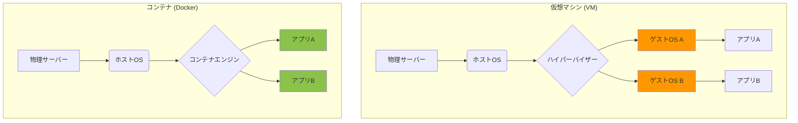

# 第2章 仮想環境とコンテナ： "僕のPCでは動いたのに"を撲滅する技術

## 🎯 この章で学ぶこと
- なぜ開発環境をPC本体（ホストOS）から隔離する必要があるのか、その動機を説明できる。
- Pythonの`venv`を例に、言語レベルの仮想環境が解決する「依存関係の問題」を理解する。
- 仮想マシン（VM）とコンテナ（Docker）のアーキテクチャの違いと、それぞれのメリット・デメリットを説明できる。
- Dockerの基本的な3要素「Dockerfile」「Docker Image」「Docker Container」の役割と関係性を説明できる。
- `docker build`, `docker run`といった基本的なDockerコマンドを使い、アプリケーションをコンテナとして実行できるようになる。

## 🤔 なぜ重要なのか
あなたはPythonで2つのプロジェクトに関わっています。プロジェクトAは、古いライブラリ「Library-v1.0」に依存しています。一方、プロジェクトBでは、最新の「Library-v2.0」が必要です。あなた自身のPCにインストールできるライブラリはどちらか一つだけ。プロジェクトを切り替えるたびに、ライブラリをアンインストールし、別のバージョンをインストールし直しますか？これは悪夢です。

さらに深刻なのは、あなたが開発したアプリケーションを同僚に渡したときです。「僕のPCでは動いたのに、君のPCではエラーが出る」。この呪いの言葉は、OSの違い、ライブラリのバージョンの違い、環境変数の設定漏れなど、環境の差異によって引き起こされます。

**仮想環境**と**コンテナ**は、こうした「環境」に起因するあらゆる問題を解決するための技術です。アプリケーションが動くために必要なもの（コード、ライブラリ、設定など）をすべてパッケージ化し、PC本体から隔離された「箱」の中で動かすことで、**どこでも、誰でも、いつでも同じように動く**ことを保証します。AIが生成した複雑な依存関係を持つコードも、コンテナに入れて渡せば、受け取った人はコマンド一つで即座に実行できます。この再現性とポータビリティ（可搬性）は、現代のソフトウェア開発に不可欠な基盤技術です。

## 📚 基礎概念の理解

### Lv.1: 言語レベルの仮想環境 (例: Pythonの`venv`)
最も手軽な仮想化技術で、特定のプロジェクトで使うライブラリのバージョンを管理するために使われます。

-   **解決する問題**: プロジェクトごとに異なるバージョンのライブラリを使いたい（依存関係の衝突回避）。
-   **仕組み**:
    -   プロジェクト専用のディレクトリを作成し、その中にPythonの実行環境やライブラリをインストールする。
    -   PC本体（グローバル）のPython環境は汚染されず、プロジェクトごとに独立したライブラリを持つことができる。
-   **例え**: プロジェクトA用の「道具箱A」とプロジェクトB用の「道具箱B」を用意し、それぞれに必要な工具（ライブラリ）だけを入れておくイメージ。

これは依存関係の問題は解決しますが、OSやミドルウェア（例：データベース）の違いまでは吸収できません。

### Lv.2: 仮想マシン (Virtual Machine, VM)
PCの中に、もう一台「まるごとPCを再現」する技術です。

-   **解決する問題**: OSレベルでの環境の違いを吸収したい。（例：Windows PC上でLinux環境を動かす）
-   **仕組み**:
    -   **ハイパーバイザー**というソフトウェアが、CPUやメモリなどの物理リソースを仮想化し、その上に「ゲストOS」を丸ごとインストールして動かす。
-   **特徴**:
    -   **高い分離性**: ホストOSとは完全に分離されており、セキュリティが高い。
    -   **重量級**: ゲストOSを丸ごと動かすため、起動が遅く、多くのディスク容量とメモリを消費する。
-   **代表例**: VirtualBox, VMware
-   **例え**: 自宅（ホストOS）の中に、完全に独立した生活空間（ゲストOS）を持つプレハブ小屋を建てるイメージ。

### Lv.3: コンテナ (Container / Docker)
仮想マシンの「重い」という問題を解決し、近年の開発の主流となった技術です。

-   **解決する問題**: アプリケーションとその依存関係をひとまとめにし、軽量かつ高速に、どこでも同じように動かしたい。
-   **仕組み**:
    -   OS（カーネル）はホストOSと共有する。その上で、アプリケーションの実行に必要なライブラリや設定ファイルだけを隔離された空間（コンテナ）にパッケージングする。
-   **特徴**:
    -   **軽量・高速**: ゲストOSを持たないため、起動が非常に速く、リソース消費も少ない。
    -   **高いポータビリティ**: 一度コンテナ化すれば、Dockerが動く環境ならどこでも同じように動作する。
-   **代表例**: **Docker**
-   **例え**: 自宅（ホストOS）のキッチン（カーネル）は共有しつつ、料理（アプリケーション）ごとに専用の調理器具セット（コンテナ）を使い分けるイメージ。



## 💡 実践的な活用

### Dockerの基本3要素
Dockerを理解するには、以下の3つの要素の関係性を知ることが重要です。

1.  **Dockerfile**:
    -   **役割**: コンテナの「設計図」または「レシピ」。
    -   **内容**: どのOSイメージを土台にし、どのファイルをコピーし、どのコマンドを実行してアプリケーションを起動するのか、といった手順が書かれたテキストファイル。

2.  **Docker Image (イメージ)**:
    -   **役割**: Dockerfileの設計図を元に作成された、アプリケーションとその実行環境をひとまとめにした「パッケージ」。読み取り専用。
    -   **例え**: ソフトウェアのインストールCDや、仮想マシンのテンプレート。

3.  **Docker Container (コンテナ)**:
    -   **役割**: Dockerイメージを実行して生成される「実体」。実際にアプリケーションが動作するプロセス。
    -   **例え**: インストールCD（イメージ）から、PCにインストールされて動作しているソフトウェア（コンテナ）。一つのイメージから、複数のコンテナを起動できる。

この関係は **Dockerfile → (build) → Image → (run) → Container** となります。

### ハンズオン：シンプルなWebアプリをDockerで動かす
ここでは、簡単なNode.jsのWebアプリケーションをコンテナ化する手順を体験します。

**準備**:
1.  PCにDockerをインストールしておく。
2.  以下の2つのファイルを作成する。

**`app.js` (アプリケーション本体)**
```javascript
const http = require('http');
const port = 3000;

const server = http.createServer((req, res) => {
  res.statusCode = 200;
  res.setHeader('Content-Type', 'text/plain');
  res.end('Hello, from Docker Container!\n');
});

server.listen(port, () => {
  console.log(`Server running at http://localhost:${port}/`);
});
```

**`Dockerfile` (設計図)**
```dockerfile
# 1. ベースとなるイメージを指定
FROM node:18-alpine

# 2. 作業ディレクトリを設定
WORKDIR /app

# 3. アプリケーションのファイルをコピー
COPY app.js .

# 4. コンテナが起動したときに実行するコマンド
CMD ["node", "app.js"]
```

**手順**:
```bash
# 1. Dockerfileを元に、'hello-docker'という名前のイメージをビルドする
# `.` はDockerfileがカレントディレクトリにあることを示す
docker build -t hello-docker .

# 2. ビルドしたイメージからコンテナを起動する
# -p 8080:3000 は、ホストPCの8080番ポートをコンテナの3000番ポートに繋ぐ設定
docker run -p 8080:3000 hello-docker
```
これで、ブラウザで `http://localhost:8080` にアクセスすると、「Hello, from Docker Container!」と表示されるはずです。あなたのPCにNode.jsがインストールされていなくても、Dockerさえあればこのアプリを動かすことができます。

## 🔍 深掘り：プロの視点

### Docker Compose：複数コンテナのオーケストレーション
実際のWebアプリケーションは、Webサーバー、APサーバー、データベースなど、複数のコンテナが連携して動作することがほとんどです。`docker run`コマンドをコンテナの数だけ実行するのは大変です。

**Docker Compose**は、複数のコンテナで構成されるアプリケーションを、単一のYAMLファイル (`docker-compose.yml`) で定義し、コマンド一つでまとめて起動・停止できるようにするツールです。

-   **`docker-compose.yml` の例**:
    ```yaml
    version: '3.8'
    services:
      web:
        build: .
        ports:
          - "8080:3000"
      db:
        image: postgres:14
        environment:
          POSTGRES_PASSWORD: mysecretpassword
    ```
    この設定ファイルは、「Dockerfileからビルドした`web`サービス」と、「PostgreSQLの公式イメージを使った`db`サービス」を定義しています。`docker-compose up`というコマンド一発で、この2つのコンテナが起動し、互いに通信できる状態になります。

### Dev Containers (開発コンテナ)
VS Codeの**Dev Containers**拡張機能は、Dockerを開発環境そのものとして利用する、より進んだアプローチです。

-   **概念**: プロジェクト内に`.devcontainer`ディレクトリを用意し、その中にDockerfileや設定ファイルを記述しておく。
-   **仕組み**: VS Codeがそれを認識し、自動でDockerコンテナをビルド・起動し、そのコンテナの中にVS Codeのサーバー機能をインストールして直接接続する。
-   **利点**:
    -   `git clone`してVS Codeで開くだけで、誰でも数分で完全にセットアップされた開発環境が手に入る。
    -   必要なVS Code拡張機能などもコンテナ内に定義できるため、リンターやデバッガの設定もチームで完全に統一できる。

「僕のPCでは動いたのに」問題の、現時点での究極的な解決策の一つと言えます。

## 📋 まとめとチェックポイント
- 仮想環境やコンテナは、開発環境をPC本体から隔離し、再現性とポータビリティを確保する技術である。
- 言語レベルの仮想環境はライブラリの依存関係を、仮想マシンはOSを、コンテナはアプリ実行環境を隔離する。
- Dockerは、`Dockerfile`（設計図）から`Image`（パッケージ）をビルドし、`Image`から`Container`（実体）を実行する。
- Dockerの登場により、アプリケーションを軽量・高速に、どこでも同じように動かすことが容易になった。
- Docker ComposeやDev Containersといったツールは、より実践的で複雑な開発環境の管理を簡素化してくれる。

**セルフチェック**
- [ ] あなたのPCにRubyをインストールしたくないが、Rubyで書かれたプロジェクトを試してみたい場合、どのような技術を使いますか？
- [ ] Dockerfile、Dockerイメージ、Dockerコンテナの関係を、家の建築に例えて説明できますか？
- [ ] `docker build` と `docker run` のコマンドは、それぞれ何を入力とし、何を出力（生成）しますか？
- [ ] 「私の環境では動かない」という問題をチームメンバーから報告された場合、この問題を恒久的に解決するためにどのような技術の導入を提案しますか？

## 🔗 関連知識・発展学習
- **パッケージ管理 (`0223_Package_Management.md`)**: コンテナを使わない場合、各言語のパッケージマネージャを使って依存関係を管理する必要があります。
- **コンテナオーケストレーション (`052_Container_Orchestration`)**: 多数のコンテナを本番環境で安定して動かすためには、Kubernetesのような、より高度な管理ツールが必要になります。
- **インフラストラクチャ as コード (`0533_Infrastructure_as_Code.md`)**: Dockerfileやdocker-compose.ymlは、インフラ（開発環境）の構成をコードで管理するというIaCの思想に基づいています。 