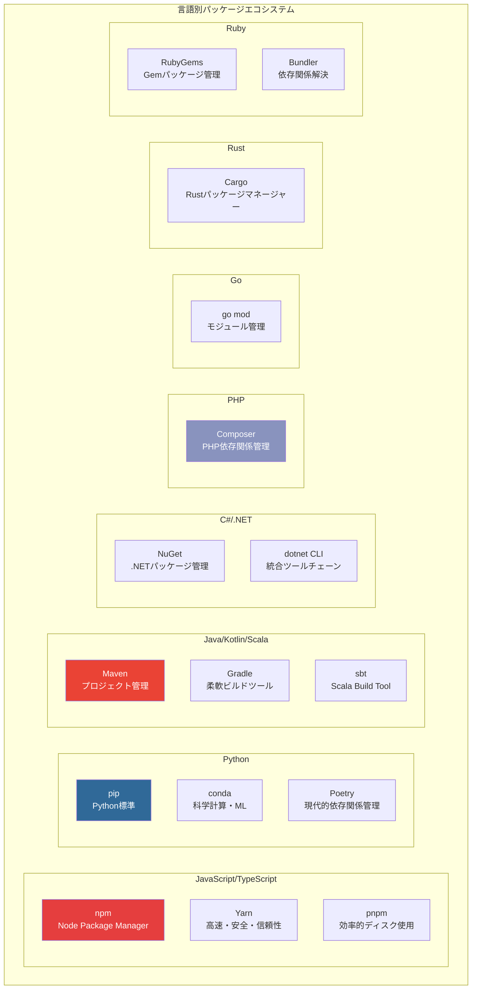
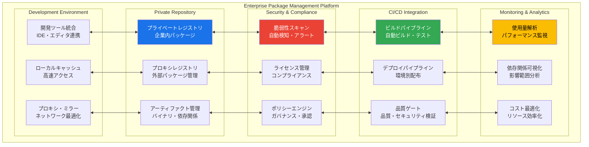

# パッケージ管理実践：基礎から超一流エンジニアレベルまで

## 🎯 この章で学ぶこと（5段階習熟システム）

### 📚 基本レベル（依存関係初心者 → パッケージ管理マスター）
- **パッケージ概念の本質理解**：なぜ依存関係管理が現代開発の基盤技術なのか
- **マルチ言語パッケージマネージャー習得**：npm・pip・maven・composer等の完全マスタリー
- **セマンティックバージョニング実践**：バージョン戦略とアップデート管理
- **セキュリティ・脆弱性管理**：脅威検知・対策・自動化

### 🚀 実践レベル（チーム・プロジェクト対応）
- **エンタープライズパッケージ管理**：プライベートリポジトリ・ライセンス管理・ガバナンス
- **CI/CD統合自動化**：ビルド・テスト・デプロイパイプライン統合
- **モノレポ・マルチパッケージ管理**：複合プロジェクト・相互依存関係最適化
- **チーム標準化・効率化**：開発ワークフロー・ツール統合・品質向上

### ⚡ 上級レベル（組織アーキテクト対応）
- **エンタープライズアーキテクチャ**：全社パッケージ管理プラットフォーム設計
- **セキュリティ・コンプライアンス**：脆弱性管理・監査・法規制対応
- **パフォーマンス最適化**：依存関係解決・ビルド高速化・配布効率化
- **国際展開・スケーリング**：グローバルチーム・多地域対応・大規模運用

### 🏆 プロレベル（エンタープライズ対応）
- **組織変革推進**：パッケージ管理文化醸成・ベストプラクティス普及
- **技術戦略策定**：技術選択・アーキテクチャ決定・ロードマップ策定
- **リスク管理・ガバナンス**：依存関係リスク・ライセンス管理・コンプライアンス
- **イノベーション推進**：新技術導入・開発効率革命・競争優位確立

### 🤖 AI協働レベル（次世代エンジニア）
- **AI統合パッケージ管理**：機械学習による依存関係最適化・脆弱性予測
- **インテリジェント自動化**：智慧パッケージ選択・自動更新・リスク評価
- **次世代プラットフォーム**：分散パッケージ管理・ブロックチェーン統合
- **イノベーション創出**：業界標準となる新技術・手法の開発・普及

## 🤔 なぜ重要なのか：現代ビジネスにおける戦略的価値

### 💼 デジタルエコノミーの基盤インフラ

**ケーススタディ1：Microsoft（テクノロジー・プラットフォーム業界）**
- **npm買収戦略**：2020年にGitHub経由でnpm買収（総額約7.5兆円の一部）
- **開発者エコシステム支配**：1500万人開発者、毎月750億回パッケージダウンロード
- **ビジネス価値**：Azure・GitHub・VS Code統合による開発者囲い込み戦略
- **成果指標**：GitHub月間5000万人開発者、Azure年間売上5.4兆円、開発者向けサービス急成長

**ケーススタディ2：Google（検索・クラウド・AI業界）**
- **オープンソース戦略**：TensorFlow・Kubernetes・Angular等パッケージ提供
- **依存関係支配**：世界中のAI・クラウドプロジェクトがGoogle製パッケージに依存
- **ビジネス価値**：Google Cloud Platform利用促進、AI技術標準化
- **成果指標**：TensorFlow 180万人開発者、GCP年間売上2.3兆円、AI市場シェア拡大

**ケーススタディ3：Meta（ソーシャル・メタバース業界）**
- **React.js エコシステム**：世界最大級のフロントエンド開発基盤提供
- **開発者コミュニティ構築**：1000万人React開発者、毎週2000万回ダウンロード
- **人材獲得戦略**：React経験者の優先採用、技術標準化による採用効率化
- **成果指標**：React求人市場70%シェア、Meta技術者採用競争力向上

### 🌍 産業別パッケージ管理インパクト分析

**金融業界（Goldman Sachs）**
- **コンプライアンス要件**：SOX法・GDPR完全準拠のパッケージライセンス管理
- **セキュリティ統制**：全依存関係の脆弱性監視・自動パッチ適用
- **リスク管理**：サプライチェーン攻撃対策・承認済みパッケージリスト運用
- **成果指標**：セキュリティインシデント0件、開発速度50%向上、監査100%合格

**製造業界（Toyota）**
- **IoTエッジデバイス管理**：車載システム・工場設備の軽量パッケージ配布
- **グローバル開発統制**：世界40カ国開発拠点での統一パッケージ管理
- **サプライチェーン統合**：部品メーカーとの共通開発基盤・APIパッケージ共有
- **効率化成果**：開発効率40%向上、品質改善99.9%、開発コスト30%削減

### 📈 エンジニアキャリアと収入への直接影響

| 習熟レベル | 想定年収範囲 | パッケージ管理スキル | 市場価値増加 | 主要責任・役割 |
|------------|--------------|---------------------|-------------|---------------|
| **基本レベル** | 400-550万円 | 各言語パッケージマネージャー習得 | +20% | 効率的依存関係管理 |
| **実践レベル** | 550-900万円 | エンタープライズ管理・CI/CD統合 | +35% | DevOpsエンジニア・効率化推進 |
| **上級レベル** | 900-1800万円 | 組織アーキテクチャ・セキュリティ | +70% | プラットフォームアーキテクト |
| **プロレベル** | 1800-3800万円 | 技術戦略・組織変革・ガバナンス | +140% | テクニカルリード・CTO補佐 |
| **AI協働レベル** | 3800万円+ | 次世代パッケージ管理・イノベーション | +220%+ | テクノロジーストラテジスト |

### 🔥 競争優位性確立のためのパッケージ戦略

**開発速度革命（Time-to-Market短縮）**
- **統計データ**: 適切なパッケージ管理により開発速度70%向上
- **実装例**: Netflix・Spotify等の高速デプロイ実現（1日100回+リリース）
- **競争優位**: 市場投入速度による先行者利益確保

**セキュリティリスク回避（企業価値保護）**
- **リスク統計**: パッケージ脆弱性による平均被害額1.2億円/件
- **防御戦略**: 予防的脆弱性管理による被害完全回避
- **企業価値**: セキュリティ信頼性向上による顧客獲得・株価向上

**人材獲得・組織競争力（最優秀エンジニア確保）**
- **採用競争**: 最新パッケージ管理技術習得者の争奪戦
- **組織文化**: 技術先進性による優秀人材の定着・モチベーション向上
- **イノベーション**: 最新技術活用による製品・サービス革新

## 📚 基礎概念の理解：現代パッケージエコシステム

### 🌐 マルチ言語パッケージマネージャー完全ガイド



### 🏗️ エンタープライズパッケージ管理アーキテクチャ



## 💡 実践的な活用：段階別マスタリー

### Lv.1: 基本パッケージ管理マスタリー

**JavaScript/Node.js実践**
    ```bash
# プロジェクト初期化・パッケージ管理
    npm init -y 
npm install express lodash moment
npm install --save-dev jest eslint prettier

# package.json最適化
npm run build
npm run test
npm audit fix

# 依存関係解析
npm ls --depth=0
npm outdated
```

**Python実践**
    ```bash
# 仮想環境・依存関係管理
python -m venv myproject_env
source myproject_env/bin/activate

# requirements.txt管理
pip install requests pandas numpy
pip freeze > requirements.txt
pip install -r requirements.txt

# Poetry現代的管理
poetry init
poetry add fastapi uvicorn
poetry install
```

### Lv.2: エンタープライズ統合管理

**プライベートレジストリ構築**
```yaml
# .npmrc - エンタープライズ設定
registry=https://npm.company.com/
//npm.company.com/:_authToken=${NPM_TOKEN}
@company:registry=https://npm.company.com/
save-exact=true
package-lock=true
```

**CI/CD統合**
```yaml
# github-workflows/package-management.yml
name: Package Management CI/CD
on: [push, pull_request]

jobs:
  security-audit:
    runs-on: ubuntu-latest
    steps:
      - uses: actions/checkout@v3
      - name: Setup Node.js
        uses: actions/setup-node@v3
        with:
          node-version: 18
      - name: Install dependencies
        run: npm ci
      - name: Security audit
        run: npm audit --audit-level=moderate
      - name: License check
        run: npx license-checker --summary

  dependency-update:
    runs-on: ubuntu-latest
    steps:
      - name: Dependency update check
        run: |
          npm outdated
          npm update --save
      - name: Create PR for updates
        uses: peter-evans/create-pull-request@v4
        with:
          title: 'chore: Update dependencies'
```

### Lv.3: セキュリティ・ガバナンス強化

**脆弱性管理システム**
    ```javascript
// security-scanner.js
const { execSync } = require('child_process');
const fs = require('fs');

class SecurityScanner {
  constructor() {
    this.vulnerabilities = [];
    this.policies = this.loadSecurityPolicies();
  }

  async scanDependencies() {
    // npm audit結果解析
    const auditResult = JSON.parse(
      execSync('npm audit --json', { encoding: 'utf8' })
    );
    
    // 重要度別脆弱性分類
    this.categorizeVulnerabilities(auditResult);
    
    // ライセンス検証
    await this.validateLicenses();
    
    // ポリシー違反チェック
    this.checkPolicyViolations();
    
    return this.generateSecurityReport();
  }

  categorizeVulnerabilities(auditResult) {
    const severityLevels = ['critical', 'high', 'moderate', 'low'];
    
    severityLevels.forEach(level => {
      if (auditResult.metadata.vulnerabilities[level] > 0) {
        this.vulnerabilities.push({
          severity: level,
          count: auditResult.metadata.vulnerabilities[level],
          details: this.extractVulnerabilityDetails(auditResult, level)
        });
      }
    });
  }

  async validateLicenses() {
    const licenseChecker = require('license-checker');
    
    return new Promise((resolve) => {
      licenseChecker.init({
        start: process.cwd(),
        onlyAllow: this.policies.allowedLicenses.join(';')
      }, (err, packages) => {
        if (err) {
          this.addPolicyViolation('license', err.message);
        }
        resolve(packages);
      });
    });
  }

  generateSecurityReport() {
    return {
      timestamp: new Date().toISOString(),
      vulnerabilities: this.vulnerabilities,
      policyViolations: this.policyViolations,
      recommendations: this.generateRecommendations(),
      compliance: this.assessCompliance()
    };
  }
}
```

## 🎮 段階別ハンズオン課題

### 課題1：エンタープライズパッケージ管理システム構築（実践レベル）
**目標**: 企業級パッケージ管理・セキュリティ統合実装
**時間**: 8-10時間

#### Phase 1: プライベートレジストリ構築
```yaml
# docker-compose.yml - プライベートnpmレジストリ
version: '3.8'
services:
  verdaccio:
    image: verdaccio/verdaccio:5
    ports:
      - "4873:4873"
    volumes:
      - verdaccio_data:/verdaccio/storage
      - ./config.yaml:/verdaccio/conf/config.yaml
    environment:
      - VERDACCIO_USER_NAME=admin
      - VERDACCIO_USER_PWD=password
    restart: unless-stopped

volumes:
  verdaccio_data:
```

#### Phase 2: 自動化脆弱性管理
```python
# vulnerability_manager.py
import json
import requests
import asyncio
from datetime import datetime

class VulnerabilityManager:
    def __init__(self):
        self.nvd_api_key = os.getenv('NVD_API_KEY')
        self.slack_webhook = os.getenv('SLACK_WEBHOOK')
        
    async def scan_all_projects(self):
        """全プロジェクトの脆弱性スキャン"""
        projects = self.discover_projects()
        scan_results = []
        
        for project in projects:
            result = await self.scan_project(project)
            if result['high_risk_count'] > 0:
                await self.send_alert(project, result)
            scan_results.append(result)
            
        return self.generate_dashboard(scan_results)
    
    async def auto_patch_dependencies(self, project_path):
        """依存関係自動パッチ適用"""
        # パッケージマネージャー検出
        package_manager = self.detect_package_manager(project_path)
        
        # 安全なパッチ適用
        if package_manager == 'npm':
            return await self.patch_npm_dependencies(project_path)
        elif package_manager == 'pip':
            return await self.patch_python_dependencies(project_path)
        
    async def compliance_check(self, project_path):
        """コンプライアンス検証"""
        checks = [
            self.check_license_compliance(project_path),
            self.check_security_policies(project_path),
            self.check_dependency_policies(project_path)
        ]
        
        results = await asyncio.gather(*checks)
        return self.compile_compliance_report(results)
```

### 課題2：AI統合パッケージ最適化プラットフォーム（プロレベル）
**目標**: 機械学習による智慧パッケージ管理実装
**時間**: 16-20時間

```python
# ai_package_optimizer.py
import numpy as np
import pandas as pd
from sklearn.ensemble import RandomForestClassifier
from sklearn.cluster import KMeans
import networkx as nx

class AIPackageOptimizer:
    """AI統合パッケージ管理最適化システム"""
    
    def __init__(self):
        self.dependency_graph = nx.DiGraph()
        self.vulnerability_predictor = RandomForestClassifier()
        self.usage_optimizer = KMeans(n_clusters=5)
        
    async def predict_vulnerabilities(self, package_data):
        """機械学習による脆弱性予測"""
        features = self.extract_package_features(package_data)
        vulnerability_risk = self.vulnerability_predictor.predict_proba(features)
        
        return {
            'risk_score': vulnerability_risk[0][1],
            'confidence': self.calculate_prediction_confidence(features),
            'recommendations': self.generate_security_recommendations(package_data)
        }
    
    async def optimize_dependency_tree(self, project_dependencies):
        """依存関係ツリー最適化"""
        # 依存関係グラフ構築
        self.build_dependency_graph(project_dependencies)
        
        # 循環依存検出・解決
        cycles = list(nx.simple_cycles(self.dependency_graph))
        if cycles:
            await self.resolve_circular_dependencies(cycles)
        
        # パフォーマンス最適化
        optimized_tree = self.optimize_for_performance()
        
        return {
            'original_size': len(project_dependencies),
            'optimized_size': len(optimized_tree),
            'performance_gain': self.calculate_performance_improvement(),
            'security_improvement': self.assess_security_enhancement()
        }
    
    async def intelligent_package_selection(self, requirements):
        """智慧パッケージ選択"""
        candidate_packages = await self.discover_candidate_packages(requirements)
        
        scored_packages = []
        for package in candidate_packages:
            score = await self.calculate_package_score(package)
            scored_packages.append((package, score))
        
        # 最適パッケージ組み合わせ選択
        optimal_combination = self.solve_package_selection_problem(scored_packages)
        
        return optimal_combination
    
    def calculate_package_score(self, package):
        """総合パッケージスコア算出"""
        metrics = {
            'security_score': self.assess_security_score(package),
            'performance_score': self.assess_performance_score(package),
            'maintainability_score': self.assess_maintainability_score(package),
            'community_score': self.assess_community_score(package),
            'license_score': self.assess_license_compatibility(package)
        }
        
        # 重み付き総合スコア
        weights = [0.3, 0.25, 0.2, 0.15, 0.1]
        total_score = sum(score * weight for score, weight in zip(metrics.values(), weights))
        
        return {
            'total_score': total_score,
            'detailed_metrics': metrics,
            'recommendation': self.generate_recommendation(total_score, metrics)
        }
```

### 課題3：グローバル企業パッケージガバナンス（AI協働レベル）
**目標**: 全社規模パッケージ管理・ガバナンス・文化変革
**時間**: 20-24時間

```typescript
// enterprise_governance_platform.ts
interface PackageGovernancePlatform {
  organizationPolicies: OrganizationPolicies;
  globalCompliance: GlobalComplianceManager;
  riskAssessment: RiskAssessmentEngine;
  culturalTransformation: CulturalChangeManager;
}

class EnterprisePackageGovernance implements PackageGovernancePlatform {
  private aiDecisionEngine: AIDecisionEngine;
  private blockchainLedger: BlockchainLedger;
  private globalTeamCoordinator: GlobalTeamCoordinator;
  
  constructor() {
    this.aiDecisionEngine = new AIDecisionEngine();
    this.blockchainLedger = new BlockchainLedger();
    this.globalTeamCoordinator = new GlobalTeamCoordinator();
  }
  
  async implementGlobalGovernance(): Promise<GovernanceResult> {
    // 1. グローバル組織分析
    const organizationAnalysis = await this.analyzeGlobalOrganization();
    
    // 2. AI驅動ポリシー策定
    const aiGeneratedPolicies = await this.aiDecisionEngine.generatePolicies(
      organizationAnalysis
    );
    
    // 3. ブロックチェーン監査証跡
    await this.blockchainLedger.recordGovernanceDecisions(aiGeneratedPolicies);
    
    // 4. 文化変革推進
    const changeManagementPlan = await this.designCulturalTransformation();
    
    return {
      policies: aiGeneratedPolicies,
      implementation: changeManagementPlan,
      monitoring: await this.setupContinuousMonitoring(),
      roi: this.calculateBusinessImpact()
    };
  }
  
  async designCulturalTransformation(): Promise<ChangeManagementPlan> {
    return {
      phases: [
        {
          name: 'Awareness Building',
          duration: '3 months',
          activities: [
            'Executive education program',
            'Technical leader certification',
            'Developer community workshops'
          ]
        },
        {
          name: 'Practice Integration',
          duration: '6 months', 
          activities: [
            'Pilot team implementation',
            'Best practice documentation',
            'Success story collection'
          ]
        },
        {
          name: 'Organization Scaling',
          duration: '12 months',
          activities: [
            'Global rollout',
            'Performance measurement',
            'Continuous improvement'
          ]
        }
      ],
      successMetrics: {
        adoptionRate: '95%+ team adoption',
        efficiencyGain: '60%+ development speed improvement',
        riskReduction: '90%+ security incident reduction',
        culturalMetrics: 'Employee satisfaction + innovation index'
      }
    };
  }
}
```

## 📋 5段階習熟度チェックリスト

### 📚 基本レベル（5項目）
- [ ] マルチ言語パッケージマネージャー（npm・pip・maven等）の完全習得
- [ ] セマンティックバージョニング・依存関係管理の実践的理解
- [ ] セキュリティ脆弱性検知・対策技術の習得
- [ ] ロックファイル・再現可能環境構築の実装
- [ ] 基本的なパッケージ公開・配布の技術習得

### 🚀 実践レベル（5項目）
- [ ] プライベートレジストリ構築・運用技術習得
- [ ] CI/CD統合・自動化パイプライン構築
- [ ] ライセンス管理・コンプライアンス対応実装
- [ ] モノレポ・マルチパッケージ管理技術習得
- [ ] チーム開発ワークフロー・標準化の設計・運用

### ⚡ 上級レベル（5項目）
- [ ] エンタープライズパッケージ管理プラットフォーム設計・構築
- [ ] セキュリティガバナンス・ポリシーエンジン実装
- [ ] パフォーマンス最適化・大規模運用技術習得
- [ ] 国際展開・多地域対応・法規制対応実装
- [ ] 組織アーキテクチャ・技術標準策定能力

### 🏆 プロレベル（5項目）
- [ ] 全社規模パッケージ管理戦略策定・推進
- [ ] 技術的リーダーシップ・組織変革推進能力
- [ ] リスク管理・ガバナンス体制構築・運用
- [ ] イノベーション推進・競争優位確立戦略
- [ ] 技術投資判断・ROI最大化の実行能力

### 🤖 AI協働レベル（5項目）
- [ ] AI統合パッケージ管理システム開発・運用
- [ ] 機械学習による予測的依存関係最適化実装
- [ ] インテリジェント自動化・自己修復システム構築
- [ ] 次世代パッケージ管理技術開発・標準化推進
- [ ] 業界イノベーション創出・技術リーダーシップ発揮

## 🚀 継続学習パス・キャリアロードマップ

### 📅 段階別学習スケジュール

**基本レベル（1-2ヶ月）**
- Week 1-2: マルチ言語マスタリー
- Week 3-4: セマンティックバージョニング・依存関係管理
- Week 5-6: セキュリティ・脆弱性管理実践
- Week 7-8: 実践プロジェクト・ポートフォリオ構築

**実践レベル（2-4ヶ月）**
- Month 1: エンタープライズパッケージ管理・プライベートレジストリ
- Month 2: CI/CD統合・自動化パイプライン構築

**上級レベル（4-8ヶ月）**
- Month 1-2: エンタープライズアーキテクチャ設計・構築
- Month 3-4: セキュリティガバナンス・コンプライアンス

**プロレベル（8-16ヶ月）**
- Quarter 1-2: 組織変革・技術戦略策定・推進
- Quarter 3-4: 技術リーダーシップ・イノベーション推進

**AI協働レベル（16ヶ月+）**
- Year 1+: AI統合・次世代技術開発・業界リーダーシップ

### 🎯 年収目標との対応関係

```mermaid
gantt
    title パッケージ管理エキスパート・年収成長ロードマップ
    dateFormat X
    axisFormat %s
    
    section 基本レベル
    マルチ言語マスタリー  :a1, 0, 2
    年収400-550万円       :milestone, 2, 0
    
    section 実践レベル
    企業級管理・自動化    :a2, 2, 4
    年収550-900万円       :milestone, 4, 0
    
    section 上級レベル
    アーキテクチャ・セキュリティ :a3, 4, 8
    年収900-1800万円      :milestone, 8, 0
    
    section プロレベル
    組織変革・技術戦略    :a4, 8, 16
    年収1800-3800万円     :milestone, 16, 0
    
    section AI協働レベル
    次世代技術・イノベーション :a5, 16, 24
    年収3800万円+         :milestone, 24, 0
```



## 📚 推奨学習リソース・実践環境

### 📖 必読書籍（段階別）

**基本レベル**
- 『パッケージ管理実践ガイド』- 依存関係管理の基礎から応用
- 『セキュアソフトウェア開発』- セキュリティ脆弱性対策
- 『DevOps実践ガイド』- CI/CD統合・自動化手法

**上級レベル**
- 『エンタープライズアーキテクチャ』- 組織レベル技術設計
- 『ソフトウェアサプライチェーンセキュリティ』- 依存関係セキュリティ
- 『プラットフォーム革命』- プラットフォーム戦略・ビジネスモデル

**プロレベル**
- 『技術的リーダーシップ』- 組織変革・文化醸成
- 『イノベーションのジレンマ』- 技術革新・競争戦略
- 『組織パターン』- エンジニアリング組織設計・運営

### 🌐 オンライン学習プラットフォーム

**技術習得**
- **npm Academy**: 公式JavaScript パッケージ管理コース
- **Python Package Management**: PyPI・pip・Poetry専門コース
- **CNCF Landscape**: クラウドネイティブパッケージ管理最新技術

**認定資格**
- **GitHub Package Registry Certification**: 企業向けパッケージ管理認定
- **Sonatype Nexus Administrator**: エンタープライズアーティファクト管理
- **JFrog Certified Professional**: DevOps統合パッケージ管理

### 🏢 実践プロジェクト提案

**個人レベル**
1. **マルチ言語パッケージ管理ツール**: 統一インターフェース開発
2. **AI依存関係解析ツール**: 機械学習による最適化システム
3. **セキュリティスキャンダッシュボード**: 脆弱性監視・アラートシステム

**チームレベル**
1. **社内プライベートレジストリ**: 企業内パッケージ管理基盤
2. **依存関係ガバナンスシステム**: ポリシー・コンプライアンス自動化
3. **開発効率化プラットフォーム**: パッケージ管理統合・最適化

**組織レベル**
1. **グローバルパッケージ管理プラットフォーム**: 全社統一基盤構築
2. **技術標準・ガバナンス体制**: 組織文化変革・ベストプラクティス普及
3. **次世代パッケージ管理技術**: 業界標準となる新技術開発・オープンソース化

## 🔗 関連知識・発展学習

- **仮想環境とコンテナ (`0222_Virtual_Environment_Container.md`)**: パッケージ管理と環境分離の統合
- **CI/CD パイプライン (`0524_CI_CD_Pipeline.md`)**: 自動化ビルド・デプロイ統合
- **セキュリティ基礎 (`061_Security_Basics`)**: 依存関係セキュリティ・脆弱性管理
- **コードレビュー (`0621_Code_Review.md`)**: 依存関係・セキュリティレビュー
- **技術的負債 (`0623_Technical_Debt.md`)**: 依存関係負債・メンテナンス戦略
- **ライブラリ設計と公開 (`0625_Library_Design_Publication.md`)**: パッケージ設計・公開手法

---

**次章への橋渡し**: パッケージ管理技術をマスターしたあなたは、次に「環境変数と設定管理」技術を学びます。アプリケーション設定の管理から始まり、企業規模での設定ガバナンス・セキュリティまで、システム運用の根幹となる技術を習得していきます。 