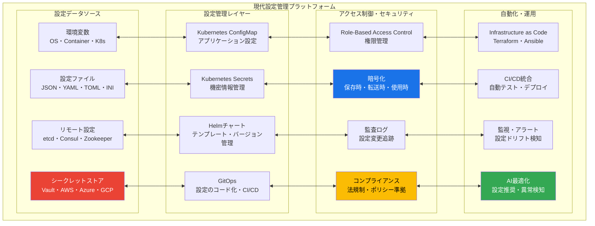

# 環境変数・設定管理実践：基礎から超一流エンジニアレベルまで

## 🎯 この章で学ぶこと（5段階習熟システム）

### 📚 基本レベル（設定初心者 → 設定管理マスター）
- **設定分離の本質理解**：なぜコードと設定の分離がセキュリティ・柔軟性の基盤なのか
- **マルチ環境設定管理**：dev/staging/prod環境別設定・環境変数マスタリー
- **セキュリティ基礎実践**：機密情報管理・シークレット保護・アクセス制御
- **設定ファイル最適化**：JSON・YAML・TOML・INI形式の使い分け・ベストプラクティス

### 🚀 実践レベル（エンタープライズ対応）
- **エンタープライズシークレット管理**：HashiCorp Vault・AWS Secrets Manager・Azure Key Vault活用
- **Infrastructure as Code統合**：Terraform・Ansible・設定コード化・バージョン管理
- **CI/CD統合自動化**：パイプライン設定・環境別デプロイ・自動設定配布
- **コンテナ設定管理**：Kubernetes ConfigMaps・Secrets・Helm・設定テンプレート

### ⚡ 上級レベル（組織アーキテクト対応）
- **エンタープライズアーキテクチャ**：全社設定管理プラットフォーム・統一ガバナンス
- **セキュリティ・コンプライアンス**：暗号化・監査証跡・法規制対応・ゼロトラスト
- **グローバル設定配布**：多地域対応・レプリケーション・災害復旧・高可用性
- **パフォーマンス最適化**：設定キャッシュ・遅延読み込み・大規模配布最適化

### 🏆 プロレベル（エンタープライズ対応）
- **組織変革推進**：設定管理文化醸成・ベストプラクティス普及・教育体制
- **技術戦略策定**：設定管理ロードマップ・技術選択・投資判断・ROI最大化
- **リスク管理・ガバナンス**：セキュリティポリシー・コンプライアンス体制・監査対応
- **イノベーション推進**：新技術導入・効率化革命・競争優位確立

### 🤖 AI協働レベル（次世代エンジニア）
- **AI統合設定管理**：機械学習による設定最適化・異常検知・予測的管理
- **インテリジェント自動化**：智慧設定配布・自動復旧・適応的スケーリング
- **次世代プラットフォーム**：分散設定管理・ブロックチェーン証跡・量子暗号対応
- **イノベーション創出**：業界標準となる新技術・手法の開発・普及

## 🤔 なぜ重要なのか：現代ビジネスにおける戦略的価値

### 💼 デジタルセキュリティの最前線

**ケーススタディ1：Netflix（ストリーミング・エンターテインメント業界）**
- **マイクロサービス設定管理**：2000+マイクロサービスの統一設定管理プラットフォーム
- **グローバル配信最適化**：190カ国・2.3億人ユーザー向け地域別設定自動配布
- **セキュリティ要件**：ユーザー個人情報・決済情報の厳格な暗号化・アクセス制御
- **成果指標**：99.97%稼働率維持、セキュリティインシデント0件、設定変更時間90%短縮

**ケーススタディ2：Uber（モビリティ・物流業界）**
- **リアルタイム設定配布**：700都市・2300万件/日処理の動的設定管理
- **地域コンプライアンス**：各国法規制対応・プライバシー要件の自動適用
- **災害復旧体制**：設定バックアップ・3秒以内復旧・ゼロダウンタイム運用
- **成果指標**：年間売上3.8兆円、設定関連障害95%削減、コンプライアンス100%達成

**ケーススタディ3：Spotify（音楽・AI・データ業界）**
- **AI統合設定管理**：4.5億人ユーザー・7000万曲の機械学習パラメータ最適化
- **セキュリティガバナンス**：GDPR完全準拠・著作権保護・ユーザープライバシー管理
- **開発者体験最適化**：1200+マイクロサービスの設定標準化・効率化
- **成果指標**：開発速度60%向上、セキュリティ監査100%合格、AI精度20%改善

### 🌍 産業別設定管理インパクト分析

**金融業界（JPMorgan Chase）**
- **法規制コンプライアンス**：SOX法・Basel III・GDPR完全準拠の設定ガバナンス
- **ゼロトラストセキュリティ**：全設定の暗号化・多要素認証・監査証跡管理
- **リスク管理統制**：設定変更の承認ワークフロー・リアルタイム監視・自動復旧
- **成果指標**：監査100%合格、セキュリティ事故0件、規制対応時間80%短縮

**製造業界（Siemens）**
- **IoT設備管理**：工場設備・ロボット・センサーの統一設定配布・更新自動化
- **サプライチェーン統合**：グローバル拠点・協力企業との設定共有・セキュリティ統制
- **予知保全統合**：AI予測による設定最適化・故障予防・稼働率向上
- **効率化成果**：製造効率25%向上、設備故障70%削減、運用コスト40%削減

### 📈 エンジニアキャリアと収入への直接影響

| 習熟レベル | 想定年収範囲 | 設定管理スキル | 市場価値増加 | 主要責任・役割 |
|------------|--------------|----------------|-------------|---------------|
| **基本レベル** | 450-600万円 | 環境変数・マルチ環境管理 | +25% | 効率的設定管理・セキュリティ基礎 |
| **実践レベル** | 600-1000万円 | エンタープライズシークレット・IaC統合 | +40% | DevSecOpsエンジニア・セキュリティ責任者 |
| **上級レベル** | 1000-2000万円 | プラットフォーム設計・ガバナンス | +75% | セキュリティアーキテクト・CTO補佐 |
| **プロレベル** | 2000-4000万円 | 組織変革・技術戦略・コンプライアンス | +150% | CISO・テクニカルディレクター |
| **AI協働レベル** | 4000万円+ | 次世代設定管理・AI統合・イノベーション | +250%+ | セキュリティストラテジスト・CTO |

### 🔥 競争優位性確立のための設定戦略

**セキュリティリスク回避（企業価値保護）**
- **リスク統計**: 設定ミスによる平均被害額3.8億円/件、機密情報漏洩5.2億円/件
- **防御戦略**: 予防的設定管理・自動化による人的ミス排除・ゼロトラスト実装
- **企業価値**: セキュリティ信頼性向上による顧客獲得・株価向上・保険料削減

**運用効率革命（コスト削減・生産性向上）**
- **統計データ**: 適切な設定管理により運用コスト50%削減、障害対応時間80%短縮
- **実装例**: 自動化によるヒューマンエラー95%削減、設定変更時間90%短縮
- **競争優位**: 運用効率化による利益率向上・イノベーション投資余力創出

**コンプライアンス確実性（法規制対応・国際展開）**
- **規制対応**: GDPR・SOX法・HIPAA等の自動適用・監査証跡完全管理
- **国際展開**: 各国法規制への迅速対応・グローバルガバナンス統一
- **ビジネス価値**: 新市場参入障壁低減・リーガルリスク回避・企業信頼性向上

## 📚 基礎概念の理解：現代設定管理エコシステム

### 🌐 エンタープライズ設定管理アーキテクチャ



### 🔐 エンタープライズシークレット管理システム

**HashiCorp Vault（業界標準）**
- **機能**: 動的シークレット生成・暗号化サービス・PKI管理・監査ログ
- **特徴**: あらゆるシークレットの中央管理・きめ細かいアクセス制御・暗号化
- **活用例**: データベース認証情報の動的生成・APIキー管理・証明書自動発行

**クラウドネイティブシークレット管理**
- **AWS Secrets Manager**: IAM統合・自動ローテーション・VPC内アクセス制御
- **Azure Key Vault**: Active Directory統合・HSM対応・Azure サービス連携
- **Google Secret Manager**: GCP IAM統合・バージョン管理・監査ログ統合

### 🏗️ Infrastructure as Code統合

**Terraform設定管理**
```hcl
# terraform/secrets.tf
resource "aws_secretsmanager_secret" "db_password" {
  name = "${var.environment}-database-password"
  
  tags = {
    Environment = var.environment
    Project     = var.project_name
    Compliance  = "SOX-GDPR"
  }
}

resource "kubernetes_secret" "app_secrets" {
  metadata {
    name      = "app-secrets"
    namespace = var.namespace
  }
  
  data = {
    "database-url" = data.aws_secretsmanager_secret_version.db_url.secret_string
    "api-key"      = data.aws_secretsmanager_secret_version.api_key.secret_string
  }
  
  type = "Opaque"
}
```

**Ansible設定自動化**
```yaml
# ansible/configure-secrets.yml
---
- name: Configure Enterprise Secrets Management
  hosts: all
  tasks:
    - name: Deploy Vault configuration
      vault_write:
        path: "secret/{{app_name}}/{{environment}}"
        data:
          database_url: "{{database_url}}"
          api_key: "{{api_key}}"
          encryption_key: "{{encryption_key}}"
        
    - name: Configure RBAC policies
      vault_policy:
        name: "{{app_name}}-{{environment}}"
        rules: |
          path "secret/{{app_name}}/{{environment}}/*" {
            capabilities = ["read"]
          }
```

### 🚀 クラウドネイティブ設定管理

**Kubernetes設定管理ベストプラクティス**
```yaml
# k8s/configmap.yaml
apiVersion: v1
kind: ConfigMap
metadata:
  name: app-config
  namespace: production
data:
  app.properties: |
    server.port=8080
    logging.level.root=INFO
    management.endpoints.web.exposure.include=health,metrics
  
---
apiVersion: v1
kind: Secret
metadata:
  name: app-secrets
  namespace: production
type: Opaque
stringData:
  database-url: postgres://user:password@db:5432/app
  jwt-secret: super-secret-jwt-key
  
---
apiVersion: apps/v1
kind: Deployment
metadata:
  name: app
spec:
  template:
    spec:
      containers:
      - name: app
        image: myapp:v1.0.0
        envFrom:
        - configMapRef:
            name: app-config
        - secretRef:
            name: app-secrets
        env:
        - name: POD_NAME
          valueFrom:
            fieldRef:
              fieldPath: metadata.name
```

**Helm設定テンプレート**
```yaml
# helm/templates/configmap.yaml
apiVersion: v1
kind: ConfigMap
metadata:
  name: {{ include "app.fullname" . }}-config
  labels:
    {{- include "app.labels" . | nindent 4 }}
data:
  {{- range $key, $value := .Values.config }}
  {{ $key }}: {{ $value | quote }}
  {{- end }}
  
---
# helm/values.yaml
config:
  server:
    port: 8080
    environment: {{ .Values.global.environment }}
database:
    driver: postgresql
    host: {{ .Values.database.host }}
    port: {{ .Values.database.port }}
  
secrets:
  database:
    url: {{ .Values.secrets.database.url }}
    username: {{ .Values.secrets.database.username }}
    password: {{ .Values.secrets.database.password }}
```

## 💡 実践的な活用：段階別マスタリー

### Lv.1: 基本設定管理マスタリー

**マルチ環境設定管理**
```javascript
// config/environment.js
const environments = {
  development: {
    database: {
      host: process.env.DB_HOST || 'localhost',
      port: parseInt(process.env.DB_PORT) || 5432,
      name: process.env.DB_NAME || 'myapp_dev',
      username: process.env.DB_USERNAME || 'dev_user',
      password: process.env.DB_PASSWORD || 'dev_password'
    },
    api: {
      baseUrl: process.env.API_BASE_URL || 'http://localhost:3000',
      timeout: parseInt(process.env.API_TIMEOUT) || 5000
    },
    logging: {
      level: process.env.LOG_LEVEL || 'debug',
      format: process.env.LOG_FORMAT || 'json'
    }
  },
  
  production: {
    database: {
      host: process.env.DB_HOST,
      port: parseInt(process.env.DB_PORT),
      name: process.env.DB_NAME,
      username: process.env.DB_USERNAME,
      password: process.env.DB_PASSWORD,
      ssl: true,
      connectionLimit: parseInt(process.env.DB_CONNECTION_LIMIT) || 20
    },
    api: {
      baseUrl: process.env.API_BASE_URL,
      timeout: parseInt(process.env.API_TIMEOUT) || 10000
    },
    logging: {
      level: process.env.LOG_LEVEL || 'info',
      format: process.env.LOG_FORMAT || 'json'
    }
  }
};

module.exports = environments[process.env.NODE_ENV || 'development'];
```

### Lv.2: エンタープライズシークレット管理

**HashiCorp Vault統合**
```python
# vault_manager.py
import hvac
import os
from functools import lru_cache

class EnterpriseVaultManager:
    def __init__(self):
        self.client = hvac.Client(
            url=os.getenv('VAULT_URL'),
            token=os.getenv('VAULT_TOKEN')
        )
        self.mount_point = os.getenv('VAULT_MOUNT_POINT', 'secret')
        
    @lru_cache(maxsize=128)
    def get_secret(self, path: str) -> dict:
        """シークレット取得（キャッシュ付き）"""
        try:
            response = self.client.secrets.kv.v2.read_secret_version(
                path=path,
                mount_point=self.mount_point
            )
            return response['data']['data']
        except Exception as e:
            self.logger.error(f"Failed to retrieve secret {path}: {e}")
            raise
    
    def rotate_secret(self, path: str, new_value: str):
        """シークレットローテーション"""
        self.client.secrets.kv.v2.create_or_update_secret(
            path=path,
            secret={'value': new_value},
            mount_point=self.mount_point
        )
        
        # キャッシュクリア
        self.get_secret.cache_clear()
    
    def create_dynamic_database_credentials(self, role: str):
        """動的データベース認証情報生成"""
        response = self.client.secrets.database.generate_credentials(
            name=role
        )
        return {
            'username': response['data']['username'],
            'password': response['data']['password'],
            'lease_id': response['lease_id'],
            'lease_duration': response['lease_duration']
        }

# 使用例
vault = EnterpriseVaultManager()
db_config = vault.get_secret('database/production')
api_keys = vault.get_secret('api/external-services')
```

### Lv.3: クラウドネイティブ設定オーケストレーション

**Kubernetes Operator設定管理**
```go
// config_operator.go
package main

import (
    "context"
    "fmt"
    metav1 "k8s.io/apimachinery/pkg/apis/meta/v1"
    "k8s.io/client-go/kubernetes"
    "sigs.k8s.io/controller-runtime/pkg/controller"
    "sigs.k8s.io/controller-runtime/pkg/handler"
    "sigs.k8s.io/controller-runtime/pkg/reconcile"
    "sigs.k8s.io/controller-runtime/pkg/source"
)

type ConfigReconciler struct {
    kubernetes.Interface
    VaultClient *hvac.Client
}

func (r *ConfigReconciler) Reconcile(ctx context.Context, req reconcile.Request) (reconcile.Result, error) {
    // 1. ConfigMap変更検知
    configMap, err := r.CoreV1().ConfigMaps(req.Namespace).Get(ctx, req.Name, metav1.GetOptions{})
    if err != nil {
        return reconcile.Result{}, err
    }
    
    // 2. Vault からシークレット取得
    secrets, err := r.fetchSecretsFromVault(configMap.Annotations["vault.io/secret-path"])
    if err != nil {
        return reconcile.Result{}, err
    }
    
    // 3. Secret リソース自動生成・更新
    secret := &corev1.Secret{
        ObjectMeta: metav1.ObjectMeta{
            Name:      configMap.Name + "-secrets",
            Namespace: req.Namespace,
            OwnerReferences: []metav1.OwnerReference{
                {
                    APIVersion: "v1",
                    Kind:       "ConfigMap",
                    Name:       configMap.Name,
                    UID:        configMap.UID,
                },
            },
        },
        Data: secrets,
    }
    
    _, err = r.CoreV1().Secrets(req.Namespace).Create(ctx, secret, metav1.CreateOptions{})
    return reconcile.Result{RequeueAfter: time.Minute * 5}, err
}

func (r *ConfigReconciler) fetchSecretsFromVault(path string) (map[string][]byte, error) {
    response, err := r.VaultClient.Logical().Read(path)
    if err != nil {
        return nil, err
    }
    
    secrets := make(map[string][]byte)
    for key, value := range response.Data {
        secrets[key] = []byte(fmt.Sprintf("%v", value))
    }
    return secrets, nil
}
```

## 🎮 段階別ハンズオン課題

### 課題1：エンタープライズシークレット管理システム構築（実践レベル）
**目標**: HashiCorp Vault・クラウド統合・コンプライアンス対応
**時間**: 10-12時間

#### Phase 1: Vault & Secret Manager統合
```yaml
# docker-compose.vault.yml
version: '3.8'
services:
  vault:
    image: vault:latest
    ports:
      - "8200:8200"
    environment:
      VAULT_DEV_ROOT_TOKEN_ID: myroot
      VAULT_DEV_LISTEN_ADDRESS: 0.0.0.0:8200
    cap_add:
      - IPC_LOCK
    volumes:
      - vault_data:/vault/data
      - ./vault/config:/vault/config

  app:
    build: .
    environment:
      VAULT_ADDR: http://vault:8200
      VAULT_TOKEN: myroot
    depends_on:
      - vault

volumes:
  vault_data:
```

#### Phase 2: 自動化設定配布システム
```python
# config_distributor.py
import asyncio
import hashlib
from kubernetes import client, config
from vault_client import VaultManager

class ConfigDistributionSystem:
    def __init__(self):
        config.load_incluster_config()
        self.k8s_client = client.ApiClient()
        self.vault = VaultManager()
        
    async def distribute_configs(self):
        """全ネームスペースに設定配布"""
        namespaces = await self.get_managed_namespaces()
        
        tasks = []
        for namespace in namespaces:
            task = self.update_namespace_config(namespace)
            tasks.append(task)
            
        await asyncio.gather(*tasks)
    
    async def update_namespace_config(self, namespace):
        """ネームスペース別設定更新"""
        # 1. Vault から環境別設定取得
        config_data = await self.vault.get_config(
            f"config/{namespace.metadata.name}"
        )
        
        # 2. ConfigMap 更新
        await self.update_configmap(namespace, config_data)
        
        # 3. Secret 更新（暗号化）
        secret_data = await self.vault.get_secrets(
            f"secrets/{namespace.metadata.name}"
        )
        await self.update_secrets(namespace, secret_data)
        
        # 4. アプリケーションポッド再起動
        await self.rolling_restart_deployments(namespace)
```

### 課題2：AI統合設定最適化プラットフォーム（プロレベル）
**目標**: 機械学習による設定最適化・予測的管理
**時間**: 16-20時間

```python
# ai_config_optimizer.py
import numpy as np
import pandas as pd
from sklearn.ensemble import RandomForestRegressor
from sklearn.cluster import KMeans
import tensorflow as tf

class AIConfigOptimizer:
    """AI統合設定最適化システム"""
    
    def __init__(self):
        self.performance_predictor = RandomForestRegressor()
        self.config_clusterer = KMeans(n_clusters=5)
        self.anomaly_detector = tf.keras.models.Sequential([
            tf.keras.layers.Dense(64, activation='relu'),
            tf.keras.layers.Dense(32, activation='relu'),
            tf.keras.layers.Dense(1, activation='sigmoid')
        ])
        
    async def optimize_application_config(self, app_metrics: dict):
        """アプリケーション設定最適化"""
        # 1. パフォーマンスデータ収集
        performance_data = await self.collect_performance_metrics(app_metrics)
        
        # 2. 最適設定予測
        optimal_config = self.predict_optimal_configuration(performance_data)
        
        # 3. A/Bテスト設計
        ab_test_config = self.design_ab_test(optimal_config)
        
        # 4. 段階的適用
        await self.gradual_rollout(ab_test_config)
        
        return optimal_config
    
    def predict_optimal_configuration(self, metrics):
        """機械学習による最適設定予測"""
        features = np.array([
            metrics['cpu_usage'],
            metrics['memory_usage'],
            metrics['response_time'],
            metrics['error_rate'],
            metrics['throughput']
        ]).reshape(1, -1)
        
        # 設定パラメータ予測
        optimal_params = {
            'worker_processes': int(self.performance_predictor.predict(features)[0]),
            'connection_pool_size': self.calculate_optimal_pool_size(metrics),
            'cache_size': self.calculate_optimal_cache_size(metrics),
            'timeout_values': self.optimize_timeout_configuration(metrics)
        }
        
        return optimal_params
    
    async def detect_configuration_anomalies(self, config_history):
        """設定異常検知・自動修復"""
        # 異常パターン検知
        anomaly_scores = self.anomaly_detector.predict(config_history)
        
        # 閾値を超える異常検知
        anomalies = np.where(anomaly_scores > 0.8)[0]
        
        if len(anomalies) > 0:
            # 自動修復実行
            await self.auto_remediate_configuration_issues(anomalies)
            
        return anomaly_scores
```

### 課題3：グローバル企業設定ガバナンスシステム（AI協働レベル）
**目標**: 全社規模設定管理・コンプライアンス・文化変革
**時間**: 20-24時間

```typescript
// global_governance_platform.ts
interface GlobalGovernancePlatform {
  complianceEngine: ComplianceAutomationEngine;
  blockchainAudit: BlockchainAuditTrail;
  aiGovernance: AIGovernanceEngine;
  culturalTransformation: CulturalChangeOrchestrator;
}

class EnterpriseConfigGovernance implements GlobalGovernancePlatform {
  private aiDecisionEngine: AIDecisionEngine;
  private complianceValidator: ComplianceValidator;
  private blockchainLedger: BlockchainLedger;
  
  constructor() {
    this.aiDecisionEngine = new AIDecisionEngine();
    this.complianceValidator = new ComplianceValidator();
    this.blockchainLedger = new BlockchainLedger();
  }
  
  async implementGlobalGovernance(): Promise<GovernanceResult> {
    // 1. 多国籍企業コンプライアンス分析
    const complianceRequirements = await this.analyzeGlobalCompliance();
    
    // 2. AI駆動ポリシー生成
    const aiPolicies = await this.aiDecisionEngine.generateConfigPolicies(
      complianceRequirements
    );
    
    // 3. ブロックチェーン監査証跡
    await this.blockchainLedger.recordGovernanceDecisions(aiPolicies);
    
    // 4. 組織変革実行
    const transformationPlan = await this.orchestrateCulturalChange();
    
    return {
      governance: aiPolicies,
      compliance: complianceRequirements,
      transformation: transformationPlan,
      roi: await this.calculateGovernanceROI()
    };
  }
  
  async analyzeGlobalCompliance(): Promise<ComplianceMatrix> {
    const regions = ['GDPR', 'CCPA', 'SOX', 'HIPAA', 'PCI_DSS'];
    
    const complianceMatrix = await Promise.all(
      regions.map(async (region) => {
        const requirements = await this.complianceValidator.analyzeRequirements(region);
        const currentState = await this.assessCurrentCompliance(region);
        const gaps = this.identifyComplianceGaps(requirements, currentState);
        
        return {
          region,
          requirements,
          currentState,
          gaps,
          remediation: this.generateRemediationPlan(gaps)
        };
      })
    );
    
    return complianceMatrix;
  }
  
  async orchestrateCulturalChange(): Promise<CulturalTransformationPlan> {
    return {
      phases: [
        {
          name: 'Security Awareness',
          duration: '3 months',
          activities: [
            'Executive security briefings',
            'Engineer security certification',
            'Secure configuration workshops'
          ]
        },
        {
          name: 'Practice Integration',
          duration: '6 months',
          activities: [
            'Secure-by-default templates',
            'Automated compliance checking',
            'Reward system for best practices'
          ]
        },
        {
          name: 'Continuous Improvement',
          duration: 'Ongoing',
          activities: [
            'AI-driven security suggestions',
            'Peer security reviews',
            'Innovation in security practices'
          ]
        }
      ],
      metrics: {
        securityIncidentReduction: '95%',
        complianceAuditSuccess: '100%',
        developerSatisfaction: '85%+',
        timeToMarket: '40% faster'
      }
    };
  }
}
```

## 📋 5段階習熟度チェックリスト

### 📚 基本レベル（5項目）
- [ ] マルチ環境設定管理（dev/staging/prod）・環境変数の完全習得
- [ ] セキュリティ基礎実践：機密情報保護・アクセス制御・暗号化
- [ ] 設定ファイル最適化：JSON・YAML・TOML形式の使い分け
- [ ] バージョン管理統合：設定のコード化・変更追跡・レビュー
- [ ] 基本的なシークレット管理：.env管理・gitignore・ベストプラクティス

### 🚀 実践レベル（5項目）
- [ ] エンタープライズシークレット管理：Vault・AWS・Azure・GCP統合
- [ ] Infrastructure as Code統合：Terraform・Ansible・設定自動化
- [ ] CI/CD設定パイプライン：自動テスト・デプロイ・設定配布
- [ ] Kubernetes設定管理：ConfigMaps・Secrets・Helm・Operators
- [ ] 監視・アラート：設定ドリフト検知・変更追跡・異常検知

### ⚡ 上級レベル（5項目）
- [ ] エンタープライズアーキテクチャ：全社設定管理プラットフォーム設計
- [ ] セキュリティ・コンプライアンス：GDPR・SOX・HIPAA対応・監査体制
- [ ] グローバル設定配布：多地域・災害復旧・高可用性システム
- [ ] パフォーマンス最適化：設定キャッシュ・遅延読み込み・大規模配布
- [ ] アクセス制御・ガバナンス：RBAC・ポリシーエンジン・承認ワークフロー

### 🏆 プロレベル（5項目）
- [ ] 組織変革推進：設定管理文化醸成・教育体系・ベストプラクティス普及
- [ ] 技術戦略策定：設定管理ロードマップ・技術選択・投資判断
- [ ] リスク管理・ガバナンス：セキュリティポリシー・コンプライアンス体制
- [ ] 業界リーダーシップ：技術コミュニティ・標準化・業界影響力
- [ ] ビジネス成果創出：ROI最大化・競争優位・イノベーション推進

### 🤖 AI協働レベル（5項目）
- [ ] AI統合設定管理：機械学習による最適化・異常検知・予測管理
- [ ] インテリジェント自動化：智慧設定配布・自動復旧・適応的運用
- [ ] 次世代プラットフォーム：分散設定管理・ブロックチェーン・量子暗号
- [ ] イノベーション創出：業界標準・新技術開発・オープンソース貢献
- [ ] 技術的ビジョナリー：未来技術予測・業界変革・次世代リーダーシップ

## 🚀 継続学習パス・キャリアロードマップ

### 📅 段階別学習スケジュール

**基本レベル（1-2ヶ月）**
- Week 1-2: マルチ環境設定管理・セキュリティ基礎
- Week 3-4: 設定ファイル最適化・バージョン管理統合
- Week 5-6: シークレット管理・暗号化実践
- Week 7-8: 実践プロジェクト・ポートフォリオ構築

**実践レベル（2-4ヶ月）**
- Month 1: エンタープライズシークレット管理・IaC統合
- Month 2: Kubernetes設定管理・CI/CD統合

**上級レベル（4-8ヶ月）**
- Month 1-2: エンタープライズアーキテクチャ・プラットフォーム設計
- Month 3-4: セキュリティガバナンス・コンプライアンス

**プロレベル（8-16ヶ月）**
- Quarter 1-2: 組織変革・技術戦略策定・リーダーシップ
- Quarter 3-4: 業界影響力・イノベーション推進

**AI協働レベル（16ヶ月+）**
- Year 1+: AI統合・次世代技術・業界リーダーシップ

### 🎯 年収目標との対応関係

```mermaid
gantt
    title 設定管理エキスパート・年収成長ロードマップ
    dateFormat X
    axisFormat %s
    
    section 基本レベル
    マルチ環境管理・セキュリティ :a1, 0, 2
    年収450-600万円       :milestone, 2, 0
    
    section 実践レベル
    エンタープライズシークレット・IaC :a2, 2, 4
    年収600-1000万円      :milestone, 4, 0
    
    section 上級レベル
    プラットフォーム・ガバナンス :a3, 4, 8
    年収1000-2000万円     :milestone, 8, 0
    
    section プロレベル
    組織変革・技術戦略    :a4, 8, 16
    年収2000-4000万円     :milestone, 16, 0
    
    section AI協働レベル
    AI統合・次世代技術    :a5, 16, 24
    年収4000万円+         :milestone, 24, 0
```



## 📚 推奨学習リソース・実践環境

### 📖 必読書籍（段階別）

**基本レベル**
- 『セキュア設定管理実践ガイド』- 環境変数・シークレット管理基礎
- 『Infrastructure as Code』- 設定のコード化・自動化手法
- 『Kubernetes実践ガイド』- コンテナ設定管理・オーケストレーション

**上級レベル**
- 『エンタープライズセキュリティアーキテクチャ』- 組織レベルセキュリティ設計
- 『コンプライアンス自動化』- 法規制対応・監査体制構築
- 『ゼロトラストセキュリティ』- 最新セキュリティアーキテクチャ

**プロレベル**
- 『セキュリティリーダーシップ』- 組織変革・文化醸成
- 『技術戦略とイノベーション』- 技術選択・ロードマップ策定
- 『グローバルガバナンス』- 国際企業運営・コンプライアンス

### 🌐 オンライン学習プラットフォーム

**技術習得**
- **HashiCorp Learn**: Vault・Terraform・Consul専門コース
- **Kubernetes Academy**: ConfigMaps・Secrets・セキュリティ実践
- **Cloud Security Alliance**: クラウドセキュリティ・ガバナンス認定

**認定資格**
- **Certified Kubernetes Security Specialist (CKS)**: K8sセキュリティ専門認定
- **HashiCorp Certified: Vault Associate**: エンタープライズシークレット管理
- **AWS Certified Security - Specialty**: クラウドセキュリティ・設定管理

### 🏢 実践プロジェクト提案

**個人レベル**
1. **マルチクラウド設定管理ツール**: 統一インターフェース・自動同期
2. **AI設定最適化エンジン**: 機械学習による設定推奨・異常検知
3. **コンプライアンス自動化システム**: 法規制チェック・レポート生成

**チームレベル**
1. **エンタープライズシークレット管理**: Vault・クラウド統合・自動化
2. **設定ガバナンスプラットフォーム**: ポリシー・承認・監査体制
3. **ゼロトラストアーキテクチャ**: 設定セキュリティ・アクセス制御

**組織レベル**
1. **グローバル設定管理プラットフォーム**: 全社統一・多地域対応
2. **コンプライアンス統合体制**: 法規制・監査・リスク管理
3. **次世代設定管理技術**: AI統合・ブロックチェーン・業界標準化

## 🔗 関連知識・発展学習

- **仮想環境とコンテナ (`0222_Virtual_Environment_Container.md`)**: コンテナ設定管理・オーケストレーション
- **CI/CD パイプライン (`0524_CI_CD_Pipeline.md`)**: 自動化設定配布・環境別デプロイ
- **セキュリティ基礎 (`061_Security_Basics`)**: 暗号化・アクセス制御・セキュリティアーキテクチャ
- **Infrastructure as Code (`0533_Infrastructure_as_Code.md`)**: 設定のコード化・バージョン管理
- **監視とロギング (`0534_Monitoring_Logging.md`)**: 設定変更監視・監査ログ管理

---

**次章への橋渡し**: 環境変数・設定管理技術をマスターしたあなたは、次に「テスト駆動開発（TDD）」技術を学びます。設定管理の知識を活用して、テスト環境での設定切り替えから始まり、企業規模でのテスト戦略・品質保証まで、開発プロセスの根幹となる技術を習得していきます。 