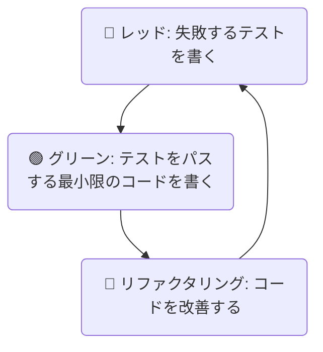

# 第1章 テスト駆動開発(TDD)：動く仕様書を作る開発スタイル

## 🎯 この章で学ぶこと
- テスト駆動開発（TDD）が「テストを先に書く」だけの手法ではないことを理解する。
- TDDの基本サイクル「レッド→グリーン→リファクタリング」の流れを説明できる。
- なぜTDDがコードの品質向上、バグの早期発見、そして「動く仕様書」としての役割を果たすのかを説明できる。
- TDDを実践することで、なぜ自信を持ってリファクタリングできるようになるのかを理解する。
- Jest (JavaScript) のようなテストフレームワークを使い、簡単な関数のTDDサイクルを実践できる。

## 🤔 なぜ重要なのか
あなたは新しい機能の実装を終えました。手元で何度か動かし、問題なさそうなのでリリースしました。しかし翌日、「特定の条件下でアプリがクラッシュする」という致命的なバグ報告が殺到。原因を調査し、修正し、再リリースする...。このプロセスは非常にストレスフルで、開発の速度を大きく低下させます。何より、一度動いたはずのコードを後から修正するのは、精神的な負担が大きいものです。

もし、**「これから作る機能が満たすべき仕様」を、先に「自動テスト」としてコードで表現**し、そのテストがすべて通るように実装を進めていったらどうでしょうか？
- 機能が完成した瞬間 = すべてのテストがパスした瞬間、となり、明確なゴールが生まれる。
- 将来、コードを修正した際に、意図せず他の機能を壊してしまった（デグレードした）場合でも、テストが即座にそれを検知してくれる。
- テストコードそのものが、その機能が「何をすべきか」を雄弁に物語る「動く仕様書」となる。

**テスト駆動開発（TDD）**は、このような「安心」と「品質」を開発プロセスに組み込むための、強力な開発スタイルです。単にテストを書く技法ではなく、ソフトウェアの設計品質そのものを向上させるための思考法でもあります。AIが複雑なロジックを生成した場合でも、その振る舞いの正しさを保証するテストを先に書くことで、安心してAIの力を活用できます。

## 📚 基礎概念の理解

### TDDとは何か？
TDDは、プログラムの実装コードを書く前に、そのプログラムの振る舞いを定義するテストコードを先に書く開発手法です。このプロセスは、短いサイクルを繰り返すことで進められます。

### レッド・グリーン・リファクタリングのサイクル
TDDの中核をなすのが、この3つのステップからなるサイクルです。

1.  **🔴 レッド (Red)**:
    -   **やること**: まず、これから実装する**小さな機能**に対する「失敗するテスト」を書く。
    -   **状態**: この時点では実装コードは存在しないか、不完全なため、テストは必ず失敗する（テストランナーが赤色で結果を表示することから「レッド」と呼ばれる）。
    -   **目的**: これから何を達成すべきかを明確に定義する。テストが失敗することを確認することで、テストコード自体が正しく書かれていることも保証する。

2.  **🟢 グリーン (Green)**:
    -   **やること**: レッドのテストをパスさせるための、**最小限の実装コード**を書く。
    -   **状態**: テストが成功に変わる（緑色で表示される）。
    -   **目的**: とにかくテストをパスさせることだけを考える。この段階では、コードの綺麗さや効率は二の次でよい。まずは仕様を満たすことが最優先。

3.  **🔵 リファクタリング (Refactoring)**:
    -   **やること**: グリーンで書いたコードの品質を向上させる。重複したコードをまとめたり、変数名を分かりやすくしたり、より効率的なアルゴリズムに改善したりする。
    -   **状態**: テストはグリーンのままであることを維持する。
    -   **目的**: コードの振る舞い（外部から見た仕様）を変えずに、内部構造を改善する。テストが常にパスすることを確認しながら作業できるため、開発者は**安心してコードの改善に集中できる**。

この「レッド→グリーン→リファクタリング」のサイクルを、数分から数十分という非常に短い単位で高速に回しながら、少しずつ機能を追加していくのがTDDの進め方です。



### TDDのメリット
- **バグの早期発見**: 機能単位でテストが書かれるため、バグが入り込む余地が少なくなり、問題があれば即座に検知できる。
- **設計の改善**: テストしやすいコードを書くことを強制されるため、自然と各機能が疎結合（依存関係が少ない）で、責務が明確な良い設計になりやすい。
- **リファクタリングへの自信**: 強固なテストスイート（テストの集合）が「安全網」となり、開発者は安心してコードの改善に取り組める。
- **動く仕様書**: テストコード群が、アプリケーションがどのように振る舞うべきかを示す、常に最新で信頼性の高いドキュメントとなる。

## 💡 実践的な活用

### ハンズオン：JestでTDDサイクルを体験する
JavaScriptのテストフレームワーク`Jest`を使い、「商品の税込み価格を計算する関数`calculatePriceWithTax`」をTDDで開発してみましょう。

**準備**:
1.  `npm init -y`でプロジェクトを初期化する。
2.  `npm install --save-dev jest`でJestをインストールする。
3.  `package.json`の`scripts`を修正する:
    ```json
    "scripts": {
      "test": "jest"
    }
    ```

**手順**:

**1. 🔴 レッドフェーズ**
まず、テストファイル`calculatePriceWithTax.test.js`を作成し、失敗するテストを書きます。

**`calculatePriceWithTax.test.js`**
```javascript
const calculatePriceWithTax = require('./calculatePriceWithTax');

// テストケースを記述
test('100円の商品に消費税10%が加わると110円になること', () => {
  // 期待値(Expected)と実測値(Actual)を比較
  expect(calculatePriceWithTax(100)).toBe(110);
});
```
この時点で`npm test`を実行すると、`calculatePriceWithTax`が未定義なのでエラーになります。これが**レッド**の状態です。

**`calculatePriceWithTax.js`**（空の関数を定義）
```javascript
function calculatePriceWithTax(price) {
  // まだ実装しない
}

module.exports = calculatePriceWithTax;
```
再度`npm test`を実行。今度は「undefinedを受け取った」という形でテストが失敗します。これも**レッド**です。

**2. 🟢 グリーンフェーズ**
テストを通すための最小限のコードを書きます。
**`calculatePriceWithTax.js`**
```javascript
function calculatePriceWithTax(price) {
  // とにかくテストを通すため、今はハードコーディングでも良い
  return 110; 
}

module.exports = calculatePriceWithTax;
```
`npm test`を実行。テストがパスし、**グリーン**になりました！しかし、これでは100円以外の価格に対応できません。

**3. 🔴 レッドフェーズ (2回目)**
新しい要求（別の価格）に対応するため、新たなテストを追加して、意図的に失敗させます。

**`calculatePriceWithTax.test.js`**
```javascript
// ... 既存のテスト ...

test('200円の商品に消費税10%が加わると220円になること', () => {
  expect(calculatePriceWithTax(200)).toBe(220);
});
```
`npm test`を実行。2つ目のテストが失敗し、再び**レッド**に戻ります。

**4. 🟢 グリーンフェーズ (2回目)**
両方のテストを通すように、実装を一般化します。
**`calculatePriceWithTax.js`**
```javascript
function calculatePriceWithTax(price) {
  const taxRate = 0.1;
  return price + (price * taxRate);
}

module.exports = calculatePriceWithTax;
```
`npm test`を実行。すべてのテストがパスし、**グリーン**になりました。

**5. 🔵 リファクタリングフェーズ**
今回はコードがシンプルなので大きな改善点はありませんが、例えば税率を定数として外に出す、などの改善が考えられます。
**`calculatePriceWithTax.js`**
```javascript
const TAX_RATE = 0.1;

function calculatePriceWithTax(price) {
  return Math.floor(price * (1 + TAX_RATE)); // 小数点以下を切り捨てる仕様を追加
}

module.exports = calculatePriceWithTax;
```
リファクタリング後も`npm test`を実行し、すべてのテストが**グリーン**を維持することを確認します。これで、安心してコードの品質を高めることができました。

## 🔍 深掘り：プロの視点

### TDDが難しいケース
TDDは万能ではありません。UI（見た目）や、外部のAPIと連携する部分など、結果が予測しにくい、またはセットアップが複雑な領域では、純粋なTDDを適用するのが難しい場合があります。
このような場合、TDDに固執するのではなく、コンポーネント単位でのスナップショットテストや、E2E（End-to-End）テストなど、他のテスト手法と組み合わせることが現実的です。

### BDD (振る舞い駆動開発) との違い
TDDと似た概念に**BDD (Behavior Driven Development)** があります。
- **TDD**: 「テスト」という開発者寄りの言葉で、関数の入出力などを検証することに主眼を置く。
- **BDD**: 「振る舞い(Behavior)」という、よりビジネス寄りの言葉を使う。「Given（ある状況で）、When（何かをしたら）、Then（こうなるべき）」という自然言語に近い形式で、ユーザーの視点からシステムの振る舞いを記述することに主眼を置く。

BDDはTDDから派生した考え方であり、テスト対象や目的が異なるだけで、サイクルを回して開発を進めるという根幹は似ています。

## 📋 まとめとチェックポイント
- TDDは、実装コードより先にテストコードを書く開発スタイルである。
- TDDの基本は「レッド（失敗）→グリーン（成功）→リファクタリング（改善）」の高速なサイクル。
- まず失敗するテストを書くことで、ゴールを明確にし、テスト自体の信頼性を担保する。
- テストをパスする最小限のコードを書き、その後でテストに守られながら安心してコードを改善する。
- TDDを実践することで、バグが少なく、設計がクリーンで、変更に強いコードを生み出すことができる。

**セルフチェック**
- [ ] TDDの「レッド」フェーズの目的は何ですか？なぜ失敗する状態から始めることが重要なのでしょうか？
- [ ] 「リファクタリング」フェーズで、やって良いことと、やってはいけないことは何ですか？
- [ ] あなたのチームがTDDを導入していないとします。導入するメリットとして、技術者ではないプロジェクトマネージャーに何を伝えますか？
- [ ] TDDのサイクルを回す上で、テスト一つ一つは「大きく」あるべきですか？「小さく」あるべきですか？その理由は何ですか？

## 🔗 関連知識・発展学習
- **単体テスト、統合テスト (`0232_Unit_Integration_Test.md`)**: TDDで書かれるテストは主に単体テストです。他の種類のテストとの違いや組み合わせ方を学びます。
- **CI/CD (`053_CI_CD_DevOps`)**: TDDで作られたテストスイートは、CI（継続的インテグレーション）サーバーで自動的に実行され、コードの品質を常に監視する上で中心的な役割を果たします。
- **デザインパターン (`0124_Design_Patterns.md`)**: TDDを実践すると、自然と依存性の注入（Dependency Injection）などのデザインパターンを利用した、テストしやすい設計に近づいていきます。 