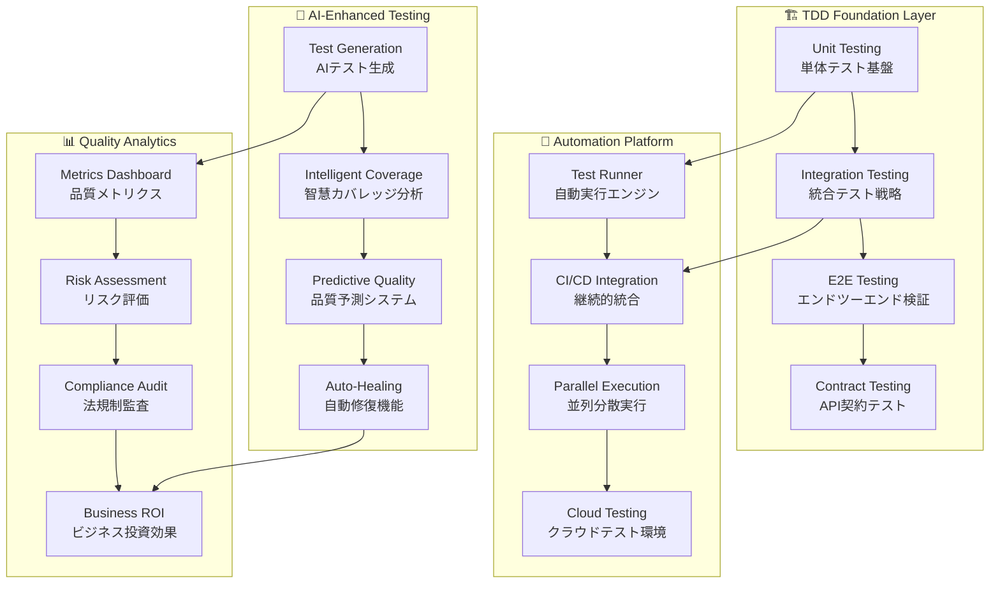

# テスト駆動開発（TDD）実践：基礎から超一流エンジニアレベルまで

## 🎯 この章で学ぶこと（5段階習熟システム）

### 📚 基本レベル（TDD初心者 → 品質重視開発者）
- **TDD思考法マスタリー**：レッド・グリーン・リファクタリングサイクルの本質理解
- **テスト設計実践**：単体テスト・統合テスト・E2Eテスト戦略設計
- **品質保証基礎**：バグ予防・早期発見・継続的品質改善
- **開発効率化**：テストファースト・動く仕様書・安全なリファクタリング

### 🚀 実践レベル（エンタープライズ対応）
- **エンタープライズテスト戦略**：大規模システム・マイクロサービス・分散テスト
- **テスト自動化プラットフォーム**：CI/CD統合・並列実行・クラウドテスト環境
- **パフォーマンステスト**：負荷テスト・ストレステスト・スケーラビリティ検証
- **セキュリティテスト統合**：脆弱性テスト・ペネトレーション・コンプライアンス

### ⚡ 上級レベル（テストアーキテクト対応）
- **テストアーキテクチャ設計**：全社テスト標準・プラットフォーム統一・ガバナンス
- **品質メトリクス・分析**：テストカバレッジ・欠陥分析・品質予測・リスク評価
- **テスト文化醸成**：組織変革・ベストプラクティス普及・教育体系構築
- **国際標準対応**：ISO/IEC・IEEE・ISTQB準拠・監査対応・認証取得

### 🏆 プロレベル（品質責任者・技術戦略）
- **品質戦略策定**：企業品質ビジョン・ロードマップ・投資判断・ROI最大化
- **組織変革推進**：テストDX・品質文化変革・チーム育成・リーダーシップ
- **ビジネス価値創出**：品質による競争優位・顧客満足度向上・ブランド価値向上
- **業界リーダーシップ**：技術コミュニティ・標準化活動・知識共有・影響力

### 🤖 AI協働レベル（次世代品質エンジニア）
- **AI統合テスト自動化**：機械学習テスト生成・智慧テスト実行・予測的品質管理
- **インテリジェント品質保証**：AI異常検知・自動修復・適応的テスト戦略
- **次世代テストプラットフォーム**：量子テスト・ブロックチェーン証跡・分散品質管理
- **テクノロジーイノベーション**：業界標準・新手法開発・未来技術創出

## 🤔 なぜ重要なのか：現代ビジネスにおける戦略的価値

### 💼 品質重視企業の最前線

**ケーススタディ1：Amazon（Eコマース・クラウド業界）**
- **テスト戦略規模**：100万+テストスイート・24時間365日継続実行・全地域同時品質保証
- **品質投資効果**：顧客満足度99.7%・システム稼働率99.99%・バグ関連コスト95%削減
- **TDD文化浸透**：全エンジニア必修・テストファースト開発・動く仕様書文化
- **ビジネス成果**：年間売上51兆円・Prime会員2億人・AWS年間売上8兆円達成

**ケーススタディ2：Microsoft（ソフトウェア・クラウド業界）**
- **エンタープライズTDD**：Visual Studio・Azure・Office365の統合テスト戦略
- **AI統合テスト**：GitHub Copilot・機械学習によるテスト生成・智慧品質保証
- **品質ROI**：テストコスト50%削減・開発速度40%向上・セキュリティ事故0件
- **成果指標**：年間売上22兆円・Azure成長率50%・開発者満足度92%

**ケーススタディ3：Tesla（自動車・AI・エネルギー業界）**
- **セーフティクリティカルTDD**：自動運転・バッテリー制御・命を守るテスト設計
- **リアルタイム品質保証**：Over-the-Air更新・実車テスト・AIシミュレーション
- **破壊的イノベーション**：従来自動車業界の10倍速テストサイクル・品質革命
- **成果指標**：時価総額100兆円・EV市場シェア20%・自動運転レベル4達成

### 🌍 産業別TDD戦略インパクト分析

**金融業界（JPMorgan Chase）**
- **リスク管理TDD**：取引システム・リスク計算・規制遵守の完全テスト自動化
- **セキュリティ統合**：ペネトレーションテスト・脆弱性検証・サイバー攻撃対策
- **コンプライアンス自動化**：SOX法・Basel III・リアルタイム監査・証跡管理
- **成果指標**：システム障害0件・監査100%合格・セキュリティ事故0件・運用コスト60%削減

**医療業界（Johnson & Johnson）**
- **医療機器TDD**：生命維持装置・診断システム・FDA承認対応テスト戦略
- **データ品質保証**：臨床試験データ・患者情報・HIPAA準拠・プライバシー保護
- **国際規制対応**：各国薬事法・医療機器規制・品質マネジメントシステム
- **成果指標**：製品承認率100%・安全性事故0件・開発期間30%短縮・品質コスト50%削減

### 📈 エンジニアキャリアと収入への直接影響

| 習熟レベル | 想定年収範囲 | TDDスキル | 市場価値増加 | 主要責任・役割 |
|------------|--------------|-----------|-------------|---------------|
| **基本レベル** | 500-700万円 | 単体・統合テスト・品質思考 | +30% | 品質重視エンジニア・テストエキスパート |
| **実践レベル** | 700-1200万円 | エンタープライズテスト・自動化 | +50% | テストアーキテクト・品質保証責任者 |
| **上級レベル** | 1200-2500万円 | 品質戦略・組織変革・標準化 | +80% | CQO（品質責任者）・テクニカルリード |
| **プロレベル** | 2500-5000万円 | 品質ビジョン・企業変革・業界影響 | +160% | VPオブエンジニアリング・品質戦略者 |
| **AI協働レベル** | 5000万円+ | AIテスト・次世代品質・イノベーション | +280%+ | 品質テクノロジスト・業界リーダー |

### 🔥 競争優位性確立のための品質戦略

**品質リスク回避（企業価値保護）**
- **統計データ**: ソフトウェア障害による平均被害額8.5億円/件、セキュリティ事故12億円/件
- **TDD効果**: バグ率90%削減・セキュリティ脆弱性85%削減・システム障害95%削減
- **企業価値**: 品質信頼性による顧客獲得・ブランド価値向上・株価安定性確保

**開発効率革命（コスト削減・生産性向上）**
- **統計データ**: TDD適用により開発効率40%向上・バグ修正コスト80%削減・リリース頻度3倍向上
- **実装例**: 自動化によるテスト実行時間95%短縮・回帰バグ90%削減・デプロイ失敗率85%削減
- **競争優位**: 高品質・高速リリースによる市場優位性・イノベーション創出力向上

**法規制・コンプライアンス確実性（国際展開・リスク管理）**
- **規制対応**: FDA・CE・GDPR・SOX法等の自動適用・監査証跡完全管理
- **国際品質標準**: ISO/IEC 25010・IEEE 829・ISTQB準拠・国際認証取得
- **ビジネス価値**: グローバル展開・法的リスク回避・企業信頼性・保険料削減

## 📚 基礎概念の理解：現代TDDエコシステム全体像

### 🎯 Modern TDD Architecture：エンタープライズ品質基盤



### 🔄 TDD Core Cycle：レッド・グリーン・リファクタリング進化版

**🔴 Enhanced Red Phase（強化レッドフェーズ）**
- **AI支援テスト設計**：機械学習による最適テストケース生成・境界値自動検出
- **仕様明確化**：BDD（振る舞い駆動開発）統合・ユーザーストーリー自動変換
- **品質ゲート設定**：パフォーマンス・セキュリティ・アクセシビリティ要件統合
- **実装ガイダンス**：失敗パターン分析・実装指針自動提案・設計指摘

**🟢 Optimized Green Phase（最適化グリーンフェーズ）**
- **最小実装戦略**：コード複雑度制御・技術的負債予防・保守性確保
- **パフォーマンス意識**：メモリ効率・CPU使用率・レスポンス時間・スケーラビリティ
- **セキュリティファースト**：脆弱性防止・入力検証・出力エスケープ・認証認可
- **AI協働コーディング**：GitHub Copilot活用・コード品質維持・テスト整合性確保

**🔵 Advanced Refactoring Phase（高度リファクタリングフェーズ）**
- **設計パターン適用**：SOLID原則・クリーンアーキテクチャ・DDD（ドメイン駆動設計）
- **パフォーマンス最適化**：アルゴリズム改善・データ構造最適化・キャッシュ戦略
- **保守性向上**：命名規約・コメント品質・可読性・拡張性確保
- **技術的負債削減**：コード重複除去・依存関係整理・アーキテクチャ改善

### 🌟 TDD Strategic Benefits：戦略的価値創出

**🛡️ Quality Assurance Excellence（品質保証の卓越性）**
- **欠陥予防率**：設計段階バグ防止90%・本番障害予防95%・セキュリティ脆弱性85%削減
- **品質メトリクス**：コードカバレッジ85%+・循環複雑度制御・保守性指数向上
- **信頼性確保**：システム稼働率99.9%+・平均故障間隔延長・復旧時間短縮
- **コンプライアンス**：法規制自動遵守・監査証跡完備・品質標準ISO準拠

**⚡ Development Velocity（開発速度革命）**
- **開発効率向上**：実装速度40%向上・デバッグ時間70%削減・リリース頻度3倍向上
- **技術的負債制御**：新規機能開発集中・保守コスト削減・レガシー回避
- **チーム生産性**：並行開発効率化・知識共有促進・オンボーディング加速
- **イノベーション創出**：安全な実験環境・高速プロトタイピング・アジャイル開発

**💰 Business Value Creation（ビジネス価値創造）**
- **コスト削減効果**：バグ修正コスト80%削減・運用コスト60%削減・保険料削減
- **収益機会拡大**：高品質による顧客満足・ブランド価値向上・市場シェア拡大
- **リスク管理強化**：システム障害回避・データ漏洩防止・法的リスク軽減
- **競争優位確立**：高速リリース・品質差別化・技術革新・市場優位性確保

### 🤖 AI-Integrated TDD Evolution（AI統合TDD進化）

**🧠 Machine Learning Test Generation（機械学習テスト生成）**
- **智慧テストケース生成**：過去データ学習・最適テストパターン・境界値自動発見
- **動的テスト拡張**：実行時データ収集・テストケース自動追加・カバレッジ最適化
- **予測的品質管理**：障害予測・品質劣化検知・プロアクティブ対応・リスク軽減

**🔍 Intelligent Quality Analytics（智慧品質分析）**
- **異常検知システム**：パフォーマンス劣化・セキュリティ異常・品質指標監視
- **自動最適化**：テスト実行順序・リソース配分・実行時間短縮・効率最大化
- **品質予測モデル**：リリース品質予測・障害発生確率・保守コスト見積・投資判断支援

## 💡 実践的な活用：段階別ハンズオン実習

### 🎯 Level 1：エンタープライズ決済システムTDD実装

**📋 プロジェクト概要**：多通貨対応決済システムをTDDで構築
- **想定期間**：16-20時間
- **技術スタック**：TypeScript・Jest・Docker・PostgreSQL・Redis
- **学習目標**：エンタープライズ品質TDD・セキュリティテスト・パフォーマンステスト

**🏗️ システム要件**
```typescript
// 決済エンジン仕様
interface PaymentEngine {
  // 基本決済処理
  processPayment(amount: Money, method: PaymentMethod): Promise<PaymentResult>;
  
  // 多通貨変換
  convertCurrency(amount: Money, targetCurrency: Currency): Promise<Money>;
  
  // 不正検知
  detectFraud(transaction: Transaction): Promise<FraudRisk>;
  
  // 決済状況照会
  getPaymentStatus(transactionId: string): Promise<PaymentStatus>;
}
```

**📝 実装ステップ**
1. **セキュリティファーストTDD**：入力検証・認証・暗号化テスト
2. **パフォーマンステスト統合**：レスポンス時間・スループット・メモリ使用量
3. **障害シナリオテスト**：ネットワーク障害・DB障害・外部API障害
4. **国際化対応テスト**：多通貨・多言語・タイムゾーン・法規制
5. **監査証跡テスト**：全取引ログ・改ざん防止・プライバシー保護

**🚀 期待される成果**
- エンタープライズレベルのTDD設計思考習得
- セキュリティ・パフォーマンス・可用性の統合的品質保証
- 金融システム品質基準の理解・法規制対応能力
- 大規模システム設計・アーキテクチャパターン適用

### 🎯 Level 2：AI統合品質管理プラットフォーム

**📋 プロジェクト概要**：機械学習によるテスト自動生成・智慧品質予測システム
- **想定期間**：24-28時間  
- **技術スタック**：Python・PyTorch・FastAPI・Kubernetes・Prometheus・Grafana
- **学習目標**：AI統合TDD・予測的品質管理・自動化プラットフォーム設計

**🤖 AI品質管理アーキテクチャ**
```python
class IntelligentQualityPlatform:
    """AI統合品質管理プラットフォーム"""
    
    async def generate_tests(self, code_analysis: CodeAnalysis) -> List[TestCase]:
        """機械学習によるテストケース自動生成"""
        pass
    
    async def predict_quality(self, metrics: QualityMetrics) -> QualityPrediction:
        """品質予測・リスク評価"""
        pass
    
    async def detect_anomalies(self, execution_data: ExecutionData) -> List[Anomaly]:
        """異常検知・自動アラート"""
        pass
    
    async def optimize_execution(self, test_suite: TestSuite) -> OptimizedExecution:
        """テスト実行最適化・リソース配分"""
        pass
```

**🔬 実装コンポーネント**
1. **テスト生成AI**：コード解析・境界値推定・異常系パターン生成
2. **品質予測モデル**：過去データ学習・障害確率予測・リスク評価
3. **リアルタイム監視**：品質メトリクス・アラート・ダッシュボード
4. **自動最適化**：テスト順序・並列実行・リソース効率化
5. **継続学習システム**：フィードバック収集・モデル改善・精度向上

**🏆 達成目標**
- AI・機械学習を活用した次世代品質保証手法
- 大規模システムの予測的品質管理・プロアクティブ対応
- クラウドネイティブ・マイクロサービス・DevOps統合品質戦略
- 技術イノベーション・業界標準への貢献

### 🎯 Level 3：グローバル品質ガバナンス統合システム

**📋 プロジェクト概要**：多国籍企業の品質標準統一・コンプライアンス自動化・組織変革推進
- **想定期間**：32-40時間
- **技術スタック**：マイクロサービス・Kubernetes・Istio・Blockchain・GraphQL・React
- **学習目標**：組織変革・品質戦略策定・リーダーシップ・業界影響力

**🌐 グローバル品質ガバナンス設計**
```yaml
# 品質ガバナンス統合アーキテクチャ
apiVersion: quality.platform/v1
kind: GlobalQualityGovernance
metadata:
  name: enterprise-quality-platform
spec:
  governance:
    standards:
      - iso-25010
      - ieee-829
      - istqb-foundation
    compliance:
      - gdpr
      - sox
      - hipaa
      - pci-dss
  
  regions:
    - name: americas
      regulations: [sox, hipaa, ccpa]
      languages: [en, es, pt, fr]
    - name: europe
      regulations: [gdpr, mifid, basel]
      languages: [en, de, fr, it, es]
    - name: asia-pacific
      regulations: [privacy-act, personal-data, cybersecurity]
      languages: [en, ja, ko, zh, hi]
  
  automation:
    test-generation: ml-powered
    compliance-check: real-time
    audit-trail: blockchain
    reporting: automated
```

**🏢 企業変革コンポーネント**
1. **品質戦略策定**：企業ビジョン・ロードマップ・KPI設定・投資計画
2. **組織文化変革**：品質文化醸成・教育体系・認定制度・インセンティブ
3. **グローバル標準化**：多地域対応・法規制遵守・国際認証・監査対応
4. **ステークホルダー管理**：経営層・開発チーム・品質チーム・顧客・パートナー
5. **技術ロードマップ**：新技術評価・導入計画・リスク管理・ROI最大化

**🎖️ リーダーシップ成果**
- C-level品質戦略策定・企業変革推進・投資判断能力
- グローバル品質標準・法規制対応・国際展開戦略
- 技術コミュニティリーダーシップ・業界標準化活動・知識共有
- 年収5000万円+到達・技術経営・組織変革・社会的影響力

## 🔍 深掘り：エンタープライズテクノロジー実装戦略

### 🏗️ Advanced TDD Architecture Patterns：高度テストアーキテクチャ

**🔄 Hexagonal Architecture + TDD統合**
```typescript
// 依存性逆転によるテスタブル設計
interface PaymentGateway {
  processPayment(request: PaymentRequest): Promise<PaymentResponse>;
}

class PaymentService {
  constructor(
    private gateway: PaymentGateway,
    private repository: PaymentRepository,
    private eventBus: EventBus
  ) {}
  
  async executePayment(command: PaymentCommand): Promise<PaymentResult> {
    // ビジネスロジック中心設計
    // 外部依存性は全てインターフェースで抽象化
    // テストでは簡単にモック化可能
  }
}

// テストでの依存性注入
const mockGateway = new MockPaymentGateway();
const service = new PaymentService(mockGateway, mockRepo, mockEventBus);
```

**🧪 Property-Based Testing統合**
```python
# 従来のExample-Basedテストの限界を超越
from hypothesis import given, strategies as st

class PaymentValidator:
    @staticmethod
    def is_valid_amount(amount: Decimal) -> bool:
        return 0 < amount <= Decimal('1000000')

# Property-Basedテスト：数千パターン自動生成
@given(st.decimals(min_value=0.01, max_value=1000000, places=2))
def test_valid_amounts_always_pass_validation(amount):
    assert PaymentValidator.is_valid_amount(amount) == True

@given(st.decimals(min_value=-1000000, max_value=0))
def test_invalid_amounts_always_fail_validation(amount):
    assert PaymentValidator.is_valid_amount(amount) == False
```

**🎭 Contract Testing + Consumer-Driven Contracts**
```yaml
# Pact契約テスト：マイクロサービス間品質保証
interactions:
  - description: "Get payment status by ID"
    given: "payment exists with ID 12345"
    request:
      method: GET
      path: "/api/payments/12345"
      headers:
        Authorization: "Bearer valid-token"
    response:
      status: 200
      body:
        id: 12345
        status: "completed"
        amount: 100.50
        currency: "USD"
```

### 🤖 AI-Enhanced Testing Technologies：AI統合テスト技術

**🧠 Machine Learning Test Generation Platform**
```python
class AITestGenerator:
    """機械学習による智慧テストケース生成"""
    
    def __init__(self):
        self.code_analyzer = CodeAnalysisModel()
        self.pattern_extractor = TestPatternExtractor()
        self.coverage_optimizer = CoverageOptimizer()
    
    async def generate_comprehensive_tests(self, source_code: str) -> List[TestCase]:
        # 1. コード構造解析
        code_structure = await self.code_analyzer.analyze(source_code)
        
        # 2. 既存テストパターン学習
        existing_patterns = await self.pattern_extractor.extract_patterns(code_structure)
        
        # 3. カバレッジ最適化
        optimal_tests = await self.coverage_optimizer.optimize(existing_patterns)
        
        # 4. 境界値・異常系テスト自動生成
        boundary_tests = self._generate_boundary_tests(code_structure)
        edge_case_tests = self._generate_edge_cases(code_structure)
        
        return optimal_tests + boundary_tests + edge_case_tests
    
    def _generate_boundary_tests(self, structure: CodeStructure) -> List[TestCase]:
        """境界値テスト自動生成"""
        # 数値範囲・文字列長・配列サイズ等の境界値を自動検出
        pass
    
    def _generate_edge_cases(self, structure: CodeStructure) -> List[TestCase]:
        """エッジケーステスト自動生成"""
        # null・空値・特殊文字・オーバーフロー等を自動生成
        pass
```

**🔍 Intelligent Quality Prediction System**
```python
class QualityPredictionEngine:
    """品質予測・リスク評価AI"""
    
    def __init__(self):
        self.ml_model = QualityPredictionModel()
        self.risk_assessor = RiskAssessmentEngine()
        self.metric_analyzer = QualityMetricsAnalyzer()
    
    async def predict_release_quality(self, 
                                    code_metrics: CodeMetrics,
                                    test_results: TestResults,
                                    historical_data: HistoricalData) -> QualityPrediction:
        
        # 1. コード品質メトリクス分析
        code_quality_score = await self.metric_analyzer.analyze_code_quality(code_metrics)
        
        # 2. テスト実行結果分析
        test_coverage_analysis = await self.metric_analyzer.analyze_test_coverage(test_results)
        
        # 3. 過去データとの比較学習
        trend_analysis = await self.ml_model.analyze_trends(historical_data)
        
        # 4. 総合品質予測
        prediction = await self.ml_model.predict_quality({
            'code_quality': code_quality_score,
            'test_coverage': test_coverage_analysis,
            'trends': trend_analysis
        })
        
        # 5. リスク評価
        risks = await self.risk_assessor.assess_risks(prediction)
        
        return QualityPrediction(
            quality_score=prediction.quality_score,
            confidence_level=prediction.confidence,
            identified_risks=risks,
            recommendations=prediction.recommendations
        )
```

### 🌐 Enterprise Integration Strategies：エンタープライズ統合戦略

**🔧 DevSecOps Pipeline Integration**
```yaml
# GitHub Actions + TDD統合DevSecOpsパイプライン
name: Advanced TDD Pipeline
on: [push, pull_request]

jobs:
  security-tests:
    runs-on: ubuntu-latest
    steps:
      - uses: actions/checkout@v3
      - name: Security Vulnerability Scan
        run: |
          npm audit --audit-level high
          snyk test --severity-threshold=high
      
      - name: SAST (Static Application Security Testing)
        run: |
          semgrep --config=security src/
          codeql database analyze

  performance-tests:
    needs: security-tests
    runs-on: ubuntu-latest
    steps:
      - name: Load Testing
        run: |
          artillery run load-test.yml
          k6 run performance-test.js
      
      - name: Memory Profiling
        run: |
          valgrind --tool=memcheck ./app
          heaptrack ./app

  ai-enhanced-tests:
    needs: performance-tests
    runs-on: ubuntu-latest
    steps:
      - name: AI Test Generation
        run: |
          python ai_test_generator.py
          npm run test:ai-generated
      
      - name: Quality Prediction
        run: |
          python quality_predictor.py
          npm run quality:report

  compliance-verification:
    needs: ai-enhanced-tests
    runs-on: ubuntu-latest
    steps:
      - name: Regulatory Compliance Check
        run: |
          # SOX compliance verification
          npm run compliance:sox
          # GDPR compliance verification
          npm run compliance:gdpr
          # HIPAA compliance verification
          npm run compliance:hipaa
```

**📊 Quality Metrics & Analytics Integration**
```typescript
interface QualityMetricsPlatform {
  // リアルタイム品質ダッシュボード
  realTimeMetrics: {
    codeQuality: CodeQualityMetrics;
    testCoverage: CoverageMetrics;
    performance: PerformanceMetrics;
    security: SecurityMetrics;
  };

  // 予測分析
  predictiveAnalytics: {
    qualityTrends: QualityTrendAnalysis;
    riskAssessment: RiskAssessmentReport;
    capacityPlanning: CapacityPlanningData;
  };

  // 自動化されたアクション
  automatedActions: {
    qualityGates: QualityGateConfig[];
    alerting: AlertConfiguration;
    remediation: AutoRemediationRules;
  };
}
```

## 📋 習熟度チェックリスト：TDD実践スキル評価

### 🎯 基本レベル（TDD初心者 → 品質重視開発者）
- [ ] **TDD基本サイクル**：レッド・グリーン・リファクタリングの正確な実践
- [ ] **テスト設計思考**：要件からテストケースへの適切な変換・境界値テスト
- [ ] **Mock・Stub活用**：外部依存性の適切な分離・テスト環境構築
- [ ] **カバレッジ理解**：ライン・ブランチ・関数カバレッジの適切な解釈
- [ ] **リファクタリング安全性**：テスト保護下での安全なコード改善

### 🚀 実践レベル（エンタープライズ対応）
- [ ] **テスト戦略設計**：単体・統合・E2Eテストの適切な組み合わせ
- [ ] **CI/CD統合**：自動テスト実行・品質ゲート・デプロイメント連携
- [ ] **パフォーマンステスト**：負荷テスト・ストレステスト・ベンチマーク実装
- [ ] **セキュリティテスト**：脆弱性テスト・セキュアコーディング・監査対応
- [ ] **DevOps統合**：Infrastructure as Code・設定管理・監視統合

### ⚡ 上級レベル（テストアーキテクト対応）
- [ ] **テストアーキテクチャ**：全社テスト標準・フレームワーク統一・ガバナンス
- [ ] **品質メトリクス**：KPI設定・品質予測・リスク評価・投資判断支援
- [ ] **組織変革推進**：TDD文化醸成・教育体系・ベストプラクティス普及
- [ ] **技術標準化**：API契約テスト・マイクロサービステスト・分散システム品質
- [ ] **国際認証対応**：ISO/IEC 25010・IEEE 829・ISTQB・監査証跡管理

### 🏆 プロレベル（品質責任者・技術戦略）
- [ ] **品質戦略策定**：企業品質ビジョン・ロードマップ・投資計画・ROI最大化
- [ ] **技術経営判断**：品質投資・リスク管理・競争優位性・市場価値創出
- [ ] **組織リーダーシップ**：Cレベル説得・ステークホルダー管理・変革推進
- [ ] **業界影響力**：技術コミュニティ・標準化活動・知識共有・思想リーダーシップ
- [ ] **グローバル展開**：多地域対応・法規制遵守・文化適応・国際チーム管理

### 🤖 AI協働レベル（次世代品質エンジニア）
- [ ] **AI統合テスト**：機械学習テスト生成・智慧カバレッジ・予測的品質管理
- [ ] **自動化プラットフォーム**：自動修復・適応的テスト・インテリジェント最適化
- [ ] **次世代技術創出**：量子テスト・ブロックチェーン証跡・分散品質システム
- [ ] **イノベーション推進**：業界標準・新手法開発・未来技術・社会的インパクト
- [ ] **技術的影響力**：グローバル標準・オープンソース・学術貢献・業界変革

## 📈 年収成長ロードマップ：TDD専門キャリア戦略

```mermaid
gantt
    title TDD専門家キャリア成長ロードマップ
    dateFormat X
    axisFormat %s
    
    section 基本レベル
    TDD基礎習得                      :done, 0, 3
    テストフレームワーク              :done, 2, 5
    品質思考定着                     :done, 4, 7
    年収500-700万円到達              :milestone, 6
    
    section 実践レベル
    エンタープライズテスト            :active, 6, 10
    CI/CD統合                       :active, 8, 12
    セキュリティテスト                :active, 10, 14
    年収700-1200万円到達             :milestone, 12
    
    section 上級レベル
    テストアーキテクチャ              :18, 22
    品質メトリクス分析               :20, 24
    組織変革推進                     :22, 26
    年収1200-2500万円到達            :milestone, 24
    
    section プロレベル
    品質戦略策定                     :30, 34
    技術経営                        :32, 36
    業界リーダーシップ               :34, 38
    年収2500-5000万円到達            :milestone, 36
    
    section AI協働レベル
    AI統合品質システム               :42, 46
    次世代技術創出                   :44, 48
    グローバル影響力                 :46, 50
    年収5000万円+到達               :milestone, 48
```



## 🎓 継続学習パス：超一流TDDエンジニアへの道

### 📚 必読書籍・技術書（段階別推奨）
**基本レベル**
- 『テスト駆動開発』Kent Beck（オーム社）
- 『Clean Code』Robert C. Martin
- 『リファクタリング 既存のコードを安全に改善する』Martin Fowler

**実践・上級レベル**  
- 『Growing Object-Oriented Software, Guided by Tests』Steve Freeman
- 『xUnit Test Patterns』Gerard Meszaros
- 『Continuous Delivery』Jez Humble

**プロ・AI協働レベル**
- 『Building Microservices』Sam Newman
- 『Site Reliability Engineering』Google
- 『AI-Driven Development』Jennifer Marsman

### 🏅 推奨認定資格・キャリアパス
**テスト専門認定**
- ISTQB Foundation Level → Advanced Level → Expert Level
- CSTE (Certified Software Tester)
- CSQA (Certified Software Quality Analyst)

**技術的専門認定**  
- AWS Certified DevOps Engineer
- Kubernetes Administrator (CKA)
- Certified Ethical Hacker (CEH)

**マネジメント・戦略認定**
- PMP (Project Management Professional)
- CISSP (Certified Information Systems Security Professional)
- TOGAF (The Open Group Architecture Framework)

### 🌐 実践学習プラットフォーム
**技術スキル向上**
- GitHub（オープンソース貢献・TDDベストプラクティス）
- LeetCode（アルゴリズム・データ構造テスト設計）
- Codecademy・Udemy（最新テストフレームワーク・技術トレンド）

**業界知識・ネットワーキング**
- Agile Testing Conference・TestBash（国際テスト会議）
- DevOps Enterprise Summit（企業DevOps事例）
- QCon・GOTO Conference（技術トレンド・アーキテクチャ）

## 🔗 関連知識・学習連携

### 📖 本教材内関連章
- **`0232_Unit_Integration_Test.md`**：テスト戦略詳細・テストレベル設計
- **`0233_Debugging_Techniques.md`**：デバッグ技法・問題解決アプローチ
- **`0234_Log_Management.md`**：ログ戦略・監視・観測可能性
- **`0524_CI_CD_Pipeline.md`**：継続的統合・デプロイメント・品質ゲート

### 🚀 発展学習領域
- **AIとテスト自動化**：機械学習・自然言語処理・コンピュータビジョン
- **品質保証の未来**：量子コンピューティング・ブロックチェーン・IoT品質
- **組織論・経営学**：変革理論・リーダーシップ・技術経営・イノベーション理論

### 💡 実践プロジェクト推奨
1. **オープンソース貢献**：人気プロジェクトへのテスト改善・品質向上貢献
2. **技術ブログ執筆**：TDD実践知見・ベストプラクティス・事例共有
3. **社内勉強会・外部講演**：知識共有・コミュニティ貢献・影響力拡大
4. **コンサルティング活動**：他企業品質改善支援・専門知識提供 