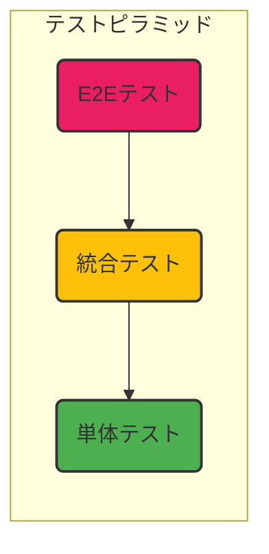

# 第2章 単体テストと統合テスト：品質を支えるテストの層

## 🎯 この章で学ぶこと
- 「テストピラミッド」の概念を理解し、なぜ単体テストが土台となるのかを説明できる。
- 単体テスト（ユニットテスト）の目的と、それが何を保証する（あるいは、しない）のかを説明できる。
- 統合テストの目的と、それが単体テストとどう異なり、何を検証するのかを説明できる。
- 「モック」や「スタブ」といったテストダブルの概念を理解し、それらがなぜ統合テストで重要なのかを説明できる。
- Jestを使い、単体テストと、モックを使った統合テストの基本的な書き分けができるようになる。

## 🤔 なぜ重要なのか
前章で学んだTDDは、主に「単体テスト」を書き進める開発スタイルです。しかし、アプリケーションは無数の部品（関数、モジュール、クラス）が複雑に組み合わさって動いています。個々の部品が正しくても、それらを繋ぎ合わせたらうまく動かない、ということは日常茶飯事です。

家を建てる状況を想像してください。
- **単体テスト**: 一つ一つのレンガ、一本一本の柱が、規定の強度やサイズを満たしているかを確認する作業です。非常に重要ですが、これだけでは家が建つ保証はありません。
- **統合テスト**: レンガを積み上げて壁にし、柱と梁を組み合わせて骨格を作る。その「組み合わせた部分」が、設計通りに機能するかを確認する作業です。壁は垂直か？骨格は安定しているか？などです。
- **E2Eテスト**: 最終的に完成した家に住んでみて、ドアは開くか、電気はつくか、雨漏りはしないか、といった「ユーザー視点」での全体の振る舞いを確認する作業です。

ソフトウェアテストも同様に、異なる粒度と目的を持つテストをバランス良く組み合わせることが、品質保証の鍵となります。特に、開発者が主に書くことになる**単体テスト**と**統合テスト**の役割を正確に理解することは、効率的で信頼性の高いテスト戦略を立てる上で不可欠です。

## 📚 基礎概念の理解

### テストピラミッド
効率的なテスト戦略のモデルとして、**テストピラミッド**という考え方が広く知られています。



-   **土台：単体テスト (Unit Tests)**
    -   **量**: 最も数多く書くべき。
    -   **速度**: 高速に実行できる。
    -   **コスト**: 低い。
-   **中間：統合テスト (Integration Tests)**
    -   **量**: 単体テストよりは少なく。
    -   **速度**: 単体テストよりは遅い。
    -   **コスト**: 中程度。
-   **頂点：E2E (End-to-End) テスト**
    -   **量**: 最小限に。
    -   **速度**: 非常に遅い。
    -   **コスト**: 高い。

このピラミッドが示すのは、「フィードバックが速く、コストの低い単体テストを厚く書き、フィードバックが遅くコストの高いE2Eテストは重要なシナリオに絞るべき」という原則です。

### 単体テスト (ユニットテスト)
- **目的**: 関数やメソッド、クラスといった、プログラムの**最小単位（ユニット）**が、個別に正しく動作することを確認する。
- **特徴**:
    - **隔離 (Isolate)**: テスト対象のユニットを、それが依存する他の部分（DB、ファイルシステム、外部APIなど）から完全に切り離してテストする。
    - **高速**: 依存関係がないため、非常に速く実行できる。
    - **具体例**: `calculatePriceWithTax(100)`が`110`を返す、といった純粋な計算ロジックの検証。

### 統合テスト (インテグレーションテスト)
- **目的**: 複数のユニット（モジュール）を**組み合わせた際**に、それらが意図通りに連携して動作することを確認する。
- **特徴**:
    - **連携 (Integrate)**: モジュール間の相互作用やデータの受け渡しを検証する。
    - **範囲は様々**: 2つのモジュールの小さな連携から、APIサーバーとデータベースの連携といった大きなものまで、様々なレベルがある。
    - **具体例**: 「ユーザー登録APIを叩くと、リクエストが正しく処理され、データベースにユーザー情報が書き込まれること」を検証する。

### テストダブル：スタブとモック
統合テストでは、すべての依存関係を本物で揃えるのが難しい場合があります（例：外部の決済APIをテストの度に叩くわけにはいかない）。そこで**テストダブル**という、本物の代役となるオブジェクトを使います。

- **スタブ (Stub)**:
    - **役割**: テスト対象からの呼び出しに対して、あらかじめ決められた値を返すだけのシンプルな代役。テスト中に状態が変化したりはしない。
    - **例え**: 都合の良い返事だけをしてくれる、融通の利く壁打ち相手。
    - **使い方**: 「DBからユーザー情報を取得する関数」をスタブに置き換え、「必ず特定のユーザー情報を返す」ように設定する。

- **モック (Mock)**:
    - **役割**: スタブの機能に加え、テスト対象から「どのように呼び出されたか」（呼び出された回数、渡された引数など）を記録・検証できる高機能な代役。
    - **例え**: やり取りをすべて記憶している、几帳面な秘書。
    - **使い方**: 「メール送信APIを叩く関数」をモックに置き換え、「APIがちょうど1回、特定の宛先と内容で呼び出されたこと」をテストの最後に検証する。

**使い分けのヒント**:
- テスト対象の**入力**を制御したい（都合のいい値を返してほしい）場合は**スタブ**。
- テスト対象の**出力**（外部への命令）を検証したい場合は**モック**。

## 💡 実践的な活用

### ハンズオン：単体テストと統合テストの実装
ユーザー情報を取得し、外部のロギングサービスにログを送る機能を例に、テストを書き分けてみましょう。

**準備**:
- `npm install --save-dev jest`

**テスト対象のコード**:
**`logger.js` (外部サービス)**
```javascript
// 実際には外部APIを叩く重い処理
const logService = {
  log: (message) => {
    console.log(`LOG: ${message}`);
    // ... 外部へのネットワーク通信など
  }
};
module.exports = logService;
```

**`userService.js` (ビジネスロジック)**
```javascript
const logService = require('./logger');

const db = {
  users: {
    1: { name: 'Alice', email: 'alice@example.com' },
  }
};

const userService = {
  getUserById: (id) => {
    const user = db.users[id];
    if (user) {
      logService.log(`User found: ${id}`);
    } else {
      logService.log(`User not found: ${id}`);
    }
    return user;
  }
};
module.exports = userService;
```

**1. 単体テストの実装**
`userService.js`のロジックのみをテストします。外部依存である`logService`は**モック**化して、ロジックから切り離します。

**`userService.test.js`**
```javascript
const userService = require('./userService');
const logService = require('./logger');

// loggerモジュールをモック化する
jest.mock('./logger');

describe('userService', () => {
  beforeEach(() => {
    // 各テストの前にモックの呼び出し履歴をリセット
    logService.log.mockClear();
  });

  // Test 1: ユーザーが見つかる場合の単体テスト
  test('getUserById should return a user and log a found message', () => {
    const user = userService.getUserById(1);

    // 振る舞いの検証 (ロジックが正しいか)
    expect(user).toEqual({ name: 'Alice', email: 'alice@example.com' });
    
    // モックの検証 (logServiceが正しく呼び出されたか)
    expect(logService.log).toHaveBeenCalledTimes(1);
    expect(logService.log).toHaveBeenCalledWith('User found: 1');
  });

  // Test 2: ユーザーが見つからない場合の単体テスト
  test('getUserById should return undefined and log a not found message', () => {
    const user = userService.getUserById(99);
    
    // 振る舞いの検証
    expect(user).toBeUndefined();
    
    // モックの検証
    expect(logService.log).toHaveBeenCalledTimes(1);
    expect(logService.log).toHaveBeenCalledWith('User not found: 99');
  });
});
```
このテストは`logger.js`の実際のコードに依存せず、`userService`のロジックだけを高速に検証できます。

**2. 統合テストの実装 (例)**
この例ではモジュールが少ないため明確な統合テストは難しいですが、もし`userService`が実際のデータベースと通信する場合、DBを起動した状態で**モックを使わずに**テストを実行します。これが統合テストです。

```javascript
// これはあくまで概念を示す疑似コードです
describe('userService and DB integration', () => {
  // テスト前にDBをセットアップ
  beforeAll(() => setupTestDatabase());
  
  // テスト後にDBをクリーンアップ
  afterAll(() => teardownTestDatabase());

  test('should actually retrieve a user from the test database', () => {
    // モックは使わず、本物の(テスト用)DBに接続する
    const user = userService.getUserById(1); 
    expect(user.name).toBe('Alice');
  });
});
```

## 🔍 深掘り：プロの視点

### コードカバレッジとその罠
コードカバレッジは、テストがソースコードの何パーセントを実行したかを示す指標です。`jest --coverage`で計測できます。
カバレッジ100%は魅力的に見えますが、これは**罠**になり得ます。

- **カバレッジの限界**: カバレッジは「コードが実行されたか」を示すだけで、「テストの質」は保証しません。例えば、`expect(true).toBe(true)`のような無意味なテストでもカバレッジは上昇します。
- **良い使い方**: カバレッジは「テストされていないコード行」を発見するために使うのが有効です。100%を目指すのではなく、重要なビジネスロジックがテストから漏れていないかを確認するツールとして活用しましょう。

### テストの保守性：良いテストとは？
悪いテストは、将来のリファクタリングを妨げる「負債」になります。良いテストとは：
- **実装の詳細ではなく、振る舞いをテストする**: 関数の内部実装が変わっても、入出力（振る舞い）が変わらなければ、テストは失敗すべきではありません。
- **一つのことだけをテストする**: 一つのテストケースでは、一つの概念のみを検証します。失敗したときに、原因がすぐに特定できます。
- **セットアップが容易で、高速である**: 開発者がテスト実行をためらうようでは意味がありません。

## 📋 まとめとチェックポイント
- 品質保証のためには、テストピラミッドに従い、粒度の異なるテストをバランス良く配置することが重要。
- 単体テストは、最小単位のコンポーネントを「隔離」して、そのロジックの正しさを高速に検証する。
- 統合テストは、複数のコンポーネントを「連携」させて、その間のインタラクションがうまくいくかを確認する。
- モックやスタブは、テストの依存関係を代役（テストダブル）に置き換える技術。特に統合テストで、外部システムなどを切り離すのに役立つ。
- カバレッジの数字だけを追い求めるのは危険。テストの質と、何がテストされていないかを知るために使う。

**セルフチェック**
- [ ] テストピラミッドの図を描き、各層（単体、統合、E2E）の特徴（速度、コスト、量）を説明できますか？
- [ ] 「ユーザー認証機能」をテストする際、「パスワードのハッシュ化ロジックが正しいこと」を確認するのは、単体テストと統合テストのどちらが適切ですか？
- [ ] 「ユーザー登録APIを叩くと、確認メールが送信されること」をテストしたい。メール送信サービスを「モック」する理由は何ですか？
- [ ] あなたの書いたテストが、機能の振る舞いは変わっていないのに、少しリファクタリングしただけで失敗するようになりました。これは「良いテスト」と言えますか？なぜですか？

## 🔗 関連知識・発展学習
- **テスト駆動開発 (`0231_Test_Driven_Development.md`)**: TDDは、質の高い単体テストを効率的に生み出すための優れたプロセスです。
- **CI/CD (`053_CI_CD_DevOps`)**: 単体テストと統合テストは、CIパイプラインの最も重要なステップの一つです。コードがマージされる前に、これらのテストが自動的に実行されます。
- **E2Eテスト**: CypressやPlaywrightのようなツールを使ったE2Eテストは、ユーザーの操作をブラウザでシミュレートし、システム全体の健全性を保証します。 