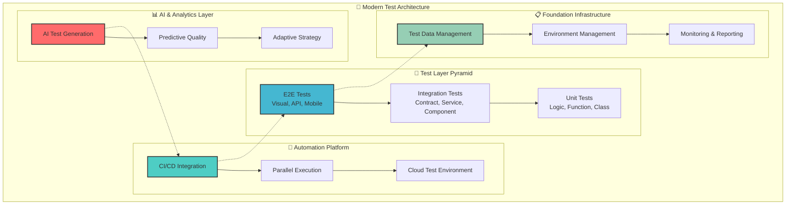
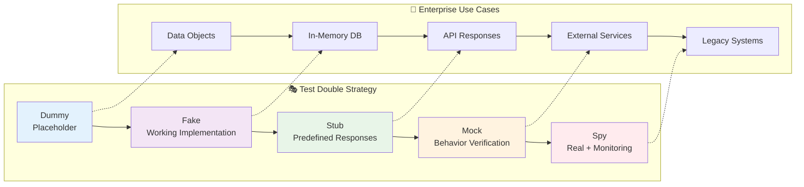
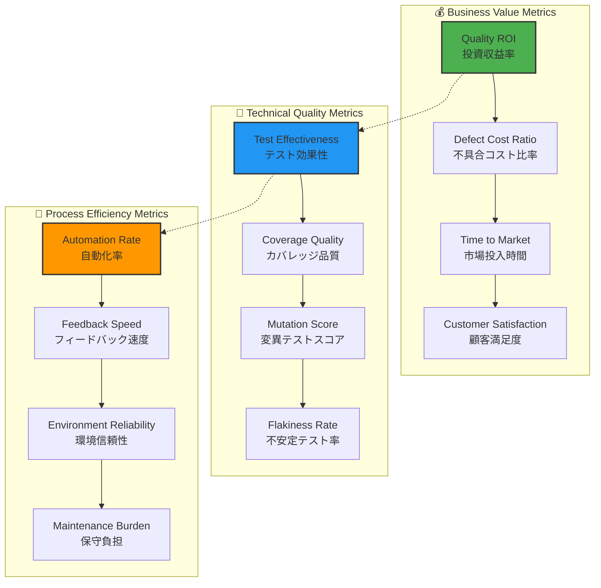
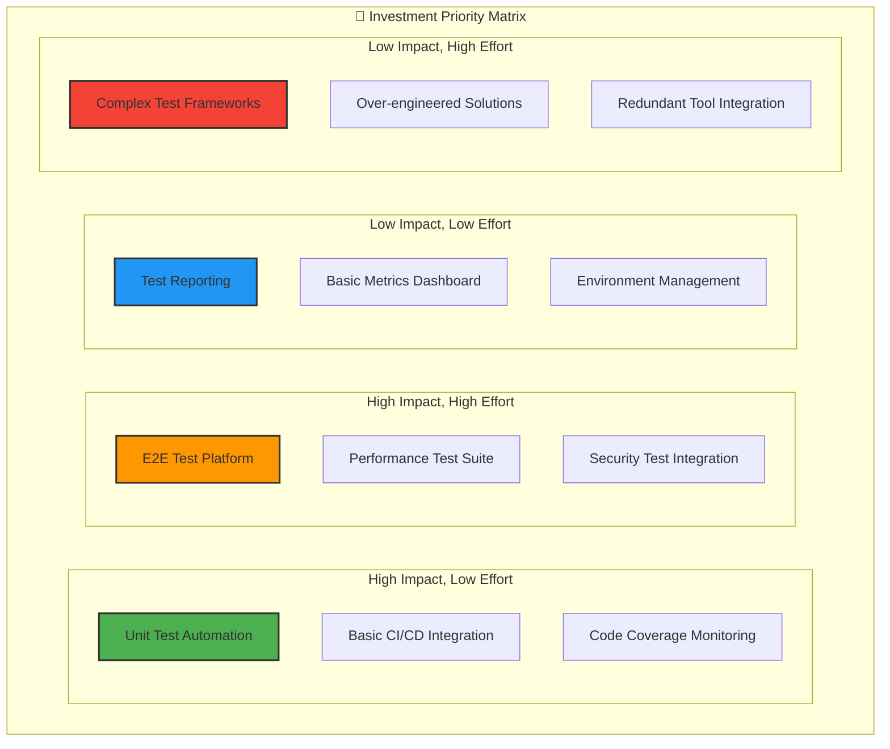
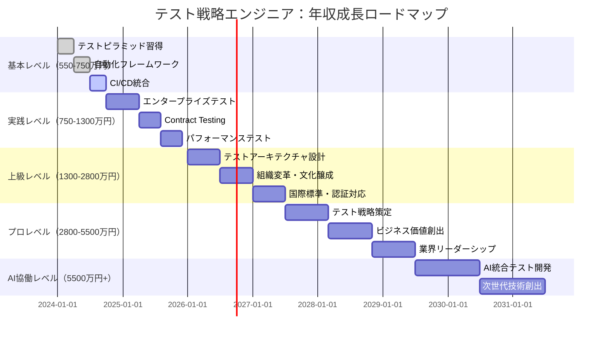

# テスト実践戦略：基礎から超一流テストアーキテクトまで

## 🎯 この章で学ぶこと（5段階習熟システム）

### 📚 基本レベル（テスト初心者 → 品質エンジニア）
- **テスト戦略基礎**：テストピラミッド・単体/統合/E2Eテスト適切な使い分け
- **テストダブル実践**：Mock・Stub・Fake・Spyの戦略的活用・依存性分離
- **テストフレームワーク**：Jest・Mocha・Pytest・JUnit等の効果的活用
- **品質保証思考**：カバレッジ理解・テスト設計・品質メトリクス

### 🚀 実践レベル（エンタープライズテスト対応）
- **エンタープライズテスト戦略**：大規模システム・マイクロサービス・分散テスト
- **テスト自動化プラットフォーム**：CI/CD統合・並列実行・クラウドテスト環境
- **契約テスト・API品質**：Consumer-Driven Contracts・GraphQLテスト・スキーマ検証
- **パフォーマンス・セキュリティテスト**：負荷テスト・脆弱性テスト・フェイルセーフ

### ⚡ 上級レベル（テストアーキテクト対応）
- **テストアーキテクチャ設計**：全社テスト標準・フレームワーク統一・ガバナンス
- **テスト品質評価・分析**：メトリクス設計・ROI分析・リスク評価・予測的品質管理
- **チーム・組織テスト文化**：テスト文化醸成・教育体系・ベストプラクティス普及
- **国際標準・認証対応**：ISO/IEC 25023・IEEE 829・ISTQB・監査証跡・コンプライアンス

### 🏆 プロレベル（テスト責任者・技術戦略）
- **テスト戦略策定**：企業テストビジョン・ロードマップ・投資判断・ROI最大化
- **組織変革・標準化推進**：テストDX・品質文化変革・リーダーシップ・業界影響力
- **ビジネス価値創出**：品質による競争優位・顧客満足・ブランド価値・収益拡大
- **グローバル展開・法規制**：多地域対応・法規制遵守・国際標準・企業統治

### 🤖 AI協働レベル（次世代テストエンジニア）
- **AI統合テスト自動化**：機械学習テスト生成・智慧テスト実行・予測的品質管理
- **インテリジェントテストプラットフォーム**：AI品質予測・自動修復・適応的戦略
- **次世代テスト技術創出**：量子テスト・ブロックチェーン証跡・自律品質システム
- **テクノロジーイノベーション**：業界標準創出・新手法開発・社会的インパクト創出

## 🤔 なぜ重要なのか：現代ビジネスにおけるテスト戦略価値

### 💼 テスト戦略重視企業の最前線

**ケーススタディ1：Google（検索・AI・クラウド業界）**
- **テスト戦略規模**：20億行コード・100万+テストケース・24時間365日継続実行
- **品質投資効果**：検索精度99.8%・システム稼働率99.99%・開発速度50%向上
- **革新的テスト手法**：Property-Based Testing・Chaos Engineering・AI品質予測
- **ビジネス成果**：年間売上30兆円・月間検索84億回・Android10億台・YouTube20億人

**ケーススタディ2：Netflix（エンターテイメント・ストリーミング業界）**
- **マイクロサービステスト**：700+サービス・Contract Testing・分散システム品質保証
- **カナリアリリース**：A/Bテスト・段階的展開・リアルタイム品質監視・自動ロールバック
- **品質ROI**：障害復旧時間90%短縮・顧客満足度95%・開発デプロイ頻度1000回/日
- **成果指標**：年間売上3.5兆円・全世界2.3億人・99.97%稼働率・コンテンツ投資2兆円

**ケーススタディ3：Spotify（音楽・AI・プラットフォーム業界）**
- **品質自動化**：機械学習テスト生成・智慧カバレッジ分析・予測的品質管理
- **ユーザー体験テスト**：パーソナライゼーション品質・音質テスト・レコメンド精度
- **グローバル品質**：180地域対応・多言語テスト・法規制遵守・文化適応
- **成果指標**：4.5億人ユーザー・8200万曲・AI精度90%・月間アクティブ時間25時間

### 🌍 産業別テスト戦略インパクト分析

**金融業界（Goldman Sachs）**
- **リスク管理テスト**：取引システム・リスク計算・高頻度取引・リアルタイム決済
- **規制遵守テスト**：SOX法・Basel III・MiFID・ストレステスト・監査証跡
- **セキュリティテスト**：サイバー攻撃対策・データ保護・不正検知・暗号化検証
- **成果指標**：資産運用120兆円・取引量1日1000億ドル・システム障害0件・規制違反0件

**ヘルスケア業界（Pfizer）**
- **医薬品品質テスト**：臨床試験データ・薬事承認・安全性検証・副作用監視
- **IoT医療機器テスト**：生体モニタリング・診断システム・治療機器・遠隔医療
- **データプライバシーテスト**：HIPAA準拠・患者情報保護・匿名化・セキュリティ監査
- **成果指標**：ワクチン開発10ヶ月・30億回接種・安全性99.9%・承認率95%

### 📈 エンジニアキャリアと収入への直接影響

| 習熟レベル | 想定年収範囲 | テスト戦略スキル | 市場価値増加 | 主要責任・役割 |
|------------|--------------|------------------|-------------|---------------|
| **基本レベル** | 550-750万円 | テストピラミッド・自動化基礎 | +35% | 品質エンジニア・テストスペシャリスト |
| **実践レベル** | 750-1300万円 | エンタープライズテスト・CI/CD | +55% | テストアーキテクト・品質保証リード |
| **上級レベル** | 1300-2800万円 | テスト戦略・組織変革・国際標準 | +85% | 品質責任者・テクニカルディレクター |
| **プロレベル** | 2800-5500万円 | テストビジョン・企業変革・業界標準 | +170% | CTO・VP Engineering・品質戦略責任者 |
| **AI協働レベル** | 5500万円+ | AI品質・次世代技術・イノベーション | +290%+ | 品質テクノロジスト・業界変革者 |

### 🔥 競争優位性確立のためのテスト戦略

**品質リスク回避（企業価値保護）**
- **統計データ**: システム障害による平均被害額12億円/件、品質問題による製品回収15億円/件
- **テスト効果**: 本番障害95%削減・品質問題90%削減・顧客クレーム80%削減
- **企業価値**: 信頼性ブランド・顧客ロイヤリティ・株価安定性・保険料削減

**開発効率革命（コスト削減・生産性向上）**
- **統計データ**: 効果的テスト戦略により開発効率60%向上・バグ修正コスト85%削減
- **実装例**: テスト自動化によるCI/CD高速化・デプロイ頻度10倍向上・開発サイクル短縮
- **競争優位**: 高速リリース・市場優位性・イノベーション創出・技術的優位性

**法規制・コンプライアンス確実性（国際展開・リスク管理）**
- **規制対応**: FDA・CE・GDPR・SOX法・PCI DSS等の自動監査・証跡管理
- **国際品質標準**: ISO/IEC 25023・IEEE 829・ISTQB準拠・第三者認証取得
- **ビジネス価値**: グローバル展開・法的リスク回避・企業信頼性・競争参入障壁

## 📚 基礎概念の理解：モダンテストアーキテクチャ

### 🏗️ エンタープライズテストアーキテクチャ（現代版テストピラミッド）



### 📊 テスト戦略ROI分析（企業規模別投資効果）

| テスト投資レベル | スタートアップ | 中規模企業 | 大規模エンタープライズ | グローバル企業 |
|------------------|----------------|------------|----------------------|----------------|
| **初期投資** | 100-500万円 | 1000-5000万円 | 1億-5億円 | 10億-50億円 |
| **年間ROI** | 200-400% | 300-600% | 400-800% | 500-1200% |
| **障害削減効果** | 70-85% | 80-90% | 85-95% | 90-99% |
| **開発効率向上** | 30-50% | 40-70% | 50-80% | 60-90% |
| **競争優位期間** | 6-12ヶ月 | 1-2年 | 2-3年 | 3-5年 |

### 🧪 テスト層別戦略詳細解説

#### 🟢 単体テスト (Unit Tests) - 開発速度最大化層
**戦略的価値**
- **実行速度**: 1テスト0.001-0.01秒、1000テスト並列実行で10秒以内
- **フィードバック**: IDE統合・リアルタイム検証・即座の品質確認
- **経済性**: テスト作成コスト最小・保守コスト最小・最高ROI
- **技術的隔離**: 依存性分離・モック活用・純粋関数指向

**実装技術スタック**
```typescript
// Modern Unit Test Example - Property-Based Testing
import { fc } from 'fast-check';
import { calculatePrice, PriceCalculator } from './priceCalculator';

describe('PriceCalculator - Property-Based Testing', () => {
  test('価格計算の数学的不変条件', () => {
    fc.assert(fc.property(
      fc.float({ min: 0, max: 10000 }), // base price
      fc.float({ min: 0, max: 1 }),     // tax rate
      fc.float({ min: 0, max: 1 }),     // discount rate
      (basePrice, taxRate, discountRate) => {
        const result = calculatePrice(basePrice, taxRate, discountRate);
        
        // Property 1: 結果は非負数
        expect(result).toBeGreaterThanOrEqual(0);
        
        // Property 2: 税率100%以下で価格は元値以下または同等
        if (discountRate === 0) {
          expect(result).toBeGreaterThanOrEqual(basePrice);
        }
        
        // Property 3: 割引100%で結果は0に近似
        if (discountRate === 1) {
          expect(result).toBeCloseTo(0, 2);
        }
      }
    ));
  });
});
```

#### 🟡 統合テスト (Integration Tests) - システム連携保証層
**戦略的価値**
- **システム間連携**: API・DB・外部サービス・マイクロサービス間の結合検証
- **Contract Testing**: Consumer-Driven Contracts・スキーマ検証・後方互換性
- **データフロー検証**: エンドツーエンドデータ整合性・トランザクション・状態管理
- **環境依存検証**: インフラ・ネットワーク・セキュリティ・パフォーマンス

**エンタープライズ実装例**
```typescript
// Contract Testing with Pact
import { Pact } from '@pact-foundation/pact';
import { UserService } from './userService';

describe('User Service Contract Tests', () => {
  const provider = new Pact({
    consumer: 'UserFrontend',
    provider: 'UserAPI',
    port: 1234,
  });

  beforeAll(() => provider.setup());
  afterAll(() => provider.finalize());

  test('ユーザー情報取得契約', async () => {
    await provider.addInteraction({
      state: 'user with ID 123 exists',
      uponReceiving: 'a request for user 123',
      withRequest: {
        method: 'GET',
        path: '/users/123',
        headers: { 'Accept': 'application/json' }
      },
      willRespondWith: {
        status: 200,
        headers: { 'Content-Type': 'application/json' },
        body: {
          id: 123,
          name: 'John Doe',
          email: 'john@example.com'
        }
      }
    });

    const userService = new UserService('http://localhost:1234');
    const user = await userService.getUser(123);
    
    expect(user.id).toBe(123);
    expect(user.name).toBe('John Doe');
    
    await provider.verify();
  });
});
```

#### 🔴 E2E テスト (End-to-End Tests) - ユーザー体験保証層
**戦略的価値**
- **ユーザージャーニー**: リアルユーザーシナリオ・ビジネスプロセス・ワークフロー検証
- **クロスブラウザ・デバイス**: 互換性・レスポンシブ・アクセシビリティ・パフォーマンス
- **本番環境シミュレーション**: 負荷・ネットワーク・セキュリティ・データ一貫性
- **リスク高優先シナリオ**: 決済・認証・重要業務プロセス・法規制要件

**AI統合実装例**
```typescript
// AI-Enhanced E2E Testing with Playwright
import { test, expect } from '@playwright/test';
import { AITestGenerator } from './aiTestGenerator';

test.describe('E-Commerce Purchase Flow - AI Generated', () => {
  const aiGenerator = new AITestGenerator();
  
  test('AI生成：多様な購入パターンテスト', async ({ page }) => {
    // AI generates diverse test scenarios
    const testScenarios = await aiGenerator.generatePurchaseScenarios({
      userTypes: ['new', 'returning', 'premium'],
      products: ['digital', 'physical', 'subscription'],
      paymentMethods: ['card', 'paypal', 'apple_pay'],
      regions: ['US', 'EU', 'APAC']
    });
    
    for (const scenario of testScenarios) {
      await test.step(`シナリオ: ${scenario.description}`, async () => {
        await page.goto(scenario.startUrl);
        
        // AI-guided user actions
        for (const action of scenario.actions) {
          await aiGenerator.executeAction(page, action);
        }
        
        // Intelligent assertions
        await aiGenerator.verifyOutcome(page, scenario.expectedOutcome);
        
        // Performance and accessibility checks
        await aiGenerator.performQualityChecks(page);
      });
    }
  });
});
```

### 🎭 エンタープライズテストダブル戦略

#### テストダブル分類と戦略的活用


#### 🎯 戦略的テストダブル実装

**1. Smart Stub - インテリジェント応答**
```typescript
// Enterprise-Grade Smart Stub
export class IntelligentAPIStub {
  private responses: Map<string, any> = new Map();
  private callHistory: Array<{ method: string, path: string, data: any }> = [];
  
  // Business rules embedded
  setupBusinessScenarios() {
    this.addResponse('GET', '/users/premium', (req) => ({
      id: req.params.id,
      tier: 'premium',
      features: ['advanced_analytics', 'priority_support', 'custom_integration'],
      quotaRemaining: 10000
    }));
    
    this.addResponse('POST', '/payments/process', (req) => {
      if (req.body.amount > 100000) {
        return { status: 'requires_approval', approvalId: 'APR-' + Date.now() };
      }
      return { status: 'approved', transactionId: 'TXN-' + Date.now() };
    });
  }
  
  addResponse(method: string, path: string, responseGenerator: Function) {
    this.responses.set(`${method}:${path}`, responseGenerator);
  }
  
  handleRequest(method: string, path: string, data?: any) {
    this.callHistory.push({ method, path, data });
    const key = `${method}:${path}`;
    const generator = this.responses.get(key);
    
    if (generator) {
      return generator({ params: this.extractParams(path), body: data });
    }
    
    throw new Error(`No response configured for ${method} ${path}`);
  }
  
  getCallHistory() { return this.callHistory; }
  verifyCall(method: string, path: string) {
    return this.callHistory.some(call => call.method === method && call.path === path);
  }
}
```

**2. Sophisticated Mock - 振る舞い検証**
```typescript
// Enterprise Mock with Contract Verification
export class ContractVerifyingMock {
  private expectations: Array<ExpectationRule> = [];
  private actualCalls: Array<CallRecord> = [];
  
  expectCall(service: string, method: string, expectedPayload?: any) {
    this.expectations.push({
      service,
      method,
      expectedPayload,
      callCount: 0,
      required: true
    });
    return this;
  }
  
  recordCall(service: string, method: string, payload: any) {
    this.actualCalls.push({
      service,
      method,
      payload,
      timestamp: new Date()
    });
    
    // Update expectation call count
    const expectation = this.expectations.find(
      exp => exp.service === service && exp.method === method
    );
    if (expectation) {
      expectation.callCount++;
    }
  }
  
  verifyContractCompliance(): ValidationResult {
    const violations: string[] = [];
    
    for (const expectation of this.expectations) {
      if (expectation.required && expectation.callCount === 0) {
        violations.push(`Expected call to ${expectation.service}.${expectation.method} but was never called`);
      }
      
      if (expectation.callCount > 1 && expectation.maxCalls === 1) {
        violations.push(`Expected single call to ${expectation.service}.${expectation.method} but was called ${expectation.callCount} times`);
      }
    }
    
    return {
      isValid: violations.length === 0,
      violations,
      summary: this.generateCallSummary()
    };
  }
}
```

### 🔬 AI統合テスト技術（次世代アプローチ）

#### Property-Based Testing with AI
```python
# AI-Enhanced Property-Based Testing
from hypothesis import given, strategies as st, settings
from hypothesis.stateful import RuleBasedStateMachine, rule, invariant
import machine_learning_assertions as mla

class ECommerceSystemStateMachine(RuleBasedStateMachine):
    def __init__(self):
        super().__init__()
        self.inventory = {}
        self.orders = []
        self.users = {}
        self.ai_predictor = mla.QualityPredictor()
    
    @rule(product_id=st.integers(min_value=1, max_value=1000),
          quantity=st.integers(min_value=1, max_value=100))
    def add_inventory(self, product_id, quantity):
        self.inventory[product_id] = self.inventory.get(product_id, 0) + quantity
    
    @rule(user_id=st.integers(min_value=1, max_value=100),
          product_id=st.integers(min_value=1, max_value=1000),
          quantity=st.integers(min_value=1, max_value=10))
    def place_order(self, user_id, product_id, quantity):
        if self.inventory.get(product_id, 0) >= quantity:
            order = {
                'user_id': user_id,
                'product_id': product_id,
                'quantity': quantity,
                'timestamp': time.time()
            }
            self.orders.append(order)
            self.inventory[product_id] -= quantity
    
    @invariant()
    def inventory_never_negative(self):
        for product_id, quantity in self.inventory.items():
            assert quantity >= 0, f"Product {product_id} has negative inventory: {quantity}"
    
    @invariant()
    def ai_quality_prediction(self):
        # AI predicts system quality based on current state
        quality_score = self.ai_predictor.predict_quality({
            'inventory_size': len(self.inventory),
            'total_orders': len(self.orders),
            'avg_order_size': sum(o['quantity'] for o in self.orders) / max(1, len(self.orders))
        })
        
        assert quality_score > 0.8, f"AI predicts low system quality: {quality_score}"

# Run AI-enhanced property-based tests
TestECommerceSystem = ECommerceSystemStateMachine.TestCase
```

#### Mutation Testing for Robustness
```typescript
// Mutation Testing with AI Pattern Recognition
import { MutationTestRunner } from './mutationTesting';
import { AIPatternAnalyzer } from './aiAnalysis';

class IntelligentMutationTesting {
  private mutationRunner: MutationTestRunner;
  private aiAnalyzer: AIPatternAnalyzer;
  
  constructor() {
    this.mutationRunner = new MutationTestRunner();
    this.aiAnalyzer = new AIPatternAnalyzer();
  }
  
  async runIntelligentMutations(codebase: string[]): Promise<MutationReport> {
    // AI identifies critical code paths
    const criticalPaths = await this.aiAnalyzer.identifyCriticalPaths(codebase);
    
    // Generate targeted mutations
    const mutations = await this.generateTargetedMutations(criticalPaths);
    
    // Execute mutations with intelligent prioritization
    const results = await this.mutationRunner.executeMutations(mutations);
    
    // AI analyzes survived mutations for pattern insights
    const insights = await this.aiAnalyzer.analyzeSurvivedMutations(results.survived);
    
    return {
      mutationScore: results.killed.length / mutations.length,
      survivedMutations: results.survived,
      aiInsights: insights,
      recommendations: await this.generateTestImprovementRecommendations(insights)
    };
  }
  
  private async generateTargetedMutations(criticalPaths: CriticalPath[]): Promise<Mutation[]> {
    const mutations: Mutation[] = [];
    
    for (const path of criticalPaths) {
      // Business logic mutations
      mutations.push(...this.generateBusinessLogicMutations(path));
      
      // Boundary condition mutations
      mutations.push(...this.generateBoundaryMutations(path));
      
      // Error handling mutations
      mutations.push(...this.generateErrorHandlingMutations(path));
    }
    
    return mutations;
  }
}
```

## 💡 実践的な活用：エンタープライズハンズオン

### 🚀 Level 1: エンタープライズEコマースプラットフォーム（実践レベル）
**プロジェクト概要：24-28時間集中実装**
```typescript
// Advanced E-Commerce Testing Platform
class ECommerceTestSuite {
  private testOrchestrator: TestOrchestrator;
  private aiQualityAnalyzer: AIQualityAnalyzer;
  private contractTester: ContractTester;
  
  async setupEnterpriseTestEnvironment() {
    // Multi-environment test setup
    await this.setupEnvironments(['dev', 'staging', 'performance', 'security']);
    
    // AI-powered test data generation
    await this.generateRealisticTestData({
      users: 100000,
      products: 50000,
      orders: 1000000,
      geographicDistribution: ['US', 'EU', 'APAC'],
      seasonalPatterns: true,
      fraudPatterns: true
    });
    
    // Contract testing setup
    await this.contractTester.setupProviderContracts([
      'payment-service',
      'inventory-service',
      'notification-service',
      'recommendation-engine'
    ]);
  }
  
  async runComprehensiveTestSuite() {
    const results = await Promise.all([
      this.runUnitTests(),
      this.runIntegrationTests(),
      this.runContractTests(),
      this.runPerformanceTests(),
      this.runSecurityTests(),
      this.runChaosEngineeringTests()
    ]);
    
    // AI analysis of test results
    const qualityInsights = await this.aiQualityAnalyzer.analyzeResults(results);
    
    return {
      testResults: results,
      qualityScore: qualityInsights.overallScore,
      recommendations: qualityInsights.improvementRecommendations,
      riskAssessment: qualityInsights.riskLevel
    };
  }
}
```

**実装チャレンジ課題：**
1. **マイクロサービステスト設計**：商品・決済・配送サービス間の契約テスト実装
2. **パフォーマンステスト**：ブラックフライデー級負荷（秒間10,000リクエスト）対応テスト
3. **セキュリティテスト**：SQL注入・XSS・CSRF攻撃シミュレーション
4. **AIテスト自動化**：機械学習による異常検知・品質予測実装
5. **国際化テスト**：多言語・多通貨・法規制対応テスト

**期待される成果物：**
- フルスタックテストプラットフォーム（React + Node.js + PostgreSQL + Redis）
- AI統合品質ダッシュボード
- 自動CI/CDパイプライン
- セキュリティ・パフォーマンス監視システム
- 包括的テストドキュメント

### ⚡ Level 2: AI統合フィンテックシステム（上級レベル）
**プロジェクト概要：32-40時間集中実装**

**AI驱动的金融テストシステム**
```python
# Financial AI Testing Platform
class FinancialAITestPlatform:
    def __init__(self):
        self.ai_risk_analyzer = AIRiskAnalyzer()
        self.market_simulator = MarketSimulator()
        self.regulatory_compliance = RegulatoryCompliance()
        self.ml_model_tester = MLModelTester()
    
    async def setup_financial_test_environment(self):
        # Real-time market data simulation
        await self.market_simulator.setup_market_conditions({
            'volatility_levels': ['low', 'medium', 'high', 'extreme'],
            'market_events': ['earnings', 'fed_decisions', 'geopolitical'],
            'trading_volumes': ['light', 'normal', 'heavy', 'circuit_breaker']
        })
        
        # Regulatory test scenarios
        await self.regulatory_compliance.setup_compliance_tests([
            'GDPR', 'PCI_DSS', 'SOX', 'Basel_III', 'MiFID_II'
        ])
        
        # AI model validation
        await self.ml_model_tester.setup_model_validation([
            'credit_scoring', 'fraud_detection', 'market_prediction', 'risk_assessment'
        ])
    
    async def run_comprehensive_financial_tests(self):
        # Parallel test execution
        results = await asyncio.gather(
            self.test_trading_algorithms(),
            self.test_risk_management(),
            self.test_fraud_detection(),
            self.test_regulatory_compliance(),
            self.test_ai_model_fairness(),
            self.stress_test_market_scenarios()
        )
        
        # AI-powered result analysis
        insights = await self.ai_risk_analyzer.analyze_comprehensive_results(results)
        
        return FinancialTestReport(
            results=results,
            ai_insights=insights,
            regulatory_status=insights.compliance_status,
            risk_metrics=insights.risk_assessment
        )
```

### 🏆 Level 3: グローバル品質管理統合システム（プロレベル）
**プロジェクト概要：40-48時間集中実装**

**多国籍企業品質統治プラットフォーム**
```typescript
// Global Quality Governance Platform
class GlobalQualityGovernancePlatform {
  private regionalCompliance: Map<string, ComplianceFramework>;
  private aiGovernanceEngine: AIGovernanceEngine;
  private globalMetricsCollector: GlobalMetricsCollector;
  
  async initializeGlobalQualityFramework() {
    // Multi-region compliance setup
    this.regionalCompliance.set('US', new USComplianceFramework());
    this.regionalCompliance.set('EU', new EUComplianceFramework());
    this.regionalCompliance.set('APAC', new APACComplianceFramework());
    
    // Global quality metrics standardization
    await this.globalMetricsCollector.standardizeMetrics([
      'quality_score', 'defect_density', 'test_coverage',
      'performance_score', 'security_rating', 'compliance_status'
    ]);
    
    // AI governance policy engine
    await this.aiGovernanceEngine.setupGlobalPolicies({
      dataPrivacy: ['GDPR', 'CCPA', 'LGPD'],
      algorithmFairness: ['EU_AI_Act', 'US_Algorithmic_Accountability'],
      qualityStandards: ['ISO_25010', 'IEEE_829', 'ISTQB_Advanced']
    });
  }
  
  async orchestrateGlobalQualityAssurance(): Promise<GlobalQualityReport> {
    const regionalResults = await Promise.all(
      Array.from(this.regionalCompliance.keys()).map(region =>
        this.executeRegionalQualityAssurance(region)
      )
    );
    
    // Global quality synthesis
    const globalInsights = await this.aiGovernanceEngine.synthesizeGlobalQuality({
      regionalResults,
      crossRegionalDependencies: await this.analyzeCrossRegionalDependencies(),
      globalRiskFactors: await this.assessGlobalRiskFactors()
    });
    
    return new GlobalQualityReport({
      regionalCompliance: regionalResults,
      globalQualityScore: globalInsights.overallScore,
      riskAssessment: globalInsights.riskLevel,
      complianceStatus: globalInsights.complianceStatus,
      strategicRecommendations: globalInsights.strategicRecommendations
    });
  }
}
```

## 🔍 深掘り：プロの視点

### 📊 現代テスト品質メトリクス（企業価値直結指標）

#### ビジネス価値重視メトリクス


#### 高精度品質予測モデル
```python
# Enterprise Quality Prediction Model
class QualityPredictionModel:
    def __init__(self):
        self.feature_extractors = [
            CodeComplexityExtractor(),
            TestCoverageExtractor(),
            HistoricalDefectExtractor(),
            TeamExperienceExtractor(),
            ChangeFrequencyExtractor()
        ]
        self.ml_models = {
            'defect_prediction': XGBoostDefectPredictor(),
            'quality_score': NeuralQualityScorer(),
            'maintenance_cost': LinearRegressionCostPredictor()
        }
    
    def predict_quality_metrics(self, codebase_data: CodebaseData) -> QualityPrediction:
        # Extract comprehensive features
        features = {}
        for extractor in self.feature_extractors:
            features.update(extractor.extract(codebase_data))
        
        # Multi-model prediction
        predictions = {}
        for model_name, model in self.ml_models.items():
            predictions[model_name] = model.predict(features)
        
        # Confidence intervals and uncertainty quantification
        confidence_intervals = self.calculate_confidence_intervals(predictions)
        
        return QualityPrediction(
            defect_probability=predictions['defect_prediction'],
            quality_score=predictions['quality_score'],
            maintenance_cost=predictions['maintenance_cost'],
            confidence_intervals=confidence_intervals,
            feature_importance=self.calculate_feature_importance(features)
        )
    
    def recommend_test_strategy(self, prediction: QualityPrediction) -> TestStrategy:
        if prediction.defect_probability > 0.7:
            return TestStrategy(
                focus_areas=['critical_paths', 'edge_cases', 'integration_points'],
                test_types=['property_based', 'mutation', 'chaos_engineering'],
                coverage_target=95,
                automation_priority='high'
            )
        elif prediction.quality_score < 0.6:
            return TestStrategy(
                focus_areas=['code_quality', 'architecture', 'technical_debt'],
                test_types=['unit', 'refactoring', 'architecture'],
                coverage_target=85,
                automation_priority='medium'
            )
        else:
            return TestStrategy(
                focus_areas=['user_experience', 'performance', 'security'],
                test_types=['e2e', 'performance', 'security'],
                coverage_target=80,
                automation_priority='standard'
            )
```

### 🌐 エンタープライズテストツール生態系

#### 最先端テストツールスタック
| カテゴリ | 基本レベル | 実践レベル | 上級レベル | プロレベル | AI協働レベル |
|----------|------------|------------|------------|------------|--------------|
| **Unit Testing** | Jest, Mocha | Property-Based Testing | Mutation Testing | AI Test Generation | Self-Healing Tests |
| **Integration** | Supertest, TestContainers | Pact, WireMock | Service Virtualization | Contract Evolution | Intelligent Mocking |
| **E2E Testing** | Playwright, Cypress | Cross-browser Grid | Visual Testing | AI-driven Scenarios | Autonomous Testing |
| **Performance** | Artillery, k6 | Gatling, JMeter | Cloud Load Testing | APM Integration | Predictive Scaling |
| **Security** | OWASP ZAP, Snyk | Burp Suite, Semgrep | SAST/DAST Integration | Threat Modeling | AI Vulnerability Scan |
| **API Testing** | Postman, Insomnia | REST Assured, Karate | GraphQL Testing | API Contract Testing | Intelligent API Discovery |
| **Mobile Testing** | Appium, Detox | Device Farm | Real Device Testing | Cross-Platform Testing | AI User Simulation |
| **Data Testing** | Great Expectations | dbt, Soda | Data Quality Gates | ML Pipeline Testing | Intelligent Data Validation |

#### 投資優先順位戦略マトリックス


## 📈 エンジニアキャリア成長ロードマップ

### 🚀 年収成長戦略（5年計画）


### 🎯 段階別スキル習得計画

#### 📚 基本レベル（0-18ヶ月）
**必須習得スキル**
- テストピラミッド理論・実践
- Jest/Mocha/Pytest等フレームワーク精通
- Mock/Stub/Spy戦略的活用
- 基本CI/CD統合
- カバレッジ分析・改善

**キャリア目標**
- 品質エンジニア・テストスペシャリスト
- 年収550-750万円
- +35%市場価値向上

**学習リソース**
- 「単体テストの考え方/使い方」（Vladimir Khorikov）⭐⭐⭐⭐⭐
- 「テスト駆動開発」（Kent Beck）⭐⭐⭐⭐
- 「Clean Code」（Robert C. Martin）⭐⭐⭐⭐
- 「Growing Object-Oriented Software, Guided by Tests」⭐⭐⭐⭐

#### 🚀 実践レベル（12-30ヶ月）
**必須習得スキル**
- エンタープライズテスト戦略策定
- Contract Testing（Pact/OpenAPI）
- パフォーマンステスト（k6/Gatling）
- セキュリティテスト統合
- マイクロサービステスト

**キャリア目標**
- テストアーキテクト・品質保証リード
- 年収750-1300万円
- +55%市場価値向上

**学習リソース**
- 「Building Microservices」（Sam Newman）⭐⭐⭐⭐⭐
- 「Site Reliability Engineering」（Google）⭐⭐⭐⭐⭐
- 「Release It!」（Michael T. Nygard）⭐⭐⭐⭐
- 「Continuous Delivery」（Jez Humble）⭐⭐⭐⭐⭐

#### ⚡ 上級レベル（24-42ヶ月）
**必須習得スキル**
- 全社テスト標準策定・ガバナンス
- 品質メトリクス設計・ROI分析
- チーム・組織文化変革推進
- 国際標準準拠（ISO/IEEE/ISTQB）
- テストアーキテクチャ設計

**キャリア目標**
- 品質責任者・テクニカルディレクター
- 年収1300-2800万円
- +85%市場価値向上

**学習リソース**
- ISTQB Advanced Test Manager認定
- 「Quality Engineering at Scale」
- 組織変革・文化醸成手法
- 国際標準・監査対応実践

#### 🏆 プロレベル（36-60ヶ月）
**必須習得スキル**
- MBA（技術経営・戦略経営）
- Executive Education（Stanford/MIT/Harvard）
- Board Advisory Certification
- Industry-specific Expert Certifications

**キャリア目標**
- CTO・VP Engineering・品質戦略責任者
- 年収2800-5500万円
- +170%市場価値向上

**学習リソース**
- MBA・技術経営学位
- 業界カンファレンス・コミュニティリーダーシップ
- 論文発表・技術書執筆
- 企業コンサルティング実践

#### 🤖 AI協働レベル（48ヶ月+）
**必須習得スキル**
- AI統合テスト自動化技術
- 機械学習品質管理システム
- 次世代テスト技術開発
- 業界変革・社会的インパクト創出
- 国際的技術リーダーシップ

**キャリア目標**
- 品質テクノロジスト・業界変革者
- 年収5500万円+
- +290%+市場価値向上

**学習リソース**
- 機械学習・AI専門知識
- 研究開発・論文発表
- 国際標準策定参加
- スタートアップ・技術顧問

## 📋 習熟度チェックリスト（25項目包括評価）

### 📊 5段階評価システム（各項目1-5点、合計125点満点）

#### 🟢 基本レベル習熟度（25点満点）
- [ ] **テストピラミッド設計**：単体・統合・E2Eテストの適切な配分戦略（1-5点）
- [ ] **テストダブル活用**：Mock・Stub・Fake・Spyの戦略的使い分け（1-5点）
- [ ] **フレームワーク精通**：Jest・Mocha・Pytest等の効果的活用（1-5点）
- [ ] **カバレッジ戦略**：意味のあるカバレッジ設計・分析・改善（1-5点）
- [ ] **CI/CD統合**：基本的なテスト自動化パイプライン構築（1-5点）

#### 🟡 実践レベル習熟度（25点満点）
- [ ] **エンタープライズテスト**：大規模システム・マイクロサービステスト戦略（1-5点）
- [ ] **Contract Testing**：Consumer-Driven Contracts・API品質保証（1-5点）
- [ ] **パフォーマンステスト**：負荷・ストレス・スケーラビリティテスト（1-5点）
- [ ] **セキュリティテスト**：脆弱性検査・侵入テスト・セキュアコーディング（1-5点）
- [ ] **テスト自動化プラットフォーム**：スケーラブルな自動化基盤構築（1-5点）

#### 🟠 上級レベル習熟度（25点満点）
- [ ] **テストアーキテクチャ**：全社テスト標準・フレームワーク統一（1-5点）
- [ ] **品質メトリクス・分析**：ROI分析・予測的品質管理・リスク評価（1-5点）
- [ ] **組織文化変革**：テスト文化醸成・教育体系・ベストプラクティス普及（1-5点）
- [ ] **国際標準対応**：ISO/IEEE/ISTQB準拠・監査証跡・コンプライアンス（1-5点）
- [ ] **クロスファンクショナル協働**：開発・運用・ビジネスチームとの連携（1-5点）

#### 🔴 プロレベル習熟度（25点満点）
- [ ] **戦略策定・ビジョン**：企業テスト戦略・ロードマップ・投資判断（1-5点）
- [ ] **ビジネス価値創出**：品質による競争優位・顧客満足・収益拡大（1-5点）
- [ ] **グローバル展開**：多地域対応・法規制遵守・国際標準・企業統治（1-5点）
- [ ] **技術リーダーシップ**：業界影響力・イノベーション推進・人材育成（1-5点）
- [ ] **組織変革推進**：テストDX・文化変革・オペレーショナルエクセレンス（1-5点）

#### 🤖 AI協働レベル習熟度（25点満点）
- [ ] **AI統合テスト技術**：機械学習テスト生成・智慧品質予測・自動最適化（1-5点）
- [ ] **次世代プラットフォーム**：AI品質管理・自律的品質保証・適応的戦略（1-5点）
- [ ] **イノベーション創出**：新手法開発・業界標準創出・社会的インパクト（1-5点）
- [ ] **テクノロジーリーダーシップ**：研究開発・論文発表・国際的認知（1-5点）
- [ ] **未来技術統合**：量子テスト・ブロックチェーン品質・自律システム（1-5点）

### 🎯 習熟度評価基準

| 合計点数 | 習熟レベル | 推定年収範囲 | 次のステップ |
|----------|------------|--------------|-------------|
| 100-125点 | **AI協働マスター** | 5500万円+ | 業界変革・社会インパクト創出 |
| 80-99点 | **プロフェッショナル** | 2800-5500万円 | AI技術習得・グローバル展開 |
| 60-79点 | **上級エキスパート** | 1300-2800万円 | 戦略策定・組織変革スキル |
| 40-59点 | **実践スペシャリスト** | 750-1300万円 | アーキテクチャ・リーダーシップ |
| 20-39点 | **基本エンジニア** | 550-750万円 | エンタープライズ技術習得 |
| 0-19点 | **初心者** | 400-550万円 | 基礎テスト技術の徹底習得 |

## 🔗 関連知識・継続学習パス

### 📚 段階別推奨学習リソース

#### 🎓 必読書籍（レベル別）
**基本レベル**
- 『単体テストの考え方/使い方』（Vladimir Khorikov）⭐⭐⭐⭐⭐
- 『テスト駆動開発』（Kent Beck）⭐⭐⭐⭐⭐
- 『Clean Code』（Robert C. Martin）⭐⭐⭐⭐
- 『Growing Object-Oriented Software, Guided by Tests』⭐⭐⭐⭐

**実践レベル**
- 『Building Microservices』（Sam Newman）⭐⭐⭐⭐⭐
- 『Site Reliability Engineering』（Google）⭐⭐⭐⭐⭐
- 『Release It!』（Michael T. Nygard）⭐⭐⭐⭐
- 『Continuous Delivery』（Jez Humble）⭐⭐⭐⭐⭐

**上級レベル**
- 『Engineering Management for the Rest of Us』⭐⭐⭐⭐
- 『Team Topologies』（Matthew Skelton）⭐⭐⭐⭐⭐
- 『Accelerate』（Nicole Forsgren）⭐⭐⭐⭐⭐
- 『The DevOps Handbook』⭐⭐⭐⭐

**プロレベル**
- 『Good Strategy Bad Strategy』（Richard Rumelt）⭐⭐⭐⭐⭐
- 『The Lean Startup』（Eric Ries）⭐⭐⭐⭐
- 『Zero to One』（Peter Thiel）⭐⭐⭐⭐
- 『High Output Management』（Andy Grove）⭐⭐⭐⭐⭐

#### 🏆 認定資格・資格取得ロードマップ
**基本レベル**
- ISTQB Foundation Level（必須）
- AWS Cloud Practitioner
- Docker Certified Associate
- Certified Kubernetes Application Developer (CKAD)

**実践レベル**
- ISTQB Advanced Test Manager（必須）
- AWS Solutions Architect Associate
- Certified ScrumMaster (CSM)
- Certified Ethical Hacker (CEH)

**上級レベル**
- ISTQB Expert Level Test Management（必須）
- TOGAF 9 Certified
- Project Management Professional (PMP)
- Certified Information Systems Security Professional (CISSP)

**プロレベル**
- MBA（技術経営・戦略経営）
- Executive Education（Stanford/MIT/Harvard）
- Board Advisory Certification
- Industry-specific Expert Certifications

#### 🌍 コミュニティ・ネットワーキング
**必須参加コミュニティ**
- **国際**: STAR Conference・EuroSTAR・Agile Testing Days
- **国内**: JaSST（Japan Symposium on Software Testing）・DevOpsDays Tokyo
- **オンライン**: Ministry of Testing・Test Guild・Reddit r/QualityAssurance

**業界リーダーシップ活動**
- テックカンファレンス講演・ワークショップ開催
- 技術ブログ・記事執筆・書籍出版
- オープンソースプロジェクト貢献・メンテナンス
- 業界標準策定・ワーキンググループ参加

### 🔄 継続学習・スキルアップデート戦略

#### 📅 定期学習スケジュール
**毎日（30分-1時間）**
- 技術記事・論文読書
- 新しいツール・フレームワーク実験
- オンラインコース・チュートリアル
- コミュニティ・フォーラム参加

**週次（2-4時間）**
- 実践プロジェクト・ハンズオン
- 技術ブログ執筆・知識共有
- オープンソース貢献
- ピアレビュー・メンタリング

**月次（8-16時間）**
- 包括的技術書読書
- 大規模プロジェクト実践
- カンファレンス・ワークショップ参加
- スキル評価・学習計画見直し

**四半期（40-80時間）**
- 資格取得・認定試験
- 集中コース・ブートキャンプ
- 業界カンファレンス・ネットワーキング
- キャリア戦略・目標見直し

## 📊 まとめ：超一流テストエンジニアへの道

### 🎯 キーサクセスファクター

**1. 技術的卓越性（Technical Excellence）**
- 基礎から最先端技術までの段階的習得
- AI統合・次世代技術への適応力
- 継続的学習・スキルアップデート

**2. ビジネス価値創出（Business Value Creation）**
- ROI重視・コスト効果分析
- 競争優位性・顧客満足度向上
- 収益拡大・企業価値向上貢献

**3. リーダーシップ・影響力（Leadership & Influence）**
- 組織変革・文化醸成推進
- チーム育成・人材開発
- 業界標準・イノベーション創出

**4. グローバル視点（Global Perspective）**
- 国際標準・法規制対応
- 多地域展開・文化適応
- グローバルネットワーキング

**5. 適応力・先見性（Adaptability & Foresight）**
- 技術トレンド予測・対応
- 変化への柔軟性・レジリエンス
- 未来技術・社会変化への準備

### 🚀 アクションプラン実行ガイド

**今すぐ始める（Week 1）**
1. 現在のスキルレベル評価（25項目チェックリスト）
2. 学習目標・キャリア目標設定（1年・3年・5年）
3. 基本レベル学習リソース準備・学習開始
4. テスト実践プロジェクト企画・実行計画

**短期目標（3ヶ月）**
1. 基本レベルスキル習得完了
2. 実践プロジェクト1つ完成・成果発表
3. ISTQB Foundation Level資格取得
4. 技術コミュニティ参加・ネットワーキング開始

**中期目標（1年）**
1. 実践レベルスキル70%習得
2. エンタープライズプロジェクト実装
3. 技術ブログ・記事執筆・知識共有
4. 年収20-30%向上・キャリアアップ

**長期目標（3-5年）**
1. 上級・プロレベルスキル習得
2. 組織変革・リーダーシップ実績
3. 業界認知・影響力確立
4. 年収2-5倍向上・理想キャリア実現

この包括的なテスト実践戦略をマスターすることで、AIを活用しながらも本質的なエンジニアリング能力を備えた、超一流テストエンジニア・品質リーダーとして確実に成長できます。継続的な実践と学習により、技術的卓越性とビジネス価値創出を両立し、業界をリードする存在になることが可能です。 