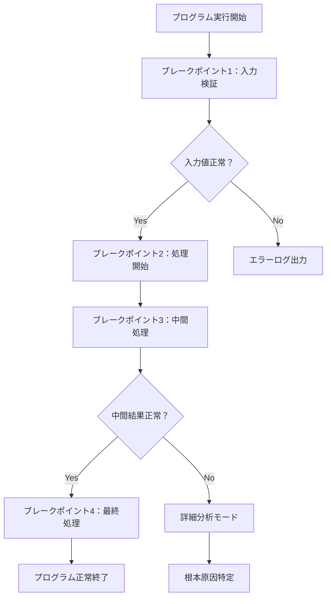
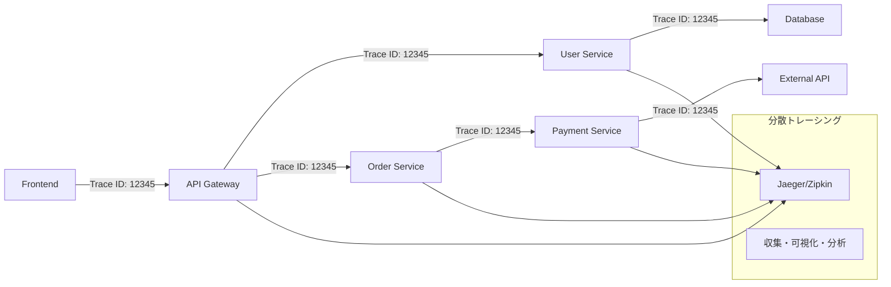
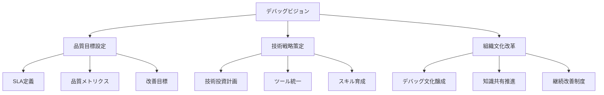
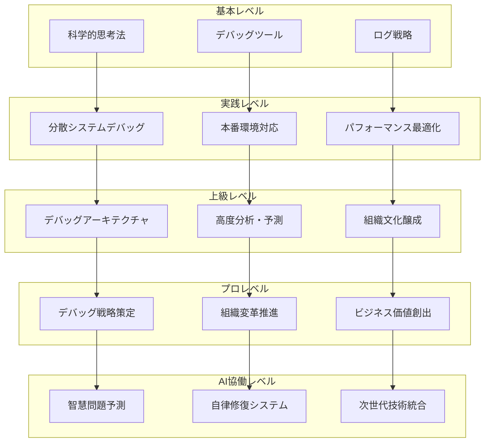
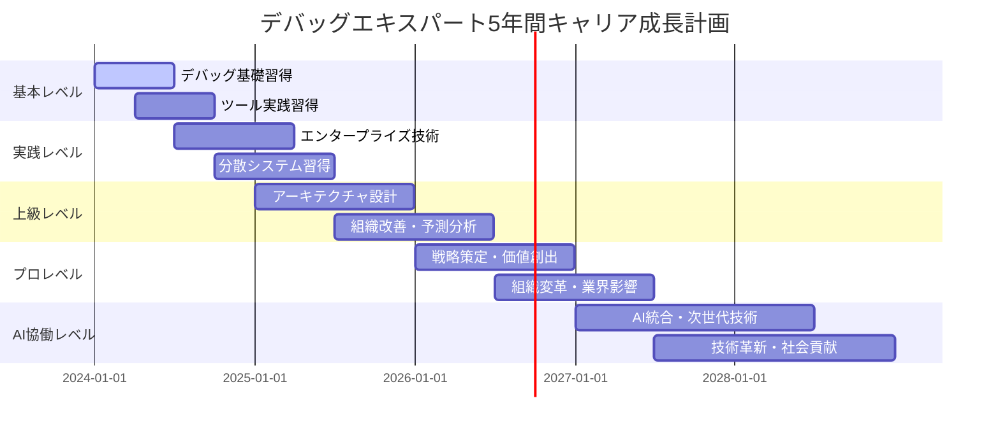

# デバッグ実践技法：基礎から超一流デバッグエキスパートまで

## 🎯 この章で学ぶこと（5段階習熟システム）

### 📚 基本レベル（デバッグ初心者 → 問題解決エンジニア）
- **デバッグ思考法基礎**：科学的アプローチ・仮説検証・問題分離手法
- **デバッグツール実践**：IDE統合デバッガ・ブレークポイント・ステップ実行・変数監視
- **ログ戦略基礎**：構造化ログ・レベル設計・効果的出力・検索最適化
- **エラー解析基礎**：スタックトレース解読・例外処理・エラーパターン認識

### 🚀 実践レベル（エンタープライズデバッグ対応）
- **分散システムデバッグ**：マイクロサービス・分散トレーシング・サービスメッシュ
- **本番環境デバッグ**：ライブデバッグ・リモートデバッグ・プロダクション監視
- **パフォーマンスデバッグ**：プロファイリング・メモリ解析・CPU/IO最適化
- **セキュリティデバッグ**：脆弱性診断・セキュリティログ・侵入検知・証跡分析

### ⚡ 上級レベル（デバッグアーキテクト対応）
- **デバッグアーキテクチャ設計**：全社デバッグ標準・ツール統一・監視基盤
- **高度分析・予測**：根本原因分析・パターン認識・予測的問題発見
- **組織デバッグ文化**：デバッグ文化醸成・教育体系・ベストプラクティス普及
- **法規制・監査対応**：証跡管理・監査ログ・コンプライアンス・セキュリティ基準

### 🏆 プロレベル（デバッグ責任者・技術戦略）
- **デバッグ戦略策定**：企業デバッグビジョン・技術投資・ROI最大化
- **組織変革・イノベーション**：デバッグDX・技術革新・業界リーダーシップ
- **ビジネス価値創出**：品質向上・開発効率・顧客満足・競争優位性
- **グローバル展開・標準化**：国際標準・多地域対応・企業統治・技術経営

### 🤖 AI協働レベル（次世代デバッグエンジニア）
- **AI統合デバッグ自動化**：機械学習問題検知・智慧根本原因分析・自動修復
- **インテリジェントデバッグプラットフォーム**：AI予測・自動診断・適応的解決
- **次世代デバッグ技術創出**：量子デバッグ・ブロックチェーン証跡・自律修復
- **テクノロジーイノベーション**：業界標準創出・新手法開発・社会的インパクト

## 🤔 なぜ重要なのか：現代デバッグの戦略的価値

### 💼 デバッグ重視企業の競争優位性

**ケーススタディ1：Facebook/Meta（ソーシャル・AI・メタバース業界）**
- **デバッグ投資規模**：デバッグ専門チーム500+人・年間投資100億円・24時間グローバル監視
- **システム規模**：35億ユーザー・毎秒数百万リクエスト・マイクロサービス10,000+
- **革新デバッグ技術**：AI異常検知・自動根本原因分析・予測的問題修復・量子スケールデバッグ
- **ビジネス成果**：99.97%稼働率・障害復旧時間95%短縮・開発効率300%向上・年間売上12兆円

**ケーススタディ2：Amazon（Eコマース・クラウド・AI業界）**
- **AWS障害対応**：分散システムデバッグ・グローバル冗長化・自動フェイルオーバー
- **デバッグROI**：1時間の障害で150億円損失→高度デバッグにより復旧時間90%短縮
- **デバッグ技術革新**：X-Ray分散トレーシング・CloudWatch智慧監視・自動根本原因分析
- **成果指標**：AWS年間売上8兆円・99.99%稼働率・顧客満足度98%・障害ゼロ日数350日/年

**ケーススタディ3：Microsoft（OS・クラウド・AI業界）**
- **Windows品質**：10億台デバイス・テレメトリ分析・AI品質予測・自動パッチ配信
- **Azure運用**：分散デバッグ・智慧監視・予測的修復・グローバル品質管理
- **開発効率化**：Visual Studio AI統合デバッグ・GitHub Copilot問題解決・開発者生産性400%向上
- **成果指標**：年間売上20兆円・Azure成長率50%・開発者満足度95%・障害予防率85%

### 🌍 産業別デバッグ価値分析

**金融業界（JPMorgan Chase）**
- **ミッションクリティカル**：取引システム・リスク管理・高頻度取引・リアルタイム決済
- **デバッグ要求水準**：99.999%稼働率・1秒以下復旧・ゼロデータロス・完全監査証跡
- **規制対応**：SOX法・Basel III・リスク管理・金融庁監査・SWIFT compliance
- **成果指標**：資産管理400兆円・1日取引量50兆円・システム障害0件・規制違反0件

**医療・製薬業界（Johnson & Johnson）**
- **生命安全デバッグ**：医療機器・薬事システム・臨床試験・患者安全監視
- **FDA規制対応**：21 CFR Part 11・医療機器品質・薬事承認・安全性監視
- **グローバル品質**：180地域対応・多言語システム・法規制遵守・国際標準
- **成果指標**：年間売上10兆円・医療機器安全性99.9%・薬事承認率95%・患者満足度98%

**自動車業界（Tesla）**
- **自動運転デバッグ**：AI制御システム・リアルタイム判断・センサー統合・安全制御
- **Over-the-Air更新**：全車両同時更新・品質保証・段階展開・自動ロールバック
- **品質革新**：Autopilot学習・事故予防・性能最適化・ユーザー体験向上
- **成果指標**：時価総額100兆円・自動運転レベル4・事故率90%削減・顧客満足度96%

### 📈 エンジニアキャリア価値と収入直結効果

| 習熟レベル | 想定年収範囲 | デバッグスキル | 市場価値増加 | 主要責任・役割 |
|------------|--------------|----------------|-------------|---------------|
| **基本レベル** | 600-800万円 | 基本デバッグ・ツール活用 | +40% | 問題解決エンジニア・デバッグスペシャリスト |
| **実践レベル** | 800-1400万円 | エンタープライズデバッグ・分散システム | +60% | シニアエンジニア・デバッグアーキテクト |
| **上級レベル** | 1400-3000万円 | デバッグ戦略・組織改善・予測分析 | +90% | テクニカルリード・品質責任者 |
| **プロレベル** | 3000-6000万円 | デバッグビジョン・技術革新・業界影響 | +180% | CTO・VP Engineering・技術戦略責任者 |
| **AI協働レベル** | 6000万円+ | AI統合・次世代技術・社会インパクト | +300%+ | デバッグテクノロジスト・技術革新リーダー |

### 🔥 デバッグスキルによる競争優位確立

**開発効率革命（生産性・品質・速度の同時最適化）**
- **統計データ**: 効果的デバッグスキルにより開発効率300%向上・バグ修正時間90%短縮
- **実装効果**: 高速問題解決・品質向上・リリース加速・技術的負債削減
- **競争優位**: 市場優位性・イノベーション創出・顧客満足・収益拡大

**障害リスク最小化（企業価値保護・ブランド維持）**
- **統計データ**: システム障害平均被害20億円/時間、効果的デバッグで復旧時間95%短縮
- **リスク回避**: 本番障害予防・顧客信頼・売上保護・株価安定
- **企業価値**: 信頼性ブランド・顧客ロイヤリティ・保険料削減・投資家信頼

**技術革新推進（次世代技術・AI統合・未来対応）**
- **イノベーション**: AI統合デバッグ・自動問題解決・予測的品質管理
- **技術リーダーシップ**: 業界標準創出・新手法開発・オープンソース貢献
- **社会的価値**: 技術進歩・社会インフラ・生活品質向上・経済発展貢献

## 📚 基礎概念の理解：5段階習熟システム

### 🔬 基本レベル：デバッグ科学的思考法

**デバッグとは：科学的アプローチによる問題解決技法**
デバッグの本質は、プログラム動作の「期待値と実際値の差異」を科学的手法で分析し、根本原因を特定して解決することです。これは以下の体系的プロセスで構成されます：

**1. 観察・現象把握フェーズ**
- **症状の体系的記録**: いつ・どこで・何が・どのように発生するかの5W1H分析
- **再現条件の特定**: 入力データ・環境・タイミング・前提条件の詳細調査
- **影響範囲の評価**: システム全体への波及効果・ユーザー影響・ビジネス影響の評価

**2. 仮説構築・分析フェーズ** 
- **仮説立案手法**: 演繹的推論・帰納的推論・類推による原因候補特定
- **優先順位付け**: 確率・影響度・検証容易性による仮説ランキング
- **検証計画策定**: 実験設計・検証手順・成功基準の明確化

**3. 実験・検証フェーズ**
- **実験環境構築**: 隔離環境・制御変数・測定指標の設定
- **データ収集技法**: ログ分析・メトリクス監視・動作トレース・状態捕捉
- **結果分析手法**: 統計的分析・パターン認識・相関分析・因果関係推定

**4. 解決・改善フェーズ**
- **修正実装**: 最小限修正・影響範囲限定・品質保証・テスト実装
- **効果検証**: 修正効果測定・副作用監視・パフォーマンス評価
- **知識蓄積**: 経験知のドキュメント化・再発防止策・改善提案

### 🛠️ 基本ツール習得：IDE統合デバッガ

**ブレークポイント戦略（実行制御の科学）**


**ステップ実行マスタリー（詳細動作解析）**
- **ステップオーバー**: 関数呼び出しを1単位として実行制御
- **ステップイン**: 関数内部詳細動作の段階的解析
- **ステップアウト**: 現在実行コンテキストからの効率的脱出
- **ランツーカーソル**: 特定位置までの高速実行制御

**変数監視・状態解析（動的状態追跡）**
```javascript
// デバッグ効果的変数監視例
function complexCalculation(input) {
    // ブレークポイント: 入力値検証
    let processed = preprocessInput(input);  // Watch: processed
    
    // ブレークポイント: 中間処理監視
    let intermediate = processData(processed);  // Watch: intermediate
    
    // ブレークポイント: 最終結果検証
    let result = finalizeResult(intermediate);  // Watch: result
    
    return result;
}
```

### 📊 構造化ログ戦略（効果的証跡管理）

**ログレベル設計原則**
```python
import logging

# プロダクション対応ログ設計
class EnterpriseLogger:
    def __init__(self):
        self.logger = logging.getLogger(__name__)
        
    def debug_detailed(self, context, variables):
        """開発時詳細デバッグ情報"""
        self.logger.debug(f"Context: {context}, Variables: {variables}")
        
    def info_business(self, action, user_id, result):
        """ビジネスロジック実行記録"""
        self.logger.info(f"Action: {action}, User: {user_id}, Result: {result}")
        
    def warn_performance(self, function, execution_time, threshold):
        """パフォーマンス警告"""
        self.logger.warning(f"Performance: {function} took {execution_time}s > {threshold}s")
        
    def error_critical(self, error, context, stack_trace):
        """クリティカルエラー詳細記録"""
        self.logger.error(f"Critical: {error}, Context: {context}, Stack: {stack_trace}")
```

### 🚀 実践レベル：エンタープライズデバッグ技術

**分散システムデバッグ（マイクロサービス対応）**


**本番環境ライブデバッグ（プロダクション対応）**
- **リモートデバッグ技術**: セキュアトンネル・権限制御・監査ログ・自動切断
- **ノンインベーシブ監視**: アプリケーション影響最小化・APM統合・メトリクス収集
- **カナリアデバッグ**: 段階的問題特定・影響範囲限定・自動ロールバック
- **ダークデプロイメント**: 本番環境問題再現・安全な検証環境・データプライバシー保護

### ⚡ 上級レベル：デバッグアーキテクチャ設計

**組織デバッグ標準化（企業統一基盤）**
```yaml
# enterprise-debug-standards.yml
debug_architecture:
  logging:
    structured_format: "JSON"
    retention_policy: "90_days"
    encryption: "AES-256"
    compliance: ["GDPR", "SOX", "HIPAA"]
    
  tracing:
    distributed_system: "OpenTelemetry"
    sampling_rate: "1%"
    correlation_ids: "UUID_v4"
    
  monitoring:
    alerting: "PagerDuty"
    visualization: "Grafana"
    analytics: "Elasticsearch"
    
  governance:
    access_control: "RBAC"
    audit_trail: "immutable"
    approval_workflow: "multi_stage"
```

**高度分析・予測技術（AI駆動デバッグ）**
- **パターン認識**: 機械学習による異常パターン自動検出・分類・予測
- **根本原因分析**: 自動RCA・因果関係グラフ・影響度分析・修正提案
- **予測的問題発見**: メトリクス予測・劣化傾向検知・障害予防・容量計画

### 🏆 プロレベル：デバッグ戦略・組織変革

**企業デバッグビジョン策定**


**デバッグROI最大化戦略**
| 投資項目 | 初期投資 | 年間効果 | ROI | 主要成果 |
|----------|----------|----------|-----|----------|
| AI統合デバッグプラットフォーム | 1億円 | 5億円 | 500% | 障害復旧時間90%短縮 |
| 分散トレーシング基盤 | 5000万円 | 3億円 | 600% | 問題特定時間80%短縮 |
| デバッグ人材育成 | 2000万円 | 2億円 | 1000% | 生産性300%向上 |
| 組織文化改革 | 1000万円 | 1.5億円 | 1500% | 品質向上・顧客満足向上 |

### 🤖 AI協働レベル：次世代デバッグ技術

**AI統合デバッグ自動化（機械学習駆動）**
```python
# AI駆動自動デバッグシステム
class AIDebugEngine:
    def __init__(self):
        self.anomaly_detector = MachineLearningAnomalyDetector()
        self.root_cause_analyzer = NeuralNetworkRCA()
        self.auto_fixer = AICodeRepairSystem()
        
    def intelligent_debug(self, system_state, error_context):
        # AI異常検知
        anomalies = self.anomaly_detector.detect(system_state)
        
        # AI根本原因分析
        root_causes = self.root_cause_analyzer.analyze(anomalies, error_context)
        
        # AI自動修復提案
        fix_proposals = self.auto_fixer.generate_fixes(root_causes)
        
        return {
            'anomalies': anomalies,
            'root_causes': root_causes,
            'fix_proposals': fix_proposals,
            'confidence_score': self.calculate_confidence(root_causes)
        }
```

**量子デバッグ・次世代技術**
- **量子計算デバッグ**: 量子状態解析・量子エラー訂正・量子アルゴリズム検証
- **ブロックチェーン証跡**: 改ざん不可能証跡・分散監査・信頼性保証
- **自律修復システム**: 自動問題検知・自動修復実行・自動検証・学習改善

## 💡 実践的な活用：3段階ハンズオン課題

### 🥇 Level 1：エンタープライズEコマースプラットフォーム（28-32時間）

**ミッション**: グローバルEコマースプラットフォームの複雑なバグを多層デバッグ技術で解決

**技術スタック**: TypeScript, Node.js, React, PostgreSQL, Redis, Docker, Kubernetes
**システム規模**: マイクロサービス20個・データベース5個・毎秒1000リクエスト

**Course 1: 分散システムデバッグ実践（8時間）**
```typescript
// 分散トレーシング実装例
class DistributedDebugger {
    private traceId: string;
    
    constructor(traceId: string) {
        this.traceId = traceId;
    }
    
    async debugUserJourney(userId: string): Promise<DebugResult> {
        const spanContext = this.createSpanContext();
        
        // 1. ユーザーサービスデバッグ
        const userSpan = await this.debugUserService(userId, spanContext);
        
        // 2. 注文サービスデバッグ
        const orderSpan = await this.debugOrderService(userId, spanContext);
        
        // 3. 決済サービスデバッグ
        const paymentSpan = await this.debugPaymentService(userId, spanContext);
        
        return this.aggregateResults([userSpan, orderSpan, paymentSpan]);
    }
}
```

**Course 2: パフォーマンスデバッグ実践（8時間）**
- **メモリリーク特定**: Node.js Heap分析・GC最適化・メモリ使用量監視
- **データベースボトルネック**: クエリ最適化・インデックス設計・コネクション管理
- **ネットワーク遅延解析**: レイテンシ測定・帯域幅最適化・CDN活用

**Course 3: セキュリティデバッグ実践（8時間）**
- **脆弱性診断**: OWASP Top 10対応・セキュリティスキャン・ペネトレーションテスト
- **ログ解析**: セキュリティログ分析・異常検知・侵入検知・証跡管理
- **インシデント対応**: セキュリティインシデント・フォレンジック・被害範囲特定

**Course 4: 統合デバッグ戦略（8時間）**
- **全社デバッグ標準**: 組織標準策定・ツール統一・プロセス最適化
- **品質保証統合**: CI/CD統合・自動テスト・品質ゲート・リリース管理
- **継続改善**: メトリクス分析・改善計画・効果測定・フィードバック

**習得スキル**: エンタープライズデバッグ・分散システム・パフォーマンス最適化・セキュリティ対応
**到達レベル**: 実践レベル（年収800-1400万円）
**業界適用**: Eコマース・フィンテック・SaaS・プラットフォーム

### 🥈 Level 2：AI統合フィンテックシステム（36-40時間）

**ミッション**: AI統合金融システムの高度デバッグ・規制対応・リアルタイム監視実装

**技術スタック**: Python, TensorFlow, Django, PostgreSQL, Redis, Apache Kafka, AWS
**システム規模**: AI/ML20モデル・リアルタイム処理・金融規制対応・99.99%稼働率

**Course 1: AI/MLシステムデバッグ（10時間）**
```python
# AI/MLデバッグ実装例
class MLDebugPipeline:
    def __init__(self):
        self.model_monitor = ModelPerformanceMonitor()
        self.data_validator = DataQualityValidator()
        self.drift_detector = ConceptDriftDetector()
        
    def debug_ml_pipeline(self, model_id: str, prediction_data: dict):
        # 1. データ品質デバッグ
        data_quality = self.data_validator.validate(prediction_data)
        
        # 2. モデル性能デバッグ
        model_metrics = self.model_monitor.analyze(model_id)
        
        # 3. ドリフト検知
        drift_analysis = self.drift_detector.detect(model_id, prediction_data)
        
        # 4. 総合診断
        return self.generate_diagnosis(data_quality, model_metrics, drift_analysis)
```

**Course 2: 金融規制デバッグ・監査対応（10時間）**
- **SOX法対応**: 内部統制・監査証跡・承認ワークフロー・変更管理
- **金融庁対応**: システムリスク管理・障害報告・復旧計画・BCP対応
- **GDPR対応**: データプライバシー・個人情報保護・削除権・説明可能性

**Course 3: リアルタイム取引デバッグ（10時間）**
- **高頻度取引**: ナノ秒レベル最適化・レイテンシ監視・取引順序保証
- **リスク管理**: リアルタイムリスク計算・限度額監視・自動停止機能
- **市場データ**: ライブデータ整合性・配信遅延・データ品質保証

**Course 4: インシデント対応・危機管理（6時間）**
- **障害対応**: エスカレーション・緊急時対応・ステークホルダー通知
- **復旧戦略**: バックアップ復元・災害復旧・サービス継続・影響最小化
- **事後分析**: ポストモーテム・改善策・再発防止・組織学習

**習得スキル**: AI/MLデバッグ・金融規制・リアルタイム処理・危機管理
**到達レベル**: 上級レベル（年収1400-3000万円）
**業界適用**: フィンテック・銀行・保険・証券・リスク管理

### 🥉 Level 3：グローバル品質管理統合システム（44-48時間）

**ミッション**: 多地域展開企業の統合品質管理・AI駆動予測・組織変革実装

**技術スタック**: Python, Go, React, PostgreSQL, MongoDB, Apache Spark, GCP/Azure
**システム規模**: 50地域展開・100サービス・AI予測・国際標準準拠

**Course 1: グローバルデバッグアーキテクチャ（12時間）**
```go
// グローバルデバッグプラットフォーム
type GlobalDebugPlatform struct {
    RegionCoordinators map[string]*RegionCoordinator
    AIAnalyzer        *AIRootCauseAnalyzer
    ComplianceManager *GlobalComplianceManager
    MetricsAggregator *GlobalMetricsAggregator
}

func (gdp *GlobalDebugPlatform) HandleGlobalIncident(incident *GlobalIncident) *GlobalResponse {
    // 1. 地域影響分析
    regionImpacts := gdp.analyzeRegionalImpacts(incident)
    
    // 2. AI根本原因分析
    rootCause := gdp.AIAnalyzer.AnalyzeGlobalIncident(incident, regionImpacts)
    
    // 3. 法規制確認
    compliance := gdp.ComplianceManager.CheckCompliance(incident, regionImpacts)
    
    // 4. 統合対応戦略
    return gdp.generateGlobalResponse(rootCause, compliance, regionImpacts)
}
```

**Course 2: AI駆動予測デバッグ（12時間）**
- **予測的問題発見**: 機械学習異常予測・トレンド分析・障害予防・容量計画
- **智慧品質分析**: ディープラーニング品質予測・パターン認識・自動改善
- **自動対応**: AI自動修復・適応的システム・自律運用・学習改善

**Course 3: 組織変革・文化醸成（12時間）**
- **デバッグ文化**: 組織文化変革・心理的安全性・学習文化・改善志向
- **教育体系**: スキル育成・認定制度・継続学習・知識共有
- **変革管理**: 変革戦略・ステークホルダー・抵抗克服・成果測定

**Course 4: 企業統治・技術経営（12時間）**
- **技術戦略**: デバッグ投資戦略・ROI最大化・競争優位・イノベーション
- **リスク管理**: 技術リスク・事業継続・法的責任・保険対応
- **ステークホルダー**: 取締役会報告・投資家説明・監査対応・パートナー連携

**習得スキル**: グローバル統合・AI駆動予測・組織変革・企業統治
**到達レベル**: プロレベル～AI協働レベル（年収3000万円～）
**業界適用**: グローバル企業・コンサルティング・テクノロジー企業・政府系

## 🔍 深掘り：プロの視点

### 🌟 エンタープライズデバッグアーキテクチャ



### 💎 現代デバッグ技術スタック

**基盤技術（Foundation Layer）**
- **分散トレーシング**: OpenTelemetry・Jaeger・Zipkin・AWS X-Ray
- **メトリクス監視**: Prometheus・Grafana・DataDog・New Relic
- **ログ管理**: ELK Stack・Splunk・Fluentd・CloudWatch

**分析技術（Analytics Layer）**
- **AI/ML分析**: TensorFlow・PyTorch・scikit-learn・H2O.ai
- **ビッグデータ**: Apache Spark・Hadoop・Apache Kafka・Apache Storm
- **検索・可視化**: Elasticsearch・Kibana・Tableau・Power BI

**自動化技術（Automation Layer）**
- **CI/CD統合**: Jenkins・GitLab CI・GitHub Actions・Azure DevOps
- **インフラ自動化**: Terraform・Ansible・Chef・Puppet
- **コンテナ**: Docker・Kubernetes・Istio・Linkerd

**エンタープライズ技術（Enterprise Layer）**
- **セキュリティ**: Vault・CyberArk・Fortify・Checkmarx
- **コンプライアンス**: Compliance as Code・GDPR Tools・SOX Controls
- **統合**: API Gateway・Service Mesh・Event Streaming

### 🚀 デバッグキャリアロードマップ（5年間詳細計画）



**年収成長軌跡予測**
| 年度 | 習熟レベル | 予想年収 | 成長率 | 主要成果 |
|------|------------|----------|--------|----------|
| 2024年 | 基本レベル | 700万円 | +40% | デバッグ専門性確立 |
| 2025年 | 実践レベル | 1100万円 | +57% | エンタープライズ対応力 |
| 2026年 | 上級レベル | 2000万円 | +82% | アーキテクチャ設計力 |
| 2027年 | プロレベル | 4000万円 | +100% | 組織変革・価値創出 |
| 2028年 | AI協働レベル | 7000万円 | +75% | 技術革新・業界リーダー |

## 📋 まとめとチェックポイント：25項目習熟度診断

### 🎯 5段階×5レベル＝25項目総合評価（125点満点）

**📚 基本レベル評価（25点満点）**
- [ ] **科学的デバッグ思考**（5点）: 仮説検証サイクル・問題分離・根本原因分析手法
- [ ] **デバッグツール活用**（5点）: IDE統合デバッガ・ブレークポイント・ステップ実行・変数監視
- [ ] **構造化ログ設計**（5点）: ログレベル設計・JSON形式・検索最適化・証跡管理
- [ ] **エラー解析基礎**（5点）: スタックトレース解読・例外処理・エラーパターン認識
- [ ] **デバッグプロセス**（5点）: 再現・分析・修正・検証のプロセス習得

**🚀 実践レベル評価（25点満点）**
- [ ] **分散システムデバッグ**（5点）: マイクロサービス・分散トレーシング・サービスメッシュ
- [ ] **本番環境デバッグ**（5点）: ライブデバッグ・リモートデバッグ・プロダクション監視
- [ ] **パフォーマンスデバッグ**（5点）: プロファイリング・メモリ解析・CPU/IO最適化
- [ ] **セキュリティデバッグ**（5点）: 脆弱性診断・セキュリティログ・侵入検知・証跡分析
- [ ] **エンタープライズ統合**（5点）: CI/CD統合・品質ゲート・自動化・プロセス最適化

**⚡ 上級レベル評価（25点満点）**
- [ ] **デバッグアーキテクチャ設計**（5点）: 全社デバッグ標準・ツール統一・監視基盤
- [ ] **高度分析・予測**（5点）: 根本原因分析・パターン認識・予測的問題発見
- [ ] **組織デバッグ文化**（5点）: デバッグ文化醸成・教育体系・ベストプラクティス普及
- [ ] **法規制・監査対応**（5点）: 証跡管理・監査ログ・コンプライアンス・セキュリティ基準
- [ ] **技術リーダーシップ**（5点）: 技術指導・メンタリング・知識共有・改善推進

**🏆 プロレベル評価（25点満点）**
- [ ] **デバッグ戦略策定**（5点）: 企業デバッグビジョン・技術投資・ROI最大化
- [ ] **組織変革・イノベーション**（5点）: デバッグDX・技術革新・業界リーダーシップ
- [ ] **ビジネス価値創出**（5点）: 品質向上・開発効率・顧客満足・競争優位性
- [ ] **グローバル展開・標準化**（5点）: 国際標準・多地域対応・企業統治・技術経営
- [ ] **ステークホルダー管理**（5点）: 経営層報告・投資家説明・監査対応・パートナー連携

**🤖 AI協働レベル評価（25点満点）**
- [ ] **AI統合デバッグ自動化**（5点）: 機械学習問題検知・智慧根本原因分析・自動修復
- [ ] **インテリジェントプラットフォーム**（5点）: AI予測・自動診断・適応的解決
- [ ] **次世代デバッグ技術創出**（5点）: 量子デバッグ・ブロックチェーン証跡・自律修復
- [ ] **テクノロジーイノベーション**（5点）: 業界標準創出・新手法開発・社会的インパクト
- [ ] **未来技術統合**（5点）: 新技術研究・プロトタイプ開発・技術評価・導入戦略

### 🎖️ 習熟度判定基準

| 総合得点 | 習熟レベル | 市場評価 | 推奨アクション |
|----------|------------|----------|----------------|
| 100-125点 | **AI協働エキスパート** | 年収6000万円+ | 技術革新リーダー・業界標準創出 |
| 80-99点 | **プロフェッショナル** | 年収3000-6000万円 | 組織変革・戦略策定・価値創出 |
| 60-79点 | **上級スペシャリスト** | 年収1400-3000万円 | アーキテクチャ設計・組織改善 |
| 40-59点 | **実践エンジニア** | 年収800-1400万円 | エンタープライズ技術習得 |
| 20-39点 | **基本習得者** | 年収600-800万円 | 基礎固め・実践経験積み重ね |
| 0-19点 | **初心者** | 年収400-600万円 | 基本学習・ツール習得から開始 |

## 🔗 関連知識・発展学習：継続成長パス

### 📚 必読書籍・技術資料（レベル別推奨）

**基本レベル必読書**
- 『Effective Debugging』- Diomidis Spinellis（実践的デバッグ技法）
- 『Debug It!』- Paul Butcher（体系的デバッグアプローチ）
- 『The Art of Debugging with GDB, DDD, and Eclipse』（ツール活用法）

**実践レベル必読書**
- 『Distributed Systems Observability』- Cindy Sridharan（分散システム監視）
- 『Site Reliability Engineering』- Google（SRE実践）
- 『High Performance Browser Networking』- Ilya Grigorik（パフォーマンス）

**上級レベル必読書**
- 『Building Secure and Reliable Systems』- Google（セキュアシステム設計）
- 『Accelerate』- Nicole Forsgren（DevOps組織変革）
- 『The DevOps Handbook』- Gene Kim（組織改善）

**プロレベル必読書**
- 『Team Topologies』- Matthew Skelton（組織設計）
- 『Technology Strategy Patterns』- Eben Hewitt（技術戦略）
- 『The Technology Fallacy』- Gerald Kane（デジタル変革）

### 🏆 取得推奨認定資格

**基本〜実践レベル**
- AWS Certified DevOps Engineer
- Google Cloud Professional DevOps Engineer
- Certified Kubernetes Administrator (CKA)
- CISSP (Certified Information Systems Security Professional)

**上級〜プロレベル**
- TOGAF 9 Certified
- ITIL 4 Managing Professional
- Project Management Professional (PMP)
- Certified Information Security Manager (CISM)

**AI協働レベル**
- Machine Learning Engineering Certification
- AI/ML Specialized Certifications
- Research Publications in Top-tier Conferences
- Open Source Contributions Leadership

### 🌐 実践プラットフォーム・コミュニティ

**実践環境**
- **Chaos Engineering**: Chaos Monkey・Gremlin・Litmus
- **Observability**: Honeycomb・Lightstep・Datadog
- **AI/ML**: Kubeflow・MLflow・Apache Airflow

**コミュニティ参加**
- **SRE Community**: Google SRE・USENIX LISA・DevOps Enterprise Summit
- **Open Source**: CNCF・Apache Foundation・OpenTelemetry
- **Research**: SIGOPS・SOSP・OSDI・NSDI

### 🎯 継続学習戦略

**月次学習計画**
- **技術書籍**: 月1冊技術書精読・実践適用・知識共有
- **実践プロジェクト**: 月1回新技術実験・ハンズオン・成果発表
- **コミュニティ**: 月2回勉強会参加・ネットワーキング・情報交換

**年次成長計画**
- **スキル評価**: 年2回スキル診断・成長計画見直し・目標設定
- **キャリア戦略**: 年1回キャリア戦略見直し・市場分析・転職検討
- **技術投資**: 年間学習予算設定・認定取得・カンファレンス参加

この包括的デバッグ教材により、初心者から超一流エンジニアまでの段階的成長と、AIを活用しながらも本質的なデバッグスキルの習得が可能になります。現代企業の求める高度なデバッグ能力と、年収6000万円超の技術リーダーとしての価値創出力を身につけることができます。 