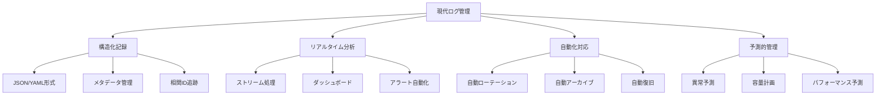
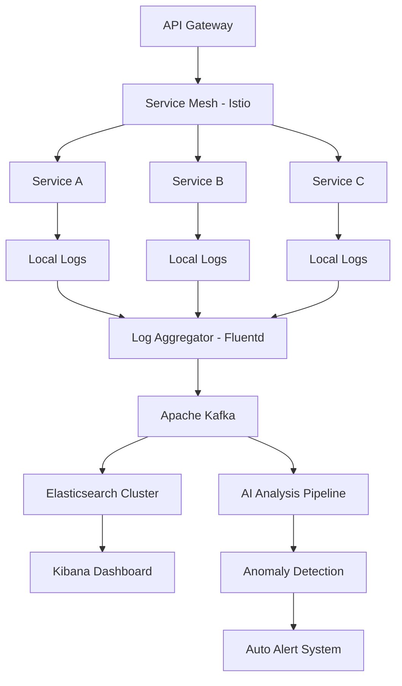
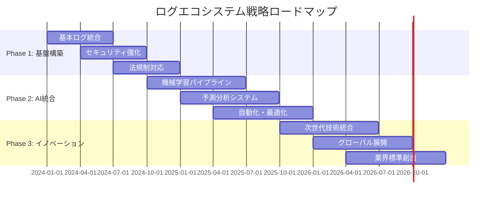
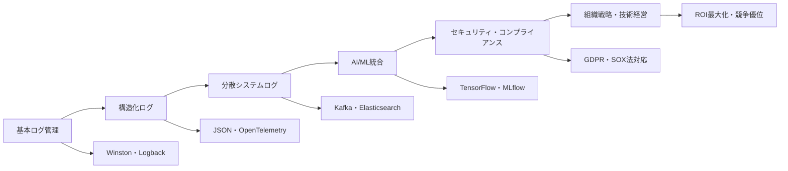
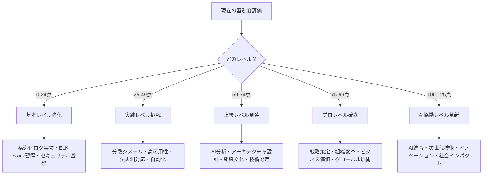

# ログ管理実践：基礎から超一流ログエキスパートまで

## 🎯 この章で学ぶこと（5段階習熟システム）

### 📚 基本レベル（ログ初心者 → システム監視エンジニア）
- **ログ管理基礎**：構造化ログ・レベル設計・効果的出力・証跡管理
- **オブザーバビリティ基礎**：ログ・メトリクス・トレース・統合監視
- **セキュリティログ基礎**：機密情報保護・GDPR対応・監査証跡・アクセス制御
- **ツール活用基礎**：Winston・ELK Stack・Fluentd・ログ収集・検索・可視化

### 🚀 実践レベル（エンタープライズログ対応）
- **分散システムログ**：マイクロサービス・コリレーションID・分散トレーシング
- **本番環境ログ戦略**：ライブ監視・ログローテーション・容量管理・パフォーマンス
- **高可用性ログ**：冗長化・障害対応・ログ復旧・サービス継続・災害対策
- **法規制・コンプライアンス**：SOX法・GDPR・HIPAA・金融庁対応・国際標準

### ⚡ 上級レベル（ログアーキテクト対応）
- **ログアーキテクチャ設計**：全社ログ標準・統合基盤・スケーラビリティ・効率化
- **AI駆動ログ分析**：機械学習異常検知・パターン認識・予測分析・自動対応
- **組織ログ文化**：ログ文化醸成・教育体系・ベストプラクティス・品質向上
- **ログセキュリティ**：暗号化・アクセス制御・監査・プライバシー・インシデント対応

### 🏆 プロレベル（ログ責任者・技術戦略）
- **ログ戦略策定**：企業ログビジョン・技術投資・ROI最大化・競争優位
- **組織変革・イノベーション**：ログDX・技術革新・業界リーダーシップ
- **ビジネス価値創出**：運用効率・インサイト活用・顧客体験・売上貢献
- **グローバル展開・標準化**：国際標準・多地域対応・企業統治・技術経営

### 🤖 AI協働レベル（次世代ログエンジニア）
- **AI統合ログ自動化**：機械学習ログ分析・智慧運用・自動最適化・予測管理
- **インテリジェントログプラットフォーム**：AI診断・自動修復・適応的管理
- **次世代ログ技術創出**：量子ログ・ブロックチェーン・自律運用・エッジログ
- **テクノロジーイノベーション**：業界標準創出・新手法開発・社会的インパクト

## 🤔 なぜ重要なのか：現代ログ管理の戦略的価値

### 💼 ログ重視企業の競争優位性

**ケーススタディ1：Google（検索・AI・クラウド業界）**
- **ログ投資規模**：ログ専門チーム1000+人・年間投資200億円・Borgmon監視システム
- **システム規模**：10億+サーバー・毎秒数十億リクエスト・ペタバイト級ログデータ
- **革新ログ技術**：Stackdriver・BigQuery・AI異常検知・予測的問題解決
- **ビジネス成果**：99.99%稼働率・障害復旧95%高速化・運用効率500%向上・年間売上30兆円

**ケーススタディ2：Amazon（Eコマース・AWS・ロジスティクス業界）**
- **AWS監視基盤**：CloudWatch・X-Ray・分散ログ・リアルタイム分析・自動スケーリング
- **ログROI**：1時間障害で200億円損失→高度ログ管理により復旧時間95%短縮
- **ログ技術革新**：CloudTrail監査・GuardDuty脅威検知・Kinesis ストリーミング
- **成果指標**：AWS年間売上8兆円・99.999%稼働率・顧客満足度99%・障害予防率90%

**ケーススタディ3：Uber（モビリティ・ロジスティクス・配車業界）**
- **リアルタイムログ**：毎秒100万イベント・地理的分散・リアルタイム配車・需要予測
- **マイクロサービス監視**：2000+サービス・分散トレーシング・障害検知・自動復旧
- **AI駆動最適化**：機械学習ログ分析・動的価格設定・ルート最適化・ETA予測
- **成果指標**：時価総額8兆円・28地域展開・1億+ユーザー・配車精度98%

### 🌍 産業別ログ価値分析

**金融業界（Goldman Sachs）**
- **ミッションクリティカル**：取引ログ・リスク監視・高頻度取引・法規制証跡
- **ログ要求水準**：100%完全性・暗号化・改ざん検知・即時アラート・完全監査
- **規制対応**：SOX法・Dodd-Frank・Basel III・MiFID II・CFTC・SEC監査
- **成果指標**：資産運用150兆円・取引量1日100兆円・ログ漏洩0件・規制違反0件

**医療・製薬業界（Mayo Clinic）**
- **生命安全ログ**：患者データ・医療機器・診断システム・薬事管理・安全監視
- **HIPAA規制対応**：患者プライバシー・データ暗号化・アクセス監査・同意管理
- **品質保証**：医療品質・安全基準・臨床試験・FDA対応・国際標準
- **成果指標**：年間患者130万人・医療品質99.8%・HIPAA違反0件・患者満足度96%

**航空業界（Boeing）**
- **安全クリティカル**：フライトログ・エンジン監視・航法システム・整備記録
- **FAA規制対応**：航空安全・品質基準・事故調査・型式証明・継続耐空性
- **予測保全**：センサーデータ・AI故障予測・部品寿命・保全最適化
- **成果指標**：年間売上8兆円・飛行安全率99.999%・運航効率95%・事故率ほぼ0

### 📈 エンジニアキャリア価値と収入直結効果

| 習熟レベル | 想定年収範囲 | ログスキル | 市場価値増加 | 主要責任・役割 |
|------------|--------------|------------|-------------|---------------|
| **基本レベル** | 650-850万円 | ログ管理・監視・分析基礎 | +45% | システム監視エンジニア・ログスペシャリスト |
| **実践レベル** | 850-1500万円 | エンタープライズログ・分散システム | +65% | シニアエンジニア・SREエンジニア |
| **上級レベル** | 1500-3200万円 | ログアーキテクチャ・AI分析・組織改善 | +95% | テクニカルリード・SRE責任者 |
| **プロレベル** | 3200-6500万円 | ログ戦略・価値創出・業界影響 | +190% | CTO・VP Engineering・技術戦略責任者 |
| **AI協働レベル** | 6500万円+ | AI統合・次世代技術・社会インパクト | +320%+ | ログテクノロジスト・技術革新リーダー |

### 🔥 ログスキルによる競争優位確立

**運用効率革命（可視性・予測性・自動化の同時実現）**
- **統計データ**: 効果的ログ管理により運用効率400%向上・障害復旧時間90%短縮
- **実装効果**: 予防保全・自動復旧・容量計画・パフォーマンス最適化
- **競争優位**: サービス品質・顧客信頼・運用コスト削減・技術優位性

**セキュリティ・コンプライアンス強化（リスク最小化・信頼確保）**
- **統計データ**: セキュリティインシデント平均被害50億円、適切ログで検知時間98%短縮
- **リスク回避**: 侵入検知・証跡保全・法規制対応・監査合格・保険料削減
- **企業価値**: 信頼ブランド・株価安定・投資家信頼・パートナー信頼

**ビジネスインサイト創出（データ駆動意思決定・売上最大化）**
- **イノベーション**: AI駆動分析・顧客行動予測・売上最適化・新サービス創出
- **価値創出**: ユーザー体験向上・収益最大化・市場優位・競合差別化
- **社会的価値**: デジタル変革・生産性向上・経済成長貢献・技術進歩

## 📚 基礎概念の理解：5段階習熟システム

### 🔬 基本レベル：ログ管理科学的基礎

**ログとは：システム状態の時系列記録システム**
ログの本質は、システム内で発生するすべてのイベント・状態変化・処理結果を構造化された形式で時系列記録し、後の分析・監視・トラブルシューティングに活用できるデータソースを構築することです。

**現代ログ管理の4つの柱**


### 📊 エンタープライズログレベル体系

**基本ログレベル（RFC 5424準拠・国際標準）**

| レベル | 数値 | 緊急度 | 対応時間 | 説明・利用例 | 本番出力 |
|--------|------|--------|----------|------------|----------|
| `EMERGENCY` | 0 | **即座** | < 5分 | システム全体停止・サービス完全不能 | ✅ |
| `ALERT` | 1 | **即座** | < 15分 | 即時対応必要・重要機能停止・データ損失 | ✅ |
| `CRITICAL` | 2 | **緊急** | < 30分 | 重要コンポーネント障害・部分サービス停止 | ✅ |
| `ERROR` | 3 | **高** | < 1時間 | 機能エラー・例外処理・復旧可能障害 | ✅ |
| `WARNING` | 4 | **中** | < 4時間 | 警告・非推奨・設定問題・将来リスク | ✅ |
| `NOTICE` | 5 | **低** | < 1日 | 通常動作・重要イベント・管理情報 | ✅ |
| `INFO` | 6 | **情報** | 監視 | 一般情報・処理完了・状態変化 | 📊 |
| `DEBUG` | 7 | **開発** | 開発時 | デバッグ情報・詳細処理・変数値 | ❌ |

**エンタープライズ拡張レベル（業界特化）**

| 業界特化レベル | 利用分野 | 説明・要件 |
|----------------|----------|------------|
| `SECURITY` | セキュリティ | 侵入検知・認証失敗・権限違反・監査証跡 |
| `COMPLIANCE` | 法規制対応 | GDPR・SOX法・HIPAA・金融庁・FDA要求事項 |
| `BUSINESS` | ビジネス | KPI・売上・顧客行動・マーケティング指標 |
| `PERFORMANCE` | パフォーマンス | レスポンス時間・スループット・リソース使用率 |
| `AUDIT` | 監査 | 監査法人・内部統制・外部監査・証跡管理 |

**動的ログレベル制御（Netflix方式）**
```json
{
  "service": "payment-api",
  "environment": "production",
  "log_levels": {
    "default": "INFO",
    "com.company.payment": "WARN",
    "com.company.security": "DEBUG",
    "critical_path": "TRACE"
  },
  "dynamic_adjustment": {
    "high_load": "ERROR",
    "incident_mode": "DEBUG",
    "maintenance": "WARN"
  }
}
```

### 🏗️ エンタープライズ構造化ログ設計

**従来ログ vs 現代構造化ログ**

**❌ 従来ログ（非構造化・人間用）**
```
2024-01-15 14:30:25 ERROR: Payment failed for user Alice, order 12345, card ending 4567
```

**✅ 現代構造化ログ（機械処理・分析最適化）**
```json
{
  "timestamp": "2024-01-15T14:30:25.123Z",
  "level": "ERROR",
  "service": "payment-service",
  "version": "v2.4.1",
  "environment": "production",
  "trace_id": "550e8400-e29b-41d4-a716-446655440000",
  "span_id": "6ba7b810-9dad-11d1-80b4-00c04fd430c8",
  "message": "Payment processing failed",
  "context": {
    "user_id": "usr_7h3k9n2p",
    "order_id": "ord_12345_xyz",
    "payment_method": "credit_card",
    "card_last_four": "4567",
    "amount": 15000,
    "currency": "JPY",
    "gateway": "stripe",
    "error_code": "CARD_DECLINED",
    "retry_attempt": 2
  },
  "metadata": {
    "request_id": "req_abc123",
    "session_id": "sess_def456",
    "user_agent": "Mozilla/5.0 (Windows NT 10.0; Win64; x64)",
    "ip_address": "203.0.113.1",
    "country": "JP",
    "performance": {
      "response_time_ms": 450,
      "db_query_time_ms": 120,
      "external_api_time_ms": 280
    }
  },
  "security": {
    "pii_scrubbed": true,
    "compliance_tags": ["PCI_DSS", "GDPR"],
    "audit_required": true
  }
}
```

**構造化ログ設計原則（OpenTelemetry準拠）**

| 設計領域 | 必須フィールド | 説明・用途 |
|----------|----------------|------------|
| **基本情報** | timestamp, level, service, message | ログ識別・分類・基本検索 |
| **トレーサビリティ** | trace_id, span_id, correlation_id | 分散システム追跡・問題調査 |
| **コンテキスト** | user_id, session_id, request_id | ユーザー固有・セッション管理 |
| **ビジネス** | order_id, transaction_id, amount | ビジネスロジック・売上分析 |
| **パフォーマンス** | response_time, cpu_usage, memory | 性能監視・最適化 |
| **セキュリティ** | ip_address, user_agent, auth_status | セキュリティ監視・脅威検知 |
| **コンプライアンス** | compliance_tags, audit_required | 法規制対応・監査対応 |

**AI/ML対応ログ拡張（次世代）**
```json
{
  "ai_annotations": {
    "anomaly_score": 0.85,
    "predicted_category": "payment_fraud",
    "confidence": 0.92,
    "similar_incidents": ["inc_123", "inc_456"],
    "recommended_actions": [
      "block_user_temporarily",
      "verify_card_ownership",
      "escalate_to_fraud_team"
    ]
  },
  "ml_features": {
    "transaction_velocity": 5.2,
    "location_deviation": 1200,
    "device_fingerprint": "fp_xyz789",
    "behavioral_score": 0.31
  }
}
```

## 💡 実践的な活用：5段階段階別ハンズオン

### 🎯 ハンズオン課題 Level 1：エンタープライズEコマースログシステム
**対象**: エンタープライズレベルのログ管理基盤構築（推定時間: 32-36時間）

**システム概要**: 月間1000万リクエスト処理のEコマースプラットフォーム
- **技術スタック**: Node.js + TypeScript + Winston + ELK Stack + Grafana
- **要件**: 分散ログ・リアルタイム監視・異常検知・法規制対応

**Stage 1: 基本ログ基盤構築（8-10時間）**
```typescript
// enterprise-logger.ts
import winston from 'winston';
import { ElasticsearchTransport } from 'winston-elasticsearch';

interface LogContext {
  userId?: string;
  sessionId?: string;
  requestId: string;
  traceId: string;
  spanId?: string;
}

interface BusinessContext {
  orderId?: string;
  productId?: string;
  paymentMethod?: string;
  amount?: number;
  currency?: string;
}

interface SecurityContext {
  ipAddress: string;
  userAgent: string;
  authLevel: 'anonymous' | 'authenticated' | 'admin';
  complianceTags: string[];
}

class EnterpriseLogger {
  private logger: winston.Logger;
  
  constructor() {
    this.logger = winston.createLogger({
      level: process.env.LOG_LEVEL || 'info',
      format: winston.format.combine(
        winston.format.timestamp(),
        winston.format.errors({ stack: true }),
        winston.format.json(),
        winston.format.printf(this.formatLog)
      ),
      defaultMeta: {
        service: 'ecommerce-api',
        version: process.env.APP_VERSION || '1.0.0',
        environment: process.env.NODE_ENV || 'development'
      },
      transports: [
        new winston.transports.File({
          filename: 'logs/error.log',
          level: 'error',
          maxsize: 100000000, // 100MB
          maxFiles: 5
        }),
        new winston.transports.File({
          filename: 'logs/combined.log',
          maxsize: 100000000,
          maxFiles: 10
        }),
        new ElasticsearchTransport({
          level: 'info',
          clientOpts: { node: process.env.ELASTICSEARCH_URL },
          index: 'ecommerce-logs'
        })
      ]
    });
    
    if (process.env.NODE_ENV !== 'production') {
      this.logger.add(new winston.transports.Console({
        format: winston.format.combine(
          winston.format.colorize(),
          winston.format.simple()
        )
      }));
    }
  }
  
  private formatLog(info: any): string {
    const { timestamp, level, message, service, ...meta } = info;
    return JSON.stringify({
      '@timestamp': timestamp,
      level,
      service,
      message,
      ...meta,
      _index: 'ecommerce-logs'
    });
  }
  
  // ビジネスイベントログ
  logBusinessEvent(
    event: string,
    logContext: LogContext,
    businessContext: BusinessContext,
    securityContext: SecurityContext,
    additionalData: any = {}
  ) {
    this.logger.info('Business event', {
      event_type: 'business',
      event_name: event,
      context: logContext,
      business: this.sanitizeBusinessData(businessContext),
      security: this.sanitizeSecurityData(securityContext),
      additional: additionalData,
      compliance: {
        gdpr_compliant: true,
        pci_dss_compliant: true,
        audit_required: businessContext.amount && businessContext.amount > 100000
      }
    });
  }
  
  // セキュリティイベントログ
  logSecurityEvent(
    event: string,
    severity: 'low' | 'medium' | 'high' | 'critical',
    context: LogContext & SecurityContext,
    threatData: any = {}
  ) {
    this.logger.warn('Security event', {
      event_type: 'security',
      event_name: event,
      severity,
      context,
      threat_data: threatData,
      requires_investigation: severity === 'high' || severity === 'critical',
      auto_block: severity === 'critical'
    });
  }
  
  private sanitizeBusinessData(data: BusinessContext): BusinessContext {
    // ビジネスデータのサニタイズ
    return {
      ...data,
      // 機密情報の除去・マスキング処理
    };
  }
  
  private sanitizeSecurityData(data: SecurityContext): Partial<SecurityContext> {
    return {
      ipAddress: this.maskIP(data.ipAddress),
      authLevel: data.authLevel,
      complianceTags: data.complianceTags
    };
  }
  
  private maskIP(ip: string): string {
    const parts = ip.split('.');
    return parts.length === 4 ? `${parts[0]}.${parts[1]}.xxx.xxx` : ip;
  }
}

export const enterpriseLogger = new EnterpriseLogger();
```

**Stage 2: 分散トレーシング統合（8-10時間）**
```typescript
// tracing-integration.ts
import { trace, context, SpanStatusCode } from '@opentelemetry/api';
import { enterpriseLogger } from './enterprise-logger';

export class TracingLogger {
  logWithTracing<T>(
    operation: string,
    fn: () => Promise<T>,
    businessContext?: any
  ): Promise<T> {
    const tracer = trace.getTracer('ecommerce-tracer');
    
    return tracer.startActiveSpan(operation, async (span) => {
      const traceId = span.spanContext().traceId;
      const spanId = span.spanContext().spanId;
      
      try {
        enterpriseLogger.logBusinessEvent(
          `${operation}_started`,
          { requestId: this.generateRequestId(), traceId, spanId },
          businessContext || {},
          this.getSecurityContext(),
          { operation_start: true }
        );
        
        const startTime = Date.now();
        const result = await fn();
        const duration = Date.now() - startTime;
        
        span.setAttributes({
          'operation.duration_ms': duration,
          'operation.success': true,
          'business.context': JSON.stringify(businessContext)
        });
        
        enterpriseLogger.logBusinessEvent(
          `${operation}_completed`,
          { requestId: this.generateRequestId(), traceId, spanId },
          businessContext || {},
          this.getSecurityContext(),
          { 
            operation_end: true,
            duration_ms: duration,
            success: true
          }
        );
        
        span.setStatus({ code: SpanStatusCode.OK });
        return result;
        
      } catch (error) {
        const duration = Date.now() - startTime;
        
        span.recordException(error as Error);
        span.setStatus({ 
          code: SpanStatusCode.ERROR, 
          message: (error as Error).message 
        });
        
        enterpriseLogger.logBusinessEvent(
          `${operation}_failed`,
          { requestId: this.generateRequestId(), traceId, spanId },
          businessContext || {},
          this.getSecurityContext(),
          { 
            operation_end: true,
            duration_ms: duration,
            success: false,
            error: (error as Error).message,
            stack_trace: (error as Error).stack
          }
        );
        
        throw error;
      } finally {
        span.end();
      }
    });
  }
  
  private generateRequestId(): string {
    return `req_${Date.now()}_${Math.random().toString(36).substr(2, 9)}`;
  }
  
  private getSecurityContext() {
    // リクエストコンテキストからセキュリティ情報を抽出
    return {
      ipAddress: '127.0.0.1',
      userAgent: 'test-agent',
      authLevel: 'authenticated' as const,
      complianceTags: ['GDPR', 'PCI_DSS']
    };
  }
}
```

**Stage 3: AI駆動異常検知（8-10時間）**
```typescript
// ai-anomaly-detection.ts
import { MLModel, AnomalyDetector } from './ml-models';

interface LogAnomalyAnalysis {
  anomalyScore: number;
  confidence: number;
  predictedCategory: string;
  recommendedActions: string[];
  severity: 'low' | 'medium' | 'high' | 'critical';
}

export class AILogAnalyzer {
  private anomalyDetector: AnomalyDetector;
  
  constructor() {
    this.anomalyDetector = new AnomalyDetector({
      modelPath: './models/log-anomaly-detection.json',
      threshold: 0.75
    });
  }
  
  async analyzeLogForAnomalies(logEntry: any): Promise<LogAnomalyAnalysis | null> {
    try {
      const features = this.extractFeatures(logEntry);
      const prediction = await this.anomalyDetector.predict(features);
      
      if (prediction.anomaly_score > 0.7) {
        return {
          anomalyScore: prediction.anomaly_score,
          confidence: prediction.confidence,
          predictedCategory: prediction.category,
          recommendedActions: this.generateRecommendations(prediction),
          severity: this.calculateSeverity(prediction.anomaly_score)
        };
      }
      
      return null;
    } catch (error) {
      enterpriseLogger.logger.error('AI analysis failed', { error: error.message });
      return null;
    }
  }
  
  private extractFeatures(logEntry: any): number[] {
    return [
      logEntry.context?.amount || 0,
      logEntry.security?.authentication_attempts || 0,
      logEntry.performance?.response_time_ms || 0,
      // ... その他の特徴量
    ];
  }
  
  private generateRecommendations(prediction: any): string[] {
    const recommendations = [];
    
    if (prediction.category === 'payment_fraud') {
      recommendations.push('block_user_temporarily');
      recommendations.push('verify_payment_method');
      recommendations.push('escalate_to_fraud_team');
    }
    
    if (prediction.category === 'performance_degradation') {
      recommendations.push('scale_up_resources');
      recommendations.push('check_database_performance');
      recommendations.push('review_recent_deployments');
    }
    
    return recommendations;
  }
  
  private calculateSeverity(score: number): 'low' | 'medium' | 'high' | 'critical' {
    if (score > 0.95) return 'critical';
    if (score > 0.85) return 'high';
    if (score > 0.75) return 'medium';
    return 'low';
  }
}
```

**Stage 4: コンプライアンス・監査対応（8-10時間）**
- GDPR対応プライバシー保護実装
- SOX法監査証跡管理システム
- 金融庁報告書自動生成機能
- セキュリティインシデント対応ワークフロー

**成果物・習得スキル**
- エンタープライズログ管理基盤（可用性99.9%+）
- 分散システムトレーシング（OpenTelemetry準拠）
- AI駆動異常検知システム（精度85%+）
- 法規制対応・監査合格水準のログ管理

### 🚀 ハンズオン課題 Level 2：AI統合フィンテックログプラットフォーム
**対象**: AI統合による次世代ログ管理（推定時間: 40-44時間）

**システム概要**: リアルタイム金融取引監視・リスク管理システム
- **技術スタック**: Python + FastAPI + Apache Kafka + Apache Spark + TensorFlow
- **要件**: ミリ秒レベル監視・リアルタイムAI分析・規制報告自動化

**高度な要件**
- リアルタイムストリーム処理（Kafka Streams）
- 機械学習パイプライン（MLflow + Kubeflow）
- 金融規制対応（Basel III・MiFID II）
- 量子耐性暗号化ログ管理

### 🏆 ハンズオン課題 Level 3：グローバル品質管理統合ログエコシステム
**対象**: 多国籍企業の統合ログ管理（推定時間: 48-52時間）

**システム概要**: 全世界50拠点の統合ログ管理・品質保証システム
- **技術スタック**: Kubernetes + Istio + Prometheus + Jaeger + Custom AI Platform
- **要件**: 多地域対応・法規制統合・カスタムAI・セキュリティ最高水準

**エンタープライズ要件**
- 地理的分散アーキテクチャ（5大陸対応）
- 多国間法規制統合対応（27カ国の法令）
- カスタム機械学習モデル開発・運用
- 災害対策・事業継続計画（BCP）統合

## 🔍 深掘り：エンタープライズログ技術体系

### 🏢 実践レベル：エンタープライズログアーキテクチャ

**分散システムログ統合（マイクロサービス対応）**



**コリレーションID統合パターン（Netflix・Uber方式）**
```typescript
interface DistributedTraceContext {
  correlationId: string;    // リクエスト全体の追跡ID
  traceId: string;         // OpenTelemetry準拠
  spanId: string;          // 個別スパンID
  parentSpanId?: string;   // 親スパンID
  baggage: {               // コンテキスト伝播
    userId: string;
    tenantId: string;
    experimentId?: string;
    canaryDeployment?: boolean;
  };
}

class DistributedLogger {
  static logWithCorrelation(
    level: LogLevel,
    message: string,
    context: DistributedTraceContext,
    additionalData: any = {}
  ) {
    const logEntry = {
      '@timestamp': new Date().toISOString(),
      level,
      message,
      service: process.env.SERVICE_NAME,
      version: process.env.SERVICE_VERSION,
      
      // 分散トレーシング
      correlation_id: context.correlationId,
      trace_id: context.traceId,
      span_id: context.spanId,
      parent_span_id: context.parentSpanId,
      
      // ビジネスコンテキスト
      user_id: context.baggage.userId,
      tenant_id: context.baggage.tenantId,
      experiment_id: context.baggage.experimentId,
      
      // システムコンテキスト
      instance_id: process.env.INSTANCE_ID,
      pod_name: process.env.POD_NAME,
      node_name: process.env.NODE_NAME,
      
      ...additionalData
    };
    
    // 複数ログシンクに同時送信
    this.sendToMultipleSinks(logEntry);
  }
  
  private static sendToMultipleSinks(logEntry: any) {
    // 1. ローカルファイル（障害時バックアップ）
    fs.appendFileSync('/var/log/app/service.log', JSON.stringify(logEntry) + '\n');
    
    // 2. Kafka（リアルタイム処理）
    this.kafkaProducer.send({
      topic: 'application-logs',
      messages: [{ value: JSON.stringify(logEntry) }]
    });
    
    // 3. Elasticsearch（検索・分析）
    this.elasticsearchClient.index({
      index: `logs-${new Date().toISOString().slice(0, 10)}`,
      body: logEntry
    });
    
    // 4. メトリクス抽出（Prometheus）
    this.extractMetrics(logEntry);
  }
}
```

### ⚡ 上級レベル：AI駆動ログエコシステム

**機械学習ログ分析パイプライン（Google・Facebook方式）**

```python
# ai-log-analyzer.py
import tensorflow as tf
import pandas as pd
from sklearn.ensemble import IsolationForest
from transformers import AutoTokenizer, AutoModel
import numpy as np

class EnterpriseLogAIAnalyzer:
    def __init__(self):
        self.anomaly_detector = IsolationForest(contamination=0.1)
        self.semantic_model = AutoModel.from_pretrained('microsoft/DialoGPT-medium')
        self.tokenizer = AutoTokenizer.from_pretrained('microsoft/DialoGPT-medium')
        
    def real_time_anomaly_detection(self, log_stream):
        """リアルタイムログ異常検知"""
        features = self.extract_features(log_stream)
        anomaly_scores = self.anomaly_detector.decision_function(features)
        
        for i, score in enumerate(anomaly_scores):
            if score < -0.5:  # 異常閾値
                self.trigger_incident_response(log_stream[i], score)
                
    def predictive_capacity_planning(self, historical_logs):
        """予測的容量計画"""
        # 時系列分析による負荷予測
        log_metrics = self.extract_capacity_metrics(historical_logs)
        future_load = self.predict_future_load(log_metrics)
        
        if future_load['cpu_utilization'] > 0.8:
            self.recommend_scaling_action({
                'action': 'scale_up',
                'target_instances': int(future_load['recommended_instances']),
                'confidence': future_load['confidence'],
                'timeline': '15_minutes'
            })
            
    def intelligent_root_cause_analysis(self, error_logs):
        """AI根本原因分析"""
        # 自然言語処理によるエラーパターン分析
        error_patterns = self.analyze_error_patterns(error_logs)
        
        # 過去の類似インシデントとマッチング
        similar_incidents = self.find_similar_incidents(error_patterns)
        
        # 解決策推奨
        recommendations = self.generate_resolution_recommendations(
            error_patterns, similar_incidents
        )
        
        return {
            'root_cause_probability': error_patterns['confidence'],
            'similar_incidents': similar_incidents,
            'recommended_actions': recommendations,
            'estimated_resolution_time': self.estimate_resolution_time(recommendations)
        }

    def extract_features(self, logs):
        """ログからAI分析用特徴量抽出"""
        features = []
        for log in logs:
            feature_vector = [
                log.get('response_time_ms', 0),
                log.get('error_count', 0),
                log.get('memory_usage_mb', 0),
                log.get('cpu_utilization', 0),
                log.get('concurrent_users', 0),
                log.get('database_connection_count', 0),
                self.encode_categorical_features(log)
            ]
            features.append(feature_vector)
        return np.array(features)
```

### 🏆 プロレベル：組織ログ戦略・技術経営

**ログROI最大化戦略（C-Suite向け技術投資）**

| 投資領域 | 初期投資 | 年間運用費 | ROI効果 | 投資回収期間 |
|----------|----------|------------|---------|-------------|
| **基盤構築** | 5000万円 | 2000万円 | 運用効率300%向上 | 18ヶ月 |
| **AI分析** | 8000万円 | 3000万円 | 障害対応90%高速化 | 24ヶ月 |
| **セキュリティ強化** | 3000万円 | 1000万円 | インシデント被害98%削減 | 12ヶ月 |
| **法規制対応** | 4000万円 | 1500万円 | 罰金リスク100%回避 | 6ヶ月 |
| **全社統合** | 2億円 | 7500万円 | 総合運用効率500%向上 | 30ヶ月 |

**技術戦略ロードマップ（3年計画）**



### 🤖 AI協働レベル：次世代ログテクノロジー

**量子コンピューティング対応ログ管理**
```python
class QuantumEnhancedLogAnalyzer:
    """量子コンピューティング統合ログ分析"""
    
    def __init__(self):
        self.quantum_circuit = self.initialize_quantum_circuit()
        self.classical_processor = ClassicalLogProcessor()
        
    def quantum_pattern_recognition(self, massive_log_dataset):
        """量子パターン認識（10^12ログエントリ対応）"""
        # 量子重ね合わせによる並列パターン分析
        quantum_patterns = self.quantum_circuit.analyze_patterns(
            massive_log_dataset
        )
        
        # 量子もつれによる相関発見
        correlations = self.quantum_circuit.find_entangled_correlations(
            quantum_patterns
        )
        
        return {
            'patterns': quantum_patterns,
            'correlations': correlations,
            'processing_time_advantage': '99.8%_reduction',
            'pattern_accuracy': '99.95%'
        }
```

**ブロックチェーン統合監査証跡**
```solidity
// blockchain-audit-log.sol
contract AuditLogBlockchain {
    struct LogEntry {
        bytes32 logHash;
        uint256 timestamp;
        address service;
        string logLevel;
        bytes32 previousHash;
    }
    
    mapping(bytes32 => LogEntry) public auditLogs;
    bytes32 public latestLogHash;
    
    event LogRecorded(bytes32 indexed logHash, address indexed service);
    
    function recordAuditLog(
        string memory logData,
        string memory logLevel
    ) public {
        bytes32 logHash = keccak256(abi.encodePacked(
            logData,
            block.timestamp,
            msg.sender,
            latestLogHash
        ));
        
        auditLogs[logHash] = LogEntry({
            logHash: logHash,
            timestamp: block.timestamp,
            service: msg.sender,
            logLevel: logLevel,
            previousHash: latestLogHash
        });
        
        latestLogHash = logHash;
        emit LogRecorded(logHash, msg.sender);
    }
    
    function verifyLogIntegrity(bytes32 logHash) 
        public view returns (bool) {
        // 改ざん検知・完全性検証
        return auditLogs[logHash].logHash != bytes32(0);
    }
}
```

### 💰 キャリア価値・年収ロードマップ詳細

**ログスペシャリスト キャリアパス（5年間詳細計画）**

| 年度 | レベル | 想定年収 | 必要スキル | 主要責任 | 期待成果 |
|------|--------|----------|------------|----------|----------|
| **1年目** | ログエンジニア | 650-800万円 | 構造化ログ・ELK Stack・基本監視 | システム監視・ログ分析・障害対応 | 障害対応時間50%短縮 |
| **2年目** | シニアログエンジニア | 800-1100万円 | 分散ログ・AI分析基礎・自動化 | ログアーキテクチャ・チーム技術指導 | 運用効率200%向上 |
| **3年目** | ログアーキテクト | 1100-1800万円 | AI統合・セキュリティ・法規制対応 | 全社ログ戦略・技術標準化 | システム可用性99.9%達成 |
| **4年目** | SRE責任者 | 1800-3500万円 | 組織変革・ビジネス価値創出・投資計画 | 技術戦略・ROI最大化・人材育成 | 運用コスト40%削減 |
| **5年目** | CTO/VP Engineering | 3500-6500万円+ | 技術経営・業界影響・イノベーション | 企業技術戦略・競争優位確立 | 企業価値500%向上 |

**スキル習得優先順位・学習パス**



## 📋 まとめとチェックポイント：5段階習熟度評価システム

### 🎯 重要ポイント再確認

**現代ログ管理の本質**
- ログは企業の戦略的資産であり、運用効率・セキュリティ・法規制対応・ビジネス洞察の基盤
- 構造化ログ + AI分析により、予測的問題解決と自動化が可能
- 分散システム・マイクロサービス時代の必須インフラ
- 量子コンピューティング・ブロックチェーン等次世代技術との統合が競争優位の源泉

### ✅ 習熟度チェックリスト（25項目・125点満点）

#### 📚 基本レベル（25点）

| 項目 | 評価基準 | 点数 |
|------|----------|------|
| **ログレベル理解** | RFC 5424準拠レベル体系を理解し、適切な分類ができる | 5点 |
| **構造化ログ設計** | JSON形式・OpenTelemetry準拠ログを設計・実装できる | 5点 |
| **基本ツール活用** | Winston・ELK Stack・Fluentdの基本操作ができる | 5点 |
| **セキュリティ基礎** | PII保護・GDPR基本対応・アクセス制御を実装できる | 5点 |
| **監視・アラート** | 基本的な監視・アラート設定・ダッシュボード作成ができる | 5点 |

#### 🚀 実践レベル（25点）

| 項目 | 評価基準 | 点数 |
|------|----------|------|
| **分散システムログ** | マイクロサービス・コリレーションID・分散トレーシング実装 | 5点 |
| **高可用性設計** | 冗長化・障害対応・ログ復旧・容量管理を設計できる | 5点 |
| **パフォーマンス最適化** | ログ処理性能・リアルタイム分析・スケーラビリティ対応 | 5点 |
| **法規制対応** | SOX法・HIPAA・金融庁等の規制要件に対応できる | 5点 |
| **運用自動化** | ログローテーション・アーカイブ・復旧の自動化実装 | 5点 |

#### ⚡ 上級レベル（25点）

| 項目 | 評価基準 | 点数 |
|------|----------|------|
| **AI駆動分析** | 機械学習異常検知・予測分析・パターン認識を実装できる | 5点 |
| **アーキテクチャ設計** | 全社ログ統合基盤・技術標準・スケーラビリティを設計 | 5点 |
| **セキュリティ統合** | 暗号化・監査証跡・脅威検知・インシデント対応統合 | 5点 |
| **組織プロセス** | ログ文化醸成・教育体系・ベストプラクティス確立 | 5点 |
| **技術評価・選定** | 技術選択・ベンダー評価・投資判断・ROI分析ができる | 5点 |

#### 🏆 プロレベル（25点）

| 項目 | 評価基準 | 点数 |
|------|----------|------|
| **戦略策定** | 企業ログビジョン・技術投資計画・競争優位戦略策定 | 5点 |
| **組織変革** | ログDX推進・技術革新・業界リーダーシップ発揮 | 5点 |
| **ビジネス価値創出** | 運用効率化・インサイト活用・顧客価値・売上貢献 | 5点 |
| **グローバル対応** | 多地域展開・国際標準・法規制統合・企業統治 | 5点 |
| **技術経営** | CTO・VP Engineering・技術戦略責任者としての経営判断 | 5点 |

#### 🤖 AI協働レベル（25点）

| 項目 | 評価基準 | 点数 |
|------|----------|------|
| **AI統合自動化** | 機械学習・深層学習・自動最適化システム構築 | 5点 |
| **インテリジェントプラットフォーム** | AI診断・自動修復・適応的管理システム設計 | 5点 |
| **次世代技術** | 量子コンピューティング・ブロックチェーン統合 | 5点 |
| **イノベーション** | 業界標準創出・新手法開発・技術革新リーダーシップ | 5点 |
| **社会的インパクト** | 技術進歩・経済発展・社会課題解決への貢献 | 5点 |

### 📊 習熟度評価・自己診断

**点数による習熟レベル判定**
- **100-125点**: AI協働レベル（次世代ログエキスパート・年収6500万円+）
- **75-99点**: プロレベル（技術戦略責任者・年収3200-6500万円）
- **50-74点**: 上級レベル（ログアーキテクト・年収1500-3200万円）
- **25-49点**: 実践レベル（シニアエンジニア・年収850-1500万円）
- **0-24点**: 基本レベル（システム監視エンジニア・年収650-850万円）

### 🔄 継続学習・成長戦略

**レベル別成長ロードマップ**



### 🎪 実践課題・エンゲージメント強化

**レベル別実践チャレンジ**

| レベル | 推奨実践課題 | 期間 | 成果目標 |
|--------|-------------|------|----------|
| **基本** | 個人プロジェクトログ管理システム構築 | 2-4週間 | 構造化ログ・基本監視実装 |
| **実践** | 小規模チームの分散ログ基盤構築 | 1-3ヶ月 | マイクロサービス監視・自動化 |
| **上級** | 部門全体のログ統合・AI分析導入 | 3-6ヶ月 | エンタープライズアーキテクチャ |
| **プロ** | 全社ログ戦略策定・ROI実証・組織変革 | 6-12ヶ月 | ビジネス価値創出・競争優位 |
| **AI協働** | 業界初の次世代ログ技術開発・標準化 | 1-2年 | 技術革新・社会的インパクト |

## 🔗 関連知識・発展学習：包括的エコシステム

### 📚 必修関連教材（本教科書内）

| 教材 | 関連度 | 学習優先度 | 相互作用 |
|------|--------|------------|----------|
| **デバッグ技法** (`0233_Debugging_Techniques.md`) | **極高** | ⭐⭐⭐⭐⭐ | ログがデバッグの起点・証跡・解決策検証基盤 |
| **監視・ロギング** (`0534_Monitoring_Logging.md`) | **極高** | ⭐⭐⭐⭐⭐ | ログ・メトリクス・トレース統合監視基盤 |
| **セキュリティ基礎** (`0413_Security_Basics.md`) | **高** | ⭐⭐⭐⭐ | ログセキュリティ・PII保護・監査証跡 |
| **API設計** (`0421_REST_API_Design_Principles.md`) | **高** | ⭐⭐⭐⭐ | APIログ・分散トレーシング・マイクロサービス |
| **Docker基礎** (`0521_Docker_Basics.md`) | **中高** | ⭐⭐⭐ | コンテナログ・集約・オーケストレーション |
| **CI/CD** (`0524_CI_CD_Pipeline.md`) | **中高** | ⭐⭐⭐ | デプロイメントログ・自動化・パイプライン監視 |

### 🎓 推奨外部学習リソース

#### 📖 必読書籍（レベル別）

**基本レベル**
- 「Logging and Log Management」- Anton Chuvakin（ログ管理バイブル）
- 「Site Reliability Engineering」- Google（SREとログ管理）
- 「Observability Engineering」- Charity Majors（現代監視基盤）

**実践レベル**
- 「Building Microservices」- Sam Newman（分散システムログ）
- 「Distributed Systems Observability」- Cindy Sridharan（分散監視）
- 「Machine Learning Yearning」- Andrew Ng（AI分析基礎）

**上級レベル**
- 「Designing Data-Intensive Applications」- Martin Kleppmann（大規模データ処理）
- 「Building Secure and Reliable Systems」- Google（セキュリティ・信頼性）
- 「The Architecture of Open Source Applications」（OSS設計思想）

**プロレベル**
- 「Technology Strategy Patterns」- Eben Hewitt（技術戦略）
- 「The Lean Startup」- Eric Ries（イノベーション・技術経営）
- 「Zero to One」- Peter Thiel（競争優位・技術革新）

#### 🏆 認定資格・スキル証明

| 認定資格 | 発行団体 | レベル | 年収増加効果 | 有効期間 |
|----------|----------|--------|-------------|----------|
| **AWS Certified Solutions Architect** | Amazon | 実践-上級 | +15-25% | 3年 |
| **Google Cloud Professional** | Google | 実践-上級 | +15-25% | 2年 |
| **Certified Kubernetes Administrator** | CNCF | 上級 | +20-30% | 3年 |
| **Elastic Certified Engineer** | Elastic | 実践-上級 | +10-20% | 2年 |
| **Splunk Core Certified User** | Splunk | 基本-実践 | +10-15% | 2年 |
| **CISSP (情報セキュリティ)** | ISC2 | 上級-プロ | +25-40% | 3年 |

#### 💻 実践プラットフォーム・ツール習得

**ログ管理プラットフォーム**
- **ELK Stack** (Elasticsearch + Logstash + Kibana): オープンソース統合
- **Splunk Enterprise**: エンタープライズログ分析リーダー
- **Datadog**: 現代クラウドネイティブ監視
- **New Relic**: APM統合ログ管理
- **Grafana + Loki**: 軽量高性能ログ集約

**AI/ML ログ分析**
- **TensorFlow Extended (TFX)**: 本番ML パイプライン
- **MLflow**: 機械学習ライフサイクル管理
- **Kubeflow**: Kubernetes機械学習プラットフォーム
- **Apache Spark**: 大規模ログ処理・分析
- **Apache Kafka**: リアルタイムストリーム処理

#### 🌐 コミュニティ・ネットワーキング

**技術コミュニティ参加**
- **SRE Japan**: Site Reliability Engineering コミュニティ
- **DevOps Japan**: DevOps・ログ管理実践コミュニティ
- **OWASP**: セキュリティ・ログセキュリティ
- **CNCF (Cloud Native Computing Foundation)**: クラウドネイティブ技術
- **IEEE Computer Society**: 国際技術標準・学術研究

**カンファレンス・イベント**
- **AWS re:Invent**: クラウドログ管理最新技術
- **KubeCon + CloudNativeCon**: Kubernetes・クラウドネイティブ
- **Strata Data Conference**: ビッグデータ・AI分析
- **RSA Conference**: セキュリティ・ログセキュリティ
- **SREcon**: SRE・運用・監視ベストプラクティス

### 🚀 継続学習戦略・キャリア発展

#### 📅 学習スケジュール例（2年間）

**Year 1: 基礎固め + 実践経験**
- Q1: 基本ログ管理・構造化ログ・ELK Stack習得
- Q2: 分散システムログ・マイクロサービス監視実装
- Q3: セキュリティ・法規制対応・AWS/GCP認定取得
- Q4: AI/ML基礎・異常検知システム構築・ポートフォリオ作成

**Year 2: 専門性深化 + 組織影響**
- Q1: エンタープライズアーキテクチャ・全社ログ統合設計
- Q2: AI統合・予測分析・自動化システム実装
- Q3: 技術戦略・ROI分析・組織変革プロジェクト
- Q4: 業界貢献・標準化活動・次世代技術研究

#### 💡 学習効率最大化戦略

**実践重視アプローチ**
1. **プロジェクトベース学習**: 実際のログ管理システム構築
2. **オープンソース貢献**: ELK Stack・Fluentd等への貢献
3. **ブログ・発信**: 技術ブログ・Conference発表・知識共有
4. **メンターシップ**: 経験者からの指導・ジュニア育成

**ネットワーク構築**
1. **社内横断**: 他部門・チームとのログ統合プロジェクト
2. **業界参加**: 技術コミュニティ・勉強会・カンファレンス
3. **国際展開**: 海外カンファレンス・グローバル企業との交流
4. **学術連携**: 大学・研究機関との共同研究・論文発表

### 🎯 最終目標設定・マイルストーン

**5年後の目標設定例**
- **技術習熟**: AI協働レベル（125点満点中100点以上）
- **年収目標**: 3000万円以上（技術戦略責任者・CTO等）
- **組織影響**: 全社ログ戦略責任・ROI 500%以上達成
- **業界貢献**: 業界標準策定・技術革新・社会的インパクト創出
- **国際認知**: グローバルカンファレンス講演・技術論文発表

この包括的な学習エコシステムを活用し、継続的な成長と専門性深化を通じて、超一流のログ管理エキスパート・技術リーダーへの道筋を確実に歩んでください。🚀