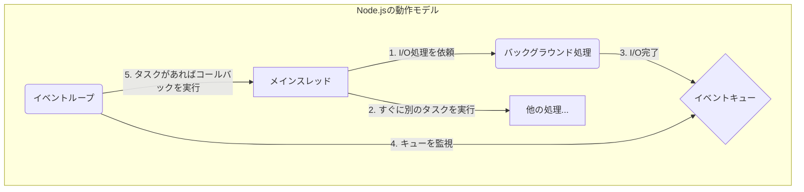

# 0315 Node.js基礎

## 🎯 この章で学ぶこと
- Node.jsがどのようなものであり、「サーバーサイドで動くJavaScript」がなぜ画期的なのかを理解する。
- Node.jsの「イベントループ」と「ノンブロッキングI/O」という、パフォーマンスを支える中心的な概念を説明できる。
- `http`モジュールを使い、ごく簡単なWebサーバーをNode.jsで立ち上げることができる。
- `fs`モジュールを使って、サーバーサイドでファイルの読み書きを行う基本的な方法を習得する。
- `npm` (Node Package Manager) を使って、外部ライブラリ（パッケージ）を導入し、プロジェクトの依存関係を管理する方法を理解する。

## 🤔 なぜ重要なのか
歴史的に、JavaScriptはWebブラウザの中でウェブページを動的にするための言語でした。一方、サーバー側の処理はPHP、Ruby、Python、Javaといった言語が担っていました。このため、フロントエンドとバックエンドで異なる言語と知識が求められるのが当たり前でした。

**Node.js**は、この常識を覆しました。JavaScriptという一つの言語で、ブラウザ（フロントエンド）からサーバー（バックエンド）まで一気通貫で開発することを可能にしたのです。これにより、学習コストの削減、コードの再利用、開発チームの柔軟性向上など、多くのメリットがもたらされました。

さらに、Node.jsはそのアーキテクチャ（イベントループとノンブロッキングI/O）により、特に**リアルタイム通信**（チャットアプリ、オンラインゲームなど）や、多数の同時接続を効率的にさばく**APIサーバー**の構築において高いパフォーマンスを発揮します。現代のWeb開発において、Node.jsを理解することは、バックエンド開発の重要な選択肢を知る上で不可欠です。

## 📚 基礎概念の理解

### Node.jsとは？
Node.jsは、単なるプログラミング言語ではなく、「**ChromeのV8 JavaScriptエンジンでビルドされたJavaScript実行環境**」です。
- **V8エンジン**: Google Chromeで使われている、非常に高速なJavaScript実行エンジン。
- **実行環境**: ブラウザの外（サーバーやデスクトップなど）でJavaScriptを動かすための土台。ブラウザが提供する`document`や`window`オブジェクトの代わりに、サーバー操作に必要な機能（ファイルシステムアクセス、ネットワーク通信など）を提供します。

### イベントループとノンブロッキングI/O
Node.jsのパフォーマンスの秘密は、この2つの概念にあります。

- **ブロッキングI/O（従来の方法）**:
  - ファイル読み込みやデータベースへの問い合わせ（これらを**I/O処理**と呼びます）が発生すると、その処理が終わるまでプログラム全体が停止（ブロック）してしまいます。
  - 例：レストランで一人の店員が、客Aの注文を受け、料理を作り、提供し終わるまで、次の客Bを待たせ続けるイメージ。

- **ノンブロッキングI/O（Node.jsの方法）**:
  - 時間のかかるI/O処理をバックグラウンドに「依頼」し、その完了を待たずにすぐ次の処理へ進みます。I/O処理が終わったら、その結果を「イベント」として通知してもらい、後続の処理（コールバック関数）を実行します。
  - 例：レストランの店員が、客Aの注文を厨房に伝えたら、すぐに客Bの注文を取りに行く。料理ができたら厨房から呼ばれ、客Aに提供するイメージ。

この仕組みを効率的に管理するのが**イベントループ**です。イベントループは常に「実行すべきタスクはあるか？」「完了したI/O処理はあるか？」を監視し、タスクをシングルスレッドで次々とさばいていきます。これにより、スレッドを多数作ることなく、多くの同時接続を効率的に処理できるのです。



### 主要な組み込みモジュール
Node.jsには、サーバーサイド開発でよく使われる機能が「モジュール」として標準で組み込まれています。
- `http`: HTTPサーバーやクライアントを作成するためのモジュール。
- `fs` (File System): ファイルの読み込み、書き込み、削除などを行うためのモジュール。
- `path`: ファイルパスやディレクトリパスを安全に操作するためのモジュール。
- `os`: オペレーティングシステムに関する情報（CPU、メモリなど）を取得するモジュール。

## 💡 実践的な活用

### ハンズオン：Hello, Worldサーバーの構築
1.  **プロジェクトの初期化**:
    ターミナルで新しいフォルダを作り、`npm init -y` を実行します。これにより、プロジェクト管理ファイルである `package.json` が生成されます。
    ```bash
    mkdir node-hello
    cd node-hello
    npm init -y
    ```
2.  **サーバーコードの作成 (`server.js`)**:
    `http`モジュールを使って、リクエストが来たら「Hello, World!」と返す簡単なサーバーを記述します。
    ```javascript
    // server.js
    const http = require('http'); // httpモジュールをインポート (CommonJS)

    const hostname = '127.0.0.1';
    const port = 3000;

    // サーバーインスタンスを作成
    const server = http.createServer((req, res) => {
      res.statusCode = 200;
      res.setHeader('Content-Type', 'text/plain');
      res.end('Hello, World!\n');
    });

    // 指定したポートとホスト名でリクエストを待ち受ける
    server.listen(port, hostname, () => {
      console.log(`Server running at http://${hostname}:${port}/`);
    });
    ```
3.  **サーバーの起動**:
    ターミナルで `node server.js` を実行します。
4.  **動作確認**:
    Webブラウザで `http://127.0.0.1:3000` にアクセスし、「Hello, World!」と表示されれば成功です。

### `npm`によるパッケージ管理
Node.jsのエコシステムを強力にしているのが`npm`と、そこに登録されている膨大な数の**パッケージ（ライブラリ）**です。
- **インストール**: 例えば、Webフレームワークである `express` をインストールするには、以下のコマンドを実行します。
  ```bash
  npm install express
  ```
  これにより、`node_modules`ディレクトリにパッケージがダウンロードされ、`package.json`と`package-lock.json`に依存関係が記録されます。
- **`package.json`**: プロジェクト名やバージョン、そして依存するパッケージの一覧 (`dependencies`) が記録される重要なファイル。
- **`package-lock.json`**: インストールされたパッケージの正確なバージョンを記録するファイル。これにより、他の環境でも全く同じバージョンのパッケージを再現インストールできます。

## 🔍 深掘り：プロの視点

### コールバック地獄と非同期処理の進化
初期のNode.jsでは、ノンブロッキング処理の結果を受け取るためにコールバック関数が多用されました。しかし、非同期処理が連続すると、コールバック関数がネストし、コードが非常に読みにくくなる「**コールバック地獄 (Callback Hell)**」という問題が発生しました。

```javascript
// コールバック地獄の例
fs.readFile('file1.txt', (err, data1) => {
  if (err) throw err;
  fs.readFile('file2.txt', (err, data2) => {
    if (err) throw err;
    // さらにネストが続く...
  });
});
```

この問題を解決するため、JavaScript (とNode.js) は進化を遂げました。
1.  **Promise**: 非同期処理の状態（未完了、成功、失敗）を表現するオブジェクト。`.then()`で処理をつなげることで、ネストを解消できます。
2.  **Async/Await**: Promiseをさらに直感的に、同期処理のような見た目で書けるようにした構文糖衣（シンタックスシュガー）。現代のNode.js開発では、この`async/await`を使った非同期処理が主流です。

```typescript
// Async/Awaitで改善
import { promises as fs } from 'fs';

async function readFiles() {
  try {
    const data1 = await fs.readFile('file1.txt');
    const data2 = await fs.readFile('file2.txt');
    // 同期処理のようにスッキリ書ける
  } catch (err) {
    console.error(err);
  }
}
```
この変遷を理解することは、Node.jsのコードを読み書きする上で非常に重要です。

## 📋 まとめとチェックポイント
- Node.jsは、サーバーサイドでJavaScriptを実行するための環境である。
- イベントループとノンブロッキングI/Oにより、多くの同時接続を効率的に扱える。
- `http`, `fs` などの組み込みモジュールで、Webサーバーの構築やファイル操作が可能。
- `npm`を使って外部パッケージを管理し、`package.json`で依存関係を定義する。
- Node.jsの非同期処理は、コールバックからPromise、そして`async/await`へと進化してきた。

**チェックポイント**:
- 「ブロッキングI/O」と「ノンブロッキングI/O」の違いを、レストランの店員の例えを使って説明できますか？
- `npm install` を実行したとき、`package.json` と `package-lock.json` はそれぞれどのような役割を果たしますか？
- なぜ現代のNode.js開発では、コールバック関数よりも`async/await`が好まれるのですか？

## 🔗 関連知識・発展学習
- [0312_Asynchronous_Programming.md](./0312_Asynchronous_Programming.md): `async/await`やPromiseに関するより詳細な解説です。
- [0314_Module_System.md](./0314_Module_System.md): Node.jsでは、歴史的にCommonJS (`require`) が使われてきましたが、近年ではESM (`import`) のサポートも進んでいます。
- **Express, Koa**: Node.jsのための人気のWebアプリケーションフレームワーク。`http`モジュールを直接使うよりも、遥かに簡単かつ高機能なWebサーバーを構築できます。 