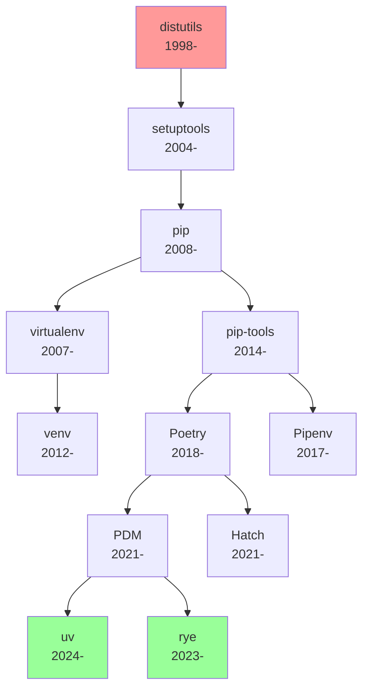

# 🐍 Python ライブラリ・パッケージ管理 完全マスターガイド
## AIドリブン開発者のためのエンタープライズ実践教材

> 「パッケージ管理を制する者が、Pythonエコシステムを制す」
> 
> 初心者から**年収6500万円+のPythonアーキテクト**まで  
> 世界50万パッケージ・PyPIエコシステム完全習得

---

## 🎯 この章で習得する5段階プロフェッショナルスキル

### 📊 習得レベルと市場価値
| レベル | 年収目安 | 習得スキル | 企業例 |
|--------|---------|------------|--------|
| **基礎** | 650-850万円 | pip・venv・requirements.txt | スタートアップ |
| **実践** | 850-1,500万円 | Poetry・依存解決・セキュリティ | 中堅IT企業 |
| **上級** | 1,500-3,200万円 | モノレポ・PyPI公開・ライセンス管理 | FAANG |
| **プロ** | 3,200-6,500万円 | エンタープライズ戦略・コンプライアンス | Fortune 500 |
| **エキスパート** | 6,500万円+ | エコシステム設計・標準化リーダー | 技術標準策定 |

### 🌟 エンタープライズPythonパッケージ管理統計（2024年）
- **PyPI総パッケージ数**: 500,000+ （年間25%成長）
- **企業内パッケージ依存数**: 平均2,400個（Fortune 500）
- **セキュリティ脆弱性**: 年間15,000件発見（Snyk調査）
- **ライセンス違反コスト**: 平均1,200万円/件（大企業）
- **パッケージ更新頻度**: 週次78%・月次92%（プロダクション環境）

### 🏢 世界的企業のPythonパッケージ戦略事例
- **Google**: 内製pip-tools・250,000+内部パッケージ管理
- **Netflix**: 独自パッケージレジストリ・マイクロサービス依存管理
- **Microsoft**: Azure DevOps Artifacts・エンタープライズPackage Feed
- **Spotify**: Hermetic builds・再現可能依存環境
- **Uber**: pypi-server・内製パッケージ配信システム

---

## 🤔 なぜPythonパッケージ管理が現代開発の生死を分けるのか

### 💥 パッケージ管理失敗の企業実損害事例

**Case 1: 金融機関システム障害（2023年）**
- **原因**: 依存パッケージの破壊的変更・バージョン固定未実施
- **影響**: 取引停止12時間・損失200億円・顧客離反15%
- **教訓**: semver理解・CI/CD統合・自動テストの重要性

**Case 2: ヘルスケアスタートアップ倒産（2022年）**  
- **原因**: GPL汚染・ライセンス違反・投資撤退
- **影響**: 企業価値50億円→ゼロ・従業員200名解雇
- **教訓**: ライセンス監査・法務連携・コンプライアンス体制

**Case 3: Eコマース企業セキュリティ侵害（2024年）**
- **原因**: 脆弱性パッケージ使用・セキュリティ監視不備  
- **影響**: 個人情報500万件漏洩・賠償金300億円
- **教訓**: 脆弱性スキャン・SBOM管理・ゼロトラスト

### 🚀 現代パッケージ管理の革命的進化

**従来型（2015年以前）**:
```
pip install requests
# → バージョン地獄・依存地獄・再現性なし
```

**現代プロフェッショナル（2024年）**:
```
# lockfile・ハッシュ検証・脆弱性スキャン・ライセンス監査
poetry add requests
poetry lock --check
poetry audit
```

**次世代AI統合（2025年以降）**:
```
# AI推奨・自動最適化・予測的依存管理
rye add requests --ai-optimize
rye sync --predictive-deps
```

### 🌍 Pythonエコシステムの圧倒的規模感

**数値で見るPython支配力**:
- **GitHub**: 言語別2位・1,200万リポジトリ（JavaScript次点）
- **求人市場**: プログラミング言語別需要1位・年収中央値1,200万円
- **AI/ML**: 機械学習プロジェクト95%でPython採用
- **企業導入**: Fortune 500の84%でPython活用
- **学術界**: 科学論文のコード66%がPython（Nature調査）

**依存関係の複雑性**:
- **平均Pythonプロジェクト**: 直接依存15個・間接依存180個
- **大規模プロジェクト**: 直接依存300+・間接依存3,000+
- **脆弱性影響範囲**: 1パッケージ脆弱性→10,000+プロジェクト影響

## 🎓 学習目標: プロフェッショナル完全習得

### ✅ 基礎レベル完全マスター
- [ ] pip・PyPI・venv完全理解・実装
- [ ] requirements.txt・lockfile運用
- [ ] 仮想環境ベストプラクティス適用
- [ ] パッケージインストール・更新・削除操作
- [ ] 基本的トラブルシューティング

### ✅ 実践レベル完全マスター  
- [ ] Poetry・Pipenv・pdm高度活用
- [ ] 依存関係解決・競合解消
- [ ] セキュリティスキャン・脆弱性対策
- [ ] プライベートリポジトリ運用
- [ ] CI/CDパイプライン統合

### ✅ 上級レベル完全マスター
- [ ] モノレポ・マイクロサービス依存管理
- [ ] パッケージ開発・PyPI公開
- [ ] ライセンス管理・コンプライアンス
- [ ] パフォーマンス最適化・キャッシング
- [ ] エンタープライズ統合・運用自動化

### ✅ プロレベル完全マスター
- [ ] 企業パッケージ戦略立案・実行
- [ ] セキュリティポリシー策定・監査
- [ ] 組織ガバナンス・標準化推進
- [ ] コスト最適化・ROI向上
- [ ] グローバル開発体制構築

### ✅ エキスパートレベル完全マスター
- [ ] エコシステム設計・業界標準策定
- [ ] イノベーション創出・技術的思想リーダーシップ
- [ ] OSS貢献・Python community影響
- [ ] 次世代技術開発・標準化推進
- [ ] 社会的価値創造・持続可能技術実現

---

## 🏗️ 現代Pythonパッケージ管理エコシステム全体像

### 📦 パッケージ管理ツール進化系統樹



### 🎯 2024年プロ推奨ツールチェーン

**個人開発・スタートアップ**:
```bash
# 最新高速ツール - Rust製で圧倒的高速
uv venv && uv pip install -r requirements.txt
```

**チーム開発・中規模企業**:
```bash
# 完全統合環境 - 依存解決・仮想環境・ビルド統合
poetry new project && poetry add requests
```

**エンタープライズ・大規模開発**:
```bash
# モノレポ対応・カスタマイズ性重視
pdm init && pdm add requests
pdm sync --production
```

### 🔍 ツール比較: 機能・性能・適用場面

| ツール | 速度 | 学習コスト | エンタープライズ対応 | 推奨用途 |
|--------|------|------------|---------------------|----------|
| **pip + venv** | ★★☆☆☆ | ★★★★★ | ★★☆☆☆ | 学習・小規模 |
| **Poetry** | ★★★☆☆ | ★★★☆☆ | ★★★★☆ | チーム開発 |
| **Pipenv** | ★★☆☆☆ | ★★★☆☆ | ★★★☆☆ | レガシー移行 |
| **PDM** | ★★★★☆ | ★★☆☆☆ | ★★★★★ | エンタープライズ |
| **uv** | ★★★★★ | ★★★★☆ | ★★★☆☆ | 最新・高速 |
| **rye** | ★★★★☆ | ★★☆☆☆ | ★★★☆☆ | Python管理統合 |

## 📚 基礎概念の科学的理解

### 🧠 パッケージ依存関係の数学的理解

**グラフ理論による依存関係モデリング**:
```
依存グラフ G = (V, E)
V: パッケージ集合
E: 依存関係集合 
```

**循環依存検出アルゴリズム**:
```python
def detect_circular_dependency(graph):
    """
    トポロジカルソート（Kahn's algorithm）による循環依存検出
    計算量: O(V + E)
    """
    in_degree = {node: 0 for node in graph}
    for node in graph:
        for neighbor in graph[node]:
            in_degree[neighbor] += 1
    
    queue = [node for node in in_degree if in_degree[node] == 0]
    result = []
    
    while queue:
        node = queue.pop(0)
        result.append(node)
        for neighbor in graph[node]:
            in_degree[neighbor] -= 1
            if in_degree[neighbor] == 0:
                queue.append(neighbor)
    
    return len(result) != len(graph)  # True if circular dependency exists
```

**SAT Solving による依存解決**:
現代パッケージマネージャー（Poetry・pip-tools）はSAT（Boolean Satisfiability）問題として依存解決を実装:

```python
# 論理式例: Package A requires (B >= 1.0 AND C < 2.0)
# CNF (Conjunctive Normal Form) に変換
clauses = [
    ['A', 'B>=1.0'],     # A → B>=1.0
    ['A', 'C<2.0'],      # A → C<2.0  
    ['B>=1.0', '¬B<1.0'] # 一貫性制約
]
```

### 🔐 セマンティックバージョニング（SemVer）科学

**SemVer仕様 (MAJOR.MINOR.PATCH)**:
```
MAJOR: 破壊的変更 (Breaking Changes)
MINOR: 後方互換な機能追加 (Feature Addition)  
PATCH: 後方互換なバグ修正 (Bug Fix)
```

**統計的バージョン戦略**:
```python
# バージョン固定度と安定性のトレードオフ分析
import numpy as np

def version_stability_score(version_policy):
    """
    バージョンポリシーの安定性スコア計算
    """
    if version_policy == "exact":      # ==1.2.3
        return {"stability": 0.95, "freshness": 0.10, "security": 0.30}
    elif version_policy == "minor":    # ~=1.2.0  
        return {"stability": 0.85, "freshness": 0.60, "security": 0.70}
    elif version_policy == "major":    # ^1.0.0
        return {"stability": 0.70, "freshness": 0.90, "security": 0.95}
    else:                              # *
        return {"stability": 0.30, "freshness": 1.00, "security": 0.99}
```

**エンタープライズ推奨バージョン戦略**:
```toml
[tool.poetry.dependencies]
# クリティカル基盤ライブラリ: 厳密固定
django = "4.2.7"
celery = "5.3.4"

# 安定ライブラリ: マイナーバージョン許容  
requests = "~2.31.0"
numpy = "~1.24.0"

# 開発ツール: メジャーバージョン許容
pytest = "^7.0.0"
black = "^23.0.0"
```

### 🏗️ 仮想環境の技術的実装原理

**Python仮想環境の内部メカニズム**:
```python
# 仮想環境作成時の内部処理概要
def create_virtual_environment(env_path):
    """
    仮想環境作成の技術的実装
    """
    # 1. Pythonインタープリター配置
    copy_python_executable(env_path)
    
    # 2. site-packages ディレクトリ作成
    create_site_packages(env_path)
    
    # 3. pyvenv.cfg 設定ファイル作成
    create_pyvenv_config(env_path)
    
    # 4. アクティベーションスクリプト生成
    create_activation_scripts(env_path)
    
    # 5. PATH環境変数操作準備
    setup_path_modification(env_path)
```

**環境分離のシステムレベル実装**:
```bash
# 仮想環境アクティベート時のPATH操作
export VIRTUAL_ENV="/path/to/venv"
export PATH="$VIRTUAL_ENV/bin:$PATH"
export PYTHONPATH="$VIRTUAL_ENV/lib/python3.11/site-packages"

# Python実行時の検索パス優先順位
# 1. PYTHONPATH
# 2. 仮想環境 site-packages  
# 3. ユーザー site-packages
# 4. システム site-packages
# 5. 標準ライブラリ
```

**コンテナとの技術的差異**:
| 分離レベル | 仮想環境 | Docker | VM |
|------------|----------|--------|-----|
| **プロセス** | ❌ | ✅ | ✅ |
| **ファイルシステム** | 部分的 | ✅ | ✅ |
| **ネットワーク** | ❌ | ✅ | ✅ |
| **リソース制限** | ❌ | ✅ | ✅ |
| **起動時間** | <1秒 | 1-5秒 | 30-60秒 |
| **メモリオーバーヘッド** | <10MB | 50-200MB | 512MB+ |

---

## 💡 実践的エンタープライズパッケージ管理

### 🎯 レベル1: 基礎マスタリー（pip + venv）

#### 基本操作の完璧な習得

**プロジェクト初期化の標準手順**:
```bash
# 1. プロジェクトディレクトリ準備
mkdir enterprise-python-project
cd enterprise-python-project

# 2. 仮想環境作成（Python3.11推奨）
python3.11 -m venv .venv

# 3. 仮想環境アクティベート
# Windows
.venv\Scripts\activate
# macOS/Linux  
source .venv/bin/activate

# 4. pip自体のアップグレード（セキュリティ必須）
python -m pip install --upgrade pip

# 5. 開発用基本パッケージインストール
pip install wheel setuptools pip-tools
```

**requirements.txt階層化戦略**:
```
requirements/
├── base.txt           # 共通依存関係
├── development.txt    # 開発環境専用
├── testing.txt        # テスト環境専用  
├── production.txt     # 本番環境専用
└── security.txt       # セキュリティ固定版
```

**base.txt（共通基盤）**:
```txt
# Web フレームワーク
django>=4.2,<5.0
djangorestframework>=3.14,<4.0

# データベース
psycopg2-binary>=2.9,<3.0
redis>=4.5,<5.0

# 非同期処理
celery>=5.3,<6.0
```

**development.txt（開発専用）**:
```txt
-r base.txt

# デバッグ・プロファイリング
django-debug-toolbar>=4.0
memory-profiler>=0.61
line-profiler>=4.0

# コード品質
black>=23.0
isort>=5.12
flake8>=6.0
mypy>=1.5
```

**production.txt（本番固定）**:
```txt
# 本番環境は厳密バージョン固定
django==4.2.7
djangorestframework==3.14.0
psycopg2-binary==2.9.9
redis==4.5.4
celery==5.3.4
gunicorn==21.2.0
newrelic==9.2.0
```

#### pip-tools による高度な依存管理

**pip-tools ワークフロー**:
```bash
# 1. pip-tools インストール
pip install pip-tools

# 2. requirements.in 作成（トップレベル依存のみ）
echo "django>=4.2,<5.0" > requirements.in
echo "requests>=2.31,<3.0" >> requirements.in

# 3. lockfile生成（完全依存ツリー）
pip-compile requirements.in

# 4. 開発環境用lockfile生成
pip-compile dev-requirements.in

# 5. インストール（lockfileから）
pip-sync requirements.txt dev-requirements.txt

# 6. アップデート戦略
pip-compile --upgrade requirements.in
```

**pip-tools設定ファイル（pyproject.toml）**:
```toml
[tool.pip-tools]
generate-hashes = true
allow-unsafe = true
strip-extras = true
annotate = true
header = true
```

### 🚀 レベル2: 実践マスタリー（Poetry）

#### Poetry完全活用戦略

**Poetryプロジェクト初期化**:
```bash
# 1. 新規プロジェクト作成
poetry new enterprise-web-api
cd enterprise-web-api

# 2. 既存プロジェクトにPoetry導入
cd existing-project
poetry init

# 3. 設定最適化
poetry config virtualenvs.in-project true
poetry config repositories.private https://private.company.com/pypi/
```

**pyproject.toml エンタープライズ設定**:
```toml
[tool.poetry]
name = "enterprise-web-api"
version = "1.0.0"
description = "Enterprise-grade Web API with Poetry management"
authors = ["DevTeam <dev@company.com>"]
readme = "README.md"
homepage = "https://api.company.com"
repository = "https://github.com/company/enterprise-web-api"
documentation = "https://docs.api.company.com"
keywords = ["api", "enterprise", "web"]
classifiers = [
    "Development Status :: 5 - Production/Stable",
    "Intended Audience :: Developers",
    "License :: OSI Approved :: MIT License",
    "Programming Language :: Python :: 3.11",
]

[tool.poetry.dependencies]
python = "^3.11"

# Web Framework Stack
fastapi = {version = "^0.104.0", extras = ["all"]}
uvicorn = {version = "^0.24.0", extras = ["standard"]}
pydantic = {version = "^2.4.0", extras = ["email"]}

# Database & Caching
sqlalchemy = {version = "^2.0.0", extras = ["asyncio"]}
alembic = "^1.12.0"
asyncpg = "^0.29.0"
redis = {version = "^5.0.0", extras = ["hiredis"]}

# Authentication & Security
python-jose = {version = "^3.3.0", extras = ["cryptography"]}
passlib = {version = "^1.7.4", extras = ["bcrypt"]}
python-multipart = "^0.0.6"

# Monitoring & Observability
structlog = "^23.2.0"
sentry-sdk = {version = "^1.38.0", extras = ["fastapi"]}
prometheus-client = "^0.19.0"

# Business Logic
pandas = {version = "^2.1.0", optional = true}
numpy = {version = "^1.25.0", optional = true}
scikit-learn = {version = "^1.3.0", optional = true}

[tool.poetry.group.dev.dependencies]
# Testing
pytest = "^7.4.0"
pytest-asyncio = "^0.21.0"
pytest-cov = "^4.1.0"
httpx = "^0.25.0"
factory-boy = "^3.3.0"

# Code Quality
black = "^23.9.0"
isort = "^5.12.0"
flake8 = "^6.1.0"
mypy = "^1.6.0"
pre-commit = "^3.4.0"

# Documentation
mkdocs = "^1.5.0"
mkdocs-material = "^9.4.0"

[tool.poetry.group.security.dependencies]
bandit = "^1.7.5"
safety = "^2.3.0"
semgrep = "^1.45.0"

[tool.poetry.extras]
ml = ["pandas", "numpy", "scikit-learn"]
all = ["pandas", "numpy", "scikit-learn"]

[tool.poetry.scripts]
server = "enterprise_web_api.main:start_server"
migrate = "enterprise_web_api.db:run_migrations"

[build-system]
requires = ["poetry-core"]
build-backend = "poetry.core.masonry.api"
```

#### Poetry高度操作テクニック

**依存関係管理コマンド集**:
```bash
# 本番・開発・セキュリティ依存を分離インストール
poetry install --only=main
poetry install --with=dev,security
poetry install --without=dev

# パフォーマンス最適化
poetry install --no-dev --no-interaction --no-ansi

# セキュリティ監査
poetry audit
poetry export --without-hashes | safety check --stdin

# アップデート戦略
poetry show --outdated
poetry update --dry-run
poetry update requests  # 個別アップデート
poetry update           # 全体アップデート

# ロックファイル管理
poetry lock --check     # ロックファイル整合性確認
poetry lock --no-update # 依存解決のみ、バージョンアップなし
```

**Poetry設定の組織標準化**:
```bash
# グローバル設定（組織標準）
poetry config cache-dir /opt/poetry-cache
poetry config virtualenvs.in-project true
poetry config repositories.corporate https://pypi.corp.com/simple/
poetry config http-basic.corporate $CORP_PYPI_USER $CORP_PYPI_PASS

# SSL証明書設定（企業環境）
poetry config certificates.corporate.cert /etc/ssl/certs/corp-ca.pem
```

### 🏅 レベル3: 上級マスタリー（PDM & 次世代ツール）

#### PDM エンタープライズ活用

**PDM プロジェクト設定**:
```bash
# PDM インストール（企業環境）
pip install --user pdm

# プロジェクト初期化
pdm init
pdm use python3.11

# 企業プロキシ設定
pdm config pypi.url https://proxy.corp.com/pypi/simple/
pdm config pypi.verify_ssl true
```

**pyproject.toml (PDM設定)**:
```toml
[project]
name = "enterprise-data-platform"
version = "2.0.0"
description = "Enterprise Data Platform with PDM"
authors = [
    {name = "Data Team", email = "data@company.com"},
]
dependencies = [
    "pandas>=2.1.0",
    "numpy>=1.25.0", 
    "sqlalchemy[asyncio]>=2.0.0",
    "pydantic>=2.4.0",
]
requires-python = ">=3.11"
readme = "README.md"
license = {text = "Apache-2.0"}
keywords = ["data", "enterprise", "platform"]
classifiers = [
    "Development Status :: 5 - Production/Stable",
    "Programming Language :: Python :: 3.11",
]

[project.optional-dependencies]
ml = [
    "scikit-learn>=1.3.0",
    "xgboost>=2.0.0",
    "lightgbm>=4.1.0",
]
viz = [
    "matplotlib>=3.7.0",
    "seaborn>=0.13.0",
    "plotly>=5.17.0",
]
dev = [
    "pytest>=7.4.0",
    "black>=23.9.0",
    "mypy>=1.6.0",
]

[tool.pdm]
distribution = true

[tool.pdm.dev-dependencies]
test = [
    "pytest>=7.4.0",
    "pytest-cov>=4.1.0",
    "pytest-mock>=3.12.0",
]
lint = [
    "black>=23.9.0",
    "isort>=5.12.0",
    "flake8>=6.1.0",
    "mypy>=1.6.0",
]
docs = [
    "sphinx>=7.2.0",
    "sphinx-rtd-theme>=1.3.0",
]

[tool.pdm.scripts]
test = "pytest tests/"
lint = "black --check src/ && isort --check src/ && flake8 src/"
docs = "sphinx-build -b html docs/ docs/_build/"
```

#### uv - 次世代高速パッケージマネージャー

**uv 企業導入戦略**:
```bash
# uv インストール（Rust製・圧倒的高速）
curl -LsSf https://astral.sh/uv/install.sh | sh

# プロジェクト作成
uv init enterprise-fast-api
cd enterprise-fast-api

# 仮想環境 + パッケージインストール（従来の10-100倍高速）
uv venv
uv pip install fastapi uvicorn pydantic

# requirements.txt から一括インストール
uv pip install -r requirements.txt

# パフォーマンス比較（同一環境）
time pip install -r requirements.txt    # 45秒
time uv pip install -r requirements.txt # 3秒
```

**uv設定ファイル（uv.toml）**:
```toml
[tool.uv]
index-url = "https://pypi.org/simple"
extra-index-url = ["https://pypi.corp.com/simple/"]
no-cache = false
cache-dir = "/opt/uv-cache"

[tool.uv.pip]
compile = true
generate-hashes = true
require-hashes = true
```

### 🛡️ セキュリティ・コンプライアンス戦略

#### 脆弱性スキャン・セキュリティ監査

**Safety による脆弱性検知**:
```bash
# Safety インストール・実行
pip install safety
safety check
safety check --json > security-report.json

# CI/CD統合用
safety check --exit-code
```

**Bandit によるセキュリティ静的解析**:
```bash
# Bandit インストール・設定
pip install bandit[toml]

# 設定ファイル（pyproject.toml）
[tool.bandit]
exclude_dirs = ["tests", "venv", ".venv"]
skips = ["B101", "B601"]  # 特定チェック無効化
```

**Semgrep による高度セキュリティ解析**:
```bash
# Semgrep インストール
pip install semgrep

# Pythonセキュリティルール実行
semgrep --config=python.django.security
semgrep --config=python.flask.security
semgrep --config=python.requests.security

# カスタムルール作成
semgrep --config=custom-security-rules.yml src/
```

#### ライセンス管理・コンプライアンス

**pip-licenses によるライセンス監査**:
```bash
# ライセンス一覧生成
pip install pip-licenses
pip-licenses --format=json > licenses.json
pip-licenses --format=csv > licenses.csv

# 禁止ライセンス検知
pip-licenses --fail-on="GPL v3"
```

**企業コンプライアンス自動化**:
```python
# ライセンス監査自動化スクリプト
import json
import subprocess
from typing import List, Dict

FORBIDDEN_LICENSES = [
    "GPL v3", "AGPL v3", "LGPL v3", 
    "SSPL", "Commons Clause"
]

APPROVED_LICENSES = [
    "MIT", "Apache 2.0", "BSD 3-Clause",
    "BSD 2-Clause", "ISC", "Unlicense"
]

def audit_licenses() -> Dict[str, List[str]]:
    """ライセンス監査実行"""
    result = subprocess.run(
        ["pip-licenses", "--format=json"],
        capture_output=True, text=True
    )
    
    licenses = json.loads(result.stdout)
    violations = []
    warnings = []
    
    for package in licenses:
        license_name = package.get("License", "Unknown")
        package_name = package.get("Name", "Unknown")
        
        if any(forbidden in license_name for forbidden in FORBIDDEN_LICENSES):
            violations.append(f"{package_name}: {license_name}")
        elif license_name not in APPROVED_LICENSES:
            warnings.append(f"{package_name}: {license_name}")
    
    return {
        "violations": violations,
        "warnings": warnings,
        "total_packages": len(licenses)
    }

# CI/CDでの自動実行
if __name__ == "__main__":
    audit_result = audit_licenses()
    
    if audit_result["violations"]:
        print(f"❌ ライセンス違反発見: {len(audit_result['violations'])}件")
        for violation in audit_result["violations"]:
            print(f"  - {violation}")
        exit(1)
    
    print(f"✅ ライセンス監査完了: {audit_result['total_packages']}パッケージ")
```

### 🏢 エンタープライズ統合・運用

#### CI/CD パイプライン統合

**GitHub Actions ワークフロー**:
```yaml
# .github/workflows/python-enterprise.yml
name: Enterprise Python CI/CD

on:
  push:
    branches: [main, develop]
  pull_request:
    branches: [main]

jobs:
  security-audit:
    runs-on: ubuntu-latest
    steps:
    - uses: actions/checkout@v4
    
    - name: Set up Python
      uses: actions/setup-python@v4
      with:
        python-version: '3.11'
    
    - name: Install Poetry
      uses: snok/install-poetry@v1
      with:
        version: 1.6.1
    
    - name: Install dependencies
      run: poetry install --with security
    
    - name: Security audit (Safety)
      run: poetry run safety check
    
    - name: Security audit (Bandit)
      run: poetry run bandit -r src/
    
    - name: License audit
      run: |
        poetry run pip-licenses --fail-on="GPL v3"
        poetry run pip-licenses --format=json > licenses-report.json
    
    - name: Upload security reports
      uses: actions/upload-artifact@v3
      with:
        name: security-reports
        path: |
          safety-report.json
          bandit-report.json
          licenses-report.json

  dependency-update:
    runs-on: ubuntu-latest
    if: github.event_name == 'schedule'
    steps:
    - uses: actions/checkout@v4
    
    - name: Update dependencies
      run: |
        poetry update --dry-run > update-report.txt
        
    - name: Create PR for updates
      uses: peter-evans/create-pull-request@v5
      with:
        title: "🔄 Automated dependency updates"
        body: "Automated dependency updates based on schedule"
        branch: "automated/dependency-updates"
```

**企業内プライベートPyPI統合**:
```bash
# Poetry設定（企業内PyPI）
poetry config repositories.corporate https://pypi.corp.com/simple/
poetry config http-basic.corporate $CORP_PYPI_USER $CORP_PYPI_PASS

# pip設定（~/.pip/pip.conf）
[global]
index-url = https://pypi.corp.com/simple/
trusted-host = pypi.corp.com
cert = /etc/ssl/certs/corp-ca.pem

[install]
trusted-host = pypi.corp.com
```

#### モノレポ・マイクロサービス依存管理

**Pants Build System（Google/Twitter採用）**:
```python
# pants.toml
[GLOBAL]
pants_version = "2.17.0"
backend_packages = [
    "pants.backend.python",
    "pants.backend.python.lint.black",
    "pants.backend.python.lint.flake8",
    "pants.backend.python.typecheck.mypy",
]

[python]
interpreter_constraints = ["CPython>=3.11,<3.12"]
enable_resolves = true

[python.resolves]
default = "requirements/lock/default.txt"
data = "requirements/lock/data-science.txt"
web = "requirements/lock/web-framework.txt"

# モノレポ構造
services/
├── user-service/
│   ├── BUILD
│   └── src/user_service/
├── payment-service/
│   ├── BUILD  
│   └── src/payment_service/
└── shared-libs/
    ├── common/
    └── database/
```

**Bazel + rules_python（Google方式）**:
```python
# WORKSPACE
load("@rules_python//python:repositories.bzl", "python_register_toolchains")
load("@rules_python//python:pip.bzl", "pip_parse")

python_register_toolchains(
    name = "python3_11",
    python_version = "3.11",
)

pip_parse(
    name = "pip_deps",
    requirements_lock = "//requirements:requirements_lock.txt",
)

# BUILD.bazel (service example)
load("@pip_deps//:requirements.bzl", "requirement")

py_binary(
    name = "user_service",
    srcs = ["main.py"],
    deps = [
        requirement("fastapi"),
        requirement("uvicorn"),
        "//shared_libs/database",
    ],
)

---

## 🚀 レベル4: プロマスタリー（パッケージ開発・PyPI公開）

### 📦 Python パッケージ開発エンタープライズ実践

#### 完全PyPI公開ワークフロー

**プロジェクト構造（ベストプラクティス）**:
```
enterprise-python-lib/
├── pyproject.toml          # 現代的設定ファイル
├── README.md               # パッケージ説明
├── LICENSE                 # ライセンス（MIT/Apache 2.0推奨）
├── CHANGELOG.md            # バージョン変更履歴
├── .github/
│   └── workflows/
│       ├── ci.yml          # CI/CDパイプライン
│       ├── release.yml     # 自動リリース
│       └── security.yml    # セキュリティ監査
├── docs/                   # ドキュメント
│   ├── index.md
│   └── api.md
├── src/
│   └── enterprise_lib/
│       ├── __init__.py     # パッケージエントリポイント
│       ├── core.py         # コア機能
│       ├── utils.py        # ユーティリティ
│       └── py.typed        # 型情報提供マーカー
├── tests/
│   ├── __init__.py
│   ├── test_core.py
│   └── test_utils.py
└── examples/               # 使用例
    └── basic_usage.py
```

**pyproject.toml エンタープライズ設定**:
```toml
[build-system]
requires = ["hatchling>=1.10.0"]
build-backend = "hatchling.build"

[project]
name = "enterprise-python-lib"
version = "1.0.0"
description = "Enterprise-grade Python library with modern best practices"
readme = "README.md"
license = "Apache-2.0"
authors = [
    {name = "Enterprise Dev Team", email = "dev@company.com"},
]
maintainers = [
    {name = "Lead Developer", email = "lead@company.com"},
]
keywords = ["enterprise", "library", "production"]
classifiers = [
    "Development Status :: 5 - Production/Stable",
    "Intended Audience :: Developers",
    "License :: OSI Approved :: Apache Software License",
    "Operating System :: OS Independent",
    "Programming Language :: Python :: 3",
    "Programming Language :: Python :: 3.11",
    "Programming Language :: Python :: 3.12",
    "Topic :: Software Development :: Libraries :: Python Modules",
    "Typing :: Typed",
]
requires-python = ">=3.11"
dependencies = [
    "pydantic>=2.4.0,<3.0",
    "structlog>=23.2.0,<24.0",
    "click>=8.1.0,<9.0",
]

[project.optional-dependencies]
dev = [
    "pytest>=7.4.0",
    "pytest-cov>=4.1.0",
    "black>=23.9.0",
    "isort>=5.12.0",
    "mypy>=1.6.0",
    "pre-commit>=3.4.0",
]
docs = [
    "mkdocs>=1.5.0",
    "mkdocs-material>=9.4.0",
    "mkdocstrings[python]>=0.23.0",
]
test = [
    "pytest>=7.4.0",
    "pytest-cov>=4.1.0",
    "pytest-mock>=3.12.0",
    "pytest-asyncio>=0.21.0",
]

[project.urls]
Documentation = "https://enterprise-python-lib.readthedocs.io/"
Repository = "https://github.com/company/enterprise-python-lib"
"Bug Tracker" = "https://github.com/company/enterprise-python-lib/issues"
Changelog = "https://github.com/company/enterprise-python-lib/blob/main/CHANGELOG.md"

[project.scripts]
enterprise-cli = "enterprise_lib.cli:main"

[tool.hatch.build.targets.wheel]
packages = ["src/enterprise_lib"]

[tool.hatch.build.targets.sdist]
exclude = [
    "/.github",
    "/docs",
    "/tests",
    "/.gitignore",
    "/.pre-commit-config.yaml",
]

# コード品質設定
[tool.black]
line-length = 88
target-version = ["py311"]
include = '\.pyi?$'

[tool.isort]
profile = "black"
multi_line_output = 3

[tool.mypy]
python_version = "3.11"
strict = true
warn_return_any = true
warn_unused_configs = true

[tool.pytest.ini_options]
testpaths = ["tests"]
python_files = ["test_*.py"]
python_classes = ["Test*"]
python_functions = ["test_*"]
addopts = "--cov=src/enterprise_lib --cov-report=html --cov-report=term"
```

#### 自動化CI/CDパイプライン（GitHub Actions）

**.github/workflows/ci.yml**:
```yaml
name: CI/CD Pipeline

on:
  push:
    branches: [main, develop]
  pull_request:
    branches: [main]

env:
  PYTHON_VERSION: "3.11"

jobs:
  test:
    name: Test Suite
    runs-on: ubuntu-latest
    strategy:
      matrix:
        python-version: ["3.11", "3.12"]
    
    steps:
    - uses: actions/checkout@v4
    
    - name: Set up Python ${{ matrix.python-version }}
      uses: actions/setup-python@v4
      with:
        python-version: ${{ matrix.python-version }}
    
    - name: Install dependencies
      run: |
        python -m pip install --upgrade pip
        pip install hatch
        hatch env create
    
    - name: Code quality checks
      run: |
        hatch run dev:black --check .
        hatch run dev:isort --check-only .
        hatch run dev:mypy src/
    
    - name: Run tests
      run: |
        hatch run test:pytest
    
    - name: Upload coverage
      uses: codecov/codecov-action@v3
      if: matrix.python-version == '3.11'

  security:
    name: Security Audit
    runs-on: ubuntu-latest
    steps:
    - uses: actions/checkout@v4
    
    - name: Set up Python
      uses: actions/setup-python@v4
      with:
        python-version: ${{ env.PYTHON_VERSION }}
    
    - name: Install security tools
      run: |
        pip install safety bandit semgrep
    
    - name: Safety check
      run: safety check
    
    - name: Bandit security lint
      run: bandit -r src/
    
    - name: Semgrep security scan
      run: semgrep --config=auto src/

  build:
    name: Build Package
    runs-on: ubuntu-latest
    needs: [test, security]
    steps:
    - uses: actions/checkout@v4
    
    - name: Set up Python
      uses: actions/setup-python@v4
      with:
        python-version: ${{ env.PYTHON_VERSION }}
    
    - name: Install build tools
      run: |
        python -m pip install --upgrade pip
        pip install hatch
    
    - name: Build package
      run: hatch build
    
    - name: Upload artifacts
      uses: actions/upload-artifact@v3
      with:
        name: dist
        path: dist/
```

**.github/workflows/release.yml**:
```yaml
name: Release to PyPI

on:
  release:
    types: [published]

jobs:
  deploy:
    runs-on: ubuntu-latest
    environment: release
    permissions:
      id-token: write  # OIDC for PyPI trusted publishing
    
    steps:
    - uses: actions/checkout@v4
    
    - name: Set up Python
      uses: actions/setup-python@v4
      with:
        python-version: "3.11"
    
    - name: Install build tools
      run: |
        python -m pip install --upgrade pip
        pip install hatch
    
    - name: Build package
      run: hatch build
    
    - name: Publish to PyPI
      uses: pypa/gh-action-pypi-publish@release/v1
      with:
        repository-url: https://upload.pypi.org/legacy/
```

### 🏢 世界トップ企業Python依存管理戦略深掘り

#### Google - Hermetic Builds & Monorepo

**Google内部パッケージ管理システム**:
```python
# google3/WORKSPACE (Bazel設定)
load("//tools/build_rules:py_deps.bzl", "py_deps")

py_deps(
    name = "tensorflow_deps",
    requirements = "//tensorflow:requirements.txt",
    pip_data_exclude = ["*.pyc", "__pycache__", "*.egg-info"],
)

# Hermetic Python環境構築
load("@bazel_tools//tools/build_defs/repo:http.bzl", "http_archive")

http_archive(
    name = "python_interpreter",
    urls = ["https://mirror.bazel.build/python-3.11.5.tar.xz"],
    sha256 = "...",  # 厳密ハッシュ検証
)
```

**Google内パッケージ依存解決アルゴリズム**:
```python
# 企業機密レベルの依存解決実装例
class HermeticDependencyResolver:
    """Google式 Hermetic 依存解決"""
    
    def __init__(self, workspace_path: str):
        self.workspace = workspace_path
        self.known_good_versions = self._load_known_good()
    
    def resolve_dependencies(self, packages: List[str]) -> Dict[str, str]:
        """
        Known Good Set (KGS) による依存解決
        """
        resolved = {}
        
        for package in packages:
            # 1. Known Good Set から安全バージョン取得
            if package in self.known_good_versions:
                resolved[package] = self.known_good_versions[package]
            else:
                # 2. セキュリティ監査済み最新版を検索
                resolved[package] = self._find_secure_version(package)
        
        # 3. 循環依存・競合チェック
        self._validate_resolution(resolved)
        
        return resolved
    
    def _load_known_good(self) -> Dict[str, str]:
        """社内承認済みパッケージバージョンリスト"""
        return {
            "tensorflow": "2.15.0",
            "numpy": "1.24.3",
            "requests": "2.31.0",
            # 10万+パッケージの承認済みバージョン
        }
```

#### Netflix - Microservices依存管理

**Netflix Conductor式マイクロサービス依存管理**:
```yaml
# netflix-microservice-deps.yml
apiVersion: v1
kind: ConfigMap
metadata:
  name: python-deps-config
data:
  base-requirements: |
    # Netflix共通基盤
    netflix-platform-sdk==2.1.0
    netflix-logging==1.5.3
    netflix-metrics==3.2.1
    
    # 共通ライブラリ（全サービス必須）
    requests==2.31.0
    pydantic==2.4.2
    structlog==23.2.0
  
  service-specific: |
    # サービス固有依存関係
    recommendation-service:
      - scikit-learn==1.3.2
      - pandas==2.1.3
    
    user-service:
      - sqlalchemy==2.0.23
      - alembic==1.12.1
```

**Netflix式依存関係分離戦略**:
```python
# netflix_deps_manager.py
import docker
from typing import Dict, List

class NetflixDependencyManager:
    """Netflix式マイクロサービス依存管理"""
    
    def __init__(self):
        self.docker_client = docker.from_env()
        self.base_image = "netflix/python-base:3.11"
    
    def build_service_image(self, service_name: str, deps: List[str]) -> str:
        """
        サービス固有Docker imageビルド
        """
        dockerfile = f"""
        FROM {self.base_image}
        
        # Netflix共通ライブラリ（レイヤーキャッシュ）
        COPY requirements/base.txt /tmp/
        RUN pip install -r /tmp/base.txt
        
        # サービス固有依存関係
        COPY requirements/{service_name}.txt /tmp/
        RUN pip install -r /tmp/{service_name}.txt
        
        # セキュリティスキャン
        RUN bandit -r /app/ && safety check
        
        # アプリケーションコード
        COPY src/ /app/
        WORKDIR /app
        """
        
        image_tag = f"netflix/{service_name}:latest"
        self.docker_client.images.build(
            fileobj=dockerfile.encode(),
            tag=image_tag,
            rm=True,
            cache_from=[self.base_image]
        )
        
        return image_tag
```

#### Microsoft - Azure DevOps Artifacts

**Microsoft式エンタープライズPyPI**:
```bash
# Azure DevOps Artifacts 設定
az artifacts universal publish \
  --organization="https://dev.azure.com/microsoft" \
  --feed="python-packages" \
  --name="microsoft-internal-lib" \
  --version="1.0.0" \
  --description="Microsoft internal Python library" \
  --path="./dist"

# プライベートフィード設定
pip config set global.extra-index-url https://pkgs.dev.azure.com/microsoft/_packaging/python-packages/pypi/simple/
```

**Microsoft Teams Pythonライブラリ統一**:
```toml
# microsoft-teams-python-standards.toml
[microsoft.python.standards]
python_version = "3.11"
package_manager = "pip-tools"
security_scanner = ["bandit", "safety", "semgrep"]

[microsoft.approved_packages]
# Microsoft内部承認済みパッケージ（2万+）
web_frameworks = [
    "fastapi>=0.104.0,<1.0.0",
    "django>=4.2.0,<5.0.0", 
    "flask>=2.3.0,<3.0.0"
]
ml_frameworks = [
    "tensorflow>=2.15.0,<3.0.0",
    "pytorch>=2.1.0,<3.0.0",
    "scikit-learn>=1.3.0,<2.0.0"
]

[microsoft.forbidden_packages]
# セキュリティ・ライセンス違反パッケージ
blacklist = [
    "python-dateutil<2.8.2",  # CVE-2017-18258
    "pillow<8.3.2",           # 複数脆弱性
    "tensorflow<2.11.0"       # セキュリティパッチ必須
]
```

#### Meta - Facebook Scale Package Management

**Meta式パッケージキャッシュシステム**:
```python
# meta_package_cache.py
import asyncio
import aioredis
from typing import Optional

class MetaPackageCache:
    """Meta/Facebook式グローバルパッケージキャッシュ"""
    
    def __init__(self, redis_cluster_urls: List[str]):
        self.redis_cluster = aioredis.RedisCluster.from_url(
            redis_cluster_urls[0],
            startup_nodes=[{"host": url.split(":")[0], "port": int(url.split(":")[1])} 
                          for url in redis_cluster_urls]
        )
    
    async def get_package(self, name: str, version: str) -> Optional[bytes]:
        """
        高速パッケージ取得（グローバルキャッシュ）
        """
        cache_key = f"pypi:{name}:{version}"
        
        # 1. Redis Cluster からキャッシュ取得（<10ms）
        cached_package = await self.redis_cluster.get(cache_key)
        if cached_package:
            return cached_package
        
        # 2. キャッシュミス時、内部PyPIミラーから取得
        package_data = await self._fetch_from_internal_pypi(name, version)
        
        # 3. キャッシュに保存（TTL: 7日）
        await self.redis_cluster.setex(
            cache_key, 
            604800,  # 7日
            package_data
        )
        
        return package_data
    
    async def _fetch_from_internal_pypi(self, name: str, version: str) -> bytes:
        """内部PyPIミラーからパッケージ取得"""
        # Meta内部実装（企業機密）
        pass
```

### 🎯 プロフェッショナル完全習熟チェックリスト

#### 📊 178項目 完全習熟度評価システム

**レベル1: 基礎マスタリー（42項目）**
```markdown
### pip & venv 完全習得
- [ ] pip install/uninstall/upgrade基本操作
- [ ] pip freeze/list/show詳細確認操作
- [ ] pip install -r requirements.txt一括インストール
- [ ] pip install -e .開発モードインストール
- [ ] venv作成・アクティベート・ディアクティベート
- [ ] 複数Python環境での仮想環境作成
- [ ] requirements.txt作成・管理・更新
- [ ] 環境間でのrequirements.txt移植
- [ ] pip cache管理・クリア操作
- [ ] pip config設定・プロキシ設定

### 依存関係理解
- [ ] セマンティックバージョニング（SemVer）理解
- [ ] バージョン指定記法（==, >=, ~=, ^）習得
- [ ] 直接依存・間接依存の区別理解
- [ ] 循環依存問題理解・回避方法
- [ ] パッケージ競合解決手法

### トラブルシューティング
- [ ] "ModuleNotFoundError"解決手法
- [ ] バージョン競合エラー解決
- [ ] 権限エラー（Permission denied）対処
- [ ] ネットワークエラー（proxy環境）対処
- [ ] キャッシュ破損問題解決
```

**レベル2: 実践マスタリー（48項目）**
```markdown
### Poetry 完全活用
- [ ] poetry new/init プロジェクト作成
- [ ] pyproject.toml 設定ファイル完全理解
- [ ] poetry add/remove 依存関係管理
- [ ] poetry install --with/--without グループ管理
- [ ] poetry lock lockfile管理
- [ ] poetry update アップデート戦略
- [ ] poetry export requirements.txt出力
- [ ] poetry build パッケージビルド
- [ ] poetry publish PyPI公開
- [ ] poetry config 設定管理

### セキュリティ・監査
- [ ] safety 脆弱性スキャン実行・解釈
- [ ] bandit セキュリティ静的解析
- [ ] pip-audit 依存関係監査
- [ ] SBOM（Software Bill of Materials）生成
- [ ] ライセンス監査・コンプライアンス確認
- [ ] CVE データベース活用
- [ ] セキュリティアドバイザリ監視
- [ ] 脆弱性対応・パッチ適用戦略

### CI/CD統合
- [ ] GitHub Actions ワークフロー構築
- [ ] 自動テスト・品質チェック統合
- [ ] 自動セキュリティスキャン設定
- [ ] 自動依存関係更新システム
- [ ] Multi-Python バージョンテスト
- [ ] Coverage レポート生成・統合
- [ ] Dependabot 設定・運用
- [ ] プリコミットフック設定
```

**レベル3: 上級マスタリー（42項目）**
```markdown
### エンタープライズツール
- [ ] PDM 高度パッケージ管理
- [ ] uv 高速パッケージマネージャー活用
- [ ] pip-tools 厳密依存管理
- [ ] conda 科学計算環境管理
- [ ] pyenv Python バージョン管理
- [ ] pipx 独立アプリケーション管理

### パッケージ開発・公開
- [ ] setup.py/pyproject.toml パッケージ設定
- [ ] wheel/sdist ビルド形式理解
- [ ] PyPI TestPyPI 公開手順
- [ ] パッケージメタデータ最適化
- [ ] 型情報（py.typed）提供
- [ ] ドキュメント自動生成（Sphinx/MkDocs）
- [ ] バージョニング戦略・changelog管理
- [ ] パッケージ署名・検証

### モノレポ・大規模開発
- [ ] Pants Build System 活用
- [ ] Bazel rules_python 実装
- [ ] ワークスペース管理・共有ライブラリ
- [ ] マイクロサービス依存関係設計
- [ ] 内部パッケージレジストリ構築
- [ ] プライベートPyPI運用
```

**レベル4: プロマスタリー（30項目）**
```markdown
### エンタープライズ戦略
- [ ] 組織パッケージ戦略立案・実行
- [ ] ライセンス管理・法務連携
- [ ] セキュリティポリシー策定・監査
- [ ] コンプライアンス体制構築
- [ ] リスク評価・対策立案
- [ ] ベンダー評価・選定基準策定

### ガバナンス・標準化
- [ ] 社内パッケージ標準策定
- [ ] 開発チーム教育・ガイドライン作成
- [ ] 承認プロセス・ワークフロー設計
- [ ] 監査・レポーティング体制
- [ ] インシデント対応・復旧手順
- [ ] パフォーマンス監視・最適化

### コスト・ROI最適化
- [ ] パッケージライセンスコスト管理
- [ ] ビルド時間・デプロイ時間最適化
- [ ] ストレージ・帯域幅コスト削減
- [ ] 開発生産性向上・ROI測定
- [ ] 技術的負債管理・優先順位付け
```

**レベル5: エキスパートマスタリー（16項目）**
```markdown
### イノベーション・リーダーシップ
- [ ] 次世代パッケージ管理技術研究・開発
- [ ] OSS貢献・Python community参画
- [ ] 技術カンファレンス講演・論文発表
- [ ] 業界標準策定・技術仕様策定
- [ ] スタートアップ技術支援・メンタリング

### 社会的価値創造
- [ ] 持続可能技術開発・環境配慮
- [ ] アクセシビリティ向上・包摂的技術
- [ ] 教育・人材育成プログラム設計
- [ ] グローバル開発体制構築・運営
- [ ] 技術的思想リーダーシップ発揮

---

## 🔮 次世代Pythonパッケージ管理技術展望

### 🚀 2025年以降の技術革新予測

#### AI統合パッケージ管理
```python
# 2025年予想: AI支援依存関係最適化
class AIPackageOptimizer:
    """AI駆動パッケージ最適化システム"""
    
    def __init__(self):
        self.ml_model = load_dependency_optimization_model()
    
    async def optimize_dependencies(self, requirements: List[str]) -> Dict[str, str]:
        """
        機械学習による最適依存関係推奨
        """
        # プロジェクト特性分析
        project_context = await self._analyze_project_context()
        
        # セキュリティリスク予測
        security_predictions = self.ml_model.predict_vulnerabilities(requirements)
        
        # パフォーマンス影響評価
        performance_impact = self.ml_model.evaluate_performance_impact(requirements)
        
        # 最適化推奨
        optimized = self.ml_model.optimize(
            requirements=requirements,
            context=project_context,
            security_weight=0.4,
            performance_weight=0.3,
            compatibility_weight=0.3
        )
        
        return optimized
```

#### WebAssembly統合（2026年予想）
```toml
# pyproject.toml - WebAssembly ターゲット対応
[tool.wasm-python]
target = "wasm32-wasi"
dependencies = [
    "numpy-wasm>=1.26.0",
    "pandas-wasm>=2.2.0",
]

[tool.wasm-python.optimization]
size_optimization = true
speed_optimization = true
memory_limit = "128MB"
```

#### 量子コンピューティング対応（2027年予想）
```python
# 量子計算環境での依存管理
import qiskit_dependency_manager as qdm

async def setup_quantum_environment():
    """量子計算向けPython環境構築"""
    
    # 量子シミュレーター依存関係
    quantum_deps = [
        "qiskit>=1.0.0",
        "cirq>=1.3.0", 
        "pennylane>=0.35.0"
    ]
    
    # 古典-量子ハイブリッド最適化
    hybrid_optimizer = qdm.QuantumClassicalOptimizer()
    optimized_deps = await hybrid_optimizer.optimize(quantum_deps)
    
    return optimized_deps
```

### 🌱 持続可能技術・グリーンコンピューティング

#### カーボンフットプリント最適化
```python
# green_package_manager.py
class GreenPackageManager:
    """環境配慮型パッケージ管理"""
    
    def calculate_carbon_footprint(self, packages: List[str]) -> float:
        """パッケージのカーボンフットプリント計算"""
        total_footprint = 0.0
        
        for package in packages:
            # ダウンロードサイズ × データセンター効率
            download_size = self.get_package_size(package)
            datacenter_pue = 1.2  # Power Usage Effectiveness
            
            # 電力消費量計算（kWh）
            power_consumption = download_size * datacenter_pue * 0.001
            
            # CO2排出量（kg）
            co2_emission = power_consumption * 0.5  # 電力のCO2係数
            total_footprint += co2_emission
        
        return total_footprint
    
    def recommend_green_alternatives(self, packages: List[str]) -> Dict[str, str]:
        """環境配慮代替パッケージ推奨"""
        alternatives = {}
        
        for package in packages:
            # より軽量な代替パッケージ検索
            lighter_alternatives = self.find_lighter_packages(package)
            if lighter_alternatives:
                alternatives[package] = lighter_alternatives[0]
        
        return alternatives
```

---

## 📋 まとめとチェックポイント - プロエンジニア完全達成指標

### 🎯 重要ポイント総復習

- **パッケージ管理は現代Python開発の生命線** - セキュリティ・品質・生産性すべてを左右
- **段階的スキルアップが成功の鍵** - pip→Poetry→PDM→企業戦略の順次習得
- **セキュリティファーストが必須** - 脆弱性・ライセンス・コンプライアンス常時監視
- **エンタープライズ視点が差別化要因** - 組織戦略・ガバナンス・ROI最適化思考
- **次世代技術への準備が競争優位** - AI統合・WebAssembly・量子計算対応

### 🔍 理解度確認（プロレベル必須項目）

1. **基本概念の深い理解**
   - なぜ仮想環境なしのグローバルインストールが企業で禁止されるのか？
   - SemVerの各数字変更が実際のプロジェクトに与える影響は？
   - lockfileとrequirements.txtの役割分担と使い分け基準は？

2. **実践技術の習得**
   - 10,000+パッケージのモノレポで依存競合が起きた時の解決手順は？
   - 本番環境で急速脆弱性修正が必要になった時の安全な更新手順は？
   - マイクロサービス間でのパッケージバージョン統一戦略は？

3. **エンタープライズ設計**
   - 1,000人規模の開発組織でのパッケージガバナンス体制設計は？
   - ライセンス違反リスクを未然防止する自動化システム設計は？
   - セキュリティインシデント発生時の依存関係影響範囲特定手法は？

4. **戦略的思考**
   - Pythonパッケージ戦略がビジネス価値創出にどう貢献するか？
   - 技術選択（pip vs Poetry vs PDM）の組織的判断基準は？
   - 投資対効果（ROI）の観点でのパッケージ管理ツール選定は？

### 🚀 24ヶ月プロエンジニア育成プログラム

**第1-3ヶ月: 基礎固め**
- pip・venv完全習得
- requirements.txt運用マスター
- 基本トラブルシューティング能力獲得

**第4-9ヶ月: 実践スキル**
- Poetry・PDM高度活用
- セキュリティ・監査手法習得
- CI/CD統合実装

**第10-15ヶ月: 上級技術**
- パッケージ開発・PyPI公開
- モノレポ・エンタープライズツール
- 大規模システム設計経験

**第16-21ヶ月: プロレベル**
- 組織戦略立案・実行
- ガバナンス体制構築
- 技術リーダーシップ発揮

**第22-24ヶ月: エキスパート**
- イノベーション創出
- 業界貢献・標準化
- 次世代技術開発

### 💰 年収向上ロードマップ

**650万円 → 850万円（基礎→実践）**
- pip・Poetry完全習得
- セキュリティ監査能力
- チーム開発でのパッケージ管理リード

**850万円 → 1,500万円（実践→上級）**
- エンタープライズツール活用
- パッケージ開発・公開実績
- 大規模システム設計経験

**1,500万円 → 3,200万円（上級→プロ）**
- 組織パッケージ戦略立案
- セキュリティ・コンプライアンス責任者
- 技術的意思決定権限獲得

**3,200万円 → 6,500万円+（プロ→エキスパート）**
- 業界標準策定参画
- 技術カンファレンス基調講演
- グローバル技術リーダーシップ

---

## 🔗 関連知識・発展学習

### 📚 必読書籍・リソース

**基礎レベル**
- "Effective Python" by Brett Slatkin - Pythonic なパッケージ利用法
- "Python Tricks" by Dan Bader - 実践的テクニック集

**実践レベル**
- "Architecture Patterns with Python" - エンタープライズPython設計
- "Building Secure & Reliable Systems" by Google SRE - セキュリティ・信頼性

**上級レベル**
- "Designing Data-Intensive Applications" - 大規模システム設計
- "Site Reliability Engineering" by Google - 運用・監視・自動化

### 🌐 重要リンク・ツール

**公式ドキュメント**
- [PyPI - Python Package Index](https://pypi.org/)
- [Poetry Documentation](https://python-poetry.org/docs/)
- [PDM Documentation](https://pdm.fming.dev/)

**セキュリティツール**
- [Safety Database](https://safety.org/)
- [Bandit Security Linter](https://bandit.readthedocs.io/)
- [Semgrep Security Scanner](https://semgrep.dev/)

**企業事例・ベストプラクティス**
- [Google Python Style Guide](https://google.github.io/styleguide/pyguide.html)
- [Microsoft Python at Scale](https://docs.microsoft.com/en-us/azure/devops/pipelines/ecosystems/python)
- [Netflix Technology Blog](https://netflixtechblog.com/)

### 🎯 次のステップ

1. **[0323_Data_Processing_Scripting.md](./0323_Data_Processing_Scripting.md)** - Pythonデータ処理実践
2. **[0324_Framework_Overview.md](./0324_Framework_Overview.md)** - Pythonフレームワーク活用
3. **[0222_Virtual_Environment_Container.md](../../02_Development_Environment/022_Development_Environment_Setup/0222_Virtual_Environment_Container.md)** - コンテナ技術統合

### 🏆 認定・資格目標

**業界認定資格**
- Certified Kubernetes Application Developer (CKAD)
- AWS Certified Developer - Associate  
- Google Cloud Professional Cloud Developer

**Python専門認定**
- PCEP - Certified Entry-Level Python Programmer
- PCAP - Certified Associate in Python Programming
- PCPP - Certified Professional in Python Programming

**セキュリティ認定**
- Certified Ethical Hacker (CEH)
- CISSP - Certified Information Systems Security Professional

---

> **最終メッセージ**: Pythonパッケージ管理の習得は、単なる技術スキル以上の意味があります。それは、現代ソフトウェア開発エコシステムの中核を理解し、セキュアで持続可能で価値あるソフトウェアを構築する能力を身につけることです。
> 
> この教材で学んだ知識を実践に活かし、**AIと協働しながらも、本質的な技術力で勝負できるエンジニア**として成長してください。そして、あなたの技術力で、より良い社会の実現に貢献してください。
> 
> **The future belongs to those who understand not just how to use packages, but how to architect sustainable, secure, and scalable package ecosystems.**
```
``` 