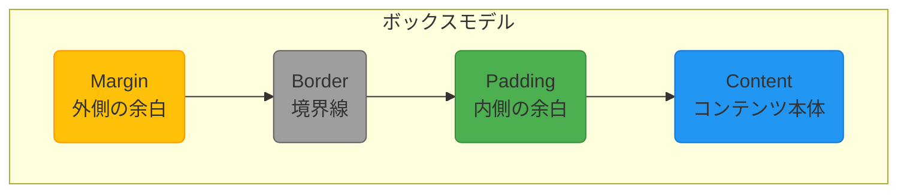

# 0331 HTML/CSS基礎

## 🎯 この章で学ぶこと
- Webページの「骨格」を作るHTML（HyperText Markup Language）の役割と基本構造を理解する。
- `<h1>`, `<p>`, `<a>`, ``など、主要なHTMLタグの意味と使い方を習得する。
- Webページの「見た目」を装飾するCSS（Cascading Style Sheets）の役割を理解する。
- CSSセレクタ（タグ、クラス、ID）を使って、特定のHTML要素にスタイルを適用する方法を学ぶ。
- HTMLとCSSがどのように連携してWebページを構築するのか、その関係性を説明できるようになる。

## 🤔 なぜ重要なのか
私たちが日常的に閲覧しているWebサイトやWebアプリケーションは、すべてこのHTMLとCSSを基礎として作られています。HTMLがなければコンテンツ（文字や画像）を表示できず、CSSがなければ殺風景で読みにくいページになってしまいます。

- **HTML**: Webページの**構造と意味**を定義する言語。「これは見出し」「これは段落」「これはリンク」といった、コンテンツの役割をコンピュータ（ブラウザや検索エンジン）に伝えます。
- **CSS**: HTMLで定義された構造に対して、**見た目やデザイン**を適用する言語。「見出しは赤色で大きく」「リンクは青色で下線を引く」といった、装飾を担当します。

たとえバックエンド開発者やデータサイエンティストであっても、HTMLとCSSの基本的な知識は不可欠です。自分が作ったAPIの結果が最終的にどのように表示されるのか、あるいは分析結果をWebレポートとして出力する際に、その構造を正しく理解していることは、他分野のエンジニアと円滑に協力する上で大きな助けとなります。AIにWebページの生成を依頼する際も、構造と見た目を区別して指示できる能力は、アウトプットの質を大きく左右します。

## 📚 基礎概念の理解

### HTMLの基本構造
HTML文書は、`<`と`>`で囲まれた**タグ**の集まりで構成されます。多くのタグは開始タグ（例: `<p>`）と終了タグ（例: `</p>`）でコンテンツを囲みます。

全てのHTMLファイルは、以下のような基本的な骨組みを持っています。

```html
<!DOCTYPE html> <!-- この文書がHTML5であることを宣言 -->
<html>
  <head>
    <!-- このページに関するメタ情報（ブラウザには直接表示されない） -->
    <meta charset="utf-8"> <!-- 文字コードの指定 -->
    <title>ページのタイトル</title>
    <link rel="stylesheet" href="style.css"> <!-- 外部CSSファイルの読み込み -->
  </head>
  <body>
    <!-- 実際にブラウザに表示されるコンテンツ -->
    <h1>最も大きな見出し</h1>
    <p>これは段落です。文章を書きます。</p>
    <a href="https://www.google.com">Googleへのリンク</a>
    
  </body>
</html>
```

- **主要なタグ**:
  - `<h1>`〜`<h6>`: 見出し。`<h1>`が最も重要。
  - `<p>`: 段落 (Paragraph)。
  - `<a>`: アンカー (Anchor)。他のページへのリンクを作成 (`href`属性でURLを指定)。
  - ``: 画像 (Image)。(`src`属性で画像パス、`alt`属性で代替テキストを指定)。
  - `<div>`: 分割 (Division)。特定の意味を持たない汎用的なブロックレベルのコンテナ。レイアウト目的でよく使われる。
  - `<span>`: 特定の意味を持たない汎用的なインラインのコンテナ。テキストの一部にスタイルを適用したい場合などに使う。

### CSSの基本構文
CSSは、**セレクタ**、**プロパティ**、**値**の3つの要素で構成されます。
「**どの要素(セレクタ)の**」「**何を(プロパティ)**」「**どうする(値)**」というルールを定義します。

```css
/* セレクタ { プロパティ: 値; } */
p {
  color: blue;         /* 文字色を青に */
  font-size: 16px;     /* 文字サイズを16ピクセルに */
}
```

- **セレクタの種類**:
  - **タグセレクタ**: 指定したタグ全体に適用 (`p`, `h1`, `div`など)。
  - **クラスセレクタ**: HTMLタグの`class`属性に対応。`.`（ドット）で始める。複数の要素に同じスタイルを適用したい場合に使う。
    ```html
    <p class="highlight-text">強調したい文章</p>
    ```
    ```css
    .highlight-text {
      background-color: yellow;
    }
    ```
  - **IDセレクタ**: HTMLタグの`id`属性に対応。`#`（ハッシュ）で始める。ページ内で**一意の要素**に特定のスタイルを適用したい場合に使う。
    ```html
    <div id="header">サイトのヘッダー</div>
    ```
    ```css
    #header {
      border-bottom: 2px solid black;
    }
    ```

**優先順位**: 一般的に、IDセレクタ > クラスセレクタ > タグセレクタ の順でスタイルが優先されます。これにより、基本的なスタイルをタグセレクタで定義しつつ、特定の部分だけをクラスやIDで上書きすることができます。

## 💡 実践的な活用

### ハンズオン：簡単な自己紹介ページの作成
HTMLとCSSを使って、基本的なレイアウトの自己紹介ページを作ってみましょう。

1.  **`index.html` ファイルの作成**:
    ```html
    <!DOCTYPE html>
    <html lang="ja">
    <head>
      <meta charset="UTF-8">
      <title>自己紹介</title>
      <link rel="stylesheet" href="style.css">
    </head>
    <body>
      <div id="container">
        <header>
          <h1>山田 太郎のページ</h1>
        </header>
        
        <main>
          
          <h2>自己紹介</h2>
          <p>はじめまして。東京都在住のエンジニアです。PythonとJavaScriptを使ったWeb開発に興味があります。</p>
          
          <h2 class="section-title">スキル</h2>
          <ul>
            <li>Python (Flask, Django)</li>
            <li>JavaScript (React, Node.js)</li>
            <li>データベース (SQL)</li>
          </ul>
        </main>
        
        <footer>
          <p>&copy; 2023 Taro Yamada</p>
        </footer>
      </div>
    </body>
    </html>
    ```

2.  **`style.css` ファイルの作成**:
    ```css
    /* 全体的なスタイル */
    body {
      font-family: sans-serif;
      line-height: 1.6;
      margin: 0;
      background-color: #f4f4f4;
    }

    #container {
      width: 80%;
      margin: auto;
      overflow: hidden;
      padding: 20px;
      background-color: white;
    }

    /* ヘッダー */
    header h1 {
      color: #333;
      text-align: center;
    }

    /* プロフィール写真 */
    .profile-pic {
      display: block;
      margin: 20px auto;
      border-radius: 50%; /* 角を丸くして円にする */
    }

    /* セクションタイトル */
    .section-title {
      border-bottom: 2px solid #007BFF;
      padding-bottom: 5px;
    }

    /* フッター */
    footer {
      text-align: center;
      margin-top: 30px;
      color: #888;
    }
    ```

**期待される結果**:
`index.html`をWebブラウザで開くと、基本的なスタイルが適用された自己紹介ページが表示されます。ヘッダー、メインコンテンツ、フッターが構造化され、文字色や背景色、画像の形などがCSSによって制御されていることが確認できます。

## 🔍 深掘り：プロの視点

### ボックスモデル (Box Model)
CSSレイアウトの根幹をなす非常に重要な概念です。全てのHTML要素は、長方形の「ボックス」として扱われ、そのボックスは以下の4つの領域で構成されます。


- **Content**: テキストや画像が表示される中心領域。`width`や`height`プロパティでサイズを指定します。
- **Padding**: コンテンツとボーダーの間の余白。
- **Border**: パディングの外側にある境界線。
- **Margin**: ボーダーの外側にある、他の要素との間の余白。

要素のサイズや要素間の距離を正確にコントロールするには、このボックスモデルの理解が不可欠です。

### FlexboxとGrid：モダンなレイアウト手法
伝統的なCSSレイアウト（`float`や`position`）は複雑になりがちでした。近年では、より直感的で強力なレイアウトシステムが標準となっています。

- **Flexbox (Flexible Box Layout)**:
  - 1次元（水平または垂直）のレイアウトを構築するのに適しています。
  - 主な用途: ナビゲーションバーの項目を等間隔に並べる、カードの高さを揃えるなど、要素の整列や間隔の調整に非常に強力です。

- **CSS Grid Layout**:
  - 2次元（行と列）のグリッドレイアウトを構築するためのシステム。
  - 主な用途: Webページ全体のレイアウト、複雑なタイル状のギャラリーなど、行と列の両方を厳密に制御したい場合に適しています。

これらのモダンなレイアウト手法を使いこなすことが、現代的なWebデザインを効率的に実装する鍵となります。

## 📋 まとめとチェックポイント
- HTMLはWebページの構造と意味を定義し、CSSは見た目を定義する。両者は分業してWebページを構築する。
- HTMLは`<h1>`や`<p>`などのタグでコンテンツの意味をマークアップする。
- CSSはセレクタ（タグ、クラス、ID）で対象要素を指定し、プロパティと値でスタイルを適用する。
- HTMLの`class`属性はCSSのクラスセレクタ（`.`）に、`id`属性はIDセレクタ（`#`）に対応する。
- CSSのボックスモデルは、全ての要素が持つContent, Padding, Border, Marginの4領域からなるレイアウトの基本概念である。

**チェックポイント**:
- HTMLの`class`と`id`の最も重要な違いは何ですか？どのような場合に使い分けますか？
- あるWebページで、特定の段落だけ文字を赤くしたい場合、HTMLとCSSでどのような記述をしますか？
- ある要素とその隣の要素との間にスペースを空けたい場合、ボックスモデルのどのプロパティ（Margin, Padding, Border）を調整すべきですか？

## 🔗 関連知識・発展学習
- [12_Frontend_Development](../../04_Network_Web_Development/043_Frontend_Development/): HTML/CSSは全てのフロントエンド開発の基礎となります。
- **JavaScript**: HTML(構造)、CSS(見た目)に、JavaScript(振る舞い)が加わることで、Webページは動的なアプリケーションになります。ユーザーの操作に応じて表示内容を変えたり、サーバーと通信したりするのはJavaScriptの役割です。
- **レスポンシブデザイン**: スマートフォン、タブレット、PCなど、異なる画面サイズに応じてレイアウトを最適化するデザイン手法。CSSのメディアクエリなどを使って実現します。 