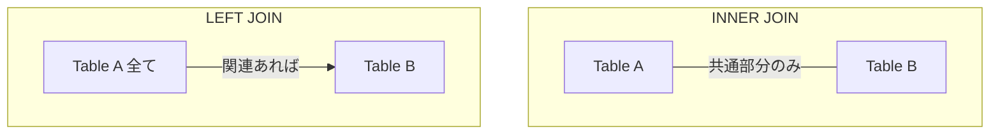

# 0332 SQL実践

## 🎯 この章で学ぶこと
- SQLが特定のプログラミング言語に依存しない、データベース操作のための「問い合わせ言語」であることを再確認する。
- `SELECT`, `FROM`, `WHERE`, `GROUP BY`, `ORDER BY` といった主要な句を組み合わせ、複雑なデータ抽出ができるようになる。
- `JOIN`（特に `INNER JOIN` と `LEFT JOIN`）を使い、複数のテーブルを結合して横断的なデータを取得する方法を習得する。
- サブクエリ（副問い合わせ）を使って、クエリを段階的に構築し、複雑な条件を指定する方法を理解する。
- `WITH`句（共通テーブル式, CTE）を使い、長くて複雑なクエリを整理し、可読性を向上させるテクニックを学ぶ。

## 🤔 なぜ重要なのか
Webアプリケーション、業務システム、データ分析基盤など、現代のほとんどのアプリケーションは何らかの形でデータベースを利用しており、その多くは**リレーショナルデータベース（RDB）**です。そして、RDBと対話するための標準言語が**SQL (Structured Query Language)** です。

プログラミング言語（Python, Java, JavaScriptなど）はアプリケーションのロジックを組み立てるのに対し、SQLは「**データベースから、どのような条件で、どのようなデータを取得、操作するか**」というデータ中心の要求を記述することに特化しています。

たとえ`Django`のORMや`Pandas`のようなライブラリが、SQLを直接書かなくても済むように抽象化してくれていたとしても、その内部でどのようなSQLが発行されているかを理解することは極めて重要です。複雑なデータ要求や、パフォーマンスチューニング（N+1問題の解決など）の場面では、結局のところ、効率的なSQLを自分で書けるかどうかが開発者の能力を大きく左右します。SQLは、データに関わる全てのエンジニアにとっての共通言語であり、避けては通れない必須スキルです。

## 📚 基礎概念の理解

### SQLは「宣言型」言語
多くのプログラミング言語が「どうやって（How）」を記述する**手続き型**であるのに対し、SQLは「**何を（What）**」が欲しいかを記述する**宣言型言語**です。

- **手続き型**: 「まずAテーブルからIDを取得し、そのIDを使ってBテーブルをループで検索し…」
- **宣言型 (SQL)**: 「AテーブルとBテーブルをこの条件で結合し、この条件に合うデータが欲しい」

「どうやって」効率的にデータを取得してくるかの具体的な実行計画は、データベース管理システム（DBMS）側が最適化してくれます。開発者は「欲しいデータ」の定義に集中できるのが、SQLの大きな特徴です。

### `JOIN`によるテーブル結合
正規化されたデータベースでは、データは複数のテーブルに分割されています。これらのテーブルから意味のある情報を得るためには、`JOIN`を使ってテーブル同士を結合する必要があります。

- **`INNER JOIN` (内部結合)**: 両方のテーブルに共通して存在するキーの行だけを結合する。最も一般的に使われるJOIN。
- **`LEFT JOIN` (左外部結合)**: 左側のテーブルの行はすべて残し、右側のテーブルに一致するキーがあれば結合し、なければ`NULL`として表示する。


**例**: `users`テーブルと`orders`テーブルを結合して、ユーザー名と注文情報を取得する。
```sql
SELECT
    u.name,
    o.order_date,
    o.amount
FROM
    users u
INNER JOIN
    orders o ON u.id = o.user_id;
```

### サブクエリ（副問い合わせ）
`SELECT`文の中に、別の`SELECT`文を埋め込む手法です。`FROM`句、`WHERE`句、`SELECT`句など、様々な場所で使えます。

**例**: 平均注文額よりも高額な注文一覧を取得する。
```sql
SELECT
    order_id,
    amount
FROM
    orders
WHERE
    amount > (SELECT AVG(amount) FROM orders); -- WHERE句でサブクエリを使用
```
サブクエリは直感的ですが、ネストが深くなると非常に読みにくくなるという欠点があります。

## 💡 実践的な活用

### ハンズオン：複数テーブルからのレポート作成
`employees`（従業員）、`departments`（部署）、`salaries`（給与）の3つのテーブルがあると仮定します。

- `employees` (`id`, `name`, `department_id`)
- `departments` (`id`, `name`)
- `salaries` (`employee_id`, `amount`, `date`)

**課題**: 各部署の平均給与を、平均給与が高い順に表示する。

```sql
SELECT
    d.name AS department_name, -- ASで別名を付ける
    AVG(s.amount) AS average_salary
FROM
    employees e
INNER JOIN
    departments d ON e.department_id = d.id
INNER JOIN
    salaries s ON e.id = s.employee_id
GROUP BY
    d.name -- 部署名でグループ化
ORDER BY
    average_salary DESC; -- 平均給与で降順に並べ替え
```

このクエリは、3つのテーブルを`JOIN`で結合し、`GROUP BY`で部署ごとに集計し、`AVG`で平均を計算し、`ORDER BY`で結果を並べ替える、という実践的なSQLの要素が詰まっています。

### 可読性の向上: `WITH`句 (CTE)
サブクエリが複雑に絡み合ったクエリは、非常に読みにくくなります。そこで、**`WITH`句（共通テーブル式, Common Table Expression, CTE）**を使います。`WITH`句を使うと、サブクエリに名前を付けて、クエリの主文から分離することができます。

**例**: 先ほどの「平均注文額よりも高額な注文」を`WITH`句で書き換える。

```sql
-- まず、avg_amount という名前で平均注文額を計算する一時的なテーブルを定義
WITH avg_orders AS (
    SELECT AVG(amount) AS avg_amount FROM orders
)
-- 上で定義したテーブルを使って、主文のクエリを実行
SELECT
    o.order_id,
    o.amount
FROM
    orders o,
    avg_orders ao -- FROM句でCTEを通常のテーブルのように使える
WHERE
    o.amount > ao.avg_amount;
```
この例ではあまりメリットを感じないかもしれませんが、複数のサブクエリを組み合わせるような複雑な分析では、`WITH`句を使うことで処理のステップが明確になり、クエリの可読性とメンテナンス性が劇的に向上します。

## 🔍 深掘り：プロの視点

### ウィンドウ関数 (Window Functions)
`GROUP BY`が集約によって元の行を失うのに対し、**ウィンドウ関数**は元の行を残したまま、集約や順位付けの結果を各行に追加することができます。

**例**: 各従業員の給与を、その従業員が所属する部署の平均給与と比較する。

```sql
SELECT
    e.name,
    d.name AS department_name,
    s.amount,
    -- 部署ごと(PARTITION BY)の平均給与を、各行に計算して追加
    AVG(s.amount) OVER (PARTITION BY d.name) AS department_avg_salary
FROM
    employees e
JOIN
    departments d ON e.department_id = d.id
JOIN
    salaries s ON e.id = s.employee_id;
```
この結果、各従業員の行に、その従業員の給与と、所属部署全体の平均給与が並んで表示されます。これにより、「部署平均より高い給与をもらっている従業員は誰か」といった分析が簡単に行えます。`RANK()`や`LAG()`など、様々なウィンドウ関数があり、データ分析の世界では必須のテクニックです。

### 実行計画とインデックス
前述の通り、SQLは宣言型言語であり、具体的な実行方法はDBMSが決定します。このDBMSが立てる実行手順のことを**実行計画**と呼びます。非効率なクエリ（例：`JOIN`の条件が悪い、`WHERE`句がインデックスを使っていない）を書くと、DBMSは最適な実行計画を立てられず、パフォーマンスが著しく低下します。

`EXPLAIN`（または`EXPLAIN ANALYZE`）コマンドを使うと、自分が書いたクエリの実行計画を確認できます。実行計画を読み解き、「テーブルをフルスキャンしていて遅いから、この列にインデックスを貼ろう」といったチューニングを行うのが、データベースパフォーマンス改善の王道です。SQLをただ書けるだけでなく、その裏側で何が起きているかを意識することが、プロフェッショナルへの道です。

## 📋 まとめとチェックポイント
- SQLは「何が欲しいか」を宣言する言語であり、具体的な実行方法はDBMSが担う。
- `JOIN`は複数のテーブルを結合するための必須の機能で、特に`INNER JOIN`と`LEFT JOIN`が多用される。
- サブクエリはクエリを入れ子にする機能だが、`WITH`句（CTE）を使うことで、より可読性の高い複雑なクエリを構築できる。
- ウィンドウ関数を使うと、元の行を維持したまま、集計や順位付けの結果を追加できる。
- 効率的なSQLを書くには、DBMSが立てる「実行計画」を意識し、インデックスの活用を考えることが重要。

**チェックポイント**:
- `INNER JOIN`と`LEFT JOIN`の違いを、具体的な例を挙げて説明できますか？
- 長いサブクエリで構成されたSQLの可読性が低い場合、どのような方法でリファクタリングしますか？
- `GROUP BY`とウィンドウ関数の`PARTITION BY`は、どちらもデータをグループ化しますが、その結果にどのような根本的な違いがありますか？

## 🔗 関連知識・発展学習
- [0131_Relational_Database.md](../../01_Development_Basic/013_Database_Basic/0131_Relational_Database.md): 正規化や主キー、外部キーといったRDBの基本概念の理解が、実践的なSQLを書く上での土台となります。
- [0134_Data_Modeling.md](../../01_Development_Basic/013_Database_Basic/0134_Data_Modeling.md): 適切なデータモデリングが、シンプルで効率的なSQLクエリの設計につながります。
- [134_Database_Integration](../../04_Network_Web_Development/044_Backend_Development/0442_Database_Integration.md): ORMが生成するSQLを確認し、パフォーマンスの問題（N+1問題など）を特定・修正するスキル。 