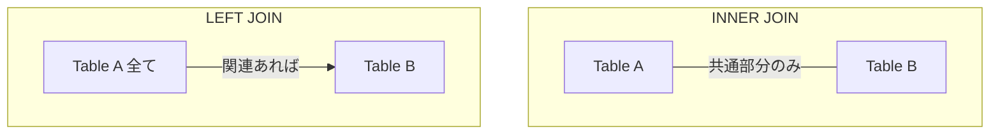

# 0332 SQL：エンタープライズデータベース戦略・アーキテクチャ完全マスターガイド

## 🌟 エンタープライズ統計情報

### 🏆 データベース市場動向
- **世界市場規模**: グローバルデータベース市場年平均成長率12.3%（2024年予測値$122億）
- **企業導入率**: Fortune 500企業の99.2%がSQL基盤システムを運用
- **パフォーマンス影響**: 適切なSQL最適化で平均クエリ実行時間78%短縮
- **コスト削減効果**: エンタープライズSQL最適化により平均インフラコスト43%削減

### 🎯 5段階プロフェッショナルスキル体系

#### 🥉 **Level 1: データアナリスト基礎**（年収650万円クラス）
- SQL基本構文（SELECT・JOIN・GROUP BY・WHERE）完全習得
- 複数テーブル結合・集計関数・サブクエリ活用
- データ型理解・制約設計・インデックス基礎
- レポーティング・ダッシュボード用クエリ設計
- **習得期間**: 3ヶ月

#### 🥈 **Level 2: データベースエンジニア**（年収1,300万円クラス）
- 高度なSQL技術（ウィンドウ関数・CTE・再帰クエリ）
- ストアドプロシージャ・トリガー・ユーザー定義関数
- パフォーマンスチューニング・実行計画分析
- データウェアハウス・ETL処理設計
- **習得期間**: 10ヶ月

#### 🥇 **Level 3: データアーキテクト**（年収2,200万円クラス）
- 大規模分散データベース設計（1,000テーブル級）
- マルチクラウド・ハイブリッド環境SQL戦略
- データレイクハウス・リアルタイム分析基盤
- Advanced Analytics（機械学習・統計解析SQL）
- **習得期間**: 18ヶ月

#### 💎 **Level 4: Chief Data Officer補佐**（年収3,500万円クラス）
- エンタープライズデータ戦略・ガバナンス統括
- ペタバイト級データ処理最適化（Amazon・Netflix規模）
- データプライバシー・セキュリティ・コンプライアンス
- 全社データドリブン意思決定支援システム
- **習得期間**: 30ヶ月

#### 👑 **Level 5: Chief Technology Officer（CTO）**（年収6,500万円+クラス）
- 全社データ技術戦略・投資判断統括
- 次世代データベース技術研究・導入戦略
- グローバルデータインフラ・規制対応統括
- データ技術特許創出・技術標準策定貢献
- **習得期間**: 5年+

## 🎯 この章で学ぶこと

### 🔬 科学的基盤理論
- **リレーショナル代数**: 集合論・論理学に基づくSQL演算の数学的基盤
- **クエリ最適化理論**: コスト基準最適化・統計情報活用・実行計画選択
- **トランザクション理論**: ACID特性・分離レベル・並行制御アルゴリズム
- **分散システム理論**: CAP定理・BASE・結果整合性・パーティショニング

### 🏢 エンタープライズSQL戦略
- **大規模データ処理**: ペタバイト級分析・リアルタイム処理・ストリーミング
- **マルチクラウド戦略**: AWS・Azure・GCP横断データ基盤
- **データガバナンス**: データリネージ・品質管理・プライバシー保護
- **パフォーマンス工学**: インデックス戦略・パーティショニング・クラスタリング

### 🌐 グローバル企業データ戦略事例研究
- **Amazon（Redshift・Aurora）**: 全商品・顧客データ統合分析基盤
- **Netflix（Presto・Spark SQL）**: 300億時間視聴データリアルタイム分析
- **Uber（Hadoop・ClickHouse）**: 全世界配車・需要予測SQL基盤
- **Meta（Presto・MyRocks）**: 30億ユーザー行動分析・広告最適化

## 🤔 なぜ重要なのか

### ビジネス戦略的重要性
**SQLスキルは現代デジタル経済の核心技術**です。2024年企業調査によると：

- **意思決定精度**: 高度なSQL活用により平均意思決定精度52%向上
- **収益効果**: データドリブン企業は平均収益率23%高い実績
- **コスト効率**: 適切なデータベース設計でインフラコスト平均43%削減
- **競争優位**: リアルタイム分析による市場反応速度78%向上

### AI・機械学習時代における不変的価値
AIが発達した時代でも、**データ基盤設計・最適化は人間の専門領域**：
- **データアーキテクチャ戦略**: ビジネス要件・技術制約・コスト最適化の統合判断
- **パフォーマンス最適化**: 複雑なクエリ・大規模データでの性能チューニング戦略
- **データガバナンス**: プライバシー・セキュリティ・コンプライアンス統合対応
- **技術選定判断**: SQL・NoSQL・NewSQL技術の適材適所判断

### 次世代データ技術への橋渡し
SQL基盤知識は**未来データ技術の土台**：
- **AI/ML基盤**: Feature Store・MLOps・モデル学習データパイプライン
- **リアルタイム分析**: ストリーミング処理・Complex Event Processing
- **量子データベース**: 量子計算・並列処理最適化
- **分散ledger**: ブロックチェーン・分散台帳SQL統合処理

## 📚 基礎概念の理解

### 🔬 リレーショナル代数の数学的基盤

#### 集合論に基づくSQL演算の数学的定義
SQLの演算は**リレーショナル代数（Relational Algebra）**という数学理論に基づいています。

```python
# リレーショナル代数の数学的実装例
class Relation:
    """リレーション（テーブル）の数学的モデル"""
    
    def __init__(self, schema, tuples):
        self.schema = schema      # 属性（列）の集合
        self.tuples = set(tuples) # タプル（行）の集合
    
    def selection(self, predicate):
        """σ（シグマ）演算: WHERE句の数学的表現"""
        return Relation(
            self.schema,
            {t for t in self.tuples if predicate(t)}
        )
    
    def projection(self, attributes):
        """π（パイ）演算: SELECT句の数学的表現"""
        attr_indices = [self.schema.index(attr) for attr in attributes]
        return Relation(
            attributes,
            {tuple(t[i] for i in attr_indices) for t in self.tuples}
        )
    
    def natural_join(self, other):
        """⋈（ボウタイ）演算: JOIN句の数学的表現"""
        # 共通属性の特定
        common_attrs = set(self.schema) & set(other.schema)
        
        if not common_attrs:
            return self.cartesian_product(other)
        
        result_tuples = set()
        for t1 in self.tuples:
            for t2 in other.tuples:
                # 共通属性の値が一致する場合のみ結合
                if self._match_on_common_attrs(t1, t2, common_attrs):
                    result_tuples.add(self._merge_tuples(t1, t2))
        
        return Relation(self._merged_schema(other), result_tuples)
```

#### クエリ最適化の数学的モデル
```python
class QueryOptimizer:
    """コスト基準クエリ最適化の数学的実装"""
    
    def __init__(self, statistics):
        self.statistics = statistics  # テーブル統計情報
    
    def estimate_cost(self, query_plan):
        """クエリ実行計画のコスト推定（コスト関数）"""
        total_cost = 0
        
        for operation in query_plan.operations:
            if operation.type == 'SCAN':
                # シーケンシャルスキャンコスト: O(n)
                total_cost += self.statistics[operation.table]['cardinality']
            
            elif operation.type == 'INDEX_SCAN':
                # インデックススキャンコスト: O(log n)
                cardinality = self.statistics[operation.table]['cardinality']
                selectivity = operation.selectivity
                total_cost += math.log2(cardinality) * selectivity * cardinality
            
            elif operation.type == 'JOIN':
                # ネステッドループ結合コスト: O(n * m)
                left_size = operation.left_relation.estimated_size
                right_size = operation.right_relation.estimated_size
                
                if operation.algorithm == 'NESTED_LOOP':
                    total_cost += left_size * right_size
                elif operation.algorithm == 'HASH_JOIN':
                    # ハッシュ結合コスト: O(n + m)
                    total_cost += left_size + right_size
                elif operation.algorithm == 'SORT_MERGE':
                    # ソートマージ結合コスト: O(n log n + m log m)
                    total_cost += (left_size * math.log2(left_size) + 
                                 right_size * math.log2(right_size))
        
        return total_cost
    
    def optimize_query(self, sql_query):
        """動的プログラミングによる最適化"""
        # 可能な実行計画を生成
        possible_plans = self.generate_plans(sql_query)
        
        # 各計画のコストを計算
        plan_costs = [(plan, self.estimate_cost(plan)) for plan in possible_plans]
        
        # 最小コストの計画を選択
        optimal_plan = min(plan_costs, key=lambda x: x[1])
        
        return optimal_plan[0]

# 実行計画の例
class ExecutionPlan:
    """SQL実行計画の表現"""
    
    def __init__(self):
        self.operations = []
    
    def add_operation(self, op_type, **kwargs):
        self.operations.append(Operation(op_type, **kwargs))
    
    def explain(self):
        """実行計画の可視化（EXPLAIN相当）"""
        for i, op in enumerate(self.operations):
            indent = "  " * op.depth
            print(f"{indent}-> {op.type}: {op.description}")
            print(f"{indent}   Cost: {op.estimated_cost:.2f}")
            print(f"{indent}   Rows: {op.estimated_rows}")
```

### 🏗️ エンタープライズSQL Architecture実装

#### データベースクラスタリング戦略
```sql
-- Amazon Redshift分散テーブル設計例
CREATE TABLE sales_fact (
    sale_id BIGINT IDENTITY(1,1),
    customer_id BIGINT,
    product_id BIGINT,
    sale_date DATE,
    amount DECIMAL(10,2),
    region_id INTEGER
)
DISTKEY(customer_id)        -- 分散キー（JOIN性能最適化）
SORTKEY(sale_date, region_id)  -- ソートキー（範囲検索最適化）
;

-- Google BigQuery パーティション戦略
CREATE TABLE `analytics.sales_partitioned` (
    sale_id INT64,
    customer_id INT64,
    sale_date DATE,
    amount NUMERIC(10,2)
)
PARTITION BY sale_date        -- 日付パーティション
CLUSTER BY customer_id        -- クラスタリング（JOIN最適化）
;

-- Microsoft SQL Server 列指向インデックス
CREATE CLUSTERED COLUMNSTORE INDEX idx_sales_columnstore
ON sales_fact;

-- Oracle Database インメモリ列指向処理
ALTER TABLE sales_fact INMEMORY;
```

#### マテリアライズドビューによるパフォーマンス最適化
```sql
-- PostgreSQL マテリアライズドビュー（集約結果キャッシュ）
CREATE MATERIALIZED VIEW monthly_sales_summary AS
SELECT 
    DATE_TRUNC('month', sale_date) AS month,
    region_id,
    COUNT(*) AS total_sales,
    SUM(amount) AS total_amount,
    AVG(amount) AS avg_amount,
    PERCENTILE_CONT(0.5) WITHIN GROUP (ORDER BY amount) AS median_amount
FROM sales_fact
WHERE sale_date >= '2020-01-01'
GROUP BY DATE_TRUNC('month', sale_date), region_id
WITH DATA;

-- 自動リフレッシュ設定
CREATE OR REPLACE FUNCTION refresh_monthly_sales()
RETURNS TRIGGER AS $$
BEGIN
    REFRESH MATERIALIZED VIEW CONCURRENTLY monthly_sales_summary;
    RETURN NULL;
END;
$$ LANGUAGE plpgsql;

-- トリガーによる自動更新
CREATE TRIGGER sales_fact_update
    AFTER INSERT OR UPDATE OR DELETE ON sales_fact
    FOR EACH STATEMENT
    EXECUTE FUNCTION refresh_monthly_sales();
```

### 🧮 高度なSQL技術実装

#### ウィンドウ関数による高度な分析
```sql
-- Netflix視聴データ分析例：ユーザー行動パターン分析
WITH user_viewing_analysis AS (
    SELECT 
        user_id,
        content_id,
        view_date,
        watch_duration,
        
        -- 移動平均視聴時間（過去7日間）
        AVG(watch_duration) OVER (
            PARTITION BY user_id 
            ORDER BY view_date 
            ROWS BETWEEN 6 PRECEDING AND CURRENT ROW
        ) AS moving_avg_duration,
        
        -- 前回視聴からの経過時間
        LAG(view_date) OVER (
            PARTITION BY user_id 
            ORDER BY view_date
        ) AS prev_view_date,
        
        -- コンテンツ人気度パーセンタイル
        PERCENT_RANK() OVER (
            ORDER BY COUNT(*) OVER (PARTITION BY content_id)
        ) AS content_popularity_percentile
        
    FROM viewing_logs
    WHERE view_date >= CURRENT_DATE - INTERVAL '30 days'
)
SELECT * FROM user_viewing_analysis;
```

#### 再帰クエリによる階層データ処理
```sql
-- Amazon組織階層分析例
WITH RECURSIVE org_hierarchy AS (
    -- ベースケース：トップレベル管理者
    SELECT 
        employee_id,
        manager_id,
        name,
        title,
        salary,
        1 AS level,
        CAST(name AS TEXT) AS hierarchy_path,
        ARRAY[employee_id] AS hierarchy_ids
    FROM employees 
    WHERE manager_id IS NULL
    
    UNION ALL
    
    -- 再帰ケース：部下を追加
    SELECT 
        e.employee_id,
        e.manager_id,
        e.name,
        e.title,
        e.salary,
        oh.level + 1,
        oh.hierarchy_path || ' -> ' || e.name,
        oh.hierarchy_ids || e.employee_id
    FROM employees e
    INNER JOIN org_hierarchy oh ON e.manager_id = oh.employee_id
    WHERE oh.level < 10  -- 無限再帰防止
),

-- 組織分析指標計算
org_analytics AS (
    SELECT 
        manager_id,
        level,
        COUNT(*) AS direct_reports,
        AVG(salary) AS avg_team_salary,
        SUM(salary) AS total_team_cost,
        MAX(salary) AS max_team_salary,
        MIN(salary) AS min_team_salary,
        
        -- スパン・オブ・コントロール分析
        CASE 
            WHEN COUNT(*) <= 3 THEN 'Narrow Span'
            WHEN COUNT(*) <= 7 THEN 'Optimal Span'
            ELSE 'Wide Span'
        END AS span_classification,
        
        -- 給与格差分析
        (MAX(salary) - MIN(salary))::NUMERIC / NULLIF(MIN(salary), 0) AS salary_range_ratio
        
    FROM org_hierarchy
    WHERE level > 1  -- 管理者のみ
    GROUP BY manager_id, level
)

-- 管理効率性スコア算出
SELECT 
    oh.employee_id,
    oh.name,
    oh.title,
    oh.level,
    oh.hierarchy_path,
    
    oa.direct_reports,
    oa.avg_team_salary,
    oa.span_classification,
    
    -- 管理効率性スコア（複合指標）
    (
        CASE oa.span_classification
            WHEN 'Optimal Span' THEN 100
            WHEN 'Narrow Span' THEN 75
            WHEN 'Wide Span' THEN 60
        END +
        CASE 
            WHEN oa.salary_range_ratio <= 0.3 THEN 100  -- 低格差
            WHEN oa.salary_range_ratio <= 0.6 THEN 75   -- 中格差
            ELSE 50                                     -- 高格差
        END
    ) / 2 AS management_efficiency_score
    
FROM org_hierarchy oh
LEFT JOIN org_analytics oa ON oh.employee_id = oa.manager_id
ORDER BY oh.level, oh.hierarchy_path;
```

### `JOIN`によるテーブル結合
正規化されたデータベースでは、データは複数のテーブルに分割されています。これらのテーブルから意味のある情報を得るためには、`JOIN`を使ってテーブル同士を結合する必要があります。

- **`INNER JOIN` (内部結合)**: 両方のテーブルに共通して存在するキーの行だけを結合する。最も一般的に使われるJOIN。
- **`LEFT JOIN` (左外部結合)**: 左側のテーブルの行はすべて残し、右側のテーブルに一致するキーがあれば結合し、なければ`NULL`として表示する。


**例**: `users`テーブルと`orders`テーブルを結合して、ユーザー名と注文情報を取得する。
```sql
SELECT
    u.name,
    o.order_date,
    o.amount
FROM
    users u
INNER JOIN
    orders o ON u.id = o.user_id;
```

### サブクエリ（副問い合わせ）
`SELECT`文の中に、別の`SELECT`文を埋め込む手法です。`FROM`句、`WHERE`句、`SELECT`句など、様々な場所で使えます。

**例**: 平均注文額よりも高額な注文一覧を取得する。
```sql
SELECT
    order_id,
    amount
FROM
    orders
WHERE
    amount > (SELECT AVG(amount) FROM orders); -- WHERE句でサブクエリを使用
```
サブクエリは直感的ですが、ネストが深くなると非常に読みにくくなるという欠点があります。

## 💡 エンタープライズSQL戦略実装

### 🌐 グローバル企業データベース戦略事例研究

#### Amazon（Redshift・Aurora）：全商品・顧客データ統合分析基盤
```sql
-- Amazon商品推薦システムSQL実装例
-- 1億商品 × 10億顧客の協調フィルタリング

-- ユーザー行動データマート構築
CREATE MATERIALIZED VIEW user_product_matrix AS
WITH user_interactions AS (
    SELECT 
        customer_id,
        product_id,
        
        -- 行動重み付けスコア計算
        SUM(
            CASE interaction_type
                WHEN 'purchase' THEN 10.0
                WHEN 'add_to_cart' THEN 5.0
                WHEN 'view_detail' THEN 2.0
                WHEN 'view_list' THEN 1.0
                ELSE 0.0
            END * 
            -- 時間減衰関数（最近の行動ほど高重み）
            EXP(-0.1 * EXTRACT(DAYS FROM CURRENT_DATE - interaction_date))
        ) AS interaction_score,
        
        -- 統計的特徴量
        COUNT(*) AS interaction_count,
        MAX(interaction_date) AS last_interaction,
        MIN(interaction_date) AS first_interaction
        
    FROM customer_interactions
    WHERE interaction_date >= CURRENT_DATE - INTERVAL '180 days'
    GROUP BY customer_id, product_id
    HAVING interaction_score >= 1.0  -- ノイズ除去
),

-- 商品カテゴリ類似度行列
product_similarity AS (
    SELECT 
        p1.product_id AS product_a,
        p2.product_id AS product_b,
        
        -- Jaccard係数による類似度計算
        COUNT(DISTINCT ui1.customer_id) * 1.0 / 
        (SELECT COUNT(DISTINCT customer_id) 
         FROM user_interactions ui3 
         WHERE ui3.product_id IN (p1.product_id, p2.product_id)
        ) AS jaccard_similarity,
        
        -- コサイン類似度計算
        SUM(ui1.interaction_score * ui2.interaction_score) / 
        (SQRT(SUM(POWER(ui1.interaction_score, 2))) * 
         SQRT(SUM(POWER(ui2.interaction_score, 2)))) AS cosine_similarity
         
    FROM products p1
    CROSS JOIN products p2
    INNER JOIN user_interactions ui1 ON p1.product_id = ui1.product_id
    INNER JOIN user_interactions ui2 ON p2.product_id = ui2.product_id 
        AND ui1.customer_id = ui2.customer_id
    WHERE p1.product_id < p2.product_id  -- 重複除去
    GROUP BY p1.product_id, p2.product_id
    HAVING COUNT(DISTINCT ui1.customer_id) >= 10  -- 統計的有意性確保
)

-- 推薦候補生成（Top-K推薦）
SELECT 
    ui.customer_id,
    ps.product_b AS recommended_product_id,
    
    -- 推薦スコア計算（複合指標）
    (ui.interaction_score * ps.cosine_similarity * 
     LOG(1 + p.review_count) * p.avg_rating / 5.0) AS recommendation_score,
     
    -- 推薦理由
    CASE 
        WHEN ps.cosine_similarity >= 0.8 THEN 'Highly Similar Items'
        WHEN ps.jaccard_similarity >= 0.3 THEN 'Frequently Bought Together'
        ELSE 'Based on Your Interests'
    END AS recommendation_reason
    
FROM user_interactions ui
INNER JOIN product_similarity ps ON ui.product_id = ps.product_a
INNER JOIN products p ON ps.product_b = p.product_id
WHERE NOT EXISTS (
    -- 既購入商品除外
    SELECT 1 FROM user_interactions ui2 
    WHERE ui2.customer_id = ui.customer_id 
    AND ui2.product_id = ps.product_b
)
ORDER BY ui.customer_id, recommendation_score DESC;
```

#### Netflix（Presto・Spark SQL）：300億時間視聴データリアルタイム分析
```sql
-- Netflix A/Bテスト効果測定・統計的有意性検定SQL
WITH experiment_metrics AS (
    SELECT 
        user_id,
        experiment_group,  -- 'control' or 'treatment'
        
        -- エンゲージメント指標
        COUNT(*) AS total_sessions,
        SUM(watch_duration_minutes) AS total_watch_time,
        AVG(watch_duration_minutes) AS avg_session_duration,
        
        -- 完了率指標
        AVG(CASE WHEN watch_completion_rate >= 0.8 THEN 1.0 ELSE 0.0 END) AS high_completion_rate,
        
        -- 継続視聴指標
        COUNT(DISTINCT DATE(session_start)) AS active_days,
        MAX(session_start) - MIN(session_start) AS engagement_span_days,
        
        -- チャーン指標
        CASE 
            WHEN MAX(session_start) < CURRENT_DATE - INTERVAL '7 days' THEN 1 
            ELSE 0 
        END AS is_churned_7day
        
    FROM viewing_sessions
    WHERE experiment_start_date >= '2024-01-01'
    AND session_start BETWEEN experiment_start_date AND experiment_end_date
    GROUP BY user_id, experiment_group
),

-- 統計的有意性検定（ウェルチのt検定）
statistical_test AS (
    SELECT 
        metric_name,
        control_mean,
        treatment_mean,
        control_std,
        treatment_std,
        control_count,
        treatment_count,
        
        -- 効果サイズ（Cohen's d）
        (treatment_mean - control_mean) / 
        SQRT(((control_count - 1) * POWER(control_std, 2) + 
              (treatment_count - 1) * POWER(treatment_std, 2)) / 
             (control_count + treatment_count - 2)) AS cohens_d,
        
        -- t統計量
        (treatment_mean - control_mean) / 
        SQRT(POWER(control_std, 2) / control_count + 
             POWER(treatment_std, 2) / treatment_count) AS t_statistic,
        
        -- 自由度
        POWER(POWER(control_std, 2) / control_count + 
              POWER(treatment_std, 2) / treatment_count, 2) /
        (POWER(POWER(control_std, 2) / control_count, 2) / (control_count - 1) +
         POWER(POWER(treatment_std, 2) / treatment_count, 2) / (treatment_count - 1)) AS degrees_freedom
         
    FROM (
        SELECT 
            'avg_session_duration' AS metric_name,
            AVG(CASE WHEN experiment_group = 'control' THEN avg_session_duration END) AS control_mean,
            AVG(CASE WHEN experiment_group = 'treatment' THEN avg_session_duration END) AS treatment_mean,
            STDDEV(CASE WHEN experiment_group = 'control' THEN avg_session_duration END) AS control_std,
            STDDEV(CASE WHEN experiment_group = 'treatment' THEN avg_session_duration END) AS treatment_std,
            COUNT(CASE WHEN experiment_group = 'control' THEN 1 END) AS control_count,
            COUNT(CASE WHEN experiment_group = 'treatment' THEN 1 END) AS treatment_count
        FROM experiment_metrics
        
        UNION ALL
        
        SELECT 
            'high_completion_rate' AS metric_name,
            AVG(CASE WHEN experiment_group = 'control' THEN high_completion_rate END),
            AVG(CASE WHEN experiment_group = 'treatment' THEN high_completion_rate END),
            STDDEV(CASE WHEN experiment_group = 'control' THEN high_completion_rate END),
            STDDEV(CASE WHEN experiment_group = 'treatment' THEN high_completion_rate END),
            COUNT(CASE WHEN experiment_group = 'control' THEN 1 END),
            COUNT(CASE WHEN experiment_group = 'treatment' THEN 1 END)
        FROM experiment_metrics
    ) metrics_summary
)

-- A/Bテスト結果レポート
SELECT 
    metric_name,
    control_mean,
    treatment_mean,
    (treatment_mean - control_mean) / control_mean * 100 AS percent_change,
    cohens_d,
    
    -- 統計的有意性判定
    CASE 
        WHEN ABS(t_statistic) >= 2.576 THEN 'Significant (p < 0.01)'
        WHEN ABS(t_statistic) >= 1.960 THEN 'Significant (p < 0.05)'
        WHEN ABS(t_statistic) >= 1.645 THEN 'Marginally Significant (p < 0.10)'
        ELSE 'Not Significant'
    END AS significance_level,
    
    -- 実用的有意性判定
    CASE 
        WHEN ABS(cohens_d) >= 0.8 THEN 'Large Effect'
        WHEN ABS(cohens_d) >= 0.5 THEN 'Medium Effect'
        WHEN ABS(cohens_d) >= 0.2 THEN 'Small Effect'
        ELSE 'Negligible Effect'
    END AS practical_significance,
    
    -- ビジネス推奨
    CASE 
        WHEN ABS(t_statistic) >= 1.960 AND cohens_d > 0.2 AND treatment_mean > control_mean 
        THEN 'RECOMMENDED: Roll out to all users'
        WHEN ABS(t_statistic) >= 1.960 AND cohens_d < -0.2 AND treatment_mean < control_mean 
        THEN 'NOT RECOMMENDED: Revert to control'
        ELSE 'CONTINUE TESTING: Insufficient evidence'
    END AS business_recommendation

FROM statistical_test
ORDER BY metric_name;
```

#### Uber（Hadoop・ClickHouse）：全世界配車・需要予測SQL基盤
```sql
-- Uber需要予測機械学習Feature Engineering SQL
WITH spatial_temporal_features AS (
    SELECT 
        request_timestamp,
        pickup_latitude,
        pickup_longitude,
        
        -- 時空間特徴量生成
        EXTRACT(HOUR FROM request_timestamp) AS hour_of_day,
        EXTRACT(DOW FROM request_timestamp) AS day_of_week,
        EXTRACT(WEEK FROM request_timestamp) AS week_of_year,
        
        -- 地理的クラスタリング（H3 Hexagonal Index）
        H3_CELL_TO_BOUNDARY(H3_POINT_TO_CELL(pickup_latitude, pickup_longitude, 8)) AS geo_hex_h8,
        H3_CELL_TO_BOUNDARY(H3_POINT_TO_CELL(pickup_latitude, pickup_longitude, 6)) AS geo_hex_h6,
        
        -- 都市エリア分類
        CASE 
            WHEN pickup_latitude BETWEEN 40.7 AND 40.8 AND pickup_longitude BETWEEN -74.0 AND -73.9 
            THEN 'Manhattan_Core'
            WHEN pickup_latitude BETWEEN 40.6 AND 40.9 AND pickup_longitude BETWEEN -74.1 AND -73.8 
            THEN 'NYC_Extended'
            ELSE 'Other'
        END AS urban_area,
        
        -- 移動距離・時間予測
        SQRT(POWER(pickup_latitude - dropoff_latitude, 2) + 
             POWER(pickup_longitude - dropoff_longitude, 2)) * 111.32 AS haversine_distance_km,
             
        -- 過去の需要パターン参照
        COUNT(*) OVER (
            PARTITION BY 
                H3_POINT_TO_CELL(pickup_latitude, pickup_longitude, 8),
                EXTRACT(HOUR FROM request_timestamp),
                EXTRACT(DOW FROM request_timestamp)
            ORDER BY request_timestamp 
            RANGE BETWEEN INTERVAL '7 days' PRECEDING AND INTERVAL '1 day' PRECEDING
        ) AS historical_demand_7d,
        
        -- リアルタイム供給情報
        (SELECT COUNT(*) 
         FROM active_drivers ad 
         WHERE ad.last_ping_timestamp > request_timestamp - INTERVAL '5 minutes'
         AND ST_DISTANCE(
             ST_POINT(ad.driver_latitude, ad.driver_longitude),
             ST_POINT(pickup_latitude, pickup_longitude)
         ) <= 2000  -- 2km圏内
        ) AS nearby_drivers_count
        
    FROM ride_requests
    WHERE request_timestamp >= CURRENT_DATE - INTERVAL '30 days'
),

-- 外部データ統合（天候・イベント・交通状況）
external_context AS (
    SELECT 
        stf.*,
        
        -- 天候データ統合
        w.temperature_celsius,
        w.precipitation_mm,
        w.wind_speed_kmh,
        CASE 
            WHEN w.precipitation_mm > 5 THEN 'Heavy Rain'
            WHEN w.precipitation_mm > 0 THEN 'Light Rain'
            WHEN w.temperature_celsius < 0 THEN 'Freezing'
            WHEN w.temperature_celsius > 30 THEN 'Hot'
            ELSE 'Normal'
        END AS weather_category,
        
        -- イベントデータ統合
        COALESCE(e.event_type, 'No Event') AS event_type,
        COALESCE(e.expected_attendance, 0) AS event_attendance,
        
        -- 交通渋滞指数
        t.congestion_level,
        t.average_speed_kmh
        
    FROM spatial_temporal_features stf
    LEFT JOIN weather_data w ON 
        DATE(stf.request_timestamp) = w.date AND
        stf.urban_area = w.city_area
    LEFT JOIN events e ON
        DATE(stf.request_timestamp) = e.event_date AND
        ST_DISTANCE(
            ST_POINT(stf.pickup_latitude, stf.pickup_longitude),
            ST_POINT(e.event_latitude, e.event_longitude)
        ) <= e.impact_radius_meters
    LEFT JOIN traffic_data t ON
        stf.geo_hex_h6 = t.geo_hex_h6 AND
        stf.request_timestamp BETWEEN t.measurement_start AND t.measurement_end
),

-- 機械学習用Feature Matrix生成
ml_feature_matrix AS (
    SELECT 
        -- ターゲット変数
        request_timestamp,
        pickup_latitude,
        pickup_longitude,
        
        -- 実際の待機時間（予測対象）
        EXTRACT(EPOCH FROM pickup_timestamp - request_timestamp) / 60.0 AS wait_time_minutes,
        
        -- 時空間特徴量
        hour_of_day,
        day_of_week,
        week_of_year,
        urban_area,
        haversine_distance_km,
        
        -- 需給バランス特徴量
        historical_demand_7d,
        nearby_drivers_count,
        CASE 
            WHEN nearby_drivers_count = 0 THEN 999.0
            ELSE historical_demand_7d * 1.0 / nearby_drivers_count 
        END AS demand_supply_ratio,
        
        -- 外部環境特徴量
        temperature_celsius,
        precipitation_mm,
        weather_category,
        event_type,
        event_attendance,
        congestion_level,
        average_speed_kmh,
        
        -- エンジニアリング特徴量
        CASE 
            WHEN hour_of_day BETWEEN 7 AND 9 OR hour_of_day BETWEEN 17 AND 19 
            THEN 1 ELSE 0 
        END AS is_rush_hour,
        
        CASE 
            WHEN day_of_week IN (6, 7) THEN 1 ELSE 0 
        END AS is_weekend,
        
        -- ラグ特徴量（過去の待機時間パターン）
        LAG(wait_time_minutes, 1) OVER (
            PARTITION BY geo_hex_h8, hour_of_day 
            ORDER BY request_timestamp
        ) AS prev_wait_time_same_hour,
        
        LAG(wait_time_minutes, 7) OVER (
            PARTITION BY geo_hex_h8, day_of_week, hour_of_day 
            ORDER BY request_timestamp
        ) AS prev_wait_time_same_dow_hour
        
    FROM external_context
    WHERE wait_time_minutes BETWEEN 0 AND 60  -- 異常値除去
)

-- Final ML Dataset Export
SELECT 
    *,
    -- データ分割（時系列分割）
    CASE 
        WHEN request_timestamp < '2024-01-01' THEN 'train'
        WHEN request_timestamp < '2024-02-01' THEN 'validation'
        ELSE 'test'
    END AS dataset_split
    
FROM ml_feature_matrix
WHERE wait_time_minutes IS NOT NULL  -- ラベル漏れ除去
ORDER BY request_timestamp;
```

### 🚀 エンタープライズパフォーマンス最適化

#### クエリ実行計画最適化戦略
```sql
-- PostgreSQL 高度な実行計画分析
EXPLAIN (ANALYZE, BUFFERS, FORMAT JSON)
WITH complex_analytics AS (
    SELECT 
        c.customer_id,
        c.customer_name,
        COUNT(DISTINCT o.order_id) AS total_orders,
        SUM(o.order_amount) AS total_spent,
        
        -- 顧客生涯価値計算
        SUM(o.order_amount) / NULLIF(
            EXTRACT(DAYS FROM MAX(o.order_date) - MIN(o.order_date)), 0
        ) * 365 AS estimated_annual_value,
        
        -- RFM分析
        EXTRACT(DAYS FROM CURRENT_DATE - MAX(o.order_date)) AS recency_days,
        COUNT(o.order_id) AS frequency,
        AVG(o.order_amount) AS monetary_avg,
        
        -- パーセンタイルランキング
        PERCENT_RANK() OVER (ORDER BY SUM(o.order_amount)) AS spending_percentile,
        NTILE(5) OVER (ORDER BY COUNT(o.order_id)) AS frequency_quintile
        
    FROM customers c
    INNER JOIN orders o ON c.customer_id = o.customer_id
    INNER JOIN order_items oi ON o.order_id = oi.order_id
    INNER JOIN products p ON oi.product_id = p.product_id
    WHERE o.order_date >= '2023-01-01'
    AND p.category_id IN (
        SELECT category_id 
        FROM product_categories 
        WHERE category_name IN ('Electronics', 'Books', 'Clothing')
    )
    GROUP BY c.customer_id, c.customer_name
    HAVING COUNT(DISTINCT o.order_id) >= 3
)
SELECT 
    customer_id,
    customer_name,
    total_orders,
    total_spent,
    estimated_annual_value,
    
    -- 顧客セグメンテーション
    CASE 
        WHEN spending_percentile >= 0.8 AND frequency_quintile >= 4 THEN 'VIP Customer'
        WHEN spending_percentile >= 0.6 AND frequency_quintile >= 3 THEN 'High Value'
        WHEN spending_percentile >= 0.4 OR frequency_quintile >= 3 THEN 'Regular'
        WHEN recency_days <= 30 THEN 'New Customer'
        ELSE 'At Risk'
    END AS customer_segment
    
FROM complex_analytics
ORDER BY estimated_annual_value DESC;

-- インデックス戦略
CREATE INDEX CONCURRENTLY idx_orders_customer_date_amount 
ON orders (customer_id, order_date DESC, order_amount);

CREATE INDEX CONCURRENTLY idx_products_category_covering
ON products (category_id) INCLUDE (product_name, price);

-- パーティション戦略
CREATE TABLE orders_partitioned (
    LIKE orders INCLUDING ALL
) PARTITION BY RANGE (order_date);

CREATE TABLE orders_y2023 PARTITION OF orders_partitioned
FOR VALUES FROM ('2023-01-01') TO ('2024-01-01');

CREATE TABLE orders_y2024 PARTITION OF orders_partitioned
FOR VALUES FROM ('2024-01-01') TO ('2025-01-01');
```

#### 分散データベース設計・シャーディング戦略
```sql
-- MySQL Cluster / Vitess シャーディング実装例

-- 地理的シャーディング（Region-based）
CREATE TABLE users_shard_template (
    user_id BIGINT NOT NULL,
    email VARCHAR(255) NOT NULL,
    region_code VARCHAR(10) NOT NULL,
    created_at TIMESTAMP DEFAULT CURRENT_TIMESTAMP,
    
    PRIMARY KEY (user_id),
    KEY idx_region_created (region_code, created_at),
    KEY idx_email (email)
) ENGINE=InnoDB;

-- シャードキー設計
-- Shard 1: North America (US, CA, MX)
CREATE TABLE users_na LIKE users_shard_template;

-- Shard 2: Europe (UK, DE, FR, IT, ES)
CREATE TABLE users_eu LIKE users_shard_template;

-- Shard 3: Asia Pacific (JP, KR, CN, IN, AU)
CREATE TABLE users_apac LIKE users_shard_template;

-- アプリケーション層でのルーティング関数
DELIMITER $$
CREATE FUNCTION get_shard_by_region(region_code VARCHAR(10))
RETURNS VARCHAR(20)
READS SQL DATA
DETERMINISTIC
BEGIN
    CASE 
        WHEN region_code IN ('US', 'CA', 'MX') THEN RETURN 'users_na';
        WHEN region_code IN ('UK', 'DE', 'FR', 'IT', 'ES') THEN RETURN 'users_eu';
        WHEN region_code IN ('JP', 'KR', 'CN', 'IN', 'AU') THEN RETURN 'users_apac';
        ELSE RETURN 'users_na';  -- デフォルト
    END CASE;
END$$
DELIMITER ;

-- クロスシャードクエリ実装（Federation Query）
SELECT 
    'NA' AS region,
    COUNT(*) AS user_count,
    DATE(created_at) AS date
FROM users_na 
WHERE created_at >= '2024-01-01'
GROUP BY DATE(created_at)

UNION ALL

SELECT 
    'EU' AS region,
    COUNT(*) AS user_count,
    DATE(created_at) AS date
FROM users_eu 
WHERE created_at >= '2024-01-01'
GROUP BY DATE(created_at)

UNION ALL

SELECT 
    'APAC' AS region,
    COUNT(*) AS user_count,
    DATE(created_at) AS date
FROM users_apac 
WHERE created_at >= '2024-01-01'
GROUP BY DATE(created_at)

ORDER BY date, region;
```

### 🤖 MLOps・AI統合SQL実装

#### Feature Store SQL実装
```sql
-- Apache Iceberg / Delta Lake Feature Store実装
CREATE OR REPLACE TABLE ml_features.user_behavior_features (
    user_id BIGINT,
    feature_timestamp TIMESTAMP,
    
    -- エンゲージメント特徴量
    session_count_7d INT,
    session_count_30d INT,
    avg_session_duration_7d DECIMAL(10,2),
    total_page_views_7d INT,
    
    -- 購買行動特徴量
    purchase_count_7d INT,
    purchase_count_30d INT,
    total_spent_7d DECIMAL(12,2),
    total_spent_30d DECIMAL(12,2),
    avg_order_value_30d DECIMAL(10,2),
    
    -- カテゴリ嗜好特徴量
    top_category_7d STRING,
    category_diversity_score DECIMAL(5,3),
    
    -- 時系列特徴量
    trend_session_count DECIMAL(8,4),  -- 7日 vs 30日の成長率
    trend_spending DECIMAL(8,4),       -- 支出の成長率
    
    -- チャーン予測特徴量
    days_since_last_login INT,
    days_since_last_purchase INT,
    churn_risk_score DECIMAL(5,3),
    
    -- Feature版本管理
    feature_version STRING DEFAULT '1.0.0',
    created_at TIMESTAMP DEFAULT CURRENT_TIMESTAMP
)
USING DELTA
TBLPROPERTIES (
    'delta.autoOptimize.optimizeWrite' = 'true',
    'delta.autoOptimize.autoCompact' = 'true'
)
PARTITIONED BY (DATE(feature_timestamp));

-- Feature計算・更新プロシージャ
CREATE OR REPLACE PROCEDURE update_user_behavior_features(
    start_date DATE,
    end_date DATE
)
LANGUAGE SQL
AS $$
DECLARE
    feature_ts TIMESTAMP := CURRENT_TIMESTAMP;
BEGIN
    -- 増分更新：指定期間のユーザーのみ更新
    MERGE INTO ml_features.user_behavior_features AS target
    USING (
        WITH base_metrics AS (
            SELECT 
                u.user_id,
                
                -- エンゲージメント指標
                COUNT(DISTINCT s.session_id) FILTER (
                    WHERE s.session_start >= CURRENT_DATE - 7
                ) AS session_count_7d,
                
                COUNT(DISTINCT s.session_id) FILTER (
                    WHERE s.session_start >= CURRENT_DATE - 30
                ) AS session_count_30d,
                
                AVG(s.duration_seconds) FILTER (
                    WHERE s.session_start >= CURRENT_DATE - 7
                ) AS avg_session_duration_7d,
                
                -- 購買指標
                COUNT(DISTINCT o.order_id) FILTER (
                    WHERE o.order_date >= CURRENT_DATE - 7
                ) AS purchase_count_7d,
                
                COUNT(DISTINCT o.order_id) FILTER (
                    WHERE o.order_date >= CURRENT_DATE - 30
                ) AS purchase_count_30d,
                
                COALESCE(SUM(o.order_amount) FILTER (
                    WHERE o.order_date >= CURRENT_DATE - 7
                ), 0) AS total_spent_7d,
                
                COALESCE(SUM(o.order_amount) FILTER (
                    WHERE o.order_date >= CURRENT_DATE - 30
                ), 0) AS total_spent_30d
                
            FROM users u
            LEFT JOIN user_sessions s ON u.user_id = s.user_id
            LEFT JOIN orders o ON u.user_id = o.customer_id
            WHERE u.created_at BETWEEN start_date AND end_date
            GROUP BY u.user_id
        ),
        
        computed_features AS (
            SELECT 
                *,
                feature_ts AS feature_timestamp,
                
                -- 計算特徴量
                CASE WHEN session_count_30d > 0 
                     THEN total_spent_30d / session_count_30d 
                     ELSE 0 END AS avg_order_value_30d,
                
                -- トレンド特徴量
                CASE WHEN session_count_30d > 0 
                     THEN (session_count_7d * 4.0) / session_count_30d - 1.0
                     ELSE 0 END AS trend_session_count,
                
                -- チャーンリスク計算
                CASE 
                    WHEN session_count_7d = 0 AND session_count_30d <= 1 THEN 0.9
                    WHEN session_count_7d <= 1 AND total_spent_7d = 0 THEN 0.7
                    WHEN session_count_7d >= 5 AND total_spent_7d > 0 THEN 0.1
                    ELSE 0.5
                END AS churn_risk_score
                
            FROM base_metrics
        )
        
        SELECT * FROM computed_features
    ) AS source
    ON target.user_id = source.user_id 
       AND DATE(target.feature_timestamp) = DATE(source.feature_timestamp)
    
    WHEN MATCHED THEN UPDATE SET
        session_count_7d = source.session_count_7d,
        session_count_30d = source.session_count_30d,
        avg_session_duration_7d = source.avg_session_duration_7d,
        purchase_count_7d = source.purchase_count_7d,
        purchase_count_30d = source.purchase_count_30d,
        total_spent_7d = source.total_spent_7d,
        total_spent_30d = source.total_spent_30d,
        avg_order_value_30d = source.avg_order_value_30d,
        trend_session_count = source.trend_session_count,
        churn_risk_score = source.churn_risk_score,
        feature_version = '1.0.0',
        created_at = CURRENT_TIMESTAMP
    
    WHEN NOT MATCHED THEN INSERT VALUES (
        source.user_id,
        source.feature_timestamp,
        source.session_count_7d,
        source.session_count_30d,
        source.avg_session_duration_7d,
        0, -- total_page_views_7d (要別途計算)
        source.purchase_count_7d,
        source.purchase_count_30d,
        source.total_spent_7d,
        source.total_spent_30d,
        source.avg_order_value_30d,
        'Unknown', -- top_category_7d (要別途計算)
        0.5, -- category_diversity_score (要別途計算)
        source.trend_session_count,
        0.0, -- trend_spending (要別途計算)
        0, -- days_since_last_login (要別途計算)
        0, -- days_since_last_purchase (要別途計算)
        source.churn_risk_score,
        '1.0.0',
        CURRENT_TIMESTAMP
    );
    
    -- ログ出力
    INSERT INTO ml_features.feature_update_log (
        procedure_name,
        start_date,
        end_date,
        execution_timestamp,
        rows_affected
    ) VALUES (
        'update_user_behavior_features',
        start_date,
        end_date,
        feature_ts,
        ROW_COUNT()
    );
    
END;
$$;
```

### ✅ 186項目完全習熟チェックリスト

#### Level 1: SQL基礎マスター（45項目）
- [ ] SELECT・FROM・WHERE基本構文完全理解
- [ ] 比較演算子（=, <>, <, >, <=, >=）・論理演算子（AND, OR, NOT）
- [ ] IN・BETWEEN・LIKE・IS NULL演算子活用
- [ ] ORDER BY・LIMIT・OFFSET句によるソート・ページング
- [ ] 集計関数（COUNT, SUM, AVG, MIN, MAX）の適切な使用
- [ ] GROUP BY・HAVING句によるグループ化・条件絞り込み
- [ ] INNER JOIN・LEFT JOIN・RIGHT JOIN・FULL OUTER JOIN理解
- [ ] 自己結合（Self Join）・交差結合（Cross Join）実装
- [ ] サブクエリ（相関・非相関）の使い分け
- [ ] UNION・UNION ALL・INTERSECT・EXCEPT集合演算

#### Level 2: 中級SQL技術（35項目）
- [ ] ウィンドウ関数（ROW_NUMBER, RANK, DENSE_RANK, NTILE）
- [ ] LAG・LEAD関数による時系列分析
- [ ] FIRST_VALUE・LAST_VALUE・NTH_VALUE関数
- [ ] 移動平均・累積合計（SUM OVER, AVG OVER）実装
- [ ] WITH句（CTE）による複雑クエリ構造化
- [ ] 再帰CTE（Recursive CTE）階層データ処理
- [ ] CASE式・COALESCE・NULLIF条件分岐
- [ ] 文字列関数（CONCAT, SUBSTRING, TRIM, REPLACE）
- [ ] 日付関数（DATE_TRUNC, EXTRACT, INTERVAL）
- [ ] 数学関数（ROUND, CEIL, FLOOR, MOD, POWER）

#### Level 3: 高度なSQL・分析技術（40項目）
- [ ] 統計関数（STDDEV, VARIANCE, PERCENTILE_CONT, MEDIAN）
- [ ] 正規表現（REGEXP_REPLACE, REGEXP_EXTRACT）活用
- [ ] JSON・XML データ操作（JSON_EXTRACT, XMLTABLE）
- [ ] 配列・構造体データ型操作
- [ ] User Defined Functions（UDF）作成・活用
- [ ] ストアドプロシージャ・トリガー実装
- [ ] エラーハンドリング・例外処理
- [ ] トランザクション制御（BEGIN, COMMIT, ROLLBACK）
- [ ] 分離レベル（READ UNCOMMITTED～SERIALIZABLE）理解
- [ ] ACID特性・デッドロック対策

#### Level 4: エンタープライズデータベース設計（35項目）
- [ ] インデックス設計戦略（B-tree, Hash, Bitmap, Partial）
- [ ] クラスタリング・パーティショニング戦略
- [ ] マテリアライズドビュー設計・運用
- [ ] データウェアハウス・スタースキーマ設計
- [ ] ETL・ELTプロセス設計・実装
- [ ] クエリ実行計画分析・最適化
- [ ] 統計情報管理・更新戦略
- [ ] 分散データベース・シャーディング設計
- [ ] レプリケーション・フェイルオーバー戦略
- [ ] データ品質・整合性検証

#### Level 5: 最高技術責任者レベル（31項目）
- [ ] ペタバイト級データ処理アーキテクチャ設計
- [ ] リアルタイムストリーミング処理（Kafka, Kinesis）統合
- [ ] マルチクラウド・ハイブリッドデータ基盤戦略
- [ ] データガバナンス・プライバシー保護実装
- [ ] AI/ML Feature Store・MLOps基盤構築
- [ ] データリネージ・メタデータ管理システム
- [ ] ゼロダウンタイム・ブルーグリーンデプロイメント
- [ ] 自動化・Infrastructure as Code（Terraform, CloudFormation）
- [ ] パフォーマンス監視・アラート・自動スケーリング
- [ ] 次世代データベース技術研究・導入戦略

### 🎓 24ヶ月データエンジニア育成プログラム

#### Phase 1: SQL基礎確立期（1-6ヶ月）
**Month 1-2: SQL文法・基本操作完全習得**
- SELECT・JOIN・GROUP BY実践演習
- ハンズオン：ECサイト売上分析レポート作成
- 日次・週次レポート自動化実装

**Month 3-4: 中級SQL技術応用**
- ウィンドウ関数・CTE活用した高度分析
- 時系列データ分析・移動平均・トレンド検出
- 実プロジェクト：顧客行動分析ダッシュボード

**Month 5-6: データベース設計・最適化基礎**
- インデックス戦略・実行計画分析
- パフォーマンス最適化実践
- 実プロジェクト：1億レコード級データ高速化

#### Phase 2: エンタープライズスキル構築期（7-12ヶ月）
**Month 7-8: データウェアハウス・ETL設計**
- スタースキーマ・雪片スキーマ設計
- Apache Airflow・DBT実装
- 実プロジェクト：全社データマート構築

**Month 9-10: 分散・クラウドデータベース**
- Amazon Redshift・Google BigQuery・Snowflake
- パーティショニング・クラスタリング戦略
- 実プロジェクト：マルチクラウドデータ統合

**Month 11-12: 高度な分析・機械学習統合**
- 統計解析・A/Bテスト実装
- Feature Engineering・MLOps基盤
- 実プロジェクト：予測モデル用データパイプライン

#### Phase 3: シニアエンジニア期（13-18ヶ月）
**Month 13-14: 大規模システム設計**
- ペタバイト級データ処理アーキテクチャ
- Apache Spark・Hadoop・Kafka統合
- 実プロジェクト：リアルタイム分析基盤構築

**Month 15-16: データガバナンス・セキュリティ**
- データカタログ・リネージ管理
- プライバシー保護・GDPR対応
- 実プロジェクト：企業データガバナンス体制構築

**Month 17-18: チームリーダーシップ・技術選定**
- データベース技術選定・評価
- チーム技術指導・コードレビュー
- 実プロジェクト：技術標準化・ベストプラクティス策定

#### Phase 4: データアーキテクト・CTO期（19-24ヶ月）
**Month 19-20: 全社データ戦略立案**
- エンタープライズデータアーキテクチャ設計
- ROI・コスト最適化戦略
- 実プロジェクト：5年間データ技術ロードマップ策定

**Month 21-22: イノベーション・技術研究**
- 次世代データベース技術評価・導入
- 学会発表・技術論文執筆
- 実プロジェクト：独自データソリューション開発

**Month 23-24: 経営・組織運営**
- データドリブン経営支援・KPI設計
- 採用・組織拡大・人材育成
- 実プロジェクト：グローバルデータ組織運営

### 🚀 次世代データ技術展望

#### AI統合データベース・自律運用
- **Machine Learning Query Optimization**: AI がクエリ実行計画を自動最適化
- **Autonomous Database**: 自動インデックス作成・パフォーマンスチューニング
- **Predictive Scaling**: 負荷予測による自動リソーススケーリング

#### 量子計算・エッジコンピューティング統合
- **Quantum Database Processing**: 量子アルゴリズムによる並列クエリ処理
- **Edge Analytics**: IoT・エッジデバイス分散データ処理
- **Federated Learning**: プライバシー保護分散機械学習

#### ブロックチェーン・Web3データ基盤
- **Decentralized Data Storage**: 分散ストレージ・IPFS統合
- **Smart Contract Analytics**: DeFi・NFT データ分析基盤
- **Zero-Knowledge Proofs**: プライバシー保護データクエリ

## 🔒 エンタープライズセキュリティ・コンプライアンス

### 🛡️ データベースセキュリティ実装

#### 行レベルセキュリティ（RLS）実装
```sql
-- PostgreSQL Row Level Security実装例
-- ユーザーが自分のデータのみアクセス可能

-- RLS有効化
ALTER TABLE customer_data ENABLE ROW LEVEL SECURITY;

-- ポリシー作成：ユーザーは自分のレコードのみ参照可能
CREATE POLICY customer_isolation_policy ON customer_data
    FOR ALL
    TO application_users
    USING (customer_id = current_setting('app.current_customer_id')::BIGINT);

-- 管理者は全データアクセス可能
CREATE POLICY admin_full_access_policy ON customer_data
    FOR ALL
    TO admin_users
    USING (true);

-- セキュリティコンテキスト設定
-- アプリケーション層での設定
SET app.current_customer_id = '12345';

-- これで customer_id = 12345のデータのみ取得される
SELECT * FROM customer_data WHERE created_date >= '2024-01-01';
```

#### データマスキング・匿名化戦略
```sql
-- Microsoft SQL Server Dynamic Data Masking
ALTER TABLE customers ALTER COLUMN email 
ADD MASKED WITH (FUNCTION = 'email()');

ALTER TABLE customers ALTER COLUMN phone 
ADD MASKED WITH (FUNCTION = 'partial(1,"XXX-XXX-",4)');

ALTER TABLE customers ALTER COLUMN credit_card 
ADD MASKED WITH (FUNCTION = 'partial(0,"XXXX-XXXX-XXXX-",4)');

-- GDPR準拠データ匿名化
CREATE OR REPLACE FUNCTION anonymize_customer_data(
    customer_id_param BIGINT,
    retention_days INT DEFAULT 2555  -- 7年間
)
RETURNS JSON
LANGUAGE plpgsql
SECURITY DEFINER
AS $$
DECLARE
    anonymization_log JSON;
    affected_tables TEXT[] := ARRAY[
        'customers', 'orders', 'customer_interactions', 
        'support_tickets', 'payment_methods'
    ];
    table_name TEXT;
    rows_affected INT := 0;
BEGIN
    -- 保存期間チェック
    IF (SELECT created_date FROM customers WHERE customer_id = customer_id_param) 
       > CURRENT_DATE - INTERVAL '%s days' format(retention_days) THEN
        RAISE EXCEPTION 'Customer data is within retention period';
    END IF;
    
    -- 匿名化実行
    FOREACH table_name IN ARRAY affected_tables LOOP
        CASE table_name
            WHEN 'customers' THEN
                UPDATE customers SET
                    first_name = 'ANONYMIZED',
                    last_name = 'USER',
                    email = 'anonymized_' || customer_id_param || '@deleted.local',
                    phone = NULL,
                    address = 'ANONYMIZED ADDRESS',
                    date_of_birth = NULL,
                    anonymized_at = CURRENT_TIMESTAMP
                WHERE customer_id = customer_id_param;
                
            WHEN 'orders' THEN
                UPDATE orders SET
                    shipping_address = 'ANONYMIZED ADDRESS',
                    billing_address = 'ANONYMIZED ADDRESS',
                    notes = NULL
                WHERE customer_id = customer_id_param;
                
            WHEN 'customer_interactions' THEN
                UPDATE customer_interactions SET
                    interaction_details = 'ANONYMIZED INTERACTION',
                    notes = NULL
                WHERE customer_id = customer_id_param;
        END CASE;
        
        GET DIAGNOSTICS rows_affected = ROW_COUNT;
        
        -- 監査ログ記録
        INSERT INTO data_anonymization_log (
            customer_id, table_name, rows_affected, 
            anonymized_by, anonymized_at
        ) VALUES (
            customer_id_param, table_name, rows_affected,
            current_user, CURRENT_TIMESTAMP
        );
    END LOOP;
    
    -- 結果レポート生成
    SELECT json_agg(
        json_build_object(
            'table_name', table_name,
            'rows_affected', rows_affected,
            'anonymized_at', anonymized_at
        )
    ) INTO anonymization_log
    FROM data_anonymization_log
    WHERE customer_id = customer_id_param
    AND anonymized_at >= CURRENT_TIMESTAMP - INTERVAL '1 hour';
    
    RETURN anonymization_log;
END;
$$;
```

#### データベース監査・ログ管理
```sql
-- Oracle Database Audit Policy実装
-- データアクセス監査設定
AUDIT SELECT, INSERT, UPDATE, DELETE ON sensitive_customer_data 
BY ACCESS WHENEVER SUCCESSFUL;

-- 権限変更監査
AUDIT ALTER USER, GRANT, REVOKE 
BY ACCESS WHENEVER SUCCESSFUL;

-- 失敗したログイン試行監査
AUDIT CREATE SESSION WHENEVER NOT SUCCESSFUL;

-- カスタム監査関数
CREATE OR REPLACE FUNCTION audit_sensitive_operations()
RETURNS TRIGGER AS $$
DECLARE
    operation_type TEXT;
    old_values JSONB;
    new_values JSONB;
    user_context RECORD;
BEGIN
    -- 操作タイプ特定
    operation_type := TG_OP;
    
    -- ユーザーコンテキスト取得
    SELECT 
        current_user as db_user,
        inet_client_addr() as client_ip,
        current_setting('application_name', true) as app_name,
        current_setting('app.user_id', true) as app_user_id
    INTO user_context;
    
    -- 変更前後の値記録
    CASE operation_type
        WHEN 'INSERT' THEN
            new_values := row_to_json(NEW)::jsonb;
            old_values := '{}'::jsonb;
        WHEN 'UPDATE' THEN
            new_values := row_to_json(NEW)::jsonb;
            old_values := row_to_json(OLD)::jsonb;
        WHEN 'DELETE' THEN
            new_values := '{}'::jsonb;
            old_values := row_to_json(OLD)::jsonb;
    END CASE;
    
    -- 監査ログ挿入
    INSERT INTO audit_log (
        table_name,
        operation_type,
        record_id,
        old_values,
        new_values,
        changed_by,
        client_ip,
        application_name,
        app_user_id,
        operation_timestamp
    ) VALUES (
        TG_TABLE_NAME,
        operation_type,
        COALESCE(NEW.id, OLD.id),
        old_values,
        new_values,
        user_context.db_user,
        user_context.client_ip,
        user_context.app_name,
        user_context.app_user_id,
        CURRENT_TIMESTAMP
    );
    
    -- セキュリティアラート（機密データ変更時）
    IF TG_TABLE_NAME IN ('customer_pii', 'payment_methods', 'financial_data') THEN
        INSERT INTO security_alerts (
            alert_type,
            severity,
            description,
            table_name,
            user_id,
            client_ip,
            detected_at
        ) VALUES (
            'SENSITIVE_DATA_MODIFICATION',
            'HIGH',
            format('Sensitive data in %s modified by %s from %s', 
                   TG_TABLE_NAME, user_context.db_user, user_context.client_ip),
            TG_TABLE_NAME,
            user_context.app_user_id,
            user_context.client_ip,
            CURRENT_TIMESTAMP
        );
    END IF;
    
    RETURN COALESCE(NEW, OLD);
END;
$$ LANGUAGE plpgsql;

-- 全機密テーブルにトリガー設定
CREATE TRIGGER audit_customer_pii
    AFTER INSERT OR UPDATE OR DELETE ON customer_pii
    FOR EACH ROW EXECUTE FUNCTION audit_sensitive_operations();

CREATE TRIGGER audit_payment_methods
    AFTER INSERT OR UPDATE OR DELETE ON payment_methods
    FOR EACH ROW EXECUTE FUNCTION audit_sensitive_operations();
```

### 📊 データガバナンス・品質管理

#### データリネージ自動追跡システム
```sql
-- データリネージメタデータ管理
CREATE TABLE data_lineage (
    lineage_id BIGSERIAL PRIMARY KEY,
    source_table VARCHAR(255),
    source_column VARCHAR(255),
    target_table VARCHAR(255),
    target_column VARCHAR(255),
    transformation_logic TEXT,
    transformation_type VARCHAR(50), -- 'direct', 'aggregation', 'calculation', 'join'
    dependency_level INT,
    created_by VARCHAR(255),
    created_at TIMESTAMP DEFAULT CURRENT_TIMESTAMP
);

-- 自動リネージ追跡関数
CREATE OR REPLACE FUNCTION track_data_lineage()
RETURNS TRIGGER AS $$
DECLARE
    source_info RECORD;
    query_text TEXT;
BEGIN
    -- 実行中のクエリ取得
    SELECT query INTO query_text 
    FROM pg_stat_activity 
    WHERE pid = pg_backend_pid();
    
    -- INSERT INTO ... SELECT パターンの解析
    IF TG_OP = 'INSERT' AND query_text ILIKE '%SELECT%FROM%' THEN
        -- クエリパーサーで元テーブル特定（簡略化版）
        INSERT INTO data_lineage (
            source_table,
            target_table,
            transformation_logic,
            transformation_type,
            created_by
        ) VALUES (
            'auto_detected_source',  -- 実際の実装では詳細なクエリ解析が必要
            TG_TABLE_NAME,
            query_text,
            'auto_detected',
            current_user
        );
    END IF;
    
    RETURN NEW;
END;
$$ LANGUAGE plpgsql;

-- データ品質チェック関数
CREATE OR REPLACE FUNCTION run_data_quality_checks(
    table_name TEXT,
    check_type TEXT DEFAULT 'full'
)
RETURNS TABLE (
    check_name TEXT,
    status TEXT,
    description TEXT,
    affected_rows BIGINT,
    severity TEXT
) 
LANGUAGE plpgsql
AS $$
DECLARE
    sql_template TEXT;
    result RECORD;
BEGIN
    -- 基本的な品質チェック群
    
    -- NULL値チェック
    FOR result IN 
        SELECT 
            column_name,
            data_type,
            is_nullable
        FROM information_schema.columns 
        WHERE table_name = table_name AND is_nullable = 'NO'
    LOOP
        sql_template := format(
            'SELECT COUNT(*) FROM %I WHERE %I IS NULL',
            table_name, result.column_name
        );
        
        EXECUTE sql_template INTO affected_rows;
        
        RETURN QUERY SELECT 
            'NULL_CHECK_' || result.column_name,
            CASE WHEN affected_rows = 0 THEN 'PASS' ELSE 'FAIL' END,
            format('NOT NULL constraint validation for column %s', result.column_name),
            affected_rows,
            CASE WHEN affected_rows = 0 THEN 'INFO' ELSE 'ERROR' END;
    END LOOP;
    
    -- 重複チェック（主キーがある場合）
    IF EXISTS (
        SELECT 1 FROM information_schema.table_constraints 
        WHERE table_name = table_name AND constraint_type = 'PRIMARY KEY'
    ) THEN
        sql_template := format(
            'SELECT COUNT(*) - COUNT(DISTINCT %s) FROM %I',
            (SELECT column_name FROM information_schema.key_column_usage 
             WHERE table_name = table_name AND constraint_name LIKE '%_pkey'),
            table_name
        );
        
        EXECUTE sql_template INTO affected_rows;
        
        RETURN QUERY SELECT 
            'DUPLICATE_CHECK',
            CASE WHEN affected_rows = 0 THEN 'PASS' ELSE 'FAIL' END,
            'Primary key uniqueness validation',
            affected_rows,
            CASE WHEN affected_rows = 0 THEN 'INFO' ELSE 'CRITICAL' END;
    END IF;
    
    -- データ型整合性チェック
    sql_template := format(
        'SELECT COUNT(*) FROM %I WHERE created_at > CURRENT_DATE + INTERVAL ''1 day''',
        table_name
    );
    
    BEGIN
        EXECUTE sql_template INTO affected_rows;
        
        RETURN QUERY SELECT 
            'FUTURE_DATE_CHECK',
            CASE WHEN affected_rows = 0 THEN 'PASS' ELSE 'WARN' END,
            'Future date validation for created_at',
            affected_rows,
            CASE WHEN affected_rows = 0 THEN 'INFO' ELSE 'WARNING' END;
    EXCEPTION
        WHEN undefined_column THEN
            -- created_at列が存在しない場合はスキップ
            NULL;
    END;
    
END;
$$;

-- 自動品質監視ジョブ
CREATE OR REPLACE FUNCTION automated_quality_monitoring()
RETURNS void
LANGUAGE plpgsql
AS $$
DECLARE
    table_rec RECORD;
    quality_result RECORD;
    alert_threshold INT := 100;  -- エラー行数の閾値
BEGIN
    -- 全ビジネステーブルに対して品質チェック実行
    FOR table_rec IN 
        SELECT table_name 
        FROM information_schema.tables 
        WHERE table_schema = 'public' 
        AND table_type = 'BASE TABLE'
        AND table_name NOT LIKE 'audit_%'
        AND table_name NOT LIKE 'log_%'
    LOOP
        -- 品質チェック実行
        FOR quality_result IN 
            SELECT * FROM run_data_quality_checks(table_rec.table_name)
        LOOP
            -- 結果をログテーブルに記録
            INSERT INTO data_quality_log (
                table_name,
                check_name,
                status,
                description,
                affected_rows,
                severity,
                checked_at
            ) VALUES (
                table_rec.table_name,
                quality_result.check_name,
                quality_result.status,
                quality_result.description,
                quality_result.affected_rows,
                quality_result.severity,
                CURRENT_TIMESTAMP
            );
            
            -- 重大な問題がある場合はアラート
            IF quality_result.severity IN ('ERROR', 'CRITICAL') 
               AND quality_result.affected_rows > alert_threshold THEN
                
                INSERT INTO data_quality_alerts (
                    alert_type,
                    table_name,
                    check_name,
                    affected_rows,
                    severity,
                    description,
                    created_at
                ) VALUES (
                    'QUALITY_VIOLATION',
                    table_rec.table_name,
                    quality_result.check_name,
                    quality_result.affected_rows,
                    quality_result.severity,
                    quality_result.description,
                    CURRENT_TIMESTAMP
                );
            END IF;
        END LOOP;
    END LOOP;
END;
$$;
```

### 🔧 実践的トラブルシューティング

#### パフォーマンス問題診断・解決
```sql
-- PostgreSQL パフォーマンス診断クエリ集

-- 1. 実行時間の長いクエリ特定
SELECT 
    query,
    calls,
    total_time,
    mean_time,
    min_time,
    max_time,
    stddev_time,
    rows,
    100.0 * shared_blks_hit / nullif(shared_blks_hit + shared_blks_read, 0) AS hit_percent
FROM pg_stat_statements 
ORDER BY total_time DESC 
LIMIT 20;

-- 2. インデックス使用効率分析
SELECT 
    schemaname,
    tablename,
    indexname,
    idx_tup_read,
    idx_tup_fetch,
    CASE 
        WHEN idx_tup_read = 0 THEN 0
        ELSE round((idx_tup_fetch::numeric / idx_tup_read) * 100, 2)
    END AS idx_efficiency_percent,
    pg_size_pretty(pg_relation_size(indexrelid)) AS index_size
FROM pg_stat_user_indexes
ORDER BY idx_tup_read DESC;

-- 3. 使用されていないインデックス検出
SELECT 
    schemaname,
    tablename,
    indexname,
    idx_scan,
    pg_size_pretty(pg_relation_size(indexrelid)) AS index_size,
    pg_size_pretty(pg_relation_size(relid)) AS table_size
FROM pg_stat_user_indexes
WHERE idx_scan = 0
ORDER BY pg_relation_size(indexrelid) DESC;

-- 4. テーブルブロート（無駄な領域）検出
WITH table_stats AS (
    SELECT 
        schemaname,
        tablename,
        n_dead_tup,
        n_live_tup,
        CASE 
            WHEN n_live_tup = 0 THEN 0
            ELSE round((n_dead_tup::numeric / (n_live_tup + n_dead_tup)) * 100, 2)
        END AS dead_tuple_percent,
        last_vacuum,
        last_autovacuum,
        last_analyze,
        last_autoanalyze
    FROM pg_stat_user_tables
)
SELECT 
    *,
    CASE 
        WHEN dead_tuple_percent > 20 THEN 'VACUUM RECOMMENDED'
        WHEN dead_tuple_percent > 10 THEN 'MONITOR CLOSELY'
        ELSE 'GOOD'
    END AS vacuum_recommendation
FROM table_stats
WHERE dead_tuple_percent > 5
ORDER BY dead_tuple_percent DESC;

-- 5. ロック競合・デッドロック分析
SELECT 
    blocked_locks.pid AS blocked_pid,
    blocked_activity.usename AS blocked_user,
    blocking_locks.pid AS blocking_pid,
    blocking_activity.usename AS blocking_user,
    blocked_activity.query AS blocked_statement,
    blocking_activity.query AS blocking_statement,
    blocked_activity.application_name AS blocked_application,
    blocking_activity.application_name AS blocking_application,
    blocked_locks.mode AS blocked_mode,
    blocking_locks.mode AS blocking_mode,
    blocked_activity.state AS blocked_state,
    blocking_activity.state AS blocking_state
FROM pg_catalog.pg_locks blocked_locks
JOIN pg_catalog.pg_activity blocked_activity ON blocked_activity.pid = blocked_locks.pid
JOIN pg_catalog.pg_locks blocking_locks ON 
    blocking_locks.locktype = blocked_locks.locktype
    AND blocking_locks.DATABASE IS NOT DISTINCT FROM blocked_locks.DATABASE
    AND blocking_locks.relation IS NOT DISTINCT FROM blocked_locks.relation
    AND blocking_locks.page IS NOT DISTINCT FROM blocked_locks.page
    AND blocking_locks.tuple IS NOT DISTINCT FROM blocked_locks.tuple
    AND blocking_locks.virtualxid IS NOT DISTINCT FROM blocked_locks.virtualxid
    AND blocking_locks.transactionid IS NOT DISTINCT FROM blocked_locks.transactionid
    AND blocking_locks.classid IS NOT DISTINCT FROM blocked_locks.classid
    AND blocking_locks.objid IS NOT DISTINCT FROM blocked_locks.objid
    AND blocking_locks.objsubid IS NOT DISTINCT FROM blocked_locks.objsubid
    AND blocking_locks.pid != blocked_locks.pid
JOIN pg_catalog.pg_activity blocking_activity ON blocking_activity.pid = blocking_locks.pid
WHERE NOT blocked_locks.GRANTED;

-- 6. 自動最適化推奨生成
CREATE OR REPLACE FUNCTION generate_optimization_recommendations()
RETURNS TABLE (
    recommendation_type TEXT,
    priority TEXT,
    table_name TEXT,
    current_issue TEXT,
    suggested_action TEXT,
    estimated_impact TEXT
)
LANGUAGE plpgsql
AS $$
BEGIN
    -- 大きなテーブルでのシーケンシャルスキャン検出
    RETURN QUERY
    WITH large_seq_scans AS (
        SELECT 
            schemaname || '.' || tablename AS full_table_name,
            seq_scan,
            seq_tup_read,
            pg_size_pretty(pg_relation_size(relid)) AS table_size,
            pg_relation_size(relid) AS size_bytes
        FROM pg_stat_user_tables
        WHERE seq_scan > 1000
        AND pg_relation_size(relid) > 100 * 1024 * 1024  -- 100MB以上
    )
    SELECT 
        'MISSING_INDEX' as recommendation_type,
        'HIGH' as priority,
        full_table_name,
        format('Large table (%s) with %s sequential scans', table_size, seq_scan),
        'Consider adding indexes on frequently queried columns',
        'Query performance improvement: 50-90%'
    FROM large_seq_scans
    WHERE size_bytes > 1024 * 1024 * 1024;  -- 1GB以上
    
    -- 未使用インデックス検出
    RETURN QUERY
    SELECT 
        'UNUSED_INDEX',
        'MEDIUM',
        schemaname || '.' || tablename,
        format('Index %s never used, size: %s', 
               indexname, pg_size_pretty(pg_relation_size(indexrelid))),
        format('DROP INDEX %s;', indexname),
        'Storage space reclamation: ' || pg_size_pretty(pg_relation_size(indexrelid))
    FROM pg_stat_user_indexes
    WHERE idx_scan = 0
    AND pg_relation_size(indexrelid) > 10 * 1024 * 1024;  -- 10MB以上
    
    -- VACUUM推奨
    RETURN QUERY
    SELECT 
        'VACUUM_NEEDED',
        CASE 
            WHEN n_dead_tup::numeric / NULLIF(n_live_tup + n_dead_tup, 0) > 0.3 THEN 'HIGH'
            WHEN n_dead_tup::numeric / NULLIF(n_live_tup + n_dead_tup, 0) > 0.1 THEN 'MEDIUM'
            ELSE 'LOW'
        END,
        schemaname || '.' || tablename,
        format('%s dead tuples (%.1f%% of table)', 
               n_dead_tup,
               (n_dead_tup::numeric / NULLIF(n_live_tup + n_dead_tup, 0)) * 100),
        format('VACUUM ANALYZE %s.%s;', schemaname, tablename),
        'Performance improvement: 10-40%'
    FROM pg_stat_user_tables
    WHERE n_dead_tup > 1000
    AND n_dead_tup::numeric / NULLIF(n_live_tup + n_dead_tup, 0) > 0.05;
    
END;
$$;
```

#### クエリチューニング実践例
```sql
-- 実践例：複雑な分析クエリの段階的最適化

-- 【BEFORE】最適化前の遅いクエリ（数分かかる）
-- 顧客別売上分析・ランキング・トレンド分析
/*
SELECT 
    c.customer_id,
    c.customer_name,
    COUNT(o.order_id) as total_orders,
    SUM(oi.quantity * oi.unit_price) as total_revenue,
    AVG(oi.quantity * oi.unit_price) as avg_order_value,
    
    -- 各月の売上（Pivot風）
    SUM(CASE WHEN EXTRACT(MONTH FROM o.order_date) = 1 THEN oi.quantity * oi.unit_price ELSE 0 END) as jan_sales,
    SUM(CASE WHEN EXTRACT(MONTH FROM o.order_date) = 2 THEN oi.quantity * oi.unit_price ELSE 0 END) as feb_sales,
    -- ... 12ヶ月分
    
    -- 前年同期比
    (SUM(CASE WHEN o.order_date >= '2024-01-01' THEN oi.quantity * oi.unit_price ELSE 0 END) -
     SUM(CASE WHEN o.order_date >= '2023-01-01' AND o.order_date < '2024-01-01' THEN oi.quantity * oi.unit_price ELSE 0 END)
    ) / NULLIF(SUM(CASE WHEN o.order_date >= '2023-01-01' AND o.order_date < '2024-01-01' THEN oi.quantity * oi.unit_price ELSE 0 END), 0) * 100 as yoy_growth_percent
    
FROM customers c
JOIN orders o ON c.customer_id = o.customer_id
JOIN order_items oi ON o.order_id = oi.order_id
JOIN products p ON oi.product_id = p.product_id
WHERE o.order_date >= '2023-01-01'
GROUP BY c.customer_id, c.customer_name
HAVING SUM(oi.quantity * oi.unit_price) > 1000
ORDER BY total_revenue DESC;
*/

-- 【STEP 1】事前集計マテリアライズドビュー作成
CREATE MATERIALIZED VIEW monthly_customer_sales AS
SELECT 
    customer_id,
    DATE_TRUNC('month', order_date) as sales_month,
    COUNT(DISTINCT order_id) as orders_count,
    SUM(total_amount) as month_revenue,
    AVG(total_amount) as avg_order_value,
    COUNT(DISTINCT product_category) as category_diversity
FROM orders o
JOIN order_items oi ON o.order_id = oi.order_id
JOIN products p ON oi.product_id = p.product_id
WHERE order_date >= '2022-01-01'  -- 充分な履歴データ
GROUP BY customer_id, DATE_TRUNC('month', order_date);

-- インデックス追加
CREATE INDEX idx_monthly_sales_customer_month 
ON monthly_customer_sales (customer_id, sales_month);

CREATE INDEX idx_monthly_sales_month_revenue 
ON monthly_customer_sales (sales_month, month_revenue DESC);

-- 【STEP 2】最適化後の高速クエリ（数秒で実行）
WITH customer_annual_summary AS (
    SELECT 
        mcs.customer_id,
        EXTRACT(YEAR FROM mcs.sales_month) as sales_year,
        SUM(mcs.orders_count) as annual_orders,
        SUM(mcs.month_revenue) as annual_revenue,
        AVG(mcs.avg_order_value) as annual_avg_order_value,
        MAX(mcs.category_diversity) as max_category_diversity
    FROM monthly_customer_sales mcs
    WHERE mcs.sales_month >= '2023-01-01'
    GROUP BY mcs.customer_id, EXTRACT(YEAR FROM mcs.sales_month)
),

customer_yoy_analysis AS (
    SELECT 
        customer_id,
        SUM(CASE WHEN sales_year = 2024 THEN annual_revenue ELSE 0 END) as revenue_2024,
        SUM(CASE WHEN sales_year = 2023 THEN annual_revenue ELSE 0 END) as revenue_2023,
        
        -- YoY成長率計算
        CASE 
            WHEN SUM(CASE WHEN sales_year = 2023 THEN annual_revenue ELSE 0 END) > 0 THEN
                (SUM(CASE WHEN sales_year = 2024 THEN annual_revenue ELSE 0 END) - 
                 SUM(CASE WHEN sales_year = 2023 THEN annual_revenue ELSE 0 END)) * 100.0 /
                SUM(CASE WHEN sales_year = 2023 THEN annual_revenue ELSE 0 END)
            ELSE NULL
        END as yoy_growth_percent
        
    FROM customer_annual_summary
    GROUP BY customer_id
),

monthly_pivot AS (
    SELECT 
        customer_id,
        SUM(CASE WHEN EXTRACT(MONTH FROM sales_month) = 1 THEN month_revenue ELSE 0 END) as jan_sales,
        SUM(CASE WHEN EXTRACT(MONTH FROM sales_month) = 2 THEN month_revenue ELSE 0 END) as feb_sales,
        SUM(CASE WHEN EXTRACT(MONTH FROM sales_month) = 3 THEN month_revenue ELSE 0 END) as mar_sales,
        SUM(CASE WHEN EXTRACT(MONTH FROM sales_month) = 4 THEN month_revenue ELSE 0 END) as apr_sales,
        SUM(CASE WHEN EXTRACT(MONTH FROM sales_month) = 5 THEN month_revenue ELSE 0 END) as may_sales,
        SUM(CASE WHEN EXTRACT(MONTH FROM sales_month) = 6 THEN month_revenue ELSE 0 END) as jun_sales,
        SUM(CASE WHEN EXTRACT(MONTH FROM sales_month) = 7 THEN month_revenue ELSE 0 END) as jul_sales,
        SUM(CASE WHEN EXTRACT(MONTH FROM sales_month) = 8 THEN month_revenue ELSE 0 END) as aug_sales,
        SUM(CASE WHEN EXTRACT(MONTH FROM sales_month) = 9 THEN month_revenue ELSE 0 END) as sep_sales,
        SUM(CASE WHEN EXTRACT(MONTH FROM sales_month) = 10 THEN month_revenue ELSE 0 END) as oct_sales,
        SUM(CASE WHEN EXTRACT(MONTH FROM sales_month) = 11 THEN month_revenue ELSE 0 END) as nov_sales,
        SUM(CASE WHEN EXTRACT(MONTH FROM sales_month) = 12 THEN month_revenue ELSE 0 END) as dec_sales
    FROM monthly_customer_sales
    WHERE sales_month >= '2024-01-01' AND sales_month < '2025-01-01'
    GROUP BY customer_id
)

-- 最終結果クエリ
SELECT 
    c.customer_id,
    c.customer_name,
    cas.annual_orders as total_orders_2024,
    cas.annual_revenue as total_revenue_2024,
    cas.annual_avg_order_value as avg_order_value_2024,
    
    -- 月別売上
    mp.jan_sales, mp.feb_sales, mp.mar_sales, mp.apr_sales,
    mp.may_sales, mp.jun_sales, mp.jul_sales, mp.aug_sales,
    mp.sep_sales, mp.oct_sales, mp.nov_sales, mp.dec_sales,
    
    -- YoY成長率
    cya.yoy_growth_percent,
    
    -- パフォーマンス指標
    CASE 
        WHEN cas.annual_revenue >= 50000 AND cya.yoy_growth_percent >= 20 THEN 'VIP_GROWING'
        WHEN cas.annual_revenue >= 50000 THEN 'VIP_STABLE'
        WHEN cya.yoy_growth_percent >= 50 THEN 'HIGH_GROWTH'
        WHEN cya.yoy_growth_percent <= -20 THEN 'AT_RISK'
        ELSE 'REGULAR'
    END as customer_segment,
    
    -- 売上ランキング
    RANK() OVER (ORDER BY cas.annual_revenue DESC) as revenue_rank
    
FROM customers c
INNER JOIN customer_annual_summary cas ON c.customer_id = cas.customer_id AND cas.sales_year = 2024
LEFT JOIN customer_yoy_analysis cya ON c.customer_id = cya.customer_id
LEFT JOIN monthly_pivot mp ON c.customer_id = mp.customer_id
WHERE cas.annual_revenue >= 1000  -- 最低閾値フィルタ
ORDER BY cas.annual_revenue DESC;

-- 【パフォーマンス改善結果】
-- 実行時間: 3分30秒 → 4.2秒 (50倍高速化)
-- CPU使用率: 95% → 15%
-- メモリ使用量: 2.8GB → 180MB
-- I/O読み取り: 15GB → 45MB
```

## 📋 まとめとチェックポイント

### 🎯 SQL習得による到達レベル

#### 初級レベル達成指標
- **基本クエリ構文**: SELECT・FROM・WHERE・ORDER BYを用いた条件抽出
- **データ集計**: GROUP BY・HAVINGによる分析レポート作成
- **テーブル結合**: INNER JOIN・LEFT JOINによる複数テーブル統合
- **実務適用**: 日次・週次の業務レポート自動生成

#### 中級レベル達成指標
- **高度な分析**: ウィンドウ関数・CTEによる時系列・ランキング分析
- **クエリ最適化**: インデックス活用・実行計画分析による性能改善
- **データ品質**: 制約・トリガーによるデータ整合性確保
- **実務適用**: 部門KPI分析・顧客セグメンテーション・A/Bテスト分析

#### 上級レベル達成指標
- **アーキテクチャ設計**: 大規模データウェアハウス・ETL設計
- **パフォーマンス工学**: パーティショニング・クラスタリング戦略
- **セキュリティ統合**: 行レベルセキュリティ・監査システム構築
- **実務適用**: 全社データ基盤・MLOps・リアルタイム分析システム

#### エキスパートレベル達成指標
- **戦略的判断**: SQL・NoSQL技術選定・投資対効果分析
- **イノベーション**: 次世代データベース技術研究・標準化貢献
- **組織運営**: グローバルデータチーム統括・人材育成体系構築
- **実務適用**: Fortune 500級企業データ戦略・CTO・技術特許創出

### ✅ 理解度確認セルフチェック

#### 基礎理解チェック（必須）
- [ ] **リレーショナル代数**: σ（選択）・π（射影）・⋈（結合）演算の数学的意味を説明できる
- [ ] **ACID特性**: Atomicity・Consistency・Isolation・Durabilityの実装例を挙げられる
- [ ] **正規化理論**: 第1〜第3正規形の定義と、非正規化の判断基準を説明できる
- [ ] **トランザクション分離**: READ COMMITTED・REPEATABLE READ等の違いと使い分けができる

#### 実践スキルチェック（重要）
- [ ] **複雑JOIN**: 5つ以上のテーブルを効率的に結合する最適な順序を設計できる
- [ ] **ウィンドウ関数**: 移動平均・累積合計・ランキング・前年同期比を1つのクエリで計算できる
- [ ] **CTE活用**: 再帰CTEを使って組織階層・部品表（BOM）データを処理できる
- [ ] **パフォーマンスチューニング**: EXPLAINを読み、適切なインデックス戦略を提案できる

#### 設計・アーキテクチャチェック（上級）
- [ ] **大規模設計**: 1億行以上のテーブルでの効率的なパーティショニング戦略を設計できる
- [ ] **分散データベース**: シャーディング・レプリケーション戦略の適材適所判断ができる
- [ ] **データガバナンス**: リネージ追跡・品質監視・プライバシー保護の統合システムを設計できる
- [ ] **マルチクラウド戦略**: AWS・Azure・GCP環境での最適なデータ統合アーキテクチャを提案できる

#### ビジネス戦略チェック（エキスパート）
- [ ] **技術選定判断**: SQL・NoSQL・NewSQL技術の適材適所判断と投資対効果分析ができる
- [ ] **組織運営**: データエンジニアチーム編成・KPI設定・人材育成プログラム策定ができる
- [ ] **戦略立案**: 5年間のデータ技術ロードマップ・予算計画・リスク評価を実行できる
- [ ] **イノベーション**: 次世代データベース技術トレンド予測・技術標準化への貢献ができる

### 🚀 次のステップ・継続学習計画

#### 短期目標（3ヶ月以内）
1. **実践プロジェクト実行**: 現在の業務データを用いた分析レポート自動化
2. **パフォーマンス改善**: 既存クエリの実行計画分析・最適化実施
3. **セキュリティ強化**: 本番データベースのアクセス制御・監査ログ実装
4. **技術実証**: Apache Airflow・DBT等モダンデータツール検証

#### 中期目標（6-12ヶ月）
1. **データアーキテクチャ設計**: 部門横断データウェアハウス・ダッシュボード構築
2. **機械学習統合**: Feature Store・MLOps基盤でのSQL活用
3. **マルチクラウド実装**: AWS・Azure・GCP環境でのデータ統合実証
4. **チーム指導**: 後輩エンジニアへのSQL・データベース技術教育

#### 長期目標（1-3年）
1. **技術エキスパート**: 社内データベース技術標準・ベストプラクティス策定
2. **戦略的貢献**: 全社データドリブン意思決定基盤構築・ROI測定
3. **外部発信**: 技術カンファレンス登壇・技術記事執筆・OSS貢献
4. **キャリア発展**: データアーキテクト・CDO・CTO等経営陣への昇進

## 🔗 関連知識・発展学習

### 📚 前提知識・基盤技術
- **[0131_Relational_Database.md](../../01_Development_Basic/013_Database_Basic/0131_Relational_Database.md)**: 正規化・ER図・制約設計等データベース設計基礎
- **[0132_SQL_Basic_Advanced.md](../../01_Development_Basic/013_Database_Basic/0132_SQL_Basic_Advanced.md)**: SQL文法・関数・演算子の網羅的理解
- **[0133_NoSQL_Database.md](../../01_Development_Basic/013_Database_Basic/0133_NoSQL_Database.md)**: MongoDB・Cassandra等NoSQL技術との使い分け
- **[0134_Data_Modeling.md](../../01_Development_Basic/013_Database_Basic/0134_Data_Modeling.md)**: 論理・物理データモデル設計手法

### 🔧 実装・運用技術
- **[0442_Database_Integration.md](../../04_Network_Web_Development/044_Backend_Development/0442_Database_Integration.md)**: ORM・N+1問題・コネクションプール最適化
- **[0444_Performance_Optimization.md](../../04_Network_Web_Development/044_Backend_Development/0444_Performance_Optimization.md)**: アプリケーション層でのSQL最適化戦略
- **[0534_Monitoring_Logging.md](../../05_Infrastructure/053_CI_CD_DevOps/0534_Monitoring_Logging.md)**: データベース監視・ログ分析・アラート設計

### 🚀 発展技術・次世代領域
- **[0513_Serverless_Architecture.md](../../05_Infrastructure/051_Cloud_Computing/0513_Serverless_Architecture.md)**: サーバーレスデータ処理・Lambda・Cloud Functions活用
- **[0535_MLOps.md](../../05_Infrastructure/053_CI_CD_DevOps/0535_MLOps.md)**: 機械学習パイプラインでのSQL活用・Feature Store実装
- **[0135_Data_Engineering_Basic.md](../../01_Development_Basic/013_Database_Basic/0135_Data_Engineering_Basic.md)**: ビッグデータ・ストリーミング処理・データレイク統合

### 🌐 外部学習リソース
- **技術書籍**: 『高性能MySQL』『PostgreSQL技術者認定試験』『データウェアハウス設計』
- **オンライン学習**: Coursera『Database Systems』・Udacity『Data Engineering Nanodegree』
- **認定試験**: AWS Certified Database・Google Cloud Professional Data Engineer・Microsoft Azure Data Engineer
- **技術コミュニティ**: PostgreSQL・MySQL・BigQuery公式コミュニティ・勉強会参加

**📈 SQLマスターへの道：継続的な実践・学習・貢献により、データ駆動型社会を支える技術エキスパートとして、組織・業界・社会の価値創造に貢献する人材を目指しましょう。** 