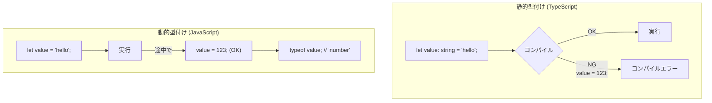

# 0334 言語選択の指針

## 🎯 この章で学ぶこと
- 「最高のプログラミング言語」は存在せず、「特定の目的に対して最適な言語」が存在することを理解する。
- Webフロントエンド、バックエンド、データサイエンス、モバイルアプリなど、主要な開発分野で一般的に使われる言語とその理由を知る。
- プログラミング言語を選択する際の、技術的な観点（パフォーマンス、並行処理性能など）と非技術的な観点（エコシステム、コミュニティ、求人数など）を説明できるようになる。
- 静的型付け言語と動的型付け言語のトレードオフを理解し、プロジェクトの性質に応じてどちらが適しているかを判断できるようになる。
- 複数の言語を学ぶこと（ポリグロット）の重要性と、学習する言語の選び方についての方針を持つ。

## 🤔 なぜ重要なのか
プログラミング言語は、それぞれが得意なこと、苦手なことを持っています。釘を打つのにドライバーを使ったり、ネジを締めるのにハンマーを使ったりするのが非効率なように、解決したい課題に対して不向きな言語を選ぶと、開発効率やアプリケーションのパフォーマンスに深刻な影響を及ぼします。

AIに「このタスクを実装して」と依頼する際にも、言語を指定しなければAIが何らかの言語を（おそらくPythonやJavaScriptを）選択しますが、その選択が常に最適とは限りません。例えば、リアルタイム通信が求められるアプリケーションのサーバーサイドをAIに作らせる際に、GoやElixirといった言語の特性を知っていれば、より適切な指示を出すことができます。

「どの言語を学ぶべきか？」という問いは、初心者にとって永遠のテーマです。しかし、より重要なのは「**どのような基準で言語を選択すべきか？**」という問いです。この判断基準を持つことで、あなたは特定の言語に固執する「単なるプログラマー」から、課題解決のために最適なツールを主体的に選択できる「エンジニア」へと成長することができます。

## 📚 基礎概念の理解

### 静的型付け vs 動的型付け
プログラミング言語の大きな分類軸の一つが「型システム」です。

1.  **静的型付け言語 (Statically Typed Languages)**
    - **特徴**: 変数や関数の引数・戻り値の「型」を、プログラムを実行する**前**（コンパイル時）に決定し、検証する。
    - **例**: Java, C++, C#, Go, Rust, **TypeScript**
    - **長所**:
        - コンパイル時に型エラーを発見できるため、実行時のエラーが減り、安定性が高い。
        - 型情報があるため、IDE（統合開発環境）によるコード補完やリファクタリング支援が強力。
        - 大規模なプロジェクトや、長期的なメンテナンスが必要なシステムに向いている。
    - **短所**:
        - コードを記述する際に、型定義が必要なため、記述量が増える傾向がある。
        - 小規模なスクリプトやプロトタイピングでは、冗長に感じられることがある。

2.  **動的型付け言語 (Dynamically Typed Languages)**
    - **特徴**: 変数の型チェックを、プログラムの**実行時**に行う。変数は様々な型の値を代入できる。
    - **例**: Python, JavaScript, Ruby, PHP
    - **長所**:
        - 型定義が不要なため、コードを素早く、簡潔に記述できる。
        - 小規模なスクリプト、プロトタイピング、データ分析など、迅速な試行錯誤が求められる分野に向いている。
    - **短所**:
        - 型に関するエラーが実行時まで発見されない（例：「数値だと思っていたら文字列だった」）。
        - IDEの支援が静的型付け言語に比べて弱い場合がある。
        - 大規模開発では、意図しない型の値が渡ってくるリスク管理が重要になる。

TypeScriptがJavaScriptに静的な型付けを追加するものであるように、近年では両者の利点を組み合わせようとする動きが活発です。

### 主要開発分野と代表的な言語
| 開発分野 | 主な言語 | 選ばれる理由 |
| :--- | :--- | :--- |
| **Webフロントエンド** | **JavaScript/TypeScript** | ブラウザでネイティブに動作する唯一の言語。React, Vue, Angular等のエコシステムが強力。 |
| **Webバックエンド** | **多種多様** (Go, Python, Java, Ruby, Node.js) | Go: 高パフォーマンス・並行処理。Python/Ruby: 迅速な開発。Java: 大規模・安定性。Node.js: JS統一。 |
| **データサイエンス/機械学習** | **Python** | NumPy, Pandas, Scikit-learn, TensorFlow, PyTorchといったライブラリが圧倒的に充実。 |
| **モバイルアプリ (iOS)** | **Swift** (旧: Objective-C) | Appleが開発・推奨する公式言語。iOSのAPIとの親和性が高い。 |
| **モバイルアプリ (Android)**| **Kotlin** (旧: Java) | Googleが開発・推奨する公式言語。Javaとの相互運用性が100%。 |
| **組み込み/IoT** | **C/C++, Rust** | メモリ管理が厳密で、ハードウェアに近い低レベルな操作が可能。Rustは安全性で注目。|
| **ゲーム開発** | **C++, C#** | Unreal Engine (C++), Unity (C#) という2大ゲームエンジンで採用。パフォーマンス要求が厳しい。|

## 💡 実践的な活用

### 技術選択の判断マトリクス
新しいプロジェクトを始める際、どのような観点で言語を選択すべきでしょうか？

| 観点 | 考慮事項 |
| :--- | :--- |
| **技術的要件** | **パフォーマンス**: 高い計算能力やリアルタイム性が求められるか？ (→ Go, Rust, C++) **並行処理**: 多数の同時接続を効率的に捌く必要があるか？ (→ Go, Elixir) **既存システム連携**: 特定のプラットフォーム(JVM, .NET)との連携が必要か？ (→ Java/Kotlin, C#) |
| **エコシステム** | **ライブラリ/フレームワーク**: 目的の機能を実現するための高品質なライブラリは存在するか？ **ツール**: 開発を支援するツール（リンター、フォーマッター、テストツール）は充実しているか？ |
| **コミュニティ** | **ドキュメント**: 公式ドキュメントやチュートリアルは整備されているか？ **情報量**: Stack Overflowやブログなどで問題解決の情報を見つけやすいか？ **持続可能性**: コミュニティは活発で、言語の将来性はあるか？ |
| **チーム/組織** | **メンバーのスキル**: チームメンバーが既に習熟している言語は何か？ **採用**: その言語を扱えるエンジニアを採用しやすいか？（求人数や市場での人気） **開発文化**: 組織としてどのような開発スタイル（迅速なイテレーション vs 堅牢性重視）を目指すか？|

**シナリオ例**:
- **スタートアップがMVP（Minimum Viable Product）を迅速に開発したい**:
  - **選択肢**: Ruby (on Rails), Python (Django), Node.js (Express)
  - **理由**: 開発速度を重視。フレームワークが充実しており、素早くアイデアを形にできる。
- **金融機関向けの、高い信頼性が求められる大規模システムを開発したい**:
  - **選択肢**: Java, C#, Go
  - **理由**: 静的型付けによる堅牢性。長期的なメンテナンス実績。
- **数百万の同時接続が想定されるチャットアプリのバックエンドを開発したい**:
  - **選択肢**: Go, Elixir
  - **理由**: 軽量なスレッド（ゴルーチン、プロセス）による高い並行処理性能。

## 🔍 深掘り：プロの視点

### ポリグロットプログラミング (Polyglot Programming)
「ポリグロット」とは、複数の言語を話すことを意味します。プログラミングの世界では、**1つのシステムの中で複数の言語を意図的に使い分ける**アプローチを指します。

例えば、あるWebサービスを考えたとき、
- **Webサーバー**: Ruby on Railsで迅速に開発
- **画像処理部分**: パフォーマンスが求められるため、Goで実装したマイクロサービスを別途用意
- **機械学習による推薦基盤**: Pythonで構築
- **フロントエンド**: TypeScript (React)で構築

というように、それぞれのコンポーネントの特性に合わせて最適な言語を選択します。これは、現代的な**マイクロサービスアーキテクチャ**と非常に相性が良い考え方です。全ての課題を一つの言語で解決しようとするのではなく、適材適所でツールを使い分けることで、システム全体の生産性とパフォーマンスを最大化します。

### TIOBEインデックスと現実のギャップ
TIOBEインデックスのようなプログラミング言語ランキングは、言語の「人気度」を示す一つの指標として参考になりますが、これを鵜呑みにしてはいけません。
- **指標の偏り**: TIOBEは検索エンジンのヒット数を基にしており、必ずしも実際の利用状況や求人数を正確に反映しているわけではありません。
- **分野による違い**: 例えば、Pythonは総合ランキングで上位ですが、Webフロントエンド開発の文脈では全く使われません。

より現実的な選択のためには、GitHubの年次レポート(Octoverse)や、Stack Overflowの年次開発者サーベイ、特定の分野（例：Hacker Newsの求人情報）でのトレンドなど、複数の情報源を組み合わせて判断することが重要です。

## 📋 まとめとチェックポイント
- 完璧な言語はなく、解決したい課題やプロジェクトの文脈によって最適な言語は異なる。
- 「静的型付け」は安定性と大規模開発に、「動的型付け」は開発速度と柔軟性に優れる、というトレードオフがある。
- 言語選択は、パフォーマンス等の技術的要件だけでなく、エコシステム、コミュニティ、チームのスキルといった非技術的要因も考慮して総合的に判断する必要がある。
- ポリグロット（複数言語の活用）は、適材適所で最適なツールを選択し、システム全体の価値を最大化するための重要なアプローチである。

**チェックポイント**:
- あなたがもし新しいWebサービスを一人で立ち上げるなら、どの言語（またはフレームワーク）をどのような理由で選択しますか？
- 大規模なエンタープライズシステム開発において、Pythonのような動的型付け言語よりもJavaのような静的型付け言語が好まれる傾向があるのはなぜですか？
- 「Pythonは最高の言語だ」という主張に対して、どのような観点から反論または補足説明ができますか？

## 🔗 関連知識・発展学習
- 全てのプログラミング言語の章: これまで学んできた各言語（JavaScript, Pythonなど）が、この章で学んだ選択基準の中でどのように位置づけられるかを再確認してみましょう。
- [101_Microservices](../../06_Architecture_Design/061_Architecture_Pattern/0611_Microservices.md): マイクロサービスアーキテクチャは、ポリグロットプログラミングを実践するための具体的な設計思想です。 