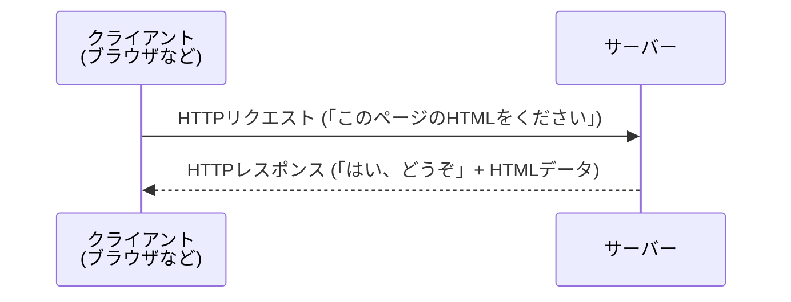
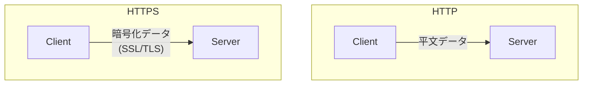

# 0411 HTTP/HTTPSプロトコル

## 🎯 この章で学ぶこと
- HTTPが、Webにおけるクライアントとサーバー間の通信ルール（プロトコル）であることを理解する。
- HTTPリクエスト（メソッド、ヘッダー、ボディ）とHTTPレスポンス（ステータスコード、ヘッダー、ボディ）の基本的な構造を説明できるようになる。
- `GET`, `POST`, `PUT`, `DELETE`といった主要なHTTPメソッドの役割と、それぞれの使い分けを理解する。
- `200 OK`, `404 Not Found`, `500 Internal Server Error`など、代表的なHTTPステータスコードの意味を説明できる。
- HTTPSが、HTTPの通信をSSL/TLSによって暗号化し、セキュリティを向上させる仕組みであることを理解する。

## 🤔 なぜ重要なのか
あなたがブラウザでWebサイトを見たり、スマートフォンのアプリで情報を取得したりするとき、その裏側ではほぼ必ず**HTTP (HyperText Transfer Protocol)** という通信プロトコルが使われています。HTTPは、Webの世界における共通言語であり、クライアント（あなたのブラウザなど）がサーバー（Webサイトのデータを保持しているコンピュータ）に「このページが欲しい」とお願いし、サーバーが「はい、どうぞ」とデータを渡すための一連のルールを定めています。

Web開発者にとって、HTTPの理解は必須です。フロントエンドエンジニアは、どのようなリクエストをサーバーに送るべきかを設計し、バックエンドエンジニアは、そのリクエストを受け取ってどのようなレスポンスを返すかを実装します。API設計、パフォーマンス改善、エラーの原因調査など、開発のあらゆる場面でHTTPの知識が求められます。

さらに、現代では個人情報や決済情報などをインターネット上でやり取りするのが当たり前になりました。ここで登場するのが**HTTPS (HTTP Secure)**です。HTTPSは、悪意のある第三者による通信の盗聴や改ざんを防ぐために、HTTPの通信を暗号化する仕組みです。セキュリティを確保した安全なWebサービスを構築する上で、HTTPSの理解は不可欠です。

## 📚 基礎概念の理解

### HTTP：クライアントとサーバーの対話ルール
HTTP通信は、常にクライアントからの**リクエスト（要求）**で始まり、それに対するサーバーからの**レスポンス（応答）**で完結する、一方向のシンプルなモデルです。

#### HTTPリクエストの構造
- **メソッド (Method)**: クライアントがサーバーに**何をしてほしいか**を示す動詞。
  - **`GET`**: 指定したリソース（Webページや画像など）の取得を要求する。最も基本的なメソッド。
  - **`POST`**: サーバーにデータを送信し、新しいリソースを作成する（例：フォームの送信、ユーザー登録）。
  - **`PUT`**: 既存のリソースを更新する。
  - **`DELETE`**: リソースを削除する。
- **ヘッダー (Headers)**: リクエストに関する付加情報（メタデータ）。`Host` (宛先サーバー), `User-Agent` (クライアントの種別), `Accept` (受信したいデータの種類) などが含まれる。
- **ボディ (Body)**: `POST`や`PUT`メソッドで、サーバーに送信したいデータそのもの（例：フォームの入力内容）。`GET`リクエストには通常ボディはない。

#### HTTPレスポンスの構造
- **ステータスコード (Status Code)**: リクエストが成功したか、失敗したかを3桁の数字で示す。
  - **`2xx` (成功)**:
    - `200 OK`: リクエストは成功した。
  - **`3xx` (リダイレクト)**:
    - `301 Moved Permanently`: リソースが恒久的に移動した。
  - **`4xx` (クライアントエラー)**:
    - `400 Bad Request`: リクエストの構文が間違っている。
    - `401 Unauthorized`: 認証が必要。
    - `403 Forbidden`: アクセスが禁止されている。
    - `404 Not Found`: 要求されたリソースが見つからない。
  - **`5xx` (サーバーエラー)**:
    - `500 Internal Server Error`: サーバー内部で予期せぬエラーが発生した。
    - `503 Service Unavailable`: サービスが一時的に利用できない。
- **ヘッダー (Headers)**: レスポンスに関する付加情報。`Content-Type` (ボディのデータ形式), `Content-Length` (ボディのサイズ) など。
- **ボディ (Body)**: 実際にクライアントに渡したいデータ（HTMLファイル、JSONデータ、画像ファイルなど）。

### HTTPS：通信の暗号化と認証
HTTPは通信内容が平文（暗号化されていないテキスト）で流れるため、途中で盗聴されると情報が丸見えになってしまいます。この弱点を克服するのが**HTTPS**です。

HTTPSは、**SSL/TLS (Secure Sockets Layer / Transport Layer Security)** というプロトコルをHTTPと組み合わせ、以下の3つの要素で通信の安全性を確保します。

1.  **暗号化 (Encryption)**: クライアントとサーバー間の通信内容を暗号化する。第三者が盗聴しても、意味のある内容を読み取ることはできない。
2.  **認証 (Authentication)**: 通信相手のサーバーが、本物であることを証明する。**SSLサーバー証明書**を第三者機関（認証局, CA）に発行してもらうことで、なりすましを防ぐ。
3.  **改ざん防止 (Integrity)**: 通信中にデータが改ざんされていないかを検知する。

現在では、Googleなどの主要なブラウザは全てのWebサイトにHTTPSを導入することを強く推奨しており、HTTPS化されていないサイトには警告が表示されます。常時SSL/TLS化は、現代のWebサイトにおける標準要件です。

## 💡 実践的な活用

### ブラウザの開発者ツールで見るHTTP通信
どのWebブラウザにも、実際のHTTP通信を観察できる「開発者ツール」が内蔵されています。（Windowsでは`F12`キー、Macでは`Cmd+Opt+I`で開くことが多い）

**ハンズオン**:
1.  好きなWebサイトを開き、開発者ツールを起動する。
2.  「ネットワーク」タブ（または "Network"）を選択する。
3.  ページを再読み込みする。
4.  表示されたリクエストの一覧から、メインのHTMLファイル（通常は一番上にある）を選択する。
5.  「ヘッダー」タブ（または "Headers"）を見ると、リクエストヘッダーとレスポンスヘッダーの詳細が確認できる。
    - **Request Method**: `GET`
    - **Status Code**: `200`
    - **Response Headers**内の`Content-Type`: `text/html` など
6.  「プレビュー」や「レスポンス」タブで、サーバーから返されたHTMLの中身を見ることができる。

これにより、Webページが表示されるまでに、裏でどのようなHTTPリクエスト・レスポンスがやり取りされているかを具体的に知ることができます。

## 🔍 深掘り：プロの視点

### API設計とHTTPメソッド（RESTful API）
Web API（特にRESTful API）を設計する際、HTTPメソッドをその意味に沿って正しく使うことが非常に重要です。

- `GET /users`: 全ユーザーのリストを取得
- `GET /users/123`: IDが123のユーザー情報を取得
- `POST /users`: 新しいユーザーを作成（リクエストボディにユーザー情報を含める）
- `PUT /users/123`: IDが123のユーザー情報を更新（リクエストボディに更新後の全情報を含める）
- `DELETE /users/123`: IDが123のユーザーを削除

このように、URLが「リソース（操作対象）」を、HTTPメソッドが「操作内容」を示すように設計することで、直感的で分かりやすいAPIになります。

### HTTPのステートレス性
HTTPは**ステートレス (Stateless)** なプロトコルです。これは、各リクエストが前のリクエストとは独立しており、サーバーがクライアントの状態を記憶しないことを意味します。

- **利点**: サーバー側の実装がシンプルになる。負荷分散装置を使ってサーバーを増やしやすい（どのサーバーが応答しても良いため）。
- **課題**: 「ログイン状態」のように、連続したやり取りの中で状態を維持する必要がある場合はどうするか？
- **解決策**: **Cookie**や**セッション**といった技術を使います。サーバーはログイン成功時にセッションIDを生成してCookieとしてクライアントに渡し、クライアントはそれ以降のリクエストでそのCookieを毎回送信することで、サーバーは「このリクエストはあのログインしたユーザーからのものだ」と認識できます。

### HTTP/2 と HTTP/3
長年使われてきたHTTP/1.1には、パフォーマンス上の課題（1つのTCPコネクションで同時に1つのリクエストしか扱えないなど）がありました。これを解決するために、新しいバージョンのHTTPが登場しています。

- **HTTP/2**: 1つのTCPコネクション上で複数のリクエスト・レスポンスを同時にやり取りできる（**多重化**）。これにより、ページの表示速度が大幅に向上します。
- **HTTP/3**: 通信プロトコルとしてTCPの代わりにQUIC（UDPベース）を採用。コネクション確立が高速で、パケットロス時の影響範囲が小さいなど、さらにパフォーマンスと安定性を向上させています。

これらの新しいプロトコルは、Webサイトやアプリのパフォーマンスを改善するための重要な技術ですが、開発者が直接意識することは少なくなっています。多くの場合、WebサーバーやCDN（コンテンツ配信ネットワーク）の設定を有効にするだけで、その恩恵を受けることができます。

## 📋 まとめとチェックポイント
- HTTPは、Webのクライアントとサーバーが対話するための基本的なルール（プロトコル）。
- HTTP通信は、クライアントの「リクエスト」とサーバーの「レスポンス」から構成される。
- リクエストはメソッド（`GET`, `POST`等）で操作内容を、レスポンスはステータスコード（`200`, `404`等）で結果を示す。
- HTTPSは、SSL/TLSを用いてHTTP通信を「暗号化」「認証」「改ざん防止」することで、セキュリティを高める仕組み。
- HTTPはステートレスであり、状態を維持するためにはCookieなどの技術が使われる。

**チェックポイント**:
- ユーザーがログインフォームにIDとパスワードを入力して「ログイン」ボタンを押したとき、ブラウザはどのようなHTTPメソッドを使ってリクエストを送信するのが最も適切ですか？
- あなたが開発したWeb APIが、クライアントからのリクエストに対して「要求されたデータが見つかりませんでした」と伝えたい場合、どのHTTPステータスコードを返すべきですか？
- なぜECサイトの決済ページでは、HTTPではなくHTTPSを必ず使用する必要があるのですか？

## 🔗 関連知識・発展学習
- [0412_DNS_IP_Port.md](./0412_DNS_IP_Port.md): HTTP通信が行われる前に、まずDNSによってドメイン名からIPアドレスが特定されます。
- [042_API_Basics/](../../04_Network_Web_Development/042_API_Basics/): Web APIの多くは、HTTPプロトコルをベースに設計されています（REST APIなど）。
- **Cookieとセッション**: HTTPのステートレス性を補い、ログイン管理などを実現するための重要な仕組みです。 