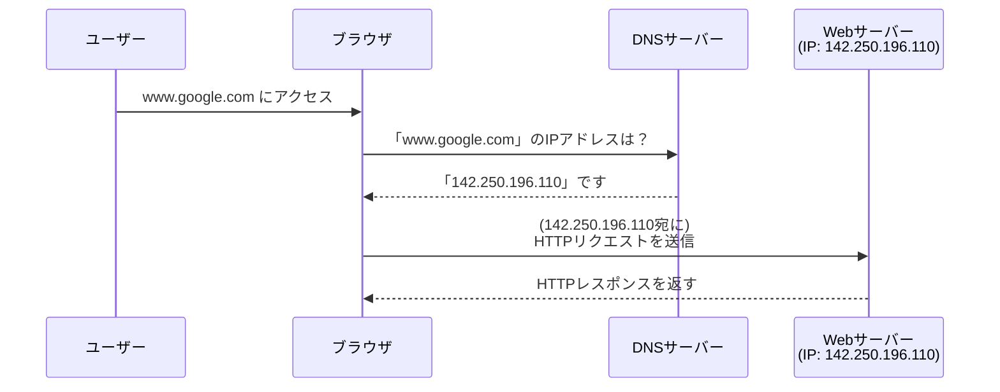

# 0412 DNS、IP、ポート

## 🎯 この章で学ぶこと
- インターネット上の全てのコンピュータが持つ一意の住所である「IPアドレス」の役割を理解する。
- 人間が覚えやすい「ドメイン名」を、コンピュータが理解できる「IPアドレス」に変換する仕組みである「DNS」の概要を説明できるようになる。
- 1つのIPアドレスを持つサーバー上で、複数のサービス（Web、メールなど）を区別するための「ポート番号」の概念を理解する。
- `google.com:443` のように、ドメイン、IP、ポートが連携して、特定のサーバーの特定のサービスに到達するまでの流れを説明できる。
- `localhost` (または `127.0.0.1`) が自分自身のコンピュータを指す特別なIPアドレスであることを理解する。

## 🤔 なぜ重要なのか
Webサイトにアクセスするとき、私たちは `https://www.google.com` のような分かりやすい「ドメイン名」をブラウザに入力します。しかし、インターネットの世界では、コンピュータは `142.250.196.110` のような「IPアドレス」という数字の羅列でしかお互いを識別できません。この「人間用の名前」と「コンピュータ用の住所」の橋渡しをしているのが**DNS (Domain Name System)** です。

さらに、Webサイトを提供するサーバーは、Webサイトの閲覧（HTTP/HTTPS）だけでなく、メールの送受信（SMTP/POP3）やファイル転送（FTP）など、複数の仕事を同時にこなしていることがよくあります。これらを区別するために使われるのが**ポート番号**です。ポート番号は、いわば「サーバーというビルの中の、どの窓口（サービス）か」を指定するための部屋番号のようなものです。

開発者にとって、これらの概念はWebアプリケーションがどのようにしてユーザーに届くのかを理解する上での根幹です。
- アプリケーションをデプロイする際、ドメイン名とサーバーのIPアドレスを正しく紐付ける必要がある。
- 開発中のWebサーバーが `localhost:3000` で動いている時、それは「自分自身のコンピュータの3000番ポートで動いているサービス」を意味することを理解する。
- ネットワークエラーのトラブルシューティング時に、DNSの名前解決が失敗しているのか、特定のポートへのアクセスがファイアウォールでブロックされているのか、といった問題の切り分けができる。

DNS、IP、ポートは、インターネットという巨大なネットワークインフラの土台であり、この土台の知識なくして、その上で動くアプリケーションを真に理解することはできません。

## 📚 基礎概念の理解

### IPアドレス (Internet Protocol Address): インターネット上の住所
- **概念**: インターネットに接続されたコンピュータやスマートフォンなどの機器に割り当てられる、一意の識別番号です。「192.0.2.1」のような形式で表されます。
- **役割**: ネットワーク上で通信相手を特定するための「住所」として機能します。データを送る際は、このIPアドレスを宛先に指定します。
- **種類**:
  - **IPv4**: `xxx.xxx.xxx.xxx` という形式の約43億個。枯渇問題が深刻。
  - **IPv6**: より膨大な数のアドレスを扱える次世代規格。

### DNS (Domain Name System): ドメイン名とIPアドレスの電話帳
- **概念**: `www.google.com` のようなドメイン名と、`142.250.196.110` のようなIPアドレスを対応付けて管理する、インターネット全体の巨大な分散データベースシステムです。
- **役割**: 人間が覚えやすいドメイン名を、コンピュータが通信に使うIPアドレスに変換（**名前解決**）します。
- **流れ**:
  1.  ブラウザに `www.google.com` と入力する。
  2.  ブラウザは、近くの**DNSサーバー**（プロバイダなどが提供）に「`www.google.com` のIPアドレスを教えて」と問い合わせる。
  3.  DNSサーバーは、世界中のDNSサーバーと連携してIPアドレスを調べ、ブラウザに回答する。
  4.  ブラウザは、教えてもらったIPアドレス宛にHTTPリクエストを送信する。



### ポート番号 (Port Number): サーバー内のサービス窓口
- **概念**: 1つのIPアドレスを持つコンピュータ内で、実行されている特定のプログラムやサービスを識別するための0から65535までの番号。
- **役割**: IPアドレスが建物の住所だとすれば、ポート番号はその建物の中の「部屋番号」や「窓口番号」に相当します。
- **ウェルノウンポート (Well-known Ports)**: 主要なサービスには、慣例的に特定のポート番号が割り当てられています。
  - **80**: HTTP (Webサーバー)
  - **443**: HTTPS (暗号化されたWebサーバー)
  - **22**: SSH (セキュアなリモートログイン)
  - **25**: SMTP (メール送信)
  - **5432**: PostgreSQL (データベース)
  - **3306**: MySQL (データベース)

ブラウザで `http://example.com` にアクセスすると、実際には `http://example.com:80` に、`https://example.com` なら `https://example.com:443` にアクセスしています（ポート番号が省略されているだけ）。

## 💡 実践的な活用

### `localhost`: 自分自身を指す特別なアドレス
開発中、私たちはよく `http://localhost:3000` や `http://127.0.0.1:8080` といったアドレスにアクセスします。
- **`localhost`**: ドメイン名の一種で、常に「自分自身のコンピュータ」を指すように設定されています。
- **`127.0.0.1`**: `localhost`に対応する特別なIPアドレス（ループバックアドレス）。

これは、開発しているWebアプリケーションのサーバーを自分のPC上で起動し、同じPC上のブラウザからクライアントとしてアクセスする、という状況で使われます。

### コマンドで名前解決を試す
- **`nslookup`** (または **`dig`**) コマンドを使うと、DNSによる名前解決を実際に試すことができます。

**ハンズオン**:
ターミナル（コマンドプロンプト）で以下のコマンドを実行してみましょう。
```bash
nslookup www.google.com
```

**実行結果の例**:
```
サーバー:  UnKnown
Address:  192.168.1.1  <-- あなたが使っているDNSサーバーのアドレス

権限のない回答:
名前:    www.google.com
Addresses:  2404:6800:400a:80c::2004  <-- IPv6アドレス
          142.250.196.110             <-- IPv4アドレス
```
このように、ドメイン名からIPアドレスが引けることが確認できます。Webサイトに繋がらない時、このコマンドで名前解決自体が失敗しているのか、それともその先のIPアドレスへの通信に問題があるのかを切り分けることができます。

## 🔍 深掘り：プロの視点

### DNSレコードの種類
DNSは単にIPアドレスを返すだけでなく、様々な種類の情報（レコード）を保持しています。
- **Aレコード**: ドメイン名をIPv4アドレスに対応付ける、最も基本的なレコード。
- **AAAAレコード**: ドメイン名をIPv6アドレスに対応付ける。
- **CNAMEレコード**: あるドメイン名を別のドメイン名の別名（エイリアス）として定義する。
- **MXレコード**: そのドメイン宛のメールを処理するメールサーバーを指定する。
- **TXTレコード**: ドメインに関する任意のテキスト情報。ドメイン所有者の認証などに使われる。

Webサイトを公開する際は、ドメインを購入したサービス（お名前.com, Google Domainsなど）の管理画面で、これらのDNSレコードを正しく設定する必要があります。例えば、サーバーのIPアドレスをAレコードに設定したり、特定のサブドメインを別のサービスに向けるためにCNAMEレコードを設定したりします。

### NATとプライベートIPアドレス
IPv4アドレスの枯渇問題への対策として、**NAT (Network Address Translation)** という技術が広く使われています。これは、家庭やオフィスのLAN（ローカルエリアネットワーク）内では、**プライベートIPアドレス**（`192.168.x.x` や `10.x.x.x` など、LAN内でしか通用しないアドレス）を各機器に割り当て、インターネットに出ていくときだけ、ルーターが持つ単一の**グローバルIPアドレス**（インターネット上で一意のアドレス）に変換する仕組みです。

これにより、一つのグローバルIPアドレスを複数の機器で共有できるため、IPアドレスの消費を節約できます。あなたが自宅のPCのIPアドレスを調べた時に `192.168.1.5` のようなアドレスが表示されるのは、それがルーター内のプライベートIPアドレスだからです。

## 📋 まとめとチェックポイント
- **IPアドレス**は、インターネット上の機器を識別する一意の「住所」。
- **DNS**は、人間が使う「ドメイン名」を、コンピュータが使う「IPアドレス」に翻訳する「電話帳」システム。
- **ポート番号**は、1台のサーバー上で動く複数のサービスを区別するための「部屋番号」。
- これら3つが連携し、`ドメイン名` →(DNS)→ `IPアドレス` → `ポート番号` の順で、目的のサービスにたどり着く。
- `localhost` (`127.0.0.1`) は、開発時によく使う「自分自身のコンピュータ」を指す特別なアドレス。

**チェックポイント**:
- ブラウザに `https://example.com/page` と入力したとき、省略されているポート番号は何番ですか？
- あなたが開発中のWebアプリが `http://localhost:8080` で動いているとします。このアドレスの「localhost」と「8080」がそれぞれ何を表しているか説明できますか？
- Webサイトが表示されない時、原因を切り分けるためにまず試すべき`nslookup`のようなコマンドは何を調べていますか？

## 🔗 関連知識・発展学習
- [0411_HTTP_HTTPS_Protocol.md](./0411_HTTP_HTTPS_Protocol.md): DNSでIPアドレスを特定し、ポート番号でサービスを指定した後、その上で実際にデータをやり取りするのがHTTP/HTTPSプロトコルです。
- **ファイアウォール**: 不正なアクセスを防ぐため、特定のIPアドレスやポート番号への通信を制限するセキュリティの仕組み。
- **CDN (Content Delivery Network)**: DNSの仕組みを応用し、ユーザーに最も近いサーバーからコンテンツを配信することで、Webサイトの表示を高速化するサービス。 