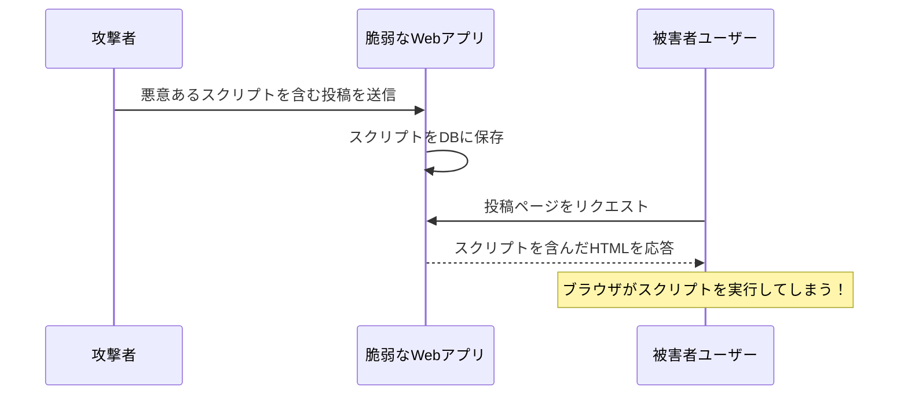

# 0413 セキュリティ基礎

## 🎯 この章で学ぶこと
- なぜWebアプリケーションにセキュリティ対策が不可欠なのかを、具体的なリスクと関連付けて理解する。
- Webアプリケーションにおける代表的な脆弱性である「XSS（クロスサイトスクリプティング）」と「CSRF（クロスサイトリクエストフォージェリ）」の仕組みを説明できるようになる。
- SQLインジェクションがどのようにして発生し、データベースにどのような損害を与える可能性があるかを理解する。
- 「全ての入力を疑う」「多層防御」といった、Webセキュリティにおける基本的な考え方（プリンシプル）を習得する。
- HTTPS、入力値の検証（バリデーション）、出力値のエスケープといった、基本的な防御策の重要性を理解する。

## 🤔 なぜ重要なのか
あなたが開発したWebアプリケーションが、ある日突然、攻撃者によって乗っ取られたり、顧客の個人情報が全て盗み出されたりする事態を想像してみてください。サービスの信頼は失墜し、事業の継続が困難になるだけでなく、法的な責任を問われる可能性すらあります。

Webアプリケーションは、常にインターネットというオープンなネットワーク上で、不特定多数のユーザーからのアクセスを受け付けます。その中には、悪意を持った攻撃者が紛れている可能性が常にあります。開発者がセキュリティを意識せずに作った「穴（脆弱性）」は、彼らにとって格好の攻撃対象となります。

AIにコード生成を依頼する際、「ユーザー登録機能を作って」という指示だけでは、多くの場合セキュリティが考慮されていないコードが生成されます。「SQLインジェショを防ぐために、プリペアドステートメントを使って」といった具体的な指示ができてこそ、安全なアプリケーションを開発できます。機能要件を満たすだけでなく、**安全に動作すること（非機能要件）**は、プロのエンジニアにとっての絶対的な責務です。セキュリティは「後から追加する機能」ではなく、設計段階から組み込むべき必須要素なのです。

## 📚 基礎概念の理解

### XSS (クロスサイトスクリプティング)
- **概要**: 攻撃者が、脆弱性のあるWebサイトに悪意のあるスクリプト（主にJavaScript）を埋め込み、そのサイトを訪れた他のユーザーのブラウザ上で実行させる攻撃。
- **仕組みの例（掲示板サイト）**:
  1.  攻撃者が、掲示板の投稿フォームに`<script>alert('XSS!');</script>`のような悪意のあるスクリプトを書き込む。
  2.  サイト側がこの入力を何の処理もせず（**エスケープせず**に）データベースに保存する。
  3.  他のユーザーがこの投稿を含むページを閲覧する。
  4.  ブラウザは、保存されていた`<script>`タグをHTMLの一部として解釈し、中のスクリプトを実行してしまう。
- **影響**: Cookie情報の窃取（なりすまし）、個人情報の漏洩、Webページの改ざんなど。


- **対策**: **エスケープ処理**。ユーザーからの入力に含まれる`<`や`>`といった特殊文字を、単なる文字列（例: `&lt;`, `&gt;`）に変換してから表示することで、ブラウザにスクリプトとして解釈させないようにする。

### CSRF (クロスサイトリクエストフォージェリ)
- **概要**: ユーザーがログイン状態にあるWebサービスに対し、そのユーザー自身の意図しないリクエスト（投稿、商品の購入、退会処理など）を、攻撃者が用意した罠サイト経由で強制的に送信させる攻撃。
- **仕組みの例**:
  1.  ユーザーが、銀行サイトAにログインした状態にある。
  2.  攻撃者が、罠サイトBに「100万円送金する」という銀行サイトAへのリクエストを自動的に送信するようなリンクやフォームを仕掛けておく。
  3.  ユーザーが何も知らずに罠サイトBを閲覧する。
  4.  ユーザーのブラウザは、銀行サイトAにログイン済みのため、持っているCookieを付けて自動的に送金リクエストを送信してしまう。
- **影響**: ユーザーの意図しない情報更新、金銭的被害、SNSでの不本意な投稿など。
- **対策**: **CSRFトークン**。サーバーは正規のフォームを表示する際に、推測困難なランダムな文字列（トークン）を埋め込んでおき、リクエスト受信時にそのトークンが正しく送信されてきたかを検証する。攻撃者はこのトークンを知ることができないため、リクエストを偽造できない。

### SQLインジェクション
- **概要**: アプリケーションが想定していない不正なSQL文を、入力フォームなどを通じて注入（インジェクト）し、データベースを不正に操作する攻撃。最も危険な脆弱性の一つ。
- **仕組みの例（ログインフォーム）**:
  - ユーザーID入力欄に `admin' --` と入力する。
  - アプリケーションが単純な文字列連結でSQLを組み立てている場合:
    ```sql
    -- 元のSQL
    SELECT * FROM users WHERE user_id = '入力値' AND password = 'パスワード';
    
    -- 注入後のSQL
    SELECT * FROM users WHERE user_id = 'admin' --' AND password = '...';
    ```
    `--`はSQLのコメントアウトなので、これ以降のパスワード検証部分が無効化され、`user_id = 'admin'`の条件だけで認証が通ってしまう。
- **影響**: データベース内の情報の全件漏洩・改ざん・削除、サーバーの乗っ取りなど、壊滅的な被害に繋がる。
- **対策**: **プリペアドステートメント（プレースホルダ）**の使用。SQL文の「骨格」と、そこに埋め込む「値」を別々にデータベースに送る。これにより、入力値は単なる文字列として扱われ、SQL文の一部として解釈されることがなくなる。

## 💡 実践的な活用

### セキュリティの基本原則
- **全ての入力を疑う (Never trust user input)**: ユーザーから送られてくる全てのデータ（フォーム、URLのクエリパラメータ、HTTPヘッダーなど）は、悪意のあるものである可能性があると仮定する。必ず検証（バリデーション）と無害化（サニタイゼーション/エスケープ）を行う。
- **多層防御 (Defense in Depth)**: 一つの防御策が破られても、次の防御策で攻撃を防げるように、複数のセキュリティ対策を層のように重ねる。例：WAF（Web Application Firewall）を導入しつつ、アプリケーション自体にも脆弱性対策を施す。
- **最小権限の原則 (Principle of Least Privilege)**: プログラムやユーザーに、その役割を果たすために必要な最低限の権限しか与えない。例えば、Webアプリが使うデータベースのユーザーに、テーブル削除（DROP）の権限を与えないなど。

### セキュリティチェックリスト（簡易版）
新しい機能を開発した際に、最低限確認すべき項目です。

- **入力値の検証**:
  - [ ] 必須項目が空でないか？
  - [ ] 想定したデータ型（数値、メールアドレス形式など）か？
  - [ ] 文字数や数値の範囲は適切か？
- **出力値のエスケープ**:
  - [ ] ユーザーが入力した内容を画面に表示する際、HTMLエスケープを行っているか？ (XSS対策)
- **認証・認可**:
  - [ ] 他人の情報にアクセスできないように、リソースへのアクセス時に必ず権限チェックを行っているか？
- **データベースアクセス**:
  - [ ] SQLインジェクション対策として、プリペアドステートメントを使用しているか？
- **CSRF対策**:
  - [ ] 状態を変更するリクエスト（POST, PUT, DELETE）には、CSRFトークンによる防御を実装しているか？

## 🔍 深掘り：プロの視点

### サプライチェーン攻撃
自作のコードに脆弱性がなくても、利用している外部のライブラリやフレームワークに脆弱性が発見されることがあります。それに気づかずに使い続けていると、そこを突かれて攻撃される可能性があります。これを**サプライチェーン攻撃**と呼びます。
- **対策**:
  - **脆弱性スキャナ**: `npm audit` (Node.js) や `pip-audit` (Python), GitHubのDependabotなど、プロジェクトが依存するライブラリの脆弱性を自動で検知・警告してくれるツールをCI/CDに組み込む。
  - **ライブラリの定期的なアップデート**: 脆弱性修正が含まれるアップデートに追従する。

### セキュリティヘッダー
HTTPレスポンスヘッダーに特定のヘッダーを追加することで、ブラウザが持つセキュリティ機能を有効化し、様々な攻撃を緩和することができます。
- **`Content-Security-Policy` (CSP)**: 読み込んでも良いスクリプトや画像のドメインをホワイトリスト形式で指定し、意図しない場所からのリソース読み込み（XSSなど）を防ぐ。
- **`Strict-Transport-Security` (HSTS)**: 一度HTTPSでアクセスしたサイトには、以降強制的にHTTPSでアクセスさせるようにブラウザに指示する。
- **`X-Frame-Options`**: 他のサイトの`<frame>`や`<iframe>`内に、自サイトが表示されるのを防ぐ（クリックジャッキング対策）。

これらのヘッダーを適切に設定することは、堅牢なWebアプリケーションを構築する上で非常に重要です。

## 📋 まとめとチェックポイント
- Webアプリケーションは常に攻撃の脅威に晒されており、セキュリティは設計段階からの必須要件である。
- XSS、CSRF、SQLインジェクションは、Webにおける古典的かつ非常に危険な脆弱性の代表例。
- ユーザーからの入力は絶対に信用せず、必ず「検証」と「エスケープ」を行うことが基本。
- データベース操作には、SQLインジェクションを防ぐために必ずプリペアドステートメントを使う。
- 多層防御の考えに基づき、単一の対策に頼らず、複数の防御策を組み合わせることが重要。

**チェックポイント**:
- ユーザーが入力したコメントをそのまま画面に表示する機能の、最も注意すべき脆弱性は何ですか？また、その対策は何ですか？
- ログインしているユーザーに、意図せず高額な商品を購入させる攻撃手法は何ですか？どのような仕組みで防御できますか？
- なぜSQL文を文字列連結で組み立ててはいけないのですか？より安全な代替手段は何ですか？

## 🔗 関連知識・発展学習
- [0414_Authentication_Authorization.md](./0414_Authentication_Authorization.md): 「認証（あなたは誰？）」と「認可（あなたは何をしていいの？）」は、セキュリティの根幹をなす重要な概念です。
- **OWASP Top 10**: Webアプリケーションセキュリティに関する最も重大なリスクを定期的に発表しているプロジェクト。Web開発者であれば必ず目を通しておくべき資料です。
- **暗号技術**: HTTPSの基盤となっているSSL/TLSや、パスワードを安全に保存するためのハッシュ化など、セキュリティを支える暗見えない技術。 