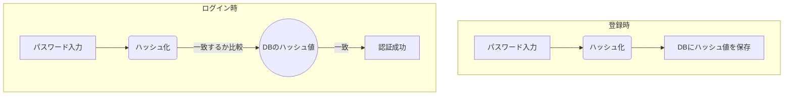
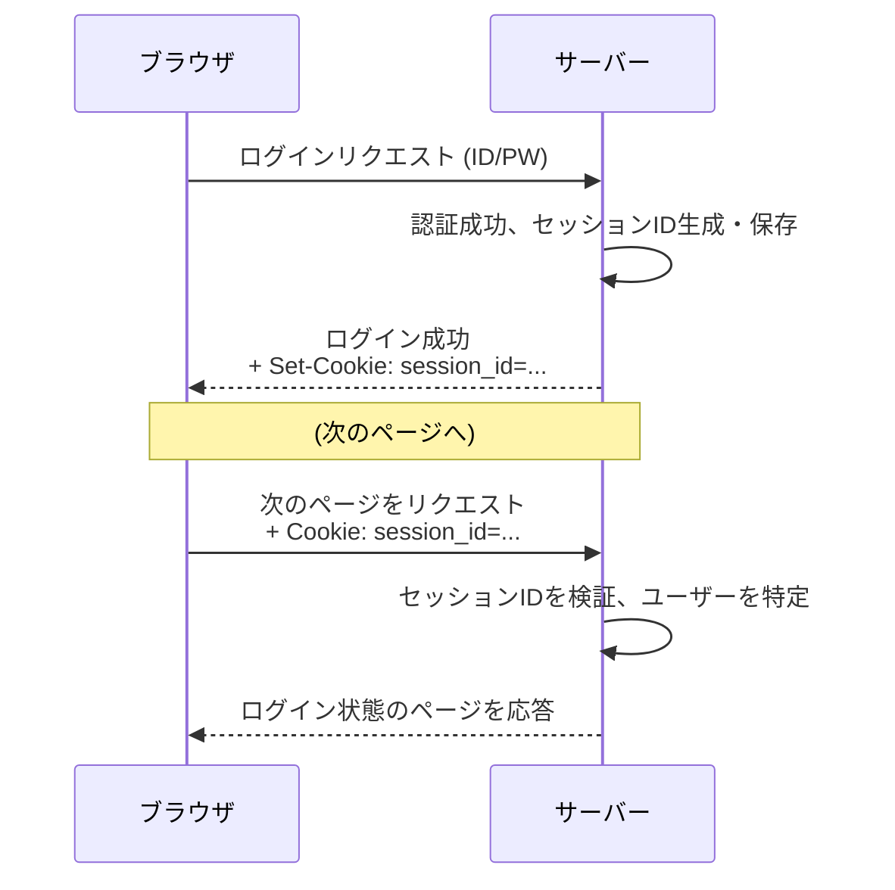

# 0414 認証と認可

## 🎯 この章で学ぶこと
- 「認証（Authentication）」と「認可（Authorization）」の明確な違いを説明できるようになる。
- ユーザー名とパスワードによる古典的な認証方式と、その課題（パスワードの平文保存のリスク）を理解する。
- パスワードを安全に保存するための「ハッシュ化」と、より安全性を高める「ソルト」の役割を理解する。
- セッション管理（Cookieベース）の基本的な仕組みと、なぜHTTPがステートレスであるにも関わらずログイン状態を維持できるのかを説明できる。
- OAuth 2.0が、ユーザーのパスワードを第三者サービスに渡すことなく、安全に権限を委譲（認可）するための仕組みであることを理解する。

## 🤔 なぜ重要なのか
Webサービスにおいて、「誰がアクセスしてきているのかを確認し、その人（やプログラム）に何をする権限があるのかを制御する」ことは、セキュリティの根幹です。これができていないと、誰もが管理者として振る舞えたり、他人の個人情報を見放題になったりしてしまいます。

ここで重要なのが、「**認証**」と「**認可**」という2つの異なる概念です。
- **認証 (Authentication)**: **「あなたは誰ですか？」** を確認するプロセス。通信相手が、本人が主張する通りの本人であることを検証します。例：ログインIDとパスワードによる本人確認。
- **認可 (Authorization)**: **「あなたは何をしていいですか？」** を決定するプロセス。認証されたユーザーに対し、特定のリソースや操作へのアクセス権限を与えるかどうかを判断します。例：一般ユーザーには他人のプロフィール編集を許可しない。

この2つを混同すると、深刻なセキュリティホールを生み出します。例えば、ログイン（認証）さえしてしまえば、誰でも管理者権限の操作（認可）ができてしまう、といった事態です。安全なWebアプリケーションを構築するためには、この2つの概念を明確に区別し、それぞれを適切に実装することが不可欠です。

## 📚 基礎概念の理解

### 認証 (Authentication): 「あなたは誰？」

#### パスワード認証とハッシュ化
最も基本的な認証方法は、ユーザーIDとパスワードの組み合わせです。しかし、ユーザーのパスワードをそのままデータベースに保存する（**平文保存**）のは絶対にやってはいけません。データベースが漏洩した場合、全ユーザーのパスワードが流出してしまうからです。

そこで使われるのが**ハッシュ化**です。
- **ハッシュ関数**: あるデータ（パスワード）を入力すると、固定長の全く異なる値（ハッシュ値）を返す関数。同じ入力からは必ず同じハッシュ値が得られますが、ハッシュ値から元のデータを逆算することは極めて困難です（不可逆性）。
- **認証フロー**:
  1.  ユーザー登録時: パスワードをハッシュ化して、ハッシュ値をDBに保存。
  2.  ログイン時: 入力されたパスワードを同じハッシュ関数でハッシュ化し、DBに保存されているハッシュ値と一致するかを比較する。

#### ソルト (Salt)
ハッシュ化だけでは、「レインボーテーブル攻撃」（よく使われるパスワードのハッシュ値を事前に計算しておいたテーブルとの照合）に弱いという問題があります。これを防ぐのが**ソルト**です。
- **ソルト**: ユーザーごとに生成されるランダムな文字列。
- **仕組み**: パスワードをハッシュ化する際に、「パスワード + ソルト」の文字列をハッシュ化する。ソルトはハッシュ値と一緒にDBに保存しておく。
- **効果**: 同じパスワード（例: "password123"）でも、ユーザーごとにソルトが異なるため、生成されるハッシュ値も全く異なるものになる。これにより、レインボーテーブル攻撃が極めて困難になります。

### 認可 (Authorization): 「あなたは何ができる？」
認証が完了した後、次はそのユーザーに「何をする権限があるか」を判断するフェーズに入ります。
- **例**:
  - ユーザーAは、自分が投稿した記事A'の編集・削除ができる (**認可**)。
  - ユーザーAは、ユーザーBが投稿した記事B'の編集・削除はできない (**不認可**)。
  - 管理者ユーザーは、全ての記事の編集・削除ができる (**認可**)。

認可は、アプリケーションのビジネスロジックと密接に関わります。一般的な実装方法としては、**RBAC (Role-Based Access Control)** があります。「管理者」「編集者」「閲覧者」のような**ロール（役割）**をユーザーに割り当て、そのロールごとに許可される操作を定義します。

## 💡 実践的な活用

### セッション管理 (Cookieベース)
HTTPはステートレスなため、そのままではページを移動するたびに「あなたは誰？」と再認証が必要になってしまいます。これを解決するのが**セッション管理**です。
1.  **ログイン**: ユーザーが認証に成功すると、サーバーはランダムで推測困難な**セッションID**を生成します。
2.  **セッションID保存**: サーバーはセッションIDをサーバー側のストレージ（メモリ、DBなど）にユーザー情報と紐付けて保存します。
3.  **Cookieへの保存**: サーバーは、生成したセッションIDをHTTPレスポンスの`Set-Cookie`ヘッダーに含めてクライアントに送ります。
4.  **リクエストごとの送信**: クライアント（ブラウザ）は、そのドメインへの以降のリクエストで、受け取ったセッションIDを`Cookie`ヘッダーに含めて自動的に送信します。
5.  **本人確認**: サーバーは、リクエストで受け取ったセッションIDを元に、サーバー側ストレージを検索し、「このリクエストはどのユーザーからのものか」を特定します。

### OAuth 2.0: 安全な権限委譲の仕組み
「Googleアカウントでログイン」「Facebookでログイン」といった機能を実現するのが**OAuth 2.0**です。これは**認可**のためのフレームワークです。
- **目的**: ユーザーが、自分が利用しているサービスA（例: 写真共有サイト）に、別のサービスB（例: Google）に保存されている自分の情報（例: Googleフォトの写真）へのアクセス権限を、**サービスBのパスワードをサービスAに教えることなく**、安全に与えるための仕組み。
- **登場人物**:
  - **リソースオーナー**: ユーザー本人
  - **クライアント**: サービスA（写真共有サイト）
  - **認可サーバー/リソースサーバー**: サービスB（Google）
- **流れ（簡略版）**:
  1.  ユーザーがサービスAで「Googleでログイン」ボタンを押す。
  2.  サービスAはユーザーをGoogleの認可画面にリダイレクトさせる。「サービスAがあなたのプロフィール情報にアクセスすることを許可しますか？」といった同意画面が表示される。
  3.  ユーザーが同意すると、Google（認可サーバー）はサービスAに対して、一時的な**アクセストークン**を発行する。
  4.  サービスAは、そのアクセストークンを使ってGoogle（リソースサーバー）にアクセスし、許可された範囲でユーザーの情報を取得する。

重要なのは、**ユーザーのGoogleパスワードはサービスAには一切渡らない**という点です。渡されるのは、限定的な権限と有効期限を持つアクセストークンだけです。

## 🔍 深掘り：プロの視点

### JWT (JSON Web Token)
セッション管理の別の方法として、近年API認証などでよく使われるのが**JWT**です。
- **仕組み**: ユーザー情報（IDなど）や権限、有効期限といった情報をJSON形式でまとめ、電子署名を付与して一つの長い文字列（トークン）にしたもの。
- **セッション管理との違い**:
  - **サーバー側の状態**: Cookieベースのセッションでは、サーバー側でセッションIDを保存・管理する必要があります（ステートフル）。一方、JWTはトークン自体が必要な情報と署名を持っているため、サーバーは状態を保持する必要がありません（ステートレス）。
  - **拡張性**: サーバーがステートレスになるため、マイクロサービスアーキテクチャや負荷分散環境でのスケールが容易になります。
- **注意点**: JWTは署名によって改ざんは検知できますが、ペイロード（中身のJSON）はBase64エンコードされているだけで**暗号化はされていません**。そのため、メールアドレスなど機密性の高い情報をペイロードに含めるべきではありません。

### 多要素認証 (MFA)
パスワード認証のセキュリティをさらに強化する手法として、**多要素認証 (Multi-Factor Authentication)** があります。これは、以下の3つの要素のうち、2つ以上を組み合わせて認証を行うものです。
1.  **知識情報 (Something you know)**: パスワード、PINコードなど、本人のみが知っている情報。
2.  **所持情報 (Something you have)**: スマートフォン、ハードウェアトークンなど、本人のみが持っている物。
3.  **生体情報 (Something you are)**: 指紋、顔認証など、本人固有の身体的特徴。

例えば、「パスワード入力（知識）」に加えて、「スマートフォンアプリに表示されるワンタイムコードの入力（所持）」を要求するのが一般的なMFAです。これにより、万が一パスワードが漏洩しても、攻撃者はスマートフォンを持っていないため不正ログインを防ぐことができます。

## 📋 まとめとチェックポイント
- **認証**は「相手が誰かを確認する」プロセス。**認可**は「何をして良いかを判断する」プロセス。
- パスワードは、必ずソルトを付与した上でハッシュ化して保存する。
- サーバーはセッションIDをクライアントのCookieに保存させることで、HTTPのステートレス性を補い、ログイン状態を維持する。
- OAuth 2.0は、ユーザーのパスワードを渡すことなく、第三者サービスに安全に権限を委譲（認可）するための標準的なフレームワーク。
- JWTは、サーバーをステートレスに保てるため、API認証やマイクロサービスで有用なトークンベースの認証・認可技術。

**チェックポイント**:
- 「認証」と「認可」の違いを、SNSアプリケーションを例に挙げて説明してください。
- なぜパスワードをハッシュ化するだけでは不十分で、「ソルト」が必要なのですか？
- あなたがWebサイトにログインした後、ブラウザを閉じてもう一度開いてもログイン状態が維持されているのはなぜですか？その裏側の仕組みを説明してください。

## 🔗 関連知識・発展学習
- [0413_Security_Basics.md](./0413_Security_Basics.md): 認証と認可は、Webセキュリティ全体を構成する重要な要素です。
- **OpenID Connect (OIDC)**: OAuth 2.0を拡張し、認可だけでなく認証の機能も提供するプロトコル。「Googleでログイン」機能は、厳密にはこのOIDCが使われていることが多いです。
- **パスキー (Passkeys)**: パスワードレス認証の新しい標準。公開鍵暗号方式を利用し、フィッシングに強く、より安全で便利な認証体験を目指しています。 