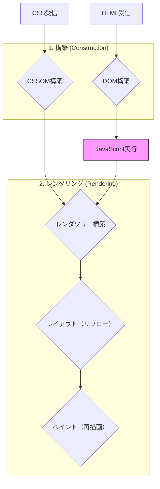

# 第31章 ブラウザの仕組み：Webページの表示から動作まで

## 🎯 この章で学ぶこと
- ブラウザがURLを解釈してから画面にWebページが表示されるまでの一連の流れ（クリティカルレンダリングパス）を説明できる。
- HTML、CSS、JavaScriptがそれぞれブラウザ内でどのように解釈され、役割を分担しているかを理解する。
- DOM（Document Object Model）とCSSOM（CSS Object Model）が構築され、レンダツリーが作られる過程を説明できる。
- 「レンダリングブロックリソース」とは何かを理解し、それがページの表示速度に与える影響を説明できる。
- JavaScriptの実行がなぜDOM構築をブロックすることがあるのか、その理由と対策（`async`, `defer`）を理解する。

## 🤔 なぜ重要なのか
Web開発者にとって、ブラウザは自分たちの書いたコードが最終的に実行される「舞台」です。この舞台の仕組みを知らなければ、パフォーマンスの高い、洗練されたアプリケーションを作ることはできません。なぜCSSは`<head>`に、JavaScriptは`<body>`の最後に置くのが良いとされるのか？なぜ画像の読み込みが遅いと全体の表示に影響するのか？これらの問いに答えるには、ブラウザの内部動作を理解する必要があります。

AIはHTMLやCSS、JavaScriptを生成できますが、それらがブラウザによってどのように解釈され、組み合わされてユーザーの画面に届くのか、そのプロセス全体を最適化する視点はまだ人間に分があります。「このリソースの読み込みを遅延させて、初回表示を高速化する」といった判断は、ブラウザの仕組みを理解しているからこそできる、プロフェッショナルなスキルです。この知識は、Webサイトのパフォーマンスチューニング（表示速度の改善）において絶大な力を発揮します。

## 📚 基礎概念の理解

### クリティカルレンダリングパス (Critical Rendering Path)
ブラウザがサーバーからHTML、CSS、JavaScriptを受け取り、それらを画面上のピクセルに変換するまでの一連のステップのことです。このパスを最適化することが、表示速度の改善に直結します。

大まかな流れは以下の通りです。

*JavaScriptはDOM構築をブロックし、CSSOM構築を待機する可能性があるため、注意が必要です。*

### 1. DOMとCSSOMの構築
-   **DOM (Document Object Model)**
    -   ブラウザがHTMLコードを解析し、それをオブジェクトのツリー構造としてメモリ上に表現したもの。
    -   HTMLの各タグ（`<body>`, `
`, `
`など）が、親子関係を持つ「ノード」として表現されます。
    -   JavaScriptがWebページの内容や構造を操作するためのインターフェースとなります。

-   **CSSOM (CSS Object Model)**
    -   ブラウザがCSSコードを解析し、各要素にどのようなスタイルが適用されるかをツリー構造で表現したもの。
    -   DOMと似ていますが、`display: none`の要素は含まれないなど、表示に関する情報に特化しています。

**重要な点**: ブラウザはHTMLを上から一行ずつ解析し、DOMを構築していきます。この途中でCSSやJavaScriptへのリンク（`<link>`や`<script>`）を見つけると、それらのリソースのダウンロードと解析を開始します。

### 2. レンダツリー (Render Tree) の構築
DOMとCSSOMが完成すると、ブラウザはこの2つを組み合わせて**レンダツリー**を構築します。
-   レンダツリーには、ページに表示される**可視ノード**とそのスタイル情報が含まれます。
-   `display: none`が指定された要素や、`<head>`タグのような非表示要素はレンダツリーに含まれません。（`visibility: hidden`の要素は、非表示ですが空間は確保するため、レンダツリーに含まれます）。

### 3. レイアウト (Layout / Reflow)
レンダツリーが構築されると、ブラウザは各ノードが画面上のどこに、どのくらいの大きさで配置されるかを計算します。このプロセスを**レイアウト**（または**リフロー**）と呼びます。
-   ウィンドウのサイズが変わったり、JavaScriptで要素の寸法が変更されたりすると、このレイアウト計算が再実行されます。

### 4. ペイント (Paint / Repaint)
レイアウトで各ノードの幾何学的な情報が確定すると、ブラウザは実際に画面のピクセルに描画します。このプロセスが**ペイント**です。
-   背景色、文字色、影など、見た目に関するスタイルをピクセルに変換します。
-   レイアウトの変更を伴わないスタイルの変更（例：背景色の変更）だけでも、再ペイント（Repaint）が発生します。

## 💡 実践的な活用

### レンダリングブロックリソースとの戦い
ページの初期表示を高速化するには、クリティカルレンダリングパスの処理をいかに早く完了させるかが鍵です。ここで障害となるのが**レンダリングブロックリソース**です。

-   **CSS**:
    -   デフォルトで**レンダリングブロックリソース**です。
    -   ブラウザはCSSOMが構築されるまで、ページのレンダリングを開始しません。なぜなら、スタイルが分からないと各要素をどこにどう描画していいか決められないからです。
    -   **対策**:
        -   CSSは`<head>`タグ内に記述し、できるだけ早く読み込みを開始させる。
        -   `media`属性を使い、特定の条件下（印刷時など）でしか使わないCSSの読み込みを遅らせる。

-   **JavaScript**:
    -   デフォルトで**パーサーブロックリソース**です。
    -   ブラウザは`<script>`タグを見つけると、**DOMの構築を中断**し、JavaScriptのダウンロード・解析・実行を優先します。
    -   なぜなら、JavaScriptが`document.write()`などでDOMを書き換える可能性があるためです。
    -   さらに、JavaScriptはCSSOMにアクセスしてスタイル情報を取得することもあるため、CSSOMの構築が終わるまで実行を待機することがあります。
    -   **対策**:
        -   `<script>`タグに `async` または `defer` 属性を付与する。
        -   重要でないJavaScriptは`<body>`タグの末尾に配置する。

### `async` vs `defer`
どちらもDOM構築をブロックせずにJavaScriptを読み込むための属性ですが、挙動が異なります。

| 属性 | ダウンロード | 実行タイミング | 実行順序 |
| :--- | :--- | :--- | :--- |
| (なし) | HTML解析をブロック | ダウンロード後すぐ | HTMLでの出現順 |
| **`async`** | HTML解析と**並行** | ダウンロード後すぐ | 保証されない |
| **`defer`** | HTML解析と**並行** | HTML解析**完了後** | HTMLでの出現順 |

-   **`async`**: 他のスクリプトとの依存関係がなく、できるだけ早く実行したいスクリプト（例：アクセス解析ツール）に適しています。
-   **`defer`**: DOMに依存するスクリプトや、実行順序が重要なスクリプトに適しています。現代のWeb開発では`defer`が最も安全で有用な選択肢となることが多いです。

## 🔍 深掘り：プロの視点

### コンポジット (Composite)
近年のブラウザでは、ペイント処理がさらに最適化されています。ページを複数の**レイヤー**に分割し、それぞれをペイントしておきます。
-   `transform`や`opacity`といった特定のCSSプロパティを変更するだけの場合、ブラウザはレイアウトやペイントを再計算する必要がありません。
-   代わりに、GPU（Graphics Processing Unit）を使って、これらのレイヤーを単に合成（**コンポジット**）するだけで済みます。
-   これは非常に高速な処理であり、アニメーションなどを滑らかに見せるための鍵となります。パフォーマンスを意識したCSSアニメーションでは、レイアウトやペイントを引き起こさない`transform`や`opacity`を積極的に使うことが推奨されます。

### Core Web Vitals
Googleが提唱する、ユーザー体験の質を測るための具体的なパフォーマンス指標群です。ブラウザの仕組みを理解することは、これらの指標を改善することに直結します。
-   **LCP (Largest Contentful Paint)**: ページの主要なコンテンツが描画されるまでの時間。クリティカルレンダリングパスの最適化が直接影響します。
-   **FID (First Input Delay)** / **INP (Interaction to Next Paint)**: ユーザーが最初の操作（クリックなど）をしてから、ブラウザが応答するまでの時間。重いJavaScriptの実行がブロックしていると悪化します。
-   **CLS (Cumulative Layout Shift)**: ページの読み込み中にレイアウトがどれだけガタつくかを示す指標。画像にサイズが指定されていない、広告が後から挿入される、などで悪化します。

## 📋 まとめとチェックポイント
- ブラウザは、HTMLからDOMを、CSSからCSSOMを構築し、これらを組み合わせてレンダツリーを作る。
- レンダツリーに基づき、レイアウト（どこに配置するか）とペイント（どう描画するか）が行われ、ページが表示される。
- CSSはレンダリングを、JavaScriptはDOM構築をブロックする可能性がある。
- JavaScriptの読み込みには`async`や`defer`属性を使い、レンダリングへの影響を最小限に抑えることが重要。
- `transform`や`opacity`を使ったアニメーションは、GPUによる高速なコンポジット処理の恩恵を受けられる。

**セルフチェック**
- [ ] なぜ一般的に「CSSは`<head>`に、JSは`<body>`の最後に」と言われるのか、その技術的な理由を説明できますか？
- [ ] `async`と`defer`の違いと、それぞれの適切な使い分けのシナリオを説明できますか？
- [ ] JavaScriptで要素の幅を変更した場合、ブラウザ内部では「レイアウト」と「ペイント」のうち、どちら（あるいは両方）が発生するでしょうか？
- [ ] `display: none;` と `visibility: hidden;` の違いを、レンダツリーの観点から説明できますか？

## 🔗 関連知識・発展学習
- **HTML/CSS基礎 (`0331_HTML_CSS_Basic.md`)**: ここで学ぶHTMLタグとCSSプロパティが、DOMとCSSOMの元となります。
- **JavaScript/TypeScript (`031_JavaScript_TypeScript`)**: DOMを操作する主役であるJavaScriptの動作を深く知ることが、パフォーマンス改善につながります。
- **パフォーマンス分析 (`0113_Performance_Analysis.md`)**: ブラウザの開発者ツールを使って、実際にクリティカルレンダリングパスを分析し、ボトルネックを特定する手法を学びます。 