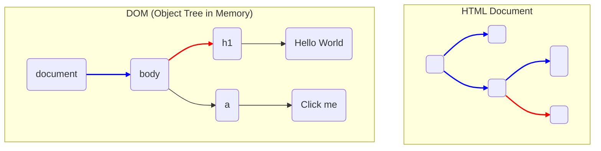

# 第32章 DOM操作：JavaScriptでWebページを動かす

## 🎯 この章で学ぶこと
- DOMが、JavaScriptとHTML/CSSとを繋ぐ「架け橋」であることを説明できる。
- `getElementById`, `querySelector`, `createElement`など、基本的なDOM APIを使って要素の取得、作成、追加、削除ができる。
- 要素の属性（`id`, `class`, `src`など）やテキストコンテンツをJavaScriptで動的に変更できる。
- DOM操作がパフォーマンスに与える影響（リフローとリペイント）を理解し、効率的なコードの書き方を意識できる。
- モダンなフロントエンドフレームワーク（React, Vueなど）がDOM操作をどのように抽象化しているか（仮想DOM）の概念を理解する。

## 🤔 なぜ重要なのか
Webページが単なる静的な文書から、ユーザーの操作に反応する動的なアプリケーションへと進化した背景には、**JavaScriptによるDOM操作**があります。ユーザーがボタンをクリックしたらメニューが開く、フォームに入力したらリアルタイムでエラーメッセージが表示される、無限スクロールで次々と新しいコンテンツが読み込まれる。これら全ての動作は、DOM操作によって実現されています。

DOMの仕組みを理解し、それを自在に操るスキルは、インタラクティブなWeb体験を作り出すための根幹技術です。AIに「ボタンを押したらこの要素の色を変えて」と指示すれば、そのコードは生成されるかもしれません。しかし、なぜそのコードが動くのか、どうすればより効率的に動作させられるのか、そしてなぜ現代のフレームワークが「仮想DOM」という一見複雑な仕組みを導入したのかを理解するには、DOM操作の本質を知る必要があります。この知識は、パフォーマンスの問題を解決し、より高度なUIを構築するための土台となります。

## 📚 基礎概念の理解

### DOMとは「Webページの設計図」のオブジェクト表現
前章で学んだように、DOM (Document Object Model) はブラウザがHTMLを解析して作成する、ページの構造を表すオブジェクトのツリーです。JavaScriptにとって、DOMは操作可能な「ドキュメント」オブジェクトであり、Webページそのものです。

- **`document`オブジェクト**: すべてのDOM操作の起点となるグローバルオブジェクト。
- **ノード (Node)**: DOMツリーを構成する個々の要素。要素ノード（`<div>`）、テキストノード（`"こんにちは"`）、コメントノードなどがある。
- **親子関係**: 各ノードは親子、兄弟といった階層関係を持っている。

JavaScriptはこの`document`オブジェクトを通じて、特定のノードを取得し、その内容、スタイル、属性を変更したり、新しいノードを追加・削除したりします。



### CRUD操作で覚えるDOM API
DOM操作は、データの基本操作であるCRUD（Create, Read, Update, Delete）に沿って覚えると分かりやすいです。

#### 1. Read: 要素の取得
ページ上の既存の要素を操作するためには、まずそれを取得する必要があります。

-   **`document.getElementById('elementId')`**:
    -   指定された`id`を持つ要素を一つだけ返す。高速。
-   **`document.querySelector('css-selector')`**:
    -   指定されたCSSセレクタに一致する**最初の**要素を一つだけ返す。非常に柔軟。
    -   例: `document.querySelector('.my-class')`, `document.querySelector('#my-id p')`
-   **`document.querySelectorAll('css-selector')`**:
    -   指定されたCSSセレクタに一致する**すべての**要素を`NodeList`（配列のようなオブジェクト）として返す。

#### 2. Create: 要素の作成
新しい要素をメモリ上に作成します。この時点ではまだページには表示されません。

-   **`document.createElement('tagName')`**:
    -   指定されたタグ名（`'div'`, `'p'`, `'img'`など）の要素ノードを作成する。

#### 3. Update: 要素の変更
取得した要素の内容や属性を変更します。

-   **`element.textContent = '新しいテキスト'`**:
    -   要素内のテキスト内容をすべて置き換える。HTMLタグは解釈されず、ただの文字列として扱われる。安全。
-   **`element.innerHTML = '<span>新しいHTML</span>'`**:
    -   要素内のHTMLを丸ごと置き換える。HTMLタグは解釈される。XSS脆弱性の原因になりうるため、信頼できないコンテンツには使用しない。
-   **`element.style.color = 'red'`**:
    -   要素のCSSスタイルを直接変更する。
-   **`element.classList.add('new-class')` / `remove()` / `toggle()`**:
    -   要素の`class`属性を操作する。スタイル変更の推奨される方法。
-   **`element.setAttribute('src', 'image.png')` / `getAttribute('src')`**:
    -   `id`, `class`, `style`以外の属性（`src`, `href`, `data-*`など）を操作する。

#### 4. (Append): 要素の追加
作成した要素をDOMツリー上の特定の位置に追加します。ここで初めてページに表示されます。

-   **`parentElement.appendChild(newElement)`**:
    -   `parentElement`の**最後の子要素**として`newElement`を追加する。
-   **`parentElement.insertBefore(newElement, referenceElement)`**:
    -   `parentElement`の子要素である`referenceElement`の**前**に`newElement`を挿入する。

#### 5. Delete: 要素の削除
-   **`parentElement.removeChild(childElement)`**:
    -   `parentElement`から`childElement`を削除する。
-   **`element.remove()`**:
    -   より新しいAPI。`element`自身をその親から削除する。

## 💡 実践的な活用

### ハンズオン：シンプルなToDoリスト作成
これまでの知識を使って、ToDoリストを動的に操作してみましょう。

**HTML:**
```html
<input type="text" id="todo-input" placeholder="新しいタスク">
<button id="add-button">追加</button>
<ul id="todo-list"></ul>
```

**JavaScript:**
```javascript
// 1. 要素の取得
const input = document.getElementById('todo-input');
const addButton = document.getElementById('add-button');
const list = document.getElementById('todo-list');

// "追加"ボタンがクリックされた時の処理
addButton.addEventListener('click', () => {
  const taskText = input.value;
  if (taskText === '') return; // 入力が空なら何もしない

  // 2. 要素の作成
  const li = document.createElement('li');

  // 3. 要素の変更
  li.textContent = taskText;

  // 4. 要素の追加
  list.appendChild(li);

  // 入力欄をクリア
  input.value = '';
});
```
この短いコードで、ユーザーの入力に応じてページが動的に変化する、インタラクティブな機能が実現できています。

### DOM操作のパフォーマンス考慮点
DOM操作は、ブラウザにリフローやリペイントを発生させる可能性があり、コストの高い処理です。特にループ内で何度もDOM操作を行うと、パフォーマンスが著しく低下します。

**悪い例：ループ内でDOMにアクセス**
```javascript
for (let i = 0; i < 100; i++) {
  const li = document.createElement('li');
  li.textContent = `アイテム ${i}`;
  list.appendChild(li); // ループの度にリフロー/リペイントが発生
}
```

**良い例：DocumentFragmentを使う**
`DocumentFragment`は、DOMツリーの一部をメモリ上に保持するための軽量なドキュメントです。これにまとめて要素を追加し、最後に一度だけ実際のDOMにアペンドすることで、リフローとリペイントを最小限に抑えられます。

```javascript
// DocumentFragmentを作成
const fragment = document.createDocumentFragment();

for (let i = 0; i < 100; i++) {
  const li = document.createElement('li');
  li.textContent = `アイテム ${i}`;
  fragment.appendChild(li); // メモリ上のフラグメントに追加（再描画なし）
}

// 最後に一度だけ、実際のDOMに追加
list.appendChild(fragment); // リフロー/リペイントはここで一回だけ
```

## 🔍 深掘り：プロの視点

### 仮想DOM (Virtual DOM)
ReactやVue.jsといったモダンなフロントエンドフレームワークは、なぜ広く使われているのでしょうか？その理由の一つが**仮想DOM**という仕組みで、開発者がパフォーマンスを過度に意識することなく、効率的なDOM操作を実現するためです。

**仕組み**:
1.  **状態の変更**: アプリケーションの状態（データ）が変更されます。
2.  **仮想DOMの更新**: フレームワークは、変更後の状態に基づいて、まずメモリ上に新しい仮想DOMツリーを構築します。
3.  **差分検出 (Diffing)**: 新しい仮想DOMと、前回の更新時に作成した古い仮想DOMを比較し、変更があった部分（差分）だけを特定します。
4.  **パッチ適用 (Patching)**: 特定された差分のみを、実際のDOMにまとめて適用します。

**利点**:
-   **宣言的なUI**: 開発者は「状態がこうなったら、UIはこうあるべき」と宣言するだけでよく、具体的なDOM操作の命令を書く必要がありません。
-   **パフォーマンスの最適化**: 差分検出アルゴリズムにより、DOMへのアクセスが最小限に抑えられます。開発者が手動で最適化するよりも効率的な場合が多いです。
-   **クロスプラットフォーム**: 仮想DOMはブラウザのDOMに直接依存しないため、同じロジックをサーバーサイドレンダリングやネイティブアプリ（React Nativeなど）に応用できます。

仮想DOMは、DOM操作を直接行うことの複雑さとパフォーマンスの問題を、うまく抽象化してくれる強力な仕組みなのです。

## 📋 まとめとチェックポイント
- JavaScriptは`document`オブジェクトを介してDOMツリーにアクセスし、Webページを動的に操作する。
- DOM操作は、CRUD（作成、読み取り、更新、削除）の考え方で整理できる。
- `querySelector`は柔軟な要素取得、`createElement`は要素作成、`appendChild`は要素追加の基本。
- DOM操作はリフローやリペイントを伴う高コストな処理。`DocumentFragment`などを使い、まとめて更新するのがパフォーマンスの鍵。
- Reactなどのモダンフレームワークは、仮想DOMという仕組みを使って、DOM操作を宣言的かつ効率的に行う。

**セルフチェック**
- [ ] `textContent`と`innerHTML`の違いと、セキュリティ上の注意点を説明できますか？
- [ ] 1000個のリストアイテムをページに追加する場合、パフォーマンスを良くするにはどうすればよいですか？
- [ ] なぜモダンなフロントエンドフレームワークは、実際のDOMを直接操作するのではなく、「仮想DOM」という中間層を設けているのですか？
- [ ] `document.querySelector`と`document.querySelectorAll`の違いは何ですか？

## 🔗 関連知識・発展学習
- **ブラウザの仕組み (`0431_Browser_Mechanism.md`)**: DOM操作がなぜリフローやリペイントを引き起こすのか、その背景を深く理解できます。
- **イベント駆動開発 (`0433_Event_Driven_Development.md`)**: DOM操作は、ユーザーのクリックなどの「イベント」をきっかけに実行されることがほとんどです。
- **モダンフレームワーク概要 (`0434_Modern_Framework_Overview.md`)**: ReactやVueが仮想DOMを使って、DOM操作をどのように扱っているかをさらに詳しく学びます。 