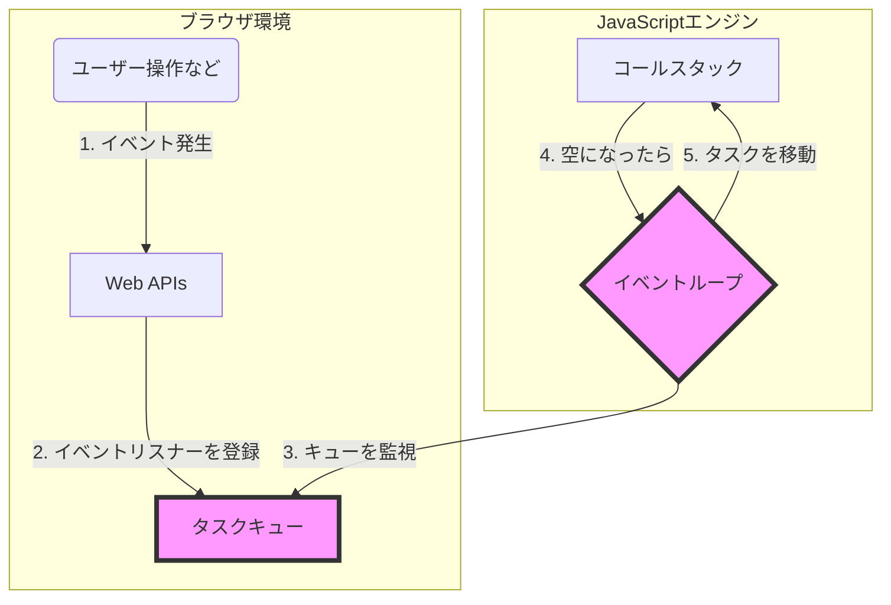
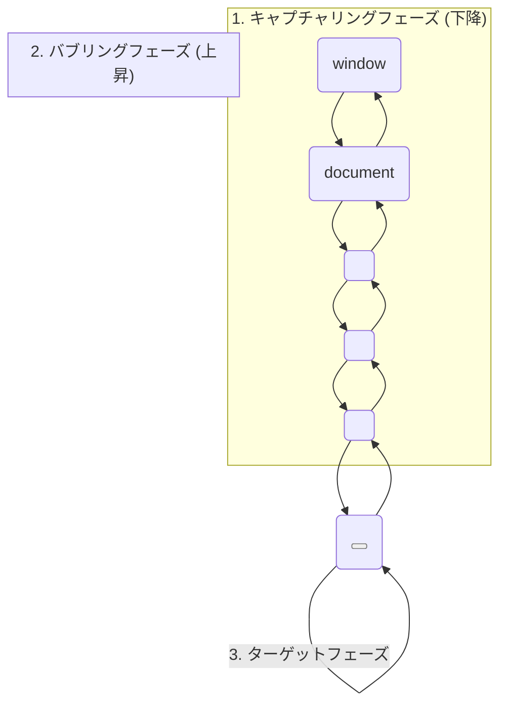

# 第33章 イベント駆動開発：ユーザー操作に応答する仕組み

## 🎯 この章で学ぶこと
- イベント駆動プログラミングが、GUIアプリケーションにおいてなぜ中心的なパラダイムなのかを説明できる。
- イベント、イベントリスナー（イベントハンドラ）、イベントループの3つの主要な概念の関係性を理解する。
- `addEventListener`を使って、DOM要素にイベントリスナーを登録し、ユーザーの操作（クリック、マウス移動、キー入力など）を捕捉できる。
- イベントの伝播モデルである「バブリング」と「キャプチャリング」の違いを説明し、イベント移譲（Event Delegation）を実践できる。
- `event`オブジェクトの役割と、`preventDefault()`, `stopPropagation()`といったメソッドの使いどころを理解する。

## 🤔 なぜ重要なのか
現代のWebアプリケーションは、ユーザーが何かをするのを「待って」います。ボタンがクリックされるのを待ち、フォームに文字が入力されるのを待ち、マウスが動かされるのを待っています。そして、何かが起きた「時」に、それに応じた処理を実行します。このような「**何かが起きたら、これを実行する**」という考え方で作られたプログラムが、**イベント駆動型プログラム**です。

これは、上から下に順番に処理を実行していくスクリプトとは根本的に異なるプログラミングパラダイム（考え方の枠組み）です。ユーザーインターフェース（UI）を持つほとんどすべてのソフトウェアは、このイベント駆動モデルに基づいています。

AIに「ボタンをクリックしたらアラートを出して」と指示すれば、そのコードは簡単に手に入ります。しかし、その裏で「イベントループ」がどのように動いているのか、なぜ一つの要素のクリックが、その親要素にも影響を与える（イベントバブリング）のかを理解していなければ、複雑なUIの挙動を制御したり、パフォーマンスの問題を解決したりすることはできません。イベント駆動の仕組みを深く理解することは、レスポンシブでインタラクティブなUIを構築するための必須スキルです。

## 📚 基礎概念の理解

### イベント駆動の3要素
イベント駆動プログラミングは、主に3つの要素で構成されます。

1.  **イベント (Event)**
    -   システム内で発生した「出来事」。ユーザーの操作（`click`, `keydown`, `mousemove`）や、ブラウザの状態変化（`DOMContentLoaded`, `load`）など、多種多様なものがあります。
    -   イベントが発生すると、そのイベントに関する情報（どのキーが押されたか、マウスの座標はどこか、など）を持つ`event`オブジェクトが生成されます。

2.  **イベントリスナー (Event Listener) / イベントハンドラ (Event Handler)**
    -   特定のイベントが発生するのを「待ち受けている」関数。イベントが発生した時に実行される処理内容が記述されています。一般的に、イベントハンドラはイベントリスナーによって登録された関数を指します。
    -   JavaScriptでは、`element.addEventListener('eventName',
        handlerFunction)`を使って登録します。

3.  **イベントループ (Event Loop)**
    -   JavaScriptの非同期処理の心臓部。「実行すべきタスク（コールバック関数）があるか？」を常に監視し、あればそれをコールスタックに乗せて実行する仕組みです。
    -   ユーザーのクリックなどのイベントが発生すると、それに対応するイベントリスナー（ハンドラ関数）がタスクキュー（またはコールバックキュー）に追加され、イベントループによって順番に処理されます。



### イベントの登録： `addEventListener`
特定のDOM要素で特定のイベントが発生した時に、関数（リスナー）を呼び出すための標準的な方法です。

```javascript
const myButton = document.querySelector('#myButton');

// イベントリスナー（ハンドラ）として実行される関数
function handleClick() {
  console.log('ボタンがクリックされました！');
}

// ボタン要素の'click'イベントに、handleClick関数を登録
myButton.addEventListener('click', handleClick);
```

**なぜ `onclick` 属性より `addEventListener` が良いのか？**
-   **複数のリスナーを登録できる**: `element.onclick = fn`では一つの関数しか登録できませんが、`addEventListener`なら同じイベントにいくつでもリスナーを追加できます。
-   **詳細な制御が可能**: イベントの伝播フェーズ（後述）を指定するなど、高度なオプションが使えます。
-   **関心の分離**: HTMLの構造とJavaScriptの振る舞いを明確に分離できます。

### イベントの伝播：バブリングとキャプチャリング
DOMツリー内のある要素でイベントが発生した時、そのイベントは一つの要素だけで完結するわけではありません。親要素や子要素にも伝わっていきます。この伝播には2つのフェーズがあります。

1.  **キャプチャリングフェーズ (Capturing Phase)**
    -   イベントがDOMツリーの**トップ（`window`）から発生元の要素へ**と下っていくフェーズ。
    -   途中の要素でイベントを捕捉（キャプチャ）することができます。

2.  **バブリングフェーズ (Bubbling Phase)**
    -   イベントが**発生元の要素からトップ（`window`）へ**と上がっていく（泡のようにブクブクと昇っていく）フェーズ。
    -   これがデフォルトの伝播方法です。


ほとんどの場合、私たちはバブリングフェーズでイベントを扱います。`addEventListener`の第3引数に`{ capture: true }`または`true`を指定すると、キャプチャリングフェーズでイベントを捕捉できます。

## 💡 実践的な活用

### イベント移譲 (Event Delegation)
リストの各項目にイベントリスナーを設定したい場合、どうしますか？

**悪い例：すべての `<li>` にリスナーを設定**
```javascript
const listItems = document.querySelectorAll('#my-list li');
listItems.forEach(item => {
  item.addEventListener('click', () => {
    console.log(`${item.textContent}がクリックされました`);
  });
});
```
-   **問題点**:
    -   リスト項目が多いと、多数のイベントリスナーがメモリを消費する。
    -   後からJavaScriptで新しいリスト項目を追加した場合、その新しい項目にはリスナーが設定されない。

**良い例：親要素に一つのリスナーを設定（イベント移譲）**
イベントバブリングの性質を利用し、親要素（`<ul>`）に一つだけイベントリスナーを設定します。

```javascript
const list = document.querySelector('#my-list');

list.addEventListener('click', (event) => {
  // クリックされたのが本当に<li>要素かを確認
  if (event.target.tagName === 'LI') {
    console.log(`${event.target.textContent}がクリックされました`);
  }
});
```
-   **仕組み**: `<li>`で発生したクリックイベントは、親である`<ul>`までバブリングしてきます。`<ul>`に設定されたリスナーは、そのイベントを捕捉し、`event.target`プロパティを使って、イベントの真の発生源が`<li>`であったかどうかを確認します。
-   **利点**:
    -   イベントリスナーは一つだけで済み、メモリ効率が良い。
    -   後から追加された`<li>`要素のクリックも、問題なく捕捉できる。

### `event`オブジェクトの活用
イベントリスナーに渡される`event`オブジェクトは、イベントに関する豊富な情報を持っており、伝播を制御することもできます。

-   **`event.target`**: イベントが**実際に発生した**要素。
-   **`event.currentTarget`**: イベントリスナーが**登録されている**要素（イベント移譲の例では`<ul>`）。
-   **`event.preventDefault()`**:
    -   イベントのデフォルトの動作をキャンセルします。
    -   例: `<a>`タグのクリック（ページ遷移）、`<form>`の送信（ページリロード）などをキャンセルしたい時に使います。
-   **`event.stopPropagation()`**:
    -   イベントの伝播（バブリングやキャプチャリング）をその場で停止させます。
    -   親要素にイベントが伝わるのを防ぎたい、特別なケースで使いますが、多用は禁物です。コンポーネントの独立性を損なう可能性があります。

## 🔍 深掘り：プロの視点

### カスタムイベント (Custom Events)
開発者は、ブラウザが定義したイベントだけでなく、自分自身で独自のイベントを作成してディスパッチ（発行）することができます。
これにより、アプリケーションの異なる部分（コンポーネントなど）が、直接お互いを知らなくても、イベントを通じて疎結合に連携できます。

```javascript
// 'dataLoaded' という名前のカスタムイベントを作成
const myEvent = new CustomEvent('dataLoaded', {
  detail: { userId: 123, data: { ... } } // イベントに付随させたいデータ
});

// document全体でこのイベントを待ち受ける
document.addEventListener('dataLoaded', (event) => {
  console.log('データがロードされました:', event.detail);
});

// データのロードが完了したタイミングでイベントを発行
document.dispatchEvent(myEvent);
```
これは、大規模なアプリケーションの状態管理や、コンポーネント間の通信で非常に強力なパターンです。

### パッシブイベントリスナー (Passive Event Listeners)
スクロール（`scroll`）やタッチ操作（`touchmove`）のような頻繁に発生するイベントでは、`preventDefault()`を呼び出す可能性があると、ブラウザはイベントリスナーの処理が終わるまで画面のスクロールを待機してしまいます。これが「スクロールのカクつき」の原因になります。

`addEventListener`のオプションで`{ passive: true }`を指定すると、「このリスナーは`preventDefault()`を呼び出しません」とブラウザに伝えることができます。これにより、ブラウザはリスナーの実行を待たずに、安心してスクロール処理を続行でき、ユーザー体験が向上します。

```javascript
document.addEventListener('touchmove', handleTouchMove, { passive: true });
```

## 📋 まとめとチェックポイント
- イベント駆動は、ユーザーの操作など、非同期に発生する「出来事（イベント）」を起点に処理を実行するプログラミングモデル。
- イベントリスナー（ハンドラ）を`addEventListener`で登録することで、イベントを捕捉する。
- イベントはDOMツリーを伝播する。この「バブリング」の性質を利用した**イベント移譲**は、効率的なテクニック。
- `event`オブジェクトには発生源（`target`）などの情報が含まれ、`preventDefault()`でデフォルト動作を、`stopPropagation()`で伝播を制御できる。
- 頻繁に発生するイベントには`{ passive: true }`を指定し、ブラウザの最適化を助けることが推奨される。

**セルフチェック**
- [ ] イベントの「バブリング」と「キャプチャリング」の違いを、図を使って説明できますか？
- [ ] 100個のボタンに同じクリック処理を設定したい場合、イベント移譲を使ってどのように実装しますか？その利点は何ですか？
- [ ] フォームの送信ボタンがクリックされた時に、入力内容を検証し、無効な場合はフォームが送信されないようにするには、`event`オブジェクトのどのメソッドを使いますか？
- [ ] `event.target`と`event.currentTarget`は、どのような場合に異なる値を持ちますか？

## 🔗 関連知識・発展学習
- **DOM操作 (`0432_DOM_Manipulation.md`)**: イベントをきっかけとして、この章で学んだDOM操作が実行されます。
- **非同期処理 (`0312_Asynchronous_Programming.md`)**: イベントループは、Promiseなどの非同期処理と同じ仕組みの上で成り立っています。
- **関数型プログラミング (`0123_Functional_Programming.md`)**: イベントリスナー（コールバック関数）は、関数を値として扱う関数型プログラミングの概念と密接に関連しています。 