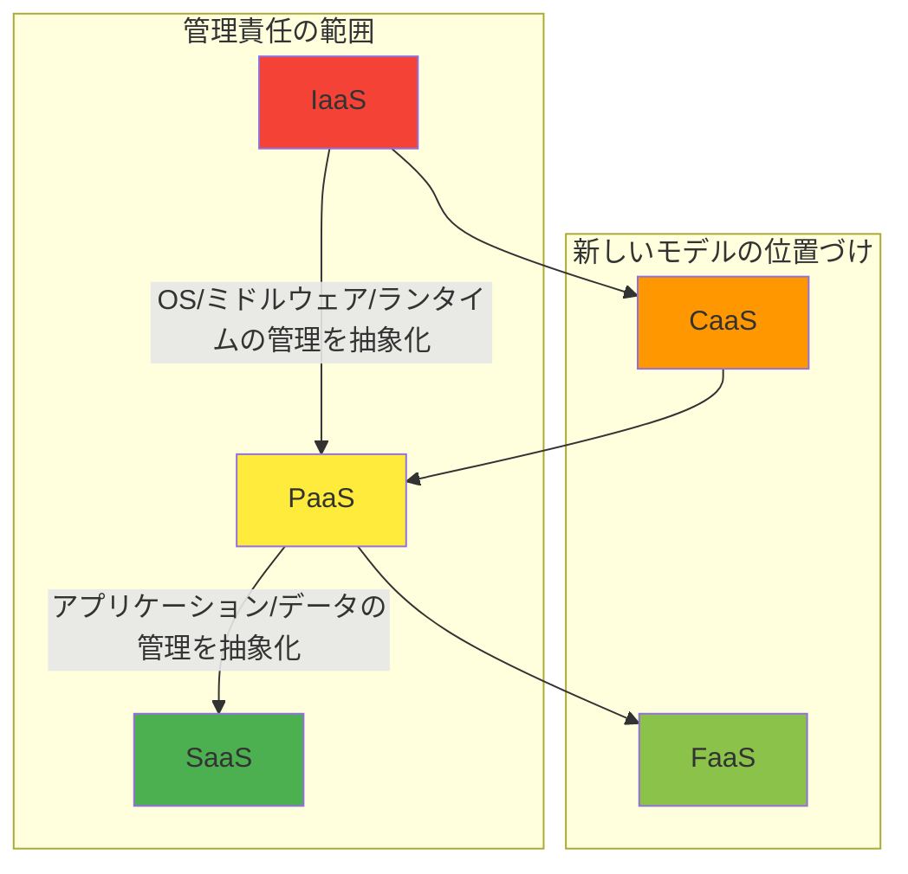

# IaaS、PaaS、SaaS：クラウドサービスモデルの解体新書

## 🎯 この章で学ぶこと
- IaaS, PaaS, SaaSの3つの主要なクラウドサービスモデルを明確に定義し、区別できるようになる。
- 「ピザ・アズ・ア・サービス」の例えを使い、各モデルの責任分界点を直感的に理解する。
- AWS, GCP, Azureにおける具体的なサービス例を各モデルに対応付けられる。
- プロジェクトの要件やチームのスキルセットに基づき、最適なサービスモデルを選択するための判断基準を養う。
- 各モデルの技術的・ビジネス的なトレードオフを深く理解し、アーキテクチャ設計の議論ができるようになる。
- コンテナ（CaaS）やサーバーレス（FaaS）が、これらの伝統的なモデルとどう関係するのかを理解する。

## 🤔 なぜ重要なのか
クラウドコンピューティングという巨大な「ITリソースのデパート」を訪れたとき、私たちは様々な形態の商品を目の当たりにします。ある商品は「キッチンの設備一式（コンロ、水道、作業台）」だけを貸してくれ、食材や調理法は自由です。またある商品は「調理器具に加えて、下ごしらえ済みの食材」まで提供してくれます。さらに別の商品は、注文すればすぐに食べられる「完成品の料理」そのものです。

この「どこまでをクラウド事業者に任せ、どこからを自分たちで管理するか」という選択肢が、IaaS, PaaS, SaaSというサービスモデルです。この選択は、開発の速度、運用の負担、コスト、そしてシステムの柔軟性を根本から決定づけ、エンジニアとしての技術選定能力が最も問われる場面の一つです。

例えば、インフラの細かいチューニングが必要な特殊なシステムを構築したいのに、自由度の低いPaaSを選んでしまうと、実現不可能な壁にぶつかるかもしれません。逆に、アプリケーション開発に集中したいスタートアップが、管理項目が多すぎるIaaSを選ぶと、本来の目的ではないインフラ管理に貴重なリソースを奪われてしまいます。AIに「Webアプリをデプロイして」と指示する際も、どのサービスモデルを前提とするかで、生成される手順やコードは全く異なります。これらのモデルを深く理解することは、クラウドという強力な武器を最大限に活用し、ビジネス価値を最大化するための羅針盤を手に入れることに等しいのです。

## 📚 基礎概念の理解

### クラウドサービスモデルの階層
クラウドサービスは、ユーザーが管理する範囲に応じて、大きく3つの階層に分類されます。これを理解する上で最も有名な例えが「ピザ・アズ・ア・サービス（Pizza as a Service）」です。

*(図: medium.com/@nauf-al/pizza-as-a-service-2-0-50f0b4b23821)*

| | オンプレミス(自宅でピザ) | IaaS (ピザ生地を買う) | PaaS (ピザをデリバリー) | SaaS (レストランでピザ) |
|:---|:---:|:---:|:---:|:---:|
| **管理対象** | 具材、オーブン、電気/ガス、テーブル、飲み物、食事 | - | - | - |
| **提供物** | - | オーブン、電気/ガス | オーブン、電気/ガス、ピザ | オーブン、電気/ガス、ピザ、テーブル、飲み物 |
| **自分で用意** | 全部 | 具材、テーブル、飲み物 | テーブル、飲み物 | なし |

この例えを、ITインフラのスタックに対応させてみましょう。

| ITスタック | オンプレミス | IaaS (Infrastructure) | PaaS (Platform) | SaaS (Software) |
|:---|:---:|:---:|:---:|:---:|
| アプリケーション |  **あなた** |  **あなた** |  **あなた** | クラウド |
| データ |  **あなた** |  **あなた** |  **あなた** | クラウド |
| ランタイム(実行環境) |  **あなた** |  **あなた** | クラウド | クラウド |
| ミドルウェア |  **あなた** |  **あなた** | クラウド | クラウド |
| OS |  **あなた** |  **あなた** | クラウド | クラウド |
| 仮想化 |  **あなた** | クラウド | クラウド | クラウド |
| サーバー(物理) |  **あなた** | クラウド | クラウド | クラウド |
| ストレージ(物理) |  **あなた** | クラウド | クラウド | クラウド |
| ネットワーク(物理) |  **あなた** | クラウド | クラウド | クラウド |
| **意味** | **インフラを"構築"** | **インフラを"利用"** | **プラットフォームを"利用"** | **ソフトウェアを"利用"** |
| **自由度** | 最大 | 高 | 中 | 低 |
| **管理責任** | 最大 | 高 | 中 | 低 |

### IaaS (Infrastructure as a Service)
- **概念**: 「サービスとしてのインフラ」。クラウド事業者が提供するのは、サーバー、ストレージ、ネットワークといった物理的なインフラを仮想化したものまでです。OS以上のレイヤー（OSのインストール、ミドルウェアの設定、アプリケーションのデプロイ）はすべてユーザーが管理します。
- **特徴**:
    - **高い柔軟性**: OSの選択からネットワーク構成まで、インフラを自由に設計・構築できます。オンプレミス環境に最も近い感覚で利用可能。
    - **重い管理責任**: OSのセキュリティパッチ適用、ミドルウェアのバージョンアップ、冗長構成の設計など、運用管理の大部分をユーザー自身が行う必要があります。
- **具体的なサービス例**:
    - **AWS**: Amazon EC2 (仮想サーバー), Amazon S3 (ストレージ), Amazon VPC (仮想ネットワーク)
    - **GCP**: Compute Engine (仮想サーバー), Cloud Storage (ストレージ), Virtual Private Cloud (VPC)
    - **Azure**: Virtual Machines (仮想サーバー), Blob Storage (ストレージ), Virtual Network (仮想ネットワーク)

### PaaS (Platform as a Service)
- **概念**: 「サービスとしてのプラットフォーム」。アプリケーションを実行するためのプラットフォーム（OS、ミドルウェア、ランタイム）をクラウド事業者が提供・管理します。ユーザーは、アプリケーションのコードとデータに集中できます。
- **特徴**:
    - **高い生産性**: インフラ管理の大部分から解放され、開発者はビジネスロジックの実装に専念できます。デプロイも非常に簡単になることが多いです。
    - **制約**: プラットフォームが提供する言語、フレームワーク、バージョンに制約される場合があります。OSレベルの細かいチューニングはできません。
- **具体的なサービス例**:
    - **Heroku**: PaaSの草分け的存在。非常にシンプルな操作でアプリケーションをデプロイできる。
    - **AWS**: AWS Elastic Beanstalk, AWS Lambda (サーバーレスもPaaSの一形態と解釈できる)
    - **GCP**: Google App Engine, Cloud Run, Cloud Functions
    - **Azure**: App Service, Azure Functions

### SaaS (Software as a Service)
- **概念**: 「サービスとしてのソフトウェア」。クラウド事業者が提供する完成したソフトウェアを、ユーザーはインターネット経由で利用するだけです。インフラやプラットフォーム、ソフトウェアのアップデートなど、すべて事業者側で管理されます。
- **特徴**:
    - **即時利用可能**: アカウントを登録すれば、すぐにソフトウェアを使い始められます。インストールやメンテナンスは一切不要。
    - **低いカスタマイズ性**: 提供される機能の範囲内でしか利用できず、独自の機能追加などは基本的に不可能です。
- **具体的なサービス例**:
    - **メール/オフィススイート**: Gmail, Microsoft 365
    - **CRM/SFA**: Salesforce
    - **オンラインストレージ**: Dropbox, Google Drive
    - **コミュニケーションツール**: Slack, Zoom

## 💡 実践的な活用

### どのモデルを選ぶべきか？判断基準とシナリオ
最適なモデルは「何を作りたいか」「チームは何が得意か」によって決まります。

| シナリオ | 推奨モデル | 理由 |
|:---|:---|:---|
| **機械学習モデルのための特殊なGPU環境や、既存のオンプレミス環境をそのままクラウドに移行したい** | **IaaS** | OSレベルでの細かいカスタマイズや、オンプレミスに近い構成の再現が求められるため。インフラ専門のエンジニアがいるチーム向け。 |
| **WebアプリケーションやAPIを迅速に開発し、市場投入したいスタートアップ** | **PaaS** | インフラ管理のオーバーヘッドを最小限にし、開発速度を最大化できる。少人数の開発チームに最適。`git push`だけでデプロイできる手軽さが魅力。 |
| **社内の経費精算システムや顧客管理ツールを導入したい非IT企業** | **SaaS** | 自社で開発・運用するよりも、実績のあるSaaSを契約する方がはるかに低コスト・高品質・短納期。専門知識がなくても利用できる。 |
| **マイクロサービスアーキテクチャを採用し、各サービスを独立してデプロイ・スケールさせたい** | **PaaS (特にコンテナPaaSやサーバーレス)** | 各サービスをコンテナ化し、Cloud Run (GCP) や Fargate (AWS) のようなPaaS上で動かすことで、インフラを意識せずにマイクロサービスのメリットを享受できる。 |

### トレードオフの理解
- **IaaS**: **「自由」** を得る代わりに **「管理責任」** を負う。
- **PaaS**: **「生産性」** を得る代わりに **「制約（ベンダーロックインのリスク）」** を受け入れる。
- **SaaS**: **「利便性」** を得る代わりに **「柔軟性」** を諦める。

ベンダーロックインとは、特定のクラウド事業者のサービスに深く依存してしまい、他の事業者への乗り換えが困難になる状態を指します。PaaSは特にこのリスクが高まりますが、開発速度の向上という大きなメリットとのトレードオフになります。

## 🔍 深掘り：プロの視点

### 境界線を曖昧にする新しいモデル：CaaSとFaaS
近年、IaaSとPaaSの中間に位置するような新しいサービスモデルが登場し、主流になりつつあります。

- **CaaS (Containers as a Service)**:
    - **概念**: コンテナ化されたアプリケーションを管理・実行するためのプラットフォーム。IaaSのようにインフラの構成を意識する必要はあまりないが、PaaSよりも細かい制御（ネットワーキング、ストレージ連携など）が可能です。
    - **代表例**: Google Kubernetes Engine (GKE), Amazon Elastic Kubernetes Service (EKS), Azure Kubernetes Service (AKS)。これらは、コンテナオーケストレーションツールであるKubernetesをマネージドサービスとして提供します。
    - **位置づけ**: IaaSの柔軟性とPaaSの生産性を両立しようとするアプローチ。現代のマイクロサービス開発におけるデファクトスタンダードとなりつつあります。

- **FaaS (Functions as a Service) / サーバーレス**:
    - **概念**: コード（関数）をアップロードするだけで、実行環境のことは一切考えなくてもよいモデル。リクエストがあったときだけコードが実行され、実行時間に応じて課金されます。
    - **代表例**: AWS Lambda, Google Cloud Functions, Azure Functions。
    - **位置づけ**: PaaSをさらに推し進め、アプリケーションの管理単位を「関数」という最小単位まで分解したもの。インフラ管理からの完全な解放を目指す究極のPaaSと言えます。

この図のように、CaaSやFaaSの登場により、IaaS/PaaS/SaaSという単純な3分類では語れない、よりグラデーションのある選択肢が生まれています。プロのエンジニアは、これらの微妙な違いを理解し、プロジェクトの特性に合わせて最適な「抽象度」のサービスを選択する能力が求められます。

## 📋 まとめとチェックポイント
- クラウドのサービスモデルは、ユーザーとクラウド事業者の「責任分界点」の違いによってIaaS, PaaS, SaaSに大別される。
- **IaaS**はインフラの部品を提供し、**自由度**が高いが**管理責任**も重い。
- **PaaS**はアプリ実行環境を提供し、**生産性**が高いが**制約**もある。
- **SaaS**は完成したソフトウェアを提供し、**利便性**が高いが**柔軟性**は低い。
- CaaS (Kubernetes) や FaaS (サーバーレス) は、IaaSとPaaSの中間や延長線上に位置し、現代開発の主流となりつつある。
- 最適なモデルの選択は、コスト、開発速度、運用負荷、将来の拡張性といったビジネス要件と技術要件のトレードオフを考慮して行う。

**セルフチェック**
- [ ] あなたが新しいWebサービスをゼロから立ち上げるとして、なぜIaaSではなくPaaS（またはCaaS/FaaS）から検討を始めるべきなのか、その理由を説明できますか？
- [ ] 既存のオンプレミスの複雑なシステムをクラウドに移行するプロジェクトで、なぜPaaSではなくIaaSが第一候補になるのかを説明できますか？
- [ ] 「PaaSはベンダーロックインのリスクがある」とは、具体的にどういうことか、例を挙げて説明できますか？
- [ ] あなたのチームにインフラの専門家がいない場合、どのサービスモデルを選択することがチームの成功確率を最も高めるでしょうか？

## 🔗 関連知識・発展学習
- [0441_Server_Architecture.md](../../04_Network_Web_Development/044_Backend_Development/0441_Server_Architecture.md): マイクロサービスやサーバーレスといったアーキテクチャは、PaaSやFaaSといったクラウドサービスモデルと密接に関連します。
- [0522_Kubernetes_Overview.md](../052_Container_Orchestration/0522_Kubernetes_Overview.md): CaaSの中核技術であるKubernetesについて学びます。
- [0513_Serverless_Architecture.md](./0513_Serverless_Architecture.md): FaaSに代表されるサーバーレスアーキテクチャを深く掘り下げます。 