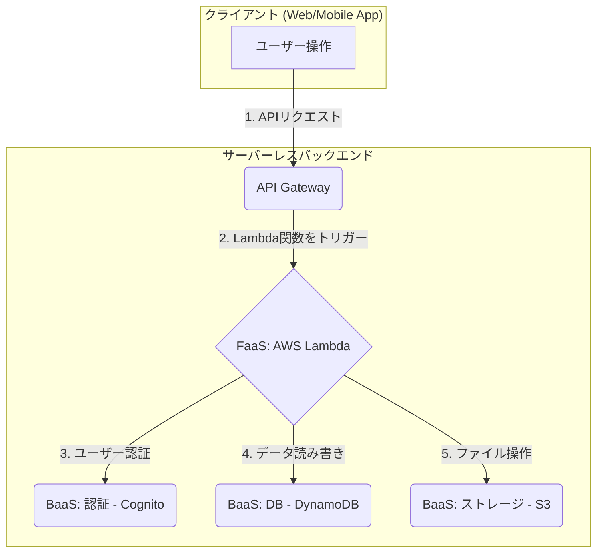

# サーバーレスアーキテクチャ：インフラ管理からの解放

## 🎯 この章で学ぶこと
- サーバーレスが「サーバーがない」わけではない、本当の意味を理解する。
- FaaS (Function as a Service) と BaaS (Backend as a Service) の違いと関係性を説明できるようになる。
- イベント駆動アーキテクチャの概念と、サーバーレスがなぜそれに適しているのかを学ぶ。
- サーバーレスのメリット（コスト、スケーラビリティ、生産性）とデメリット（コールドスタート、デバッグの複雑さ、ベンダーロックイン）を深く理解する。
- サーバーレスアーキテクチャが適している具体的なユースケースと、そうでないケースを判断できるようになる。
- AWS Lambdaを例に、サーバーレス関数のライフサイクルと基本的な設定項目を理解する。

## 🤔 なぜ重要なのか
これまで、インフラの管理は開発者にとって大きな負担でした。IaaSはOSの管理から、PaaSはランタイムの管理から私たちを解放してくれましたが、それでも「アプリケーション」や「サーバープロセス」という単位での管理は依然として残っていました。常時稼働するサーバーの維持費、アクセスの増減に応じたスケーリング、OSやミドルウェアのセキュリティ対策…これらはアプリケーションの本質的な価値とは言い難い、煩雑な作業です。

**サーバーレスアーキテクチャ**は、このインフラ管理という概念そのものを開発者から剥ぎ取る、革命的なパラダイムシフトです。例えるなら、これまではレストランを経営するために「厨房を借りる(IaaS)」か「ゴーストキッチンを利用する(PaaS)」必要があったのに対し、サーバーレスは「料理のレシピ（コード）を渡せば、注文（リクエスト）が入った時だけ、どこかの誰かが魔法のように調理してくれ、調理時間分の料金だけを支払う」ようなものです。

開発者はインフラの存在をほとんど意識することなく、純粋にコードを書くことだけに集中できます。これにより、開発速度は飛躍的に向上し、コストは究極まで効率化されます。AIに「画像がアップロードされたらサムネイルを生成する機能を作って」と依頼すれば、AIはごく自然にサーバーレス（AWS Lambdaなど）を前提としたコードを生成するでしょう。この新しい開発スタイルを理解し、使いこなすことは、現代のクラウドネイティブな開発をリードするエンジ-ニアにとって不可欠な能力です。

## 📚 基礎概念の理解

### 「サーバーレス」の本当の意味
サーバーレスとは、文字通り「サーバーが存在しない」わけではありません。物理的なサーバーはクラウド事業者のデータセンターで稼働しています。重要なのは、**開発者がサーバーのプロビジョニング、管理、スケーリングを意識しなくてよい**という点です。サーバーは抽象化され、開発者の視界から消え去ります。これが「サーバーレス」の本質です。

### サーバーレスの二つの柱：FaaSとBaaS
サーバーレスは、主に2つのサービスカテゴリで構成されます。

1.  **FaaS (Function as a Service)**
    -   **概念**: サーバーレスの中核をなすコンピューティングサービス。開発者はビジネスロジックを「関数」という小さな単位で記述し、クラウドにアップロードします。この関数は、特定のイベント（HTTPリクエスト、ファイルのアップロード、データベースの更新など）をトリガーとして実行されます。
    -   **特徴**:
        - **イベント駆動**: 何かが起きたら、それに応じてコードが動く。
        - **ステートレス**: 各関数は状態を持ちません。前の実行結果を記憶していないため、必要なデータは都度外部（データベースなど）から取得する必要があります。
        - **短命**: 関数の実行時間は通常、数秒から数分に制限されています。
    -   **代表例**: **AWS Lambda**, **Google Cloud Functions**, **Azure Functions**

2.  **BaaS (Backend as a Service)**
    -   **概念**: アプリケーションのバックエンドで必要となる汎用的な機能（認証、データベース、ファイルストレージなど）を、APIとして提供するサービス群。
    -   **特徴**: FaaSと組み合わせることで、サーバーサイドのコードを一行も書かずに、高機能なバックエンドを構築できます。
    -   **代表例**:
        - **認証**: **Amazon Cognito**, **Firebase Authentication**, **Auth0**
        - **データベース**: **Amazon DynamoDB** (NoSQL), **Firebase Realtime Database**, **Supabase**
        - **ストレージ**: **Amazon S3**, **Firebase Storage**

**FaaSとBaaSの関係**: FaaSが「自作のロジック」を実行するエンジンだとすれば、BaaSは「既製品のバックエンド部品」です。この2つを組み合わせることで、開発者は車輪の再発明を避け、独自のビジネスロジック（FaaS）の開発に集中できるのです。

## 💡 実践的な活用

### サーバーレスアーキテクチャのメリット
- **コスト効率**: コードが実行されている時間だけ課金されるため、アイドリング時間（リクエストがない時間）のコストがゼロになります。トラフィックの少ないサービスでは劇的なコスト削減が見込めます。
- **無限のスケーラビリティ**: リクエストの量に応じて、クラウド事業者が自動的に数千、数万のインスタンスを並行して立ち上げ、処理を実行します。開発者はスケーリングについて一切考える必要がありません。
- **高い生産性**: サーバー管理から解放され、インフラではなくビジネスロジックに集中できるため、開発速度が向上します。

### サーバーレスアーキテクチャのデメリットと課題
- **コールドスタート (Cold Start)**: しばらくリクエストがなかった関数が最初に呼び出される際、実行環境の準備（コンテナの起動など）に余分な時間がかかる問題。レイテンシが重要なサービスでは問題になることがあります。
- **実行時間の制限**: 長時間（例: 15分以上）にわたる重いバッチ処理などには向いていません。
- **デバッグと監視の複雑さ**: 多数の小さな関数が連携して動く分散システムとなるため、問題発生時の原因特定や、システム全体の監視が従来のモノリシックなアプリケーションより難しくなります。
- **ベンダーロックイン**: FaaSのAPIやBaaSのサービスは、クラウド事業者ごとに仕様が大きく異なります。特定の事業者に深く依存してしまい、他社への移行が困難になるリスクがあります。

### ユースケース：どんな処理に向いているか？
| 適しているユースケース | 適していないユースケース |
|:---|:---|
| **Web API / モバイルバックエンド**: SPAやモバイルアプリからのリクエスト処理。 | **長時間のバッチ処理**: 動画エンコーディング、大規模なデータ分析。 (AWS BatchやECS/EKSが適任) |
| **リアルタイムデータ処理**: IoTデバイスからのストリーミングデータ処理。 | **低レイテンシが絶対条件のアプリ**: オンラインゲームのリアルタイム通信、高頻度取引システム。(常時起動の専用サーバーが適任) |
| **イベント駆動の自動化処理**: S3に画像がアップロードされたら自動でリサイズする。 | **状態を持つ(Stateful)なアプリ**: WebSocketを使ったリアルタイムチャットサーバー。(常時接続を維持する必要があるため) |
| **定期実行タスク (Cron Job)**: 毎日深夜にレポートを生成してメールで送信する。 | **既存の巨大なモノリシックアプリの移行**: そのまま移行するのは困難。機能ごとに分割して段階的に移行する必要がある。 |

## 🔍 深掘り：プロの視点

### AWS Lambdaのライフサイクルと実行コンテキスト
サーバーレスの挙動を深く理解するために、AWS Lambdaの内部的な動きを見てみましょう。
1.  **Initフェーズ (コールドスタート時のみ)**:
    -   Lambdaは関数を実行するための安全なコンテナ環境を確保します。
    -   関数のコード（例: `index.js`）をダウンロードします。
    -   コードの**グローバルスコープ**部分（`require`文や、ハンドラ関数の外で定義された変数、DBコネクションプールなど）を実行します。このフェーズはコールドスタート時にのみ発生します。
2.  **Invokeフェーズ (リクエストごと)**:
    -   指定された**ハンドラ関数**が、イベントデータ（`event`オブジェクト）とコンテキスト情報（`context`オブジェクト）を引数に取って実行されます。
    -   ビジネスロジックが処理されます。
3.  **Shutdownフェーズ**:
    -   一定時間リクエストがない場合、Lambdaはこの実行環境を破棄します。

**実行コンテキスト (Execution Context)**: `Init`フェーズで作成された環境は、次のリクエストのために**再利用**されることがあります（ウォームスタート）。グローバルスコープで初期化したDB接続などをハンドラ関数で再利用することで、パフォーマンスを向上させることができます。これがサーバーレスのパフォーマンスチューニングにおける重要なテクニックです。

### サーバーレス時代の設計思想：疎結合と単一責任
サーバーレスアーキテクチャをうまく構築する鍵は、**疎結合 (Loosely Coupled)**なコンポーネントと、**単一責任の原則 (Single Responsibility Principle)**に従うことです。
- 各関数は、一つのことだけをうまくやるべきです（例: 「ユーザーを登録する」関数、「注文を処理する」関数）。
- 関数同士は、直接お互いを呼び出すのではなく、API GatewayやSQS (Simple Queue Service), EventBridgeといったイベントサービスを介して間接的に連携します。
- これにより、ある関数を変更しても他の関数への影響が最小限に抑えられ、システム全体の保守性や拡張性が向上します。

## 📋 まとめとチェックポイント
- サーバーレスは、開発者がサーバー管理を意識しなくてよいアーキテクチャモデルである。
- **FaaS**はイベント駆動でコードを実行するエンジン、**BaaS**は認証やDBといったバックエンド部品セット。
- メリットは**コスト効率**、**自動スケーリング**、**高い生産性**。
- デメリットは**コールドスタート**、**デバッグの複雑さ**、**ベンダーロックイン**。
- イベント駆動でステートレスな、短時間の処理に非常に適している。
- 実行コンテキストの再利用を理解することが、パフォーマンスチューニングの鍵。

**セルフチェック**
- [ ] 「サーバーレスは銀の弾丸ではない」と言われます。その理由を、メリットとデメリットの両方に触れながら説明できますか？
- [ ] あなたが開発するサービスのアクセス数が「1日に数回」しかない場合、なぜ伝統的な常時起動サーバーよりもサーバーレスがコスト面で圧倒的に有利なのか説明できますか？
- [ ] サーバーレス関数でデータベース接続を行う際、なぜハンドラ関数の内部ではなく、グローバルスコープで接続を初期化すべきなのでしょうか？
- [ ] ユーザー登録処理を1つのLambda関数で行うとします。その関数が担当すべきでない処理の例を挙げられますか？（例: 登録完了メールの送信）そして、その処理をどう分離すべきですか？

## 🔗 関連知識・発展学習
- [0433_Event_Driven_Development.md](../../04_Network_Web_Development/043_Frontend_Development/0433_Event_Driven_Development.md): サーバーレスの基本となるイベント駆動の考え方を復習します。
- [0535_MLOps.md](../053_CI_CD_DevOps/0535_MLOps.md): 機械学習モデルの推論エンドポイントとして、サーバーレスは非常に人気のある選択肢です。
- [0441_Server_Architecture.md](../../04_Network_Web_Development/044_Backend_Development/0441_Server_Architecture.md)
- [0512_IaaS_PaaS_SaaS.md](./0512_IaaS_PaaS_SaaS.md) 