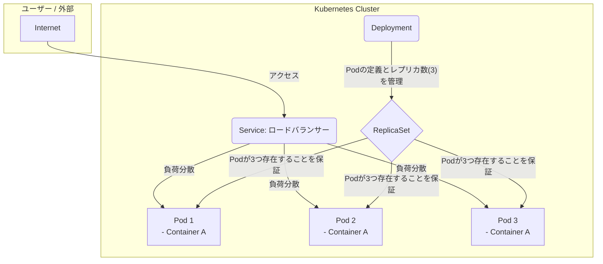

# Kubernetes概要：コンテナオーケストレーションのデファクトスタンダード

## 🎯 この章で学ぶこと
- なぜDockerだけでは本番運用に不十分で、Kubernetesのような「コンテナオーケストレーション」ツールが必要なのかを説明できる。
- Kubernetesのマスターノードとワーカーノードから成る基本アーキテクチャを理解する。
- Pod, Service, Deployment, ReplicaSetといったKubernetesの基本的なリソースオブジェクトの役割を理解する。
- 「宣言的API」と「自己修復能力」がKubernetesの最も強力な特徴であることを学ぶ。
- YAMLファイルを用いて、どのようにKubernetesにアプリケーションの「あるべき状態」を指示するのかを理解する。

## 🤔 なぜ重要なのか
Dockerを使えば、アプリケーションをコンテナというポータブルな箱に入れることができました。しかし、本番環境で動かすアプリケーションが1つや2つのコンテナで済むことは稀です。Webサーバー、APIサーバー、データベース、キャッシュなど、多数のコンテナが連携して一つのサービスを構成します。

ここで新たな問題が生まれます。「もしコンテナの一つがクラッシュしたら誰が再起動するのか？」「急なアクセス増に対応して、コンテナの数を自動で増やすにはどうすればいいのか？」「複数のコンテナ間で、どうやって効率的に通信を行うのか？」

これらの問題を人力で解決するのは、コンテナの数が増えるほど非現実的になります。これを解決するのが、**コンテナオーケストレーション**ツールであり、そのデファクトスタンダード（事実上の標準）が**Kubernetes (クバネティス、通称k8s)**です。

Kubernetesは、ギリシャ語の「航海長」や「操舵手」を意味します。その名の通り、多数のコンテナ（船団）を巧みに操り、健全な状態を保ち、目的地（安定稼働）まで導くための壮大な自動化システムです。Kubernetesを理解することは、単なるコンテナ技術の延長ではなく、現代的な分散システムを管理・運用するための、全く新しいレベルのOSを学ぶことに等しいのです。AIに「このアプリケーションを本番環境でスケーラブルに動かして」と依頼すれば、その答えはほぼ間違いなくKubernetesを前提としたものになるでしょう。

## 📚 基礎概念の理解

### Kubernetesのアーキテクチャ：クラスターという名の艦隊
Kubernetesは、複数のサーバー（物理または仮想）を束ねて、**クラスター**と呼ばれる一つの巨大なコンピューティングリソースとして管理します。このクラスターは、大きく分けて2種類のサーバー（**ノード**）から構成されます。

- **マスターノード (Master Node / Control Plane)**:
    - **役割**: クラスター全体の「頭脳」。司令塔として、クラスターの状態を管理し、全ての指示はここから発せられます。ユーザーが直接やりとりするのもマスターノードです。
    - **主要コンポーネント**:
        - **API Server**: 全ての外部との通信を受け付ける唯一の窓口。
        - **etcd**: クラスターの全構成情報（どんなコンテナがどこで動いているか等）を保存する分散データベース。
        - **Scheduler**: 新しいコンテナをどのワーカーノードで実行するかを決定する。
        - **Controller Manager**: クラスターが「あるべき状態」になるように、様々なリソースを監視・制御する。

- **ワーカーノード (Worker Node)**:
    - **役割**: 実際にコンテナ（アプリケーション）を実行する「手足」。マスターノードからの指示に従って、コンテナを起動・停止・監視します。
    - **主要コンポーネント**:
        - **Kubelet**: マスターノードと通信し、コンテナの管理を行うエージェント。
        - **Kube-proxy**: ノード間のネットワーク通信を実現する。
        - **Container Runtime**: Dockerなど、実際にコンテナを動かすためのソフトウェア。


*(図: Kubernetes Documentation)*

### 基本的なリソースオブジェクト：Kubernetes世界の構成要素
Kubernetesでは、コンテナやネットワーク、ストレージなどを**リソース**というオブジェクトとして抽象化し、YAML形式のファイルで定義します。

- **Pod (ポッド)**:
    - **概念**: Kubernetesが扱う**デプロイの最小単位**。1つ以上のコンテナの集合体です。通常は1Podに1コンテナを配置します。Pod内のコンテナは、ストレージとネットワークを共有します。
    - **ポイント**: コンテナを直接デプロイするのではなく、Podというカプセルに入れてデプロイします。

- **ReplicaSet (レプリカセット)**:
    - **概念**: 同じ仕様のPodを、指定された数だけ常に起動し続けることを保証するコントローラー。
    - **役割**: Podがクラッシュした場合、ReplicaSetが自動的に新しいPodを起動し、指定されたレプリカ（複製）数を維持します（自己修復）。

- **Deployment (デプロイメント)**:
    - **概念**: ReplicaSetをさらに抽象化し、アプリケーションの**デプロイ戦略**を管理するコントローラー。
    - **役割**: **通常、PodやReplicaSetを直接作成するのではなく、このDeploymentを作成します。** ローリングアップデート（一つずつ古いコンテナを新しいものに入れ替えていく、ダウンタイムのないデプロイ）などの高度なデプロイ戦略を提供します。

- **Service (サービス)**:
    - **概念**: 複数のPodに対する単一の窓口（IPアドレスとDNS名）を提供するリソース。
    - **役割**: PodのIPアドレスは起動のたびに変わる可能性がありますが、ServiceのIPアドレスは固定です。これにより、他のPodや外部から、安定してアプリケーションにアクセスできるようになります。また、複数のPodに対して自動的にリクエストを振り分けるロードバランサーの役割も担います。


この図は、DeploymentがReplicaSetを管理し、ReplicaSetが3つのPodの存在を保証し、ServiceがそれらのPodへのアクセス窓口となっている、という典型的な構成を示しています。

## 💡 実践的な活用

### 宣言的APIとYAML
Kubernetesの最も強力なパラダイムは**宣言的 (Declarative) である**という点です。
- **命令的 (Imperative) との違い**:
    - **命令的**: 「Dockerコンテナを起動せよ」「あのコンテナを停止せよ」のように、**どうやるか (How)** を逐一指示する。
    - **宣言的**: 「この仕様のコンテナが3つ動いている、という**状態 (What)** にせよ」と、**あるべき姿**を宣言する。
- **YAMLによる宣言**: 開発者は、この「あるべき姿」をYAMLファイルに記述し、KubernetesのAPI Serverに提出します。

```yaml
# deployment.yaml
apiVersion: apps/v1
kind: Deployment  # ① リソースの種類はDeployment
metadata:
  name: my-nginx-deployment
spec:
  replicas: 3      # ② Podのレプリカは3つ
  selector:
    matchLabels:
      app: my-nginx
  template:
    metadata:
      labels:
        app: my-nginx
    spec:
      containers:
      - name: nginx
        image: nginx:1.21 # ③ コンテナイメージはnginx:1.21
        ports:
        - containerPort: 80
```
このYAMLファイルを `kubectl apply -f deployment.yaml` というコマンドで適用すると、Kubernetesのコントローラーが現在の状態とこの「あるべき姿」の差分を検知し、その差を埋めるために必要な全ての操作（Podの作成、スケジューリングなど）を**自動的に**行ってくれます。

### 自己修復 (Self-healing)
宣言的APIの強力な帰結が、自己修復能力です。
- **仕組み**: Kubernetesは常にクラスターの状態を監視しています。もし、あるべき状態（例: NginxのPodが3つ）から逸脱した場合（例: ワーカーノードの障害でPodが1つ消えた）、コントローラーは即座にそれを検知し、新しいPodを別の正常なノードで起動して、レプリカ数3という状態を自動的に回復させます。
- **利点**: これにより、インフラの障害に対する高い耐障害性が、人手を介さずに実現されます。

## 🔍 深掘り：プロの視点

### マネージドKubernetesサービス
Kubernetesのクラスター、特にマスターノードのコンポーネントを自前で構築・運用するのは非常に複雑で困難です。そのため、現在ではほとんどの場合、クラウドプロバイダーが提供する**マネージドKubernetesサービス**を利用します。

- **代表例**:
    - **Amazon EKS** (Elastic Kubernetes Service)
    - **Google GKE** (Google Kubernetes Engine)
    - **Azure AKS** (Azure Kubernetes Service)
- **メリット**: これらのサービスは、マスターノードの構築、スケーリング、バックアップ、アップグレードといった面倒な運用を全てクラウド事業者にオフロードできます。開発者は、ワーカーノードと、その上で動かすアプリケーションのことだけを考えればよくなります。

### Kubernetesはプラットフォームのためのプラットフォーム
Kubernetesは、それ自体がアプリケーションを直接動かすというよりは、**アプリケーションを動かすためのプラットフォーム（PaaSなど）を構築するための基盤**として捉えるのがより正確です。Service Mesh (Istio), サーバーレス基盤 (Knative), CI/CDツール (ArgoCD)など、膨大なエコシステムがKubernetes上で構築されており、これらを組み合わせることで、自社に最適化された強力な開発・運用プラットフォームを作り上げることができます。

## 📋 まとめとチェックポイント
- Kubernetesは、多数のコンテナのデプロイ、スケーリング、管理を自動化するコンテナオーケストレーションツール。
- クラスターは、司令塔である**マスターノード**と、コンテナを動かす**ワーカーノード**で構成される。
- **Pod**, **Deployment**, **Service**は、アプリケーションを構成する最も基本的なリソース。
- Kubernetesの最大の特徴は、YAMLで**あるべき姿**を定義する**宣言的API**と、その状態を維持しようとする**自己修復能力**。
- 本番環境では、**マネージドKubernetesサービス (EKS, GKE, AKS)** を利用するのが一般的。

**セルフチェック**
- [ ] Docker Swarmなど他のツールもある中で、なぜKubernetesがコンテナオーケストレーションのデファクトスタンダードになったのだと推測しますか？（ヒント：宣言的API、エコシステム）
- [ ] あなたがDeploymentのYAMLで`replicas`の数を`3`から`5`に変更して`kubectl apply`を実行したとき、Kubernetesの内部では何が起こるか、順を追って説明できますか？
- [ ] PodとDeploymentの違いは何ですか？なぜ私たちは通常、Podを直接作成しないのですか？
- [ ] あるPodにアクセスしたいのに、そのPodのIPアドレスを直接指定してはいけないのはなぜですか？代わりに何を使うべきですか？

## 🔗 関連知識・発展学習
- [0521_Docker_Basics.md](./0521_Docker_Basics.md): Kubernetesが何をオーケストレーションしているのかを理解するための前提知識。
- [0441_Server_Architecture.md](../../04_Network_Web_Development/044_Backend_Development/0441_Server_Architecture.md): マイクロサービスアーキテクチャは、Kubernetesの能力を最大限に活かせる代表的なユースケースです。
- [kubectl Cheat Sheet](https://kubernetes.io/docs/reference/kubectl/cheatsheet/): Kubernetesを操作するためのCLIツール`kubectl`の便利なコマンド集。 