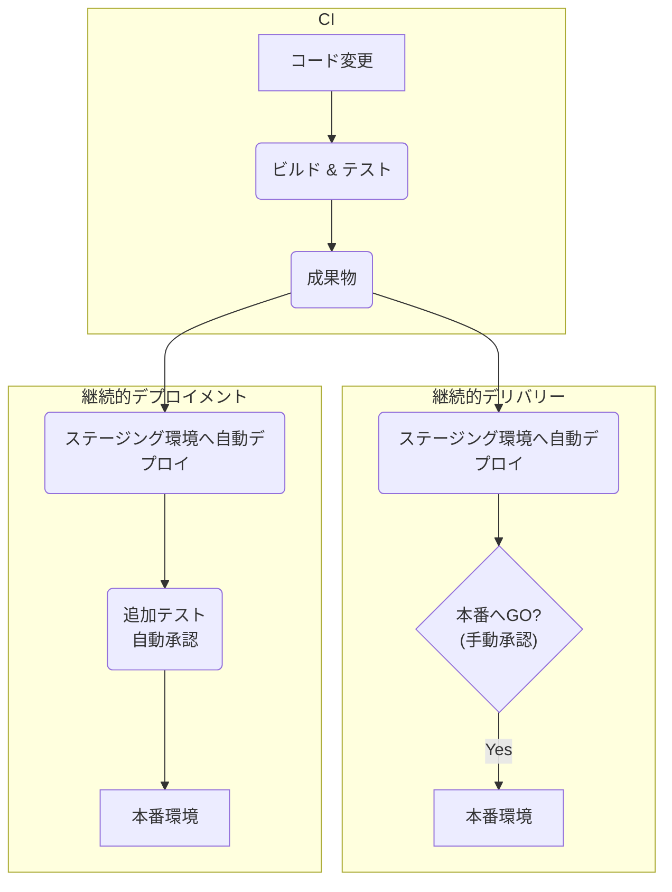

# 継続的デプロイメント(CD)：アイデアを価値に変える最終工程

## 🎯 この章で学ぶこと
- 継続的デリバリーと継続的デプロイメントの厳密な違いを理解し、どちらを目指すべきか判断できるようになる。
- なぜ「リリース単位を小さくする」ことが、デプロイのリスクを低減させるのかを論理的に説明できる。
- ブルーグリーンデプロイメント、カナリアリリースといった高度なデプロイ戦略の仕組みと利点、欠点を学ぶ。
- 本番環境への自動デプロイを可能にするための技術的要件（高度なテスト、監視、フィーチャーフラグ）を理解する。
- 継続的デプロイメントが、単なる技術プラクティスではなく、ビジネスの俊敏性を高める経営戦略であることを認識する。

## 🤔 なぜ重要なのか
継続的インテグレーション(CI)によって、私たちの手元には常に「品質が保証され、いつでもリリース可能なソフトウェア」が存在するようになりました。しかし、この成果物をユーザーの元に届ける最後の「デプロイ」という工程が、数週間に一度の手動作業のままだとしたらどうでしょう？それは、最新鋭のエンジンを積んだF1マシンが、舗装されていないガタガタの道（手動デプロイ）を走るようなものです。マシンの性能を全く活かせず、いつスピンして炎上してもおかしくありません。

**継続的デリバリー/デプロイメント(CD)**は、この最後の道を、滑らかで安全な高速道路へと変えるプラクティスです。CIが保証した品質を損なうことなく、むしろその価値を最大化し、開発者のアイデアや努力の結晶を、最短時間でユーザーという最終目的地に届けます。

多くの組織が「デプロイは怖いもの」と考えています。金曜の夜に、障害に備えて何人ものエンジニアが泊まり込みでデプロイ作業を行う…といった光景は、かつては当たり前でした。CDは、この恐怖を根本から取り除きます。「デプロイは退屈なほど日常的な作業であるべきだ」というのがCDの思想です。デプロイ作業を頻繁に、自動化され、制御された方法で行うことで、一つ一つの変更を小さくし、リスクを極限まで低減させるのです。

この章で学ぶCDの概念と技術は、もはや単なる開発効率化の話ではありません。ビジネスの要求に即座に応え、競合他社より早く市場に価値を届け、ユーザーからのフィードバックを即座に製品に反映させる。これは、現代のデジタルビジネスにおける生命線であり、超一流のエンジニアが必ずマスターすべき経営レベルの知識なのです。

## 📚 基礎概念の理解

### デリバリー vs デプロイメント：2つのCD
前章でも触れましたが、この2つの違いを正確に理解することが出発点です。

- **継続的デリバリー (Continuous Delivery)**:
    - **ゴール**: CIをパスしたコードは、自動的にテストされ、パッケージ化され、ステージング環境のような本番同様の環境へ**自動でデプロイされる**。
    - **本番デプロイ**: **手動**。ビジネス部門の判断やマーケティングのタイミングに合わせ、ボタン一つでいつでも誰でも安全に本番リリースができる状態を維持する。
    - **特徴**: リリースの「タイミング」をコントロールしたい場合に適している。

- **継続的デプロイメント (Continuous Deployment)**:
    - **ゴール**: 継続的デリバリーの最終ステップである手動の承認プロセスさえも自動化する。
    - **本番デプロイ**: **自動**。`main`ブランチへのマージ後、全てのパイプラインが成功すれば、**人間の介在なしに**自動的に本番環境へデプロイされる。
    - **特徴**: 究極の自動化。開発者が書いたコードが、数分から数時間でユーザーの目に触れる。

どちらを目指すかは組織の成熟度や製品の特性によりますが、まずは**継続的デリバリー**の実現が現実的な目標となることが多いです。

### デプロイメントパイプライン (Deployment Pipeline)
CIパイプラインの概念を拡張し、ビルドから本番環境へのリリースまでの一連のプロセス全体を指します。
- **目的**: 変更が本番環境に到達するまでの可視性を提供する。どのバージョンのコードが、どのテストをパスし、現在どの環境にいるのかを誰もが追跡できるようにする。
- **ステージ構成例**:
    1.  **コミットステージ**: CIパイプライン（静的解析、単体テスト、ビルド）
    2.  **受け入れテストステージ**: 遅めのテスト（結合テスト、E2Eテスト）を本番同様の環境で実行。
    3.  **キャパシティテストステージ**: 性能要件を満たしているか負荷テストなどを行う。
    4.  **本番デプロイステージ**: 手動または自動で本番環境へリリース。

## 💡 実践的なデプロイ戦略
本番環境へのデプロイは、全ユーザーに影響が及ぶため、ダウンタイムや障害を避けるための高度な戦略が求められます。

### ブルーグリーンデプロイメント (Blue-Green Deployment)
- **仕組み**:
    1.  本番環境（**Blue環境**）とは別に、全く同じ構成の新しい環境（**Green環境**）を用意する。
    2.  新しいバージョンのアプリケーションを、ユーザーがアクセスしていないGreen環境にデプロイし、テストを行う。
    3.  テストが完了したら、ロードバランサーの向き先をBlueからGreenへ一瞬で切り替える。これで新バージョンが本番となる。
- **利点**:
    - **ダウンタイムゼロ**: 切り替えは瞬時に行われる。
    - **簡単な切り戻し**: 問題が発生したら、ルーターを再度Blue環境に向けるだけで、即座に旧バージョンに戻せる。
- **欠点**:
    - **コスト2倍**: 本番環境を2つ分用意する必要があるため、インフラコストが倍になる。
    - **DBスキーマの変更**など、状態を持つリソースの扱いに注意が必要。

### カナリアリリース (Canary Release)
- **仕組み**:
    1.  新バージョンのアプリケーションを、ごく一部のサーバー（カナリアサーバー）にだけデプロイする。
    2.  ロードバランサーの設定を変更し、全ユーザーのうち、ごく一部（例: 1%）のトラフィックだけを新バージョンに流す。
    3.  エラー率やパフォーマンスなどの指標を注意深く監視し、問題がなければ、徐々にトラフィックの割合を増やしていく（10% → 50% → 100%）。
- **利点**:
    - **リスクの最小化**: 問題が発生しても、影響を受けるユーザーはごく一部に限られる。
    - **実環境でのテスト**: 実際のユーザーからのトラフィックで新バージョンの性能を検証できる。
- **欠点**:
    - **管理の複雑化**: 複数のバージョンを同時に稼働させる必要があり、パイプラインの管理が複雑になる。
    - **高度な監視**が不可欠。

## 🔍 深掘り：プロの視点

### 継続的デプロイメントの前提条件
「よし、今日からうちは継続的デプロイメントだ！」と宣言するだけでは実現できません。それを支える高いレベルの技術的成熟度が不可欠です。

1.  **包括的な自動テスト**: CI/CDの根幹。単体テストだけでなく、ビジネスリスクの高い部分をカバーする受け入れテストやE2Eテストが整備されていること。
2.  **高度な監視 (Observability)**: デプロイ後にアプリケーションの健全性を判断するため、エラー率、レイテンシ、リソース使用率などを詳細に監視する仕組みが必須。問題があれば、自動的にロールバックする仕組みも必要。
3.  **フィーチャーフラグ**: 前章で学んだフィーチャーフラグは、CDと非常に相性が良い。デプロイとリリースを分離できるため、安全にコードを本番環境に投入できる。
4.  **開発チームのオーナーシップ**: Dev(開発)とOps(運用)の垣根なく、開発チーム自身が自分たちのコードのデプロイと本番運用に責任を持つ文化。

### CDはビジネス戦略である
継続的デプロイメントの真の価値は、技術的な効率化に留まりません。
- **仮説検証サイクルの高速化**: 「この新機能はユーザーに受け入れられるか？」というビジネス上の仮説を、数ヶ月ではなく数日で検証できる。
- **機会損失の削減**: 開発完了からリリースまでの死蔵期間をなくし、価値を即座に市場に投入できる。
- **データ駆動な意思決定**: カナリアリリースなどにより、A/Bテストを容易に実施でき、実際のデータに基づいて製品改善を進められる。

このように、CDはエンジニアリングのプラクティスであると同時に、ビジネスの俊敏性と競争力を直接的に向上させるための強力な経営戦略なのです。

## 📋 まとめとチェックポイント
- **継続的デリバリー**は本番デプロイが手動、**継続的デプロイメント**は本番デプロイも自動。
- CDの目的は、デプロイを日常的で退屈な作業にすることで、リリースに伴うリスクを低減すること。
- **ブルーグリーンデプロイメント**はインフラを2系統用意して一気に切り替える戦略。
- **カナリアリリース**は一部のユーザーから徐々に新バージョンを公開していく戦略。
- 究極の自動化である継続的デプロイメントを実現するには、高度なテスト、監視、そしてチーム文化が不可欠。

**セルフチェック**
- [ ] あなたのチームが、安全性を最優先しつつ、毎週金曜日の決まった時間に新機能をリリースしたいと考えている場合、「継続的デリバリー」と「継続的デプロイメント」のどちらがより適していると言えますか？その理由は何ですか？
- [ ] ブルーグリーンデプロイメントの最大の欠点は何だと思いますか？それを解決するためにカナリアリリースはどのようなアプローチを取りますか？
- [ ] 「デプロイとリリースは違う」という言葉を説明してください。（ヒント：フィーチャーフラグ）
- [ ] 継続的デプロイメントを実践しているチームでは、QA（品質保証）エンジニアは不要になると思いますか？それとも役割が変わると思いますか？

## 🔗 関連知識・発展学習
- [The Difference Between Continuous Integration, Continuous Delivery, and Continuous Deployment](https://www.atlassian.com/continuous-delivery/principles/continuous-integration-vs-delivery-vs-deployment): AtlassianによるCI/CDの違いの解説。
- [BlueGreenDeployment by Martin Fowler](https://martinfowler.com/bliki/BlueGreenDeployment.html): ブルーグリーンデプロイメントの解説記事。
- [CanaryRelease by Martin Fowler](https://martinfowler.com/bliki/CanaryRelease.html): カナリアリリースの解説記事。
- [0534_Monitoring_Logging.md](./0534_Monitoring_Logging.md): 高度なデプロイ戦略とCDを支える監視とロギングについて、次章以降でさらに詳しく学びます。 