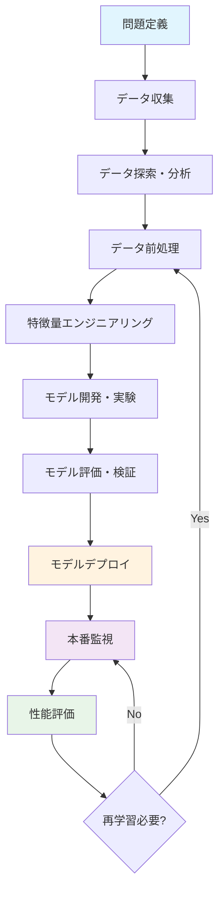
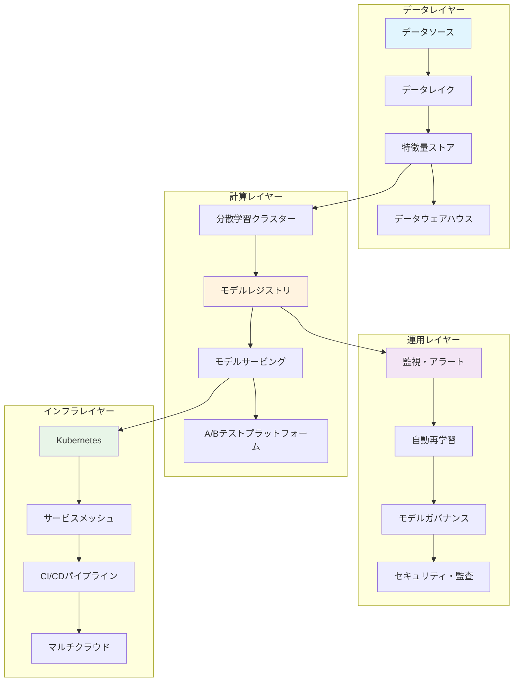
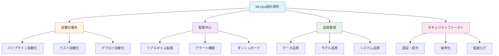

# MLOps：機械学習運用の設計と実装

## 🎯 この章で学ぶこと
- MLOps（Machine Learning Operations）の概念と必要性
- 機械学習プロジェクトのライフサイクル管理
- モデルの継続的統合・継続的デプロイメント（CI/CD）
- 実験管理とモデルバージョニング
- モデル監視とパフォーマンス管理
- データ品質管理とデータパイプライン設計
- MLOpsプラットフォームとツールチェーン
- 機械学習システムのスケーラビリティとセキュリティ

## 🤔 なぜ重要なのか

### AIプロジェクトの現実的な課題
機械学習モデルの開発は、従来のソフトウェア開発とは根本的に異なる課題を抱えています：

**データドリフト問題**
```
実世界のデータは常に変化している
┌─────────────────┐    ┌─────────────────┐
│  学習時のデータ  │ → │  現在のデータ   │
│ 年齢: 20-50歳   │    │ 年齢: 18-65歳   │
│ 地域: 都市部     │    │ 地域: 全国      │
│ 期間: 2020-2021  │    │ 期間: 2023-2024 │
└─────────────────┘    └─────────────────┘
      精度: 95%              精度: 78% ← 性能劣化
```

**実験管理の複雑さ**
```
機械学習実験の要素
├── データ（バージョン、品質、前処理）
├── アルゴリズム（ハイパーパラメータ、アーキテクチャ）
├── 特徴量（エンジニアリング、選択）
├── 学習環境（ライブラリバージョン、ハードウェア）
└── 評価指標（メトリクス、テストデータ）

→ 組み合わせは数千〜数万通り
→ 手動管理は現実的に不可能
```

### 従来の開発との違い

| 観点 | 従来のソフトウェア開発 | 機械学習開発 |
|------|---------------------|-------------|
| **コード** | 確定的な処理ロジック | 確率的な推論ロジック |
| **テスト** | 単体・統合テスト | 統計的有意性テスト |
| **デプロイ** | 一度の正しい動作 | 継続的な性能監視 |
| **品質管理** | バグの有無 | 精度・公平性・説明可能性 |
| **依存関係** | ライブラリとAPI | データ品質と分布 |

### 実際の開発現場での重要性

**Netflix の事例**
```
レコメンドシステムの運用課題
├── 1日あたり数億のリクエスト
├── リアルタイムでの個人化
├── A/Bテストによる継続的改善
├── 多地域での一貫した体験
└── 障害時の自動フェイルオーバー

→ MLOpsなしには実現不可能
```

**金融機関での与信モデル**
```
規制要件とビジネス要件
├── 説明可能性（金融庁の要求）
├── 公平性（差別禁止法への対応）
├── 監査可能性（モデル承認プロセス）
├── リアルタイム判定（顧客体験）
└── リスク管理（不正検知）

→ ガバナンスとMLOpsの統合が必須
```

## 📚 基礎概念の理解

### MLOpsの定義と位置づけ

**MLOpsとは**
MLOps（Machine Learning Operations）は、機械学習システムを本番環境で安定して運用するための実践、原則、ツールの集合体です。

```
MLOps = DevOps + Data Engineering + ML Engineering

┌──────────────────────────────────────────────────────────┐
│                    MLOpsエコシステム                      │
├──────────────────┬─────────────────┬──────────────────────┤
│     DevOps       │ Data Engineering │   ML Engineering     │
├──────────────────┼─────────────────┼──────────────────────┤
│ • CI/CD          │ • データパイプ   │ • 実験管理           │
│ • インフラ管理   │ • データ品質     │ • モデル開発         │
│ • 監視・ログ     │ • データ保存     │ • 特徴量エンジニア   │
│ • セキュリティ   │ • データ処理     │ • ハイパーパラメータ │
└──────────────────┴─────────────────┴──────────────────────┘
```

### 機械学習ライフサイクル

**完全なMLライフサイクル**


**各フェーズでのMLOpsの役割**

1. **データ管理フェーズ**
```
データライフサイクル管理
├── データ収集（自動化・品質チェック）
├── データ保存（バージョニング・メタデータ）
├── データ前処理（パイプライン化・再現性）
└── データ検証（スキーマ・統計的検証）

実装例：
- Apache Airflow（ワークフロー管理）
- DVC（データバージョン管理）
- Great Expectations（データ品質テスト）
```

2. **モデル開発フェーズ**
```
実験管理
├── 実験追跡（メトリクス・パラメータ・アーティファクト）
├── モデルレジストリ（バージョン管理・メタデータ）
├── 再現性確保（環境・シード値・依存関係）
└── コラボレーション（共有・レビュー・承認）

実装例：
- MLflow（実験追跡・モデル管理）
- Weights & Biases（可視化・コラボレーション）
- Kubeflow（Kubernetes上でのML実行）
```

3. **デプロイメントフェーズ**
```
モデルサービング
├── モデルパッケージング（コンテナ化・依存関係）
├── デプロイ戦略（Blue-Green・Canary・A/B）
├── API設計（リクエスト・レスポンス・認証）
└── スケーリング（オートスケール・負荷分散）

実装例：
- Seldon Core（Kubernetesネイティブ）
- TensorFlow Serving（TensorFlowモデル専用）
- Azure ML（マネージドサービス）
```

4. **運用監視フェーズ**
```
継続的監視
├── モデル性能（精度・レイテンシ・スループット）
├── データドリフト（分布変化・統計的検定）
├── システム監視（CPU・メモリ・ネットワーク）
└── ビジネス影響（KPI・ROI・ユーザー体験）

実装例：
- Evidently（ドリフト検出・モデル監視）
- Prometheus + Grafana（メトリクス監視）
- ELK Stack（ログ分析）
```

### MLOpsの成熟度レベル

**Google のMLOps成熟度モデル**

```
レベル0：手動プロセス
┌─────────────────────────────────────┐
│ • 手動でのデータ準備               │
│ • Jupyter Notebookでの実験         │
│ • 手動でのモデルデプロイ           │
│ • 障害時の手動対応                 │
└─────────────────────────────────────┘
↓ 課題：再現性なし、スケールしない

レベル1：ML パイプラインの自動化
┌─────────────────────────────────────┐
│ • 自動化されたデータパイプライン   │
│ • 継続的なモデル学習               │
│ • 自動化されたモデル評価           │
│ • 手動でのモデル検証・デプロイ     │
└─────────────────────────────────────┘
↓ 課題：デプロイまでは手動

レベル2：CI/CD パイプラインの自動化
┌─────────────────────────────────────┐
│ • 自動化されたパイプライン構築     │
│ • 継続的統合・継続的デプロイ       │
│ • 自動化されたテスト・検証         │
│ • モニタリングとアラート           │
└─────────────────────────────────────┘
```

## 💡 実践的な活用

### 実際の開発での使用例

**ケーススタディ1：Eコマースの商品推薦システム**

```
ビジネス要件
├── リアルタイム推薦（100ms以内のレスポンス）
├── 個人化（ユーザーごとの嗜好反映）
├── 多様性（同じカテゴリに偏らない）
└── 収益向上（CTR・CVRの改善）

技術的課題
├── データの多様性（行動・属性・商品・在庫）
├── リアルタイム処理（ストリーミング・低レイテンシ）
├── スケーラビリティ（数百万ユーザー）
└── 継続的改善（A/Bテスト・オンライン学習）
```

**MLOpsソリューション設計**

```python
# 推薦システムMLOpsアーキテクチャ例
"""
データフロー設計
"""

# 1. データ収集・前処理パイプライン
class DataPipeline:
    def __init__(self):
        self.kafka_consumer = KafkaConsumer()  # リアルタイムイベント
        self.feature_store = FeatureStore()    # 特徴量管理
        
    def process_user_event(self, event):
        """ユーザー行動データの処理"""
        # イベントの検証
        validated_event = self.validate_event(event)
        
        # 特徴量エンジニアリング
        features = self.extract_features(validated_event)
        
        # 特徴量ストアに保存
        self.feature_store.store(features)
        
    def validate_event(self, event):
        """データ品質チェック"""
        schema = {
            "user_id": str,
            "item_id": str,
            "action": ["view", "click", "purchase"],
            "timestamp": datetime
        }
        # スキーマ検証・異常値検出
        return validated_event

# 2. モデル学習パイプライン
class ModelTrainingPipeline:
    def __init__(self):
        self.mlflow_client = MLflowClient()
        self.model_registry = ModelRegistry()
        
    def train_collaborative_filtering(self):
        """協調フィルタリングモデルの学習"""
        with mlflow.start_run():
            # データ準備
            train_data = self.prepare_training_data()
            
            # モデル学習
            model = CollaborativeFilteringModel()
            model.fit(train_data)
            
            # 評価
            metrics = self.evaluate_model(model)
            mlflow.log_metrics(metrics)
            
            # モデル登録
            if metrics["precision@10"] > 0.15:
                model_uri = mlflow.sklearn.log_model(model, "cf_model")
                self.model_registry.register_model(model_uri)
                
    def evaluate_model(self, model):
        """オフライン評価"""
        test_data = self.load_test_data()
        
        predictions = model.predict(test_data)
        
        return {
            "precision@10": precision_at_k(test_data, predictions, 10),
            "recall@10": recall_at_k(test_data, predictions, 10),
            "ndcg@10": ndcg_at_k(test_data, predictions, 10),
            "coverage": catalog_coverage(predictions),
            "diversity": intra_list_diversity(predictions)
        }

# 3. モデルサービング
class RecommendationService:
    def __init__(self):
        self.model = self.load_latest_model()
        self.feature_store = FeatureStore()
        self.cache = RedisCache()
        
    def recommend(self, user_id: str, num_items: int = 10):
        """リアルタイム推薦API"""
        try:
            # キャッシュチェック
            cache_key = f"rec:{user_id}:{num_items}"
            cached_result = self.cache.get(cache_key)
            if cached_result:
                return cached_result
                
            # 特徴量取得
            user_features = self.feature_store.get_user_features(user_id)
            item_features = self.feature_store.get_item_features()
            
            # 推薦実行
            recommendations = self.model.predict(
                user_features, item_features, num_items
            )
            
            # 結果をキャッシュ（TTL: 1時間）
            self.cache.set(cache_key, recommendations, ttl=3600)
            
            return recommendations
            
        except Exception as e:
            # ログ出力
            logger.error(f"Recommendation failed for user {user_id}: {e}")
            
            # フォールバック（人気商品推薦）
            return self.get_popular_items(num_items)
            
    def load_latest_model(self):
        """最新の承認済みモデルをロード"""
        model_registry = ModelRegistry()
        latest_model = model_registry.get_latest_version(
            "recommendation_model", stage="Production"
        )
        return mlflow.sklearn.load_model(latest_model.source)

# 4. 監視・アラート
class ModelMonitoring:
    def __init__(self):
        self.metrics_collector = MetricsCollector()
        self.drift_detector = DriftDetector()
        
    def monitor_model_performance(self):
        """モデル性能の監視"""
        # オンライン評価メトリクス収集
        online_metrics = self.collect_online_metrics()
        
        # アラート条件チェック
        if online_metrics["ctr"] < 0.02:  # CTR閾値
            self.send_alert("CTR Low", online_metrics)
            
        if online_metrics["response_time"] > 150:  # レスポンス時間
            self.send_alert("High Latency", online_metrics)
            
    def detect_data_drift(self):
        """データドリフトの検出"""
        # 最新のユーザー行動データ
        current_data = self.get_current_user_behavior()
        
        # 学習時データとの比較
        reference_data = self.get_reference_data()
        
        # 統計的検定
        drift_score = self.drift_detector.detect_drift(
            reference_data, current_data
        )
        
        if drift_score > 0.1:  # ドリフト閾値
            self.trigger_retraining()
            
    def collect_online_metrics(self):
        """オンライン評価メトリクスの収集"""
        return {
            "ctr": self.calculate_ctr(),           # クリック率
            "conversion_rate": self.calculate_cvr(), # コンバージョン率
            "response_time": self.get_avg_response_time(),
            "cache_hit_rate": self.get_cache_hit_rate(),
            "error_rate": self.get_error_rate()
        }
```

**A/Bテスト統合**

```python
class ABTestingFramework:
    def __init__(self):
        self.experiment_manager = ExperimentManager()
        
    def create_recommendation_experiment(self):
        """推薦アルゴリズムのA/Bテスト設定"""
        experiment = {
            "name": "collaborative_filtering_vs_deep_learning",
            "variants": [
                {
                    "name": "control",
                    "model": "collaborative_filtering_v1.2",
                    "traffic_percentage": 50
                },
                {
                    "name": "treatment", 
                    "model": "deep_learning_v2.0",
                    "traffic_percentage": 50
                }
            ],
            "metrics": [
                "click_through_rate",
                "conversion_rate", 
                "revenue_per_user",
                "user_engagement_time"
            ],
            "duration_days": 14,
            "minimum_sample_size": 10000
        }
        
        return self.experiment_manager.create_experiment(experiment)
        
    def analyze_experiment_results(self, experiment_id):
        """実験結果の統計的分析"""
        results = self.experiment_manager.get_results(experiment_id)
        
        analysis = {
            "statistical_significance": {},
            "practical_significance": {},
            "recommendation": ""
        }
        
        for metric in results["metrics"]:
            # 統計的有意性テスト（t検定）
            p_value = stats.ttest_ind(
                results["control"][metric],
                results["treatment"][metric]
            ).pvalue
            
            analysis["statistical_significance"][metric] = {
                "p_value": p_value,
                "significant": p_value < 0.05
            }
            
            # 実用的有意性（効果サイズ）
            effect_size = self.calculate_effect_size(
                results["control"][metric],
                results["treatment"][metric]
            )
            
            analysis["practical_significance"][metric] = {
                "effect_size": effect_size,
                "meaningful": abs(effect_size) > 0.2
            }
        
        # 総合的な推薦
        if self.should_deploy_treatment(analysis):
            analysis["recommendation"] = "Deploy treatment to production"
        else:
            analysis["recommendation"] = "Keep current model"
            
        return analysis
```

### ハンズオン：小規模MLOpsシステムの構築

**前提条件**
- Docker, Docker Compose
- Python 3.8+
- 基本的なML知識

**目標**
シンプルな画像分類システムでMLOpsパイプラインを実装

```yaml
# docker-compose.yml
version: '3.8'
services:
  mlflow:
    image: mlflow/mlflow:latest
    ports:
      - "5000:5000"
    volumes:
      - ./mlruns:/mlruns
    command: mlflow server --host 0.0.0.0 --port 5000
    
  minio:
    image: minio/minio:latest
    ports:
      - "9000:9000"
      - "9001:9001"
    environment:
      MINIO_ROOT_USER: mlflow
      MINIO_ROOT_PASSWORD: mlflowpassword
    command: server /data --console-address ":9001"
    
  model-service:
    build: .
    ports:
      - "8080:8080"
    depends_on:
      - mlflow
      - minio
    environment:
      MLFLOW_TRACKING_URI: http://mlflow:5000
```

**実装手順**

1. **実験管理システムの構築**
```python
# train.py
import mlflow
import mlflow.tensorflow
from tensorflow import keras
import numpy as np

def train_image_classifier():
    # MLflow実験開始
    with mlflow.start_run():
        # ハイパーパラメータ
        params = {
            "epochs": 10,
            "batch_size": 32,
            "learning_rate": 0.001,
            "optimizer": "adam"
        }
        mlflow.log_params(params)
        
        # データ準備
        (x_train, y_train), (x_test, y_test) = keras.datasets.cifar10.load_data()
        x_train = x_train.astype('float32') / 255.0
        x_test = x_test.astype('float32') / 255.0
        
        # モデル構築
        model = keras.Sequential([
            keras.layers.Conv2D(32, 3, activation='relu', input_shape=(32, 32, 3)),
            keras.layers.MaxPooling2D(),
            keras.layers.Conv2D(64, 3, activation='relu'),
            keras.layers.MaxPooling2D(),
            keras.layers.Flatten(),
            keras.layers.Dense(64, activation='relu'),
            keras.layers.Dense(10, activation='softmax')
        ])
        
        # コンパイル
        model.compile(
            optimizer=params["optimizer"],
            loss='sparse_categorical_crossentropy',
            metrics=['accuracy']
        )
        
        # 学習
        history = model.fit(
            x_train, y_train,
            epochs=params["epochs"],
            batch_size=params["batch_size"],
            validation_data=(x_test, y_test),
            verbose=1
        )
        
        # メトリクスログ
        final_accuracy = history.history['val_accuracy'][-1]
        final_loss = history.history['val_loss'][-1]
        
        mlflow.log_metric("final_accuracy", final_accuracy)
        mlflow.log_metric("final_loss", final_loss)
        
        # モデル保存
        mlflow.tensorflow.log_model(
            model, 
            "model",
            registered_model_name="cifar10_classifier"
        )
        
        return model, final_accuracy

if __name__ == "__main__":
    train_image_classifier()
```

2. **モデルサービングAPI**
```python
# serve.py
from flask import Flask, request, jsonify
import mlflow.tensorflow
import numpy as np
from PIL import Image
import io

app = Flask(__name__)

# 最新モデルのロード
model = mlflow.tensorflow.load_model(
    "models:/cifar10_classifier/Production"
)

CIFAR10_CLASSES = [
    'airplane', 'automobile', 'bird', 'cat', 'deer',
    'dog', 'frog', 'horse', 'ship', 'truck'
]

@app.route('/predict', methods=['POST'])
def predict():
    try:
        # 画像データの取得
        file = request.files['image']
        image = Image.open(io.BytesIO(file.read()))
        
        # 前処理
        image = image.resize((32, 32))
        image_array = np.array(image).astype('float32') / 255.0
        image_array = np.expand_dims(image_array, axis=0)
        
        # 予測
        predictions = model.predict(image_array)
        predicted_class = np.argmax(predictions[0])
        confidence = float(predictions[0][predicted_class])
        
        return jsonify({
            'predicted_class': CIFAR10_CLASSES[predicted_class],
            'confidence': confidence,
            'all_predictions': {
                CIFAR10_CLASSES[i]: float(predictions[0][i])
                for i in range(len(CIFAR10_CLASSES))
            }
        })
        
    except Exception as e:
        return jsonify({'error': str(e)}), 500

@app.route('/health', methods=['GET'])
def health():
    return jsonify({'status': 'healthy'})

if __name__ == '__main__':
    app.run(host='0.0.0.0', port=8080)
```

3. **監視システム**
```python
# monitor.py
import time
import requests
import psutil
import logging
from prometheus_client import Counter, Histogram, Gauge, start_http_server

# Prometheusメトリクス定義
prediction_counter = Counter('predictions_total', 'Total predictions made')
prediction_latency = Histogram('prediction_duration_seconds', 'Prediction latency')
model_accuracy = Gauge('model_accuracy', 'Current model accuracy')
system_cpu = Gauge('system_cpu_percent', 'CPU usage percentage')
system_memory = Gauge('system_memory_percent', 'Memory usage percentage')

class ModelMonitor:
    def __init__(self, model_endpoint="http://localhost:8080"):
        self.model_endpoint = model_endpoint
        self.logger = logging.getLogger(__name__)
        
    def monitor_predictions(self):
        """予測APIの監視"""
        while True:
            try:
                start_time = time.time()
                
                # ヘルスチェック
                response = requests.get(f"{self.model_endpoint}/health")
                
                if response.status_code == 200:
                    latency = time.time() - start_time
                    prediction_latency.observe(latency)
                    prediction_counter.inc()
                else:
                    self.logger.error(f"Health check failed: {response.status_code}")
                    
            except Exception as e:
                self.logger.error(f"Monitoring error: {e}")
                
            time.sleep(10)  # 10秒間隔
            
    def monitor_system_resources(self):
        """システムリソースの監視"""
        while True:
            # CPU使用率
            cpu_percent = psutil.cpu_percent(interval=1)
            system_cpu.set(cpu_percent)
            
            # メモリ使用率
            memory = psutil.virtual_memory()
            system_memory.set(memory.percent)
            
            time.sleep(5)

if __name__ == "__main__":
    # Prometheusメトリクスサーバー開始
    start_http_server(8000)
    
    monitor = ModelMonitor()
    
    # 監視開始（別スレッドで実行）
    import threading
    
    prediction_thread = threading.Thread(target=monitor.monitor_predictions)
    system_thread = threading.Thread(target=monitor.monitor_system_resources)
    
    prediction_thread.start()
    system_thread.start()
    
    # メインスレッドは監視継続
    prediction_thread.join()
    system_thread.join()
```

**実行手順**

```bash
# 1. 環境セットアップ
docker-compose up -d

# 2. モデル学習
python train.py

# 3. モデルサービング開始
python serve.py &

# 4. 監視システム開始
python monitor.py &

# 5. テスト予測
curl -X POST -F "image=@test_image.jpg" http://localhost:8080/predict
```

**期待される結果**
- MLflow UI（http://localhost:5000）で実験管理
- Prometheus メトリクス（http://localhost:8000）でシステム監視
- API経由での画像分類予測
- リアルタイムでの性能指標収集

**トラブルシューティング**

```python
# デバッグ用のヘルパー関数
def diagnose_system():
    """システム診断"""
    checks = {
        "mlflow_connection": check_mlflow_connection(),
        "model_loading": check_model_loading(),
        "api_health": check_api_health(),
        "system_resources": check_system_resources()
    }
    
    for check_name, result in checks.items():
        status = "✅ PASS" if result["success"] else "❌ FAIL"
        print(f"{check_name}: {status} - {result['message']}")
        
    return all(check["success"] for check in checks.values())

def check_mlflow_connection():
    """MLflow接続確認"""
    try:
        import mlflow
        mlflow.set_tracking_uri("http://localhost:5000")
        experiments = mlflow.search_experiments()
        return {"success": True, "message": f"Found {len(experiments)} experiments"}
    except Exception as e:
        return {"success": False, "message": str(e)}

def check_model_loading():
    """モデルロード確認"""
    try:
        model = mlflow.tensorflow.load_model("models:/cifar10_classifier/Latest")
        return {"success": True, "message": "Model loaded successfully"}
    except Exception as e:
        return {"success": False, "message": str(e)}
```

このハンズオンを通じて、小規模ながら完全なMLOpsパイプラインの構築経験を積むことができます。

## 🔍 深掘り：プロの視点

### 設計における考慮点

**エンタープライズ級MLOpsアーキテクチャ設計**



**大規模システムでの技術的課題と解決策**

1. **スケーラビリティの課題**

```python
"""
大規模MLシステムの分散アーキテクチャ設計例
"""

class DistributedMLPlatform:
    def __init__(self):
        self.feature_store = DistributedFeatureStore()
        self.model_registry = ModelRegistry()
        self.serving_cluster = ModelServingCluster()
        self.monitoring = DistributedMonitoring()
        
    def handle_high_throughput_inference(self):
        """高スループット推論の実装"""
        
        # 1. モデルシャーディング
        model_shards = self.create_model_shards()
        
        # 2. 負荷分散設定
        load_balancer = LoadBalancer(
            strategy="least_connections",
            health_check_interval=5,
            failover_enabled=True
        )
        
        # 3. キャッシュ戦略
        cache_config = {
            "l1_cache": {  # インメモリキャッシュ
                "type": "redis",
                "ttl": 300,  # 5分
                "max_memory": "2GB"
            },
            "l2_cache": {  # 分散キャッシュ
                "type": "memcached",
                "ttl": 3600,  # 1時間
                "cluster_size": 3
            }
        }
        
        # 4. バッチング最適化
        batch_config = {
            "max_batch_size": 64,
            "max_wait_time": 10,  # ms
            "padding_strategy": "dynamic"
        }
        
        return InferenceService(
            model_shards=model_shards,
            load_balancer=load_balancer,
            cache_config=cache_config,
            batch_config=batch_config
        )
        
    def create_model_shards(self):
        """モデルシャーディング戦略"""
        
        # ユーザーベースシャーディング
        def user_based_sharding(user_id):
            shard_id = hash(user_id) % self.num_shards
            return f"shard_{shard_id}"
            
        # 地理的シャーディング
        def geo_based_sharding(location):
            geo_mapping = {
                "us-east": "shard_us_east",
                "us-west": "shard_us_west", 
                "eu": "shard_eu",
                "asia": "shard_asia"
            }
            return geo_mapping.get(location, "shard_default")
            
        return {
            "user_based": user_based_sharding,
            "geo_based": geo_based_sharding
        }

class ModelServingOptimization:
    """モデルサービング最適化技術"""
    
    def implement_model_quantization(self, model):
        """モデル量子化による高速化"""
        
        # INT8量子化
        quantized_model = self.quantize_to_int8(model)
        
        # 動的量子化
        dynamic_quantized = self.dynamic_quantization(model)
        
        # カスタム量子化
        custom_quantized = self.custom_quantization(
            model,
            bit_width=4,  # 4-bit量子化
            calibration_dataset=self.get_calibration_data()
        )
        
        # 性能比較
        benchmark_results = self.benchmark_models({
            "original": model,
            "int8": quantized_model,
            "dynamic": dynamic_quantized,
            "custom": custom_quantized
        })
        
        return self.select_best_model(benchmark_results)
        
    def implement_model_distillation(self, teacher_model, student_architecture):
        """知識蒸留による軽量化"""
        
        distillation_config = {
            "temperature": 4.0,
            "alpha": 0.7,  # 蒸留損失の重み
            "beta": 0.3,   # タスク損失の重み
            "epochs": 50
        }
        
        student_model = self.train_student_model(
            teacher_model=teacher_model,
            student_architecture=student_architecture,
            config=distillation_config
        )
        
        # 性能検証
        validation_results = self.validate_distilled_model(
            teacher_model, student_model
        )
        
        return student_model, validation_results
        
    def implement_edge_deployment(self, model):
        """エッジデバイス向け最適化"""
        
        # TensorRT最適化
        tensorrt_model = self.optimize_with_tensorrt(model)
        
        # ONNX変換
        onnx_model = self.convert_to_onnx(model)
        
        # Core ML変換（iOS向け）
        coreml_model = self.convert_to_coreml(model)
        
        # TensorFlow Lite変換
        tflite_model = self.convert_to_tflite(model)
        
        return {
            "tensorrt": tensorrt_model,
            "onnx": onnx_model,
            "coreml": coreml_model,
            "tflite": tflite_model
        }
```

2. **データドリフト対応の高度な実装**

```python
class AdvancedDriftDetection:
    """高度なドリフト検出システム"""
    
    def __init__(self):
        self.statistical_tests = StatisticalTestSuite()
        self.ml_detectors = MLBasedDetectors()
        self.domain_detectors = DomainSpecificDetectors()
        
    def multi_layered_drift_detection(self, reference_data, current_data):
        """多層ドリフト検出"""
        
        drift_signals = {}
        
        # 1. 統計的検定
        drift_signals["statistical"] = self.statistical_drift_detection(
            reference_data, current_data
        )
        
        # 2. 機械学習ベース検出
        drift_signals["ml_based"] = self.ml_drift_detection(
            reference_data, current_data
        )
        
        # 3. ドメイン固有検出
        drift_signals["domain_specific"] = self.domain_drift_detection(
            reference_data, current_data
        )
        
        # 4. アンサンブル判定
        final_decision = self.ensemble_drift_decision(drift_signals)
        
        return final_decision
        
    def statistical_drift_detection(self, ref_data, cur_data):
        """統計的ドリフト検出"""
        
        results = {}
        
        for feature in ref_data.columns:
            # Kolmogorov-Smirnov検定
            ks_stat, ks_p = stats.ks_2samp(ref_data[feature], cur_data[feature])
            
            # Mann-Whitney U検定
            mw_stat, mw_p = stats.mannwhitneyu(ref_data[feature], cur_data[feature])
            
            # Population Stability Index
            psi = self.calculate_psi(ref_data[feature], cur_data[feature])
            
            # Jensen-Shannon divergence
            js_div = self.calculate_js_divergence(ref_data[feature], cur_data[feature])
            
            results[feature] = {
                "ks_test": {"statistic": ks_stat, "p_value": ks_p},
                "mw_test": {"statistic": mw_stat, "p_value": mw_p},
                "psi": psi,
                "js_divergence": js_div,
                "drift_detected": any([
                    ks_p < 0.05,  # 有意水準5%
                    psi > 0.1,    # PSI閾値
                    js_div > 0.1  # JS距離閾値
                ])
            }
            
        return results
        
    def calculate_psi(self, reference, current, bins=10):
        """Population Stability Index計算"""
        
        # ビン分割
        _, bin_edges = np.histogram(reference, bins=bins)
        
        # 各ビンの割合計算
        ref_counts, _ = np.histogram(reference, bins=bin_edges)
        cur_counts, _ = np.histogram(current, bins=bin_edges)
        
        ref_props = ref_counts / len(reference)
        cur_props = cur_counts / len(current)
        
        # PSI計算（ゼロ除算回避）
        ref_props = np.where(ref_props == 0, 0.0001, ref_props)
        cur_props = np.where(cur_props == 0, 0.0001, cur_props)
        
        psi = np.sum((cur_props - ref_props) * np.log(cur_props / ref_props))
        
        return psi
        
    def ml_drift_detection(self, ref_data, cur_data):
        """機械学習ベースドリフト検出"""
        
        # データにラベル付与（参照=0, 現在=1）
        ref_labeled = ref_data.copy()
        ref_labeled['source'] = 0
        
        cur_labeled = cur_data.copy()
        cur_labeled['source'] = 1
        
        combined_data = pd.concat([ref_labeled, cur_labeled])
        
        # 特徴量とターゲット分離
        X = combined_data.drop('source', axis=1)
        y = combined_data['source']
        
        # 分類器で学習
        classifier = RandomForestClassifier(n_estimators=100, random_state=42)
        
        # 交差検証でAUC評価
        cv_scores = cross_val_score(classifier, X, y, cv=5, scoring='roc_auc')
        auc_score = np.mean(cv_scores)
        
        # AUCが0.5に近いほどドリフトなし、1.0に近いほどドリフトあり
        drift_probability = (auc_score - 0.5) * 2
        
        return {
            "auc_score": auc_score,
            "drift_probability": drift_probability,
            "drift_detected": auc_score > 0.75  # 閾値
        }
        
    def implement_adaptive_thresholds(self):
        """適応的閾値設定"""
        
        class AdaptiveThreshold:
            def __init__(self, initial_threshold=0.1, learning_rate=0.01):
                self.threshold = initial_threshold
                self.learning_rate = learning_rate
                self.false_positive_count = 0
                self.true_positive_count = 0
                
            def update_threshold(self, drift_detected, ground_truth):
                """閾値の動的調整"""
                
                if drift_detected and not ground_truth:
                    # 偽陽性：閾値を上げる
                    self.threshold *= (1 + self.learning_rate)
                    self.false_positive_count += 1
                    
                elif not drift_detected and ground_truth:
                    # 偽陰性：閾値を下げる
                    self.threshold *= (1 - self.learning_rate)
                    
                elif drift_detected and ground_truth:
                    # 真陽性：閾値維持
                    self.true_positive_count += 1
                    
                # 閾値の範囲制限
                self.threshold = np.clip(self.threshold, 0.01, 0.5)
                
            def get_precision_recall(self):
                """精度・再現率の計算"""
                total_positives = self.true_positive_count + self.false_positive_count
                
                if total_positives == 0:
                    return 0, 0
                    
                precision = self.true_positive_count / total_positives
                recall = self.true_positive_count / (self.true_positive_count + self.false_negative_count)
                
                return precision, recall
                
        return AdaptiveThreshold()
```

3. **モデルガバナンスとコンプライアンス**

```python
class ModelGovernanceFramework:
    """モデルガバナンスフレームワーク"""
    
    def __init__(self):
        self.audit_logger = AuditLogger()
        self.compliance_checker = ComplianceChecker()
        self.risk_assessor = RiskAssessor()
        
    def implement_model_lineage_tracking(self):
        """モデル系譜追跡システム"""
        
        class ModelLineage:
            def __init__(self):
                self.lineage_graph = nx.DiGraph()
                
            def track_data_lineage(self, model_id, data_sources):
                """データ系譜の追跡"""
                
                for source in data_sources:
                    # データソースからモデルへのエッジ
                    self.lineage_graph.add_edge(
                        source["id"], 
                        model_id,
                        relationship="data_input",
                        timestamp=datetime.now(),
                        schema_version=source["schema_version"],
                        quality_score=source["quality_score"]
                    )
                    
            def track_model_inheritance(self, parent_model, child_model):
                """モデル継承の追跡"""
                
                self.lineage_graph.add_edge(
                    parent_model["id"],
                    child_model["id"],
                    relationship="model_inheritance",
                    inheritance_type=child_model["inheritance_type"],  # fine_tuning, transfer_learning, etc.
                    performance_delta=child_model["performance"] - parent_model["performance"]
                )
                
            def analyze_impact_propagation(self, changed_component):
                """変更影響の伝播分析"""
                
                # 下流への影響分析
                downstream_nodes = list(nx.descendants(self.lineage_graph, changed_component))
                
                impact_analysis = {}
                for node in downstream_nodes:
                    path = nx.shortest_path(self.lineage_graph, changed_component, node)
                    impact_score = self.calculate_impact_score(path)
                    
                    impact_analysis[node] = {
                        "impact_score": impact_score,
                        "propagation_path": path,
                        "recommendation": self.get_impact_recommendation(impact_score)
                    }
                    
                return impact_analysis
                
    def implement_explainable_ai_framework(self):
        """説明可能AI（XAI）フレームワーク"""
        
        class ExplainabilityFramework:
            def __init__(self):
                self.explanation_methods = {
                    "local": ["lime", "shap", "anchor"],
                    "global": ["permutation_importance", "partial_dependence", "surrogate_model"],
                    "counterfactual": ["counterfactual_explanations", "adversarial_examples"]
                }
                
            def generate_model_explanation(self, model, data, explanation_type="comprehensive"):
                """包括的モデル説明の生成"""
                
                explanations = {}
                
                if explanation_type in ["local", "comprehensive"]:
                    # SHAP説明
                    explanations["shap"] = self.generate_shap_explanations(model, data)
                    
                    # LIME説明
                    explanations["lime"] = self.generate_lime_explanations(model, data)
                    
                if explanation_type in ["global", "comprehensive"]:
                    # 特徴量重要度
                    explanations["feature_importance"] = self.calculate_feature_importance(model, data)
                    
                    # 部分依存プロット
                    explanations["partial_dependence"] = self.generate_pdp(model, data)
                    
                # 説明の一貫性チェック
                consistency_score = self.check_explanation_consistency(explanations)
                
                return {
                    "explanations": explanations,
                    "consistency_score": consistency_score,
                    "recommendation": self.get_explanation_recommendation(consistency_score)
                }
                
            def generate_regulatory_report(self, model, explanations):
                """規制対応レポート生成"""
                
                report = {
                    "model_metadata": {
                        "model_id": model.id,
                        "model_type": model.type,
                        "training_date": model.training_date,
                        "data_sources": model.data_sources,
                        "performance_metrics": model.performance_metrics
                    },
                    "fairness_analysis": self.analyze_fairness(model),
                    "bias_detection": self.detect_bias(model),
                    "explanation_summary": self.summarize_explanations(explanations),
                    "risk_assessment": self.assess_model_risk(model),
                    "compliance_status": self.check_compliance(model)
                }
                
                return report
                
    def implement_continuous_compliance_monitoring(self):
        """継続的コンプライアンス監視"""
        
        class ComplianceMonitor:
            def __init__(self):
                self.compliance_rules = self.load_compliance_rules()
                self.monitoring_schedule = self.setup_monitoring_schedule()
                
            def monitor_data_privacy(self, model, data_access_logs):
                """データプライバシー監視"""
                
                privacy_violations = []
                
                # PII（個人識別情報）の使用チェック
                pii_usage = self.detect_pii_usage(data_access_logs)
                if pii_usage:
                    privacy_violations.append({
                        "type": "PII_USAGE",
                        "severity": "HIGH",
                        "details": pii_usage
                    })
                    
                # データ最小化原則のチェック
                data_minimization_score = self.check_data_minimization(model)
                if data_minimization_score < 0.7:
                    privacy_violations.append({
                        "type": "DATA_MINIMIZATION",
                        "severity": "MEDIUM",
                        "score": data_minimization_score
                    })
                    
                return privacy_violations
                
            def monitor_algorithmic_fairness(self, model, predictions, protected_attributes):
                """アルゴリズムの公平性監視"""
                
                fairness_metrics = {}
                
                # 統計的パリティ
                fairness_metrics["statistical_parity"] = self.calculate_statistical_parity(
                    predictions, protected_attributes
                )
                
                # 均等化オッズ
                fairness_metrics["equalized_odds"] = self.calculate_equalized_odds(
                    predictions, protected_attributes
                )
                
                # キャリブレーション
                fairness_metrics["calibration"] = self.calculate_calibration(
                    predictions, protected_attributes
                )
                
                # 公平性スコアの総合評価
                overall_fairness = self.calculate_overall_fairness(fairness_metrics)
                
                return {
                    "fairness_metrics": fairness_metrics,
                    "overall_score": overall_fairness,
                    "violations": self.detect_fairness_violations(fairness_metrics)
                }
```

### パフォーマンスへの影響

**大規模システムでの性能最適化戦略**

```python
class PerformanceOptimizationStrategy:
    """MLOps性能最適化戦略"""
    
    def __init__(self):
        self.profiler = MLPerformanceProfiler()
        self.optimizer = SystemOptimizer()
        
    def optimize_inference_pipeline(self):
        """推論パイプライン最適化"""
        
        optimization_techniques = {
            # 1. バッチング最適化
            "dynamic_batching": {
                "description": "リクエスト到着パターンに応じた動的バッチサイズ調整",
                "implementation": self.implement_dynamic_batching(),
                "expected_improvement": "30-50% レイテンシ削減"
            },
            
            # 2. モデル並列化
            "model_parallelism": {
                "description": "大型モデルの分散実行",
                "implementation": self.implement_model_parallelism(),
                "expected_improvement": "2-4x スループット向上"
            },
            
            # 3. 計算グラフ最適化
            "graph_optimization": {
                "description": "推論グラフの最適化・融合",
                "implementation": self.implement_graph_optimization(),
                "expected_improvement": "20-30% 計算時間削減"
            },
            
            # 4. メモリ最適化
            "memory_optimization": {
                "description": "メモリ使用量の最適化",
                "implementation": self.implement_memory_optimization(),
                "expected_improvement": "40-60% メモリ使用量削減"
            }
        }
        
        return optimization_techniques
        
    def implement_dynamic_batching(self):
        """動的バッチング実装"""
        
        class DynamicBatcher:
            def __init__(self, min_batch_size=1, max_batch_size=64, max_wait_time=10):
                self.min_batch_size = min_batch_size
                self.max_batch_size = max_batch_size
                self.max_wait_time = max_wait_time  # ms
                self.request_queue = asyncio.Queue()
                self.arrival_times = deque(maxlen=1000)  # 到着時間の履歴
                
            async def adaptive_batching(self):
                """適応的バッチング"""
                
                while True:
                    batch = []
                    start_time = time.time()
                    
                    # 最初のリクエスト待機
                    first_request = await self.request_queue.get()
                    batch.append(first_request)
                    
                    # 動的バッチサイズ決定
                    optimal_batch_size = self.predict_optimal_batch_size()
                    
                    # 追加リクエストの収集
                    while len(batch) < optimal_batch_size:
                        try:
                            # 動的待機時間
                            wait_time = self.calculate_dynamic_wait_time()
                            
                            request = await asyncio.wait_for(
                                self.request_queue.get(), 
                                timeout=wait_time/1000
                            )
                            batch.append(request)
                            
                        except asyncio.TimeoutError:
                            break
                            
                    # バッチ処理実行
                    await self.process_batch(batch)
                    
            def predict_optimal_batch_size(self):
                """最適バッチサイズの予測"""
                
                # 到着率の分析
                if len(self.arrival_times) < 10:
                    return self.min_batch_size
                    
                recent_arrival_rate = self.calculate_arrival_rate()
                
                # スループット予測モデル
                predicted_throughput = self.throughput_model.predict(recent_arrival_rate)
                
                # 最適バッチサイズの計算
                optimal_size = min(
                    self.max_batch_size,
                    max(self.min_batch_size, int(predicted_throughput * 0.1))
                )
                
                return optimal_size
                
    def implement_model_serving_optimization(self):
        """モデルサービング最適化"""
        
        class OptimizedModelServer:
            def __init__(self):
                self.model_cache = ModelCache()
                self.request_router = RequestRouter()
                self.resource_manager = ResourceManager()
                
            def setup_multi_model_serving(self):
                """マルチモデルサービング設定"""
                
                serving_config = {
                    "model_routing": {
                        "strategy": "model_variant_routing",
                        "models": {
                            "lightweight": {
                                "model_path": "models/lightweight_v1",
                                "resource_requirement": "low",
                                "latency_target": "< 10ms"
                            },
                            "accurate": {
                                "model_path": "models/accurate_v1", 
                                "resource_requirement": "high",
                                "latency_target": "< 100ms"
                            },
                            "balanced": {
                                "model_path": "models/balanced_v1",
                                "resource_requirement": "medium", 
                                "latency_target": "< 50ms"
                            }
                        }
                    },
                    "auto_scaling": {
                        "metrics": ["cpu_utilization", "memory_usage", "request_rate"],
                        "thresholds": {
                            "scale_up": {"cpu": 70, "memory": 80, "requests": 100},
                            "scale_down": {"cpu": 30, "memory": 40, "requests": 20}
                        }
                    },
                    "load_balancing": {
                        "algorithm": "weighted_round_robin",
                        "health_checks": True,
                        "circuit_breaker": {
                            "failure_threshold": 5,
                            "timeout": 30,
                            "recovery_time": 60
                        }
                    }
                }
                
                return serving_config
                
            def implement_model_warming(self):
                """モデルウォーミング実装"""
                
                class ModelWarmer:
                    def __init__(self, model_server):
                        self.model_server = model_server
                        self.warming_data = self.prepare_warming_data()
                        
                    def warm_up_model(self, model_id):
                        """モデルのウォームアップ"""
                        
                        warming_requests = [
                            self.create_warming_request(sample) 
                            for sample in self.warming_data
                        ]
                        
                        # 並列ウォーミング実行
                        with ThreadPoolExecutor(max_workers=4) as executor:
                            futures = [
                                executor.submit(self.model_server.predict, req)
                                for req in warming_requests
                            ]
                            
                            # ウォーミング完了待機
                            for future in as_completed(futures):
                                try:
                                    result = future.result(timeout=10)
                                except Exception as e:
                                    logger.warning(f"Warming request failed: {e}")
                                    
                        logger.info(f"Model {model_id} warming completed")
```

### セキュリティ考慮事項

**MLセキュリティのベストプラクティス**

```python
class MLSecurityFramework:
    """機械学習セキュリティフレームワーク"""
    
    def __init__(self):
        self.threat_detector = ThreatDetector()
        self.privacy_protector = PrivacyProtector()
        self.access_controller = AccessController()
        
    def implement_adversarial_robustness(self):
        """敵対的攻撃に対する堅牢性"""
        
        class AdversarialDefense:
            def __init__(self):
                self.detection_methods = ["statistical_tests", "neural_networks", "ensemble"]
                self.mitigation_strategies = ["input_preprocessing", "adversarial_training", "certified_defense"]
                
            def detect_adversarial_inputs(self, inputs):
                """敵対的入力の検出"""
                
                detection_results = {}
                
                # 統計的検出
                detection_results["statistical"] = self.statistical_anomaly_detection(inputs)
                
                # ニューラルネットワーク検出器
                detection_results["neural"] = self.neural_detector.predict(inputs)
                
                # アンサンブル検出
                detection_results["ensemble"] = self.ensemble_detection(inputs)
                
                # 総合判定
                is_adversarial = self.aggregate_detection_results(detection_results)
                
                return {
                    "is_adversarial": is_adversarial,
                    "confidence": self.calculate_detection_confidence(detection_results),
                    "details": detection_results
                }
                
            def implement_input_sanitization(self, inputs):
                """入力サニタイゼーション"""
                
                sanitization_methods = {
                    "gaussian_noise": self.add_gaussian_noise,
                    "median_filter": self.apply_median_filter,
                    "bit_depth_reduction": self.reduce_bit_depth,
                    "jpeg_compression": self.apply_jpeg_compression
                }
                
                sanitized_inputs = inputs.copy()
                
                for method_name, method_func in sanitization_methods.items():
                    sanitized_inputs = method_func(sanitized_inputs)
                    
                return sanitized_inputs
                
    def implement_differential_privacy(self):
        """差分プライバシーの実装"""
        
        class DifferentialPrivacyManager:
            def __init__(self, epsilon=1.0, delta=1e-5):
                self.epsilon = epsilon  # プライバシー予算
                self.delta = delta      # 失敗確率
                self.privacy_accountant = PrivacyAccountant()
                
            def train_with_dp(self, model, train_data, privacy_budget):
                """差分プライバシー学習"""
                
                # DP-SGD実装
                dp_optimizer = DPOptimizerWrapper(
                    optimizer=tf.keras.optimizers.Adam(),
                    l2_norm_clip=1.0,
                    noise_multiplier=1.1,
                    num_microbatches=1
                )
                
                # プライバシー会計
                privacy_spent = self.privacy_accountant.get_privacy_spent(
                    epochs=training_config["epochs"],
                    batch_size=training_config["batch_size"],
                    noise_multiplier=1.1
                )
                
                if privacy_spent.epsilon > privacy_budget:
                    raise ValueError("Privacy budget exceeded")
                    
                # DP学習実行
                model.compile(optimizer=dp_optimizer, loss='categorical_crossentropy')
                
                history = model.fit(
                    train_data,
                    epochs=training_config["epochs"],
                    validation_data=validation_data
                )
                
                return model, privacy_spent
                
            def generate_synthetic_data(self, original_data, synthesis_method="dp_gan"):
                """差分プライバシー合成データ生成"""
                
                if synthesis_method == "dp_gan":
                    synthetic_data = self.dp_gan_synthesis(original_data)
                elif synthesis_method == "dp_vae":
                    synthetic_data = self.dp_vae_synthesis(original_data)
                else:
                    raise ValueError("Unknown synthesis method")
                    
                # プライバシー保証の検証
                privacy_guarantee = self.verify_privacy_guarantee(
                    original_data, synthetic_data
                )
                
                return synthetic_data, privacy_guarantee
                
    def implement_secure_model_deployment(self):
        """安全なモデルデプロイメント"""
        
        class SecureDeployment:
            def __init__(self):
                self.encryption_manager = EncryptionManager()
                self.attestation_service = AttestationService()
                
            def deploy_with_tee(self, model):
                """TEE（Trusted Execution Environment）を使用したデプロイ"""
                
                tee_config = {
                    "enclave_type": "intel_sgx",
                    "attestation_required": True,
                    "sealed_storage": True,
                    "secure_communication": True
                }
                
                # モデルの暗号化
                encrypted_model = self.encryption_manager.encrypt_model(model)
                
                # エンクレーブ作成
                enclave = self.create_enclave(tee_config)
                
                # 暗号化モデルの安全な転送
                secure_transfer = self.secure_model_transfer(encrypted_model, enclave)
                
                # アテステーション実行
                attestation_result = self.attestation_service.attest_enclave(enclave)
                
                if not attestation_result.verified:
                    raise SecurityError("Enclave attestation failed")
                    
                return {
                    "enclave_id": enclave.id,
                    "attestation_evidence": attestation_result.evidence,
                    "deployment_status": "secure_deployed"
                }
                
            def implement_homomorphic_inference(self, model):
                """準同型暗号推論の実装"""
                
                # 準同型暗号ライブラリ設定
                crypto_context = self.setup_crypto_context()
                
                # モデルパラメータの暗号化
                encrypted_weights = self.encrypt_model_weights(model, crypto_context)
                
                def encrypted_inference(encrypted_input):
                    """暗号化データでの推論"""
                    
                    # 準同型演算での推論実行
                    encrypted_result = self.homomorphic_forward_pass(
                        encrypted_input, encrypted_weights
                    )
                    
                    return encrypted_result
                    
                return encrypted_inference
```

### 技術選択の判断基準

**MLOpsツール選定のフレームワーク**

| 評価軸 | 考慮事項 | 評価指標 |
|--------|---------|----------|
| **技術的適合性** | モデル種別、スケール要件、性能要件 | 対応ML框架、処理能力、レイテンシ |
| **運用性** | 学習コスト、保守性、監視機能 | 習得期間、運用工数、可観測性 |
| **統合性** | 既存システム、CI/CD、クラウド | API互換性、プラグイン、移植性 |
| **コスト** | ライセンス、インフラ、人的コスト | TCO、ROI、スケーラビリティ |
| **セキュリティ** | 認証、暗号化、監査、コンプライアンス | セキュリティ標準、監査ログ |
| **ベンダーロックイン** | 移行可能性、標準化、オープンソース | 移行コスト、標準準拠度 |

**プラットフォーム比較例**

```python
class MLOpsPlatformEvaluator:
    """MLOpsプラットフォーム評価システム"""
    
    def __init__(self):
        self.evaluation_criteria = {
            "experiment_management": 0.2,
            "model_registry": 0.15,
            "deployment_capabilities": 0.25,
            "monitoring_alerting": 0.15,
            "scalability": 0.1,
            "cost_efficiency": 0.1,
            "ease_of_use": 0.05
        }
        
    def evaluate_platforms(self, platforms):
        """プラットフォーム評価"""
        
        evaluation_results = {}
        
        for platform_name, platform_info in platforms.items():
            scores = {}
            
            # 各評価軸でのスコア計算
            for criterion, weight in self.evaluation_criteria.items():
                raw_score = self.calculate_criterion_score(platform_info, criterion)
                weighted_score = raw_score * weight
                scores[criterion] = {
                    "raw_score": raw_score,
                    "weighted_score": weighted_score
                }
                
            # 総合スコア
            total_score = sum(score["weighted_score"] for score in scores.values())
            
            evaluation_results[platform_name] = {
                "scores": scores,
                "total_score": total_score,
                "recommendation": self.generate_recommendation(platform_info, scores)
            }
            
        return evaluation_results
        
    def generate_architecture_recommendation(self, requirements):
        """アーキテクチャ推奨"""
        
        if requirements["scale"] == "enterprise":
            return {
                "architecture": "microservices_based",
                "components": {
                    "experiment_tracking": "MLflow + PostgreSQL",
                    "feature_store": "Feast + Redis",
                    "model_serving": "Seldon Core + Istio",
                    "monitoring": "Prometheus + Grafana",
                    "orchestration": "Kubeflow + Argo Workflows"
                },
                "deployment": "multi_cloud_kubernetes"
            }
        elif requirements["scale"] == "startup":
            return {
                "architecture": "managed_services",
                "components": {
                    "experiment_tracking": "Weights & Biases",
                    "feature_store": "Tecton",
                    "model_serving": "Amazon SageMaker",
                    "monitoring": "DataDog",
                    "orchestration": "GitHub Actions"
                },
                "deployment": "cloud_native"
            }

## 📋 まとめとチェックポイント

### 重要ポイントの再確認

**MLOpsの本質的価値**
1. **再現性の確保**: 実験・デプロイ・監視の全プロセスでの一貫性
2. **品質保証**: 自動化されたテスト・検証・監視による品質維持
3. **スケーラビリティ**: エンタープライズレベルでのML運用基盤
4. **ガバナンス**: コンプライアンス・セキュリティ・監査への対応
5. **継続的改善**: データドリフト対応・モデル更新の自動化

**実装時の重要な設計原則**



### 理解度確認のためのセルフチェック項目

**基礎理解レベル**
- [ ] MLOpsとDevOpsの違いを説明できる
- [ ] 機械学習ライフサイクルの各段階を理解している
- [ ] データドリフトの概念と影響を説明できる
- [ ] モデルサービングの基本的な方式を知っている

**実践レベル**
- [ ] MLflowを使った実験管理ができる
- [ ] 簡単なモデルサービングAPIを構築できる
- [ ] 基本的な監視メトリクスを設計できる
- [ ] CI/CDパイプラインにMLワークフローを統合できる

**プロフェッショナルレベル**
- [ ] エンタープライズ級MLOpsアーキテクチャを設計できる
- [ ] 高度なドリフト検出システムを実装できる
- [ ] モデルガバナンスフレームワークを構築できる
- [ ] セキュリティ要件を満たすML系システムを構築できる
- [ ] パフォーマンス要件に応じた最適化戦略を立案できる

**ビジネス統合レベル**
- [ ] MLOpsのROIを定量的に評価できる
- [ ] ステークホルダーとの要件定義ができる
- [ ] 規制対応を含むMLガバナンスを設計できる
- [ ] 組織のMLOps成熟度を評価・改善できる

### 実際のプロジェクトでの適用指針

**段階的MLOps導入ロードマップ**

```
Phase 0: 手動プロセス（現状把握）
├── 現在の開発プロセス分析
├── 課題・ボトルネック特定
├── MLOps導入効果の試算
└── 経営層・チームの合意形成

Phase 1: 基盤構築（3-6ヶ月）
├── 実験管理システム導入
├── モデルレジストリ構築
├── 基本的なCI/CD構築
└── チーム教育・スキル習得

Phase 2: 自動化推進（6-12ヶ月）
├── 自動化パイプライン構築
├── 監視・アラート機能実装
├── セキュリティ・ガバナンス強化
└── パフォーマンス最適化

Phase 3: 成熟化・拡張（12ヶ月〜）
├── 高度な分析・予測機能
├── マルチチーム・マルチプロダクト対応
├── クロスファンクショナル統合
└── 継続的改善プロセス
```

**失敗を避けるための注意点**

1. **過度な複雑化の回避**
```
❌ 避けるべき
- 最初から完璧なシステムを目指す
- 全ての最新技術を一度に導入
- ビジネス価値を無視した技術優先

✅ 推奨アプローチ
- MVP（最小実用製品）から開始
- 段階的な機能追加
- ビジネス価値の継続的な検証
```

2. **組織的な課題への対処**
```
課題：サイロ化された組織
対策：
├── クロスファンクショナルチームの形成
├── 共通のゴール・メトリクス設定
├── 定期的なコミュニケーション機会
└── 知識共有の仕組み構築

課題：スキル不足
対策：
├── 体系的な教育プログラム
├── 外部専門家の活用
├── ハンズオン学習の機会提供
└── 社内コミュニティの形成
```

### 次章への橋渡し

MLOpsの基盤が整ったところで、次に重要になるのは**セキュリティと品質管理**です。

- **セキュリティ**: MLOpsシステム自体のセキュリティ強化
- **品質管理**: コードの可読性・保守性・テスト網羅性
- **チーム開発**: 複数人での効率的な協働方法

これらの知識を身につけることで、真にプロダクション対応可能なMLシステムを構築できるようになります。

## 🔗 関連知識・発展学習

### 関連する他の章への参照

**直接関連する章**
- `0531_Continuous_Integration.md`: CI/CDの基礎理解
- `0532_Continuous_Deployment.md`: デプロイメント戦略
- `0533_Infrastructure_as_Code.md`: インフラ自動化
- `0534_Monitoring_Logging.md`: 監視・ログ管理

**間接的に関連する章**
- `0521_Docker_Basics.md`: コンテナ化技術
- `0522_Kubernetes_Overview.md`: オーケストレーション
- `0413_Security_Basics.md`: セキュリティ基礎
- `0414_Authentication_Authorization.md`: 認証・認可

### より深く学ぶためのリソース

**書籍・論文**
- "Machine Learning Engineering" by Andriy Burkov
- "Building Machine Learning Powered Applications" by Emmanuel Ameisen
- "Reliable Machine Learning" by Cathy Chen, Niall Richard Murphy
- "Hidden Technical Debt in Machine Learning Systems" (NIPS 2015)
- "The ML Test Score: A Rubric for ML Production Readiness" (Google AI)

**実践的リソース**
- [MLOps Community](https://mlops.community/): 実践者コミュニティ
- [Made With ML](https://madewithml.com/): 実践的MLOpsガイド
- [Google Cloud MLOps](https://cloud.google.com/architecture/mlops-continuous-delivery-and-automation-pipelines-in-machine-learning): アーキテクチャパターン
- [AWS MLOps](https://aws.amazon.com/sagemaker/mlops/): AWSでのMLOps実装
- [Azure ML](https://azure.microsoft.com/en-us/services/machine-learning/mlops/): AzureでのMLOps

**オープンソースツール・プラットフォーム**

**実験管理・モデル管理**
- [MLflow](https://mlflow.org/): 実験追跡・モデル管理
- [Weights & Biases](https://wandb.ai/): 実験可視化・コラボレーション
- [Neptune](https://neptune.ai/): エンタープライズ向け実験管理
- [ClearML](https://clear.ml/): 統合MLOpsプラットフォーム

**特徴量管理**
- [Feast](https://feast.dev/): オープンソース特徴量ストア
- [Tecton](https://www.tecton.ai/): マネージド特徴量プラットフォーム
- [Hopsworks](https://www.hopsworks.ai/): 統合データプラットフォーム

**モデルサービング**
- [Seldon Core](https://www.seldon.io/): Kubernetes上でのMLサービング
- [BentoML](https://bentoml.org/): モデルサービングフレームワーク
- [TorchServe](https://pytorch.org/serve/): PyTorchモデル専用サービング
- [TensorFlow Serving](https://www.tensorflow.org/tfx/guide/serving): TensorFlowモデル専用

**監視・観測性**
- [Evidently](https://evidentlyai.com/): ML監視・ドリフト検出
- [WhyLabs](https://whylabs.ai/): データ・モデル品質監視
- [Arize](https://arize.com/): MLモデル監視プラットフォーム
- [Fiddler](https://www.fiddler.ai/): MLモデル監視・説明可能性

**統合プラットフォーム**
- [Kubeflow](https://www.kubeflow.org/): Kubernetes上でのMLワークフロー
- [Apache Airflow](https://airflow.apache.org/): ワークフロー管理
- [Metaflow](https://metaflow.org/): データサイエンスワークフロー
- [ZenML](https://zenml.io/): ポータブルMLOpsフレームワーク

**学習パス提案**

**初級者向け（0-6ヶ月）**
1. MLflow基礎ハンズオン（本章の実習）
2. Docker・Kubernetes基礎学習
3. 単純なモデルサービングAPI作成
4. 監視ダッシュボード構築体験

**中級者向け（6-18ヶ月）**
1. エンドツーエンドMLパイプライン構築
2. A/Bテスト統合実装
3. ドリフト検出システム構築
4. セキュリティ・ガバナンス実装

**上級者向け（18ヶ月〜）**
1. エンタープライズMLOpsアーキテクチャ設計
2. マルチクラウドMLOps実装
3. カスタムMLOpsツール開発
4. 組織のMLOps変革リード

**認定・資格**
- Google Cloud Professional ML Engineer
- AWS Certified Machine Learning - Specialty
- Microsoft Azure AI Engineer Associate
- MLOps Engineer (Linux Foundation)

この教材で学んだMLOpsの知識を基盤として、これらのリソースを活用してさらなるスキルアップを図ってください。MLOpsは急速に進化している分野のため、常に最新の動向をキャッチアップし続けることが重要です。
``` 